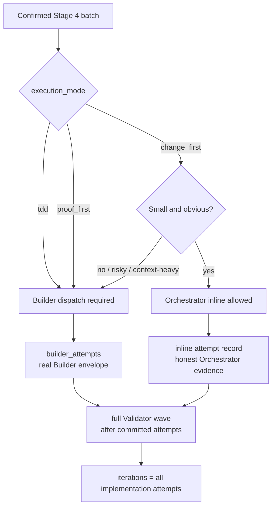

# Issue-to-PR Builder sub-agent dispatch (cross-harness)

## Problem frame

The `issue-to-pr` runbook today treats **Builder** as a role played by the
Orchestrator itself. When a batch lands, Claude-the-Orchestrator does the
reading, editing, command execution, commit creation, and ledger updates.
Validator personas, by contrast, are already dispatched as sub-agents.

The asymmetry has a concrete cost: every file Builder reads, every ledger
section it edits, and every Validator envelope it inspects accumulates in the
Orchestrator's context window. Over a six-batch run (issue #23), this produced
visible bleed: by stage 4 the Orchestrator had loaded many batch files, the
ledger multiple times, the plan multiple times, and several Validator returns.
Builder work should be self-contained per attempt, not spread across the whole
run.

The issue #91 run later exposed a second version of the same boundary problem:
two `change_first` documentation/template batches were edited inline by the
Orchestrator but recorded as if Builder evidence existed, while a later `tdd`
batch was attempted inline before the user caught the contract violation. That
run showed that Stage 4 needs both a dispatch policy and an honest audit model.

The fix is three-part:

1. Add a Stage 3 **Contract Review** gate so plan/DAG drift is caught before
   candidate batches become ledger law.
2. Mirror the Validator pattern on the Builder side for proof-bearing modes:
   `tdd` and `proof_first` dispatch a fresh Builder sub-agent per attempt,
   accept a structured envelope back, and keep implementation context out of
   the Orchestrator.
3. Keep `change_first` lightweight only when it remains small and obvious:
   Orchestrator-inline work is allowed for low-risk non-behavioural edits, but
   it must be recorded in `orchestrator_inline_attempts` and must dispatch
   Builder when scope, risk, uncertainty, or context load rises.

The runbook is harness-portable. Builder dispatch must work on both Claude
Code and Codex, the same way Validator dispatch already does. The runbook must
define the contract without baking in host-specific agent/tool vocabulary.

## Product boundary

This requirements pass is scoped to the `issue-to-pr` runbook.

It is not a generic agent-spawning framework, a generic Builder-agent product,
or a new planning-review framework. The staff-engineer Builder guide is source
material for this workflow, not a document to import wholesale.

The v1 Builder is a **bounded batch implementation mechanic**:

- It implements one confirmed batch attempt.
- It finds and uses existing seams.
- It makes the smallest coherent diff.
- It follows the confirmed `execution_mode`.
- It runs behaviour-focused checks/proofs where appropriate.
- It returns evidence for Validators.
- It fail-stops instead of guessing when readiness, scope, ownership,
  architecture, public contract, or domain language is unclear.

The Builder does not act as Planner, Orchestrator, Contract Reviewer, Validator
persona, Architect, product owner, or final judge of correctness.

V1 must preserve a compact common-case operator path: select the confirmed
batch, choose the required Stage 4 implementation path from `execution_mode`,
record either a Builder envelope or an Orchestrator-inline attempt honestly,
validate the commit, run Validator personas, and advance. Advanced routing for
fail-stops, replacement batches, support-role hints, host/tool problems, or
`change_first` dispatch triggers should surface only when those conditions are
actually hit.

### V1 scope decision

Stage 3 Contract Review remains part of the same v1 delivery as Builder
dispatch.

Builder dispatch intentionally narrows Builder's Work Packet to one confirmed
batch and excludes the full plan, full ledger, raw Validator envelopes, and
other batches' state. Because of that narrow boundary, plan-wide and DAG-wide
drift must be caught before the batch contract becomes ledger law, not pushed
down into Builder Preflight. Contract Review owns the plan/DAG boundary;
Builder Preflight owns residual readiness and scoped implementation risk.

## Resolved language

- **Builder dispatch contract**: runbook-owned prompt shape, required tools,
  preflight rules, authority boundary, and return envelope. It is not a
  durable named `issue-to-pr-builder` capability in v1; each host maps the
  contract to its own agent primitive.
- **Builder Work Packet**: the per-attempt payload the Orchestrator passes to
  Builder under the Builder dispatch contract.
- **Builder Preflight Checklist**: Builder's required read-only readiness and
  deterministic-probe step before edits.
- **Contract Review**: Stage 3 review of the authored plan file plus parsed
  candidate DAG before the batch contract is written to the ledger.
- **Escalated Contract Review**: a higher-rigor Contract Review path for
  deterministic risk triggers.
- **Builder attempt**: one Builder sub-agent dispatch that returns a
  well-formed Builder envelope, whether it commits or Builder-authored
  fail-stops. Every Builder attempt appends one compact `builder_attempts`
  record. `builder_attempts` must never describe Orchestrator-inline work.
- **Orchestrator-inline attempt**: one deliberately inline `change_first`
  implementation attempt by the Orchestrator, recorded in the separate compact
  `orchestrator_inline_attempts` audit lane. It is not a Builder attempt and
  does not produce a Builder envelope.
- **Dispatch-required modes**: `tdd` and `proof_first`. These modes must use an
  isolated Builder sub-agent because the red/green or proof discipline is part
  of the authority contract.
- **Inline-eligible mode**: `change_first`, only while the work remains small,
  low-risk, non-behavioural, and obvious. Inline eligibility is lost when the
  dispatch triggers fire.
- **Dispatch trigger**: a condition that forces `change_first` through Builder
  dispatch anyway, such as exceeding the inline file-count cap, non-doc or
  high-risk paths, broad search/local-law archaeology, uncertainty about the
  edit, heavy Orchestrator context load, or the repeated-inline threshold.
- **Inline file-count cap**: an Orchestrator-inline `change_first`
  implementation attempt may touch at most two files. If the expected edit or
  in-progress diff needs more than two files, inline eligibility is lost and
  the batch routes through Builder dispatch.
- **Repeated-inline threshold**: at most two consecutive Orchestrator-inline
  `change_first` implementation attempts are allowed in Stage 4. A third
  consecutive inline-eligible `change_first` attempt must route through Builder
  dispatch unless the user explicitly confirms a one-off inline exception,
  which the inline attempt note must record.
- **Host Builder readiness failure**: an Orchestrator-owned block before
  Builder exists because the host cannot provide the required fresh sub-agent
  capabilities. It is recorded as `host-builder-tools-unavailable`. In v1 this
  gate applies before any Stage 4 implementation attempt, including
  Orchestrator-inline `change_first`, because any committed attempt can later
  require Builder-only P0/P1 repair.
- **Builder infrastructure failure**: a post-dispatch host, tool, permission,
  dispatch, serialization, or schema failure before a well-formed Builder
  envelope exists. Infrastructure failures block the workflow outside the
  batch iteration cap and are not persisted as `builder_attempts`.
- **Implementation attempt**: any first attempt to satisfy the confirmed batch
  goal, either a Builder implementation attempt or an Orchestrator-inline
  `change_first` attempt.
- **Repair attempt**: a later Builder attempt aimed at closing exactly one
  open P0/P1 finding signature. Repairs are never Orchestrator-inline; the
  open P0/P1 finding proves the next edit needs Builder isolation.
- **Mechanic Discipline**: the Builder-specific behaviour rules that keep
  implementation local, reviewable, and non-architectural.
- **Route hint**: a non-authoritative next-owner hint in fail-stop envelopes.
  Status remains the workflow transition; `route_hint` says who should handle
  the next decision.

Do not introduce "Ralph Gate" as Issue-to-PR vocabulary. The existing
P0/P1-gated Validator persona loop already owns that concept.

## Scope

### In scope

- Builder sub-agent dispatch contract, expressed without host-specific
  primitive names.
- Builder Work Packet shape.
- Builder authority boundary derived from the confirmed batch contract.
- Builder Preflight Checklist with:
  - readiness check, and
  - deterministic probe catalog.
- "No readiness, no build" rule as part of preflight.
- Mechanic Discipline:
  - find an existing seam,
  - make the smallest coherent diff,
  - avoid opportunistic cleanup,
  - avoid speculative abstractions,
  - avoid generic helper dumping grounds,
  - avoid dependency changes unless explicitly scoped,
  - preserve local domain/system language,
  - report uncertainty instead of hiding it.
- Local Law Read Order for target repo/package governance documents.
- Public Contract Rule: public contract changes only when explicitly named in
  the confirmed batch contract and covered by checks/proofs.
- Domain Language Rule: preserve existing language and use provisional wording
  only when a term is not yet owned.
- Enriched Builder return envelope.
- Compact persisted `builder_attempts` records in the ledger.
- A separate compact `orchestrator_inline_attempts` audit lane for
  Orchestrator-inline `change_first` implementation attempts.
- Stage 4 Builder dispatch policy:
  - `tdd` and `proof_first` always require Builder dispatch,
  - `change_first` may be Orchestrator-inline only while bounded and obvious,
  - `change_first` dispatches Builder when dispatch triggers fire.
- Rich Builder evidence passed to Validator personas without dumping the full
  report into the ledger.
- `attempt_type: implementation | repair`.
- `route_hint` values for blocked routing.
- `suggested_validator_focus` as a required array, empty allowed.
- `implementation_steps` as Builder evidence.
- Stage 3 Contract Review before batch confirmation.
- Machine-readable Stage 3 findings using `batch_id: stage-3`, closed by
  `resolution: plan-revision <sha>` once the plan/DAG revision lands.
- Preflight fail-stop state transition: well-formed preflight fail-stops
  record the Builder attempt and block the current batch with
  `final_verdict: blocked-for-user`; replacement batch mechanics are handled by
  the later `supersedes` flow.
- A one-way `supersedes` batch field for replacement batches created after a
  blocked batch exposes a stale or unsafe contract.
- Iteration-counter semantics: total implementation attempts count toward the
  5-cap, whether they are Builder attempts or Orchestrator-inline attempts;
  Builder infrastructure failures block outside the batch cap.
- Runbook prose updates to:
  - `## Role boundaries`,
  - `### Stage 3: decompose`,
  - `### Stage 4: batch-loop`,
  - `## Inner loop`,
  - `## Escape hatches`,
  - Stage 4 Builder dispatch policy,
  - Builder/Validator prompt handoff text.
- Helper/schema updates in `decompose.ts`.
- Ledger template updates.

### Deferred for later

- Separate Surgeon actor/schema. V1 keeps Builder as the actor and uses
  `attempt_type: repair` for Surgeon-like discipline.
- Full contracts for Context Scout, Architect, Test Scout, Fixture Builder,
  or other support roles. V1 only uses these as `route_hint` values.
- Generic Builder-agent artifact outside Issue-to-PR.
- Builder persistence across iterations. V1 is fresh-per-attempt.
- Mid-batch telemetry such as file-read counts, edit attempts, duration, or
  command counts beyond compact `builder_attempts`.
- TODO/self-check prompt details. These can be included in executable Builder
  prompt wording without becoming requirements-doc schema.
- Dedicated helper command for preflight probes. V1 may specify probes in
  runbook prose unless repeated friction proves a helper is needed.

### Outside this product's identity

- Generic agent-spawning framework.
- Codex-specific or Claude-specific tool wiring instructions.
- Generic planning-review framework.
- A durable "Ralph Gate" term.
- A reusable staff-engineer Builder-agent guide before Issue-to-PR proves the
  contract in real runs.

## Actors

- **A1: Orchestrator.** Walks the six Issue-to-PR stages. Owns the ledger.
  Dispatches Contract Reviewer, Builder, and Validator personas. During Stage
  4, it implements only inline-eligible `change_first` batches and records
  those attempts honestly; otherwise it dispatches Builder instead of playing
  Builder itself.
- **A2: Contract Reviewer.** Read-only Stage 3 reviewer. Reviews the authored
  plan and parsed candidate DAG before batches are written to the ledger.
  Returns the same finding envelope shape as Validator personas.
- **A3: Builder sub-agent.** Fresh per attempt. Receives one Builder Work
  Packet, runs preflight, reads authorized files, performs at most one commit,
  and returns one envelope.
- **A4: Validator personas.** Read-only reviewers. They receive the batch
  contract, diff, relevant findings, and rich Builder evidence. They do not
  fix, choose modes, or re-rank severity.
- **A5: User.** Gates AC confirmation, DAG/mode confirmation, escape-hatch
  decisions, accepted-risk decisions, and replacement batch/supersedes
  decisions.

Support roles such as `architect`, `context-scout`, `test-scout`, and
`fixture-builder` are route hints only in v1. They do not become first-class
Issue-to-PR actors until separate contracts exist.

## Stage 4 dispatch policy

Stage 4 chooses the implementation path from the confirmed `execution_mode`.
The policy is intentionally asymmetric: proof-bearing modes require isolation,
while `change_first` stays lightweight only while it is genuinely low-risk.



| Mode | Stage 4 path | Audit lane |
| --- | --- | --- |
| `tdd` | Builder dispatch required | `builder_attempts` |
| `proof_first` | Builder dispatch required | `builder_attempts` |
| `change_first` | Orchestrator-inline allowed only while small and obvious; dispatch Builder when triggers fire | `orchestrator_inline_attempts`, or `builder_attempts` if dispatched |

The Orchestrator must dispatch Builder for a `change_first` batch when any
dispatch trigger fires:

- the expected edit or in-progress diff touches more than two files,
- the batch touches non-doc, behavioural, public-contract, governance, or
  high-risk paths,
- the edit requires broad search, local-law archaeology, or substantial
  discovery,
- the Orchestrator is uncertain about the correct edit,
- the Orchestrator has already accumulated substantial run context,
- the repeated-inline threshold would be exceeded: after two consecutive
  Orchestrator-inline `change_first` implementation attempts, the next
  inline-eligible `change_first` attempt routes through Builder unless the
  user explicitly confirms a one-off inline exception.

`builder_attempts` means exactly one thing: an isolated Builder sub-agent was
dispatched and returned a well-formed Builder envelope. If the Orchestrator
edits `batch.files` inline, the ledger must record a separate inline attempt
in `orchestrator_inline_attempts` with the implementation commit evidence
instead of widening `builder_attempts` or relying only on lifecycle notes.

Every committed implementation attempt, whether Builder-dispatched or
Orchestrator-inline, must have its own implementation commit, its own compact
attempt record, a ledger-only attempt checkpoint committed before Validator
dispatch, and a subsequent Validator dispatch. Inline work changes the evidence
source, not the validation requirement. Validator dispatch here means the same
full Stage 4 always-on Validator wave used for Builder commits; inline
docs/template commits do not get a reduced or skipped review path.
Validator audit evidence should reuse the existing packet `dispatch_evidence`
concept, but packet rendering alone is not completion evidence: the durable
record must also show the completed wave outcome, including clean
`findings: []` waves.

## Builder contract

### Builder identity

Builder may choose how to implement a known decision inside the confirmed batch
contract. Builder may not make the decision.

Builder may decide:

- which existing function, class, service, test, or fixture seam to extend,
- how to name local variables consistently with nearby code,
- which nearby behaviour-focused tests to add or update,
- how to preserve an existing public contract,
- how to make the smallest coherent diff within `batch.files`.

Builder must fail-stop when the missing or unsafe detail is:

- architectural,
- ownership-related,
- product-defining,
- domain-defining,
- public-contract-changing,
- security-sensitive,
- data-integrity-sensitive,
- dependency-changing,
- outside the confirmed batch scope.

### Authority boundary

The ledger remains the source of authority.

Builder may:

- edit only files listed in `batch.files`,
- create a file only when that file is already listed in `batch.files`,
- make exactly one commit when preflight passes,
- run targeted checks relevant to the batch,
- report non-authoritative scope suggestions when preflight fails.

Builder must not:

- add files outside `batch.files`,
- change acceptance criteria,
- change batch dependencies,
- relax execution mode,
- introduce new durable domain language,
- update `AGENTS.md`, `CONTEXT.md`, package maps, ADRs, or other governance
  docs unless those files are explicitly in `batch.files`,
- make public contract changes unless explicitly authorized by the batch,
- introduce dependencies unless explicitly authorized by the batch.

### Required Builder capabilities

The required Builder tool set is a host-neutral capability contract, not a
literal Claude Code or Codex tool list.

The host must be able to instantiate a fresh Builder sub-agent that can:

- read and search target-repo files,
- edit files authorized by the confirmed `batch.files` contract,
- run deterministic repo-local checks and probes,
- inspect git status and commit diffs,
- create exactly one commit for a successful attempt,
- return the structured Builder envelope.

The host must keep these capabilities outside Builder's authority:

- ledger writes,
- branch changes,
- pushes, PR creation, or GitHub calls,
- network access, secrets, or external services,
- governance edits unless the governance files are explicitly listed in
  `batch.files`.

V1 does not require every host to enforce identical per-file sandboxing.
Orchestrator must independently validate Builder's returned commit by deriving
touched files from the commit diff and checking them against `batch.files`.

Before any Stage 4 implementation attempt, including Orchestrator-inline
`change_first`, Orchestrator verifies host Builder readiness or uses a
still-valid readiness result emitted by the host adapter. If the current host
cannot provide a fresh sub-agent with the required capabilities and authority
boundary, Orchestrator records `host-builder-tools-unavailable` before marking
the batch `in-progress` and does not fall back to Orchestrator-direct
implementation. This keeps the v1 invariant simple: Stage 4 does not create an
implementation commit unless it can also dispatch Builder for any required
P0/P1 repair.

### Local Law Read Order

Before editing, Builder reads local law in this order:

1. target repo root agent instructions, when present,
2. nearest package `AGENTS.md`, when present,
3. nearest package `CONTEXT.md`, when present,
4. package map, ADRs, runbooks, or governance docs only when referenced by
   local law or triggered by package-boundary/public-contract work,
5. every file in `batch.files`,
6. nearby tests and implementation needed to understand the existing seam.

Builder should not do whole-repo archaeology. If substantial discovery is
required, it returns a fail-stop envelope with `route_hint: "context-scout"` or
another appropriate route hint.

### Mechanic Discipline

Builder must:

- find the existing seam before editing,
- prefer modifying existing package-local code over adding new abstractions,
- keep diffs small and boring,
- avoid unrelated formatting and opportunistic cleanup,
- avoid generic `utils`, `helpers`, or `common` dumping grounds unless the
  package already uses that pattern and the batch explicitly fits it,
- add or update behaviour-focused tests when behaviour changes,
- run targeted checks when possible,
- report checks that could not be run,
- leave enough evidence for Validator personas to review meaningfully.

For high-risk batches, Builder must explicitly consider obvious failure modes
such as malformed input, partial writes, idempotency, permission failure,
rollback, data loss, privacy exposure, and contract drift. Builder does not
need to solve every possible failure mode, but it must not ignore obvious P0/P1
risks.

Builder commands and probes must be deterministic, repo-local, and
non-destructive by default. They must not use network access, environment
secrets, external services, or write outside the target repo unless that
capability is explicitly authorized by the confirmed batch contract and covered
by checks/proofs; otherwise Builder fail-stops.

### Public Contract Rule

Builder may change a public contract only when the confirmed batch contract:

- explicitly names the public surface, and
- includes acceptance tests or checks that cover the contract change.

Public contracts include exported symbols, API request/response shapes, CLI
flags/output, schemas, event payloads, config file shapes, environment variable
expectations, migration manifest formats, and package boundaries.

If a public contract change appears necessary but is not explicitly authorized,
Builder returns `status: fail-stop-out-of-scope` or `fail-stop-preflight` with
`route_hint: "contract-review"` or `route_hint: "architect"`.

### Domain Language Rule

Builder preserves existing target-repo language from `CONTEXT.md`, `AGENTS.md`,
package maps, ADRs, nearby tests, and nearby code.

If Builder needs a term that is not clearly owned, it may use provisional
language in the envelope and must not canonize it in governance docs unless
that governance edit is explicitly in `batch.files`.

If the missing term affects ownership, API, behaviour, or durable meaning,
Builder fail-stops with `route_hint: "context-scout"` or
`route_hint: "architect"`.

## Key flows

### F0: Stage 3 Contract Review

1. Stage 2 writes the authored plan file.
2. Stage 3 invokes `decompose.ts <plan-path>` to parse candidate batches.
3. Orchestrator dispatches a read-only Contract Reviewer with:
   - the plan file path/content,
   - the user-confirmed AC list,
   - the parsed candidate DAG,
   - the candidate contract digest,
   - the runbook's Contract Review rubric.
4. Default review is one Contract Reviewer.
5. Escalated Contract Review runs only when deterministic triggers fire:
   rename, identity flip, migration, public API, auth/data/privacy,
   many-file changes, or cross-package governance.
6. Contract Review returns the existing Validator envelope shape:
   `{"reviewer":"<persona>","findings":[],"residual_risks":[],"testing_gaps":[]}`.
7. P0/P1 findings block Stage 3. Orchestrator records them in
   `## Findings data` with `batch_id: stage-3`, then sends the plan back for
   revision.
8. Plan revisions close Stage 3 findings with `status: fixed` and
   `resolution: plan-revision <sha>`.
9. Contract Review always re-runs after a plan revision.
10. The Stage 3 review loop has a 5-cycle cap. Hitting the cap fail-stops and
    asks the user.
11. P2/P3 findings are surfaced in the confirmation prompt but do not block
    ledger write.

### F0.5: Stage 4 implementation path selection

1. Orchestrator selects the next pending batch in topological order.
2. Orchestrator verifies host Builder readiness, or uses a still-valid
   readiness result emitted by the host adapter, before marking the batch
   `in-progress` or editing implementation files. If readiness fails, record
   `host-builder-tools-unavailable` and stop without incrementing
   `iterations`.
3. Orchestrator reads the confirmed batch `execution_mode`.
4. If `execution_mode` is `tdd` or `proof_first`, Orchestrator must route to
   Builder dispatch before any implementation-file edit.
5. If `execution_mode` is `change_first`, Orchestrator checks whether the work
   remains inline-eligible: small, obvious, low-risk, non-behavioural, and not
   context-heavy. The repeated-inline threshold is part of this check.
6. If any dispatch trigger is present, Orchestrator routes the `change_first`
   batch to Builder dispatch.
7. If no dispatch trigger is present, Orchestrator may run the bounded inline
   path and must record the resulting implementation commit in the inline
   `orchestrator_inline_attempts` audit lane.
8. After any committed implementation attempt, Orchestrator validates the
   implementation commit, writes the compact attempt record, increments
   `iterations`, and commits a ledger-only attempt checkpoint before rendering
   Validator packets.
9. Every committed implementation attempt, from either path, routes to the full
   Stage 4 always-on Validator wave from durable attempt-checkpoint state, with
   the relevant commit diff and attempt evidence.
10. Once a P0/P1 Validator finding exists, repair attempts route through
   Builder dispatch. The finding itself proves the next change is no longer an
   obvious inline-only edit. There is no docs-only or tiny-fix inline repair
   exception for P0/P1 findings.

### F1: Builder implementation attempt

This flow applies to `tdd`, `proof_first`, and any `change_first` batch whose
dispatch triggers fire.

1. Orchestrator reuses the host Builder readiness result from F0.5 if it is
   still valid; otherwise it rechecks readiness before dispatch. If readiness
   fails, Orchestrator records the host-level fail-stop
   `host-builder-tools-unavailable` and does not mark any batch in progress.
   This is a host Builder readiness failure, not a Builder attempt or Builder
   infrastructure failure, and it does not increment `iterations`.
2. Orchestrator marks `status: in-progress` in the ledger and commits the
   lifecycle checkpoint. This is an Orchestrator-owned ledger commit, separate
   from Builder.
3. Orchestrator dispatches a Builder sub-agent with a Builder Work Packet
   using `attempt_type: implementation`.
4. Builder runs the Builder Preflight Checklist.
5. If preflight fails, Builder returns a fail-stop envelope without editing or
   committing.
6. If preflight passes, Builder reads authorized files, implements the batch,
   makes exactly one commit, and returns the envelope.
7. Orchestrator verifies:
   - `commit_sha` exists when `status: committed`,
   - touched files are independently derived from the commit diff and
     authorized by `batch.files`,
   - the derived touched files match envelope `files_touched`,
   - any full diff content read is limited to Builder authority checks,
     envelope integrity, and lightweight correctness sanity checks,
   - any correctness sanity concern is forwarded only as transient Validator
     focus, not persisted as a ledger entry or recorded as an
     Orchestrator-authored finding or correctness gate,
   - pre-Validator gating happens only for Builder authority breaches or
     malformed envelopes,
   - the envelope is well-formed,
   - the compact attempt record can be appended to `builder_attempts`.
8. If the envelope is well-formed, Orchestrator records the attempt, appends
   the SHA to `builder_commits` for committed attempts, increments
   `iterations`, and commits a ledger-only attempt checkpoint. For committed
   attempts, this checkpoint happens after Orchestrator validates the
   implementation commit and before Validator packet rendering. For
   Builder-authored fail-stops, this checkpoint records the fail-stop attempt
   before routing according to F5. If the envelope is malformed or cannot be
   validated because of host/tool/schema drift, Orchestrator records a Builder
   infrastructure failure outside the batch cap.
9. For committed attempts, Orchestrator dispatches the full Stage 4 always-on
   Validator wave with rich Builder evidence. For fail-stop attempts,
   Orchestrator routes according to F5 without dispatching Validators.

### F1b: Orchestrator-inline `change_first` implementation attempt

This flow applies only when `execution_mode: change_first` remains
inline-eligible after F0.5.

1. Orchestrator marks `status: in-progress` in the ledger and commits the
   lifecycle checkpoint.
2. Orchestrator reads only the local law and target files needed for the
   bounded non-behavioural edit.
3. If a dispatch trigger appears before or during the edit, Orchestrator stops
   the inline path before committing implementation work and routes to Builder
   dispatch instead. This includes discovering that the edit needs more than
   two touched files.
4. If the edit remains inline-eligible, Orchestrator edits only `batch.files`
   and creates one implementation commit.
5. Orchestrator records a compact `orchestrator_inline_attempts` item with the
   commit SHA, touched files, and a short note. `builder_attempts` and
   `builder_commits` remain empty for this attempt.
6. The inline attempt increments `iterations`, counts toward the same batch cap
   as Builder attempts, and is committed in a ledger-only attempt checkpoint
   after Orchestrator validates the implementation commit and before Validator
   packet rendering.
7. Orchestrator dispatches the full Stage 4 always-on Validator wave with the
   commit diff and compact inline evidence, not a fabricated Builder envelope.

### F2: Builder repair attempt

This flow applies after any committed implementation attempt, whether the
attempt was Builder-dispatched or Orchestrator-inline.

1. After Validator personas return open P0/P1 findings, Orchestrator
   dispatches a fresh Builder sub-agent with `attempt_type: repair`. The
   Orchestrator must not repair P0/P1 findings inline.
2. The Work Packet includes exactly one target finding signature.
3. Builder reruns preflight.
4. Builder fixes exactly one open P0/P1 finding by signature, makes one commit,
   and returns the envelope.
5. Builder must not address P2/P3 debt, opportunistic cleanup, unrelated
   refactors, or additional findings during a repair attempt.
6. If the repair requires broader scope, Builder fail-stops with an appropriate
   `route_hint`.
7. If the envelope is well-formed, Orchestrator records the attempt, increments
   `iterations`, and commits a ledger-only attempt checkpoint. For committed
   repair attempts, this checkpoint happens after Orchestrator validates the
   repair commit and before Validator packet rendering. For Builder-authored
   fail-stops, this checkpoint records the fail-stop attempt before routing
   according to F5. If the envelope is malformed or cannot be validated because
   of host/tool/schema drift, Orchestrator records a Builder infrastructure
   failure outside the batch cap.
8. For committed repair attempts, Orchestrator dispatches the full Stage 4
   always-on Validator wave again. For fail-stop repair attempts, Orchestrator
   routes according to F5 without dispatching Validators.

### F3: Builder Preflight Checklist

Preflight is required before any Builder edit. It is a bounded read-only
discovery step, not planning permission.

Preflight has two parts.

#### Readiness check

Builder verifies:

- task and attempt type are understood,
- acceptance criteria are present,
- package ownership is clear enough for this batch,
- an existing seam is found or a missing `batch.files` path can be created
  without stale-path, typo, wrong-package, or semantic-authorization risk,
- test/proof strategy is clear enough for the `execution_mode`,
- public API impact is `none` or explicitly authorized,
- domain language is existing or safely provisional,
- required fixtures/types/env are available or not needed,
- targeted checks can be run or the inability to run them is explainable.

No readiness, no build. If readiness fails, Builder returns a fail-stop
envelope.

#### Deterministic probes

Builder may run only deterministic probes from the runbook-defined probe
catalog. V1 catalog:

- **Rename path probe:** old path literal -> new path literal.
- **Identity flip probe:** old package/plugin identity literal -> new identity
  literal.
- **Command/path reference probe:** command or path literal named in goal,
  rationale, or acceptance tests.
- **Public API probe:** exported symbol or manifest surface named in the batch
  contract.
- **Package governance probe:** package map, `AGENTS.md`, `CONTEXT.md`, and
  package-knowledge references for package-boundary work.

If a probe finds relevant matches outside `batch.files`, Builder does not edit
or commit. It returns `status: fail-stop-preflight` with `blockers`,
`probe_results`, `route_hint`, and optional non-authoritative
`suggested_scope_changes`.

### F4: Builder Work Packet shape

The Orchestrator passes the Builder sub-agent:

- issue number and target repo,
- `attempt_type: implementation | repair`,
- target finding id/signature for repair attempts,
- batch contract verbatim:
  - `id`,
  - `name`,
  - `goal`,
  - `files`,
  - `depends_on`,
  - `execution_mode`,
  - `acceptance_tests`,
  - `ac_mapping`,
  - `rationale`,
  - optional `supersedes`,
- compact prior `builder_attempts` for this batch,
- current `builder_commits` for this batch,
- current iteration number,
- `## Findings data` rows for this batch only,
- Local Law Read Order,
- authority boundary,
- Mechanic Discipline,
- Builder Preflight Checklist,
- return envelope schema.

The Work Packet does not include the full plan, full ledger, raw Validator
envelopes, or other batches' state. Stage 3 Contract Review owns plan-wide
reasoning; Builder owns one confirmed batch attempt.

### F5: Builder return envelope

Builder returns a structured envelope:

```json
{
  "status": "committed | fail-stop-preflight | fail-stop-out-of-scope | fail-stop-execution-mode-mismatch | fail-stop-read-failed | fail-stop-other",
  "attempt_type": "implementation | repair",
  "target_finding_signature": "<signature for repair attempts, null otherwise>",
  "commit_sha": "<full SHA when status is committed, null otherwise>",
  "files_touched": ["<repo-relative path>", "..."],
  "route_hint": "human | contract-review | architect | context-scout | test-scout | fixture-builder | validator | other | null",
  "blockers": [
    {"path": "<repo-relative path or null>", "reason": "<why this blocks the authorized attempt>"}
  ],
  "probe_results": [
    {"probe": "<catalog probe id>", "query": "<literal searched>", "matches": 0}
  ],
  "suggested_scope_changes": [
    {"path": "<repo-relative path>", "reason": "<non-authoritative scope hint>"}
  ],
  "implementation_steps": ["<compact step>", "..."],
  "existing_seams_used": ["<symbol/module/path>", "..."],
  "tests_run": [
    {"command": "<command or runner>", "result": "passed | failed | not-run", "summary": "<short summary>"}
  ],
  "assumptions": ["<assumption>", "..."],
  "risks": ["<risk>", "..."],
  "deferred": ["<deferred item>", "..."],
  "suggested_validator_focus": ["<focus item>", "..."],
  "notes": "<one to three sentence ledger summary>"
}
```

Required array fields may be empty. `suggested_validator_focus` is required
and may be `[]`; absence is malformed.

Status owns workflow transition. `route_hint` owns next-owner routing.

Orchestrator validation on receipt:

- `committed`: verify `commit_sha` exists in git, derive touched files from the
  commit diff, compare the derived list to envelope `files_touched`, and verify
  the derived files are authorized by `batch.files`. Orchestrator may read full
  commit diff content for Builder authority checks, envelope integrity, and
  lightweight correctness sanity checks. Correctness sanity concerns may only
  annotate transient Validator focus; they are not ledger entries,
  Orchestrator-authored findings, or correctness gates. Orchestrator gates
  before Validator dispatch only when the diff shows a Builder authority breach
  or malformed envelope. A mismatch between the derived file list and envelope
  `files_touched` is treated as malformed.
- `fail-stop-preflight`: record the attempt, block the original batch, and
  repair through a replacement batch with `supersedes`.
- `fail-stop-out-of-scope`: route through the public-API/out-of-scope escape
  hatch.
- `fail-stop-execution-mode-mismatch`: route through the
  execution-mode-mismatch escape hatch.
- `fail-stop-read-failed`: surface stale batch contract or missing prior
  dependency.
- `fail-stop-other`: surface the notes, blockers, and route hint to the user.

All well-formed Builder envelopes, including Builder-authored fail-stops,
count as Builder attempts and implementation attempts. They increment
`iterations`.

Malformed envelopes, missing required fields, dispatch failures,
tool-permission mismatches, host serialization failures, and schema parse
failures are Builder infrastructure failures. They do not append
`builder_attempts`, do not increment `iterations`, and do not dispatch
Validators. Orchestrator surfaces the infrastructure failure, any reachable
commit or working-tree change, and the host/schema evidence to the user before
continuing.

### F6: Compact implementation audit lanes

Every Builder attempt appends one compact attempt record to the batch's
`builder_attempts`. Builder infrastructure failures are recorded outside the
batch cap and do not append `builder_attempts`.

Persisted attempt records contain:

- `attempt_type`,
- `status`,
- `commit_sha`,
- `files_touched`,
- `route_hint`,
- `blockers`,
- `probe_results`,
- `notes`.

Committed Builder attempts also append their SHA to `builder_commits`.
Fail-stop attempts use `commit_sha: null` and do not append to
`builder_commits`. `builder_commits` remains Builder-only; Orchestrator-inline
commits are identified through `orchestrator_inline_attempts`.

Rich evidence fields from the envelope are passed to Validator personas and
may be summarized in ledger Notes, but are not persisted wholesale in
`builder_attempts`.

Every Orchestrator-inline `change_first` implementation attempt appends one
compact record to `orchestrator_inline_attempts`. The record must identify the
implementation commit, the files touched, and a short note explaining why the
inline path was valid. It must not reuse `builder_attempts` or
`builder_commits` because no Builder envelope exists.

`orchestrator_inline_attempts` is committed-only and uses exactly this compact
shape:

```yaml
orchestrator_inline_attempts:
  - commit_sha: <sha>
    files_touched: []
    notes: "<why inline was valid, including any user-confirmed exception>"
```

It does not include `attempt_type`, `status`, `route_hint`, `blockers`, or
`probe_results`. If a dispatch trigger appears before an inline implementation
commit, Orchestrator routes to Builder dispatch and appends no
`orchestrator_inline_attempts` item.

Any implementation attempt that changes `batch.files` must produce exactly one
implementation commit with an honest commit message identifying the batch and
attempt path. The matching compact attempt record is the ledger evidence for
that commit. The compact attempt record must be committed in a ledger-only
attempt checkpoint after Orchestrator validates the implementation commit and
before Validator packet rendering. The attempt checkpoint may touch only the
per-issue ledger and must leave the working tree clean. A committed attempt is
not complete until the full Stage 4 always-on Validator wave has received the
commit diff plus the relevant Builder or inline evidence, and the ledger has
durable compact evidence for both the Validator packet `dispatch_evidence` and
the completed wave outcome. The absence of `## Findings data` rows is not
sufficient by itself to prove that a clean Validator wave ran.

`decompose.ts` must validate:

- every non-null `builder_attempts[*].commit_sha` appears in
  `builder_commits`,
- every `builder_commits` SHA appears in exactly one committed
  `builder_attempts` item,
- every `orchestrator_inline_attempts` item has exactly `commit_sha`,
  `files_touched`, and `notes`,
- every `orchestrator_inline_attempts[*].commit_sha` exists, is unique within
  the inline lane, and touches only confirmed `batch.files`,
- every `orchestrator_inline_attempts[*].files_touched` matches its commit
  diff,
- every committed Builder or Orchestrator-inline attempt is recorded in a
  ledger-only attempt checkpoint before any Validator packet is rendered for
  that attempt,
- `iterations` equals the number of Builder attempts plus inline attempts for
  terminal batches,
- Builder-authored fail-stop attempts and Orchestrator-inline attempts are
  counted toward the 5-cap,
- Builder infrastructure failures are not counted toward the 5-cap,
- terminal committed batches have at least one committed Builder attempt or
  committed inline attempt,
- every committed implementation attempt has durable completed Validator wave
  evidence, reusing the existing packet `dispatch_evidence` shape plus a
  compact completion outcome rather than introducing a new first-class
  `validator_waves` field up front.

### F7: Replacement batches and `supersedes`

If preflight finds relevant surfaces outside `batch.files`, the original batch
is marked:

- `status: blocked`,
- `final_verdict: blocked-for-user`.

The replacement batch:

- uses `supersedes: <blocked-batch-id>`,
- may only supersede a blocked batch,
- preserves every AC index from the superseded batch's `ac_mapping`,
- may change files, acceptance tests, and execution mode,
- must include rationale prose when changing tests or mode.

Dependency behavior after replacement:

- `supersedes` remains one-way audit metadata, not an implicit dependency
  resolver.
- Pending batches that depend on the blocked original batch must have
  `depends_on` rewritten from the original batch id to the replacement batch
  id.
- Rewriting dependent `depends_on` values mutates the confirmed batch contract,
  so Orchestrator must rerun helper validation, recompute digests, and ask the
  user to confirm the replacement DAG before Stage 4 continues.
- If any dependent of the blocked original batch is already `in-progress`,
  `converged`, or `accepted-risk`, Orchestrator must stop and ask the user
  instead of rewriting it automatically.
- If a dependent already depends on both the original and replacement, helper
  validation must reject the duplicate dependency before confirmation.

The replacement batch goes through the same confirmation and helper validation
path as any other batch.

### F8: Final-review patch proposals

When final review finds an open P0/P1 that can be fixed through a patch-batch,
Builder may produce a **candidate patch proposal** from ledger and code
evidence.

Builder does not authorize the patch contract.

The Orchestrator owns:

- helper validation,
- user confirmation,
- appending the patch batch to the ledger,
- digest recomputation,
- return to stage 4.

If patch proposal requires architecture, public-contract, ownership, domain, or
scope decisions beyond local evidence, Builder fail-stops with `route_hint`
instead of proposing a contract.

## Acceptance examples

- **AE1:** Stage 3 Contract Review runs before batch confirmation. It sees a
  rename plus identity flip and flags P1 findings for missing plan surfaces.
  Orchestrator records `batch_id: stage-3` rows, revises the plan, closes rows
  with `resolution: plan-revision <sha>`, and reruns Contract Review.
- **AE2:** Builder receives an implementation Work Packet, reads local law,
  finds an existing seam, completes readiness, runs deterministic probes,
  commits one scoped diff, and returns `status: committed` with
  `implementation_steps`, `existing_seams_used`, `tests_run`, and
  `suggested_validator_focus: []`.
- **AE3:** Builder Preflight on a rename batch finds live references outside
  `batch.files`. Builder returns `status: fail-stop-preflight`,
  `commit_sha: null`, `route_hint: "contract-review"`, blockers, probe
  results, and suggested scope changes. Orchestrator records the failed
  attempt, increments `iterations`, blocks the batch, and routes repair through
  a replacement batch with `supersedes`.
- **AE4:** A repair attempt receives one target P0 finding signature. Builder
  fixes only that finding, makes one commit, and returns evidence. Validator
  personas receive the rich Builder evidence.
- **AE5:** A Builder attempt discovers that a public API surface must change,
  but the batch contract does not name that public surface. Builder returns a
  fail-stop envelope with `route_hint: "architect"` or
  `route_hint: "contract-review"` and does not edit.
- **AE6:** A final-review P1 can be fixed by a two-file patch. Builder
  produces a candidate patch proposal, `decompose.ts --patch-proposal`
  validates it, the user confirms it, and Orchestrator appends the patch batch.
- **AE7:** Runbook works on Codex. Codex uses its available agent primitive to
  instantiate the runbook's Builder dispatch contract. The runbook does not
  name Codex's primitive directly.
- **AE8:** On a host that cannot grant the required Builder tool set,
  Orchestrator selects a Stage 4 batch, including an inline-eligible
  `change_first` batch, then records an Orchestrator-owned
  `host-builder-tools-unavailable` fail-stop before marking it `in-progress`,
  editing implementation files, or dispatching Builder. There is no fallback
  to Orchestrator-direct Builder, and the batch iteration counter is not
  incremented.
- **AE9:** Builder dispatch reaches the host but returns a malformed envelope
  because of schema or serialization drift. Orchestrator records a Builder
  infrastructure failure, surfaces any reachable commit or working-tree change
  to the user, does not append `builder_attempts`, does not increment
  `iterations`, and does not dispatch Validators.
- **AE10:** A `tdd` batch is selected. Orchestrator must dispatch Builder
  before any implementation-file edit. If it starts editing inline, the
  workflow has violated the Stage 4 dispatch policy and must reset or repair
  that partial work before continuing.
- **AE11:** A one-file docs/template `change_first` batch is small, obvious,
  and low-risk. Orchestrator edits it inline, creates one implementation
  commit, records a compact `orchestrator_inline_attempts` item, leaves
  `builder_attempts` and `builder_commits` empty for that attempt, increments
  `iterations`, and dispatches the full Stage 4 always-on Validator wave with
  the diff plus inline evidence.
- **AE12:** A committed implementation attempt exists without a matching
  compact attempt record, without a committed ledger-only attempt checkpoint,
  or without a full post-commit Validator wave. The batch cannot converge until
  the attempt checkpoint and Validator wave are completed.
- **AE12b:** A committed implementation attempt has `findings: []` after the
  Validator wave, but no durable completed-wave evidence tied to the reviewed
  commit and personas. The batch cannot converge because absence of findings is
  not proof that the Validator wave completed.
- **AE13:** A `change_first` batch starts as docs work but requires broad
  search, touches three files, or reaches high-risk paths. Orchestrator must
  stop the inline path and dispatch Builder; the committed result is recorded
  as `builder_attempts`, not as inline work.
- **AE14:** Two consecutive `change_first` batches have already been handled
  Orchestrator-inline. The next `change_first` batch looks small and obvious,
  but Orchestrator must dispatch Builder unless the user explicitly confirms a
  one-off inline exception. If the user confirms the exception, the
  `orchestrator_inline_attempts` note records the exception rationale.
- **AE15:** A docs-only Orchestrator-inline attempt receives an open P1
  Validator finding. Even if the fix appears to be a one-line docs tweak,
  Orchestrator must dispatch Builder with `attempt_type: repair`; it must not
  repair the finding inline.
- **AE16:** A Builder or Orchestrator-inline implementation commit exists, but
  the compact attempt record has not been committed to the ledger yet.
  Orchestrator must commit the ledger-only attempt checkpoint before rendering
  Validator packets; Validator dispatch from uncommitted in-memory attempt
  evidence is invalid.

## Success criteria

- Orchestrator context window does not grow per batch by the size of
  implementation files, full Builder reports, raw Validator envelopes, repeated
  plan rereads, or repeated ledger rereads. Orchestrator may read full commit
  diff content for Builder authority checks, envelope integrity, and
  lightweight correctness sanity checks only. Sanity concerns may annotate
  transient Validator focus, but Validators own findings and correctness gates.
  Only compact digests/evidence needed for routing remain in Orchestrator
  context.
- Builder dispatch is identical in contract shape across Claude Code and
  Codex, even if each host maps it to a different primitive.
- Stage 4 host Builder readiness is verified, or a still-valid host-adapter
  readiness result is reused, before any implementation attempt can start.
  Readiness failure stops before the batch is marked `in-progress` or any
  implementation file is edited, including inline-eligible `change_first`.
- Stage 4 dispatch policy is visible before the inner loop: `tdd` and
  `proof_first` require Builder dispatch, and `change_first` is inline-only
  while bounded, obvious, and low-risk.
- `change_first` repeated-inline routing is deterministic: at most two
  consecutive Orchestrator-inline implementation attempts are allowed before
  Builder dispatch or an explicit user-confirmed inline exception.
- `change_first` inline file-count routing is deterministic:
  Orchestrator-inline implementation attempts may touch at most two files.
  More than two expected or actual touched files routes through Builder.
- The full Stage 4 always-on Validator wave runs after every committed
  implementation attempt, including docs-only Orchestrator-inline attempts; no
  reduced or skipped Validator path exists for inline work.
- P0/P1 repair routing is deterministic: every open P0/P1 Validator finding
  routes to Builder repair dispatch, with no Orchestrator-inline repair path.
- Stage 3 Contract Review catches plan/DAG drift before the batch contract is
  written to the ledger.
- Builder Preflight catches residual rename/identity/path/API/governance scope
  drift before implementation commits.
- Builder acts as a bounded implementation mechanic and fail-stops on
  architecture, ownership, public contract, domain language, dependency, or
  scope decisions.
- Replacement batches use `supersedes` to preserve an audit trail from blocked
  stale contract to replacement contract.
- `iterations` increments on every implementation attempt: well-formed Builder
  attempts and Orchestrator-inline attempts both count toward the batch cap.
- `builder_attempts` records every well-formed Builder attempt in compact
  form and never records Orchestrator-inline work.
- Orchestrator-inline `change_first` commits are recorded in
  `orchestrator_inline_attempts` with enough evidence for Validators and later
  operators to see why no Builder envelope exists. The lane is committed-only
  and each item has exactly `commit_sha`, `files_touched`, and `notes`.
- Every committed implementation attempt has one implementation commit, one
  matching compact attempt record committed in a ledger-only attempt
  checkpoint before Validator packet rendering, and a full post-commit
  Validator wave with durable compact evidence. The evidence reuses the
  existing Validator packet `dispatch_evidence` concept and adds completed-wave
  outcome evidence, including clean `findings: []` waves; the requirements do
  not introduce a new first-class `validator_waves` field unless implementation
  proves Notes-based evidence too weak.
- Builder infrastructure failures block outside the batch iteration cap and do
  not append `builder_attempts`.
- `builder_attempts` and `builder_commits` are cross-validated.
- Validator personas receive rich Builder evidence without the ledger becoming
  a transcript dump.

## Dependencies and implementation gaps

The current system evidence does not yet implement several v1 requirements.
This is expected; the requirements doc is ahead of the implementation.

### Decision-record gaps

- `docs/adr/0001-stage-4-context-isolation.md` says Orchestrator does not
  implement Stage 4 batches directly and checks host readiness before every
  Builder dispatch. This requirements update intentionally narrows that rule:
  Orchestrator may implement only inline-eligible `change_first`, and host
  Builder readiness becomes a Stage 4 pre-implementation safety floor. Update
  or supersede the ADR when this policy is accepted.
- `docs/adr/0003-stage-4-keeps-always-on-validator-wave.md` says the full
  always-on Validator wave runs on every committed Builder envelope. This
  requirements update extends the same validation floor to every committed
  implementation attempt, including Orchestrator-inline attempts. Update or
  supersede the ADR when this policy is accepted.

### Runbook prose gaps

- `stage-4-batch-loop.md` lacks a Builder dispatch policy that names `tdd` and
  `proof_first` as dispatch-required modes, and `change_first` as bounded
  inline-eligible work.
- `stage-4-batch-loop.md` currently frames host Builder readiness as
  pre-dispatch only. It must require readiness, or a still-valid host-adapter
  readiness result, before any Stage 4 implementation attempt, including
  Orchestrator-inline `change_first`.
- `builder-dispatch.md` lacks an Applies To header that says the reference is
  mandatory for `tdd`, `proof_first`, and `change_first` only when dispatch
  triggers fire.
- `skills/issue-to-pr/SKILL.md` lacks the Stage 4 dispatch policy in the
  top-level shell, so the Orchestrator can enter the inner loop without seeing
  the mode boundary.
- `stage-4-batch-loop.md` still describes appending `builder_attempts`,
  appending `builder_commits`, and setting `iterations` on inner-loop success.
  It must instead route committed attempts through a ledger-only attempt
  checkpoint before Validator packet rendering.
- `issue-to-pr.md` still describes Builder as an in-session role rather than a
  required sub-agent dispatch for proof-bearing modes.
- `issue-to-pr.md` lacks Builder Work Packet wording.
- `issue-to-pr.md` lacks Local Law Read Order for Builder attempts.
- `issue-to-pr.md` lacks the enriched return envelope schema.
- `issue-to-pr.md` lacks `attempt_type`.
- `issue-to-pr.md` still says final-review patch planning is Builder-owned.
  It should say Builder may produce a bounded candidate patch proposal, while
  Orchestrator/helper/user own the patch contract.

### Ledger/template gaps

- `issue-N-ledger.template.md` lacks `builder_attempts`.
- Ledger contract lacks the separate compact `orchestrator_inline_attempts`
  audit lane for Orchestrator-inline `change_first` implementation attempts,
  using the committed-only `commit_sha`, `files_touched`, `notes` shape.
- Ledger/Notes contract lacks a durable completed Validator-wave evidence shape
  that records clean `findings: []` waves as completed, not merely absent.
- `issue-N-ledger.template.md` lacks optional batch `supersedes`.
- The ledger prose does not yet distinguish compact persisted attempt records
  from rich Builder evidence passed to Validators.
- Ledger prose lacks the ledger-only attempt checkpoint as a distinct durable
  checkpoint between implementation commits and Validator dispatch.

### Helper/schema gaps

- `decompose.ts` does not allow ledger batch field `builder_attempts`.
- `decompose.ts` does not allow ledger batch field `supersedes`.
- `decompose.ts` does not validate the `builder_attempts` /
  `builder_commits` relationship.
- `decompose.ts` does not allow ledger batch field
  `orchestrator_inline_attempts`.
- `decompose.ts` does not validate the exact `orchestrator_inline_attempts`
  item shape, inline attempt commits, `files_touched` parity, Builder-only
  `builder_commits`, or protect `builder_attempts` from Orchestrator-inline
  rows.
- `decompose.ts` does not validate `iterations` against total implementation
  attempt count.
- `decompose.ts` does not validate that every committed implementation attempt
  has durable Validator packet `dispatch_evidence` plus completed-wave outcome
  evidence.
- `decompose.ts` does not validate that committed implementation attempts have
  been recorded in a ledger-only attempt checkpoint before Validator dispatch.
- `decompose.ts` does not allow `batch_id: stage-3` findings.
- `decompose.ts` does not allow Stage 3 `fixed` resolution
  `plan-revision <sha>`.
- `decompose.ts` does not validate a Builder envelope shape.

### Existing helper alignment

`decompose.ts --patch-proposal` already aligns with the accepted patch-batch
direction: it validates exactly one patch batch, terminal ledger dependencies,
file-count bounds, new-file rationale, high-risk new-file rationale, and
`ac_mapping: []`.

## Risks and mitigations

| Risk | Mitigation |
| --- | --- |
| Builder envelope becomes too large and defeats context savings. | Persist only compact `builder_attempts`; pass rich evidence to Validators; summarize in Notes only when useful. |
| `route_hint` becomes a parallel workflow status. | Status remains workflow transition; `route_hint` is only next-owner guidance. |
| Builder invents architecture while producing patch proposals. | Patch proposals are candidate contracts only; Orchestrator/helper/user authorize. |
| Preflight probes false-positive on provenance references. | Probe hits fail-stop before edits; user/Contract Review decides whether the hit is live or provenance. |
| Generic support roles imply missing contracts. | V1 uses support roles only as `route_hint` values. |
| Rich Builder evidence drifts across hosts. | Define envelope schema in runbook; treat missing required fields as Builder infrastructure failures. |
| Iteration cap is consumed by Builder-authored fail-stops. | This is a correct signal that the batch contract is stale or unsafe. |
| Iteration cap is consumed by host/tool/schema drift. | Treat infrastructure failures outside the batch cap; block until the dispatch path or schema bridge is fixed. |
| `change_first` inline work recreates Orchestrator context blowout. | Keep inline eligibility narrow and dispatch Builder when scope, risk, discovery, context load, or the repeated-inline threshold fires. |
| Inline work is recorded as Builder evidence again. | Keep `builder_attempts` exclusive to real Builder envelopes and persist Orchestrator-inline work in `orchestrator_inline_attempts`. |
| Clean Validator waves disappear from the audit trail. | Reuse Validator packet `dispatch_evidence`, but require durable completed-wave outcome evidence; `findings: []` alone is not proof that the wave ran. |
| Ledger grows noisy. | Persist compact attempts only; keep rich evidence transient. |

## Open questions

- Should a future helper validate Builder envelopes directly?
- Should Stage 3 findings get their own rendered table if `stage-3` rows make
  normal findings noisy?
- Should the preflight probe catalog become a helper command after the first
  real run?
- Should a separate Surgeon actor be promoted after v1 proves that repair
  attempts need different schema?
- Should a reusable Builder-agent guide be extracted after Issue-to-PR proves
  this contract in real runs?

## Deferred / Open Questions

### From 2026-05-21 review

- **Resolved: Builder tool set is a host-neutral capability contract** — Builder contract (P1, feasibility, security-lens, confidence 100)

  Resolved on 2026-05-21: v1 defines required Builder tools as capabilities
  rather than literal host tool names. The host must provide a fresh Builder
  sub-agent that can read/search target files, edit authorized `batch.files`,
  run deterministic repo-local checks, inspect git status/diffs, create one
  commit, and return the Builder envelope. Ledger writes, branch changes,
  pushes/PRs/GitHub calls, network/secrets/external services, and unauthorized
  governance edits remain outside Builder authority. Per-file sandboxing is
  not required in v1 because Orchestrator validates the returned commit diff
  against `batch.files`.

  <!-- dedup-key: section="builder contract" title="required builder tool set is undefined" evidence="Builder dispatch contract: runbook-owned prompt shape, required tools, preflight rules, authority boundary, and return envelope." -->

- **Resolved: replacement rewrites pending dependents** — F7: Replacement batches and `supersedes` (P1, feasibility, adversarial, confidence 100)

  Resolved on 2026-05-21: `supersedes` remains one-way audit metadata, not an
  implicit dependency resolver. Pending downstream batches that depend on the
  blocked original batch have `depends_on` rewritten to the replacement batch
  id, then helper validation, digest recomputation, and user confirmation run
  before Stage 4 continues. If a dependent is already `in-progress`,
  `converged`, or `accepted-risk`, Orchestrator stops and asks instead of
  rewriting automatically.

  <!-- dedup-key: section="f7 replacement batches and supersedes" title="replacement batches can strand dependents" evidence="The replacement batch: - uses `supersedes: <blocked-batch-id>`, - may only supersede a blocked batch," -->

- **Resolved: Stage 3 Contract Review stays bundled in v1** — Problem frame (P1, product-lens, confidence 75)

  Resolved on 2026-05-21: Stage 3 Contract Review remains part of the same v1
  delivery as Builder dispatch. Builder dispatch deliberately narrows the Work
  Packet to one confirmed batch and excludes full-plan and cross-batch state,
  so plan-wide and DAG-wide drift must be caught before candidate batches
  become ledger law. Contract Review owns the plan/DAG boundary; Builder
  Preflight owns residual readiness and scoped implementation risk.

  <!-- dedup-key: section="problem frame" title="two fixes are bundled without proving both" evidence="The asymmetry has a concrete cost: every file Builder reads, every ledger section it edits, and every Validator envelope it" -->

- **Stage 3 review assumes drift is reviewer-detectable** — F0: Stage 3 Contract Review (P2, adversarial, confidence 75)

  If Stage 3 Contract Review stays in v1, the default one-reviewer path needs a falsification standard for when one reviewer is enough. Drift outside the listed escalation categories can still pass into the ledger, especially when the issue is semantic rather than a rename, API, migration, or package-boundary signal.

  <!-- dedup-key: section="f0 stage 3 contract review" title="stage 3 review assumes drift is reviewerdetectable" evidence="Stage 3 Contract Review catches plan/DAG drift before the batch contract is written to the ledger." -->

- **Resolved: infrastructure failures do not consume batch cap** — F5: Builder return envelope (P2, adversarial, confidence 75)

  Resolved on 2026-05-21: v1 distinguishes Builder attempts from Builder
  infrastructure failures. Well-formed Builder envelopes, including
  Builder-authored fail-stops, count toward the batch cap because they are
  evidence about the confirmed batch contract. Host/tool/permission/dispatch,
  serialization, schema parse, and malformed-envelope failures block outside
  the batch cap, do not append `builder_attempts`, and do not increment
  `iterations`.

  <!-- dedup-key: section="f5 builder return envelope" title="iteration cap conflates contract failures with infrastructure drift" evidence="Iteration-counter semantics: every Builder dispatch counts toward the 5-cap." -->
