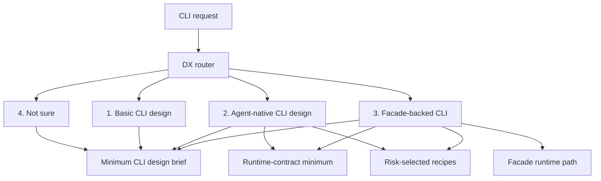

# Create CLI Product Shape Requirements

## Summary

`create-cli` should become a low-friction CLI design front door with three distinct concepts: a minimum CLI design brief, an optional agent-native design mode that applies the runtime-contract minimum plus risk-selected recipes in any language, and an optional facade-backed implementation path for reusable TypeScript facade runtime validation.

The skill should preserve Pete's human-first CLI design coach while restoring the local agent-native value that the thin rewrite lost.

---

## Problem Frame

The current product tension is not Pete versus local. Pete's shape is still useful: it gives agents and humans a compact CLI UX coach for shell scripts, language-specific tools, and small commands.

The local value is different: `create-cli` also needs to help agents build CLI surfaces that other agents can discover, run, parse, recover from, and validate. The agent-native design standard starts from the runtime-contract minimum, then adds recipes when risk or workflow value earns them. That standard should not be tied to `@side-quest/cli-command-facade`. The facade is one optional enforcement backend, not the definition of agent-native CLI design.

The previous rewrite followed the skill design philosophy but made the skill too thin. Scratch runs showed that the basic shell path still worked, but the Bun TypeScript prompt lost the richer local behavior. The target shape keeps the skill thin while making the product decision visible.

---

## Key Decisions

- **One skill, three concepts.** Keep one `create-cli` skill. Separate the minimum CLI design brief, agent-native design mode, and facade-backed implementation path.
- **Default to Pete-shaped design coaching.** Basic CLI requests stay lightweight and language-agnostic.
- **Make agent-native language-agnostic.** Any language can apply the runtime-contract minimum: command metadata and help, parseable JSON stdout discipline, structured runtime errors, run correlation, safe stderr diagnostics, redaction coverage, side-effect stance, and non-interactive execution.
- **Add recipes by risk.** Agent-native mode adds command discovery, result contract discovery, agent hints, runtime action guidance, diagnostic capabilities, write previews, and alignment proofs only when the command's risk, scale, or workflow value earns them.
- **Separate standard from backend.** Agent-native is a design standard. Facade is an optional enforcement backend.
- **Make facade optional.** Use the facade path only when the user asks for reusable facade code, facade runtime validation, or `@side-quest/cli-command-facade`.
- **Use a DX router.** Add a small numbered front door so the agent can classify the request without burying the user in terminology.
- **Fit the skill philosophy.** Let `SKILL.md` route and define prose-level design decisions. Let references teach deeper judgment. Let code, generated help, tests, and runtime owners hold deterministic contracts.

---

## Actors

- A1. **Skill driver:** A human, plan, or agent invoking `create-cli`.
- A2. **CLI implementer:** The agent or human building the command after the design pass.
- A3. **CLI user:** The human, script, or agent that will run the command.
- A4. **Runtime owner:** The package, generated help, tests, or facade runtime that owns deterministic behavior.

---

## Requirements

**DX front door**

- R1. `create-cli` presents a small numbered router when intent is ambiguous.
- R2. The router offers four choices: Basic CLI, Agent-native CLI, Facade-backed CLI, and Not sure.
- R3. The router routes clear prompts without forcing a menu.
- R4. The router asks or offers when the prompt says only "Bun TypeScript CLI", because Bun TypeScript does not imply facade-backed.
- R5. The router frames the choice by user need: humans only, agents/scripts too, or reusable runtime validation.
- R6. The router treats implementation language alone as insufficient evidence for Agent-native or Facade-backed mode.

**Minimum CLI design brief**

- R7. Every path starts from the same minimum CLI design brief.
- R8. The minimum CLI design brief captures command name, purpose, target users, invocation shape, help behavior, output streams, exit codes, error style, side-effect stance, config and env behavior, non-interactive behavior, and smoke command.
- R9. The minimum CLI design brief stays language-agnostic.
- R10. The minimum CLI design brief stays prose-level. It must not copy runtime schemas, generated output envelopes, parser rules, or facade helper signatures.

**Basic CLI design mode**

- R11. Basic mode preserves Pete's human-first CLI design coach.
- R12. Basic mode works for shell, Python, Ruby, Bun, Go, and other languages.
- R13. Basic mode produces enough design detail for a small CLI without requiring agent-native affordances.
- R14. Basic mode can still include smoke commands and examples when useful.

**Agent-native CLI design mode**

- R15. Agent-native mode triggers on explicit agent-native intent such as agent-native, machine-readable, repairable, recoverable, autonomous-agent-facing, runtime-contract, or agents/scripts as primary users.
- R16. Agent-native mode works in any implementation language.
- R17. Agent-native mode starts from the runtime-contract minimum: command metadata and help, parseable JSON stdout discipline, structured runtime errors, run correlation, safe stderr diagnostics, redaction coverage, side-effect stance, and non-interactive execution.
- R18. Agent-native mode adds recipes by risk and workflow value: command discovery, result contract discovery, agent hints, runtime action guidance, diagnostic capabilities, write previews, and Command Surface Alignment Proof.
- R19. Agent-native mode names the owners of stable behavior before implementation.
- R20. Agent-native mode requires human handoff points for destructive, auth, billing, externally visible, or irreversible actions.
- R21. Agent-native mode remains a design standard, not a requirement to use the facade runtime.

**Facade-backed implementation path**

- R22. Facade-backed mode is an optional backend for Bun TypeScript or other compatible TypeScript command surfaces.
- R23. Facade-backed mode uses `@side-quest/cli-command-facade` only when the user requests reusable facade code, facade runtime validation, facade-backed implementation, or a repo surface already owned by the facade.
- R24. Facade-backed mode names contract, help, parser, runtime, and test owners before coding.
- R25. Facade-backed mode points to owner paths for exact contract shape and helper APIs.
- R26. Facade-backed mode does not make Bun TypeScript itself synonymous with facade-backed.

**Skill philosophy fit**

- R27. `SKILL.md` owns the router, workflow order, and compact minimum CLI design brief checklist.
- R28. `references/agent-native-cli-design.md` owns deeper agent-native judgment through conceptual recipes and risk-selection guidance.
- R29. `references/cli-command-facade.md` maps agent-native concepts to the facade implementation path and points to owner paths for exact shapes.
- R30. Code, generated help, tests, and runtime packages own deterministic contracts.
- R31. The rewrite avoids copied flags, schemas, output shapes, state machines, and helper signatures in skill prose.
- R32. The skill keeps one workflow. It does not create a separate agent-native CLI skill.
- R33. `SKILL.md` stays compact: router, workflow order, minimum CLI design brief checklist, and owner paths only.
- R34. References avoid copied facade field catalogues; they teach judgment and route exactness to runtime owner paths.
- R35. `SKILL.md` keeps a smaller lane-neutral output skeleton shaped by the minimum CLI design brief.
- R36. `references/agent-native-cli-design.md` is reframed around runtime-contract minimum, recipe triggers, owners, safety, and review.
- R37. `references/cli-command-facade.md` is pruned to a facade path map: trigger, owner paths, validation loop, proof expectations, and coach-filled gaps.

**Evidence loop**

- R38. Future skill edits are checked against a small behavior-regression prompt set.
- R39. The prompt set includes a basic shell CLI, a basic Bun TypeScript CLI, an agent-native CLI in any language, and a facade-backed Bun TypeScript CLI.
- R40. The harness records each prompt, expected route, expected structural markers, observed route, observed output markers, and before/after notes.
- R41. The harness checks structural behavior, not exact prose.
- R42. The harness can start as a manual scratch-run checklist.
- R43. The harness does not require a deterministic evaluator until repeated manual runs prove one is needed.
- R44. A skill edit is kept only when it improves the observed task behavior without bloating the skill.
- R45. During implementation, the manual checklist lives at `skills/create-cli/references/behavior-regression-checklist.md`.

---

## Key Flows

- F1. **Basic CLI request**
  - **Trigger:** The user asks for a shell CLI or simple CLI with no agent-native or facade signals.
  - **Actors:** A1, A2, A3.
  - **Steps:** Route to Basic CLI, capture the minimum CLI design brief, produce a compact CLI design, and include a smoke command when useful.
  - **Covered by:** R1, R3, R6-R14.

- F2. **Agent-native CLI request**
  - **Trigger:** The user asks for an agent-native, machine-readable, repairable, validated, discovery-ready, or autonomous-agent-facing CLI.
  - **Actors:** A1, A2, A3, A4.
  - **Steps:** Route to Agent-native CLI, capture the minimum CLI design brief, apply the runtime-contract minimum, add recipes only when risk or workflow value earns them, name behavior owners, and identify human handoff points.
  - **Covered by:** R1, R3, R6-R10, R15-R21.

- F3. **Facade-backed CLI request**
  - **Trigger:** The user asks for facade-backed implementation, reusable facade code, facade runtime validation, or `@side-quest/cli-command-facade`.
  - **Actors:** A1, A2, A3, A4.
  - **Steps:** Route to Facade-backed CLI, capture the minimum CLI design brief, apply agent-native mode, then follow the facade runtime path.
  - **Covered by:** R1, R3, R6-R10, R15-R26.

- F4. **Ambiguous Bun TypeScript request**
  - **Trigger:** The user asks for a Bun TypeScript CLI without saying basic, agent-native, or facade-backed.
  - **Actors:** A1, A2.
  - **Steps:** Offer Basic CLI, Agent-native CLI, and Facade-backed CLI choices. Do not silently choose facade.
  - **Covered by:** R1, R2, R4-R6, R26.

---

## Acceptance Examples

- AE1. **Covers R1-R14.** Given the prompt "create a shell CLI", when `create-cli` runs, then it uses Basic CLI mode and produces a compact human-first CLI design without facade-specific implementation guidance.
- AE2. **Covers R15-R21.** Given the prompt "create an agent-native Python CLI", when `create-cli` runs, then it applies the runtime-contract minimum and risk-selected recipes in Python without requiring the facade path.
- AE3. **Covers R22-R26.** Given the prompt "create a facade-backed Bun TypeScript CLI", when `create-cli` runs, then it applies agent-native design mode and follows the facade runtime path.
- AE4. **Covers R4-R6, R26.** Given the prompt "create a Bun TypeScript CLI", when intent is ambiguous, then `create-cli` asks or offers whether the user wants Basic, Agent-native, or Facade-backed.
- AE5. **Covers R27-R37.** Given a future edit to `SKILL.md` or a reference, when the edit copies schema fields or helper signatures from the facade runtime, then the edit is rejected or moved to the runtime owner.
- AE6. **Covers R38-R45.** Given a future skill rewrite, when the behavior-regression prompt set shows that basic CLI still works but agent-native mode no longer routes, then the rewrite is incomplete.

---

## Success Criteria

- The skill can design a basic shell CLI without advanced ceremony.
- The skill can design an agent-native CLI in any language by applying the runtime-contract minimum and risk-selected recipes without using the facade.
- The skill can design a facade-backed Bun TypeScript CLI when explicitly requested.
- The skill does not treat Bun TypeScript as an automatic facade trigger.
- The skill's router reduces ambiguity without becoming a wizard.
- The skill passes `skill-creator` quick validation after edits.
- The skill remains aligned with `context/skill-design-philosophy.md`.

---

## Scope Boundaries

- Do not fork into a separate agent-native CLI skill.
- Do not make facade-backed implementation the default.
- Do not copy facade schemas, helper signatures, generated output envelopes, or parser rules into `SKILL.md`.
- Do not remove Pete's human-first CLI design coach.
- Do not make the numbered router mandatory when intent is already clear.
- Do not create a new ADR for this product-shape rewrite; ADR 0009 already covers bounded local extension.
- Do not implement the rewrite in this brainstorm.

---

## Dependencies And Assumptions

- `context/skill-design-philosophy.md` remains the source of truth for skill shape.
- `docs/adr/0009-create-cli-uses-bounded-local-extension.md` remains the ADR backing local extension.
- `skills/create-cli/references/cli-guidelines.md` remains the upstream human-first CLI baseline.
- `skills/create-cli/references/agent-native-cli-design.md` remains the agent-native judgment owner.
- `skills/create-cli/references/cli-command-facade.md` remains the facade runtime path owner.
- Scratch comparison results remain valid evidence for the routing regression.

---

## Outstanding Questions

### Resolve Before Planning

- None.

### Deferred To Planning

- Decide exact `SKILL.md` wording for the numbered router.
- Implement the compact minimum CLI design brief checklist in `SKILL.md`.
- Create `skills/create-cli/references/behavior-regression-checklist.md` during implementation.
- Decide the smallest edits needed to restore advanced routing without growing the skill body.

---

## Sources

- Skill philosophy: `context/skill-design-philosophy.md`
- Current skill: `skills/create-cli/SKILL.md`
- Provenance: `skills/create-cli/PROVENANCE.md`
- Agent-native reference: `skills/create-cli/references/agent-native-cli-design.md`
- Facade reference: `skills/create-cli/references/cli-command-facade.md`
- Extension ADR: `docs/adr/0009-create-cli-uses-bounded-local-extension.md`
- Ideation artifact: `docs/ideation/2026-06-04-create-cli-product-shape-ideation.md`
- CLIG: `https://clig.dev/`
- SkillOpt: `https://microsoft.github.io/SkillOpt/`
