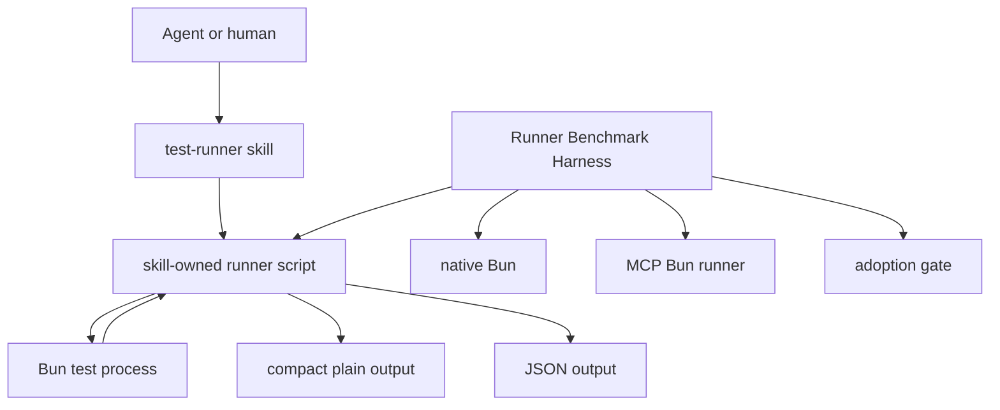

# Test Runner Compact Runner Requirements

## Summary

Create a local `test-runner` skill that proves a skill-owned Bun test runner can emit compact, agent-friendly output with enough failure context for repair. Use the proof as the deprecation path for MCP runner guidance, but keep the current MCP-runner preference until a benchmark shows the local script is smaller, correct, and useful.

---

## Problem Frame

Agents run tests constantly while editing. Raw `bun test` output can consume thousands of tokens on both pass and failure paths, and repeated test loops make that cost compound across a day.

The current MCP Bun runners already prove that compact envelopes help. They also carry transport and tool-result shape overhead, and full tool responses can duplicate compact content into structured payloads. Native Bun flags help green runs through `dots` and similar reporter choices, but they do not provide the agent-focused red-run envelope this issue is about.

The product question is whether a local skill-owned script can keep the useful compact envelope while reducing machinery and preserving enough failure fidelity for agents to fix code without re-running tests blindly.

---

## Approach Evaluation

- **Native shell `bun test`:** Lowest machinery and easiest to understand, but verbose failure output remains the core problem. Also conflicts with the repo's current code-quality rule against raw Bun testing through Bash.
- **Existing MCP Bun runner:** Current preferred path. Good compact summary when callers consume the compact content, but MCP result wrapping can add duplication and does not prove the minimum local workflow.
- **Skill-local script wrapper:** Best v1 bet and intended MCP deprecation path if gates pass. It keeps deterministic behavior in scripts, help, and tests while letting `SKILL.md` stay thin. It still needs benchmark proof before changing repo preference.
- **Published CLI wrapper:** Deferred. It may be useful if the local proof generalizes, but publishing before local proof adds packaging and compatibility work too early.

---

## Key Decisions

- **Agents first:** Optimize for Codex and Claude Code as primary users. Humans and scripts are secondary users who benefit from stable help, exit codes, and JSON.
- **Bun test only in v1:** Start with Bun tests. Keep lint and typecheck on existing MCP runners during v1 proof, then evaluate them with the same benchmark-backed migration pattern.
- **Local proof before distribution:** Build this as a local skill-owned workflow first. Defer package publication and MCP server work.
- **Plain-first, JSON-backed output:** Agents consume compact plain text by default. JSON backs tests, benchmark checks, and future automation.
- **Durable Runner Benchmark Harness before MCP deprecation:** Do not replace `context/bun-runner.md` or `rules/code-quality.md` until token, runtime, exit-code, and failure-fidelity gates justify it. Score token reduction and repair fidelity together so a tiny but useless red-run envelope cannot win. Keep the harness reusable for later token-optimization A/B tests.
- **Facade-backed agent-native CLI:** Treat the runner as an agent-native CLI surface because agents are primary users and output can become token-heavy. Apply `cli-author` agent-native guidance, then use facade-backed support for structured recovery diagnostics.
- **Facade dependency preflight:** Resolve the facade runtime from the skill script package before implementation; ask before adding a dependency if it is missing.
- **One result model, two renderers:** Build one script-owned result model, then render compact plain output and JSON from that model so agent-facing and machine-facing paths do not drift.
- **Dedicated command contract owner:** Use `scripts/command-contract.ts` as the local source for facade-backed command metadata, discovery, and result vocabulary.
- **Stable wrapper entrypoint:** Agents call `scripts/test-runner.sh`; TypeScript owns the runner logic.
- **Wrapper-owned missing-Bun path:** `test-runner.sh` checks for Bun before invoking TypeScript and emits the minimal missing-Bun diagnostic.
- **Explicit Bun arg separator:** Runner args live before `--`; Bun args pass through after `--`.
- **Deterministic benchmark scoring:** Score failure fidelity with a required-signal checklist and estimate tokens with a stable local heuristic.
- **Transient raw logs:** Keep raw Bun output out of normal artifacts. Expose optional debug artifacts only when needed.
- **Run correlation:** Include a run correlation ID in JSON and diagnostics, and in plain output when it points to diagnostics.
- **No MCP runner target state:** Use this issue to prove the Bun test replacement first. Use follow-up proofs to evaluate lint and typecheck replacement so routine quality runners can move away from MCP tools.
- **MCP baseline waiver gate:** MCP-skipped runs can complete local proof, but MCP guidance deprecation requires same-fixture MCP baseline evidence unless the evidence bundle records an explicit maintainer waiver.
- **Agent-generated MCP baseline artifact:** Capture incumbent MCP baseline data through a tool-capable agent writing JSON into the benchmark evidence input path.
- **Proof-only skill before adoption:** Initial `SKILL.md` routes benchmark and development proof work only; normal test runs keep current MCP guidance until U5 passes.
- **Two-run adoption gate:** The first benchmark run calibrates exact gates. A later fixed-gate run is required before MCP guidance deprecation.
- **Harness-first sequencing:** Build fixtures and benchmark harness scaffolding early, then runner behavior, then full comparison and deprecation review.
- **Generated evidence artifacts:** Keep benchmark evidence under a skill-local generated output path unless a selected report is promoted deliberately.
- **No reference doc in v1:** Keep `SKILL.md` thin and route to runner help and tests.
- **Scripts own deterministic behavior:** `SKILL.md` routes the workflow and names owner paths. Scripts, help, and tests own flags, parsing, timeout behavior, output modes, and exit semantics.

---

## Actors

- A1. **Agent driver:** Codex, Claude Code, or another agent running tests during implementation.
- A2. **Human maintainer:** Reviews benchmark evidence, scope, and adoption decisions.
- A3. **Skill prose:** Routes the agent to the runner and names the next safe action.
- A4. **Runner script:** Executes Bun, compacts output, emits plain or JSON, and exits correctly.
- A5. **Bun test process:** Produces the raw test result stream.
- A6. **Current MCP runner:** Serves as the existing preferred baseline during comparison.

---

## Requirements

**Scope and users**

- R1. The workflow treats agents as the primary user and humans/scripts as secondary users.
- R2. V1 covers Bun test execution only.
- R3. Lint and typecheck remain on existing MCP runner guidance in v1.
- R3a. Lint and typecheck should receive follow-up benchmark-backed migration proofs after the Bun test runner proof.
- R4. The workflow remains local-only until benchmark evidence justifies extraction.

**Runner behavior**

- R5. The runner provides a compact plain output mode for agent consumption.
- R6. The runner provides a JSON output mode for machine checks, benchmarks, and future automation.
- R6a. Plain and JSON outputs render from one script-owned result model.
- R7. Passing output stays tiny and includes enough summary information to trust the run.
- R8. Failing output includes enough context for repair: failing file, failing test, assertion signal, and bounded nearby diagnostic text.
- R9. Failure compaction is bounded so large red runs do not flood agent context.
- R10. Runner exit status preserves Bun pass/fail semantics.
- R11. Invalid cwd, missing Bun, timeout, and invocation errors return structured recovery diagnostics that name cause, same-input retry safety, and next action.
- R11c. The shell wrapper owns the missing-Bun diagnostic because TypeScript cannot run without Bun.
- R11a. JSON and diagnostics include a run correlation ID.
- R11b. Raw Bun output is transient by default; optional debug artifacts are explicit.
- R12. Pass-through Bun args work without `SKILL.md` copying the flag contract.
- R12a. Bun args pass through only after an explicit `--` separator.
- R13. Timeout behavior is owned by the script contract and covered by tests.

**Comparison and adoption**

- R14. A Runner Benchmark Harness compares native shell `bun test`, existing MCP Bun runner when available, and the skill-local runner.
- R14a. The existing MCP Bun runner baseline is supplied through an agent-generated JSON artifact when live tool access is available.
- R15. The Runner Benchmark Harness records token estimate, wall time, exit correctness, failure fidelity, and named token-optimization variants.
- R15a. Token estimates use a stable local heuristic and are labeled as estimates.
- R16. The Runner Benchmark Harness scores variants on both token reduction and repair fidelity.
- R16a. Failure fidelity uses a deterministic checklist for failing file, failing test, assertion signal, and bounded diagnostics.
- R17. Exit correctness gates variant acceptance before token or fidelity scoring matters.
- R18. MCP runner unavailability is reported as skipped comparison, not a failed local proof.
- R19. The existing MCP preference remains unchanged until benchmark gates pass, then becomes a deprecation candidate.
- R19a. MCP guidance deprecation requires incumbent MCP baseline evidence unless the evidence bundle records an explicit maintainer waiver.
- R20. Benchmark output is compact enough for an agent or reviewer to evaluate without reading raw test logs.
- R20a. Benchmark output includes a compact evidence table plus JSON details.
- R21. The Runner Benchmark Harness remains reusable for later A/B tests over native Bun flags, envelope formats, and failure-context budgets.
- R21a. MCP deprecation requires a reviewed evidence bundle with benchmark output and proposed guidance diff.
- R21b. Exact numeric gates are set from first benchmark evidence, not invented during planning.
- R21c. MCP guidance deprecation requires a fixed-gate acceptance run after calibration.
- R21d. The initial harness unit is scaffold-only and does not claim local-runner acceptance before the runner exists.

**Skill and ownership**

- R22. `SKILL.md` stays thin: trigger, workflow, command pointer, owner paths, and next safe action.
- R22a. Initial `SKILL.md` is proof-only and does not route normal test runs away from current MCP guidance before U5 passes.
- R23. `SKILL.md` does not copy full flags, schemas, state machines, output contracts, or generated shapes.
- R24. Script help owns command usage and output modes.
- R25. Script tests own parser behavior, pass compaction, failure compaction, exit codes, invalid cwd, pass-through args, and timeout behavior.
- R26. The implementation names owners for skill prose, script contract, help, parser, runtime behavior, tests, and Runner Benchmark Harness.
- R26a. Facade-backed implementation names contract, result model, parser or engine, help or discovery, CLI, tests, and benchmark owners.
- R26b. `skills/test-runner/scripts/command-contract.ts` owns command contract and discovery metadata.
- R27. New or changed CLI/runtime surfaces follow `cli-author` agent-native and facade-backed guidance before implementation.
- R28. V1 uses facade-backed support for structured recovery diagnostics.
- R29. If facade-backed implementation needs a new dependency, ask before adding it.
- R29a. U2 preflights `@side-quest/cli-command-facade` availability before implementing the facade-backed contract.
- R30. V1 does not add a skill reference doc unless skill prose bloat creates a real need.
- R31. This session stops before implementation.

---

## Key Flows

- F1. **Green focused test run**
  - **Trigger:** A1 needs a focused Bun test check during implementation.
  - **Actors:** A1, A3, A4, A5.
  - **Steps:** A1 follows the skill, A4 runs Bun with the requested focus, Bun passes, and A4 emits compact plain output plus correct exit status.
  - **Covered by:** R1, R5, R7, R10, R12, R22-R25.

- F2. **Red test run**
  - **Trigger:** A1 runs tests and Bun reports failures.
  - **Actors:** A1, A4, A5.
  - **Steps:** A4 captures failure output, extracts repair-useful context, caps noisy details, emits a compact failure envelope, and exits non-zero.
  - **Covered by:** R5, R6, R8-R13, R22.

- F3. **Benchmark comparison**
  - **Trigger:** A2 needs evidence before changing runner preference.
  - **Actors:** A2, A4, A6.
  - **Steps:** The harness runs native Bun, MCP when available, and the local runner against pass and failure fixtures, then reports token, runtime, exit, and fidelity results.
  - **Covered by:** R14-R21, R26.

---

## Acceptance Examples

- AE1. **Covers R5, R7, R10.** Given a passing focused test file, when the runner uses compact plain output, then it emits a tiny success summary and exits `0`.
- AE2. **Covers R8-R10.** Given multiple failing tests, when the runner compacts output, then the result includes bounded failure context and exits non-zero without dumping the full native log.
- AE3. **Covers R6, R22.** Given JSON mode, when a passing or failing run completes, then tests can parse the result without scraping human prose.
- AE4. **Covers R11.** Given an invalid cwd or missing Bun executable, when the runner starts, then it exits non-zero with a diagnostic that names the repair path.
- AE5. **Covers R14-R21.** Given the Runner Benchmark Harness, when MCP tools are unavailable, then the harness marks MCP comparison skipped and still evaluates native Bun versus local runner.
- AE6. **Covers R16-R17.** Given a tiny failure envelope that exits correctly but omits the failing test or assertion signal, when the harness scores variants, then the variant loses on repair fidelity despite strong token reduction.
- AE7. **Covers R22-R26.** Given a future edit to `SKILL.md`, when the edit copies output schema or flag semantics from the script, then the edit is rejected or moved to the script/help/tests.

---

## Success Criteria

- Passing output is close to the issue's observed compact-envelope scale.
- Failure output preserves repair-useful context while materially reducing tokens versus raw Bun failures.
- Variants are evaluated on token reduction and repair fidelity together.
- The benchmark proves exit correctness for native Bun, MCP when available, and local runner paths.
- The benchmark records runtime and token estimates in a reviewer-readable shape.
- The deprecation review includes benchmark evidence and the proposed guidance diff.
- MCP guidance can be updated in the same issue if gates pass and the evidence bundle is reviewed.
- The skill remains aligned with `context/skill-design-philosophy.md`.
- No existing MCP-runner preference changes before benchmark evidence exists.
- The target state is MCP runner deprecation if the local runner passes benchmark gates.
- The broader target state is no MCP tools for routine quality runners after local replacements prove themselves.

---

## Scope Boundaries

- Do not build another MCP server in this issue.
- Do not publish a package in this issue.
- Do not include lint or typecheck in v1.
- Do not treat lint or typecheck as permanently MCP-owned; defer them to follow-up proofs.
- Do not replace `context/bun-runner.md` or `rules/code-quality.md` until benchmark gates justify a preference change.
- Do not copy script-owned flags, schemas, parser rules, state machines, or output contracts into `SKILL.md`.
- Do not add a facade runtime dependency without maintainer confirmation during implementation.
- Do not change unrelated browser-use, cli-author, or runner surfaces.
- Do not implement until explicitly asked.

---

## Dependencies And Assumptions

- Bun reporter flags and JUnit output remain useful baselines, but not sufficient failure envelopes by themselves.
- Existing MCP Bun runner tools remain the current preferred testing path during proof.
- The proof path aims to retire MCP testing guidance rather than keep permanent parallel defaults.
- Lint and typecheck MCP guidance remain current only until their own local replacement proofs exist.
- Test fixtures can simulate representative pass, assertion failure, multi-failure, invalid cwd, pass-through arg, and timeout cases locally.
- The local script can call Bun directly as an implementation detail even while repo instructions continue to steer agents away from raw shell Bun usage.
- `cli-author` remains the owner for new or changed CLI/runtime-surface design.

---

## Outstanding Questions

### Resolve Before Planning

- None.

### Deferred To Planning

- Choose exact benchmark fixture layout.
- Choose the runner command name and script entrypoint names.
- Define the initial token and runtime gates.
- Decide whether the plan updates `context/bun-runner.md` in the same issue or records a follow-up after benchmark results.
- Decide how JSON and plain output alignment is verified without copying schemas into skill prose.
- Implementation kickoff after explicit maintainer request.

---

## Sources

- Issue: `https://github.com/nathanvale/claude-code-config/issues/172`
- Domain language: `CONTEXT.md`
- Skill philosophy: `context/skill-design-philosophy.md`
- Current runner guidance: `context/bun-runner.md`
- Claude enforcement rule: `rules/code-quality.md`
- CLI Author skill: `skills/cli-author/SKILL.md`
- Agent-native CLI reference: `skills/cli-author/references/agent-native-cli-design.md`
- Facade-backed CLI reference: `skills/cli-author/references/cli-command-facade.md`
- CLI guidelines reference: `skills/cli-author/references/cli-guidelines.md`
- Prior product-shape brainstorm: `docs/brainstorms/2026-06-04-cli-author-product-shape-requirements.md`
- Ideation artifact: `docs/ideation/2026-06-04-test-runner-compact-runner-ideation.md`
- Bun docs: `/oven-sh/bun` via Context7
