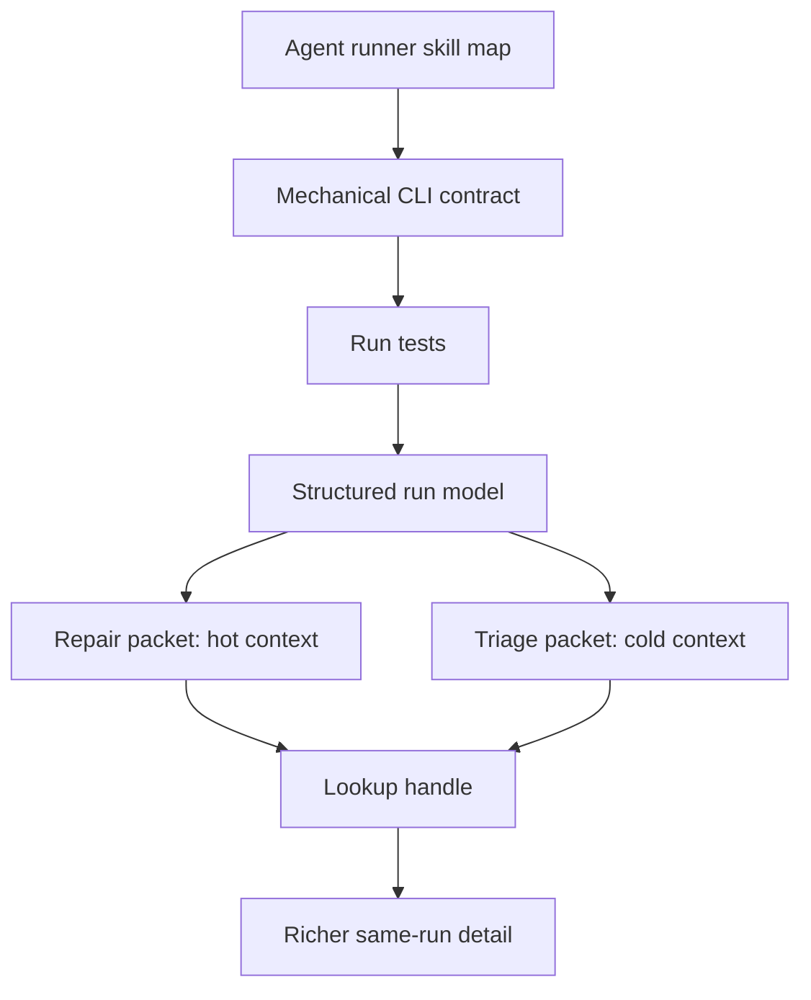

# Agent Runner Context Escalation Requirements

## Summary

Build a prototype **agent runner** that treats test output as a context-aware next-action packet, not a human test report. The prototype proves that a hot-context repair run can emit a tiny result because a mechanical lookup path keeps richer detail reachable from the same run.

---

## Problem Frame

Agents do not always need the same failure context. An agent actively editing a file already has the file, surrounding code, and recent reasoning in context. For that agent, repeated file names, stack frames, headers, and code snippets waste tokens. It needs the smallest pointer that lets it continue repair.

A different agent may run a broader suite over files it has never opened. That cold-context agent needs more orientation: where to look, what failed, what assertion broke, and enough local evidence to decide the next inspection step.

The current compact runner proves smaller output helps, but it still behaves like a compressed report. The next prototype should prove the agent-native shape: a skill provides the workflow map, a facade-backed mechanical CLI emits repair and recoverability hints, and terse visible output can safely point to richer detail on demand.

---

## Key Decisions

- **Rename the product concept to agent runner.** The runner is optimized for autonomous agents first, with humans and scripts as secondary users.
- **Lead with escalation.** Terse output is acceptable only because the run keeps a mechanical lookup path for richer detail.
- **Separate context states.** Repair mode assumes hot file context; triage mode assumes cold or broad-suite context.
- **Keep visible repair output token-minimal.** Repair mode emits facts and lookup handles, not a compressed Bun transcript.
- **Keep the full truth structured.** JSON and detail lookup expose the richer run model without forcing it into every visible response.
- **Use facade-backed CLI mechanics.** `create-cli` can produce the command surface, contract ownership, discovery metadata, repair hints, and validation path needed for the prototype.
- **Reuse the browser-use pattern.** Browser-use already proves the shape where agents get a mechanical map, recovery guidance, and lookup-backed detail instead of prose-only instructions.
- **Benchmark repair and triage separately.** Repair mode competes with MCP on token cost; triage mode competes with raw Bun on orientation value.

---

## Actors

- A1. **Hot-context repair agent:** Has the edited file and recent reasoning in context.
- A2. **Cold-context triage agent:** Ran a broader suite and has not inspected the failing files.
- A3. **Agent runner skill:** Provides the workflow map and tells agents when to use repair, triage, JSON, or detail lookup.
- A4. **Mechanical CLI:** Executes the run, emits mode-specific packets, and exposes recovery and lookup affordances.
- A5. **Benchmark reviewer:** Evaluates whether repair beats MCP and whether triage preserves enough context.

---

## Requirements

**Context Modes**

- R1. The prototype supports a hot-context repair mode.
- R2. Repair mode assumes the agent already has the edited file in context.
- R3. Repair mode emits the minimum next-action packet for each failure.
- R4. The prototype supports a cold-context triage mode.
- R5. Triage mode assumes the agent may not have opened the failing file.
- R6. Triage mode emits enough orientation to choose the next file and inspection point.

**Escalation Map**

- R7. Every terse failure packet includes a mechanical lookup handle or equivalent path to richer same-run detail.
- R8. The lookup path returns richer detail without requiring a full rerun.
- R9. Richer detail preserves failing file, line, test name, assertion signal, expected value, received value, and bounded diagnostic context when available.
- R10. JSON mode exposes the structured run model that backs repair, triage, and lookup output.
- R11. Runtime failures still expose recoverability, same-input retry safety, and next action.

**Repair Output**

- R12. Repair mode omits run IDs, duration, summary headers, stack frames, and code context by default.
- R13. Repair mode includes only the failure location, failing test identity, assertion facts, and lookup handle when those facts are available.
- R14. Repair mode falls back to a bounded unparsed diagnostic when assertion facts cannot be extracted.
- R15. Repair mode is benchmarked against the current MCP runner on the same fixtures.
- R16. Repair mode must beat MCP token estimates on hot-context fixtures without losing fidelity.

**Triage Output**

- R17. Triage mode includes more context than repair mode but remains bounded.
- R18. Triage mode includes line-oriented navigation detail when available.
- R19. Triage mode may include one small code or diagnostic snippet when it materially helps cold-context orientation.
- R20. Triage mode is benchmarked against raw Bun output and repair mode, not judged by the same token gate as repair mode.

**Skill And Contract**

- R21. `SKILL.md` stays thin and routes agents by context state: repair, triage, detail lookup, JSON, or benchmark.
- R22. Deterministic behavior lives in CLI help, contract metadata, tests, and runtime checks.
- R23. The command surface follows `create-cli` agent-native and facade-backed guidance.
- R24. The prototype names owners for command contract, result model, renderer modes, lookup behavior, recovery hints, tests, and benchmark evidence.
- R25. The prototype avoids copying facade schemas, parser states, or output payload catalogues into skill prose.

---

## Key Flows

- F1. Hot-context repair run
  - **Trigger:** An agent edits a file and runs the focused test.
  - **Actors:** A1, A3, A4.
  - **Steps:** The skill routes to repair mode, the CLI runs tests, and each failure emits a tiny next-action packet with a lookup handle.
  - **Outcome:** The agent can continue repair without paying for cold-context detail.
  - **Covered by:** R1-R3, R7, R12-R16, R21.

- F2. Escalate from repair packet
  - **Trigger:** The hot-context agent does not understand the terse packet or wants proof.
  - **Actors:** A1, A4.
  - **Steps:** The agent follows the lookup handle, the CLI returns richer same-run detail, and the agent continues without rerunning the whole suite.
  - **Outcome:** The terse output remains safe because detail is mechanically reachable.
  - **Covered by:** R7-R11.

- F3. Cold-context triage run
  - **Trigger:** An agent runs a suite across files it has not inspected.
  - **Actors:** A2, A3, A4.
  - **Steps:** The skill routes to triage mode, the CLI emits bounded navigation detail, and the agent chooses the first file or failure to inspect.
  - **Outcome:** The agent gets orientation without raw Bun noise.
  - **Covered by:** R4-R6, R17-R20, R21.

- F4. Benchmark comparison
  - **Trigger:** A reviewer needs evidence before changing runner guidance.
  - **Actors:** A4, A5.
  - **Steps:** The benchmark compares repair mode to MCP, triage mode to raw Bun, and records exit correctness, token estimates, fidelity, and lookup availability.
  - **Outcome:** Adoption decisions are evidence-backed rather than philosophy-only.
  - **Covered by:** R15-R16, R20, R24.

---

## Acceptance Examples

- AE1. **Covers R1-R3, R12-R16.** Given a focused assertion failure in a file the agent is editing, when repair mode runs, then output is smaller than the MCP baseline and still names the failure location, test, expected value, received value, and lookup handle.
- AE2. **Covers R7-R10.** Given a repair packet with a lookup handle, when the agent asks for detail, then the CLI returns richer same-run detail without rerunning tests.
- AE3. **Covers R4-R6, R17-R20.** Given a broad suite failure in a file the agent has not opened, when triage mode runs, then output includes bounded navigation context enough to choose the next inspection target.
- AE4. **Covers R11.** Given missing runtime, invalid cwd, timeout, or invocation failure, when the command fails before or during a run, then the result names recoverability, retry safety, and next action.
- AE5. **Covers R21-R25.** Given a future skill prose edit, when it copies output schemas or parser rules, then that content is moved back to CLI help, tests, or contract-owned code.

---

## Success Criteria

- Repair mode beats the MCP runner on token estimates for hot-context fixtures.
- Repair mode keeps full failure fidelity on expected repair signals.
- Triage mode is materially smaller than raw Bun while preserving cold-context orientation.
- Detail lookup proves that terse packets can escalate without a full rerun.
- The benchmark reports repair and triage scores separately.
- The prototype keeps normal runner guidance unchanged until fixed-gate evidence justifies adoption.

---

## Scope Boundaries

- Do not replace all MCP quality runners in this prototype.
- Do not publish a shared package in this prototype.
- Do not solve lint or typecheck runner output yet.
- Do not optimize by dropping repair fidelity.
- Do not make skill prose the source of deterministic output contracts.
- Do not require agents to read raw Bun output for normal repair or triage flow.

---

## Dependencies And Assumptions

- The current `test-runner` prototype can evolve into an agent runner without abandoning the existing benchmark harness.
- Browser-use provides a proven adjacent pattern for mechanical maps, recovery guidance, and lookup-backed detail.
- `create-cli` can provide the facade-backed CLI design path for command contract, discovery, repair hints, and proof.
- Same-run detail lookup may require a short-lived artifact, in-memory state, or generated evidence file; planning will choose the storage shape.
- Line numbers and assertion facts are available often enough to make repair mode useful, with bounded fallback for unparsed failures.

---

## Outstanding Questions

### Resolve Before Planning

- None.

### Deferred To Planning

- Choose exact command spelling for repair, triage, and detail lookup.
- Choose whether repair mode becomes default plain output or a named output mode during prototype.
- Choose same-run detail storage and retention behavior.
- Choose exact benchmark fixtures and gates for MCP-beating repair output.
- Decide whether to update `CONTEXT.md` with the Agent Runner term before implementation.

---

## Sources

- Prior requirements: `docs/brainstorms/2026-06-04-test-runner-compact-runner-requirements.md`.
- Current runner proof: `skills/test-runner/SKILL.md`.
- Domain language: `CONTEXT.md`.
- Browser-use adjacent pattern: `skills/browser-use/`.
- Create CLI owner: `skills/create-cli/SKILL.md`.
