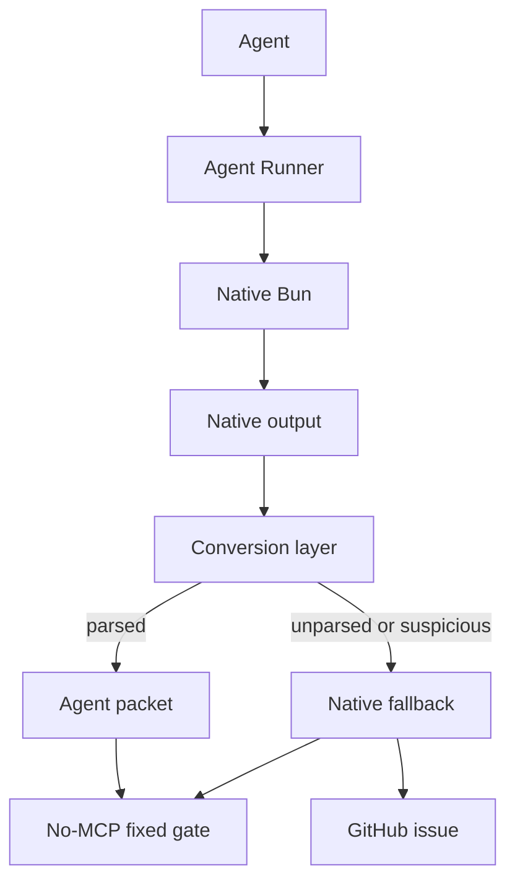

# Production Agent Test Runner Convergence Requirements

## Summary

Build a production-grade Agent Runner test surface that replaces Bun MCP for Bun test work. The runner converts native Bun output into bounded, agent-actionable packets for pass/fail, repair, triage, detail lookup, and coverage, then proves the conversion with no-MCP fixed-gate evidence.

---

## Problem Frame

The current proof has moved past “make Bun output smaller.” Agent Runner now shows the shape of a production test runner for agents: native test output enters as raw material, the runner extracts the next useful state for the agent, and the benchmark proves the conversion did not drop essential signal.

That matters because production agents do not need human terminal transcripts. They need bounded context that tells them what to do next, plus a safe escalation path when the compact packet is too terse or the parser cannot understand the native output.

The remaining product risk is parser drift. Bun owns its output format, and Agent Runner converts that output into structured model-visible context. If Bun changes underneath us, the runner must fail open toward truth: return native output to the user, mark the conversion as degraded, and raise an actionable repair issue instead of hiding or misrepresenting the run.

---

## Key Decisions

- **Agent Runner becomes the Bun test default.** Bun pass/fail, focused tests, repair, triage, detail lookup, and coverage route through Agent Runner once the no-MCP gate passes.
- **Native output remains the truth source.** Agent Runner can compress and structure native Bun output, but it never outranks the native output when conversion fails.
- **Parser drift is product behavior.** Unparseable or suspicious native output triggers fallback behavior, issue creation, and repair metadata.
- **Coverage is first-class.** The no-MCP claim includes `bun test --coverage`; coverage cannot remain an MCP-only path.
- **MCP remains out of the Bun evidence loop.** The convergence gate proves Bun replacement with native Bun plus local runner rows only.
- **Biome and TypeScript stay separate.** This brainstorm does not claim replacement of lint, format, or type MCP runners.
- **Production means observable degradation.** A broken parser must produce a useful user result and a maintainable repair trail.
- **Evidence gates compare by role, not incidental names.** MCP comparison rows may be named differently across artifacts, so gates should identify incumbent evidence by stable row kind or explicit configuration.
- **Artifact storage is not command context.** Detail lookup may read generated artifacts, but result metadata should not imply the command executed from the artifact directory.

---

## Actors

- A1. **Implementation agent:** Runs tests while editing and consumes compact packets.
- A2. **Triage agent:** Runs broader suites and needs bounded orientation before opening files.
- A3. **Maintainer:** Reviews benchmark evidence, parser-drift issues, and adoption decisions.
- A4. **Agent Runner:** Executes Bun, parses native output, renders mode-specific packets, and exposes detail lookup.
- A5. **Bun runtime:** Produces native test and coverage output.
- A6. **Issue reporter:** Creates or updates actionable GitHub issues when conversion degrades.

---

## Requirements

**Bun Test Replacement**

- R1. Agent Runner handles routine Bun pass/fail test gates.
- R2. Agent Runner handles focused single-file Bun test runs.
- R3. Agent Runner handles hot-context repair mode for files already being edited.
- R4. Agent Runner handles cold-context triage mode for broader or unfamiliar failures.
- R5. Agent Runner exposes detail lookup for richer same-run failure context.
- R6. Agent Runner handles Bun timeout failures, runtime errors, thrown errors, snapshot failures, multiple failures, long assertion messages, and incomplete parser fallback cases.
- R7. Agent Runner handles Bun coverage output from `bun test --coverage`.

**Agent Output Contract**

- R8. Compact output includes the smallest useful next-action packet for the selected mode.
- R9. Repair packets preserve failure location, failing test identity, assertion signal, expected value, received value, and lookup handle when available.
- R10. Triage packets preserve enough orientation to choose the next file or inspection point.
- R11. Coverage packets preserve covered file identity, function percentage, and line percentage.
- R12. Detail lookup returns richer same-run detail without rerunning tests.
- R13. JSON output exposes the structured run model behind compact, repair, triage, coverage, and detail output.
- R14. Output remains bounded so large red runs do not flood agent context.

**Native Fallback And Parser Drift**

- R15. Agent Runner detects unparseable native output, suspiciously empty parse results, and conversion errors.
- R16. When conversion degrades, Agent Runner returns native Bun output to the user instead of dropping test evidence.
- R17. Fallback output clearly marks that structured conversion degraded.
- R18. Fallback output preserves exit status and native pass/fail semantics.
- R19. Fallback output preserves enough native output for the agent or human to continue manually.
- R20. Fallback behavior avoids leaking secrets; native output is bounded or redacted before model-visible rendering.
- R21. Parser drift creates or updates a GitHub issue with reproduction command, runner version, Bun version, fixture or target, parse diagnostic, and bounded native excerpt.
- R22. Issue creation is best-effort; failure to create an issue does not suppress native fallback output.
- R23. Repeated parser-drift failures coalesce into an existing open issue when the fingerprint matches.
- R24. Parser-drift issues include the next safe repair action for a maintainer or agent.

**Evidence And Gates**

- R25. The no-MCP fixed gate runs with `--no-mcp-baseline`.
- R26. The no-MCP fixed gate uses native Bun rows and Agent Runner rows only.
- R27. The no-MCP fixed gate includes pass/fail, failure-context, detail lookup, runtime error, timeout, multi-failure, fallback parser, and coverage fixtures.
- R28. The no-MCP fixed gate fails if Agent Runner loses fidelity against required signals.
- R29. The no-MCP fixed gate fails if selected compact variants exceed native Bun token estimates without an explicit exception.
- R30. The no-MCP fixed gate fails if detail lookup reruns tests for failure detail.
- R31. Benchmark evidence records row kind counts so reviewers can verify that no MCP artifact rows were used.
- R32. Benchmark evidence records coverage-specific token and fidelity rows.
- R32a. Comparator gates use stable row roles or explicit comparator configuration rather than hard-coded incidental variant names.

**Production Adoption**

- R33. `context/bun-runner.md` routes Bun test work to Agent Runner after the no-MCP gate passes.
- R34. `rules/code-quality.md` treats raw `bun test` as disallowed while allowing Agent Runner for Bun tests.
- R35. Biome and TypeScript remain on their MCP runner guidance until separate evidence exists.
- R36. The skill stays thin and points to script help, benchmark command, owner paths, and next safe actions.
- R37. Deterministic contracts live in code, generated help, tests, and benchmark gates.
- R38. Production packaging is deferred until the repo-local runner proves stable under parser-drift fallback.
- R39. Detail lookup result metadata preserves the user-facing command context and keeps artifact storage paths separate.

---

## Key Flows

- F1. **Routine Bun test gate**
  - **Trigger:** A1 needs a focused or suite-level Bun test check.
  - **Actors:** A1, A4, A5.
  - **Steps:** A1 runs Agent Runner, A4 executes Bun, A4 converts native output into compact pass/fail context.
  - **Outcome:** A1 gets bounded model-visible test evidence without MCP.
  - **Covered by:** R1, R2, R8, R13, R25-R31, R33-R37.

- F2. **Hot-context repair**
  - **Trigger:** A1 has an edited file in context and a failing test.
  - **Actors:** A1, A4, A5.
  - **Steps:** A1 runs repair mode, A4 extracts the failure facts, A4 emits a tiny repair packet with detail handle.
  - **Outcome:** A1 can continue repair without reading raw Bun output.
  - **Covered by:** R3, R5, R8-R10, R12-R14.

- F3. **Cold-context triage**
  - **Trigger:** A2 runs a broader suite and does not know which file to inspect.
  - **Actors:** A2, A4, A5.
  - **Steps:** A2 runs triage mode, A4 emits bounded target, assertion, context, and detail handle information.
  - **Outcome:** A2 can pick the next inspection target without opening every failing file.
  - **Covered by:** R4, R5, R8, R10, R12-R14.

- F4. **Coverage check**
  - **Trigger:** A1 or A3 needs Bun coverage evidence.
  - **Actors:** A1, A3, A4, A5.
  - **Steps:** Agent Runner passes coverage args to Bun, parses the coverage table, and emits compact coverage file percentages.
  - **Outcome:** Coverage evidence is model-visible without MCP or raw coverage table noise.
  - **Covered by:** R7, R11, R13, R27, R32.

- F5. **Parser drift fallback**
  - **Trigger:** Bun output changes or Agent Runner cannot safely convert the native output.
  - **Actors:** A1, A3, A4, A5, A6.
  - **Steps:** A4 detects degraded conversion, returns bounded native output, marks the result as degraded, and asks A6 to create or update a GitHub issue.
  - **Outcome:** The user keeps truthful test evidence, and maintainers get a repair trail.
  - **Covered by:** R15-R24.

---

## Acceptance Examples

- AE1. **Covers R1, R8, R25-R31.** Given the no-MCP fixed gate, when it runs with native Bun and Agent Runner rows only, then the gate passes with zero MCP artifact rows.
- AE2. **Covers R3, R5, R9, R12.** Given a focused assertion failure, when repair mode runs, then output includes failure location, failing test, assertion facts, and a detail handle without dumping the native transcript.
- AE3. **Covers R4, R10, R12.** Given a broad suite failure, when triage mode runs, then output includes enough bounded orientation for the next inspection step and detail lookup remains available.
- AE4. **Covers R7, R11, R32.** Given `bun test --coverage`, when Agent Runner runs, then compact output includes the covered source file and line/function percentages.
- AE5. **Covers R15-R19.** Given Bun emits output that the parser cannot safely convert, when Agent Runner runs, then the result returns bounded native output, marks conversion degraded, and preserves the native exit status.
- AE6. **Covers R21-R24.** Given a parser-drift fallback, when issue reporting is available, then a GitHub issue is created or updated with reproduction details and a bounded native excerpt.
- AE7. **Covers R20, R22.** Given fallback issue creation fails, when Agent Runner returns, then user-visible native fallback still appears and no secret-bearing raw output is emitted unbounded.
- AE8. **Covers R32a.** Given MCP baseline rows with different variant names but the same incumbent row kind, when a comparator gate runs, then it still compares against the intended incumbent evidence.
- AE9. **Covers R39.** Given detail lookup reads a generated artifact, when it returns a result, then the result reports the command context separately from the artifact storage location.

---

## Success Criteria

- No-MCP fixed gate passes with 15 native Bun rows, 75 local runner rows, and 0 MCP artifact rows.
- Coverage fixture passes the no-MCP gate and preserves `coverage-target.ts` plus `100.00` function coverage and `75.00` line coverage.
- Repair and triage variants preserve fidelity score `1` across the broad failure matrix.
- Detail lookup is available for failure rows and does not rerun tests.
- Selected compact variants stay below native Bun token estimates for required gate rows.
- Parser-drift fallback returns truthful native evidence rather than an empty or misleading structured packet.
- Parser-drift issue creation gives maintainers enough information to reproduce and repair the parser.
- Bun routing guidance no longer depends on MCP for Bun test evidence.
- Comparator gates remain stable across artifact naming changes.
- Detail lookup does not misrepresent artifact storage as the command cwd.

---

## Scope Boundaries

- Do not claim Biome or TypeScript MCP replacement in this convergence.
- Do not require MCP rows for Bun adoption evidence.
- Do not hide native output when conversion fails.
- Do not make GitHub issue creation a hard dependency for returning fallback output.
- Do not publish a generalized package until fallback behavior and adoption guidance are stable.
- Do not copy parser states, output schemas, or flag contracts into skill prose.
- Do not treat raw native output as normal agent output when conversion succeeds.
- Do not hard-code benchmark comparator names when the semantic row role is available.
- Do not expose artifact directories as command cwd in successful result metadata.

---

## Dependencies And Assumptions

- Bun supports `bun test --coverage`, `--coverage-reporter`, and `--coverage-dir`.
- Bun native output may change over time, so parser drift is plausible and must be observable.
- GitHub issue creation is available through a CLI, API, or future agent connector during production use.
- Generated benchmark evidence under `skills/test-runner/scripts/.benchmark-output/` is local by design.
- Reproducible gate behavior lives in `skills/test-runner/scripts/test-runner.benchmark.ts`, not in generated evidence files.
- Local Agent Runner remains the production proof surface before package extraction.

---

## Outstanding Questions

### Resolve Before Planning

- None.

### Deferred To Planning

- Choose the parser-drift fingerprint used to coalesce repeated issues.
- Choose the issue-reporting transport and authentication path.
- Choose the exact degraded-conversion marker in plain, JSON, compact JSON, and TOON outputs.
- Choose the native fallback output budget and redaction rules.
- Choose whether parser drift should always raise an issue or only when running in a repo with issue-reporting configured.
- Choose the comparator identity model for incumbent rows.
- Choose the result metadata fields that distinguish command cwd from artifact storage.
- Choose package extraction boundaries after repo-local production behavior is proven.

---

## Sources

- Prior requirements: `docs/brainstorms/2026-06-04-test-runner-compact-runner-requirements.md`.
- Prior requirements: `docs/brainstorms/2026-06-05-agent-runner-context-escalation-requirements.md`.
- Current runner guidance: `context/bun-runner.md`.
- Enforcement rule: `rules/code-quality.md`.
- Runner skill: `skills/test-runner/SKILL.md`.
- Runner provenance: `skills/test-runner/PROVENANCE.md`.
- Runner implementation: `skills/test-runner/scripts/test-runner.ts`.
- Runner benchmark harness: `skills/test-runner/scripts/test-runner.benchmark.ts`.
- Coverage fixture: `skills/test-runner/scripts/fixtures/coverage.test.ts`.
- Coverage target: `skills/test-runner/scripts/fixtures/coverage-target.ts`.
- Related PR review: `https://github.com/nathanvale/claude-code-config/pull/175`.
- Bun documentation: `https://github.com/oven-sh/bun/blob/main/docs/guides/test/coverage.mdx`.
