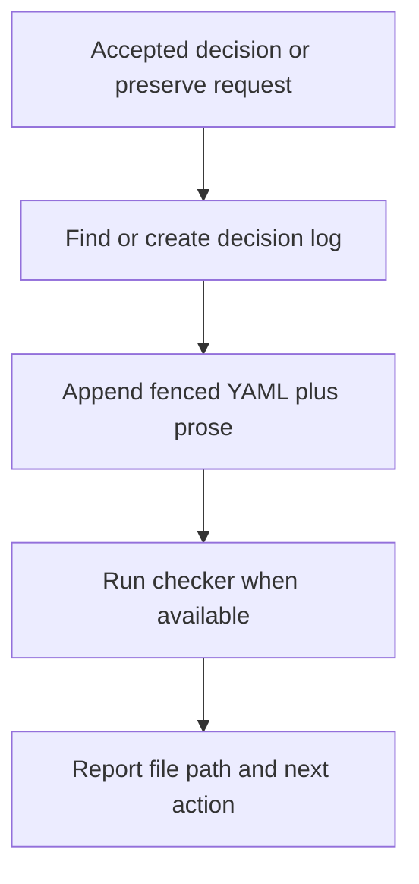

# Decisions Skill Operating Manual

## MVP

- MVP means minimum viable product.
- For this skill, MVP means the smallest operating system that lets an agent store an accepted decision correctly.
- Do not start with auditing, automation, dashboards, or runtime indexing.
- Start with one workflow:
  - receive an accepted decision or explicit preserve request
  - find or create the right decision log
  - write fenced YAML plus human-readable prose
  - tell Nathan what was stored and where
- Add only tiny helper machinery in v1 when it proves decision-log shape:
  - parse Markdown decision logs
  - read fenced YAML
  - emit a machine-readable projection
  - check shape enough to catch drift
  - validate required prose section headings
- Use one v1 helper command:
  - `decisions check <file> --json`
- Keep the v1 helper read-only.
- Accept one file only in v1.
- Require `--json` in v1.
- Do not build full search, dashboard, database, or storage-adapter machinery in v1.

## Accepted Boundary

- Primary job: store accepted decisions in `docs/decisions/`.
- Do not own live decision-making.
- Route unresolved live choices to `decision-mode`.
- Return to this skill after the user accepts an option or asks to preserve a decision.
- Create a decision log when none exists for the decision surface.
- Name new logs with the daily sequence pattern used by plans:
  - `YYYY-MM-DD-NNN-short-name-decision-log.md`
- Keep improving an existing same-surface decision log when it exists.
- Do not treat decision logs as architectural decision records.
- Use ADRs only for decisions that are hard to reverse, surprising without context, and real trade-offs.

## Decision Log Ownership

- Decision logs belong to a decision surface.
- A decision surface is the smallest stable future lookup surface.
- Use product areas, workflows, skills, implementation slices, operational areas, or long-running systems as decision surfaces.
- Treat brainstorms, chats, plans, tags, dates, agents, and people as sources or metadata, not owners.
- Store ordinary durable decisions in `docs/decisions/`.
- Escalate to ADR only when the decision meets the ADR threshold.

## First Operating Rule

- Store a user's decision only after the user accepts it or asks to preserve it.
- Do not infer acceptance from discussion, exploration, or a draft recommendation.
- Ask before writing durable files unless the user already requested durable tracking.
- Prefer the smallest owner that fits the decision.
- Record enough context for a future agent to avoid re-litigating the decision.
- Do not store deterministic schemas, route tables, allowed values, or output contracts in decision prose.

## Store A User Decision

1. Name the decision in one sentence.
2. Confirm the accepted option.
3. Find or create the target decision log under `docs/decisions/`.
4. Append the decision with fenced YAML plus prose.
5. Report:
   - decision
   - file path
   - next review or follow-up

## Acceptance Examples

- Existing surface: append an accepted `decision-mode` outcome to the same-surface decision log.
- New surface: create a same-day sequenced decision log, then append the accepted decision.
- Rejected idea: record an accepted exclusion decision when Nathan asks to preserve a rejected option.

## Minimum Decision Log Entry

- Use this shape for `docs/decisions/` until runtime tooling owns validation.
- Keep it prose-owned and reviewable.
- Do not treat it as a schema.

````text
## Decision N: Short Name

```yaml
id: short-stable-id
status: accepted
decided_at: "YYYY-MM-DD"
decision: short accepted decision
owner: decision-surface
scope: optional narrower path-or-area
source:
  - path-or-chat-label
```

Optional when the decision came from `decision-mode`:

```yaml
decision_mode:
  question: short question
  option: accepted option
  confidence: strong|soft|hold
```

Decision:

- State what was decided.

Rationale:

- State why this option won.

Consequences:

- State what changes for future agents.

Next:

- State the next safe action.

V2 Ideas:

- Preserve follow-up ideas that should not change v1.
````

## Minimum Decision Log Frontmatter

- Use this frontmatter for new decision logs:

```yaml
---
title: Short Human Title
slug: short-log-slug
type: decision-log
status: in-progress
date: "YYYY-MM-DD"
timezone: Australia/Melbourne
owner: decision-surface
source:
  - path-or-chat-label
decision_metadata_format: fenced-yaml-per-decision
---
```

- Let filename own date and sequence.
- Let frontmatter `slug` own the decision ID prefix.
- Allow decision-log frontmatter statuses:
  - `in-progress`
  - `complete`
- Let `owner` name one decision surface.
- Keep per-decision `owner` scalar.
- Keep per-decision `scope` optional.
- Use `scope` only when it narrows `owner`.
- Put cross-surface effects in prose.
- Let `source` be a list of strings.
- Use paths when source files exist.
- Use short human labels when the source is chat, live implementation, or external work.
- Let fenced YAML blocks own lean routing metadata:
  - `id`
  - `status`
  - `decided_at`
  - `decision`
  - `owner`
  - `source`
- Use `id` shape:
  - `short-log-slug-NNN`
- Match each decision `id` prefix to the log frontmatter `slug`.
- Keep IDs stable after creation.
- Let optional fenced YAML fields include:
  - `decision_mode.question`
  - `decision_mode.option`
  - `decision_mode.confidence`
  - `scope`
  - `superseded_by`
  - `supersedes`
- Reuse `decision-mode` confidence values:
  - `strong`
  - `soft`
  - `hold`
- Include `decision_mode` only when the decision came from a `decision-mode` exchange.
- Allow v1 decision statuses:
  - `accepted`
  - `superseded`
- Do not use v1 decision logs for proposed or rejected options.
- When `status: superseded`, add `superseded_by`.
- When a new decision replaces old decisions, add `supersedes` when useful.
- Defer tags, updated dates, and schema versions until repeated use proves the need.
- Do not include frontmatter `tags` in v1.
- Use `owner`, `source`, prose search, and future generated indexes before adding tags.
- Do not include frontmatter `updated` in v1.
- Use latest decision `decided_at` plus git history for freshness.
- Defer `related` until cross-surface lookup pain proves the need.
- Do not require people fields in v1.
- Mention people in prose only when they change handoff or accountability.
- Include `V2 Ideas` in each decision entry so deferred improvements are not lost.
- Include a top-level `Notes` section in decision logs for emerging ideas that are not accepted decisions yet.
- Require top-level `Notes` in each decision log.
- Require top-level `Frame` in each decision log.
- Use `Frame` for the log boundary, exclusions, and accepted constraints.
- If v1 adds machinery, keep it to a parser/checker.
- Use `cli-author` before designing any helper command surface.
- Treat the v1 helper as an Agent-native CLI surface.
- Keep primary data parseable.
- Keep diagnostics on stderr.
- Do not let v1 helper commands write decision logs.
- Use baseline exit meanings:
  - valid decision log
  - invalid usage
  - check failed
- Let code own exact numeric exit codes.
- Check required prose section headings:
  - `Decision`
  - `Rationale`
  - `Consequences`
  - `Next`
  - `V2 Ideas`
- Do not judge prose quality in v1.
- Check required top-level log sections:
  - `Frame`
  - `Notes`
- Keep exact parser rules and output shape in code.

## Purpose

- Help agents store accepted decisions Nathan makes.
- Keep decision work visible, revisitable, and owned.
- Prevent decisions from disappearing into chat.
- Prevent every preference from becoming an ADR.
- Separate decision conversation from decision memory.

## Boundary

- `decision-mode` helps make one decision in conversation.
- `decisions` stores accepted decisions after they exist.
- `grill-with-docs` challenges plans against docs and updates glossary or ADRs inline.

## Core Rule

- Conversation decides.
- Decision log records.
- `CONTEXT.md` names domain language.
- ADRs record durable trade-offs.
- Plans record sequencing and temporary implementation choices.
- Runtime code owns deterministic decision contracts.

## Storage Flow



## Storage Signals

- User asks to log, record, preserve, or store a decision.
- User accepts a decision and asks for durable tracking.
- User asks for a decision log for a decision surface.
- A session needs handoff memory for accepted implementation decisions.

## Non-Decisions

- Routine execution details.
- Reversible formatting choices.
- One-off preferences with no future consequence.
- Obvious safe defaults.
- Facts that belong in `CONTEXT.md`.
- Deterministic allowed values, schemas, route tables, or output shapes.
- Proposed, rejected, or deferred options unless Nathan asks to preserve them as notes.

## Rejected Idea Preservation

- Store rejected ideas only when Nathan asks to preserve them.
- Record an accepted exclusion decision, not `status: rejected`.
- Put the rejected option context in `Rationale`, `Consequences`, or top-level `Notes`.
- Use this shape when future agents would otherwise re-suggest the rejected idea.

## Storage Guardrails

- Store ordinary accepted decisions in `docs/decisions/`.
- Put unresolved ideas in top-level `Notes`, not decision entries.
- Put v2 follow-ups inside each decision's `V2 Ideas` section.
- Escalate to `CONTEXT.md` only when a domain term or relationship is resolved.
- Escalate to ADR only when the ADR threshold is met.
- Escalate to runtime only when deterministic contracts need code ownership.

## Record Shape

- Record only after Nathan accepts a decision or asks to preserve it.
- Use existing decision-log style:
  - heading per decision
  - fenced YAML metadata
  - `Decision`
  - `Rationale`
  - `Consequences`
  - `Next`
  - `V2 Ideas`
- Keep metadata stable enough for search.
- Do not make metadata a schema in prose.
- Let future runtime tooling own exact field validation if needed.

## Notes

- Use top-level `Notes` for emerging ideas that are not accepted decisions.
- Keep notes short.
- Promote a note to a decision entry only after acceptance.
- Do not create a separate decision queue in v1.

## Compatibility

- Apply the new decision-log shape to new logs.
- Do not assume historical `docs/decisions/` logs already match the new shape.
- V1 checker checks one explicitly provided file.
- V1 checker may fail new-shape drift.
- V1 checker should report legacy-shape mismatches clearly rather than imply historical logs are invalid.
- Decide migration separately before running the checker across existing logs.

## Helper CLI Gate

- `decisions check <file> --json` is the accepted helper intent, not the final CLI contract.
- Run `cli-author` before implementation.
- Let `cli-author` finalize:
  - command name
  - args and flags
  - help behavior
  - output modes
  - owners
  - baseline exit codes
  - agent-native runtime minimum
- Require the helper implementation to own:
  - contract id
  - schema version
  - run id
  - status
  - side-effect stance
  - diagnostic category
  - same-input retry safety
  - smoke commands for success, invalid usage, and check failure

## Parser Stance

- Choose parser implementation during the helper implementation plan.
- Name the parser dependency or accepted parser subset before coding.
- Cover missing, empty, malformed, and multi-block inputs in tests.

## Post-Checker Contract Ownership

- Keep this manual prose-owned until the checker exists.
- After the checker exists, move deterministic lists into runtime-owned code, help, tests, or generated output.
- Replace drift-prone field, status, ID, heading, and output lists with owner paths or emitting commands.

## Escalation

- Escalate from `decision-log` to ADR only when all are true:
  - hard to reverse
  - surprising without context
  - real trade-off
- Escalate from chat to `CONTEXT.md` when a term or relationship is resolved.
- Escalate from prose to runtime when the decision starts carrying enumerated contracts.
- Escalate to `grill-with-docs` when terms, plans, or docs disagree.

## Agent Behavior

- Store one accepted decision at a time.
- Name the decision surface.
- Use existing docs before asking if the answer is discoverable.
- Record accepted decisions immediately when the user asked for durable tracking.
- Avoid hidden durability: ask before writing `CONTEXT.md`, ADRs, or operating rules.
- Preserve rejected decisions in notes or rationale only when future re-litigation would waste time.

## Human DX

- Reduce choice count.
- Show the next safe action.
- Keep wording warm and blunt.
- Use whitespace.
- Prefer a tiny visual map when the decision tree is branching.
- Do not turn every choice into ceremony.

## Storage Map

- Global decision logs: `docs/decisions/`.
- Architecture decisions: `docs/adr/`.
- Domain language: `CONTEXT.md`.
- Skill operating rules: the owning `SKILL.md` or one-level `references/`.
- Repo or workflow plans: `docs/plans/`.
- Brainstorms and manuals before implementation: `docs/brainstorms/`.
- Durable personal memory: memory store, after reading memory rules.

## Checker Loop

1. Read one decision-log file.
2. Parse frontmatter.
3. Parse fenced YAML blocks.
4. Check required log sections.
5. Check required decision sections.
6. Emit JSON.
7. Leave the file unchanged.

## Future Skill Shape

```text
skills/decisions/
  SKILL.md
  references/
    operating-manual.md
```

- `SKILL.md` should stay thin.
- `SKILL.md` should route:
  - record an accepted decision
  - create a decision log when none exists for the decision surface
  - append a decision entry
  - run `decisions check <file> --json` when available
  - report the stored decision, file path, and next action
- `references/operating-manual.md` should hold this manual after it stabilises.
- V1 helper machinery is limited to a read-only parser/checker.

## Open Design Questions

- Should the skill name be `decisions`, `decision-log`, or `manage-decisions`?
- Is the skill scaffold ready to create?
- Which file owns the first implementation plan for `decisions check`?

## First Grill Question

- What is the primary job of the future skill?
  - `1`: manage durable decisions after they are made
  - `2`: guide live decision-making and then record outcomes
  - `3`: audit decision logs and keep owners aligned

Accepted answer: `1`, narrowed to storing accepted decisions in `docs/decisions/`.
