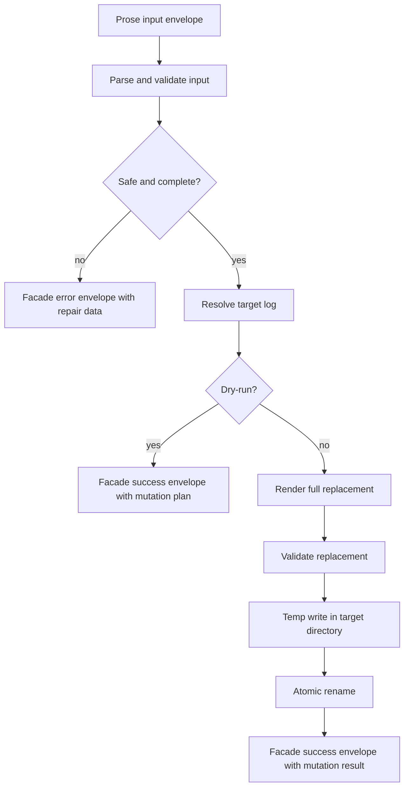

# Record Decision V2 Requirements

## Summary

Build `record-decision` as the v2 write surface for accepted repo decisions.
The command turns an agent-native prose input envelope into either a dry-run mutation plan, an executed mutation result, or structured repair guidance.
Runtime code, help, generated docs, and tests own exact input fields, output fields, diagnostics, and facade envelope details.
The first proof slice should prove dry-run record planning, structured repair, discovery metadata, and alignment checks before execute writes ship.

---

## Problem Frame

The current record-decision operating manual captures the shape of decision logging, but the write workflow is still prose-owned.
Agents can follow the manual, but durable mutation, duplicate prevention, privacy routing, supersession, and retry safety need runtime checks.

V2 should not become a search product, dashboard, database, or general decision assistant.
It should make one operation reliable: record an accepted decision in a repo decision log without guessing, leaking private context, or corrupting Markdown.

---

## Key Decisions

- **Record is the v2 write surface.** `record-decision` is the command that plans or writes accepted decisions.
- **Dry-run is default.** Real file writes require explicit execute mode.
- **Input is agent-native prose.** Agents provide intent in a prose envelope, and runtime parsing owns exact validation.
- **Acceptance is gated.** The command requires explicit acceptance and does not infer accepted decisions from discussion.
- **Owner and source are explicit.** The CLI does not infer missing `owner` or `source`.
- **Output uses the facade.** Runtime output uses `@side-quest/cli-command-facade` envelopes with package-owned `data`.
- **Supersession is two-sided.** Same-log supersession appends the replacement and updates old entries.
- **Writes are atomic per log.** Execute mode renders, validates, temp-writes, and atomically replaces the target file.
- **Dry-run planning proves the seam first.** The first implementation slice proves dry-run planning, structured repair, command discovery, and alignment checks without enabling execute writes.
- **Command names remain candidates until `create-cli`.** The proof slice can carry candidate spellings, but `create-cli` finalizes the CLI surface before implementation.
- **Existing log language stays canonical.** The proof slice keeps `V2 Ideas`; a `Future Ideas` rename needs a separate storage-shape decision.

---

## Actors

- A1. **Calling agent or human** supplies the accepted decision and follows returned repair or mutation evidence.
- A2. **`record-decision` runtime** parses input, resolves target log, validates safety gates, and emits facade-backed output.
- A3. **Decision log Markdown file** stores fenced YAML plus prose entries under `docs/decisions/`.
- A4. **Facade envelope consumer** reads success, repair, or safety data without scraping rendered Markdown.

---

## Requirements

**Command Surface**

- R1. `record-decision` supports dry-run planning by default and execute writes only through an explicit mode.
- R2. The command accepts an agent-native prose input envelope that runtime code parses into a package-owned TypeScript input contract.
- R3. The input contract requires an accepted decision, a scalar owner, a typed source object, and an explicit acceptance gate.
- R4. The command rejects missing `owner`, missing `source`, missing source anchor, missing acceptance, and hidden execute inference.
- R5. The command routes personal or private input to a scope failure instead of writing it into repo decision logs.

**Source And Targeting**

- R6. Source validation accepts at least one anchor and validates paths, UUID-shaped session IDs, and permissive labels according to runtime-owned rules.
- R7. Targeting is owner-driven, with optional `log_path` and `allow_create`.
- R8. `allow_create` defaults to false so new decision logs are not created accidentally.
- R9. Existing legacy-shaped logs are detected and blocked before mutation with repair guidance.

**Output And Recovery**

- R10. All runtime outputs use facade-owned success or error envelopes.
- R11. Package-owned success data describes either a mutation plan or completed mutation result.
- R12. Missing-input and out-of-scope failures return repair data with the failed gate, no-mutation evidence, and next repair action.
- R13. Duplicate conflict and legacy-shape failures return case-specific repair data without auto-migration.
- R14. Filesystem and post-write validation failures return mutation safety data with retry safety and partial-write evidence.

**Mutation Semantics**

- R15. Duplicate-looking decisions block before writing and return conflict repair guidance.
- R16. Same-log supersession previews and executes both the replacement entry and old-entry updates.
- R17. Cross-log supersession blocks before writing until a separate transaction strategy exists.
- R18. Execute mode renders full replacement content before writing and validates replacement content before rename.
- R19. Execute mode writes a temp file in the target directory and replaces the target with an atomic rename.
- R20. Dry-run mode does not create temp files.

**Drift Proof**

- R21. Code, help, generated docs, and tests own exact fields, action names, statuses, diagnostic codes, retry categories, and envelope details.
- R22. `SKILL.md` stays as routing and owner pointers, not copied contracts.
- R23. Discovery metadata, rendered help, parser acceptance, output envelope validation, and runtime semantics are tested together so they cannot drift independently.

**Dry-Run Planning Proof Slice**

- R24. The first proof slice implements dry-run record planning only and leaves execute writes unavailable or explicitly deferred.
- R25. The proof slice accepts one hybrid Markdown input format: YAML frontmatter for gates and Markdown body sections for prose.
- R26. Proof-slice gates require `accepted: true`, `owner`, `source`, and `decision`.
- R27. Proof-slice targeting may accept `log_path`; `allow_create` defaults to false.
- R28. Proof-slice `source` accepts repo-relative paths and human labels.
- R29. Frontmatter `decision` becomes the rendered `Decision` summary; an optional `## Decision` body section can expand it.
- R30. The proof-slice body requires `Rationale`, `Consequences`, `Next`, and `V2 Ideas`.
- R31. Dry-run success returns a facade success envelope whose package-owned `data` is a mutation plan only.
- R32. The mutation plan names target log, proposed decision id, planned append, validation summary, no-write evidence, and next safe action.
- R33. The first proofed negative fixture is `accepted` missing or not true.
- R34. The proof slice includes generated command discovery metadata and tests that align help, parser behavior, discovery metadata, JSON envelopes, and dry-run semantics.
- R35. Candidate spellings are `record-decision --input decision.md --json` for dry-run planning and `record-decision commands --json` for discovery; `create-cli` confirms or replaces them before implementation.

---

## Key Flows

- F1. **Dry-run planning**
  - **Trigger:** Caller supplies a complete accepted decision envelope without execute mode.
  - **Actors:** A1, A2, A3, A4
  - **Steps:** Runtime validates input, resolves target, checks conflicts, builds planned mutations, and returns a facade success envelope.
  - **Outcome:** No files change; caller sees target log, proposed decision identity, planned mutations, validation summary, and next safe action.
  - **Covered by:** R1, R2, R3, R6, R7, R10, R11, R20, R21

- F2. **Execute write**
  - **Trigger:** Caller supplies a complete accepted decision envelope with explicit execute mode.
  - **Actors:** A1, A2, A3, A4
  - **Steps:** Runtime validates input, resolves target, renders replacement content, validates it, writes a temp file, atomically replaces the target, and returns mutation evidence.
  - **Outcome:** The decision log contains the new entry and the caller receives a facade success envelope.
  - **Covered by:** R1, R15, R18, R19, R21, R23

- F3. **Repairable input failure**
  - **Trigger:** Caller omits required input, provides a private scope, or provides a source without an anchor.
  - **Actors:** A1, A2, A4
  - **Steps:** Runtime fails before target mutation and returns repair data.
  - **Outcome:** Caller sees what to change and no-mutation evidence.
  - **Covered by:** R4, R5, R12

- F4. **Supersession**
  - **Trigger:** Caller supplies a replacement decision with same-log `supersedes`.
  - **Actors:** A1, A2, A3, A4
  - **Steps:** Runtime resolves old entries, previews or executes the replacement, and updates old entries to point at the replacement.
  - **Outcome:** Same-log lifecycle state stays coherent.
  - **Covered by:** R16, R17, R18, R19

- F5. **Blocked compatibility or conflict**
  - **Trigger:** Target log is legacy-shaped, duplicate-looking, or cross-log supersession is requested.
  - **Actors:** A1, A2, A4
  - **Steps:** Runtime blocks before writing and returns case-specific repair guidance.
  - **Outcome:** Caller can choose a new target, clarify wording, add supersession, migrate manually, or hand off.
  - **Covered by:** R9, R13, R15, R17

- F6. **Dry-run planning proof slice**
  - **Trigger:** Caller supplies a hybrid Markdown decision input to the candidate dry-run planning surface.
  - **Actors:** A1, A2, A3, A4
  - **Steps:** Runtime parses the input, validates required gates, resolves the target, builds a mutation plan, and returns a facade success envelope.
  - **Outcome:** No files change; caller sees package-owned mutation-plan data and the next safe action.
  - **Covered by:** R24-R32, R35

- F7. **Acceptance gate failure fixture**
  - **Trigger:** Caller supplies proof-slice input where `accepted` is missing or not true.
  - **Actors:** A1, A2, A4
  - **Steps:** Runtime fails before target mutation and returns structured repair data.
  - **Outcome:** Caller sees the failed acceptance gate, retry safety, no-mutation evidence, and next safe action.
  - **Covered by:** R12, R24, R26, R33

- F8. **Proof-slice alignment check**
  - **Trigger:** The proof-slice tests run after command metadata, help rendering, parser rules, and dry-run runtime behavior exist.
  - **Actors:** A2, A4
  - **Steps:** Tests compare generated discovery metadata, rendered help, parser acceptance and rejection, JSON envelope validation, dry-run no-write semantics, and execute-deferred behavior.
  - **Outcome:** Public CLI surfaces cannot drift silently in the proof slice.
  - **Covered by:** R21-R24, R34, R35

---

## Acceptance Examples

- AE1. **Dry-run keeps filesystem unchanged**
  - **Covers:** R1, R11, R20
  - **Given:** A complete accepted decision envelope without execute mode.
  - **When:** The caller runs `record-decision`.
  - **Then:** The command returns a mutation plan and creates no temp files or target edits.

- AE2. **Execute writes one valid replacement**
  - **Covers:** R18, R19
  - **Given:** A complete accepted decision envelope with execute mode and a compatible target log.
  - **When:** The caller runs `record-decision`.
  - **Then:** The command validates rendered replacement content before rename and returns completed mutation evidence.

- AE3. **Missing owner is not inferred**
  - **Covers:** R3, R4, R12
  - **Given:** Input contains a decision and source but no owner.
  - **When:** The caller runs `record-decision`.
  - **Then:** The command returns repair data naming the missing owner and no-mutation evidence.

- AE4. **Private scope blocks repo write**
  - **Covers:** R5, R12
  - **Given:** Input describes a personal or private decision.
  - **When:** The caller runs `record-decision`.
  - **Then:** The command returns a privacy-specific scope failure and does not write to `docs/decisions/`.

- AE5. **Same-log supersession updates both sides**
  - **Covers:** R16
  - **Given:** Input supplies `supersedes` for entries in the same target log.
  - **When:** The caller executes the record command.
  - **Then:** The new decision is appended and old entries are marked superseded with a pointer to the replacement.

- AE6. **Cross-log supersession blocks**
  - **Covers:** R17
  - **Given:** Input supplies `supersedes` for an entry in a different decision log.
  - **When:** The caller runs dry-run or execute mode.
  - **Then:** The command returns repair guidance before writing.

- AE7. **Duplicate-looking decision blocks**
  - **Covers:** R15
  - **Given:** Input resembles an existing accepted decision for the target owner.
  - **When:** The caller runs `record-decision`.
  - **Then:** The command returns conflict repair guidance instead of appending a duplicate.

- AE8. **Write failure reports mutation safety**
  - **Covers:** R14
  - **Given:** File replacement fails or post-write validation fails.
  - **When:** The command returns an error envelope.
  - **Then:** The output states the failed phase, mutation evidence, partial-write status, retry safety, and next repair action.

- AE9. **Proof-slice dry-run returns mutation plan**
  - **Covers:** R24, R31, R32
  - **Given:** A complete hybrid Markdown decision input without execute mode.
  - **When:** The caller runs the proof-slice dry-run planning surface.
  - **Then:** The command returns a facade success envelope with mutation-plan data and performs no file writes.

- AE10. **Acceptance gate failure is structured**
  - **Covers:** R12, R26, R33
  - **Given:** Hybrid Markdown decision input where `accepted` is missing or not true.
  - **When:** The caller runs the proof-slice dry-run planning surface.
  - **Then:** The command returns facade-backed repair data with retry safety, no-mutation evidence, and a next safe action.

- AE11. **Execute is deferred in the proof slice**
  - **Covers:** R1, R24
  - **Given:** The proof slice has shipped without execute writes.
  - **When:** The caller requests execute mode.
  - **Then:** The command returns structured guidance instead of mutating a decision log.

- AE12. **Discovery and help stay aligned**
  - **Covers:** R21, R23, R34, R35
  - **Given:** Generated discovery metadata exists for the proof-slice command surface.
  - **When:** Tests compare discovery metadata, rendered help, parser behavior, JSON envelopes, and dry-run runtime behavior.
  - **Then:** The tests fail if any public surface describes behavior that the runtime does not support.

---

## Success Criteria

- `record-decision` can dry-run a complete accepted decision without file mutation.
- The first proof slice can plan a dry-run record mutation from hybrid Markdown input.
- The first proof slice returns facade-backed success output with mutation-plan data only.
- The first proof slice returns facade-backed repair output when `accepted` is missing or not true.
- The first proof slice proves execute mode is unavailable or deferred before writes exist.
- The first proof slice proves discovery metadata, rendered help, parser behavior, JSON envelopes, and dry-run semantics cannot drift.
- `record-decision` can execute a compatible write and leave the target log valid.
- Missing input, private scope, duplicate conflict, legacy shape, cross-log supersession, filesystem failure, and validation failure all return facade-backed structured output.
- Runtime tests cover parser acceptance, rendered help, discovery metadata, facade envelope validation, dry-run semantics, execute semantics, conflict handling, supersession, and write-failure safety.
- Skill prose points to runtime owners and does not copy exact command contracts.

---

## Scope Boundaries

**In Scope**

- Dry-run planning proof slice before execute writes.
- Hybrid Markdown input for the proof slice.
- Candidate command spelling for `create-cli` to confirm.
- `record-decision` input parser and validation.
- Dry-run mutation planning.
- Execute-mode write engine.
- Same-log supersession mutation.
- Facade-backed output envelopes with package-owned `data`.
- Tests that prove CLI/help/discovery/runtime contracts cannot drift.

**Deferred**

- Final command spelling until `create-cli`.
- Rich source anchors beyond repo-relative paths and human labels.
- `Future Ideas` rename.
- Execute writes inside the first proof slice.
- Cross-log supersession transactions.
- Legacy log migration command.
- Search, dashboard, database, or index surfaces.
- Persisted diagnostic artifacts.
- Output budget controls.

**Out Of Scope**

- Recording live unresolved choices.
- Inferring acceptance from discussion.
- Writing personal or private decisions into repo logs by default.
- Copying TypeScript contracts, facade fields, or generated output shapes into `SKILL.md`.

---

## Dependencies And Assumptions

- `@side-quest/cli-command-facade` remains the output transport owner.
- `create-cli` shapes the final command surface before implementation.
- The proof-slice candidate command spelling may change during `create-cli`.
- Historical decision logs may not match the new v2-compatible shape.
- The implementation can use same-directory atomic replacement on the target platform.
- Exact owner file paths for contract, model, engine, discovery, CLI, and tests are chosen during planning.

---

## Outstanding Questions

**Resolve Before Planning**

- None.

**Deferred To Planning**

- Run `create-cli` to finalize command spelling, discovery spelling, and owner paths.
- Choose concrete owner files for input contract, output data, engine, CLI facade binding, discovery metadata, and tests.
- Decide temp naming, cleanup, fsync, permission preservation, and platform-specific rename behavior.
- Decide how much rendered Markdown preview belongs in dry-run output without making it primary data.

---

## Sources

- `docs/brainstorms/2026-06-06-decisions-skill-operating-manual.md`
- `docs/decisions/2026-06-06-001-decisions-skill-decision-log.md`
- `skills/record-decision/references/operating-manual.md`
- `context/skill-design-philosophy.md`
- `skills/create-skill/references/agent-native-skill-design.md`
- `docs/decisions/2026-06-11-001-agent-cli-evaluation-decision-log.md`
- `docs/research/2026-06-11-agent-cli-seam-contract.md`
- `docs/research/2026-06-11-agent-cli-evaluation-rubric.md`
- `skills/create-cli/references/agent-native-cli-design.md`
