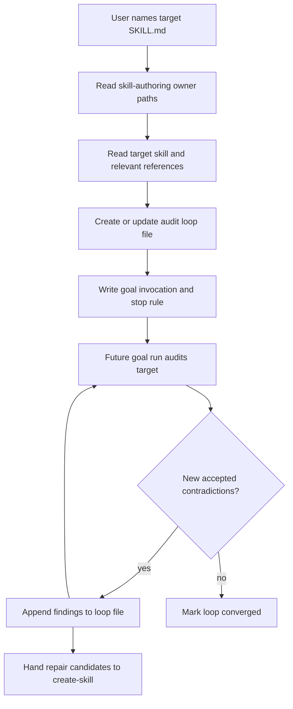

# Skill self-audit loop requirements

## Summary

Create a reusable skill that writes a goal-ready self-audit loop file for one target `SKILL.md`. The loop file gives a future goal run enough state, prior findings, stop rules, and repair handoff guidance to audit the target skill for contradictions without nesting loops or editing source.

---

## Problem Frame

Skill instructions drift as they accumulate owner paths, safety gates, examples, and routing rules. A one-shot review can find issues, but the evidence disappears into the transcript and the next pass repeats old findings.

The useful loop is not "keep reviewing until the skill has no problems." The useful loop is "record known findings, rerun a fresh audit, and stop when the fresh pass adds no new accepted contradictions."

---

## Key Decisions

- **Create a new `skill-self-audit-loop` skill.** The old `mvp-loop-maker` prototype is deleted and is not an owner, fallback, or bridge.
- **Use narrow manual intent.** Trigger only when the user asks to create, prepare, update, or resume a self-audit loop file for a specific skill; do not trigger for ordinary one-shot skill review.
- **Create state, not repairs.** The skill creates or updates the audit loop file and leaves source repair to `create-skill`.
- **Ship instruction-only v0.** Keep the loop-file template inline in `SKILL.md`; add a reference or helper only after real drift proves the inline shape is too heavy.
- **Store loop files outside skill source.** Each target skill has one stable committed loop file at `docs/skill-audits/<skill-directory-name>/self-audit-loop.md` so mutable audit state does not look like canonical skill source or skill-local runbook material.
- **Make the file goal-ready.** The file includes a copyable `/goal` invocation and `/loop` fallback, but the skill does not run either driver.
- **Keep `/loop` one-pass.** `/goal` drives to convergence or blocked status; `/loop` runs the next numbered pass, updates state, and stops.
- **Use a findings ledger as memory.** The loop file records accepted, duplicate, rejected, and unresolved findings so the next pass knows what changed.
- **Mark, don't delete findings.** Accepted findings stay in the loop file for duplicate detection, but non-active findings move to Finding History and no longer count toward convergence.
- **Start with setup, not audit.** New loop files start with empty findings lanes; the later `/goal` or `/loop` run performs the first audit pass.
- **Use agent-written stable signatures in v0.** Findings get human-readable IDs and kebab-case signatures; helper-generated IDs are deferred until repeated signature drift appears.
- **Skip a helper script in v0.** Add one only after real loop files show ledger-shape drift, duplicate-signature confusion, false convergence claims, or privacy-redaction drift.
- **Audit contradictions, not preferences.** A contradiction is a supported hard conflict between instruction sources: authority, scope, lifecycle, or safety.
- **Separate file status from finding status.** Loop file frontmatter owns whole-loop state; body entries own finding lifecycle state.
- **Reserve blocked for decision gates.** Repeated duplicates create dedupe warnings; blocked means evidence, authority, loop state, privacy, or a human decision prevents honest continuation or convergence.
- **Use two-tier owner-path loading.** Start with claim-relevant owner paths, record skipped paths, and load a skipped path before accepting any finding that depends on it.
- **Keep repair candidates as handoff evidence.** Repair Candidates link findings to owner paths and repair shapes for `create-skill`; they are not tasks and do not authorize source edits.
- **Keep research as rationale only.** Truth Stance says research explains loop shape, while findings require local source evidence; optional Research Anchors stay outside finding proof.
- **Audit one target skill at a time.** Whole-repo instruction audits are out of scope for v0.
- **Treat external research as rationale.** Research informs the shape, but local owner paths and repo evidence decide findings.

---

## Actors

- A1. **User** names the target skill or asks for a self-audit loop.
- A2. **Self-audit loop skill** creates or updates the loop file.
- A3. **Goal runner** follows the loop file in a later `/goal` or `/loop` run.
- A4. **Create-skill repair workflow** receives accepted findings when source changes are warranted.

---

## Key Flow

---

## Requirements

**Invocation**

- R1. The skill triggers only when the user asks to create, prepare, update, or resume a self-audit loop file for a specific skill.
- R1a. Ordinary one-shot skill review does not trigger this skill.
- R2. The skill requires one target `SKILL.md` before writing a loop file.
- R3. Missing target skill input asks one question instead of guessing.
- R4. The skill supports an existing loop file and preserves its findings ledger.
- R4a. Existing loop files update in place.
- R4b. Updating an existing loop file may refresh setup sections such as target, scope, owner paths, driver commands, stop rule, and next safe action.
- R4c. Updating an existing loop file preserves Open Findings, Finding History, Unresolved Questions, Dedupe Warnings, and Repair Candidates unless the user asks to change them or the update records a new pass result.

**Loop File**

- R5. The output is one markdown loop file with target, scope, loaded owner paths, pass ledger, stop rule, and next safe action.
- R6. The loop file includes a copyable `/goal` invocation for Codex and a `/loop` fallback for hosts without goals.
- R7. The loop file states that the driver reads the file and target skill, then audits in fresh passes.
- R8. The loop file is repo-relative, portable across machines, committed to the repo, and stored at `docs/skill-audits/<skill-directory-name>/self-audit-loop.md`.
- R8a. A new loop file starts with explicit empty Open Findings, Finding History, and Unresolved Questions sections.
- R8b. Creating a new loop file does not perform or claim an audit pass.
- R8c. Loop file frontmatter includes target skill, status, pass count, last pass, and convergence state.
- R8d. Loop file status is one of active, converged, blocked, or archived.
- R8e. The copyable `/goal` invocation tells the runner to resume from the loop file, read the loop file first, read the target `SKILL.md` second, read named owner paths third, audit only authority/scope/lifecycle/safety contradictions, update only the loop file, avoid skill source edits, and continue until convergence or blocked status.
- R8f. The `/loop` fallback runs exactly one fresh numbered audit pass, updates the loop file, records next safe action and file status, then stops.
- R8g. The v0 template uses state-first section order: Truth Stance, Driver Commands, Target, Scope, Loaded Owner Paths, Skipped Owner Paths, Pass Ledger, Open Findings, Finding History, Unresolved Questions, Dedupe Warnings, Repair Candidates, Stop Rule, Research Anchors, Next Safe Action.
- R8h. The skill creates `docs/skill-audits/<skill-directory-name>/` when missing and preserves unrelated working-tree changes.
- R8i. The loop file frontmatter names the exact target `SKILL.md` path so directory-name collisions can be detected.

**Audit State**

- R9. The loop file records accepted findings, duplicate known findings, rejected findings, unresolved questions, and repair candidates.
- R10. Each accepted finding includes evidence, conflict shape, affected owner path, and pass number.
- R11. Duplicate findings never count as new contradictions.
- R12. Rejected findings include a reason such as unsupported, duplicate, out of scope, or not actionable.
- R12a. Findings use evidence-based statuses only: open, resolved, rejected, duplicate, or superseded.
- R12b. Open findings are visually separate from Finding History.
- R12c. Non-active findings in Finding History include repair evidence, duplicate target, supersession target, or rejection reason and do not count as active convergence blockers.
- R12d. Findings are deleted only when unsafe, private, or written in error.
- R12e. Each finding has a human-readable ID and a stable kebab-case signature.
- R12f. Duplicate findings link to an existing signature.
- R12g. Accepted contradiction findings identify two conflicting sources and the impossible combined behavior.
- R12h. Accepted contradiction findings classify the conflict as authority, scope, lifecycle, or safety.
- R12i. Style, taste, missing examples, and vague wording are rejected unless they create an authority, scope, lifecycle, or safety conflict.
- R12j. Unresolved Questions contain only concrete questions that block classification of a possible finding.
- R12k. Each unresolved question names the possible signature, what it blocks, and the evidence needed to answer it.
- R12l. Answered unresolved questions become an open finding, a Finding History entry, or are removed when written in error.

**Stop Rule**

- R13. The loop stops only after a fresh audit pass adds zero new accepted contradictions.
- R14. The loop does not require total findings to reach zero.
- R15. The loop reports blocked convergence only when evidence is missing, authority is unclear, loop state is corrupt, privacy rules prevent recording needed evidence, or a human decision is required.
- R15a. Repeated duplicate findings create dedupe warnings and do not block convergence by themselves.
- R16. The loop includes a maximum-pass safety limit only as a cost guard, not as proof of convergence.

**Repair Handoff**

- R17. The loop file names `skills/create-skill/SKILL.md` as the repair owner for target skill source changes.
- R18. Repair candidates name the smallest owner path and evidence that would justify a later source patch.
- R19. The self-audit loop skill never edits the target skill as part of creating or updating the loop file.
- R20. A later repair workflow must reread the target skill and owner paths before acting on loop findings.
- R20a. Repair candidates are evidence handoffs, not task queue items.
- R20b. Repair candidates do not authorize source edits.
- R20c. One repair candidate can cover multiple findings only when the same source edit would address them.

**Research And Source Use**

- R21. The loop file can cite research anchors that explain the loop shape, but findings must come from local source evidence.
- R22. The skill reads `skills/create-skill/references/skill-design-decision-runbook.md` before generating a loop for skill audits.
- R23. The skill reads only target-relevant references beyond the target `SKILL.md`.
- R24. The skill records skipped owner paths and why they were skipped.
- R24a. A skipped path can remain skipped until a possible finding depends on it.
- R24b. Before accepting a finding that depends on a skipped path, the driver loads that path or keeps the finding unresolved.

**Safety**

- R25. The loop file never stores secrets, raw transcripts, raw private payloads, cookies, tokens, or auth-bearing URLs.
- R26. The loop treats audit findings as evidence, not canonical instruction.
- R27. The loop surfaces privacy redactions, skipped checks, and degraded evidence.

---

## Acceptance Examples

- AE1. **Covers R2, R5, R6.** Given a target `skills/foo/SKILL.md`, when the user asks for a self-audit loop, then the skill writes a markdown loop file with a target, scope, `/goal` invocation, and `/loop` fallback.
- AE2. **Covers R9, R11, R13.** Given an existing loop file with known findings, when a fresh audit repeats the same findings and adds none, then the loop marks convergence instead of reopening duplicates.
- AE3. **Covers R17, R19.** Given the audit finds a contradiction in the target skill, when the loop file records it, then it writes a repair candidate and leaves source edits to `create-skill`.
- AE4. **Covers R22, R23, R24.** Given the target skill references several owner files, when the loop file is created, then it records which owner paths were read and which were skipped.
- AE5. **Covers R25, R27.** Given a target skill or transcript contains private data, when the loop file is written, then sensitive content is redacted and the redaction is visible.

---

## Success Criteria

- A future agent can run the loop from the file without rereading this brainstorm.
- The loop avoids rediscovering known contradictions as if they were new.
- The stop condition is inspectable from the ledger.
- Repair work enters `create-skill` with evidence and owner paths.
- The loop file stays stateful enough to resume and small enough to read in the first minute.

---

## Scope Boundaries

- Do not run `/goal` from inside the skill.
- Do not edit the target `SKILL.md` inside the loop-creation skill.
- Do not audit every skill in the repo in v0.
- Do not create a scheduled automation in v0.
- Do not build a runtime-backed CLI unless planning finds repeated manual drift.
- Do not treat the loop file as canonical skill instruction.

---

## Dependencies And Assumptions

- `create-skill` remains the canonical owner for skill authoring, review, healing, repair, archive, and merge.
- Codex `/goal` is available for the preferred invocation path, with `/loop` kept as a fallback.
- The repo can store brainstorms and loop files as markdown under `docs/`.
- The first implementation is instruction-only unless repeated loop-file drift justifies a reference template or helper script.
- Existing loop-engineering research remains a recall layer, not policy.
- Helper-script triggers: two real loop files show ledger-shape drift, duplicate-signature confusion, false convergence claims, or privacy-redaction drift.

---

## Outstanding Questions

### Deferred To Planning

- What exact loop file template should v0 generate?

---

## Sources

- `docs/research/loop-engineering-patterns/09-self-auditing-loop.html`
- `docs/research/2026-06-09-agentic-loop-community-signal.md`
- `docs/research/2026-06-10-loop-engineering-handoff.md`
- `docs/brainstorms/2026-06-10-skill-follow-up-feedback-loop-requirements.md`
- `skills/create-skill/SKILL.md`
- `skills/create-skill/references/skill-design-decision-runbook.md`
- `skills/runbook-orchestrator/SKILL.md`
- `skills/runbook-orchestrator/references/readme-template.md`
- OpenAI Codex manual: skills, `AGENTS.md`, slash commands, automations, and goal behavior.
- Context7 `/openai/codex`: skill discovery, frontmatter parsing, and goal status constraints.
- Anthropic, "Building effective agents": evaluator-optimizer workflow, simplicity, transparency, stopping conditions.
- Anthropic Claude docs: tool-use agentic loop, context management, stop reasons, iteration limits.
- Self-Refine paper: iterative feedback and refinement until a stopping condition.
- Reflexion paper: reflective text in an episodic memory buffer for later trials.
- X post `2064447192212127937`: skill/instruction contradictions surfaced by a model reading its own instruction repo.
- X post `2064282305926221964`: loops without state and change context become token-burning retry systems.
