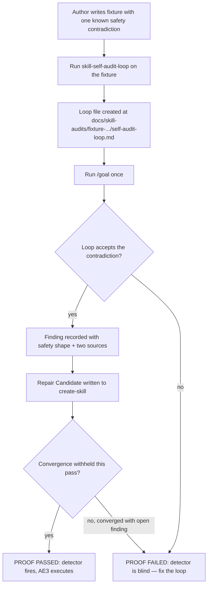

# Skill self-audit loop v2 — prove the detector fires

## Summary

v1 of `skill-self-audit-loop` works end-to-end: point it at a skill, run `/goal`, get a converged audit file with no babysitting. It has run live twice (on itself and on `cli-author`), both converging at pass 2 with zero contradictions.

That is also the problem. The loop has **only ever returned clean.** The detect → repair-candidate → handoff path (AE3 in v1) has never executed. A detector that has never fired on a positive is unfalsified, not validated — a clean result is indistinguishable from a blind one.

v2 is a single validation test: plant one skill with one known contradiction, run the loop once, and confirm it catches the bug, writes a repair candidate, and refuses to converge. That is the whole of v2.

---

## Problem Frame

Both v1 runs followed the same rhythm: pass 1 raises candidate contradictions and rejects them; pass 2 resolves the last open question and converges at zero. The value showed up in the rejected-candidate trail, but the loop never had to *accept* a contradiction and hand it off.

The loop's own stop rule rewards finding nothing ("converged: a fresh pass adds zero new accepted contradictions"). So a blind detector is maximally rewarded by the current design — it converges fastest and looks cleanest. Until the loop is shown catching a real, known contradiction, "the loop works" is an unproven claim.

This is a **detector-validation** gap, not a capability gap. The fix is a known-answer test, not more loop machinery.

---

## Key Decisions

- **v2 is a validation test, not a feature.** The deliverable is a planted fixture plus one observed run, proving the loop catches a real contradiction. No new loop machinery.
- **Plant one positive fixture.** One throwaway skill with exactly one unambiguous contradiction. v0's AE3 — find a contradiction, write a repair candidate, hand to `create-skill` — finally executes against a known answer.
- **Use a `safety`-shape contradiction.** Workflow step says "edit the target source"; Safety section says "never edit the target source." Both cannot be followed. Clearest shape, highest stakes, hardest to rationalize away.
- **One run, observed by a human.** Proof is reading the resulting loop file, consistent with v0's instruction-only, no-helper stance. No automated assertion harness in v2.
- **No sweep.** A multi-skill sweep was explored and rejected: it confounds "detector works" with "library has bugs," its null result is uninterpretable, and it crosses v0's "do not audit every skill" boundary. Discovery-sweeping the real library is a separate future brainstorm with its own boundary-change justification.
- **No resume / skip seam.** A "skip already-converged skills" optimization was explored and rejected: mtime is meaningless under git, `last_pass` is day-granular, owner-path edits and rubric changes evade a target-only fingerprint, and `convergence: converged` is an agent's prose claim the seam would trust forever. The false-clean hazard outweighs the cache benefit.
- **Fixtures co-located under the owning skill.** `skills/skill-self-audit-loop/fixtures/<namespaced-folder>/SKILL.md`. Co-location keeps fixtures maintained when the Contradiction Rule changes; namespaced folder names keep the derived loop-file path from colliding.
- **No Path Rule change.** The fixture is named `SKILL.md` so the existing Path Rule works unchanged. Repo skills load via manifest/symlink, not a repo scan, so an inert fixture file does not auto-load as a real skill.
- **Defer the negative control.** A near-miss fixture (looks like a conflict, genuinely "both followable", must be rejected) and the run-it-2-3×-for-nondeterminism probe are deferred. Add them only if the positive passes and more rigor is wanted.

---

## What v2 Is Not

- Not a multi-skill sweep or batch driver.
- Not a resume/skip-converged seam.
- Not a helper script, CLI, or runtime-backed surface.
- Not a v0 scope-boundary change.
- Not an automated assertion harness.

---

## Actors

- A1. **Author** writes the planted-broken fixture skill.
- A2. **Self-audit loop skill** writes the fixture's loop file (unchanged from v1).
- A3. **Goal runner** runs one audit pass against the fixture via `/goal`.
- A4. **Human reviewer** reads the loop file and confirms the three proof artifacts.

---

## Key Flow

---

## Requirements

**Fixture**

- R1. v2 adds one fixture skill at `skills/skill-self-audit-loop/fixtures/<namespaced-folder>/SKILL.md`.
- R2. The fixture contains exactly one contradiction of `safety` shape: a Workflow step that authorizes editing target source, and a Safety rule that forbids editing target source.
- R3. The contradiction is unambiguous — both instructions cannot be followed, with no "both followable" reading.
- R4. The fixture folder name is namespaced (e.g. `fixture-positive-safety`) so the derived loop-file directory does not collide with a real skill name.
- R5. The fixture is otherwise a minimal, well-formed `SKILL.md` so the planted contradiction is the only finding the loop should accept.

**Run**

- R6. The existing `skill-self-audit-loop` skill writes the fixture's loop file with no skill-source changes.
- R7. One `/goal` audit pass runs against the fixture.
- R8. v2 requires no changes to the v1 Path Rule, Contradiction Rule, or loop-file template.

**Proof**

- R9. The loop records the planted contradiction as an accepted finding in Open Findings.
- R10. The accepted finding classifies the conflict as `safety` and names the two conflicting sources and the impossible combined behavior.
- R11. The loop writes a Repair Candidate pointing to `skills/create-skill/SKILL.md` (AE3 executes end-to-end for the first time).
- R12. The loop does NOT mark convergence on the pass that holds an open accepted finding.
- R13. Proof is confirmed by a human reading the loop file; no automated assertion is required in v2.
- R14. If any of R9–R12 fail, the result is a found defect in the loop, recorded for a loop-source fix via `create-skill`.

**Hygiene**

- R15. If a deliberately-broken `SKILL.md` under `fixtures/` trips repo-wide biome or owner-path checks, exclude `**/fixtures/**` from those checks (same pattern as the existing docs-HTML and `**/dist` exclusions).

---

## Acceptance Examples

- AE1. **Covers R1, R2, R9.** Given a fixture skill with a Workflow "edit source" step and a Safety "never edit source" rule, when the loop audits it, then the loop records one accepted `safety` contradiction.
- AE2. **Covers R11.** Given the accepted contradiction, when the loop file is written, then it contains a Repair Candidate naming `skills/create-skill/SKILL.md` and the smallest owner path / repair shape.
- AE3. **Covers R12.** Given one open accepted finding, when the pass completes, then the loop file status is not `converged`.
- AE4. **Covers R14.** Given the loop converges clean or rejects the planted contradiction, when the human reads the loop file, then the run is recorded as a loop defect, not a pass.

---

## Success Criteria

- The detect → repair-candidate → handoff path (AE3) executes against a known answer for the first time.
- The loop is shown distinguishing a real contradiction from the clean skills it has audited so far.
- The proof is reproducible: the fixture stays in the repo, and any future loop change can be re-validated by re-running it.
- v2 adds no machinery the validation goal did not require.

---

## Scope Boundaries

- Do not build a sweep, batch driver, or multi-skill orchestration.
- Do not build a resume / skip-converged seam.
- Do not change the v1 skill's Path Rule, Contradiction Rule, or template.
- Do not add a helper script, CLI, or scheduled automation.
- Do not plant more than one contradiction in the v2 fixture.

---

## Deferred (future brainstorms, not v2)

- **Negative control fixture** — a near-miss that looks like a contradiction but is genuinely "both followable"; assert the loop rejects it.
- **Classification-stability probe** — run the positive + negative pair 2–3× to measure whether the accept bar ("a hard conflict where both cannot be followed") is deterministic or prose-dependent.
- **Contradiction Rule sharpening** — if the stability probe shows drift, harden the accept bar into a more decidable test.
- **Real-library discovery sweep** — auditing several real skills for genuine drift; a capability feature needing an explicit v0→v2 boundary-change decision, not a validation test.

---

## Dependencies And Assumptions

- The v1 skill, its Path Rule, and its loop-file template remain unchanged and correct.
- Repo skills are discovered via manifest/symlink, not a repo-wide `**/SKILL.md` scan, so an inert fixture file does not auto-load as a real skill. (Assumption — verify before relying on it if a recursive sync is ever added.)
- `create-skill` remains the canonical repair owner for any loop-source defect R14 surfaces.
- The planted `safety` contradiction stays valid only against the current Contradiction Rule; sharpening the rule later may require re-validating the fixture (deferred-item dependency).

---

## Outstanding Questions

- Does `**/fixtures/**` need excluding from biome/owner-path checks, or does the existing config already tolerate a malformed fixture `SKILL.md`? (Resolve at implementation; R15 names the fix if needed.)

---

## Sources

- `docs/brainstorms/2026-06-10-skill-self-audit-loop-requirements.md` (v0/v1 baseline)
- `docs/skill-audits/skill-self-audit-loop/self-audit-loop.md` (live run 1, converged clean)
- `docs/skill-audits/cli-author/self-audit-loop.md` (live run 2, converged clean)
- `skills/skill-self-audit-loop/SKILL.md` (v1 skill; Contradiction Rule, Path Rule, AE3)
- Adversarial review (4 independent reviewers, 2026-06-10): sweep confounds detector-vs-library and is dominated by a planted-positive fixture; resume seam carries three false-clean failure modes; v0 boundary requires explicit change to sweep; goal is unachievable without a known-positive oracle.
