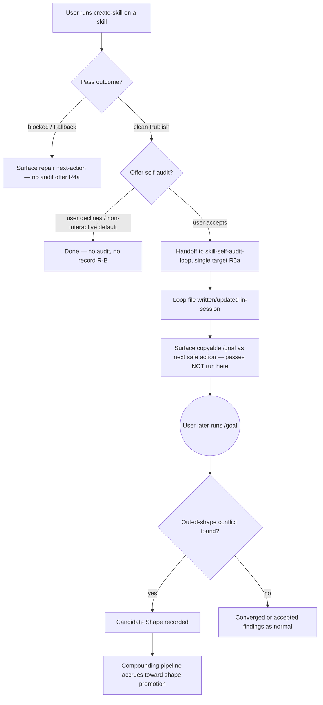

# Skill self-audit loop v3 — fold the audit into create-skill

## Summary

v1 made the audit loop converge clean; v2 proved it catches a real bug; the
out-of-shape mechanism lets it track its own blind spots. The loop works. It is
barely used.

v3 makes audits actually happen — by folding the self-audit into `create-skill`'s
existing review/repair/heal flow, so a skill is audited at the moment `create-skill`
engages it (edits *or* reviews it), without anyone remembering to run it.

## Status — Unblocked (both preconditions cleared 2026-06-10)

An 8-reviewer adversarial swarm (2026-06-10) found two of the three convergent
findings blocking. **Both have since cleared.** v3 is buildable.

- **P1 PASSED** — detector validated on real skills (5 contradictions / 4 skills).
- **P2 RESOLVED** — collapsed to "ship the offer as prose, build nothing" after a
  grill + Decision Mode pass (2026-06-10). R-A ("mechanical trigger") was a
  category error and is retracted; the offer honestly *rides an existing
  checkpoint*. Breadth is demoted from success criterion to a free `ls`/`git log`
  curiosity. The offer-vs-sweep question (#4) is parked for v4 with a trip-wire.

What remains before implementation is mechanical, not blocking: the flow gaps
(G1-G3) and target ambiguities below. The single-target happy path is rigorous.

- **P1 (gate before build) — validate detector sensitivity. ✅ PASSED
  (2026-06-10).** Ran the detector's accept bar against 6 drift-prone real skills.
  Result: **5 unplanted contradictions across 4 skills**, 1 clean, 1 correctly
  parked out-of-shape. The R-C blocker ("never fired on a real skill") is
  falsified — the detector fires, discriminates (issue-to-pr clean vs.
  classic-cinema dirty), and the out-of-shape mechanism worked live. Hits:
  heal-skill (safety: heals without the AGENTS.md runbook gate; authority: owns
  create-skill's heal contract), runbook-orchestrator (authority: `report.md`
  calls `git show` that `allowed-tools` never grants), productivity-sync (safety:
  a Gotcha says skip the email body, contradicting `email-read-fully`),
  classic-cinema (authority: `booking-log.md` documents the inline `jq -n >>`
  append the gotcha bans). productivity-connectors parked a real `cross-source`
  conflict (`gcal_*`/`gmail_*` rows vs the decommission rule). Triggering the
  detector more is worth building. These 4 hits are also live repair candidates
  for create-skill, independent of v3.
- **P2 (RESOLVED 2026-06-10) — ship prose, build nothing.** The original fork was
  "own prose vs. scope an enforcement check." Resolution: **retract R-A.** The
  "mechanical trigger" framing was a category error — it imported the
  *human-discipline* problem ("nobody remembers to run the audit") onto an
  *agent-output* problem ("print a line at a checkpoint the agent is already at").
  The human-discipline problem *is* fixed: the offer rides a checkpoint the agent
  already executes. A missed offer degrades to the pre-v3 status quo for one pass —
  free. So no enforcement check is needed (it would be a new contract + run-trigger
  to enforce string-presence, not a genuine offer). Observability follows: breadth
  is demoted from success criterion to curiosity, answerable for free by `ls` /
  `git log` over `docs/skill-audits/` — no record built, honoring the runbook's
  no-telemetry-until-manual-review-fails rule. Full reasoning:
  `docs/ideation/2026-06-10-skill-self-audit-loop-p2-observability-ideation.html`.

## Problem Frame

The intended v3 was "use it across the library" (breadth). Pressure-testing the
trigger surfaced the real constraint: manual breadth will not happen. A usage
practice that depends on remembering to run it runs zero times — the same
trigger-needs-to-be-on-the-existing-path lesson the out-of-shape tracking design
already hit.

So the breadth goal survives, but "manual" is dropped. Folding into `create-skill`
is the trigger with the least new machinery: `create-skill` already opens a skill
at the moment it engages it. The honest framing (post-P2) is **"rides an existing
checkpoint,"** not "mechanical trigger."

One honesty caveat the swarm forced, now resolved:

- The offer is **not** a mechanical trigger — it rides a `Publish` prose line
  nothing enforces. P2 settled this by retracting the "mechanical" thesis as a
  category error rather than building enforcement: the discipline v3 fixes is the
  *human* never remembering to run the audit, and that is fixed by riding a
  checkpoint the agent already executes. A missed offer is free (one pass reverts
  to the status quo). See Status / P2.
- create-skill is where one *class of authored change* exits, not where drift
  enters. Hand edits, edits by other skills, and direct file edits still go
  unaudited (see Dependencies). The deferred hook-on-change is the option that
  actually matches "audit on any edit"; create-skill was chosen for cheapness, not
  coverage. P1 must confirm the cheap trigger is worth building at all.

## Key Decisions

- **Breadth via checkpoint, not discipline.** The value is audits that actually
  happen and feed the compounding pipeline, not a library-wide manual habit.
- **Trigger = create-skill flow.** At the end of a create/fix/heal/repair/review
  pass, `create-skill` offers the self-audit on the skill it just touched.
- **Offer host = the single Publish checkpoint.** The offer rides `create-skill`'s
  one Run Card `Publish` line (`skills/create-skill/SKILL.md:27`), not a per-route
  prompt. Every `Pick One` route is *meant* to exit through that line, so a single
  host covers all routes. Caveat (Feasibility F1): the `Publish` line is a Run Card
  bullet, not a control-flow node — routes do not mechanically "exit through" it;
  the agent is trusted to honor it. So "fires once per pass" (R4) is one-host, not
  enforced — and per P2, that is fine: a missed offer is free (one pass reverts to
  status quo), so no enforcement is needed. Resolves *where* to host the offer
  (Outstanding Question below).
- **Offer shape = a sibling `Skill self-audit:` line.** A distinct Publish line,
  adjacent to but separate from the checker-bound `Skill follow-up:` line. Folding
  it into `Skill follow-up:` would mutate a contract `check-gotcha-decision` parses
  and blur two concerns; a sibling keeps both legible and leaves the checker
  untouched.
- **"Engaged," not "edited."** The trigger invariant is "create-skill engaged this
  skill," not "edited it." The offer fires after `review` too — a read-only review
  is a natural audit moment. The audit reads then-current source, so there is no
  race with not-yet-applied review findings; a later fix pass offers its own audit.
- **Accept = write the loop file + surface `/goal`.** On accept, `create-skill`
  hands off to `skill-self-audit-loop` to write/update the loop file in-session,
  then surfaces the copyable `/goal` command as the next safe action. It does not
  run the audit passes (honoring the loop skill's "do not run `/goal` or `/loop`"
  step and R3). Accepting writes the file; the user still launches and reads the
  `/goal` run (see Risk: accept is not one keystroke). Handback target (composition
  rule `runbook:141`): control returns to the user at the loop file's own "Next
  Safe Action: run `/goal`"; the create-skill pass is complete. The accept
  confirmation must set this expectation in-the-moment — e.g. "Audit queued for
  `<skill>`; loop file written. Run `/goal` when ready; expect 3-5 passes before
  findings" — not imply findings appear inline.
- **Offer fires unconditionally; triviality is handled by decline.** The offer
  shows on every pass; the user declines on trivial passes (default-safe, R2).
  No "is this pass trivial?" judgment enters `create-skill` — that discretion would
  drift back toward the discipline-dependence v3 kills. Only the audit is heavy,
  and it is gated behind accept.
- **Self-healing does not change the audit target.** If a pass incidentally
  self-heals `create-skill`'s own bundle, the offer still targets the skill the
  user invoked `create-skill` on. Auditing `create-skill` itself is the ordinary
  path: run `create-skill` on `create-skill` as a normal target.
- **Landing = `SKILL.md:27` line + runbook Composition subsection.** v3 lands as
  one offer line on the Publish checkpoint plus a subsection in
  `references/skill-design-decision-runbook.md`'s `## Composition` (offer → accept
  → handoff → `/goal` mechanics + target rule). It is a reusable-rule addition,
  routed through `create-skill`'s own Evidence Loop at implementation time.
- **Offer, not auto-run.** `create-skill` offers the audit at the checkpoint; it
  does not auto-run. Trivial passes should not force a full audit, and an
  unattended auto-audit trains the user to ignore it. Flipping offer to auto later
  is a deferred change — not the one-line flip earlier framing assumed (see Risk:
  the auto-run flip is no longer a one-liner).
- **Explicit handoff, not auto-invoke.** Composition is a `create-skill` driver
  handing off to `skill-self-audit-loop`, per the skill-composition rules — not
  an automatic skill-invokes-skill call.
- **The change lives in create-skill.** v3 is a `create-skill` integration, not a
  change to `skill-self-audit-loop` source. It routes through create-skill's own
  authoring rules.
- **No new infra.** No git hook, no cron, no sequencer, no scheduled automation.
- **No boundary change.** Still one target per audit invocation; v0's
  "one target / do not audit every skill" boundary stays intact — the audit fires
  per skill, at the checkpoint, not as a sweep.

## What v3 Is Not

- Not a git hook or file-watcher.
- Not a scheduled/cron sweep (the v0 deferred automation).
- Not a multi-skill sequencer or batch driver.
- Not an auto-run on every create-skill pass.
- Not a change to the audit loop's Contradiction Rule, Path Rule, or template.

## Actors

- A1. **User** runs `create-skill` to create, fix, heal, repair, or review a skill.
- A2. **create-skill driver** reaches the end of its pass and offers the audit.
- A3. **skill-self-audit-loop** receives the handoff and produces/updates the loop
  file for that one skill.
- A4. **Compounding pipeline** accumulates out-of-shape candidates across the
  audits that now happen.

## Key Flow

## Requirements

**Trigger**

- R1. At the end of a create/fix/heal/repair/review pass, `create-skill` offers
  to run the self-audit on the skill it just touched.
- R2. The offer is a single explicit prompt; declining is the default-safe path.
- R3. `create-skill` does not auto-run the audit without the offer being accepted.
- R4. The offer fires once per pass, naming the specific skill.
- R4a. **Clean-Publish gate (Flow G2/G3).** The offer fires only on a clean
  `Publish` exit. A blocked/Fallback pass (`SKILL.md:28`) surfaces a repair
  next-action, not an audit offer — never an audit of a half-applied edit or a
  malformed target. "Engaged" means a completed engagement, not any termination.
- R4b. **Offer text reflects loop state (Flow G5).** When
  `docs/skill-audits/<name>/self-audit-loop.md` already exists, the offer names
  whether accept *resumes* an existing audit (with open-finding count / status)
  or *starts* a new one — the user does not accept blind to reopening converged
  findings.

**Handoff**

- R5. Acceptance hands off to `skill-self-audit-loop` via an explicit driver
  handoff, naming the target skill path.
- R5a. **Target Selection (Flow G1, Security F1).** Multi-skill routes (merge,
  archive sweep) must define the single target before handoff: the offer targets
  the surviving/destination skill only, and the doc states which other touched
  skills go unaudited (R4 fires once, so an N-skill archive drops N-1 — name that
  explicitly, do not let "one target" silently mask it). Before constructing the
  handoff, `create-skill` re-confirms the original invocation target, especially
  after an in-pass self-heal; the audit target must match the skill named in the
  user's invocation. Fail closed when the target is ambiguous — stop, do not guess.
- R6. The handoff passes the one skill `create-skill` just touched as the audit
  target; no multi-skill expansion.
- R7. The audit runs unchanged — same Path Rule, Contradiction Rule, template,
  and out-of-shape mechanism.

**Composition context**

- R7a. **Non-interactive resolution (Flow G4).** In a `mode:agent` / sub-agent
  run with no human at the checkpoint, the offer resolves to its default-safe
  outcome (no audit, per R2); optionally record an offered-but-unanswered marker
  (ties to R-B).
- R7b. **Callee context (Flow G6).** When `create-skill` runs as a callee of
  another driver, the audit offer is part of the handback (named in remaining-work
  / next-safe-action), not an inline interrupt into the parent flow.

**Boundary**

- R8. One target per audit invocation; no sweep, no batch.
- R9. v3 changes `create-skill` flow only; `skill-self-audit-loop` source is
  unchanged.
- R10. No git hook, file-watcher, scheduler, or cron.

## Acceptance Examples

- AE1. **Covers R1, R2.** Given a user finishes a create-skill repair pass, when
  the pass completes, then create-skill offers to audit that skill and declining
  ends the flow cleanly.
- AE2. **Covers R5, R6.** Given the user accepts the offer, when the handoff runs,
  then skill-self-audit-loop produces/updates the loop file for exactly that one
  skill.
- AE3. **Covers R3.** Given a trivial metadata-only create-skill pass, when it
  completes, then the `Skill self-audit:` offer still shows and the user declines;
  no audit runs unless the user accepts. The offer is not suppressed on trivial
  passes — only the heavy audit is gated, behind accept.
- AE4. **Covers R4a.** Given a create-skill pass that ends in blocked/Fallback
  state with a half-applied edit, when the pass terminates, then no audit offer
  fires; the response surfaces a repair next-action instead.
- AE5. **Covers R5a.** Given a merge of `skill-a` + `skill-b` into `skill-a`, when
  the pass completes, then the offer targets `skill-a` (the surviving skill) only,
  and the response names that `skill-b` and any owner-path edits in third skills
  are not audited by this offer.
- AE6. **Covers R4b.** Given an existing converged loop file for the target, when
  the offer fires, then it names "resume existing audit (converged, N findings)"
  rather than a generic start, so accept is an informed choice.

## Success Criteria

Outcome first, activity second — the swarm flagged "audited more often" as a
vanity metric. P2 demoted aggregate breadth from a success criterion to a
curiosity.

- **Gating outcome metric (the bar):** the loop has accepted ≥1 *unplanted*
  real-skill contradiction. ✅ met by P1 (5 across 4 skills). This — not trigger
  rate — is what "the detector is worth triggering" rests on.
- **Breadth is a curiosity, not a criterion.** "Audited more often" is no longer a
  tracked metric (it was activity, not outcome). If breadth is ever in question, it
  is answerable for free: `ls docs/skill-audits/` (how many skills ever audited),
  per-file `last_pass` (freshness), `git log -- docs/skill-audits/` (timeline). No
  record is built; a declined offer leaving no file is acceptable, because the
  absence is itself a readable "never audited" state. This honors the runbook's
  no-telemetry-until-manual-review-fails rule.
- The compounding pipeline (out-of-shape -> recurrence -> promotion) receives real
  input from accepted audits.
- No new always-on automation; the trigger rides an existing human checkpoint.

## Scope Boundaries

- Do not add a hook, watcher, scheduler, or cron.
- Do not build a multi-skill sweep or sequencer.
- Do not auto-run without the offer.
- Do not change the audit loop's source contracts.
- Do not expand past one target per invocation.

## Risks

Surfaced by adversarial riff then confirmed by an 8-reviewer swarm (grill session
2026-06-10). R-A and R-C were re-sized up to **blocking preconditions** (P2, P1)
after three lenses converged — and both have since cleared: R-C resolved by the P1
validation, R-A retracted by the P2 grill (see below). R-D and below are
implementation-time concerns.

- **R-C → P1 (✅ RESOLVED 2026-06-10). The detector now has fired on real skills.**
  The original worry: the loop had only ever returned clean on real skills, so
  scaling its trigger might manufacture false confidence. Tested against 6
  drift-prone real skills → 5 unplanted contradictions across 4 skills, 1 clean, 1
  out-of-shape (see Status). The detector fires and discriminates; the accept bar
  is not too narrow to catch real drift. v3's premise (triggering it more has
  value) holds. Remaining nuance: the bar parks `cross-source` conflicts
  out-of-shape by design (productivity-connectors), so global-rule-vs-skill drift
  still needs shape promotion to become a blocking finding — a loop-source
  question, not a v3 blocker.

- **R-A → P2 (✅ RETRACTED 2026-06-10). The "offer must be mechanical" claim was a
  category error.** The original worry: the offer rides a `Publish` prose line
  nothing enforces, so "fires once per pass" (R4) is agent-remembers-to-print-it —
  framed as the exact failure v3 set out to kill. The P2 grill showed this imported
  the *human-discipline* problem ("nobody remembers to run the audit") onto an
  *agent-output* problem ("print a line at a checkpoint the agent is already at").
  The human-discipline failure *is* fixed — the offer rides a checkpoint the agent
  already executes; nobody is relying on memory. A missed offer degrades to the
  pre-v3 status quo for one pass — free. An enforcement check would cost a new
  contract + run-trigger to enforce string-presence (not a genuine offer), so it is
  not worth building. Resolution: ship prose; reframe the thesis as "rides an
  existing checkpoint."

- **R-B → (✅ DOWNGRADED 2026-06-10). Decline is invisible — and that is fine.** The
  original worry: a declined offer leaves no record, so "few audits" can't be told
  apart from "everyone declines." P2 removed the dependency: breadth is no longer a
  success criterion (demoted to curiosity), so nothing rides on the unmeasurable
  count. When breadth *is* in question, the audit directory answers it for free
  (`ls` / `git log` / file-absence-as-state) — no record needed, no telemetry built.

- **R-D. Habituation trains a reflex-decline.** Firing on every pass — including
  trivial metadata edits and read-only reviews — makes the high-frequency case
  "offer → decline." After a few zero-value fires, decline becomes muscle memory
  anchored to response position, and the offer on a substantive pass gets declined
  reflexively. The value-bearing event (audit runs) is still 100% discipline-gated
  at accept; v3 mechanizes printing the prompt and leaves the expensive half as
  fragile as before. Acute for Nathan (ADHD, reduce cognitive load). (Mitigation
  candidate: carry a pass-type/skill-name signal in the offer text so decline is a
  real decision, not a reflex — the Publish checkpoint already has both.)

- **R-E. Wrong-target write after self-heal (Security F1).** The Path Rule stops
  only on *overwriting* a file whose frontmatter names a different `target_skill`;
  it cannot catch a clean *create* at the wrong path. If an in-pass self-heal
  perturbs the driver's working target, accept can write a fresh loop file under
  the wrong skill name and silently accumulate findings against the wrong target.
  Closed by R5a (re-confirm invocation target before handoff; fail closed on
  ambiguity).

- **R-F. Auditing create-skill-on-create-skill reads post-self-heal source
  (Security F2).** When the target is create-skill itself and the pass self-heals
  its own bundle, the audit (and the later deferred `/goal`) reads the *post*-heal
  source, not the state the user reviewed. Findings may describe heal-induced
  changes, not pre-existing contradictions, with no boundary marker to tell them
  apart. (Mitigation candidate: record a source/pass-boundary marker before the
  self-heal step; low severity, implementation-time.)

## Flow Gaps (close before implementation)

From the spec-flow analysis. The single-target clean-completion happy path is
rigorous; these are the unmapped terminal states create-skill actually produces.
G1-G3 are addressed by R4a / R5a above and must close first.

- **G1 (Critical) — Multi-target merge/archive.** Addressed by R5a + AE5.
- **G2 (Critical) — Blocked/half-edited pass.** Addressed by R4a + AE4.
- **G3 (Critical) — Malformed / no-owner-path target.** Subsumed by R4a's
  clean-Publish gate; the handoff contract must also define audit behavior on a
  malformed target (return blocked, record why).
- **G4 (Important) — Non-interactive run, no acceptor.** Addressed by R7a.
- **G5 (Important) — Existing-loop state hidden in offer.** Addressed by R4b + AE6.
- **G6 (Important) — Nested-driver offer escapes into parent flow.** Addressed by
  R7b.
- **G7 (Minor) — No decline persistence; re-offers every pass.** Intended and
  acceptable per P2 (a missed/declined offer is free; declines need no record). No
  snooze in v3.

## Deferred (future, not v3)

- Hook-on-change trigger (fires on any SKILL.md edit, not just create-skill flows).
- Scheduled sweep across the whole library (needs the v0 automation-boundary
  decision and the unattended-loop safety design).
- Flip offer to auto-run if checkpoint breadth proves too thin. No longer a
  one-line verb change: auto-running on every engaged pass (reviews included)
  would need real trivial-pass and review suppression that decline currently
  handles for free.
- **Offer vs. sweep (survivor #4, parked with a trip-wire).** P1 found 4 real bugs
  by a *manual library sweep* — with no offer mechanism. An offer compounds with
  create-skill invocations (rare); a periodic sweep compounds with time × library
  size and feeds the recurrence pipeline in batches. v3 ships the offer (zero-infra,
  respects the v0 automation boundary). **Trip-wire:** if the offer ships and
  catches nothing across real passes while ad-hoc sweeps keep finding drift, that is
  the evidence to flip the primary trigger from offer to sweep in v4. Do not decide
  now; watch the signal.

## Dependencies And Assumptions

- `create-skill` remains the canonical entry for skill create/fix/heal/repair/review.
- The skill-composition rules (explicit driver handoff, callee does one job)
  govern how create-skill hands off to skill-self-audit-loop.
- Most drift-prone skill edits pass through create-skill; skills never touched via
  create-skill still go unaudited (accepted limitation — the deferred hook closes
  this gap if it matters).

## Outstanding Questions

- ~~Does create-skill's flow have a natural single end-point to host the offer, or
  do multiple routes each need it?~~ **Resolved (grill session 2026-06-10):** the
  Run Card `Publish` line (`skills/create-skill/SKILL.md:27`) is the single
  end-point; every route exits through it. See the offer-host Key Decision.

## Sources

- `docs/brainstorms/2026-06-10-skill-self-audit-loop-v2-requirements.md`
- `skills/skill-self-audit-loop/SKILL.md`, `references/loop-proof-methods.md`, `CONTEXT.md`
- `skills/create-skill/SKILL.md` — the integration host
- Session dialogue: the breadth/manual/rarely conflict and its resolution to a
  mechanical checkpoint trigger.
- 8-reviewer adversarial swarm (2026-06-10): premise, coherence, feasibility,
  scope, design-lens, product-lens, security-lens, spec-flow. Convergent blocking
  findings — prose-not-mechanical trigger (R-A/P2), scaling an unvalidated detector
  (R-C/P1), multi-target merge/archive drop (G1/R5a). Feasibility grounded R-A's
  cost in `check-gotcha-decision.ts`; security surfaced the wrong-target write
  (R-E) and self-audit drift (R-F).
