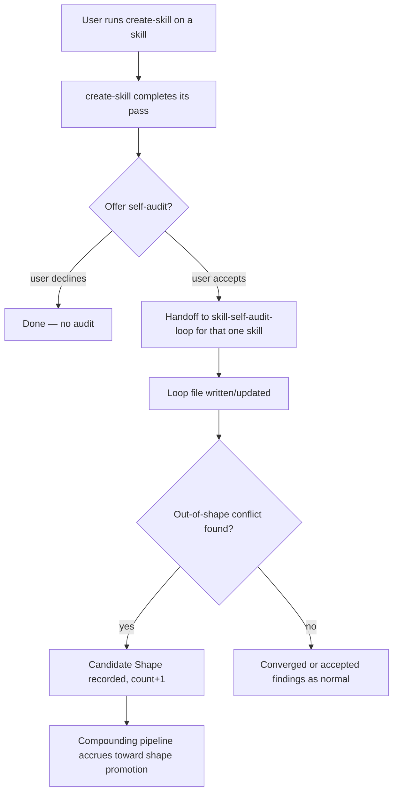

# Skill self-audit loop v3 — fold the audit into create-skill

## Summary

v1 made the audit loop converge clean; v2 proved it catches a real bug; the
out-of-shape mechanism lets it track its own blind spots. The loop works. It is
barely used.

v3 makes audits actually happen — by folding the self-audit into `create-skill`'s
existing review/repair/heal flow, so a skill is audited at the moment it is
edited, without anyone remembering to run it.

## Problem Frame

The intended v3 was "use it across the library" (breadth). Pressure-testing the
trigger surfaced the real constraint: manual breadth will not happen. A usage
practice that depends on remembering to run it runs zero times — the same
trigger-needs-to-be-on-the-existing-path lesson the out-of-shape tracking design
already hit.

So the breadth goal survives, but "manual" is dropped. The only honest path to
skills actually getting audited is a mechanical trigger. Folding into
`create-skill` is the trigger with the least new machinery: `create-skill`
already opens a skill at the exact moment it changes.

## Key Decisions

- **Breadth via checkpoint, not discipline.** The value is audits that actually
  happen and feed the compounding pipeline, not a library-wide manual habit.
- **Trigger = create-skill flow.** At the end of a create/fix/heal/repair/review
  pass, `create-skill` offers the self-audit on the skill it just touched.
- **Offer, not auto-run.** `create-skill` offers the audit at the checkpoint; it
  does not auto-run. Trivial passes should not force a full audit, and an
  unattended auto-audit trains the user to ignore it. Offer-then-yes is one
  keystroke. Flipping offer to auto later is a one-line change if breadth proves
  too thin.
- **Explicit handoff, not auto-invoke.** Composition is a `create-skill` driver
  handing off to `skill-self-audit-loop`, per the skill-composition rules — not
  an automatic skill-invokes-skill call.
- **The change lives in create-skill.** v3 is a `create-skill` integration, not a
  change to `skill-self-audit-loop` source. It routes through create-skill's own
  authoring rules.
- **No new infra.** No git hook, no cron, no sequencer, no scheduled automation.
- **No boundary change.** Still one target per audit invocation; v0's
  "one target / do not audit every skill" boundary stays intact — the audit fires
  per skill, at the checkpoint, not as a sweep.

## What v3 Is Not

- Not a git hook or file-watcher.
- Not a scheduled/cron sweep (the v0 deferred automation).
- Not a multi-skill sequencer or batch driver.
- Not an auto-run on every create-skill pass.
- Not a change to the audit loop's Contradiction Rule, Path Rule, or template.

## Actors

- A1. **User** runs `create-skill` to create, fix, heal, repair, or review a skill.
- A2. **create-skill driver** reaches the end of its pass and offers the audit.
- A3. **skill-self-audit-loop** receives the handoff and produces/updates the loop
  file for that one skill.
- A4. **Compounding pipeline** accumulates out-of-shape candidates across the
  audits that now happen.

## Key Flow

## Requirements

**Trigger**

- R1. At the end of a create/fix/heal/repair/review pass, `create-skill` offers
  to run the self-audit on the skill it just touched.
- R2. The offer is a single explicit prompt; declining is the default-safe path.
- R3. `create-skill` does not auto-run the audit without the offer being accepted.
- R4. The offer fires once per pass, naming the specific skill.

**Handoff**

- R5. Acceptance hands off to `skill-self-audit-loop` via an explicit driver
  handoff, naming the target skill path.
- R6. The handoff passes the one skill `create-skill` just touched as the audit
  target; no multi-skill expansion.
- R7. The audit runs unchanged — same Path Rule, Contradiction Rule, template,
  and out-of-shape mechanism.

**Boundary**

- R8. One target per audit invocation; no sweep, no batch.
- R9. v3 changes `create-skill` flow only; `skill-self-audit-loop` source is
  unchanged.
- R10. No git hook, file-watcher, scheduler, or cron.

## Acceptance Examples

- AE1. **Covers R1, R2.** Given a user finishes a create-skill repair pass, when
  the pass completes, then create-skill offers to audit that skill and declining
  ends the flow cleanly.
- AE2. **Covers R5, R6.** Given the user accepts the offer, when the handoff runs,
  then skill-self-audit-loop produces/updates the loop file for exactly that one
  skill.
- AE3. **Covers R3.** Given a trivial metadata-only create-skill pass, when it
  completes, then no audit runs unless the user accepts the offer.

## Success Criteria

- Skills edited through create-skill get audited far more often than under the
  manual-only status quo.
- The compounding pipeline (out-of-shape -> recurrence -> promotion) receives
  real input from these audits.
- No new always-on automation; the trigger rides an existing human checkpoint.

## Scope Boundaries

- Do not add a hook, watcher, scheduler, or cron.
- Do not build a multi-skill sweep or sequencer.
- Do not auto-run without the offer.
- Do not change the audit loop's source contracts.
- Do not expand past one target per invocation.

## Deferred (future, not v3)

- Hook-on-change trigger (fires on any SKILL.md edit, not just create-skill flows).
- Scheduled sweep across the whole library (needs the v0 automation-boundary
  decision and the unattended-loop safety design).
- Flip offer to auto-run if checkpoint breadth proves too thin.

## Dependencies And Assumptions

- `create-skill` remains the canonical entry for skill create/fix/heal/repair/review.
- The skill-composition rules (explicit driver handoff, callee does one job)
  govern how create-skill hands off to skill-self-audit-loop.
- Most drift-prone skill edits pass through create-skill; skills never touched via
  create-skill still go unaudited (accepted limitation — the deferred hook closes
  this gap if it matters).

## Outstanding Questions

- Does create-skill's flow have a natural single end-point to host the offer, or
  do multiple routes (create vs review vs repair) each need it? (Resolve in
  create-skill during planning.)

## Sources

- `docs/brainstorms/2026-06-10-skill-self-audit-loop-v2-requirements.md`
- `skills/skill-self-audit-loop/SKILL.md`, `references/loop-proof-methods.md`, `CONTEXT.md`
- `skills/create-skill/SKILL.md` — the integration host
- Session dialogue: the breadth/manual/rarely conflict and its resolution to a
  mechanical checkpoint trigger.
