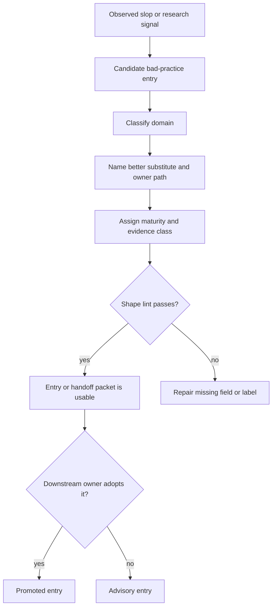

# Bad-practices V1 hardening requirements

## Summary

Harden `bad-practices` into a useful V1 knowledge bank for agent-workflow slop. V1 keeps the skill advisory, adds a review-aware evidence ladder, adds agent-workflow and CLI/runtime coverage, adds a downstream handoff packet, and adds shape-only catalog lint.

---

## Problem Frame

The current skill has the right boundary: it is a thin knowledge bank that routes smells toward owner paths. The gap is operational shape. Without maturity labels, review-aware intake, agent-workflow coverage, packet shape, and light lint, the catalog can drift into loose taste, duplicated owner contracts, or prose rules no downstream workflow can consume.

The first V1 failure pattern is agent-workflow slop: skipped context, prompt-only quality gates, broad edits, silent fallbacks, unowned contracts, and fake determinism. Architecture and testing remain concrete domains, but V1 treats agent workflow as the umbrella failure that often causes the other two.

---

## Key Decisions

- **Agent-workflow first.** V1 optimizes for preventing sloppy agent behavior, then uses architecture, testing, and CLI/runtime as concrete subdomains.
- **Review-aware, not automatic.** `skill-feedback review` output can be cited as untrusted evidence, but `bad-practices` does not call it or promote entries by itself.
- **Shape lint only.** V1 lint checks catalog structure and owner/evidence fields, not whether a smell is true or severe.
- **Owner paths stay authoritative.** The skill links positive substitutes to owners and avoids copying contracts, flags, schemas, state machines, or output semantics.
- **Packets feed downstream work.** A bad-practice packet is handoff evidence for planning, scaffold, or review work; it is not an edit authorization.
- **Examples teach the format.** Gold entries and good/bad examples keep future additions predictable without turning the skill into a large policy document.

---

## Actors

- A1. **Driver agent** uses `bad-practices` to classify a smell or prepare a downstream packet.
- A2. **Maintainer** adds or revises catalog entries.
- A3. **Review evidence source** supplies optional `skill-feedback review`, code review, or doc review findings.
- A4. **Downstream workflow** consumes packets in `ce-plan`, `seam-scaffold`, future review skills, or owner docs.
- A5. **Catalog lint** checks entry shape and reports repair hints.

---

## Key Flow

---

## Requirements

**Skill Boundary**

- R1. V1 keeps `bad-practices` as an advisory knowledge bank and translation layer.
- R2. V1 prioritizes agent-workflow slop while retaining architecture, testing, and CLI/runtime domains.
- R3. V1 does not run broad review, call `skill-feedback`, call scaffold skills, or edit downstream owners.
- R4. Entries name owner paths for positive substitutes instead of copying exact owner contracts.

**Evidence Ladder**

- R5. Every catalog entry has one maturity label: `candidate`, `observed`, or `promoted`.
- R6. New entries default to `candidate` unless they cite a concrete observed failure, review finding, adversarial probe, or research source.
- R7. `skill-feedback review` output may support an entry only as untrusted evidence.
- R8. `promoted` means a downstream owner, check, generated doc, CLI help surface, or review workflow has adopted the substitute or guardrail.
- R9. A report, transcript, or narrative note cannot promote an entry by itself.

**Agent-Workflow Domain**

- R10. V1 includes an agent-workflow domain for skipped context, instruction bloat, unowned contracts, prompt-only quality gates, broad refactors, silent fallbacks, fake determinism, and over-patterned architecture.
- R11. Agent-workflow entries name the agent's better substitute as an action, such as read an owner path, ask one question, stop blocked, run a check, or produce a packet.
- R12. Agent-workflow entries distinguish the agent behavior from downstream architecture, testing, or CLI symptoms.

**CLI/Runtime Domain**

- R13. V1 includes a CLI/runtime domain for command-surface smells that cause poor agent behavior.
- R14. CLI/runtime entries route exact flag, schema, envelope, and exit-code details to `create-cli`, command contracts, generated help, or tests.
- R15. CLI/runtime entries prefer mechanical repair hints over prose policy.

**Handoff Packet**

- R16. V1 defines a compact packet with smell, trigger, local evidence, external or review evidence, better substitute, owner path, downstream candidate, promotion threshold, and next safe action.
- R17. The packet can feed planning, scaffold, review, or owner-doc work without authorizing source edits.
- R18. The skill stops blocked when the owner path or better substitute is unknown.

**Catalog Lint**

- R19. V1 adds shape-only lint for required fields, known domains, maturity labels, evidence classes, downstream candidates, duplicate headings, and owner-path labels.
- R20. Lint does not judge truth, severity, taste, or whether a smell deserves promotion.
- R21. Lint output names the file, entry, missing or invalid field, and a repair hint.
- R22. Existing YAML and owner-path checks remain the verification path for `SKILL.md` and owner-map edits.

**Examples**

- R23. V1 adds one gold entry that demonstrates the intended catalog shape.
- R24. V1 adds short correct and incorrect examples for agent-workflow entries.
- R25. Examples stay shorter than the workflow they teach and do not copy owner contracts.

---

## Acceptance Examples

- AE1. **Covers R5-R9.** Given a `skill-feedback review` item shows repeated missing-context friction, when a maintainer adds a bad-practice entry from it, then the entry records review evidence as untrusted support and stays `candidate` or `observed` until an owner adopts it.
- AE2. **Covers R10-R12.** Given an agent skipped relevant owner docs and then proposed a broad refactor, when the entry is added, then the domain is agent workflow and the better substitute names the next safe action.
- AE3. **Covers R13-R15.** Given a command test asserts only an exit code, when the smell is cataloged, then exact envelope semantics route to the CLI or command-contract owner rather than being copied into the catalog.
- AE4. **Covers R16-R18.** Given a user asks for a future scaffold improvement, when the skill returns a packet, then the packet names owner path, evidence, downstream candidate, and next safe action without editing source.
- AE5. **Covers R19-R21.** Given a catalog entry omits maturity, when lint runs, then it reports the entry and field with a repair hint and does not judge the entry's truth.
- AE6. **Covers R23-R25.** Given a future agent adds a new entry, when it reads the gold entry and examples, then it can copy the shape without copying any downstream contract.

---

## Success Criteria

- A future agent can add an agent-workflow bad-practice entry without inventing the entry shape.
- A maintainer can tell whether an entry is candidate, observed, or promoted.
- A downstream planning or review workflow can consume a packet without rereading the whole catalog.
- Lint catches malformed catalog entries without becoming a semantic reviewer.
- `bad-practices` remains a thin advisor and does not duplicate owner contracts.

---

## Scope Boundaries

**In V1**

- Evidence ladder and maturity labels.
- Agent-workflow domain.
- CLI/runtime domain.
- Downstream packet shape.
- Shape-only catalog lint.
- Gold entry and small example pairs.

**Deferred for later**

- Automatic promotion from `skill-feedback` reports.
- Full review-skill behavior.
- Scaffold-skill integration.
- Semantic bad-practice scoring.
- Cross-repo bad-practice aggregation.

**Outside V1**

- Moving rules into startup instructions.
- Copying owner contracts into `bad-practices`.
- Replacing `improve-codebase-architecture`, `seam-scaffold`, `gof-pressure-lens`, `create-cli`, `test-runner`, or `skill-feedback`.

---

## Dependencies And Assumptions

- `skill-feedback review` remains the owner of report classification and treats report text as untrusted evidence.
- Owner paths remain the source of exact positive substitutes.
- Shape lint can be implemented without deciding semantic truth.
- Future planning can choose exact file placement and command shape while preserving this scope.

---

## Outstanding Questions

### Deferred To Planning

- Where should the shape-only lint command live?
- Which exact maturity field spelling should the catalog use?
- Which initial agent-workflow entries should ship in V1?
- Should CLI/runtime live in its own reference or as a subsection until the domain grows?

---

## Sources And Research

- `AGENTS.md`
- `skills/bad-practices/SKILL.md`
- `skills/bad-practices/references/catalog.md`
- `docs/ideation/2026-06-15-bad-practices-skill-ideation.html`
- `skills/skill-feedback/SKILL.md`
- `skills/skill-feedback/docs/brainstorms/2026-06-12-skill-feedback-review-pattern-ledger-v2-requirements.md`
- [AI-Generated Smells](https://arxiv.org/html/2605.02741v1)
- [Building shared coding guidelines for AI and people too](https://stackoverflow.blog/2026/03/26/coding-guidelines-for-ai-agents-and-people-too/)
