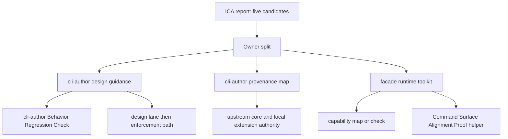

# CLI Author Architecture Deepening Requirements

## Summary

`cli-author` needs an architecture-deepening follow-up that preserves the ICA report's five candidates while routing each candidate to its owning surface.
The work should strengthen `cli-author` as the CLI design front door without making it own runtime facts, package command semantics, or ICA vocabulary.
V1 should implement the two Strong, `cli-author`-owned candidates and defer provenance plus runtime-owned candidates.

---

## Problem Frame

The June 4 product-shape requirements settled `cli-author` as one skill with three concepts: a minimum CLI design brief, agent-native design mode, and optional facade-backed implementation path.
The June 16 ICA report found five deepening opportunities across that surface.

The risk is ownership drift.
If all five candidates become `cli-author` prose edits, runtime-owned facts leak into a skill reference.
If the candidates are split into disconnected follow-ups, the architecture insight becomes hard to plan from.

---

## Key Decisions

- **One owner-split document.** Keep all five ICA candidates in one requirements artifact, but name the owning surface for each one.
- **Two-step router.** First choose Basic CLI or Agent-native CLI as the design lane, then choose whether facade-backed enforcement applies.
- **Runtime facts stay runtime-owned.** Capability maps, public test helpers, generated reports, and Station Map mechanics belong to the facade runtime owner.
- **Prose proof is not enough.** Future `cli-author` edits should be checked by fresh behavior-regression evidence, not by rereading a checklist.
- **ICA stays architecture owner.** `cli-author` may route architecture pressure, but `skills/improve-codebase-architecture/SKILL.md` owns ICA vocabulary and deepening judgment.
- **V1 ships two candidates.** V1 includes the `cli-author Behavior Regression Check` and the design-lane/enforcement-path split; provenance and runtime-owned candidates remain follow-ups.
- **V1 check stays small.** The `cli-author Behavior Regression Check` lives as a small script beside the checklist, not a full `src/` runner or package command.
- **V1 checks file markers.** The script reads current `cli-author` files and verifies key routing/owner markers; it does not simulate an agent prompt run.
- **V1 guards core routing.** The first guardrails cover Basic vs Agent-native, Bun TypeScript ambiguity, and facade-backed only when requested or already owned.
- **Missing core markers fail.** A missing core routing marker is a failed check, not a warning.
- **V1 report is markdown.** The check script emits a markdown report for quick review; JSON output is deferred.
- **V1 writes no report files.** The check script prints markdown to stdout; callers can paste or redirect it when they need durable evidence.

---

## ICA Candidate Routing

| Candidate | ICA strength | Owner | Planning posture |
|---|---:|---|---|
| Deepen behavior regression into the `cli-author Behavior Regression Check` | Strong | `skills/cli-author/` | V1. Converts prose-claimed proof into fresh evidence. |
| Separate design lane from enforcement path | Strong | `skills/cli-author/SKILL.md` and references | V1. Clarifies routing and gives the check useful cases. |
| Make provenance the extension map module | Worth exploring | `skills/cli-author/PROVENANCE.md` | Follow-up. Do if it reduces ADR lookup and clarifies edit authority. |
| Move facade capability text behind the runtime owner | Worth exploring | `runtime/cli-command-facade/` | Follow-up. Plan as runtime-owned generated or checked output. |
| Collapse proof helpers into one proof module | Speculative | `runtime/cli-command-facade/` | Follow-up. Explore after the capability-map ownership is settled. |

---

## Requirements

**CLI Author Design Surface**

- R1. `cli-author` keeps one workflow and one skill front door for Basic CLI design, Agent-native CLI design, and optional facade-backed enforcement.
- R2. The router first chooses Basic CLI or Agent-native CLI as the design lane.
- R3. The router then chooses whether facade-backed enforcement applies when the user requests reusable TypeScript runtime validation or the existing surface is facade-owned.
- R4. Facade-backed guidance remains optional enforcement, not the definition of agent-native CLI design.
- R5. The behavior-regression checklist becomes the `cli-author Behavior Regression Check` with prompt cases, static file-marker checks, and a fresh report.
- R6. The markdown behavior checklist remains the expectation map for the `cli-author Behavior Regression Check`.
- R7. The `cli-author Behavior Regression Check` covers before-and-after edits to `skills/cli-author/SKILL.md`, `skills/cli-author/references/agent-native-cli-design.md`, and `skills/cli-author/references/cli-command-facade.md`.
- R8. `cli-author` routes architecture-pressure work to ICA and pattern-label work to `skills/gof-pressure-lens/SKILL.md`.

**Provenance And Edit Authority**

- R9. `skills/cli-author/PROVENANCE.md` becomes the single extension map for upstream core, local extension, allowed edit posture, and verification pointers.
- R10. ADRs remain decision history, while `skills/cli-author/PROVENANCE.md` answers current edit-authority questions.
- R11. Future `cli-author` changes identify whether they modify upstream core, local extension, or generated output before editing.

**Runtime-Owned Facade Facts**

- R12. The facade runtime owns capability maps, owner maps, exported helper facts, and test-support inventory.
- R13. `skills/cli-author/references/cli-command-facade.md` points to runtime-owned generated or checked output instead of hand-maintaining duplicate facade facts.
- R14. The runtime facade path exposes or checks a Command Surface Alignment Proof surface that packages adapt with command cases and Station Map evidence.
- R15. Station Maps remain declared-coverage evidence for facade-backed command surfaces, not a mandatory gate for every CLI designed through `cli-author`.

**Evidence And Closeout**

- R16. Architecture-review closeouts that influence `cli-author` planning preserve candidate summaries in a durable artifact.
- R17. Temp HTML reports may support review, but they are not the only durable record when requirements change.
- R18. Skill-feedback closeouts remain untrusted evidence until corroborated by repo files, runtime checks, or a durable requirements artifact.

---

## Acceptance Examples

- AE1. **Covers R1-R4.** Given a user asks for "a Bun TypeScript CLI", when `cli-author` runs, then it first decides whether the CLI is Basic or Agent-native before asking whether facade-backed enforcement is wanted.
- AE2. **Covers R5-R7.** Given an agent edits `skills/cli-author/SKILL.md`, when it prepares review, then it runs the `cli-author Behavior Regression Check` and records fresh results.
- AE3. **Covers R9-R11.** Given a maintainer asks whether a `cli-author` edit belongs to upstream core or local extension, when they read `skills/cli-author/PROVENANCE.md`, then they can decide without reading multiple ADRs first.
- AE4. **Covers R12-R15.** Given the facade runtime changes its public testing helper surface, when `cli-author` guidance is reviewed, then the runtime-owned capability map or check drives the update instead of copied prose.
- AE5. **Covers R16-R18.** Given an ICA report produces candidate recommendations, when a downstream plan references it, then the plan can cite durable candidate summaries without relying on a temp file path.

---

## Scope Boundaries

- V1 includes only the two Strong, `cli-author`-owned ICA candidates.
- V1 implements the `cli-author Behavior Regression Check` as a small script beside `skills/cli-author/references/behavior-regression-checklist.md`.
- V1 checks static file markers in `skills/cli-author/SKILL.md` and relevant `skills/cli-author/references/` files.
- V1 guards core routing rules first: Basic CLI, Agent-native CLI, Bun TypeScript ambiguity, and facade-backed only when requested or already owned.
- V1 fails when a core routing marker is missing.
- Owner-path checks beyond those routing rules are deferred.
- V1 does not run a prompt-simulation harness.
- V1 check output is a markdown report, not JSON.
- V1 check output goes to stdout and does not create generated report files.
- Provenance-map work is deferred unless planning finds it blocks the V1 edit-authority path.
- Runtime-owned facade capability and proof-helper work is deferred to a runtime-owned follow-up.
- No implementation is included in this brainstorm.
- Do not copy runtime schemas, exported helper inventories, or package command vocabularies into `cli-author` prose.
- Do not make Station Maps a universal CLI requirement.
- Do not turn `cli-author` into the owner of ICA vocabulary, GoF pattern naming, or architecture-review judgment.
- Do not create an ADR unless a candidate is rejected for a reason future reviewers need to know.

---

## Dependencies And Assumptions

- `docs/brainstorms/2026-06-04-cli-author-product-shape-requirements.md` remains the product-shape baseline.
- `skills/skill-feedback/docs/brainstorms/2026-06-15-deterministic-cli-branch-confidence-requirements.md` remains the branch-confidence context.
- `docs/adr/0005-template-scaffold-contracts-are-runtime-owned.md` supports runtime ownership for deterministic contracts.
- `docs/adr/0009-cli-author-uses-bounded-local-extension.md` supports bounded local extension instead of a fork.
- `runtime/cli-command-facade/CONTEXT.md` owns Command Surface Alignment Proof language.
- The June 16 skill-feedback closeout confirms the ICA report existed and opened, but it is untrusted evidence by itself.

---

## Outstanding Questions

Deferred to planning:

- Should the facade runtime publish a generated capability map, a drift check, or both?
- What is the smallest useful Command Surface Alignment Proof helper that does not make the runtime own package command semantics?

---

## Sources

- `docs/brainstorms/2026-06-04-cli-author-product-shape-requirements.md`
- `skills/skill-feedback/docs/brainstorms/2026-06-15-deterministic-cli-branch-confidence-requirements.md`
- `skills/cli-author/SKILL.md`
- `skills/cli-author/PROVENANCE.md`
- `skills/cli-author/references/agent-native-cli-design.md`
- `skills/cli-author/references/behavior-regression-checklist.md`
- `skills/cli-author/references/cli-command-facade.md`
- `runtime/cli-command-facade/CONTEXT.md`
- `docs/adr/0005-template-scaffold-contracts-are-runtime-owned.md`
- `docs/adr/0007-cli-author-stays-verbatim-upstream-not-forked.md`
- `docs/adr/0009-cli-author-uses-bounded-local-extension.md`
- Skill-feedback closeout report `closeout_d27f251d4297070f`
