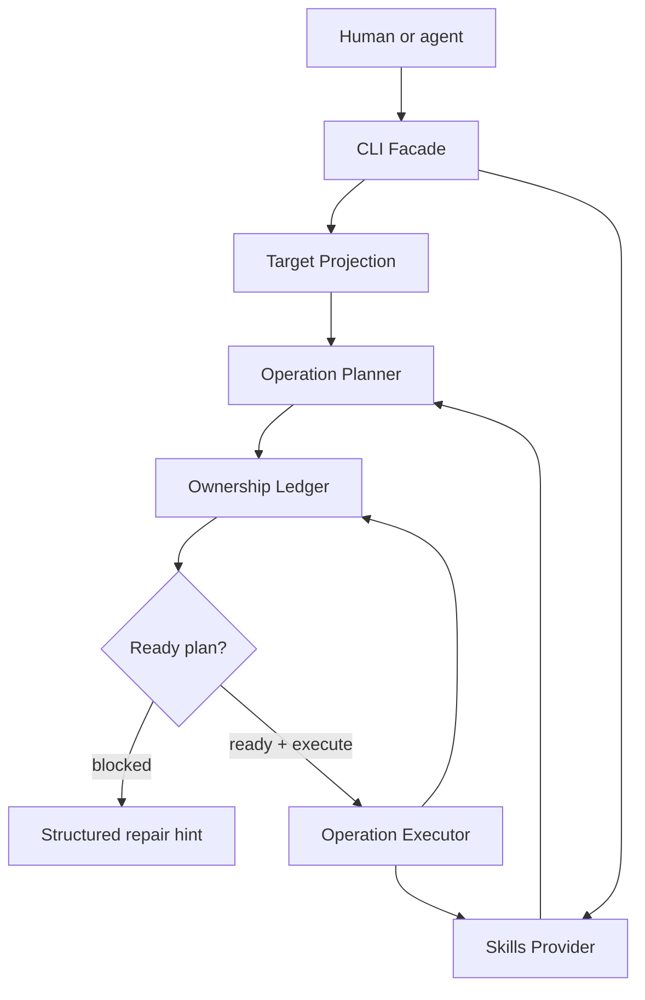

# Skillport MVP Requirements

## Summary

Skillport is an agent-native CLI for safely listing, planning, adding, and removing skills through the existing `skills` provider while preserving unrelated local skills. The MVP wraps `@side-quest/skill-port` around the provider's broad agent target support, adds ownership-aware planning, and exposes facade-backed output that agents can parse and repair from.

---

## Problem Frame

The existing `skills` package already solves source discovery, install mechanics, lock files, and multi-agent target support. Rebuilding that would waste effort. The gap is agent safety: raw provider operations can prompt, mutate broadly, overwrite same-name skills from another source, or remove skills without enough ownership context for an autonomous agent to know whether the action is safe.

Skillport exists to be the safe shell around those provider mechanics. It should make the provider useful to agents without copying every provider target rule or forcing users to rely on prose in `AGENTS.md` as the only safety layer.

---

## Key Decisions

- **Wrap first, replace later.** Skillport V1 uses the `skills` package as its provider, but every provider interaction crosses a Skills Provider seam so the backend can change without rewriting command behavior.
- **Plan before mutation.** Every add, remove, or sync-like write must produce an inspectable plan before execution.
- **Ownership is a first-class module.** Skillport must track which source, target, and skill entries it owns; directory existence alone is not ownership.
- **Expose provider target vocabulary.** Skillport should support the provider's documented agent ids, including `codex`, `claude-code`, and `universal`, without forking every target path rule into Skillport.
- **Facade-backed from the start.** The CLI front door must use the Side Quest CLI command facade style for discovery, help, JSON envelopes, structured errors, repair hints, diagnostics, and command-surface proof.

---

## Actors

- A1. **Human operator** runs Skillport directly to inspect, install, or remove skills.
- A2. **Agent driver** reads `AGENTS.md`, discovers Skillport, and calls it non-interactively.
- A3. **Skills provider** supplies source discovery, supported agent ids, and install/remove mechanics.
- A4. **Target agent harness** receives projected skills, such as Codex, Claude Code, Cursor, Gemini CLI, or Universal.
- A5. **Future Skillport skill** explains workflows and gotchas once Skillport can install its own managing skill.

---

## Requirements

**Provider and source discovery**

- R1. Skillport must list skills available from a source through the provider without mutating local state.
- R2. Skillport must expose provider-supported target ids instead of maintaining a parallel hard-coded target catalog.
- R3. Skillport must support the provider's `--agent` semantics, including repeated target ids and all-target intent, while adding Skillport safety gates before mutation.
- R4. Skillport must keep provider-specific behavior behind a Skills Provider interface so another provider can replace the `skills` package later.

**Planning and execution**

- R5. Skillport must generate an add/remove plan before any mutation.
- R6. A plan must distinguish add, remove, noop, and blocked operations.
- R7. A blocked plan must never execute.
- R8. Execution must require an explicit execute step rather than treating plan generation as permission to mutate.
- R9. Execution must update both installed state and Skillport ownership facts when the provider reports success.

**Ownership safety**

- R10. Skillport must refuse to add a skill when the same target already has that skill name from another source unless a later explicit takeover flow is designed.
- R11. Skillport must refuse to remove any skill without a matching Skillport ownership record.
- R12. Skillport must preserve human-managed, provider-managed, or unrelated local skills by default.
- R13. Skillport must make source, target, skill name, provider identity, and management ownership visible in status output.

**Target projection**

- R14. Skillport must support `codex` and `claude-code` as hardened MVP targets.
- R15. Skillport must allow other provider-supported target ids through the same Target Projection module.
- R16. Skillport must make all-target operations preview-first and visibly higher risk than explicit target lists.
- R17. Skillport must avoid copying provider-owned target path rules unless a Skillport policy differs from the provider.

**Agent-native CLI**

- R18. Skillport must provide machine-readable output for discovery, status, plan, apply, source list, target list, and doctor flows.
- R19. Skillport must send primary data to stdout and diagnostics to stderr.
- R20. Skillport must provide structured failures with recoverability, same-input retry safety, repair hints, and a continuation where available.
- R21. Skillport must expose enough discovery metadata for an agent to choose commands without scraping human help.
- R22. Skillport must support non-interactive execution with no prompts when explicit flags provide all required input.

**Bootstrap and skill wrapper**

- R23. `AGENTS.md` should tell agents to use Skillport for skill list/install/remove/sync work when the Skillport skill is unavailable.
- R24. When a Skillport skill is installed, `AGENTS.md` should prefer the skill for workflow guidance while the skill calls the CLI for mutation.
- R25. V1 must not depend on the Skillport skill being installed, because the CLI is the bootstrap path.
- R26. V2 may add a Skillport skill that documents provider gotchas, target behavior, safety policy, and examples.

---

## Key Flows

- F1. **List source skills**
  - **Trigger:** A human or agent wants to inspect a source before install.
  - **Actors:** A1 or A2, A3
  - **Steps:** Skillport asks the provider for source skills, normalizes the result, emits parseable output, and records no mutation.
  - **Outcome:** The caller sees available skills and can choose an add plan.
  - **Covered by:** R1, R18, R19

- F2. **Plan safe add**
  - **Trigger:** A caller requests one or more skills for one or more targets.
  - **Actors:** A1 or A2, A3, A4
  - **Steps:** Skillport validates target ids, checks source skill availability, checks existing installed skills, and returns add/noop/blocked operations.
  - **Outcome:** No local state changes until a ready plan is executed.
  - **Covered by:** R2, R3, R5, R6, R10, R15

- F3. **Execute ready plan**
  - **Trigger:** A caller explicitly executes a ready plan.
  - **Actors:** A1 or A2, A3, A4
  - **Steps:** Skillport invokes the provider adapter, updates ownership facts for successful operations, and emits a structured result.
  - **Outcome:** Installed state and ownership facts remain aligned.
  - **Covered by:** R7, R8, R9, R20

- F4. **Block unrelated removal**
  - **Trigger:** A caller requests removal for a skill that exists but is not owned by Skillport.
  - **Actors:** A1 or A2
  - **Steps:** Ownership Ledger finds no matching Skillport ownership record and returns a blocked plan with a repair hint.
  - **Outcome:** The unrelated skill remains untouched.
  - **Covered by:** R11, R12, R13, R20

- F5. **Bootstrap without skill**
  - **Trigger:** An agent needs to manage skills before the Skillport skill exists.
  - **Actors:** A2, A5
  - **Steps:** `AGENTS.md` routes the agent to the Skillport CLI; once the Skillport skill exists, the agent can read it for workflow guidance.
  - **Outcome:** Bootstrap works without circular dependency.
  - **Covered by:** R23, R24, R25, R26

---

## Acceptance Examples

- AE1. **Safe add across MVP targets**
  - **Covers R5, R8, R9, R14.**
  - **Given:** `cli-author` exists in the selected source and is absent from `codex` and `claude-code`.
  - **When:** A caller plans and then executes an add for both targets.
  - **Then:** Skillport adds the skill through the provider and records Skillport ownership for both target installs.

- AE2. **Foreign same-name skill blocks**
  - **Covers R10, R12, R20.**
  - **Given:** `cursor` already has `storybook` from `other/source`.
  - **When:** A caller plans adding `storybook` from `nathanvale/claude-code-config` to `cursor`.
  - **Then:** Skillport returns a blocked plan and does not call the provider mutation path.

- AE3. **Human-owned skill removal blocks**
  - **Covers R11, R12, R13.**
  - **Given:** `codex` contains `local-only` managed by a human and no matching Skillport ownership record exists.
  - **When:** A caller plans removal for `local-only`.
  - **Then:** Skillport blocks removal and explains that the skill is not owned by Skillport.

- AE4. **Managed skill removal succeeds**
  - **Covers R9, R11.**
  - **Given:** `codex` contains `storybook` and Skillport owns the matching source/target/skill record.
  - **When:** A caller plans and executes removal.
  - **Then:** Skillport removes the skill through the provider and removes the ownership record.

- AE5. **Invalid target repairs**
  - **Covers R2, R15, R20.**
  - **Given:** A caller requests a target id not reported by the provider.
  - **When:** Skillport validates targets.
  - **Then:** Skillport returns a structured error with supported target ids and a repair hint.

---

## Success Criteria

- Agents can list source skills, plan changes, apply safe changes, and diagnose failures without reading human prose output.
- A same-name skill from another source is never overwritten by default.
- A human-managed or unrelated skill is never removed by default.
- The first provider can be swapped behind the Skills Provider seam without rewriting the planner, ownership policy, or CLI facade.
- Command surface proof covers discovery metadata, rendered help, parser acceptance/rejection, and runtime semantics.

---

## Scope Boundaries

### Deferred for later

- Skillport skill wrapper that teaches agents the workflow in detail.
- Decks, curated packs, subagents, MCPs, and broader agent capability bundles.
- Takeover or migration flow for adopting skills not currently owned by Skillport.
- Undo, rollback, or historical event replay.
- A second real provider beyond the `skills` package.

### Outside MVP identity

- Reimplementing the full skills ecosystem.
- Forking every provider-owned target path rule.
- Treating `AGENTS.md` prose as the enforcement layer for safe mutation.
- Raw destructive `skills update`, experimental install, or all-skill removal as a default agent path.

---

## Dependencies / Assumptions

- The `skills` package remains the first provider and supports source listing, add, remove, list, lock behavior, and agent target selection.
- Provider-supported agent ids include `codex`, `claude-code`, and a broad set of other harness ids.
- `@side-quest/cli-command-facade` is available for the CLI front door or can be published/consumed by Skillport.
- The published package is `@side-quest/skill-porter` (placeholder `0.0.0`). The prior `@side-quest/skill-port@0.0.0` is retired.
- The CLI binary is `skillporter` (single name, no alias).

---

## Sources / Research

- Context7 documentation for `vercel-labs/skills`, including supported agent ids and `--agent` behavior.
- Context7 documentation for `vercel-labs/skills` add/remove/list command flows and non-interactive flags.
- Temporary Skillport seam report and logic prototype verdict.
- CLI Author references: `skills/cli-author/references/agent-native-cli-design.md` and `skills/cli-author/references/cli-command-facade.md`.
