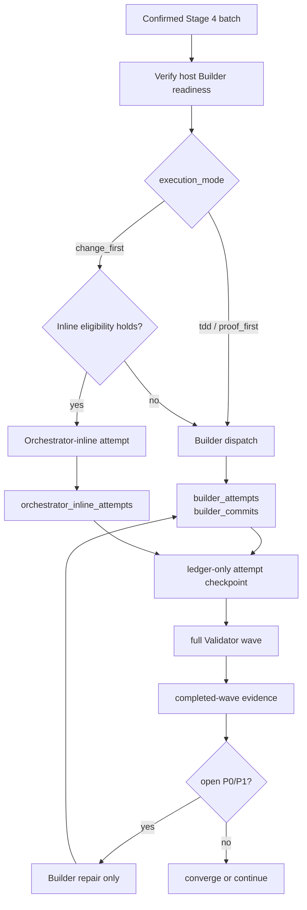
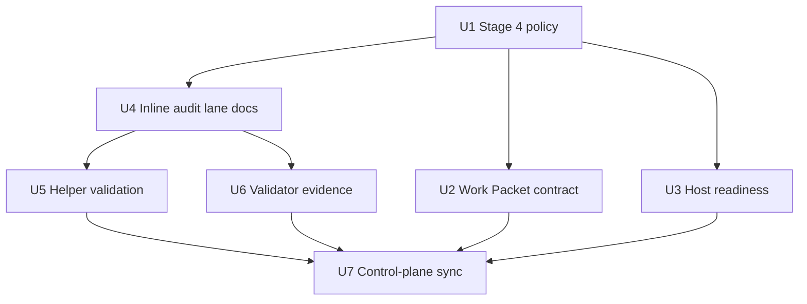

# feat: Align Builder Dispatch with Inline Attempt Auditing

## Summary

Update the Issue-to-PR control plane so Stage 4 has an explicit, host-neutral
implementation policy: `tdd` and `proof_first` use isolated Builder dispatch,
`change_first` may stay Orchestrator-inline only while it is small and obvious,
and every committed implementation attempt produces honest audit evidence plus
the full Validator wave.

This is an in-place deepening of the original Builder Work Packet plan. The
scope now reflects the updated requirements and the current v2 runbook/helper
split rather than the older #21 prose-only slice.

---

## Problem Frame

The original plan solved the first context-isolation problem by making Builder
a fresh sub-agent. The updated requirements add the missing asymmetric path:
some low-risk `change_first` batches can remain inline, but only if the ledger
records them as Orchestrator-inline work instead of pretending a Builder
attempt happened.

The repo has also moved forward since the original plan. `builder_attempts`,
`supersedes`, Stage 3 findings, and v2 packet rendering already exist, while
the active control plane now lives in `skills/issue-to-pr/SKILL.md` and
`runbooks/issue-to-pr-v2/`.

---

## Requirements

- R1. Stage 4 dispatch policy is explicit: `tdd` and `proof_first` require
  Builder dispatch; `change_first` is inline-eligible only while small,
  obvious, low-risk, non-behavioural, and not context-heavy.
- R2. Host Builder readiness is checked before any Stage 4 implementation
  attempt, including inline-eligible `change_first`, because any committed
  attempt may later need Builder-only repair.
- R3. Builder Work Packet and Preflight remain batch-only, host-neutral, and
  aligned with the confirmed ledger contract.
- R4. Orchestrator-inline `change_first` attempts are recorded in a separate
  compact `orchestrator_inline_attempts` lane; `builder_attempts` and
  `builder_commits` remain Builder-only.
- R5. Every committed implementation attempt, Builder-dispatched or inline,
  routes to the full Stage 4 Validator wave with evidence that names the real
  evidence source.
- R6. Every committed implementation attempt has a ledger-only attempt
  checkpoint before Validator packet rendering and durable completed-wave
  evidence, including clean `findings: []` waves.
- R7. Helper/schema validation covers inline attempts, total implementation
  attempt counting, touched-file parity, batch-file authorization, and the
  durable Validator-wave evidence relationship.
- R8. ADRs, v1 source anchors, v2 references/templates, and the active skill
  router stay aligned without introducing Claude-specific or Codex-specific
  primitive names.

**Origin actors:** A1 Orchestrator, A2 Contract Reviewer, A3 Builder sub-agent,
A4 Validator personas, A5 User
**Origin flows:** F0 Stage 3 Contract Review, F0.5 Stage 4 implementation path
selection, F1 Builder implementation attempt, F1b Orchestrator-inline
`change_first` attempt, F2 Builder repair attempt, F3 Builder Preflight
Checklist, F4 Builder Work Packet shape, F5 Builder return envelope, F6 compact
implementation audit lanes, F7 replacement batches and `supersedes`, F8
final-review patch proposals
**Origin acceptance examples:** AE1 through AE16, with particular emphasis on
Stage 3 review, host readiness, Builder and inline evidence separation,
Builder-only repairs, full Validator waves, and attempt-checkpoint evidence.

---

## Scope Boundaries

### Deferred for later

- Separate Surgeon actor/schema. V1 keeps Builder as the actor and uses
  `attempt_type: repair` for Surgeon-like discipline.
- Full contracts for Context Scout, Architect, Test Scout, Fixture Builder, or
  other support roles. V1 only uses these as `route_hint` values.
- Generic Builder-agent artifact outside Issue-to-PR.
- Builder session persistence across iterations. V1 is fresh-per-attempt.
- Mid-batch telemetry such as file-read counts, edit attempts, duration, or
  command counts beyond compact attempt evidence.
- Dedicated helper command for preflight probes. V1 may specify probes in
  runbook prose unless repeated friction proves a helper is needed.

### Outside this product's identity

- Generic agent-spawning framework.
- Codex-specific or Claude-specific tool wiring instructions.
- Generic planning-review framework.
- A durable "Ralph Gate" term.
- A reusable staff-engineer Builder-agent guide before Issue-to-PR proves the
  contract in real runs.

### Deferred to Follow-Up Work

- Migrating historical ledgers is out of scope. The v2 runbook-version skew
  path should protect existing ledgers instead of silently reinterpreting them.
- A standalone raw Builder envelope validator remains future work unless real
  runs show receipt-time validation needs its own helper boundary.
- Rich telemetry beyond the compact inline/Builder lanes and structured Notes
  evidence remains out of scope.

---

## Context & Research

### Relevant Code and Patterns

- `skills/issue-to-pr/SKILL.md` is the public active control plane. It routes
  Stage 4 through v2 references and names the visible Stage 4 subroutes.
- `runbooks/issue-to-pr-v2/issue-to-pr.md` is the hot router; references under
  `runbooks/issue-to-pr-v2/references/` own detailed stage contracts.
- `runbooks/issue-to-pr-v2/lib/contract.ts` owns runtime string sets and
  `RUNBOOK_VERSION`. Because this plan changes ledger interpretation and role
  packet semantics, the implementation should treat the runtime version as a
  deliberate contract surface.
- `runbooks/issue-to-pr-v2/lib/ledger.ts` follows a strict constrained-YAML
  parser pattern with closed key sets, small validators, process-boundary
  errors, and git validation through argument-array subprocess calls.
- `runbooks/issue-to-pr-v2/lib/packets.ts` renders Builder, Validator,
  Proposer, patch-proposal, and ce-plan packets with `dispatch_evidence`.
  Current Validator packet data is Builder-evidence-shaped, so inline attempts
  need a real evidence-source distinction.
- `runbooks/issue-to-pr/` remains the v1 baseline and source anchor for many
  v2 regression-matrix rows. Keep v1 prose aligned when changing canonical
  behaviour that v2 still cites.
- Existing tests to extend include `runbooks/issue-to-pr/decompose.test.ts`,
  `runbooks/issue-to-pr-v2/decompose.test.ts`,
  `runbooks/issue-to-pr-v2/lib/contract.test.ts`,
  `runbooks/issue-to-pr-v2/lib/ledger.test.ts`,
  `runbooks/issue-to-pr-v2/lib/packets.test.ts`,
  `runbooks/issue-to-pr-v2/cli.test.ts`, and
  `runbooks/issue-to-pr-v2/contract-drift.test.ts`.

### Institutional Learnings

- `docs/adr/0001-stage-4-context-isolation.md` currently says the
  Orchestrator does not implement Stage 4 batches directly. This plan updates
  that to the narrower accepted policy: only bounded `change_first` can be
  inline, and only with honest audit evidence.
- `docs/adr/0002-runbooks-and-skills-use-prose-as-orchestrator.md` keeps the
  split clear: prose decides workflow legality; CLI/helper code renders facts
  and validates deterministic contracts. Do not make `cli.ts` dispatch agents
  or mutate ledgers.
- `docs/adr/0003-stage-4-keeps-always-on-validator-wave.md` protects the
  always-on Validator floor. This plan extends the floor from "committed
  Builder envelope" to "committed implementation attempt."
- `docs/plans/2026-05-22-001-feat-builder-attempt-persistence-plan.md`
  already completed compact `builder_attempts`, commit parity, and iteration
  validation for Builder attempts. This plan builds on that rather than
  re-planning it.
- `docs/runbooks/issue-to-pr/issue-91-ledger.md` records a real contract miss:
  Orchestrator-inline work was recorded as if Builder evidence existed. The
  separate inline audit lane is the direct mitigation.
- `docs/solutions/` does not exist in this repo, so there are no solution docs
  to carry forward.

### External References

- Not used. The work is driven by repo-local runbook contracts, ADRs, helper
  patterns, and the updated requirements document.

---

## Key Technical Decisions

- Deepen this existing plan rather than create a new artifact: the original
  Work Packet plan is still the right anchor, but the current accepted v1 scope
  is broader than the old #21 prose-only slice.
- Treat `runbooks/issue-to-pr-v2/` as the active implementation surface while
  keeping `runbooks/issue-to-pr/` aligned where v2 still cites v1 as source
  anchor.
- Keep `builder_attempts` exclusive to real Builder envelopes. Inline work
  gets `orchestrator_inline_attempts`, and `builder_commits` remains
  Builder-only.
- Count implementation attempts as the sum of well-formed Builder attempts and
  committed Orchestrator-inline attempts. Infrastructure failures remain
  outside the cap.
- Require host Builder readiness before inline work as well as dispatch work.
  The invariant is not "this attempt needs Builder now"; it is "this Stage 4
  run can dispatch Builder if the committed attempt later needs P0/P1 repair."
- Keep `change_first` inline eligibility narrow and deterministic: at most two
  touched files, no behavioural/public-contract/governance/high-risk paths, no
  broad discovery, no substantial Orchestrator context load, and no third
  consecutive inline attempt without explicit user exception.
- Use structured Notes evidence for attempt checkpoints and completed
  Validator waves before introducing a first-class `validator_waves` batch
  field. This follows the origin's preference to reuse `dispatch_evidence`
  and keep the ledger compact.
- Make Validator packets evidence-source aware. Builder evidence remains the
  rich seven-array evidence shape; inline evidence is compact Orchestrator
  evidence and must not be inflated into a fake Builder envelope.
- Bump the v2 runbook contract version when ledger interpretation and packet
  semantics change, so older ledgers do not silently route under the new
  meaning.
- Preserve the constrained parser approach in helper code. Add only the nested
  shapes needed for inline attempts and structured Notes evidence, not a broad
  YAML parser rewrite.
- Keep Stage 3 Contract Review and Builder Preflight distinct. Contract Review
  owns plan/DAG drift before ledger confirmation; Builder Preflight owns
  residual readiness within one confirmed batch.
- Repairs after open P0/P1 findings are never inline. The open finding itself
  proves the next edit is no longer a small obvious `change_first` attempt.

---

## Open Questions

### Resolved During Planning

- Should this remain the active plan rather than create a new consolidated
  plan? Yes. The user chose to deepen the active plan in place.
- Should the plan still defer executable `builder_attempts` support? No.
  That support already exists; this plan now depends on it and adds the
  separate inline lane.
- Should `change_first` inline attempts bypass host Builder readiness? No.
  Readiness is a Stage 4 pre-implementation safety floor because repairs may
  require Builder after any committed attempt.
- Should inline attempts append `builder_commits`? No. Inline commits are
  identified only through `orchestrator_inline_attempts`.
- Should inline attempts receive a reduced Validator wave? No. ADR 0003's
  rationale applies even more strongly to contract-bearing docs and templates.
- Should completed Validator-wave evidence become a new top-level batch field
  immediately? No. Start with structured Notes evidence tied to packet
  `dispatch_evidence`; add a first-class field only if implementation proves
  Notes too weak.
- Should `cli.ts` decide whether to dispatch Builder or inline work? No. Per
  ADR 0002, the runbook prose decides; CLI/helper code validates facts and
  renders packets.
- Should Stage 4 inline policy be Codex-specific? No. The contract remains
  host-neutral; each host maps dispatch and inline execution to its own
  primitive set.

### Deferred to Implementation

- Exact structured Notes field names for attempt-checkpoint and
  completed-wave evidence are implementation details, as long as the helper
  can validate the relationships required by R6 and R7.
- Exact parsing helper names for `orchestrator_inline_attempts` are deferred.
  The implementation should follow the existing constrained parser shape.
- Exact copy changes in the active skill router may move during editing, but
  the Stage 4 subroutes must distinguish Builder dispatch from inline
  implementation evidence.

---

## High-Level Technical Design

> *This illustrates the intended approach and is directional guidance for review, not implementation specification. The implementing agent should treat it as context, not code to reproduce.*



### Mode and Audit Matrix

| Attempt path | When used | Persisted lane | Validator evidence source |
| --- | --- | --- | --- |
| Builder implementation | `tdd`, `proof_first`, or `change_first` with a dispatch trigger | `builder_attempts`; committed attempts also append `builder_commits` | Builder envelope rich evidence |
| Orchestrator-inline implementation | `change_first` only, while small, obvious, low-risk, non-behavioural, and not context-heavy | `orchestrator_inline_attempts` | Compact inline attempt evidence |
| Builder repair | Any open P0/P1 finding after a committed attempt | `builder_attempts`; committed repairs also append `builder_commits` | Builder envelope rich evidence |

---

## Implementation Units



### U1. Refresh Builder Role Boundaries and Stage 4 Policy

**Goal:** Update the role model and Stage 4 policy so Builder remains the
isolated mechanic for proof-bearing and repair work, while bounded
`change_first` inline work is explicitly allowed and honestly named.

**Requirements:** R1, R5, R8

**Dependencies:** None

**Files:**
- Modify: `docs/adr/0001-stage-4-context-isolation.md`
- Modify: `docs/adr/0003-stage-4-keeps-always-on-validator-wave.md`
- Modify: `skills/issue-to-pr/SKILL.md`
- Modify: `runbooks/issue-to-pr/README.md`
- Modify: `runbooks/issue-to-pr/issue-to-pr.md`
- Modify: `runbooks/issue-to-pr-v2/issue-to-pr.md`
- Modify: `runbooks/issue-to-pr-v2/references/stage-4-batch-loop.md`
- Modify: `runbooks/issue-to-pr-v2/references/builder-dispatch.md`

**Approach:**
- Revise ADR 0001 from "Orchestrator does not implement Stage 4 directly" to
  "Orchestrator may implement only inline-eligible `change_first` attempts."
- Revise ADR 0003 so the full Validator wave applies to every committed
  implementation attempt, not only committed Builder envelopes.
- Update Stage 4 prose and the active skill router to show the path selection:
  host readiness, execution mode, inline eligibility, attempt evidence,
  Validator wave, then Builder-only repair when P0/P1 remains.
- Define the `change_first` dispatch triggers from the origin requirements:
  too many files, non-doc or high-risk paths, behavioural/public-contract or
  governance surfaces, broad discovery, uncertainty, heavy Orchestrator context
  load, and repeated-inline threshold.
- Keep host-specific agent primitive names out of shared prose.

**Patterns to follow:**
- `docs/adr/0001-stage-4-context-isolation.md` for the Orchestrator/Builder/
  Validator responsibility split.
- `docs/adr/0003-stage-4-keeps-always-on-validator-wave.md` for the no
  reduced-wave rationale.
- `skills/issue-to-pr/SKILL.md` Stage 4 subroute style.

**Test scenarios:**
- Proof expectation: no runtime behavioural test is required for the policy prose
  itself, but verification must include markdown review, ADR consistency review,
  and targeted text search.
- Happy path: a `tdd` batch routes to Builder dispatch before any
  implementation-file edit.
- Happy path: a one-file low-risk docs/template `change_first` batch may route
  inline and still requires the full Validator wave.
- Edge case: a third consecutive inline-eligible `change_first` attempt routes
  to Builder unless a user-confirmed one-off exception is recorded.
- Error path: an open P0/P1 after any committed attempt routes to Builder
  repair, even when the original attempt was inline.
- Integration: ADR and active skill/router wording agree on the same Stage 4
  policy.

**Verification:**
- A reviewer can answer which modes require Builder and when `change_first`
  loses inline eligibility from Stage 4 prose alone.
- Search confirms no active Stage 4 control-plane text claims every
  implementation attempt is a Builder attempt.

```yaml
id: refresh-builder-role-boundaries
name: Refresh Builder Role Boundaries and Stage 4 Policy
goal: "Runbook role boundaries and ADRs define Builder-required modes, bounded change_first inline eligibility, and Builder-only P0/P1 repair."
files:
  - docs/adr/0001-stage-4-context-isolation.md
  - docs/adr/0003-stage-4-keeps-always-on-validator-wave.md
  - skills/issue-to-pr/SKILL.md
  - runbooks/issue-to-pr/README.md
  - runbooks/issue-to-pr/issue-to-pr.md
  - runbooks/issue-to-pr-v2/issue-to-pr.md
  - runbooks/issue-to-pr-v2/references/stage-4-batch-loop.md
  - runbooks/issue-to-pr-v2/references/builder-dispatch.md
depends_on: []
execution_mode: proof_first
acceptance_tests:
  - "R1 holds: tdd and proof_first require Builder dispatch, and change_first is inline-eligible only while bounded and obvious."
  - "R5 holds: every committed implementation attempt routes to the full Stage 4 Validator wave."
  - "R8 holds: ADRs, v1 anchors, v2 references, and the active skill router describe the same host-neutral policy."
ac_mapping:
  - 1
  - 5
  - 8
rationale: null
```

### U2. Define Work Packet and Builder Preflight Contract

**Goal:** Keep the Builder dispatch contract narrow and current: Builder
receives one batch-only Work Packet when dispatch is required, runs preflight,
and returns one envelope without absorbing plan-wide state.

**Requirements:** R3, R5, R8

**Dependencies:** U1

**Files:**
- Modify: `runbooks/issue-to-pr/README.md`
- Modify: `runbooks/issue-to-pr/issue-to-pr.md`
- Modify: `runbooks/issue-to-pr-v2/references/builder-dispatch.md`
- Modify: `runbooks/issue-to-pr-v2/templates/builder-work-packet.md`
- Modify: `runbooks/issue-to-pr-v2/templates/builder-return-envelope.md`
- Test: `runbooks/issue-to-pr-v2/lib/packets.test.ts`

**Approach:**
- Add an "Applies To" boundary: Builder dispatch is mandatory for `tdd`,
  `proof_first`, repairs, and `change_first` after a dispatch trigger fires.
- Keep Work Packet content batch-only: confirmed batch contract, current
  iteration, Builder-only commits, compact prior Builder attempts, findings for
  this batch, Notes summary for this batch, local law, preflight, probes, and
  output contract.
- Preserve the explicit deny-list: no full plan, full ledger, unrelated
  batches, raw Validator envelopes, or rich prior Builder evidence.
- Clarify that inline attempt records are not Builder prior attempts and must
  not be passed to Builder as if they were envelopes. They may be summarized as
  run context only when relevant to repair routing.
- Keep the Builder return envelope shape unchanged for Builder attempts; do
  not add inline-only fields to the Builder schema.

**Execution note:** Add packet-level regression coverage before changing
renderer/template assumptions, because no-context-leak behaviour is the
primary contract this unit protects.

**Patterns to follow:**
- `runbooks/issue-to-pr-v2/templates/builder-work-packet.md` packet slots and
  deny-list style.
- `runbooks/issue-to-pr-v2/lib/packets.ts` `compactPriorAttempts` boundary.
- Origin F3, F4, and F5.

**Test scenarios:**
- Happy path: Builder implementation packet for a dispatched batch still
  includes compact prior Builder attempts and excludes unrelated batch state.
- Edge case: prior inline attempts are not rendered under
  `prior_builder_attempts`.
- Edge case: Builder repair packet targets exactly one open P0/P1 finding
  signature and does not invite repair of P2/P3 debt.
- Error path: packet renderer rejects malformed prior Builder attempt data
  rather than leaking raw ledger state.
- Integration: packet markdown names the Builder-only authority boundary and
  does not describe inline work as Builder work.

**Verification:**
- Builder packet tests show the packet includes only the allowed batch-scoped
  fields.
- Template wording and renderer behaviour agree on what prior attempt evidence
  may cross into Builder.

```yaml
id: define-work-packet-preflight
name: Define Work Packet and Builder Preflight Contract
goal: "Builder Work Packet and preflight prose remain batch-only and apply only when Builder dispatch is the selected Stage 4 path."
files:
  - runbooks/issue-to-pr/README.md
  - runbooks/issue-to-pr/issue-to-pr.md
  - runbooks/issue-to-pr-v2/references/builder-dispatch.md
  - runbooks/issue-to-pr-v2/templates/builder-work-packet.md
  - runbooks/issue-to-pr-v2/templates/builder-return-envelope.md
  - runbooks/issue-to-pr-v2/lib/packets.test.ts
depends_on:
  - refresh-builder-role-boundaries
execution_mode: proof_first
acceptance_tests:
  - "R3 holds: Builder Work Packet and Preflight stay batch-only, host-neutral, and aligned with the confirmed ledger contract."
  - "R5 holds: Builder evidence remains Builder evidence and is not reused for inline attempts."
  - "R8 holds: Builder dispatch language remains host-neutral."
ac_mapping:
  - 3
  - 5
  - 8
rationale: null
```

### U3. Insert Host Readiness Before Every Stage 4 Attempt

**Goal:** Require host Builder readiness before any Stage 4 implementation
attempt can begin, including inline-eligible `change_first`.

**Requirements:** R2, R8

**Dependencies:** U1, U2

**Files:**
- Modify: `runbooks/issue-to-pr/README.md`
- Modify: `runbooks/issue-to-pr/issue-to-pr.md`
- Modify: `runbooks/issue-to-pr/issue-N-ledger.template.md`
- Modify: `runbooks/issue-to-pr-v2/references/host-adapters.md`
- Modify: `runbooks/issue-to-pr-v2/references/stage-4-batch-loop.md`
- Modify: `runbooks/issue-to-pr-v2/issue-N-ledger.template.md`
- Test: `runbooks/issue-to-pr-v2/contract-drift.test.ts`

**Approach:**
- Move readiness language from "before Builder dispatch" to "before Stage 4
  implementation attempt", while still naming the required capability as the
  host's ability to dispatch Builder when needed.
- Keep the pre-dispatch and post-dispatch failure boundary intact:
  `host-builder-tools-unavailable` happens before the implementation attempt
  exists; `builder-infrastructure-failure` happens after a Builder dispatch
  begins but before a well-formed envelope exists.
- State that host readiness failure does not mark a batch `in-progress`, does
  not append any attempt lane, does not increment `iterations`, and does not
  dispatch Validators.
- Preserve the side-effect handling rule for infrastructure failure: surface
  reachable commit refs and dirty/staged path summaries, but do not auto-import
  or auto-revert.
- Update v2 read triggers and active skill stop conditions so the operator
  sees the readiness floor before choosing inline work.

**Patterns to follow:**
- `runbooks/issue-to-pr-v2/references/host-adapters.md` two blocked-reason
  table.
- `runbooks/issue-to-pr-v2/issue-N-ledger.template.md` Notes evidence style.
- `skills/issue-to-pr/SKILL.md` Stage 4 stop-condition style.

**Test scenarios:**
- Test expectation: no runtime behavioural test is required unless the
  implementation changes route/contract drift checks. Contract drift tests
  should cover reference/table alignment when updated.
- Happy path: a selected Stage 4 batch passes host readiness and can then
  route either to Builder dispatch or inline `change_first`.
- Error path: host readiness failure before an inline-eligible batch leaves
  every batch status unchanged and records only host-level block evidence.
- Error path: post-dispatch infrastructure failure leaves the current batch
  `in-progress`, appends no Builder or inline attempt, and dispatches no
  Validators.
- Integration: active skill stop conditions, host-adapter reference, and ledger
  template all use the same two blocked-reason meanings.

**Verification:**
- Stage 4 prose makes readiness a pre-implementation gate, not only a
  pre-dispatch gate.
- Contract-drift coverage stays aligned with changed reference wording.

```yaml
id: insert-host-readiness-flow
name: Insert Host Readiness Before Every Stage 4 Attempt
goal: "Stage 4 checks host Builder readiness before any implementation attempt, including inline-eligible change_first."
files:
  - runbooks/issue-to-pr/README.md
  - runbooks/issue-to-pr/issue-to-pr.md
  - runbooks/issue-to-pr/issue-N-ledger.template.md
  - runbooks/issue-to-pr-v2/references/host-adapters.md
  - runbooks/issue-to-pr-v2/references/stage-4-batch-loop.md
  - runbooks/issue-to-pr-v2/issue-N-ledger.template.md
  - runbooks/issue-to-pr-v2/contract-drift.test.ts
depends_on:
  - refresh-builder-role-boundaries
  - define-work-packet-preflight
execution_mode: proof_first
acceptance_tests:
  - "R2 holds: host Builder readiness is checked before every Stage 4 implementation attempt."
  - "R8 holds: v1 anchors, v2 references, and active skill stop conditions use the same host-readiness boundary."
ac_mapping:
  - 2
  - 8
rationale: null
```

### U4. Add Inline Attempt Ledger Contract

**Goal:** Define the `orchestrator_inline_attempts` audit lane in ledger docs
and templates without widening Builder evidence.

**Requirements:** R4, R6, R8

**Dependencies:** U1, U3

**Files:**
- Modify: `runbooks/issue-to-pr/README.md`
- Modify: `runbooks/issue-to-pr/issue-to-pr.md`
- Modify: `runbooks/issue-to-pr/issue-N-ledger.template.md`
- Modify: `runbooks/issue-to-pr-v2/references/ledger-and-helper.md`
- Modify: `runbooks/issue-to-pr-v2/references/stage-4-batch-loop.md`
- Modify: `runbooks/issue-to-pr-v2/issue-N-ledger.template.md`
- Modify: `runbooks/issue-to-pr-v2/lib/contract.ts`
- Test: `runbooks/issue-to-pr-v2/lib/contract.test.ts`

**Approach:**
- Add `orchestrator_inline_attempts` as a required batch lifecycle field in
  current ledger output, initialized to `[]`.
- Document the exact compact shape: `commit_sha`, `files_touched`, and
  `notes`.
- State that inline attempt records are committed-only. If a dispatch trigger
  appears before the inline implementation commit, no inline row is appended
  and the work routes to Builder dispatch instead.
- Clarify that `iterations` counts Builder attempts plus inline attempts, while
  Builder infrastructure failures remain outside the cap.
- Update contract constants with a closed key set for inline attempt rows and
  adjust the runtime version if ledger semantics change.
- Keep inline attempt evidence out of `builder_commits`, `builder_attempts`,
  and Builder Work Packet prior-attempt arrays.

**Execution note:** Treat the runtime version update as part of the contract
change, not a cosmetic docs edit.

**Patterns to follow:**
- Existing `builder_attempts` compact record docs in both ledger templates.
- `runbooks/issue-to-pr-v2/lib/contract.ts` closed key set pattern.
- Runbook-version comments in `runbooks/issue-to-pr-v2/lib/contract.ts`.

**Test scenarios:**
- Happy path: new emitted batch lifecycle docs and constants include
  `orchestrator_inline_attempts: []`.
- Happy path: contract tests expose the inline attempt key set and runtime
  version intentionally.
- Edge case: inline attempt rows do not allow Builder-only fields such as
  `attempt_type`, `status`, `route_hint`, `blockers`, or `probe_results`.
- Integration: ledger docs say `builder_commits` remains Builder-only and that
  inline commits are found through the inline lane.

**Verification:**
- A reviewer can distinguish Builder attempts, inline attempts, and
  infrastructure failures from the ledger template alone.
- Runtime contract constants have a closed inline-attempt key set.

```yaml
id: add-inline-attempt-ledger-contract
name: Add Inline Attempt Ledger Contract
goal: "Ledger docs and runtime constants define orchestrator_inline_attempts as the separate compact audit lane for inline change_first commits."
files:
  - runbooks/issue-to-pr/README.md
  - runbooks/issue-to-pr/issue-to-pr.md
  - runbooks/issue-to-pr/issue-N-ledger.template.md
  - runbooks/issue-to-pr-v2/references/ledger-and-helper.md
  - runbooks/issue-to-pr-v2/references/stage-4-batch-loop.md
  - runbooks/issue-to-pr-v2/issue-N-ledger.template.md
  - runbooks/issue-to-pr-v2/lib/contract.ts
  - runbooks/issue-to-pr-v2/lib/contract.test.ts
depends_on:
  - refresh-builder-role-boundaries
  - insert-host-readiness-flow
execution_mode: proof_first
acceptance_tests:
  - "R4 holds: inline change_first attempts are recorded in orchestrator_inline_attempts, while builder_attempts and builder_commits remain Builder-only."
  - "R6 holds: inline attempt records are committed-only evidence that precedes Validator packet rendering."
  - "R8 holds: ledger docs and runtime constants describe the same lane."
ac_mapping:
  - 4
  - 6
  - 8
rationale: null
```

### U5. Validate Inline Attempts and Total Attempt Counts

**Goal:** Teach helper validation to parse and validate inline attempt records,
then count all implementation attempts consistently.

**Requirements:** R4, R6, R7

**Dependencies:** U4

**Files:**
- Modify: `runbooks/issue-to-pr/decompose.ts`
- Test: `runbooks/issue-to-pr/decompose.test.ts`
- Modify: `runbooks/issue-to-pr-v2/lib/ledger.ts`
- Modify: `runbooks/issue-to-pr-v2/lib/validate.ts`
- Test: `runbooks/issue-to-pr-v2/lib/ledger.test.ts`
- Test: `runbooks/issue-to-pr-v2/decompose.test.ts`

**Approach:**
- Extend the constrained ledger parser to accept `orchestrator_inline_attempts`
  beside `builder_attempts`, with the same strict indentation and unknown-key
  behaviour.
- Emit `orchestrator_inline_attempts: []` for newly decomposed batches.
- Validate inline records:
  - exactly the three allowed fields are present;
  - commit refs are reachable, unique within the inline lane, and not present
    in `builder_commits`;
  - derived touched files match persisted `files_touched`;
  - persisted and derived files stay within confirmed `batch.files`;
  - inline records exist only for committed attempts.
- Change iteration validation to count Builder attempts plus inline attempts,
  enforce the five-attempt cap across both lanes, and leave infrastructure
  failures outside both lanes.
- Adjust terminal batch validation so terminal success requires at least one
  committed implementation attempt from either Builder or inline lane, while
  `builder_commits` still only cross-validates committed Builder attempts.
- Add validation hooks for structured attempt-checkpoint evidence and
  completed-wave evidence once U6 defines the durable Notes shape.

**Execution note:** Start with focused helper tests that fail on the new inline
ledger shape, then implement parser and validation changes.

**Patterns to follow:**
- `requiredBuilderAttempts` and `validateLedgerBatchAttemptInvariants` in
  `runbooks/issue-to-pr-v2/lib/ledger.ts`.
- `parseLedgerBatchRows` nested-list parsing for `builder_attempts`.
- Existing git commit reachability and touched-file parity validation.

**Test scenarios:**
- Happy path: pending batch with both attempt lanes empty and `iterations: 0`
  validates.
- Happy path: terminal docs-only `change_first` batch with one inline attempt,
  no Builder commits, matching touched files, and `iterations: 1` validates.
- Happy path: terminal batch with one Builder attempt and one inline attempt
  validates only when `iterations: 2`.
- Edge case: inline commit listed in `builder_commits` is rejected.
- Edge case: inline attempt with any field outside `commit_sha`,
  `files_touched`, and `notes` is rejected.
- Edge case: duplicate inline commits are rejected.
- Error path: inline attempt commit touching a file outside `batch.files` is
  rejected.
- Error path: inline attempt `files_touched` not matching git diff is
  rejected.
- Error path: six total implementation attempts across Builder and inline
  lanes is rejected.
- Integration: fixed finding resolution by `commit <sha>` remains valid only
  when the commit is recorded in the appropriate terminal implementation lane.

**Verification:**
- v1 and v2 helper tests cover the same ledger semantics.
- Existing Builder attempt tests still pass, proving Builder-only commit parity
  was not weakened.

```yaml
id: validate-inline-attempts
name: Validate Inline Attempts and Total Attempt Counts
goal: "Helpers parse and validate orchestrator_inline_attempts, total attempt counts, commit reachability, touched-file parity, and terminal implementation-attempt invariants."
files:
  - runbooks/issue-to-pr/decompose.ts
  - runbooks/issue-to-pr/decompose.test.ts
  - runbooks/issue-to-pr-v2/lib/ledger.ts
  - runbooks/issue-to-pr-v2/lib/validate.ts
  - runbooks/issue-to-pr-v2/lib/ledger.test.ts
  - runbooks/issue-to-pr-v2/decompose.test.ts
depends_on:
  - add-inline-attempt-ledger-contract
execution_mode: proof_first
acceptance_tests:
  - "R4 holds: helper validation keeps inline attempts separate from Builder attempts and Builder commits."
  - "R6 holds: committed inline attempts are validated as durable implementation-attempt evidence."
  - "R7 holds: total implementation attempts, touched-file parity, and batch-file authorization are machine-validated."
ac_mapping:
  - 4
  - 6
  - 7
rationale: null
```

### U6. Add Evidence-Source Aware Validator Handoff

**Goal:** Let Validator packets and ledger evidence represent either Builder
attempt evidence or inline attempt evidence without fabricating a Builder
envelope.

**Requirements:** R5, R6, R7

**Dependencies:** U4, U5

**Files:**
- Modify: `runbooks/issue-to-pr/issue-to-pr.md`
- Modify: `runbooks/issue-to-pr-v2/references/findings-and-validators.md`
- Modify: `runbooks/issue-to-pr-v2/references/stage-4-batch-loop.md`
- Modify: `runbooks/issue-to-pr-v2/templates/validator-envelope.md`
- Modify: `runbooks/issue-to-pr-v2/lib/packets.ts`
- Test: `runbooks/issue-to-pr-v2/lib/packets.test.ts`
- Test: `runbooks/issue-to-pr-v2/cli.test.ts`
- Modify: `runbooks/issue-to-pr-v2/lib/ledger.ts`
- Test: `runbooks/issue-to-pr-v2/lib/ledger.test.ts`

**Approach:**
- Update Validator packet data so evidence has a source: Builder envelope rich
  evidence or compact inline attempt evidence.
- Preserve the Builder evidence deny-list: Validator still receives only the
  typed evidence arrays from Builder envelopes, not Builder fix prose.
- Add inline evidence fields sufficient for review: implementation commit,
  touched files, inline-validity note, and any user-confirmed exception note.
- Define structured Notes evidence for:
  - the ledger-only attempt checkpoint tied to the implementation commit and
    lane; and
  - the completed Validator wave tied to the same implementation commit,
    persona set, packet `dispatch_evidence`, and outcome, including clean
    `findings: []` waves.
- Have helper validation confirm that terminal committed attempts have matching
  completed-wave evidence. Where exact temporal ordering cannot be proven from
  final ledger content alone, validate the durable relationship and keep the
  temporal requirement in Stage 4 prose.
- Keep the full always-on wave unchanged; inline attempts change evidence
  source, not reviewer coverage.

**Execution note:** Add packet-renderer and ledger-evidence regression tests
before changing the Validator packet shape, because fake Builder evidence is
the failure class this unit exists to prevent.

**Patterns to follow:**
- `runbooks/issue-to-pr-v2/lib/packets.ts` `DispatchEvidence` type and
  `renderValidatorPacket`.
- `runbooks/issue-to-pr-v2/templates/validator-envelope.md` allow-list /
  deny-list wording.
- Structured Notes parsing pattern for runbook-version skew continuation in
  `runbooks/issue-to-pr-v2/lib/ledger.ts`.

**Test scenarios:**
- Happy path: Validator packet for a Builder attempt includes Builder rich
  evidence and no inline-only evidence.
- Happy path: Validator packet for an inline attempt includes compact inline
  evidence and no Builder envelope fields.
- Happy path: completed Validator wave with every persona returning
  `findings: []` is durable evidence and validates.
- Edge case: inline Validator packet with Builder `implementation_steps` or
  `suggested_validator_focus` fabricated from Orchestrator notes is rejected
  or absent by construction.
- Edge case: Builder Validator packet still strips `notes` and
  `suggested_scope_changes`.
- Error path: terminal committed attempt without completed-wave evidence fails
  validation.
- Error path: completed-wave evidence that cites the wrong implementation
  commit fails validation.
- Integration: packet CLI success envelope still carries `dispatch_evidence`
  with the documented fields.

**Verification:**
- Packet tests prove Builder and inline evidence cannot be confused.
- Ledger tests prove clean Validator waves are durable, not inferred from the
  absence of findings rows.

```yaml
id: add-evidence-source-aware-validator-handoff
name: Add Evidence-Source Aware Validator Handoff
goal: "Validator packets and ledger evidence distinguish Builder evidence from inline attempt evidence and validate completed Validator waves for committed attempts."
files:
  - runbooks/issue-to-pr/issue-to-pr.md
  - runbooks/issue-to-pr-v2/references/findings-and-validators.md
  - runbooks/issue-to-pr-v2/references/stage-4-batch-loop.md
  - runbooks/issue-to-pr-v2/templates/validator-envelope.md
  - runbooks/issue-to-pr-v2/lib/packets.ts
  - runbooks/issue-to-pr-v2/lib/packets.test.ts
  - runbooks/issue-to-pr-v2/cli.test.ts
  - runbooks/issue-to-pr-v2/lib/ledger.ts
  - runbooks/issue-to-pr-v2/lib/ledger.test.ts
depends_on:
  - add-inline-attempt-ledger-contract
  - validate-inline-attempts
execution_mode: proof_first
acceptance_tests:
  - "R5 holds: every committed implementation attempt routes to Validators with the correct evidence source."
  - "R6 holds: completed Validator-wave evidence exists for clean and finding-bearing waves."
  - "R7 holds: helper validation rejects terminal committed attempts without matching completed-wave evidence."
ac_mapping:
  - 5
  - 6
  - 7
rationale: null
```

### U7. Sync Control Plane, Regression Matrix, and Drift Coverage

**Goal:** Make the active skill/router, v2 reference matrix, and drift tests
agree with the new Stage 4 contract.

**Requirements:** R1, R2, R5, R8

**Dependencies:** U1, U2, U3, U5, U6

**Files:**
- Modify: `skills/issue-to-pr/SKILL.md`
- Modify: `runbooks/issue-to-pr-v2/README.md`
- Modify: `runbooks/issue-to-pr-v2/references/regression-matrix.md`
- Modify: `runbooks/issue-to-pr-v2/references/ledger-and-helper.md`
- Modify: `runbooks/issue-to-pr-v2/contract-drift.ts`
- Test: `runbooks/issue-to-pr-v2/contract-drift.test.ts`
- Test: `runbooks/issue-to-pr-v2/cli-smoke.test.ts`

**Approach:**
- Update the Stage 4 subroute vocabulary so a visible turn can be an inline
  attempt, Builder attempt, attempt checkpoint, Validator wave, repair, or
  convergence action without conflating those roles.
- Update regression matrix rows that still map Stage 4 to committed Builder
  envelopes only.
- Add drift checks or manual matrix rows for the new invariants:
  Builder-only proof-bearing modes, inline eligibility boundaries, inline lane
  compact shape, readiness before all attempts, completed-wave evidence, and
  Builder-only P0/P1 repairs.
- Ensure v2 README points operators at the current references and version-skew
  behaviour after the runtime contract version changes.
- Keep manual-only invariants clearly marked when static tests cannot prove
  runtime host behaviour.

**Patterns to follow:**
- Existing `runbooks/issue-to-pr-v2/references/regression-matrix.md`
  source-anchor rows.
- `runbooks/issue-to-pr-v2/contract-drift.test.ts` current drift-check shape.
- `skills/issue-to-pr/SKILL.md` "one visible action" guidance.

**Test scenarios:**
- Happy path: CLI smoke still routes a confirmed not-terminal ledger to
  `batch-loop`.
- Happy path: regression matrix contains explicit rows for inline attempt
  policy and completed-wave evidence.
- Edge case: drift test catches a mismatch between ledger template fields and
  helper-owned lifecycle key sets.
- Edge case: manual-only rows explain why host-readiness runtime behaviour
  cannot be statically proven.
- Integration: active skill Stage 4 subroutes no longer say Validator handoff
  always receives Builder evidence.

**Verification:**
- Active skill, v2 references, v1 anchors, and regression matrix tell the same
  Stage 4 story.
- Drift/smoke tests cover the machine-checkable parts of that story.

```yaml
id: sync-control-plane-regression-matrix
name: Sync Control Plane, Regression Matrix, and Drift Coverage
goal: "Active skill/router docs, v2 reference matrix, and drift coverage align with inline attempts, Builder dispatch, readiness, and Validator evidence rules."
files:
  - skills/issue-to-pr/SKILL.md
  - runbooks/issue-to-pr-v2/README.md
  - runbooks/issue-to-pr-v2/references/regression-matrix.md
  - runbooks/issue-to-pr-v2/references/ledger-and-helper.md
  - runbooks/issue-to-pr-v2/contract-drift.ts
  - runbooks/issue-to-pr-v2/contract-drift.test.ts
  - runbooks/issue-to-pr-v2/cli-smoke.test.ts
depends_on:
  - refresh-builder-role-boundaries
  - define-work-packet-preflight
  - insert-host-readiness-flow
  - validate-inline-attempts
  - add-evidence-source-aware-validator-handoff
execution_mode: proof_first
acceptance_tests:
  - "R1 holds: active control-plane wording exposes Builder-required and inline-eligible Stage 4 paths."
  - "R2 holds: active control-plane wording keeps host readiness before all implementation attempts."
  - "R5 holds: Validator-wave routing is described for both Builder and inline evidence sources."
  - "R8 holds: regression matrix and drift coverage align with the updated contract."
ac_mapping:
  - 1
  - 2
  - 5
  - 8
rationale: null
```

---

## System-Wide Impact

- **Interaction graph:** The Orchestrator owns stage routing, user gates,
  ledger writes, attempt checkpoints, and Validator dispatch. Builder owns one
  scoped dispatched attempt. Inline `change_first` is Orchestrator-owned work
  with its own compact lane. Validators remain read-only reviewers.
- **Error propagation:** Host readiness failure blocks before any attempt;
  Builder infrastructure failure blocks after attempted dispatch and before a
  well-formed envelope; Builder-authored fail-stops count as Builder attempts;
  inline attempts exist only after a committed inline implementation commit.
- **State lifecycle risks:** The riskiest lifecycle edge is an implementation
  commit without an attempt checkpoint or completed Validator wave. U5 and U6
  add validation and durable evidence for that edge.
- **API surface parity:** v1 source anchors, v2 references/templates, helper
  constants, packet renderers, and active skill router must move together. U7
  closes the parity loop.
- **Integration coverage:** Unit tests cover parser and packet shapes;
  process-boundary tests cover CLI/decompose behaviour; contract-drift tests
  cover docs/runtime agreement.
- **Unchanged invariants:** Stage 3 Contract Review still protects plan/DAG
  drift; Builder Preflight still protects one confirmed batch; Validators still
  own correctness findings and severity.

---

## Risks & Dependencies

| Risk | Mitigation |
|------|------------|
| Inline `change_first` recreates Orchestrator context blowout | Keep eligibility narrow, force Builder on discovery/risk/context triggers, and cap consecutive inline attempts |
| Inline work is recorded as Builder evidence again | Add `orchestrator_inline_attempts`, keep `builder_attempts` and `builder_commits` Builder-only, and validate cross-lane separation |
| Existing ledgers are silently reinterpreted | Bump v2 runbook contract version and rely on the existing runbook-version skew continuation workflow |
| Clean Validator waves vanish from the audit trail | Add structured completed-wave evidence tied to packet `dispatch_evidence`, including clean `findings: []` outcomes |
| Notes-based completed-wave evidence proves too weak | Keep the first implementation compact; promote to a first-class field only if validation cannot remain reliable |
| Parser changes sprawl into a generic YAML engine | Reuse the constrained nested-list parser pattern and add only the inline lane plus structured evidence needed |
| Stage 4 policy drifts across v1, v2, ADRs, and active skill docs | U1 and U7 update ADRs, source anchors, active references, and regression matrix together |
| Runtime host behaviour cannot be fully static-tested | Mark host-readiness and context-load thresholds as manual/runtime invariants in the regression matrix while testing their durable ledger consequences |

---

## Documentation / Operational Notes

- This plan changes workflow contract semantics, so implementation should treat
  the v2 runtime version and ledger template as part of the same change.
- No new dependencies are expected. Existing Bun/TypeScript and constrained
  parser patterns are sufficient.
- The repo currently has an edited origin requirements document. Implementation
  should preserve unrelated changes and stage only files deliberately.
- Verification should prefer the repo's MCP runners when available; fall back
  to the repo's Bun-based tests only when the runner surface is unavailable.

---

## Sources & References

- **Origin document:** [docs/brainstorms/2026-05-21-issue-to-pr-builder-sub-agent-requirements.md](docs/brainstorms/2026-05-21-issue-to-pr-builder-sub-agent-requirements.md)
- Related issues: #99, #100, #101
- Related runbook: `skills/issue-to-pr/SKILL.md`
- Related v1 source anchor: `runbooks/issue-to-pr/issue-to-pr.md`
- Related v2 router: `runbooks/issue-to-pr-v2/issue-to-pr.md`
- Related v2 references: `runbooks/issue-to-pr-v2/references/stage-4-batch-loop.md`, `runbooks/issue-to-pr-v2/references/builder-dispatch.md`, `runbooks/issue-to-pr-v2/references/findings-and-validators.md`, `runbooks/issue-to-pr-v2/references/host-adapters.md`, `runbooks/issue-to-pr-v2/references/ledger-and-helper.md`
- Related helper modules: `runbooks/issue-to-pr-v2/lib/contract.ts`, `runbooks/issue-to-pr-v2/lib/ledger.ts`, `runbooks/issue-to-pr-v2/lib/packets.ts`
- Related ADRs: `docs/adr/0001-stage-4-context-isolation.md`, `docs/adr/0002-runbooks-and-skills-use-prose-as-orchestrator.md`, `docs/adr/0003-stage-4-keeps-always-on-validator-wave.md`
