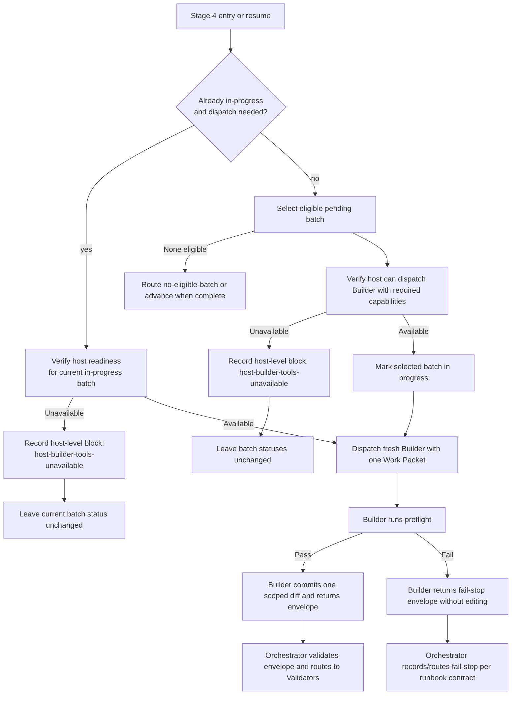

# feat: Define Builder Work Packet and Dispatch Contract

## Summary

Update the Issue-to-PR runbook contract so Builder is described as a fresh sub-agent dispatch per attempt, receives a host-neutral Work Packet, runs preflight before editing, and fail-stops before the Orchestrator accidentally absorbs implementation context. This plan covers the issue #21 prose slice and leaves executable attempt persistence, replacement batches, and repair-specific behavior to their sibling issues.

---

## Problem Frame

The current runbook still reads as though Builder is a role performed inside the Orchestrator session, while the source requirements define Builder as a bounded implementation mechanic dispatched fresh per attempt. Issue #21 is the contract-writing slice that makes the common Stage 4 path explicit before schema-heavy follow-up work lands.

---

## Requirements

- R1. Role boundaries state that Builder is dispatched as a fresh sub-agent per attempt, not played by the Orchestrator.
- R2. Builder Work Packet content is defined without host-specific primitive names.
- R3. Builder-facing prose includes Local Law Read Order, authority boundary, Mechanic Discipline, Public Contract Rule, and Domain Language Rule.
- R4. Builder Preflight Checklist includes readiness checks and the deterministic probe catalog.
- R5. Host-level `host-builder-tools-unavailable` fail-stop is documented before any batch is marked in progress.
- R6. The implementation references `docs/brainstorms/2026-05-21-issue-to-pr-builder-sub-agent-requirements.md` as the source requirements document.
- R7. Post-dispatch Builder infrastructure failures and Validator handoff wording preserve Stage 4 context isolation.

**Origin actors:** A1 Orchestrator, A3 Builder sub-agent, A4 Validator personas, A5 User
**Origin flows:** F1 Initial implementation attempt, F3 Builder Preflight Checklist, F4 Builder Work Packet shape, F5 Builder return envelope
**Origin acceptance examples:** AE2 Builder commits one scoped diff after preflight, AE3 preflight fail-stop routes to replacement work (partial coverage; replacement mechanics deferred), AE5 unauthorized public contract change fail-stops, AE7 host-neutral Codex mapping, AE8 host tools unavailable fail-stop, AE9 malformed envelope is infrastructure failure

---

## Scope Boundaries

- This plan does not implement Stage 3 Contract Review; that is tracked by #19.
- This plan does not add executable `builder_attempts` validation or ledger schema changes beyond prose/template guidance; that is tracked by #22.
- This plan does not implement repair-attempt behavior or rich Validator evidence handoff mechanics beyond the shared Work Packet/envelope terms and minimal no-context-leak handoff wording needed to keep #23 compatible.
- This plan does not implement replacement batches or `supersedes`; that is tracked by #24.
- This plan does not change patch-proposal helper behavior; that is tracked by #25.
- This plan does not introduce a durable named Builder agent artifact or host-specific Claude/Codex wiring.

### Deferred to Follow-Up Work

- #22 validates persisted `builder_attempts`, attempt/commit relationships, and iteration counting in `decompose.ts`.
- #24 validates replacement batches and optional `supersedes` once preflight fail-stop replacement flow is implemented.
- #23 defines the repair-specific Work Packet behavior and rich Validator evidence handoff in detail.

---

## Context & Research

### Relevant Code and Patterns

- `runbooks/issue-to-pr/README.md` already has host-neutral invocation language: "Invoke" is a contract verb, while each host maps it to native mechanics.
- `runbooks/issue-to-pr/issue-to-pr.md` owns the executable stage protocol, role boundaries, Stage 4 batch loop, Builder rules, Validator handoff, and escape hatches.
- `runbooks/issue-to-pr/issue-N-ledger.template.md` already has `blocked_reason` and append-only `## Notes`, which fit the host-unavailable and infrastructure-failure recording path.
- `runbooks/issue-to-pr/decompose.ts` and `runbooks/issue-to-pr/decompose.test.ts` enforce ledger and findings invariants today; this plan should avoid depending on helper fields that #22 and #24 have not implemented yet.

### Institutional Learnings

- `docs/reviews/2026-03-23-prompt-system-review.md` says shared cross-harness surfaces should express required behavior, not runtime-specific invocation syntax.
- `docs/plans/2026-03-23-cross-harness-config-refactor.md` separates prompts, skills, agents, approval policy, and runtime config into distinct surfaces; Builder wording should preserve that boundary.
- `docs/research/2026-03-23-agent-prompt-best-practices.md` supports using sub-agents to reduce context rot, which is the core reason the Work Packet must stay narrow.

### External References

- Not used. Local requirements and existing runbook patterns are sufficient for this docs-contract slice.

---

## Key Technical Decisions

- Keep #21 as a runbook-contract slice: issue #21's acceptance criteria are prose-facing, while #22 and #24 already own executable schema work.
- Treat the Stage 4 Builder dispatch contract as future-state until #19 Stage 3 Contract Review lands, because narrow Work Packets rely on plan/DAG drift being caught before batch contracts become ledger law.
- Select the eligible pending batch first, then check host Builder readiness before marking that batch `in-progress`: this avoids both false host blocks when no Builder dispatch is needed and false resume states where a batch looks started despite no Builder attempt existing.
- Check host Builder readiness before every Builder dispatch, including resumed implementation and repair dispatches.
- Split host-readiness flow by state: initial dispatch selects an eligible pending batch before readiness; resumed implementation or repair dispatch checks readiness against the already `in-progress` batch without selecting a new pending batch or changing batch status.
- Treat `host-builder-tools-unavailable` as a host-level run block before Builder exists, separate from post-dispatch `builder-infrastructure-failure`.
- Use host-neutral capability language for Builder dispatch: the runbook should say what the host must provide, not name Claude Code or Codex primitives.
- Allow bounded read/search beyond edit scope during preflight: Builder needs local law, nearby tests, and deterministic probes, but edits remain limited to `batch.files`.
- Keep Work Packets batch-only: no full plan, full ledger, unrelated batch state, or raw Validator envelopes. For #21, prior-attempt state is limited to existing persisted `builder_commits`, current `iterations`, batch findings, and non-authoritative Notes summaries; compact prior `builder_attempts` become part of the Work Packet only after #22 adds the persisted field.
- Include a compact authority summary in the Work Packet when the confirmed batch contract depends on public contract or domain-language constraints. The summary must be materialized from the confirmed batch contract/decomposition, not reconstructed from the full plan or ledger at Builder time.
- Treat well-formed Builder fail-stops as Builder attempts in runbook prose, while deferring executable `builder_attempts` persistence and iteration validation to #22.
- For well-formed preflight fail-stops, block the current batch with `final_verdict: blocked-for-user`; replacement batch and `supersedes` mechanics remain #24-owned.
- Document the shared Builder envelope shape only: statuses, required evidence categories, malformed-envelope meaning, and Validator handoff fields. Full schema validation belongs to #22; repair-specific behavior belongs to #23.
- Allow Orchestrator to read full commit diff content for Builder authority checks, envelope integrity, and lightweight correctness sanity checks. Correctness sanity concerns may only annotate transient Validator focus; they do not become ledger entries, Orchestrator-authored findings, or correctness gates.
- Gate before Validator dispatch only when the diff shows a Builder authority breach or malformed envelope. Obvious correctness concerns without an authority/envelope violation remain transient Validator focus.
- Define host readiness as a capability proof, not a vague availability check: the host must be able to create a fresh isolated Builder dispatch, deliver the Work Packet, expose git status and commit refs, capture the Builder envelope, and classify timeout/failure before Builder side effects are trusted.
- Use conservative Validator selection: Builder `suggested_validator_focus` may add focus, but Orchestrator owns coverage. If path/name signals or Builder focus are incomplete, dispatch the default broad reviewer set; path, touched-file, and batch-contract signals that match existing Persona selector triggers must dispatch those reviewers regardless of Builder suggestion.
- Treat malformed envelopes and post-dispatch dispatch/schema failures as Builder infrastructure failures in prose, with explicit run-level blocking semantics; defer executable persistence validation to #22.

---

## Open Questions

### Resolved During Planning

- Should this plan include helper/schema validation? No. The source requirements list those gaps, but sibling issues #22 and #24 already own the executable ledger and replacement-batch validators.
- What is the enablement dependency on #19? The Stage 4 Builder dispatch contract may be written in #21, but it should be treated as future-state or not fully enabled until #19 Stage 3 Contract Review lands.
- Should host readiness happen once per Stage 4 or before every dispatch? Before every Builder dispatch, including the first implementation dispatch, resumed redispatch, and repair dispatch.
- Should host readiness happen before or after selecting an eligible batch? After selecting an eligible pending batch and before marking it `in-progress`, so Stage 4 does not report host failure when the real state is no eligible batch or all batches complete.
- How does readiness differ on resumed or repair dispatch? Initial dispatch selects an eligible pending batch first; resumed implementation and repair dispatches check readiness against the already `in-progress` batch immediately before dispatch.
- Does a well-formed Builder fail-stop count as a Builder attempt? Yes in runbook workflow language; executable persistence and iteration validation stay with #22.
- What should a well-formed preflight fail-stop do before replacement batches exist? Document that the fail-stop is a Builder attempt, record Notes/final_verdict wording, block the current batch with `final_verdict: blocked-for-user`, and leave executable `builder_attempts` persistence plus replacement batch / `supersedes` mechanics to #22/#24.
- How broad is Builder Preflight discovery? Bounded read/search for local law, `batch.files`, nearby seams/tests, deterministic probes, and equivalent literal probes named by the batch contract. Whole-repo archaeology routes to fail-stop.
- How much prior state does the Work Packet include? Batch-only state: confirmed batch contract, current iteration, existing persisted `builder_commits`, batch findings, and non-authoritative Notes summaries. Compact prior `builder_attempts` are included only after #22 adds the persisted field.
- How does Builder receive authority context without full-plan access? Decomposition or the confirmed batch contract must materialize any compact public-contract or domain-language authority summary the Builder needs.
- May Orchestrator inspect full commit diff content? Yes, for Builder authority checks, envelope integrity, and lightweight correctness sanity checks. Sanity concerns may only annotate transient Validator focus; Validators own findings and correctness gates.
- What if the sanity check finds an obvious P0? Orchestrator gates only when that issue is also a Builder authority breach or malformed envelope; otherwise it passes as transient Validator focus.
- How does Validator handoff preserve bounded context isolation? Orchestrator passes commit refs/ranges, touched file names, batch contract, and Builder evidence. Persona selection uses path/name signals plus Builder `suggested_validator_focus`; when uncertain, dispatch broader reviewers rather than using implementation analysis.
- What is the conservative Validator fallback? When path/name signals or Builder focus are incomplete, dispatch the default broad reviewer set. Existing path, touched-file, and batch-contract triggers still force their matching validators regardless of Builder suggestion.
- Should #21 update the existing Persona selector? Yes. The current selector's "plus file contents" wording must be replaced, not left alongside new handoff prose.
- What happens to side effects after malformed envelope or validation failure? Orchestrator records `builder-infrastructure-failure`, leaves the batch `in-progress`, surfaces reachable commit refs and dirty/staged path summaries, and asks the user to retry, import, or abandon. No auto-revert, auto-import, Validators, or iteration increment.
- Where does Builder vocabulary live? In the Issue-to-PR local glossary in `runbooks/issue-to-pr/README.md`, not root `CONTEXT.md`.
- Should Stage 4 context isolation get an ADR? Yes: `docs/adr/0001-stage-4-context-isolation.md`.
- Are missing listed files creatable? Yes. `batch.files` authorizes Builder to create that path when missing, with preflight fail-stop for stale, mistyped, wrong-package, or semantically unauthorized paths.
- Does listing a public contract file authorize public contract drift? No. Public contract changes need explicit batch language plus tests/proofs.
- What may Builder do with unresolved domain language? Use provisional wording in the envelope only; fail-stop if the term affects ownership, API, behavior, or durable meaning.
- How much repair behavior belongs in #21? Shared contract only: `attempt_type: implementation | repair` and repair-only target finding signature. Detailed repair behavior stays with #23.

### Deferred to Implementation

- Exact wording of the Builder contract sections may move during editing as long as role boundaries, Stage 4, and Builder rules remain easy to scan.
- Exact Notes wording for host/infrastructure failure is deferred to implementation; the plan only requires the runbook to name the durable state transition and evidence expectations.

### Deferred From Review

- Infrastructure recovery choices remain an Open Question: after `builder-infrastructure-failure`, define the exact `retry`, `import`, and `abandon` outcomes, including frontmatter changes, batch status/final_verdict changes, side-effect handling, and whether any imported commit can proceed to Validators.

---

## High-Level Technical Design

> *This illustrates the intended approach and is directional guidance for review, not implementation specification. The implementing agent should treat it as context, not code to reproduce.*



---

## Implementation Units

### U1. Refresh Builder Role Boundaries

**Goal:** Make the top-level runbook role model say Builder is dispatched fresh per attempt and that Orchestrator does not play Builder during Stage 4.

**Requirements:** R1, R6

**Dependencies:** None

**Files:**
- Modify: `runbooks/issue-to-pr/README.md`
- Modify: `runbooks/issue-to-pr/issue-to-pr.md`

**Approach:**
- Update role-boundary prose to distinguish Orchestrator authority from Builder execution authority.
- Reference the source requirements document in the Builder contract prose so future implementers can trace why the contract exists.
- Reuse the existing host-neutral invocation language from `README.md` instead of adding literal host primitive names.
- Keep the common operator path compact: dispatch one Builder, receive one envelope, validate, then run Validator personas.

**Patterns to follow:**
- `runbooks/issue-to-pr/README.md` host-neutral "Invoke" wording.
- `runbooks/issue-to-pr/issue-to-pr.md` role-boundary section and stage protocol style.

**Test scenarios:**
- Test expectation: none -- this is documentation-contract work. Verification is by markdown review and targeted text search.
- Happy path: reading the role-boundary section makes it clear that Builder is a fresh sub-agent per attempt and Orchestrator owns stages, ledger, user gates, and validation.
- Edge case: wording does not imply a durable named `issue-to-pr-builder` capability or host-specific Claude/Codex tool.
- Integration: source requirements reference is present near the Builder contract prose, satisfying issue #21 traceability.

**Verification:**
- A reviewer can answer "who dispatches, who edits, who validates, who gates?" from the role-boundary prose without reading the source requirements first.
- Search confirms the new Builder contract wording references `docs/brainstorms/2026-05-21-issue-to-pr-builder-sub-agent-requirements.md`.

```yaml
id: refresh-builder-role-boundaries
name: Refresh Builder Role Boundaries
goal: "Runbook role boundaries state that Builder is dispatched as a fresh sub-agent per attempt, not played by the Orchestrator, and reference the source requirements."
files:
  - runbooks/issue-to-pr/README.md
  - runbooks/issue-to-pr/issue-to-pr.md
depends_on: []
execution_mode: change_first
acceptance_tests:
  - "R1 holds: Role boundaries state that Builder is dispatched as a fresh sub-agent per attempt, not played by the Orchestrator."
  - "R6 holds: The runbook prose references docs/brainstorms/2026-05-21-issue-to-pr-builder-sub-agent-requirements.md as the source requirements document."
ac_mapping:
  - 1
  - 6
rationale: null
```

### U2. Define Work Packet and Builder Preflight Contract

**Goal:** Add Builder-facing contract prose for the host-neutral Work Packet, authority boundary, local-law read order, Mechanic Discipline, public-contract/domain-language rules, and required preflight.

**Requirements:** R2, R3, R4

**Dependencies:** U1

**Files:**
- Modify: `runbooks/issue-to-pr/README.md`
- Modify: `runbooks/issue-to-pr/issue-to-pr.md`

**Approach:**
- Define Work Packet content as a payload shape and capability contract, not as a host tool invocation.
- Include shared attempt fields needed for implementation and repair dispatches, while saying detailed repair behavior is owned by #23.
- Keep Work Packet state batch-only: confirmed batch contract, current iteration, existing persisted `builder_commits`, batch findings, and non-authoritative Notes summaries for that batch only. Compact prior `builder_attempts` are included only once #22 adds the persisted field.
- Include a compact authority summary when the confirmed batch contract depends on public contract or domain-language constraints. That summary must be materialized into the batch contract or decomposition output before dispatch; Builder must not receive the full plan or full ledger to discover it.
- Make the read/edit boundary explicit: Builder may perform bounded read/search for local law, nearby tests, deterministic probes, and equivalent literal probes named by the batch contract; Builder may edit only `batch.files`.
- Add readiness checks and the deterministic probe catalog from the origin requirements, extended only by equivalent literal probes from the batch goal, rationale, or acceptance tests.
- Document the shared Builder envelope shape without adding executable schema validation: statuses, evidence categories, malformed-envelope meaning, and Validator handoff fields.
- State that well-formed Builder fail-stops count as Builder attempts in workflow language, while executable `builder_attempts` persistence and iteration validation remain #22-owned.
- Clarify missing-file handling: a path listed in `batch.files` authorizes Builder to create that path when missing, but Builder fail-stops when preflight suggests the path is stale, mistyped, wrong-package, or semantically unauthorized.
- Clarify public contract and domain language boundaries: public contract changes need explicit batch language plus checks/proofs; unresolved domain language may appear provisionally in the envelope only, and durable language uncertainty fail-stops.

**Patterns to follow:**
- Existing `execution_mode` contract wording in `runbooks/issue-to-pr/README.md`.
- Existing Stage 4 Builder rules in `runbooks/issue-to-pr/issue-to-pr.md`.
- Requirements sections "Builder contract", "Local Law Read Order", "Mechanic Discipline", "Public Contract Rule", "Domain Language Rule", "F3", and "F4".

**Test scenarios:**
- Test expectation: none -- this is documentation-contract work. Verification is by markdown review and targeted text search.
- Happy path: Work Packet describes one confirmed batch, existing persisted prior state for that batch, relevant findings for that batch, local law, authority, preflight, and return-envelope expectations.
- Edge case: Work Packet explicitly excludes full plan, full ledger, raw Validator envelopes, and unrelated batch state.
- Edge case: Work Packet includes compact prior `builder_attempts` only when #22 has added the persisted field; before then, Notes summaries are non-authoritative evidence only.
- Edge case: public-contract or domain-language authority that would otherwise live outside the batch is materialized into a compact authority summary before Builder dispatch.
- Error path: preflight readiness failure returns a fail-stop before editing or committing.
- Error path: a well-formed preflight fail-stop is documented as a Builder attempt, records Notes/final_verdict wording, blocks the current batch with `final_verdict: blocked-for-user`, and leaves executable `builder_attempts` persistence plus replacement batch / `supersedes` mechanics to #22/#24.
- Error path: deterministic probe matches outside `batch.files` route to fail-stop rather than opportunistic scope widening.
- Edge case: deterministic probes stay closed except for equivalent literal probes named by the batch goal, rationale, or acceptance tests.
- Edge case: public contract changes require explicit batch authorization and proof/check coverage.
- Edge case: listed missing paths may be created, unless preflight evidence suggests stale, mistyped, wrong-package, or semantically unauthorized paths.
- Edge case: missing durable domain language causes provisional envelope wording only; Builder fail-stops if the term affects ownership, API, behavior, or durable meaning.

**Verification:**
- A reviewer can reconstruct the batch-only Work Packet boundary without inferring from helper code.
- The Work Packet wording does not require `builder_attempts` before #22 adds the persisted field.
- The Work Packet wording explains where public-contract and domain-language authority summaries come from without reintroducing full-plan/full-ledger context.
- The preflight prose names readiness checks, the deterministic probe catalog, and the equivalent literal-probe allowance.
- Shared envelope prose covers statuses, evidence categories, malformed-envelope meaning, and Validator handoff fields without promising #22 schema enforcement.
- No new prose names Claude Code or Codex-specific dispatch primitives as part of the shared contract.

```yaml
id: define-work-packet-preflight
name: Define Work Packet and Builder Preflight Contract
goal: "Builder Work Packet, local-law, authority, mechanic discipline, public-contract, domain-language, and preflight rules are documented without host-specific primitive names."
files:
  - runbooks/issue-to-pr/README.md
  - runbooks/issue-to-pr/issue-to-pr.md
depends_on:
  - refresh-builder-role-boundaries
execution_mode: change_first
acceptance_tests:
  - "R2 holds: Builder Work Packet content is defined without host-specific primitive names."
  - "R3 holds: Local Law Read Order, authority boundary, Mechanic Discipline, Public Contract Rule, and Domain Language Rule are included in Builder-facing prose."
  - "R4 holds: Builder Preflight Checklist includes readiness checks and the deterministic probe catalog."
ac_mapping:
  - 2
  - 3
  - 4
rationale: null
```

### U3. Insert Host Readiness and Fail-Stop Flow Before Batch Start

**Goal:** Make Stage 4 check host Builder capability before any batch is marked `in-progress`, and describe fail-stop/infrastructure-failure routing without expanding into #22 schema work.

**Requirements:** R1, R5, R7

**Dependencies:** U1, U2

**Files:**
- Modify: `runbooks/issue-to-pr/README.md`
- Modify: `runbooks/issue-to-pr/issue-to-pr.md`
- Modify: `runbooks/issue-to-pr/issue-N-ledger.template.md`

**Approach:**
- Split Stage 4 readiness into initial and already-started paths. Initial dispatch selects an eligible pending batch, checks host readiness, then marks it `in-progress`; resumed implementation or repair dispatch checks readiness against the already `in-progress` batch immediately before dispatch without selecting a new pending batch or changing batch status.
- Define host readiness as host-neutral capability proof: fresh isolated Builder dispatch, Work Packet delivery, git status and commit-ref visibility, Builder envelope capture, and timeout/failure classification.
- Define `host-builder-tools-unavailable` as a host-level run block recorded before Builder dispatch: frontmatter `status: blocked`, `blocked_reason: host-builder-tools-unavailable`, append Notes evidence, leave batch statuses unchanged, no `builder_attempts`, no iteration increment, and no Validator dispatch. For already `in-progress` batches, leave the current batch status unchanged and require user retry or abandon before continuing.
- Describe post-dispatch infrastructure failures separately from Builder-authored fail-stops: frontmatter `status: blocked`, `blocked_reason: builder-infrastructure-failure`, append host/schema evidence to Notes, leave the already-started batch `in-progress` until the user chooses retry/import/abandon, no `builder_attempts`, no iteration increment, no Validator dispatch, no Orchestrator-direct fallback, and no claim that a Builder attempt existed without a well-formed envelope.
- Require the infrastructure-failure prompt/Notes to surface any reachable Builder commit refs and dirty/staged path summaries from git status without reading implementation file contents. The Orchestrator must not clean up, import, or discard those side effects before the user chooses retry, import, or abandon.
- Keep ledger-template changes lightweight: document the Notes/blocked-reason expectation and the workflow meaning of Builder attempts without adding executable `builder_attempts` shape that belongs to #22.
- Adjust Validator handoff and the existing Persona selector prose so Orchestrator passes commit refs/ranges, touched file names, batch contract, and Builder evidence. Replace the current "plus file contents" selector language with path/name signals plus Builder `suggested_validator_focus`; when path/name signals or Builder focus are incomplete, dispatch the default broad reviewer set. Existing path, touched-file, and batch-contract signals that match Persona selector triggers must dispatch their validators regardless of Builder suggestion.
- Add a bounded validation allowance: Orchestrator may read full commit diff content for Builder authority checks, envelope integrity, and lightweight correctness sanity checks. Correctness sanity concerns may only annotate transient Validator focus; they do not become ledger entries, Orchestrator-authored findings, or correctness gates.
- State the pre-Validator gate boundary: Orchestrator stops only for authority breaches or malformed envelopes; correctness concerns alone go to Validators as transient focus.

**Patterns to follow:**
- Existing clean-tree and lifecycle checkpoint wording in `runbooks/issue-to-pr/issue-to-pr.md`.
- Existing `blocked_reason` and `## Notes` fields in `runbooks/issue-to-pr/issue-N-ledger.template.md`.
- Source requirements F1, F5, AE8, and AE9.

**Test scenarios:**
- Test expectation: none -- this is documentation-contract work. Verification is by markdown review and targeted text search.
- Happy path: initial dispatch selects an eligible pending batch, verifies host Builder capabilities, marks it `in-progress`, and dispatches Builder.
- Happy path: resumed or repair dispatch verifies host Builder capabilities against the current `in-progress` batch and dispatches Builder without selecting a new pending batch or changing batch status.
- Edge case: when no pending batch is eligible, Stage 4 reports `no-eligible-batch` or advances when complete before checking host Builder readiness.
- Error path: when host Builder capabilities are unavailable, runbook records frontmatter `status: blocked`, `blocked_reason: host-builder-tools-unavailable`, appends Notes evidence, leaves batch statuses unchanged, and does not fall back to Orchestrator-direct implementation.
- Error path: when host Builder capabilities disappear during resumed or repair dispatch, runbook records the same host-level block, leaves the current `in-progress` batch unchanged, does not increment iterations, and does not dispatch Validators.
- Error path: when dispatch or envelope serialization fails after a batch has already started, runbook records frontmatter `status: blocked`, `blocked_reason: builder-infrastructure-failure`, leaves the batch `in-progress` pending user decision, surfaces any reachable commit refs or dirty/staged path summaries, and treats the event as infrastructure failure rather than a Builder-authored attempt.
- Integration: Validator handoff wording preserves the bounded context-isolation goal by passing commit refs/ranges, touched file names, batch contract, and Builder evidence instead of relying on Orchestrator implementation analysis during Stage 4.
- Integration: Validator selection falls back to the default broad reviewer set when path/name signals or Builder focus are incomplete, and forced Persona selector triggers still apply regardless of Builder suggestion.
- Regression: the existing Persona selector no longer says Orchestrator uses changed file contents for Stage 4 persona selection.

**Verification:**
- Stage 4 prose distinguishes initial dispatch from resumed/repair dispatch and places host readiness in the correct state path for each.
- Host readiness prose names the capability proof required before Builder dispatch.
- Template/README/runbook wording agree on where host-unavailable and infrastructure-failure evidence is recorded.
- Template prose mentions that well-formed Builder fail-stops count as Builder attempts without adding unsupported `builder_attempts` YAML.
- Persona selector and Validator handoff wording no longer use Orchestrator implementation analysis for reviewer selection.
- Search confirms there is no new fallback path where Orchestrator directly implements a batch.

```yaml
id: insert-host-readiness-flow
name: Insert Host Readiness and Fail-Stop Flow Before Batch Start
goal: "Stage 4 documents host Builder capability checks before marking any batch in progress and defines host-builder-tools-unavailable fail-stop behavior."
files:
  - runbooks/issue-to-pr/README.md
  - runbooks/issue-to-pr/issue-to-pr.md
  - runbooks/issue-to-pr/issue-N-ledger.template.md
depends_on:
  - refresh-builder-role-boundaries
  - define-work-packet-preflight
execution_mode: change_first
acceptance_tests:
  - "R5 holds: Host-level host-builder-tools-unavailable fail-stop is documented before any batch is marked in progress."
  - "R1 holds: Stage 4 dispatch wording reinforces that Builder is a fresh sub-agent per attempt."
  - "R7 holds: Post-dispatch infrastructure failures and Validator handoff preserve Stage 4 context isolation."
ac_mapping:
  - 5
  - 1
  - 7
rationale: null
```

---

## System-Wide Impact

- **Interaction graph:** The Orchestrator remains the stage, ledger, and envelope-validation authority; Builder becomes the fresh per-attempt implementation worker; Validators remain read-only correctness reviewers.
- **Error propagation:** Host Builder readiness failures block before batch start; Builder-authored fail-stops return structured envelopes and count as workflow attempts; post-dispatch infrastructure failures block outside the attempt contract until #22 makes persistence executable.
- **State lifecycle risks:** The main state risks are incorrectly marking a batch `in-progress` before Builder capability is known, and incorrectly reporting host failure when no Builder dispatch is needed. U3 resolves both in prose.
- **API surface parity:** The shared runbook contract stays host-neutral and should work across Claude Code and Codex mappings.
- **Integration coverage:** There are no runtime changes in this slice. Integration confidence comes from source-trace review and future sibling issue validation.
- **Unchanged invariants:** `decompose.ts` batch parsing, findings validation, `builder_commits`, and `iterations` behavior remain unchanged by this slice.

---

## Risks & Dependencies

| Risk | Mitigation |
|------|------------|
| #21 prose accidentally promises helper validation that does not exist yet | Scope boundaries and U3 explicitly defer `builder_attempts`, `supersedes`, and envelope validation to sibling issues |
| #21 Builder dispatch ships before the Stage 3 guardrail it relies on | Document the #19 enablement dependency and treat Stage 4 Builder dispatch as future-state until Contract Review lands |
| Host-neutral prose becomes too vague for implementation | U2 names the concrete Work Packet fields, authority boundary, readiness checks, and probe catalog while avoiding host primitive names |
| The runbook reports host failure when no Builder dispatch is needed | U3 selects the eligible pending batch before checking host Builder readiness |
| The runbook leaves an unsafe resume state when host Builder tools are unavailable | U3 orders host readiness before batch `in-progress` mutation and records a host-level run block |
| Post-dispatch infrastructure failure leaves an ambiguous `in-progress` batch | U3 records run-level blocking fields, leaves the batch `in-progress` pending user decision, and forbids iteration/Validator side effects |
| Validator handoff reintroduces Orchestrator implementation context | U3 permits full diff reads for authority checks, envelope integrity, and lightweight correctness sanity checks only; requires commit refs/ranges, touched file names, batch contract, and Builder evidence handoff; and limits sanity concerns to transient Validator focus annotations rather than ledger entries or Orchestrator-authored findings |
| Missing/new file handling conflicts with "read every file before editing" | U2 documents that absent listed files may be created when named in `batch.files`, with preflight fail-stop for stale, mistyped, wrong-package, or semantically unauthorized paths |
| Batch-only Work Packets omit authority context Builder needs | U2 requires public-contract and domain-language authority to be materialized into a compact batch authority summary before dispatch |
| Workflow-specific vocabulary drifts into repo-wide domain language | Terms stay in the Issue-to-PR local glossary unless another workflow adopts them |

---

## Documentation / Operational Notes

- This is a docs-contract change. Implementation should avoid new dependencies and avoid broad helper refactors.
- Because the repo already has dirty Issue-to-PR changes, implementation should read current diffs before editing and preserve unrelated in-flight work.
- Use targeted markdown review and text search for verification; run `decompose.test.ts` only if implementation touches helper/schema files despite the planned scope.

---

## Sources & References

- **Origin document:** [docs/brainstorms/2026-05-21-issue-to-pr-builder-sub-agent-requirements.md](docs/brainstorms/2026-05-21-issue-to-pr-builder-sub-agent-requirements.md)
- Related issue: #21 Define Builder Work Packet, preflight, and dispatch prose
- Parent issue: #26 PRD: Issue-to-PR Builder sub-agent dispatch
- Sibling issues: #19, #22, #23, #24, #25
- Related runbook: `runbooks/issue-to-pr/README.md`
- Related runbook: `runbooks/issue-to-pr/issue-to-pr.md`
- Related ledger template: `runbooks/issue-to-pr/issue-N-ledger.template.md`
- Related ADR: `docs/adr/0001-stage-4-context-isolation.md`
