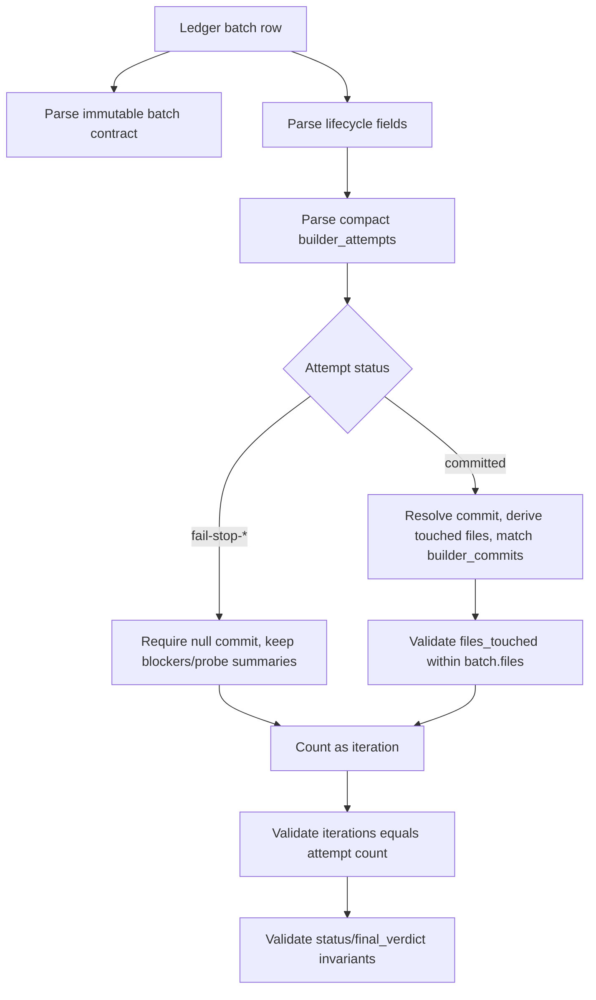

# feat: Persist Builder Attempts in Issue-to-PR

## Summary

Add executable support for compact `builder_attempts` in the Issue-to-PR ledger path. The plan turns the previously deferred Builder attempt field into a validated ledger contract, ties committed attempts to `builder_commits`, verifies touched-file scope against the active git repo, and preserves the context-saving split between compact persisted attempts and rich transient Builder evidence.

---

## Problem Frame

The Builder dispatch requirements make Builder a fresh per-attempt sub-agent, but the current ledger helper still only understands `builder_commits` and `iterations`. That leaves a gap between the runbook's desired audit trail and the executable schema: well-formed fail-stops should count as attempts, infrastructure failures should not, and committed attempts should be validated against both git and the confirmed batch contract.

---

## Requirements

- R1. Ledger template and runbook prose distinguish compact persisted `builder_attempts` from rich transient Builder evidence passed to Validators.
- R2. `builder_attempts` records include `attempt_type`, `status`, `commit_sha`, `files_touched`, `route_hint`, `blockers`, `probe_results`, and `notes`.
- R3. `decompose.ts` accepts and validates `builder_attempts` in ledger batch rows.
- R4. `decompose.ts` cross-validates `builder_attempts` against `builder_commits`.
- R5. `iterations` counts every well-formed Builder envelope, including Builder-authored fail-stops, while infrastructure failures remain outside the cap according to the decision in #18.
- R6. The implementation references `docs/brainstorms/2026-05-21-issue-to-pr-builder-sub-agent-requirements.md` as the source requirements document.

**Origin actors:** A1 Orchestrator, A3 Builder sub-agent, A4 Validator personas, A5 User
**Origin flows:** F1 Initial implementation attempt, F2 Repair attempt, F5 Builder return envelope, F6 Compact `builder_attempts`
**Origin acceptance examples:** AE2 committed Builder envelope, AE3 preflight fail-stop, AE4 repair attempt, AE9 Builder infrastructure failure

---

## Scope Boundaries

- This plan does not implement replacement batches or `supersedes`; that remains #24.
- This plan does not define repair-specific Validator evidence handoff beyond counting repair attempts like any other well-formed Builder envelope; that remains #23.
- This plan does not add a durable named Builder agent, host-specific dispatch wiring, or a generic agent-spawning framework.
- This plan does not persist rich Builder evidence fields such as `implementation_steps`, `existing_seams_used`, `tests_run`, `assumptions`, `risks`, `deferred`, or `suggested_validator_focus`.
- This plan does not add a standalone Builder envelope validator command. It validates the persisted ledger state produced after Orchestrator receipt validation.
- This plan does not loosen existing `builder_commits` reachability or fixed-finding resolution invariants.

### Deferred to Follow-Up Work

- #23 can decide whether repair attempts need a persisted target finding field beyond compact `notes`.
- #24 can add `supersedes` validation and replacement-batch dependency rewrites.
- A future helper can validate raw Builder envelopes directly if real runs show that receipt-time validation needs a machine boundary separate from ledger validation.

---

## Context & Research

### Relevant Code and Patterns

- `runbooks/issue-to-pr/decompose.ts` uses strict allowed key sets for candidate batches, ledger batch rows, and finding rows. `builder_attempts` should extend that path instead of adding a parallel parser.
- `runbooks/issue-to-pr/decompose.ts` currently validates reachable `builder_commits`, terminal batch status, `iterations`, AC coverage, and fixed finding resolutions against the active git repo.
- `runbooks/issue-to-pr/decompose.ts` intentionally parses a constrained YAML subset. The new ledger shape should add only the nested support needed for compact attempts rather than introducing broad YAML semantics.
- `runbooks/issue-to-pr/decompose.test.ts` already exercises helper modes through the process boundary and has focused ledger lifecycle tests around `builder_commits`, `iterations`, and `final_verdict`.
- `runbooks/issue-to-pr/issue-N-ledger.template.md` currently tells operators not to add executable `builder_attempts` fields until helper/schema support exists; this plan removes that deferral.
- `runbooks/issue-to-pr/README.md` and `runbooks/issue-to-pr/issue-to-pr.md` already describe Builder dispatch and infrastructure failures; this plan aligns the helper-supported ledger contract with that prose.

### Institutional Learnings

- `docs/adr/0001-stage-4-context-isolation.md` records the architecture: Orchestrator owns ledger lifecycle, Work Packet assembly, envelope validation, and Validator dispatch; Builder owns one attempt.
- `docs/plans/2026-05-21-001-feat-builder-work-packet-dispatch-plan.md` explicitly deferred executable `builder_attempts` persistence, attempt/commit relationships, and iteration counting to #22.
- `docs/reviews/2026-03-23-prompt-system-review.md` and `docs/plans/2026-03-23-cross-harness-config-refactor.md` support host-neutral contract language over Claude/Codex primitive names.
- `docs/solutions/` does not exist in this repo, so there were no solution docs to carry forward.

### External References

- Not used. The work is driven by repo-local runbook contracts and helper patterns.

---

## Key Technical Decisions

- Use a limited nested ledger shape for `builder_attempts`: each attempt is a small mapping under the batch row, while `blockers` and `probe_results` persist compact string summaries rather than full envelope objects.
- Keep `builder_attempts` outside the batch contract digest. Attempts are mutable lifecycle evidence like `status`, `builder_commits`, `iterations`, and `final_verdict`.
- Persist full commit SHAs going forward, but validate and compare by resolved commit object so existing short reachable refs remain compatible with the helper's current `7-40` hex ref behavior.
- Validate `iterations === builder_attempts.length` whenever attempts exist, including blocked and in-progress batches. Untouched `pending` batches remain valid with `builder_attempts: []` and `iterations: 0`.
- Treat all well-formed Builder envelope statuses as attempts, including Builder-authored fail-stops. Treat host, tool, permission, serialization, schema, timeout, or malformed-envelope failures as run-state evidence only, with no attempt row and no iteration increment.
- Keep `accepted-risk` and `converged` terminal statuses tied to at least one committed attempt. A fail-stop-only history should end as `blocked` with `final_verdict: blocked-for-user`, not as terminal success.
- Split receipt-time validation from ledger-state validation. Orchestrator receipt validation compares the raw envelope to the current commit before Validator dispatch; `decompose.ts --validate-ledger-batches` validates the persisted ledger state against reachable commits and derived commit files.
- Treat `files_touched` as authority evidence. For committed attempts, the helper derives changed paths from git and requires them to match the persisted `files_touched` list and stay within confirmed `batch.files`.
- Do not add `target_finding_signature` to compact persistence in this slice because #22's accepted record fields are explicit and #23 owns repair-specific handoff. Repair attempts can summarize the target in `notes` until #23 decides otherwise.

---

## Open Questions

### Resolved During Planning

- Should `builder_attempts` use full raw envelope objects? No. Persist compact records only; rich evidence stays transient for Validators.
- Should the helper adopt a general YAML parser? No. Extend the current constrained parser only enough to accept compact nested attempt rows.
- Should blocked batches validate attempt counts? Yes. A well-formed fail-stop blocks the batch and still counts toward the five-attempt cap.
- Should infrastructure failures create attempt rows? No. The #18 decision says they block outside the batch cap, do not append `builder_attempts`, and do not increment `iterations`.
- Should short commit refs remain valid? Yes for compatibility, but new persisted attempts should prefer full SHAs.
- Can `accepted-risk` be used with only fail-stop attempts and no Builder commit? No. That path should remain `blocked-for-user` unless a later committed attempt exists.

### Deferred to Implementation

- Exact helper function names for nested attempt parsing are implementation details.
- Exact wording of template prose can move as long as it preserves compact-vs-rich evidence and infrastructure-failure distinctions.
- Exact git diff command flags can be chosen during implementation as long as rename, delete, and modify paths are derived consistently from the commit.

---

## High-Level Technical Design

> *This illustrates the intended approach and is directional guidance for review, not implementation specification. The implementing agent should treat it as context, not code to reproduce.*



Compact persisted attempt shape:

```yaml
builder_attempts:
  - attempt_type: implementation
    status: committed
    commit_sha: "<full-or-reachable-sha>"
    files_touched:
      - "repo-relative/file.ts"
    route_hint: null
    blockers: []
    probe_results: []
    notes: "One to three sentence ledger summary."
```

`blockers` and `probe_results` are compact string lists in the ledger. The raw Builder envelope may contain richer object arrays at receipt time, but those object arrays are not persisted wholesale.

---

## Implementation Units

### U1. Update the Ledger Contract Documentation

**Goal:** Replace deferred `builder_attempts` wording with the supported compact attempt contract in the ledger template and runbook prose.

**Requirements:** R1, R2, R5, R6

**Dependencies:** None

**Files:**
- Modify: `runbooks/issue-to-pr/issue-N-ledger.template.md`
- Modify: `runbooks/issue-to-pr/README.md`
- Modify: `runbooks/issue-to-pr/issue-to-pr.md`

**Approach:**
- Add `builder_attempts: []` to the documented batch lifecycle fields beside `builder_commits`, `iterations`, and `final_verdict`.
- Replace the template warning that says not to add executable `builder_attempts` with a compact shape description.
- State that persisted `blockers` and `probe_results` are compact summaries, not raw envelope object arrays.
- Remove or update prose saying executable `builder_attempts` support is deferred.
- Preserve host-neutral wording and the source requirements reference.
- Keep infrastructure failures documented as frontmatter/Notes evidence only, with no attempt row and no iteration increment.

**Patterns to follow:**
- `runbooks/issue-to-pr/README.md` ledger format section.
- `runbooks/issue-to-pr/issue-to-pr.md` Builder return envelope and Stage 4 lifecycle sections.
- `docs/brainstorms/2026-05-21-issue-to-pr-builder-sub-agent-requirements.md` F5 and F6 language.

**Test scenarios:**
- Test expectation: none - documentation-contract work. Verification is by markdown review and targeted text search.
- Happy path: the template and README both show `builder_attempts` as a supported batch lifecycle field.
- Edge case: the docs still distinguish Builder infrastructure failures from well-formed Builder fail-stops.
- Integration: the runbook says rich Builder evidence is passed to Validators without being persisted wholesale in the ledger.

**Verification:**
- Search finds no remaining claim that executable `builder_attempts` support is deferred to future helper/schema work.
- A reviewer can reconstruct the compact persisted record fields and the rich transient evidence boundary from the docs alone.

```yaml
id: update-ledger-attempt-contract-docs
name: Update Ledger Attempt Contract Docs
goal: "Ledger template and runbook prose describe compact supported builder_attempts and distinguish them from rich transient Builder evidence."
files:
  - runbooks/issue-to-pr/issue-N-ledger.template.md
  - runbooks/issue-to-pr/README.md
  - runbooks/issue-to-pr/issue-to-pr.md
depends_on: []
execution_mode: change_first
acceptance_tests:
  - "Ledger template and runbook prose distinguish compact persisted builder_attempts from rich transient Builder evidence."
  - "Builder infrastructure failures remain documented as outside builder_attempts and iterations."
  - "The runbook references docs/brainstorms/2026-05-21-issue-to-pr-builder-sub-agent-requirements.md as the source requirements document."
ac_mapping:
  - 1
  - 2
  - 5
  - 6
rationale: null
```

### U2. Parse and Emit Compact Builder Attempts

**Goal:** Teach `decompose.ts` to emit empty `builder_attempts` for new ledger batches and parse the limited nested compact attempt shape from existing ledgers.

**Requirements:** R2, R3

**Dependencies:** U1

**Files:**
- Modify: `runbooks/issue-to-pr/decompose.ts`
- Test: `runbooks/issue-to-pr/decompose.test.ts`

**Approach:**
- Add `builder_attempts` to ledger batch allowed keys while keeping it out of candidate batch fields and the batch contract digest.
- Emit `builder_attempts: []` when rendering parsed plan batches into ledger YAML.
- Require ledger rows to include `builder_attempts`, mirroring other lifecycle fields.
- Extend the constrained ledger parser to support a single nested list of attempt mappings under `builder_attempts`.
- Keep nested support narrow: attempt scalar fields plus string-list fields for `files_touched`, `blockers`, and `probe_results`.
- Continue rejecting unknown batch keys, unknown attempt keys, duplicate attempt keys, nested object arrays, and malformed indentation with clear helper errors.

**Execution note:** Add parser regression tests before changing the parser, because the constrained YAML subset is an important helper boundary.

**Patterns to follow:**
- Existing `parseLedgerBatchRows` strict row parsing.
- Existing `requiredString`, `requiredArray`, and duplicate-field validation helpers.
- Existing tests around emitted ledger YAML and unknown lifecycle drift.

**Test scenarios:**
- Happy path: rendering a plan emits `builder_attempts: []` for every batch.
- Happy path: `--validate-ledger-batches` accepts a pending batch with `builder_attempts: []`, `builder_commits: []`, and `iterations: 0`.
- Happy path: parser accepts one compact committed attempt with scalar fields and string-list `files_touched`.
- Happy path: parser accepts one compact fail-stop attempt with string-list `blockers` and `probe_results`.
- Edge case: parser rejects an unrelated unknown batch field after `builder_attempts` is added.
- Edge case: parser rejects an unknown attempt field.
- Edge case: parser rejects raw nested object entries inside `blockers` or `probe_results`, because persisted ledger values are compact summaries.
- Error path: missing `builder_attempts` fails with the same style as missing lifecycle fields.

**Verification:**
- Emitted ledger batch output includes `builder_attempts: []` and existing digest output remains unchanged for lifecycle-only differences.
- Existing ledger parser tests still prove strictness for unrelated fields.

```yaml
id: parse-compact-builder-attempts
name: Parse Compact Builder Attempts
goal: "decompose.ts accepts the compact nested builder_attempts ledger field and emits an empty attempt list for new batches."
files:
  - runbooks/issue-to-pr/decompose.ts
  - runbooks/issue-to-pr/decompose.test.ts
depends_on:
  - update-ledger-attempt-contract-docs
execution_mode: proof_first
acceptance_tests:
  - "decompose.ts accepts builder_attempts in ledger batch rows."
  - "decompose.ts rejects unknown builder_attempts fields and raw nested blocker/probe objects."
  - "Newly emitted ledger batches include builder_attempts: [] without changing batch contract digest semantics."
ac_mapping:
  - 2
  - 3
rationale: null
```

### U3. Validate Attempt, Commit, and File Invariants

**Goal:** Enforce the durable ledger invariants tying committed attempts, `builder_commits`, reachable git commits, and touched files together.

**Requirements:** R3, R4

**Dependencies:** U2

**Files:**
- Modify: `runbooks/issue-to-pr/decompose.ts`
- Test: `runbooks/issue-to-pr/decompose.test.ts`

**Approach:**
- Validate `attempt_type` as `implementation` or `repair`.
- Validate status against the Builder envelope statuses currently documented by the runbook.
- Require committed attempts to have a non-null reachable `commit_sha`; require fail-stop attempts to use `commit_sha: null`.
- Resolve persisted commit refs to commit objects before comparing `builder_attempts` and `builder_commits`, so short refs remain compatible while full SHAs are encouraged.
- Reject duplicate committed attempts for the same resolved commit.
- Reject duplicate entries in `builder_commits`.
- Require every committed attempt to appear in `builder_commits`, and every `builder_commits` entry to have exactly one committed attempt.
- Derive files touched by committed attempts from git and compare them to persisted `files_touched`.
- Require all persisted and derived touched files to be repo-relative concrete files within the batch's confirmed `files` list. Rename and delete paths count as touched paths.
- Require non-empty `notes` for every attempt so compact audit rows remain useful.

**Execution note:** Use behavior-focused helper tests at the process boundary. The implementation can add small private helpers, but the important contract is the CLI result and stderr message.

**Patterns to follow:**
- Existing `validateReachableCommit` behavior and git-bound helper execution contract.
- Existing `validateRepoRelativePath` canonical path checks.
- Existing fixed-finding resolution validation against terminal `builder_commits`.

**Test scenarios:**
- Happy path: committed attempt with matching `builder_commits`, matching derived touched files, and authorized `files_touched` is accepted.
- Happy path: fail-stop attempt with `commit_sha: null`, no `builder_commits`, blockers, probe summaries, and notes is accepted on a blocked batch.
- Edge case: short refs and full refs that resolve to the same commit compare equal.
- Edge case: duplicate `builder_commits` entries are rejected.
- Edge case: duplicate committed attempts for the same commit are rejected.
- Error path: committed attempt missing from `builder_commits` is rejected.
- Error path: `builder_commits` entry with no committed attempt is rejected.
- Error path: committed attempt with `commit_sha: null` is rejected.
- Error path: fail-stop attempt with a non-null `commit_sha` is rejected.
- Error path: persisted `files_touched` differs from the actual commit diff and is rejected.
- Error path: commit diff touching a file outside `batch.files` is rejected.

**Verification:**
- `--validate-ledger-batches` proves committed attempts are real reachable commits owned by the batch and represented in `builder_commits`.
- Existing fixed-finding validation still finds terminal Builder commits through the same ledger batch context.

```yaml
id: validate-attempt-commit-file-invariants
name: Validate Attempt Commit File Invariants
goal: "decompose.ts cross-validates builder_attempts against builder_commits, git commit reachability, actual touched files, and authorized batch files."
files:
  - runbooks/issue-to-pr/decompose.ts
  - runbooks/issue-to-pr/decompose.test.ts
depends_on:
  - parse-compact-builder-attempts
execution_mode: proof_first
acceptance_tests:
  - "Every non-null builder_attempts commit_sha appears in builder_commits."
  - "Every builder_commits SHA appears in exactly one committed builder_attempts item."
  - "Committed attempt files_touched matches the commit diff and stays within batch.files."
ac_mapping:
  - 3
  - 4
rationale: null
```

### U4. Enforce Iteration and Failure-State Semantics

**Goal:** Make `iterations` reflect well-formed Builder attempts across lifecycle states, while keeping infrastructure failures outside the batch cap.

**Requirements:** R3, R5

**Dependencies:** U2, U3

**Files:**
- Modify: `runbooks/issue-to-pr/decompose.ts`
- Test: `runbooks/issue-to-pr/decompose.test.ts`
- Modify: `runbooks/issue-to-pr/issue-to-pr.md`

**Approach:**
- Validate `iterations` as exactly the number of compact `builder_attempts` for any batch that has attempt records.
- Preserve the valid untouched state: `pending`, empty `builder_attempts`, empty `builder_commits`, `iterations: 0`, `final_verdict: null`.
- Validate blocked fail-stop histories: `status: blocked`, `final_verdict: blocked-for-user`, one or more fail-stop attempts, no required `builder_commits`, and matching `iterations`.
- Preserve terminal success invariant: `converged` and `accepted-risk` require at least one committed attempt and at least one `builder_commits` entry.
- Reject more than five attempts for a batch, matching the inner-loop cap for well-formed Builder envelopes.
- Keep infrastructure failure examples in prose as frontmatter/Notes evidence only, with no attempt row and no iteration increment.

**Execution note:** Add explicit fail-stop and infrastructure-failure regression fixtures; this is the contract most likely to drift during later replacement-batch work.

**Patterns to follow:**
- Existing lifecycle status and `final_verdict` validation in `validateLedgerBatchMetadata`.
- Issue #18 decision comments: well-formed envelopes count, infrastructure failures do not.
- Runbook Stage 4 and Inner loop failure-state wording.

**Test scenarios:**
- Happy path: blocked preflight fail-stop batch with one attempt and `iterations: 1` is accepted.
- Happy path: in-progress batch after one well-formed attempt has matching iteration count and remains valid when final verdict is null.
- Happy path: infrastructure failure evidence can exist in Notes/frontmatter with no attempt and `iterations: 0` for an in-progress batch.
- Edge case: terminal accepted-risk batch with a committed attempt remains valid.
- Error path: `iterations` lower than attempt count is rejected.
- Error path: `iterations` higher than attempt count is rejected.
- Error path: six attempts are rejected by the five-attempt cap.
- Error path: terminal converged or accepted-risk batch with only fail-stop attempts is rejected.
- Error path: blocked batch with wrong `final_verdict` remains rejected.

**Verification:**
- `--validate-ledger-batches` enforces the #18 decision for committed attempts, fail-stops, and infrastructure failures.
- Runbook prose and helper behavior describe the same iteration semantics.

```yaml
id: enforce-attempt-iteration-semantics
name: Enforce Attempt Iteration Semantics
goal: "iterations count every well-formed Builder attempt, including fail-stops, while infrastructure failures remain outside the batch cap."
files:
  - runbooks/issue-to-pr/decompose.ts
  - runbooks/issue-to-pr/decompose.test.ts
  - runbooks/issue-to-pr/issue-to-pr.md
depends_on:
  - parse-compact-builder-attempts
  - validate-attempt-commit-file-invariants
execution_mode: proof_first
acceptance_tests:
  - "iterations validation counts every Builder dispatch that returned a well-formed envelope, including fail-stops."
  - "Builder infrastructure failures do not append builder_attempts and do not increment iterations."
  - "The helper rejects batches with more than five well-formed Builder attempts."
ac_mapping:
  - 3
  - 5
rationale: null
```

---

## System-Wide Impact

- **Interaction graph:** Stage 4 ledger lifecycle checkpoints, Builder receipt validation, Validator dispatch, final findings validation, and batch digesting all read the same ledger batch rows.
- **Error propagation:** Parser and validation failures remain `decompose:` stderr errors. Runbook receipt-time infrastructure failures stay frontmatter/Notes evidence, not helper-invented attempt rows.
- **State lifecycle risks:** The main risk is corrupting mutable lifecycle semantics. `builder_attempts` must stay out of the immutable batch digest and out of candidate plan batches.
- **API surface parity:** `--validate-ledger-batches`, `--batch-contract-digest`, `--validate-findings`, and patch proposal validation should continue to agree on which batches and commits are terminal.
- **Integration coverage:** Process-boundary tests should validate helper behavior through the same command path used by existing tests, because the helper's observable CLI contract is the integration surface.
- **Unchanged invariants:** AC coverage, dependency sorting, patch-batch constraints, fixed finding resolution, and final P0/P1 gates remain unchanged except where they consume the richer terminal batch context.

---

## Risks & Dependencies

| Risk | Mitigation |
|------|------------|
| Nested attempt parsing expands into a fragile YAML parser rewrite. | Keep the persisted shape narrow: attempt maps plus scalar/string-list fields only. |
| Ledger grows into a transcript dump. | Persist only compact attempts; keep rich evidence transient and summarize in Notes only when useful. |
| Short SHA compatibility creates false mismatches. | Resolve commit refs to commit objects before comparing attempts and `builder_commits`. |
| File validation misses rename or delete paths. | Derive touched paths from git in a way that accounts for modified, added, deleted, and renamed paths. |
| Later replacement-batch work changes blocked-batch semantics. | Keep #24 out of this slice and test blocked fail-stop behavior directly. |
| Repair attempts lose target-finding context. | Keep the compact field list for #22 and document that #23 owns repair-specific audit fields; use `notes` as a temporary compact summary. |

---

## Documentation / Operational Notes

- No rollout steps are needed beyond updating the repo-owned runbook source. The normal install/symlink path carries runbook changes into the runtime location.
- The plan intentionally avoids new dependencies.
- Verification should prefer the MCP runners when available: focused Bun test file, TypeScript check, and Biome lint check.

---

## Sources & References

- **Origin document:** [docs/brainstorms/2026-05-21-issue-to-pr-builder-sub-agent-requirements.md](../brainstorms/2026-05-21-issue-to-pr-builder-sub-agent-requirements.md)
- **Related issue:** #22
- **Resolved dependency:** #18
- **Parent PRD:** #26
- **Prior plan:** [docs/plans/2026-05-21-001-feat-builder-work-packet-dispatch-plan.md](2026-05-21-001-feat-builder-work-packet-dispatch-plan.md)
- **Runbook docs:** `runbooks/issue-to-pr/README.md`, `runbooks/issue-to-pr/issue-to-pr.md`, `runbooks/issue-to-pr/issue-N-ledger.template.md`
- **Helper and tests:** `runbooks/issue-to-pr/decompose.ts`, `runbooks/issue-to-pr/decompose.test.ts`
