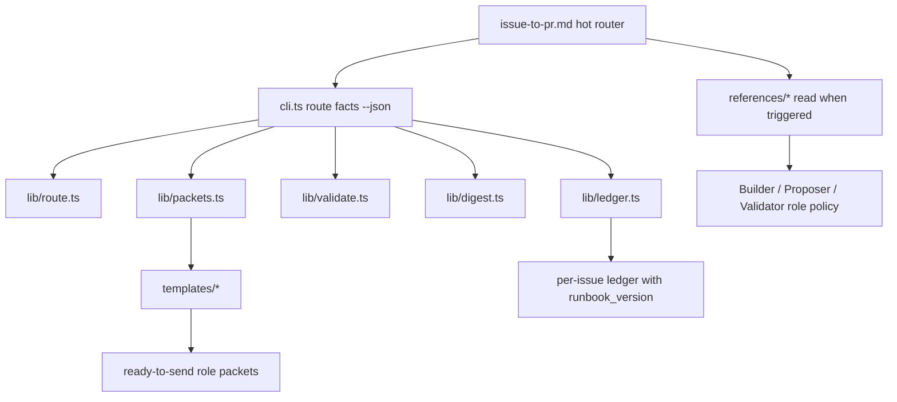
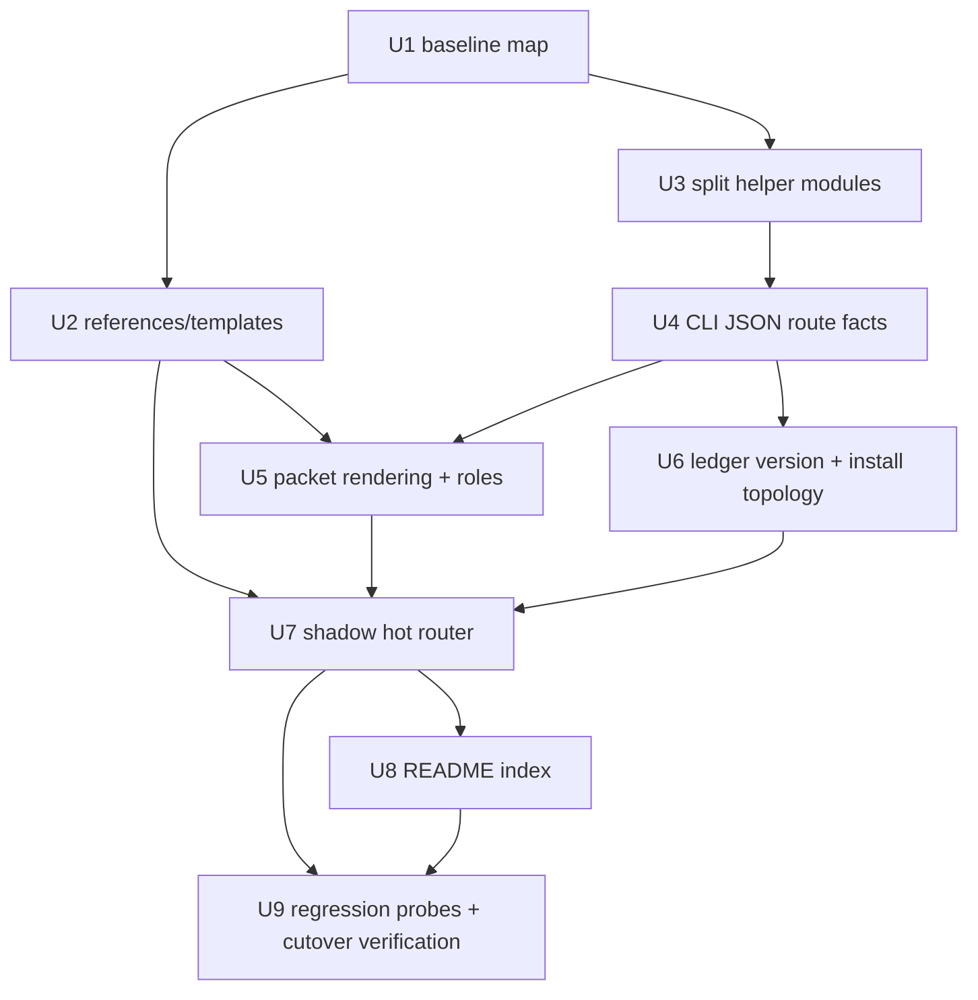

# refactor: Build Issue-to-PR v2 Runbook

## Summary

Refactor Issue-to-PR into a shadow v2 runbook that keeps the current safety model while making the active path readable: a hot router, tiered references, deterministic `cli.ts` route facts, runtime contracts in code, and templates for repeated cross-agent handoffs. Build v2 in `runbooks/issue-to-pr-v2/` while `runbooks/issue-to-pr/` remains the runnable v1 workflow and reference source. The landing shape is atomic: implementation can happen in reviewable internal units, but public invocation should cut over to the v2 folder only after the reference tree, CLI, ledger versioning, install topology, and regression coverage are ready together.

---

## Problem Frame

`runbooks/issue-to-pr/issue-to-pr.md` is now 1,313 lines and mixes stage routing, role contracts, ledger schema, helper command details, prompt payloads, final-review remediation, persona lookup tables, and fallback driver text. The audit concludes that the architecture is worth preserving, but the hot file has stopped behaving like a hot path. Keep this folder runnable as v1 and use it as the source-of-truth reference while v2 is rebuilt in a separate folder.

The v2 work should translate the accepted audit decisions into implementation slices without reopening the product decisions: Issue-to-PR v2 remains a runbook refactor, not a formal Codex skill promotion.

---

## Requirements

- R1. Keep Issue-to-PR v2 as a shadow-folder runbook refactor with atomic public cutover, not a formal skill migration or dual v1/v2 deprecation window.
- R2. Create `runbooks/issue-to-pr-v2/issue-to-pr.md` as a 400-500 line orchestration router, with core invariants, resumed-turn routing, reference-loading triggers, stage shells, and stop conditions inline.
- R3. Move detailed policy, role contracts, lookup tables, and prompt payloads into tiered `runbooks/issue-to-pr-v2/references/` and `runbooks/issue-to-pr-v2/templates/` files with visible "read when" triggers.
- R4. Keep README as a human index only: purpose, invocation, install path, file map, compatibility notes, and no duplicate workflow policy manual.
- R5. Introduce `cli.ts` as the deterministic front door that emits JSON route facts and diagnostics; the CLI must not become the Orchestrator.
- R6. Split `decompose.ts` into `lib/*` modules before adding new route, packet, diagnose, envelope-validation, or rendering modes.
- R7. Put runtime contract values in executable code such as `lib/contract.ts`, not only in prose or erased TypeScript types.
- R8. Render Builder, Proposer, Validator, patch proposal, and ce-plan packets deterministically from templates plus durable ledger state after prose chooses the role and target.
- R9. Introduce Proposer as a distinct read-only role that produces candidate batch contracts; Builder remains the committing implementation role.
- R10. Preserve ADR 0001 and ADR 0002: Orchestrator owns judgment and gates, Builder owns one scoped attempt, Validators own findings, prose orchestrates judgment, and deterministic mechanics live behind a CLI or script.
- R11. Add `runbook_version` as a workflow-contract ledger field initialized to `2`, verify the whole `runbooks/issue-to-pr-v2/` artifact tree recursively through install diagnostics, and detect installed-vs-ledger version skew before continuing a run.
- R12. Add hybrid regression coverage: a manual scenario matrix for prose-only invariants and automated probes for brittle deterministic surfaces.
- R13. Require explicit ledger evidence for overrides such as `accepted-risk`, `force-run`, or `runbook_version` mismatch continuation, including the user decision, target batch/finding/blocker, timestamp, route/reference context, and reason or accepted risk.

---

## Scope Boundaries

- Do not remove the ledger, weaken user confirmation gates, collapse Builder and Orchestrator, allow Validators to fix code, or remove helper validation.
- Do not make `cli.ts` emit imperative workflow instructions such as "dispatch Builder now" or "ask Nathan"; it emits facts and drift reports only.
- Do not promote Issue-to-PR into a formal Codex skill directory in this v2 slice.
- Do not rewrite or delete the runnable v1 folder while v2 is under construction. `runbooks/issue-to-pr/` remains the current workflow and extraction reference until final cutover.
- Do not add new dependencies unless implementation proves the existing Bun and standard-library surface is insufficient and Nathan confirms the dependency.
- Do not land a public half-v2 state where the hot runbook points at missing references, templates, CLI commands, or ledger-version behavior.
- Do not make README compete with the runbook or references for policy ownership.
- Do not use XML tags around helper-validated YAML, JSON envelopes, or Markdown references. Use tags only for prompt framing where the content has no stronger existing contract.

### Deferred to Follow-Up Work

- Formal Codex skill promotion can happen later if the repo decides Issue-to-PR should become an installed skill artifact.
- Parallel Stage 4 batch execution remains future work; v2 preserves sequential batch-loop semantics.
- CI green-up and post-PR review feedback remain outside Issue-to-PR, matching the current runbook.

---

## Context & Research

### Relevant Code and Patterns

- `runbooks/issue-to-pr/issue-to-pr.md` currently holds the live six-stage protocol, Builder dispatch contract, Stage 5 remediation workflow, persona selector, inner loop, escape hatches, ce-plan addendum, and finding closure table.
- `runbooks/issue-to-pr/README.md` currently repeats issue-shape parsing, Builder dispatch, turn protocol, fix protocol, risk classification, glossary, ledger format, and driver text. V2 should demote it to a human map.
- `runbooks/issue-to-pr/decompose.ts` already validates candidate batches, execution modes, repo-relative paths, digests, confirmation state, ledger batches, replacement batches, Builder attempts, findings data, rendered findings, and AC coverage.
- `runbooks/issue-to-pr/decompose.test.ts` is a process-boundary helper suite with coverage for decomposition, patch proposals, confirmation state, Builder attempts, replacement batches, findings, and digest invariants.
- `runbooks/issue-to-pr/issue-N-ledger.template.md` is the current durable ledger seed. The v2 folder should copy that seed, add `runbook_version`, and use shorter pointers to v2 reference docs.
- `runbooks/issue-to-pr-v2/` is the shadow target. Create v2 runbook, README, helper, CLI, modules, references, templates, tests, and regression inventory there before public cutover.
- `install.sh` currently symlinks `${CLAUDE_HOME}/runbooks` to the repo `runbooks` directory, which already supports recursive source mirroring when the symlink is healthy. V2 should still add install/status checks that make recursive reference/template presence explicit.
- Existing plans under `docs/plans/2026-05-21-*` and `docs/plans/2026-05-22-001-*` show the local plan style: repo-relative files, stable U-IDs, scoped units, and process-boundary helper tests.

### Institutional Learnings

- `CONTEXT.md` defines the durable terms `Issue-to-PR v2 runbook`, `Proposer`, and `Runbook version`; use those terms and avoid legacy skill-promotion, Builder-as-proposal-role, or release-number version language.
- `docs/adr/0001-stage-4-context-isolation.md` preserves the bounded Orchestrator, Builder, and Validator split. V2 cannot move implementation reasoning back into the Orchestrator.
- `docs/adr/0002-runbooks-and-skills-use-prose-as-orchestrator.md` provides the placement rule for v2: judgment in prose, determinism behind CLI/script, runtime contracts in code, repeated handoffs in templates, rare explanation in references, README as map.
- `docs/solutions/` does not exist in this repo, so there are no solution docs to carry forward.

### External References

- Not used. This plan is driven by repo-local audit findings, ADRs, current runbook artifacts, and existing helper/test patterns.

---

## Key Technical Decisions

- Build v2 in `runbooks/issue-to-pr-v2/` as a shadow runbook. `runbooks/issue-to-pr/` remains runnable v1 and the reference source until final cutover.
- Land public invocation as an atomic runbook cutover. Intermediate commits may be reviewable, but users should not be pointed at a hot v2 runbook that references missing v2 assets or only partially adopts v2 routing.
- Keep the v2 router in `runbooks/issue-to-pr-v2/issue-to-pr.md`, not in a separate `stage-router.md`. Resume safety is hot-path orchestration.
- Use tiered references rather than a flat one-level rule. Static lookup references stay one hop from the hot file; active orchestration references may chain one additional hop with visible triggers.
- Keep Stage 5 read-only. Final-review remediation creates patch batches and returns to Stage 4; it does not implement fixes inside Stage 5.
- Introduce Proposer for read-only candidate batch contracts. Proposer may share probe authority with Builder, but does not edit files, commit, or append Builder attempts.
- Split helper internals in the v2 folder first, then add the v2 CLI surface. The v1 `decompose.ts` remains runnable; the v2 `decompose.ts` remains a compatibility shim while v2 `cli.ts` becomes the stable deterministic front door.
- Require `--json` for every machine-consumed new CLI command. Human-readable output can exist, but the runbook should route from JSON facts.
- Treat `runbook_version` as a workflow-contract version, starting at `2`. It changes only when ledger interpretation, routing, migration, override evidence, or role packet semantics change, not for documentation edits, reference reshuffles, source commits, or added tests.
- Treat missing or old ledger `runbook_version` values as v1/unknown skew. V2 fails closed before Builder, Validator, patch, or ship work unless the operator records explicit continuation evidence.
- Keep `cli.ts state` and `cli.ts next`: `state` reports full durable state facts, while `next` reports the minimal route classification. Both emit facts, not imperatives.
- Keep route ids as stable public contracts documented in `references/ledger-and-helper.md`.
- Treat missing installed v2 references, templates, `cli.ts`, or `lib/` artifacts as diagnostic drift that blocks dispatch and packet rendering until resolved.
- Use deterministic packet rendering from `lib/packets.ts` after the prose router has selected the role and target. The CLI assembles complete ready-to-send packets from templates and durable ledger state.
- Keep override paths auditable. Any `accepted-risk`, `force-run`, or version-skew continuation needs a ledger Notes evidence row with user decision, affected batch/finding or blocker, timestamp, route/reference context, and the reason or accepted risk.
- Keep patch batches as final-review remediation units, not original AC implementation units. Patch batches keep `ac_mapping: []`, must be helper-validated, and require user confirmation before becoming confirmed Stage 4 work.
- Keep Builder, Proposer, and Validator packets deliberately narrow: Builder gets exactly one batch; Proposer gets read-only evidence for one candidate contract; Validator gets refs/ranges, touched files, selected persona, Builder evidence summaries, and envelope expectations.

### Resolved Design Details

- Old ledgers without `runbook_version` stop as v1/unknown skew. Continue under v2 only after a Notes evidence row records the operator decision, timestamp, ledger version state, runtime version, route/reference context, and accepted risk.
- `runbook_version` initial value is `2`.
- Version truth lives in `lib/contract.ts`; ledger frontmatter stores the run's version.
- Agents should call `cli.ts` in v2 hot-path instructions. Direct `decompose.ts` calls are legacy or compatibility details behind references.
- Every machine-consumed command must require `--json`; output should have a stable top-level schema.
- `cli.ts` may report `no-ledger`, but prose still owns issue setup and ledger creation.
- The installed topology remains source-owned symlinks. V2 adds recursive presence checks rather than copied installs.
- The router target remains 400-500 lines. If the hot file exceeds that without weakening safety, it must include a worked overflow explanation.
- Static lookup references stay one hop from the hot router. Active orchestration references may chain one visible additional hop.
- Stage 5 remains read-only. Final P0/P1 remediation routes to Proposer and confirmed Stage 4 patch batches.
- Proposer may run read-only probes, but it cannot edit files, commit, append Builder attempts, or mutate the ledger.
- Helper validation plus user confirmation authorizes a patch batch. Proposer, Builder, or Validator output alone never authorizes it.
- Patch proposal batches remain limited to at most two files, matching the existing helper contract.
- `accepted-risk` evidence must name the user decision, target batch or finding, timestamp, route/reference context, and reason.
- `force-run` evidence must name the issue blockers, override source, timestamp, and route/reference context.
- Version-skew override evidence must name the ledger version, runtime version, operator decision, timestamp, and accepted risk.
- Packet rendering runs only after prose selects an explicit role and target; the CLI must not decide dispatch.
- Builder packets include one batch, allowed files, compact attempts, relevant findings and Notes summaries, local law, and the output contract. They exclude the full plan, full ledger, unrelated batches, and raw Validator envelopes.
- Validator packets include commit refs or ranges, touched files, batch contract, Builder evidence summaries, selected persona, and envelope expectations.
- No new ADR is needed for this v2 plan. ADR 0001 and ADR 0002 already cover the hard-to-reverse trade-offs; this plan implements them.

---

## Open Questions

### Resolved During Planning

- Should v2 be a Codex skill promotion? No. The audit and glossary settle this as a runbook refactor.
- Should v2 be rebuilt in place? No. Build v2 in `runbooks/issue-to-pr-v2/` so v1 remains runnable and available as the extraction reference.
- Should v2 support a dual v1/v2 ledger window? No. Use atomic cutover and require v1 ledgers to be drained or explicitly blocked before v2 runs continue.
- Should Stage 5 own patch implementation? No. Stage 5 is a read-only final-review gate; patch remediation returns to Stage 4 through confirmed patch batches.
- Should the read-only proposal role remain a Builder status? No. The role is Proposer, with its own read-only envelope and candidate batch output.
- Should CLI route commands emit imperative workflow prose? No. They emit route facts, required reference ids, drift, and blocking gates. The prose runbook decides what to do.
- Should README keep detailed policy? No. README becomes a human index and compatibility map.
- What is the initial `runbook_version`? Use `2`.
- What happens to old ledgers without `runbook_version`? They fail closed as v1/unknown skew unless explicit continuation evidence is recorded.
- Should `cli.ts state` and `cli.ts next` both exist? Yes. `state` reports full durable facts; `next` reports minimal route classification.
- Should route ids be stable public contracts? Yes. Document them in `references/ledger-and-helper.md`.
- Should missing installed v2 artifacts be warnings? No. Missing references, templates, `cli.ts`, or `lib/` are diagnostic drift that blocks dispatch and packet rendering.
- Should Proposer share Builder probe authority? Only for read-only probes. Proposer cannot edit, commit, append Builder attempts, or mutate the ledger.
- Should an ADR be added for the v2 cutover? No. ADR 0001 and ADR 0002 already cover the architectural decision record; v2 is their implementation.

### Deferred to Implementation

- Exact JSON schemas for each CLI command. The plan defines command families, `--json` requirement, stable top-level schema expectation, and required semantics; implementation should keep schemas small and stable.
- Exact split between `decompose.ts` compatibility tests and new `lib/*.test.ts` files. The module boundaries should follow implementation reality while respecting the per-file test-size cap.
- Exact wording of extracted references and templates. The first extraction should preserve semantics, then the hot file rewrite can compact language.
- Exact automated probe harness shape. It can be Bun tests, a focused script, or both, as long as it exercises installed artifact presence, route facts, version skew, and startup routing.

---

## Output Structure

The expected source shape is a shadow v2 folder beside the current v1 folder:

```text
runbooks/issue-to-pr/
  # Current runnable v1 workflow and extraction reference.
  README.md
  issue-to-pr.md
  decompose.ts
  decompose.test.ts
  issue-N-ledger.template.md

runbooks/issue-to-pr-v2/
  README.md
  issue-to-pr.md
  cli.ts
  decompose.ts
  decompose.test.ts
  issue-N-ledger.template.md
  lib/
    contract.ts
    contract.test.ts
    digest.ts
    digest.test.ts
    ledger.ts
    ledger.test.ts
    packets.ts
    packets.test.ts
    route.ts
    route.test.ts
    validate.ts
    validate.test.ts
  references/
    builder-dispatch.md
    findings-and-validators.md
    host-adapters.md
    ledger-and-helper.md
    regression-matrix.md
    stage-1-pick-issue.md
    stage-2-plan.md
    stage-3-decompose.md
    stage-4-batch-loop.md
    stage-5-final-review.md
    stage-6-ship.md
  templates/
    builder-return-envelope.md
    builder-work-packet.md
    ce-plan-addendum.md
    patch-proposal.md
    proposer-envelope.md
    validator-envelope.md
```

The tree is a scope declaration, not a hard implementation constraint. If implementation discovers a tighter split, keep the same ownership model and update this plan before or alongside the change.

---

## High-Level Technical Design

> *This illustrates the intended approach and is directional guidance for review, not implementation specification. The implementing agent should treat it as context, not code to reproduce.*



`runbooks/issue-to-pr-v2/issue-to-pr.md` decides which stage or role is next. `cli.ts` reports deterministic facts: confirmation state, drift, route id, required reference ids, schema slices, packet render outputs, findings gates, and diagnostics. References explain the policy loaded for that moment. Templates provide the repeated prompt/envelope shapes. The v1 folder remains runnable until the final cutover points public invocation at the v2 folder.

---

## Implementation Units



### U1. Freeze Current Contracts and Regression Inventory

**Goal:** Create the behavior-preservation map that prevents v2 extraction from losing current safety rules.

**Requirements:** R1, R10, R12

**Dependencies:** None

**Files:**
- Create: `runbooks/issue-to-pr-v2/references/regression-matrix.md`
- Modify: `docs/plans/2026-05-22-002-refactor-issue-to-pr-v2-runbook-plan.md` if implementation discovers missing in-scope invariants

**Approach:**
- Build a line-map from current v1 `runbooks/issue-to-pr/issue-to-pr.md`, `README.md`, `issue-N-ledger.template.md`, and `decompose.ts` command modes to their shadow v2 destinations.
- Enumerate the audit's prose-only invariants in `runbooks/issue-to-pr-v2/references/regression-matrix.md`: Local Law Read Order, Mechanic Discipline, Public Contract Rule, Domain Language Rule, Preflight Checklist, Probe Catalog, final-review patch decision tree, smallest contract patch heuristic, mechanical-diff fallback, broad-reviewer fallback, selector precedence, and host-readiness versus infrastructure-failure boundary.
- Add manual v1/v2 scenario rows that say what evidence proves the invariant survived.
- Identify deterministic probe targets for later units: installed reference/template presence, `runbook_version` mismatch, `cli.ts state --json`, `cli.ts diagnose --json`, and startup route behavior.
- Do not change the public hot runbook in this unit.

**Execution note:** Characterization-first. Capture the current contract inventory before moving text.

**Patterns to follow:**
- Audit sections "Progressive Disclosure Split Plan", "Regression matrix", and "Acceptance Criteria For A Successful V2".
- Current helper process-boundary test style in `runbooks/issue-to-pr/decompose.test.ts`.

**Test scenarios:**
- Happy path: every current major runbook section has one or more qualified planned v2 destinations, or an explicit removal reason.
- Edge case: each prose-only invariant has a manual scenario row for both v1 source behavior and v2 expected behavior.
- Integration: deterministic probe targets map to either a current helper behavior or a planned `cli.ts` command family.

**Verification:**
- A reviewer can trace every safety-critical current section to a v2 home before any public cutover.
- `runbooks/issue-to-pr-v2/references/regression-matrix.md` names the manual and automated coverage expected before v2 ships.

### U2. Create Shadow V2 References and Templates Without Public Cutover

**Goal:** Add the v2 reference and template tree as internal assets while preserving current runbook behavior.

**Requirements:** R2, R3, R8, R9, R10

**Dependencies:** U1

**Files:**
- Create: `runbooks/issue-to-pr-v2/references/stage-1-pick-issue.md`
- Create: `runbooks/issue-to-pr-v2/references/stage-2-plan.md`
- Create: `runbooks/issue-to-pr-v2/references/stage-3-decompose.md`
- Create: `runbooks/issue-to-pr-v2/references/stage-4-batch-loop.md`
- Create: `runbooks/issue-to-pr-v2/references/stage-5-final-review.md`
- Create: `runbooks/issue-to-pr-v2/references/stage-6-ship.md`
- Create: `runbooks/issue-to-pr-v2/references/builder-dispatch.md`
- Create: `runbooks/issue-to-pr-v2/references/findings-and-validators.md`
- Create: `runbooks/issue-to-pr-v2/references/ledger-and-helper.md`
- Create: `runbooks/issue-to-pr-v2/references/host-adapters.md`
- Create: `runbooks/issue-to-pr-v2/templates/ce-plan-addendum.md`
- Create: `runbooks/issue-to-pr-v2/templates/builder-work-packet.md`
- Create: `runbooks/issue-to-pr-v2/templates/builder-return-envelope.md`
- Create: `runbooks/issue-to-pr-v2/templates/validator-envelope.md`
- Create: `runbooks/issue-to-pr-v2/templates/proposer-envelope.md`
- Create: `runbooks/issue-to-pr-v2/templates/patch-proposal.md`

**Approach:**
- Extract content mostly verbatim at first so behavior does not drift during the move.
- Put "read when" triggers at the top of each reference.
- Merge tightly coupled material rather than creating a large file swarm: Builder and Proposer in `builder-dispatch.md`; persona selection, finding lifecycle, validator envelopes, and escape hatches in `findings-and-validators.md`; ledger and helper command ownership in `ledger-and-helper.md`.
- Move final-review patch-batch remediation into `stage-4-batch-loop.md`; keep `stage-5-final-review.md` as a read-only review gate.
- Use `Proposer` consistently for read-only candidate patch batch generation.
- Use selective XML tags in prompt templates only for framing prose such as `<contract>`, `<allowed_files>`, `<target_finding>`, `<local_law_read_order>`, and `<output_contract>`.
- Keep helper-validated YAML and JSON examples fenced, not XML-wrapped.
- Do not yet rewrite the v1 `runbooks/issue-to-pr/issue-to-pr.md` or point public invocation at these files.

**Patterns to follow:**
- Existing wording in `runbooks/issue-to-pr/issue-to-pr.md`.
- `CONTEXT.md` terms `Issue-to-PR v2 runbook` and `Proposer`.
- ADR 0002's placement rule.

**Test scenarios:**
- Happy path: each reference starts with a load trigger and links only one additional hop at most when it is an active orchestration reference.
- Edge case: static lookup references do not chain deeper.
- Edge case: Stage 5 reference contains no Builder implementation path; it routes patch work back to Stage 4.
- Error path: a template cannot be mistaken as authority to edit files before a ledger-confirmed batch exists.
- Integration: Builder, Proposer, and Validator templates each preserve role boundaries and output contracts.

**Verification:**
- Search confirms legacy Builder-as-proposal-role language is not introduced in new v2 artifacts.
- A reviewer can load only `builder-dispatch.md` plus its template and understand Builder versus Proposer authority without reading the full runbook.

### U3. Build V2 Helper Internals Behind a Compatibility Surface

**Goal:** Recreate the current deterministic helper behavior in the shadow v2 folder, then move logic into modules without changing observable command behavior.

**Requirements:** R5, R6, R7, R10

**Dependencies:** U1

**Files:**
- Create: `runbooks/issue-to-pr-v2/decompose.ts`
- Create: `runbooks/issue-to-pr-v2/decompose.test.ts`
- Create: `runbooks/issue-to-pr-v2/lib/contract.ts`
- Create: `runbooks/issue-to-pr-v2/lib/contract.test.ts`
- Create: `runbooks/issue-to-pr-v2/lib/digest.ts`
- Create: `runbooks/issue-to-pr-v2/lib/digest.test.ts`
- Create: `runbooks/issue-to-pr-v2/lib/ledger.ts`
- Create: `runbooks/issue-to-pr-v2/lib/ledger.test.ts`
- Create: `runbooks/issue-to-pr-v2/lib/validate.ts`
- Create: `runbooks/issue-to-pr-v2/lib/validate.test.ts`

**Approach:**
- Move runtime constants, allowed statuses, schema keys, guardrail prefixes, command metadata, and version constants to `lib/contract.ts`.
- Move digest payload construction and hashing to `lib/digest.ts`.
- Move frontmatter, fenced YAML, ledger row parsing, commit reachability, and cross-document ledger integrity to `lib/ledger.ts`.
- Move batch, patch proposal, AC coverage, findings, Builder attempt, and supersedes validation to `lib/validate.ts`.
- Keep `runbooks/issue-to-pr-v2/decompose.ts` as the compatibility entrypoint for all current flags while importing the new modules. Do not modify v1 `decompose.ts` unless a critical discovered bug is explicitly approved.
- Preserve current stdout, stderr, exit codes, and helper argument behavior unless the implementation uncovers an existing bug that must be deliberately handled.
- Keep each new module and test file below the audit's 1,500-line target where practical.

**Execution note:** Characterization-first. The existing process-boundary suite should pass before and after each moved slice.

**Patterns to follow:**
- Existing strict parser and process-boundary tests in `decompose.test.ts`.
- Existing constants around execution modes, confirmation states, batch statuses, finding statuses, and guardrail prefixes.

**Test scenarios:**
- Happy path: all existing `decompose.ts` modes keep their current observable behavior through the compatibility entrypoint.
- Edge case: candidate batch digest remains unchanged when lifecycle-only ledger fields change.
- Edge case: replacement batch, Builder attempt, and findings validation still use reachable commits from the active git repo.
- Error path: malformed usage still returns the existing usage failure shape.
- Integration: module tests cover exported runtime contract values and parser/validator helpers without relying only on the top-level process suite.

**Verification:**
- Current helper regression coverage passes through the v2 `decompose.ts` compatibility entrypoint and is compared against the v1 baseline where useful.
- New module tests prove the split did not turn runtime contract values into type-only declarations.

### U4. Add `cli.ts` JSON Front Door for Routing and Diagnostics

**Goal:** Create the v2 deterministic front door that the hot runbook will call for route facts, contract slices, and diagnostics.

**Requirements:** R5, R6, R7, R10, R11, R12

**Dependencies:** U3

**Files:**
- Create: `runbooks/issue-to-pr-v2/cli.ts`
- Create: `runbooks/issue-to-pr-v2/cli.test.ts`
- Create: `runbooks/issue-to-pr-v2/lib/route.ts`
- Create: `runbooks/issue-to-pr-v2/lib/route.test.ts`
- Modify: `runbooks/issue-to-pr-v2/references/ledger-and-helper.md`
- Modify: `runbooks/issue-to-pr-v2/references/regression-matrix.md`

**Approach:**
- Add `cli.ts` as a thin command dispatcher over `lib/*`.
- Require `--json` for every machine-consumed new command. At minimum:
  - `state <ledger> --json`: confirmation state, digest drift, version skew, current route facts, required reference ids, and blocking gates.
  - `next <ledger> --json`: same route facts with the minimal next route id, but no imperative instructions.
  - `contract <slice> --json`: runtime schema/status slices from `lib/contract.ts`.
  - `diagnose <ledger> --json`: inferred state, expected reference, installed artifact presence, drift, findings-table drift, and version skew.
- Keep route ids deterministic and documented in `ledger-and-helper.md`.
- Do not remove existing v2 `decompose.ts` compatibility flags in this unit. V1 remains untouched and runnable.
- Ensure CLI output uses stable top-level schemas and avoids prose parsing by agents.
- Preserve target-repo-root behavior for git-bound validations.

**Execution note:** Add the failing JSON schema/route tests before wiring the command output.

**Patterns to follow:**
- Existing `--confirmation-state`, digest, ledger validation, and findings validation behavior.
- ADR 0002's "CLI emits facts, not orchestration" boundary.

**Test scenarios:**
- Happy path: `state <ledger> --json` reports confirmed ACs, confirmed batch contract, confirmed digests, current route id, and required reference ids for a healthy Stage 4 ledger.
- Happy path: `diagnose <ledger> --json` reports no drift when ledger sections, findings table, installed files, and version match.
- Edge case: stale plan, AC, or batch digest produces route facts that point back to Stage 3.
- Edge case: no ledger produces a no-ledger route fact without pretending the CLI can choose the issue.
- Error path: ledger `runbook_version` mismatch reports version skew and a stop-required fact.
- Error path: missing installed reference/template presence is diagnostic drift, not a silently ignored warning.
- Integration: every machine-consumed command requires `--json` and has a stable top-level schema.

**Verification:**
- `cli.ts` is the only v2 deterministic command surface named by the v2 hot path.
- `references/ledger-and-helper.md` maps each CLI command to the invariant it owns.

### U5. Implement Deterministic Packet Rendering and Envelope Boundaries

**Goal:** Render complete role packets from templates and ledger state so the Orchestrator does not reconstruct prompts from prose.

**Requirements:** R3, R8, R9, R10, R13

**Dependencies:** U2, U4

**Files:**
- Create: `runbooks/issue-to-pr-v2/lib/packets.ts`
- Create: `runbooks/issue-to-pr-v2/lib/packets.test.ts`
- Modify: `runbooks/issue-to-pr-v2/cli.ts`
- Modify: `runbooks/issue-to-pr-v2/cli.test.ts`
- Modify: `runbooks/issue-to-pr-v2/templates/builder-work-packet.md`
- Modify: `runbooks/issue-to-pr-v2/templates/builder-return-envelope.md`
- Modify: `runbooks/issue-to-pr-v2/templates/proposer-envelope.md`
- Modify: `runbooks/issue-to-pr-v2/templates/validator-envelope.md`
- Modify: `runbooks/issue-to-pr-v2/templates/patch-proposal.md`
- Modify: `runbooks/issue-to-pr-v2/templates/ce-plan-addendum.md`
- Modify: `runbooks/issue-to-pr-v2/references/builder-dispatch.md`
- Modify: `runbooks/issue-to-pr-v2/references/findings-and-validators.md`

**Approach:**
- Add `lib/packets.ts` to render Builder, Proposer, Validator, patch proposal, and ce-plan packets from templates plus ledger state.
- Add CLI commands for packet rendering only after the prose-selected role and target are explicit, such as `packet builder --batch <id> --ledger <path> --json` and `packet proposer --finding <id> --ledger <path> --json`.
- Validate that Builder packets include only batch-local state, current iteration, compact prior attempts, batch findings, relevant notes, allowed files, local law read order, and output contract.
- Validate that Proposer packets are read-only and return candidate patch batch contracts, not Builder attempt envelopes.
- Validate that Validator packets are read-only and include commit refs/ranges, touched file names, batch contract, Builder evidence, and exact envelope expectations.
- Add minimal dispatch evidence shape for ledger Notes: timestamp, role, batch or finding id, loaded references/templates, and CLI route id.
- Keep packet rendering deterministic; prose decides when a packet is allowed.

**Execution note:** Test-first for packet boundaries, because context leaks are the central risk.

**Patterns to follow:**
- Current Builder Work Packet include/exclude rules.
- Audit XML granularity correction.
- ADR 0001 Validator handoff boundary.

**Test scenarios:**
- Happy path: Builder packet for an implementation attempt includes exactly one batch contract and allowed files, and excludes full plan, unrelated batches, raw Validator envelopes, and full ledger content.
- Happy path: repair Builder packet includes exactly one committed open P0/P1 target finding signature.
- Happy path: Proposer packet is read-only and has no commit or Builder attempt fields.
- Happy path: Validator packet includes diff refs, touched files, selected persona, Builder evidence summaries, and envelope contract.
- Edge case: templates can include XML framing around natural-language contract sections while keeping YAML and JSON fenced.
- Error path: missing target batch or finding fails before rendering a packet.
- Error path: attempted packet rendering under stale digests reports the stale route fact instead of producing a packet.
- Integration: dispatch evidence rows can be appended to Notes without copying full packets.

**Verification:**
- Packet tests prove the v2 templates preserve role boundaries and do not leak unrelated context.
- `references/builder-dispatch.md` clearly separates Builder from Proposer.

### U6. Add Ledger Versioning and Recursive Install Topology Checks

**Goal:** Make installed v2 artifacts and ledger interpretation explicit so resumed runs can detect version skew safely.

**Requirements:** R1, R11, R13

**Dependencies:** U4

**Files:**
- Create: `runbooks/issue-to-pr-v2/issue-N-ledger.template.md`
- Modify: `runbooks/issue-to-pr-v2/lib/contract.ts`
- Modify: `runbooks/issue-to-pr-v2/lib/ledger.ts`
- Modify: `runbooks/issue-to-pr-v2/lib/ledger.test.ts`
- Modify: `runbooks/issue-to-pr-v2/cli.ts`
- Modify: `runbooks/issue-to-pr-v2/cli.test.ts`
- Modify: `runbooks/issue-to-pr-v2/references/ledger-and-helper.md`
- Modify: `runbooks/issue-to-pr-v2/references/host-adapters.md`
- Modify: `install.sh`

**Approach:**
- Add `runbook_version: 2` to ledger frontmatter and runtime contract values.
- Make `cli.ts state` and `diagnose` compare ledger `runbook_version` with the installed/source v2 contract version.
- Treat missing, old, or mismatched `runbook_version` as a stop-required route fact unless explicit override evidence exists in Notes.
- Update ledger template prose so `runbook_version` is a workflow-contract version, not a date, release number, source revision, documentation version, or commit SHA.
- Add install/status checks that verify `runbooks/issue-to-pr-v2/references/`, `templates/`, `cli.ts`, and `lib/` are present through the installed runbook path.
- Preserve the existing source-owned symlink topology; do not create a separate installed copy.
- Document atomic migration semantics: drain old ledgers under v1, start a fresh v2 ledger, or continue under v2 only after recording explicit operator decision evidence with old/missing version state, current runtime version, timestamp, route/reference context, and accepted risk.

**Patterns to follow:**
- Existing `install.sh --status` symlink checks.
- Existing ledger frontmatter confirmation-state fields.
- Audit "Install topology and migration semantics" section.

**Test scenarios:**
- Happy path: new ledger template includes `runbook_version: 2` matching `lib/contract.ts`.
- Happy path: `state <ledger> --json` reports no version skew for a matching v2 ledger.
- Edge case: missing `runbook_version` in an old ledger reports v1/unknown skew and stop-required routing.
- Edge case: installed path missing `references/` or `templates/` is reported by diagnostics.
- Error path: missing, old, or mismatched version without override evidence blocks route progression.
- Integration: `install.sh --status` reports the recursive Issue-to-PR runbook artifact presence without mutating files.

**Verification:**
- A resumed agent can detect that the installed runbook and ledger contract version disagree before Builder or ship work continues.
- Install status makes missing v2 references/templates obvious.

### U7. Create the Shadow V2 Hot Router

**Goal:** Create the concise v2 router in the shadow folder while leaving the runnable v1 hot file available as reference.

**Requirements:** R1, R2, R3, R5, R8, R9, R10, R11, R13

**Dependencies:** U2, U4, U5, U6

**Files:**
- Create: `runbooks/issue-to-pr-v2/issue-to-pr.md`
- Modify: `runbooks/issue-to-pr-v2/references/stage-1-pick-issue.md`
- Modify: `runbooks/issue-to-pr-v2/references/stage-2-plan.md`
- Modify: `runbooks/issue-to-pr-v2/references/stage-3-decompose.md`
- Modify: `runbooks/issue-to-pr-v2/references/stage-4-batch-loop.md`
- Modify: `runbooks/issue-to-pr-v2/references/stage-5-final-review.md`
- Modify: `runbooks/issue-to-pr-v2/references/stage-6-ship.md`
- Modify: `runbooks/issue-to-pr-v2/references/ledger-and-helper.md`
- Modify: `runbooks/issue-to-pr-v2/templates/ce-plan-addendum.md`

**Approach:**
- Put one-paragraph purpose, ledger location, core invariants, and reference-loading table at the top.
- Make "start every turn" the first executable block: read ledger when it exists, run `cli.ts state <ledger> --json`, route from durable state, load the required reference, execute one visible action, checkpoint durable state, and echo state.
- Enumerate the router state space from the audit, including no-ledger, AC pending/stale, plan missing, batch pending/stale/blocked, digest stale, eligible batch, in-progress batch, no pending batches, final P0/P1 open, final reviewed, shipped, replacement-batch active, and blocked.
- Keep exact stop-and-ask conditions inline.
- Keep only hatch names inline; detailed hatch behavior lives in `findings-and-validators.md`.
- Keep stage shells short: inputs, required reference, CLI facts, action summary, exit condition, stop conditions.
- Keep Stage 5 read-only and route patch batches back to Stage 4.
- Use `cli.ts` command names and expected facts in the hot file, not internal helper implementation details.
- If the hot file cannot fit 400-500 lines without weakening safety invariants, add a worked enumeration explaining the overflow instead of cutting invariants.

**Execution note:** Change-first for shadow v2 prose after U1-U6 have created the safety net; verify through regression matrix and probes before treating it as ready. Do not rewrite `runbooks/issue-to-pr/issue-to-pr.md` in this unit.

**Patterns to follow:**
- Audit "Proposed Hot Path Skeleton" and "Proposed State Router".
- ADR 0001 and ADR 0002.
- Existing stage names and ledger vocabulary.

**Test scenarios:**
- Happy path: a resumed run can determine the next legal action from ledger state plus `cli.ts state --json` without reading Builder or final-review patch details.
- Happy path: Stage 2 references the ce-plan addendum template instead of inlining it.
- Happy path: Stage 4 references Builder dispatch, Stage 4 batch loop, and findings/validators only when those roles are active.
- Edge case: stale digest state always routes to Stage 3 before Builder or ship.
- Edge case: version skew stops before any stage work and requires explicit operator decision evidence.
- Error path: missing required reference/template is diagnosed before dispatch.
- Integration: Stage 5 final-review P0/P1 routes to Proposer and Stage 4 patch batches rather than Orchestrator implementation.

**Verification:**
- `runbooks/issue-to-pr-v2/issue-to-pr.md` is within 400-500 lines, or includes the required worked overflow enumeration.
- Every reference link in the hot file has a "read when" trigger.
- The first non-read operation in a resumed run is designed to be `cli.ts state <ledger> --json`.

### U8. Create the V2 README as a Human Index

**Goal:** Create a v2 README that maps to the shadow runbook, references, templates, helper, and install contract without competing with v1.

**Requirements:** R4, R11

**Dependencies:** U7

**Files:**
- Create: `runbooks/issue-to-pr-v2/README.md`
- Modify: `runbooks/issue-to-pr-v2/references/ledger-and-helper.md`
- Modify: `runbooks/issue-to-pr-v2/references/host-adapters.md`

**Approach:**
- Keep purpose, installed path, invocation examples, driver compatibility, file map, and "what this area deliberately does not do".
- Replace detailed issue parsing, Builder dispatch, turn protocol, fix protocol, risk classification, glossary, and ledger schema policy with pointers to `issue-to-pr.md` or the relevant references.
- Keep helper execution context and installed source mirroring concise.
- Add a compact file map that names `cli.ts`, `decompose.ts` compatibility, `lib/*`, `references/*`, and `templates/*`.
- Keep README wording human-readable; it should help a maintainer find the right file, not instruct the agent through the workflow.

**Patterns to follow:**
- ADR 0002 README placement rule.
- Existing README invocation clarity.

**Test scenarios:**
- Happy path: a human can find how to invoke Issue-to-PR and where per-issue ledgers live.
- Edge case: README does not define detailed Builder dispatch policy or finding lifecycle semantics.
- Edge case: README does not repeat ledger schema fields that `ledger-and-helper.md`, template, and CLI own.
- Integration: README links to the v2 hot runbook and references without becoming a competing source of truth.

**Verification:**
- Search confirms v2 README does not duplicate full policy blocks from the v2 hot router or references.
- A reviewer can tell which artifact owns invocation, orchestration, deterministic commands, runtime contracts, templates, and policy references.

### U9. Add Hybrid Regression Probes and Final Public Cutover Verification

**Goal:** Prove v2 preserves current safety behavior across manual prose scenarios and automated deterministic checks.

**Requirements:** R1, R10, R11, R12, R13

**Dependencies:** U7, U8

**Files:**
- Modify: `runbooks/issue-to-pr-v2/references/regression-matrix.md`
- Create: `runbooks/issue-to-pr-v2/v2-regression.test.ts`
- Modify: `runbooks/issue-to-pr-v2/cli.test.ts`
- Modify: `runbooks/issue-to-pr-v2/decompose.test.ts`
- Modify: `runbooks/issue-to-pr-v2/lib/route.test.ts`
- Modify: `runbooks/issue-to-pr-v2/lib/packets.test.ts`
- Modify: `runbooks/issue-to-pr-v2/README.md`
- Modify: `runbooks/issue-to-pr/README.md` only to add a legacy/v1 pointer if public invocation now points at v2

**Approach:**
- Complete the manual scenario matrix for the twelve prose-only invariants and record the expected v1 source and v2 destination behavior.
- Add automated probes for:
  - installed artifact presence for `references/`, `templates/`, `cli.ts`, and `lib/`;
  - `runbook_version` match, missing, and mismatch behavior;
  - `cli.ts state <ledger> --json` schema and key route ids;
  - `cli.ts next <ledger> --json` minimal route classification and no-imperative-output behavior;
  - `cli.ts diagnose <ledger> --json` drift reporting;
  - packet rendering excludes full plan, full ledger, unrelated batches, and raw Validator envelopes;
  - startup route behavior can be checked by a synthetic harness or documented as a manual probe if tool-level tracing is not practical.
- Run the full helper/CLI test surface before public invocation points at v2.
- Public cutover means updating invocation/install/readme pointers to the v2 folder while leaving `runbooks/issue-to-pr/` available as the frozen v1 reference.
- Run markdown link and text-search checks for stale v1 terminology and missing read triggers.
- Record any unverifiable manual probes as explicit residual risk in `regression-matrix.md`, not as silent confidence.

**Execution note:** Proof-first. Add probes for the brittle deterministic surfaces before declaring the router rewrite complete.

**Patterns to follow:**
- Existing Bun test harness around `runDecompose`.
- Audit's acceptance criteria and regression matrix requirements.

**Test scenarios:**
- Happy path: all deterministic probes pass with a matching v2 ledger and installed artifact tree.
- Happy path: manual matrix shows every prose-only invariant has a v2 reference or hot-path owner.
- Edge case: missing installed template fails diagnostics before packet rendering.
- Edge case: old ledger without `runbook_version` reports stop-required version skew.
- Error path: route facts never instruct the agent to dispatch or ask; they only name state, route id, required reference, and blockers.
- Integration: packet rendering and route facts work together without reading unrelated plan or ledger content.

**Verification:**
- Regression matrix is complete enough for a reviewer to compare v1 and v2 behavior.
- Automated probes cover the deterministic surfaces that are easiest to break during future edits.
- V2 cutover is ready for human review without deleting or rewriting the v1 reference folder.

---

## System-Wide Impact

- **Interaction graph:** The public v2 workflow shifts from one large Markdown file to a shadow hot router plus references, templates, CLI, modules, and ledger versioning. The Orchestrator still owns judgment and durable gates.
- **Error propagation:** Version skew, digest drift, findings-table drift, missing installed artifacts, malformed packets, and stale route states become explicit CLI facts. The runbook decides when to stop for Nathan.
- **State lifecycle risks:** `runbook_version` introduces migration state. Old ledgers must not silently continue under v2 semantics.
- **API surface parity:** V2 `decompose.ts` compatibility flags remain during migration, while v2 `cli.ts --json` becomes the agent-facing surface. V1 remains runnable as the reference baseline.
- **Integration coverage:** Process-boundary tests should keep proving helper behavior; new CLI and packet tests prove deterministic v2 surfaces; the manual regression matrix covers judgment-heavy prose invariants.
- **Unchanged invariants:** AC confirmation, batch contract confirmation, digest re-checks, Builder file authority, Validator-owned findings, P0/P1 gates, clean-tree stage transitions, and explicit user override gates remain mandatory.

---

## Risks & Dependencies

| Risk | Mitigation |
|------|------------|
| Extraction hides critical safety rules | Keep core invariants inline, add read triggers beside each branch, and require the U1 line-map before public cutover. |
| V2 relocates bloat instead of reducing load | Merge related references, keep README as a map, and cap active orchestration chains at one additional hop. |
| `decompose.ts` split changes helper behavior | Use characterization-first module extraction and keep the existing process-boundary suite passing through the compatibility shim. |
| CLI starts orchestrating instead of reporting facts | Test route output schemas for facts only and keep decisions in the hot runbook. |
| Packet rendering leaks too much context | Add packet tests that reject full plan, full ledger, unrelated batches, and raw Validator envelopes. |
| Installed runbook misses new references/templates | Add install/status diagnostics and automated artifact-presence probes. |
| In-flight v1 ledgers resume under v2 accidentally | Add `runbook_version`, stop-required version-skew route facts, and explicit override evidence requirements. |
| README remains a second policy manual | U8 removes duplicate policy and links to owned references instead. |
| Manual prose invariants regress because tests cannot execute judgment | Maintain `runbooks/issue-to-pr-v2/references/regression-matrix.md` with explicit v1/v2 manual scenarios and residual risk notes. |

---

## Documentation / Operational Notes

- This is a single atomic v2 runbook cutover from an operator perspective, even if implementation commits are split by unit.
- The useful review order is: U1 line-map and regression matrix, U2 shadow references/templates, U3 shadow helper split, U4-U5 v2 CLI and packet surfaces, U6 version/install, U7 shadow hot router, U8 v2 README, U9 regression proof and public cutover verification.
- Verification should prefer MCP runners where available for focused Bun tests, TypeScript checks, and Biome lint/format checks. Shell fallback is appropriate only when the runner cannot target the runbook helper surface.
- Before merge, reviewers should inspect the hot-path line budget and the regression matrix together. If the file exceeds 500 lines, the overflow enumeration must explain which safety invariants stayed hot.
- No branch, commit, staging, push, or PR action is part of this plan generation step.

---

## Verification Command Families

The implementing agent should choose the repo-appropriate runner, preferring MCP runners with JSON output when available:

- Focused Bun tests for `runbooks/issue-to-pr-v2/decompose.test.ts`, `runbooks/issue-to-pr-v2/cli.test.ts`, `runbooks/issue-to-pr-v2/v2-regression.test.ts`, and new `runbooks/issue-to-pr-v2/lib/*.test.ts`.
- TypeScript no-emit checks for the runbook helper and scripts.
- Biome lint/format checks for TypeScript and Markdown changes.
- Markdown/text probes for stale v1 terminology, missing `read when` triggers, missing template/reference links, and README policy duplication.
- A lightweight install-status diagnostic check that proves the installed runbook path exposes `references/`, `templates/`, `cli.ts`, and `lib/`.

---

## Acceptance Criteria

- `runbooks/issue-to-pr-v2/issue-to-pr.md` is a 400-500 line hot router, or includes a worked enumeration justifying any overflow.
- Every v2 reference is linked from the hot file or one active parent reference, with visible load triggers.
- `runbooks/issue-to-pr-v2/README.md` is a human index and no longer repeats detailed workflow policy.
- `cli.ts` is the deterministic front door for new machine-consumed commands, with `--json` fixed schemas.
- `cli.ts state` and `cli.ts next` emit route facts and drift, not imperative workflow instructions.
- Runtime contract values live in `lib/contract.ts` or equivalent runtime data used by CLI validators.
- `runbooks/issue-to-pr-v2/decompose.ts` remains as a compatibility shim during migration rather than absorbing new v2 modes. The v1 helper remains runnable as the extraction baseline.
- `lib/packets.ts` renders complete role packets from templates and durable ledger state after prose selects the role and target.
- Proposer is represented as a distinct read-only role with its own envelope and candidate batch output.
- `runbook_version` is present in ledger frontmatter and version skew is a stop-required route fact.
- Install/status diagnostics prove recursive v2 artifact presence.
- Hybrid regression coverage exists for all twelve audit-named prose-only invariants plus automated probes for brittle deterministic surfaces.
- Override paths require explicit ledger evidence.
- No ADR 0001 or ADR 0002 invariant is weakened.
- `runbooks/issue-to-pr/` remains available as the v1 reference folder after public invocation cuts over to v2.

---

## Sources & References

- **Origin audit:** [docs/review/2026-05-22-issue-to-pr-skill-v2-audit.md](../review/2026-05-22-issue-to-pr-skill-v2-audit.md)
- **Adversarial audit pass:** [docs/review/2026-05-22-issue-to-pr-skill-v2-audit-adversarial-pass.md](../review/2026-05-22-issue-to-pr-skill-v2-audit-adversarial-pass.md)
- **Domain glossary:** `CONTEXT.md`
- **ADR:** `docs/adr/0001-stage-4-context-isolation.md`
- **ADR:** `docs/adr/0002-runbooks-and-skills-use-prose-as-orchestrator.md`
- **Current runbook:** `runbooks/issue-to-pr/issue-to-pr.md`
- **Current README:** `runbooks/issue-to-pr/README.md`
- **Ledger template:** `runbooks/issue-to-pr/issue-N-ledger.template.md`
- **Helper and tests:** `runbooks/issue-to-pr/decompose.ts`, `runbooks/issue-to-pr/decompose.test.ts`
- **Shadow v2 target:** `runbooks/issue-to-pr-v2/`
- **Install topology:** `install.sh`
- **Related prior plans:** `docs/plans/2026-05-21-001-feat-builder-work-packet-dispatch-plan.md`, `docs/plans/2026-05-21-002-fix-issue-to-pr-helper-invocation-plan.md`, `docs/plans/2026-05-22-001-feat-builder-attempt-persistence-plan.md`
