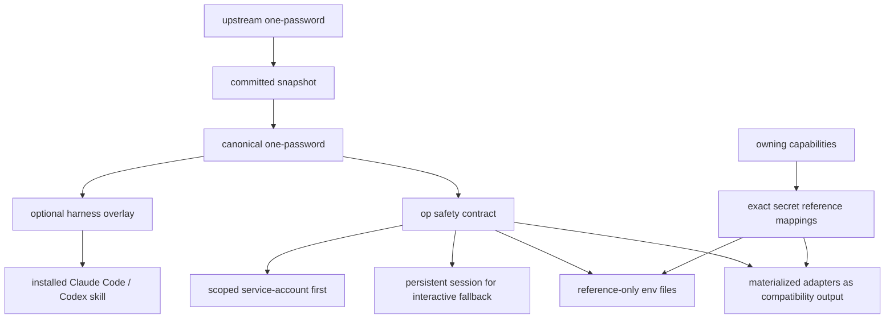
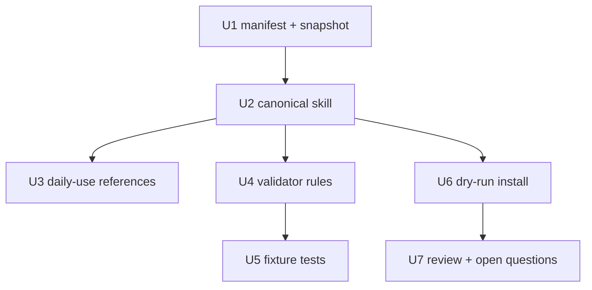

# feat: Adapt one-password as a Tracked Capability

## Summary

Adapt Peter Steinberger's `one-password` skill as the first secret-bearing tracked capability. Keep the upstream snapshot reviewable, preserve the source-native skill shape where useful, and rewrite the canonical copy so Nathan's agents can use 1Password safely across Claude Code CLI, Codex CLI, and Codex desktop without treating plaintext env files as the normal path.

The implementation should make `one-password` the generic 1Password CLI safety contract. Exact vault, item, field, and `op://...` mappings belong to the capability that consumes the secret.

---

## Problem Frame

Nathan wants the daily secret workflow to feel like one system:

```text
1Password = source of truth
reference-only env file = safe mapping
op run = normal runtime path
materialized secret adapter = compatibility path for tools that need plaintext
```

The current upstream `one-password` skill contains valuable operational wisdom, especially service-account-first access, targeted reads, persistent shell sessions, and proof without printing values. It also contains Peter-specific defaults and examples that should not become Nathan's installed behavior.

The local dotfiles setup already has broad env sync scripts such as `sync-api-keys`, `add-api-key`, `with-env`, and `sync-docker-mcp`. Those workflows are useful context, but this plan does not migrate dotfiles. Instead, it defines the `one-password` capability boundary that future tool-specific capabilities and adapters should follow.

---

## Requirements

- R1. Track `one-password` as a capability named `one-password`, preserving source name by default.
- R2. Commit an exact upstream snapshot of Peter's `skills/one-password/` folder at a pinned commit.
- R3. Create a canonical Nathan-safe `one-password` skill that preserves useful upstream structure while removing Peter-specific accounts, vaults, token names, socket names, paths, and `$npm` assumptions.
- R4. Define `one-password` as a 1Password CLI safety contract, not a generic secrets abstraction.
- R5. Prefer scoped service-account access before desktop app integration.
- R6. Require a persistent shell session for interactive desktop/app fallback; tmux is the usual CLI implementation, while Codex desktop may use a persistent Codex PTY or start dedicated tmux.
- R7. Allow direct service-account reads outside the persistent session only when the owning capability supplies exact vault, item, field, and expected shape.
- R8. Include reference-only env files as a first-class safe pattern.
- R9. Define materialized secret adapters as generated compatibility outputs, not sources of truth.
- R10. Keep exact `op://...` secret reference mappings in the owning capability or tool, not in `one-password`.
- R11. Allow targeted metadata checks for declared account, vault, item, or field; block broad account, vault, and item discovery by default.
- R12. Prove secret reads by exit status and shape checks, never by printing secret values.
- R13. Document daily usage scenarios for CLIs, MCP servers, fussy tools that require real env files, secret rotation, and debugging missing secrets.
- R14. Add validator coverage for high-confidence unsafe secret patterns and upstream personal leakage.
- R15. Install only from canonical capability content; snapshots are dependency input, never installed behavior.

---

## Scope Boundaries

- Do not run `op`, read real secrets, enumerate 1Password accounts/vaults/items, or inspect secret-bearing local env files as part of this plan.
- Do not migrate dotfiles env scripts in this slice.
- Do not create a central global secret manifest.
- Do not put exact service-specific vault, item, field, or env var mappings in `one-password`.
- Do not make plaintext `.env.1password` the recommended agent path.
- Do not add a broad generic `secrets` skill in this slice.
- Do not add new dependencies unless implementation proves existing Bun and standard library tools are insufficient and Nathan confirms the dependency.

### Deferred to Follow-Up Work

- A future `api-credentials`, `mcp-atlassian`, or tool-specific capability can own exact secret reference mappings and adapter generation.
- Dotfiles scripts can later be upgraded to generate reference-only env files and scoped materialized adapters.
- Install wiring can move from standalone capability installer to `install.sh` only after the standalone path is proven.

---

## Context & Research

### Relevant Code and Docs

- `docs/specs/agent-capability-registry.md` defines capabilities, snapshots, canonical capabilities, overlays, risk flags, aliases, validation, and install targets.
- `docs/specs/prompt-system.md` keeps shared policy separate from harness-specific runtime mechanics.
- `docs/reviews/2026-03-23-prompt-system-review.md` warns against shared surfaces carrying runtime-specific mechanics and personal assumptions.
- `CONTEXT.md` now defines `one-password`, `Reference-only env file`, `Secret reference mapping`, `Scoped service-account access`, `Persistent shell session`, `Direct service-account read`, `Targeted metadata check`, and `Materialized secret adapter`.
- `skills/create-agent-skills/SKILL.md` provides local skill authoring expectations: valid frontmatter, concise `SKILL.md`, references one level deep, and progressive disclosure.
- `context/known-issues.md` includes a 1Password CLI Homebrew quarantine issue that the adapted skill can reference when install troubleshooting is needed.
- `docs/adr/0002-runbooks-and-skills-use-prose-as-orchestrator.md` says skills should keep judgment and workflow in prose while deterministic validation belongs behind scripts.
- `docs/solutions/` does not exist in this repo, so there are no prior solution docs to carry forward.

### Upstream Source

- Source repository: `steipete/agent-scripts`
- Observed upstream commit: `8b8aa71ffb905eb488b97f1c0b9d1035af6d1b8d`
- Upstream path: `skills/one-password/`
- Upstream content includes `SKILL.md` plus `references/get-started.md` and `references/cli-examples.md`.

### Dotfiles Context

The dotfiles repo currently contains broad secret materialization workflows:

- `bin/env/add-api-key`
- `bin/env/sync-api-keys`
- `bin/env/ls-api-keys`
- `bin/env/sync-docker-mcp`
- `bin/with-env`
- `bin/mcp-atlassian`

Those are useful examples of why compatibility adapters matter, but this plan treats them as external context. `one-password` should define the safer target model without silently rewriting dotfiles.

---

## Key Technical Decisions

- Use `one-password` as the canonical capability name.
- Treat `one-password` as a 1Password CLI safety contract, not a broad secret abstraction.
- Preserve upstream structure where useful, but rewrite unsafe details. In registry language: source-native canonical, safety-adapted.
- Keep exact upstream snapshots committed and separate from canonical content.
- Install canonical content only. Never install directly from upstream snapshots.
- Use optional harness overlays only for real Claude Code or Codex edges.
- Make scoped service-account access the preferred agent path.
- Treat desktop app integration as fallback and require an explicit user gate when service-account access is missing or insufficient.
- Replace "tmux always" with "persistent shell session for interactive 1Password work." Tmux is the common CLI implementation; Codex desktop can use a persistent Codex PTY or start a dedicated tmux session.
- Allow exact direct service-account reads outside the persistent shell session when the owning capability supplies vault, item, field, and shape.
- Include reference-only env files in `one-password` as the safe file pattern for daily use.
- Define materialized secret adapters as generated compatibility outputs for tools that cannot consume `op run` or 1Password references.
- Keep exact secret reference mappings with the owning capability or tool.
- Allow targeted metadata checks against declared names. Do not allow broad account, vault, or item discovery by default.
- Ban `op account list`, `op vault list`, and `op item list` as normal agent behavior. Ambiguous routing should stop and ask Nathan instead of discovering live.
- Prove secret access with shape-only checks: field present, length, expected prefix class, newline count, and exit status.
- Secret values must never be printed to chat, logs, code, diffs, or command output.
- Secret writes belong behind explicit user confirmation and should avoid passing secret values as CLI arguments.
- The validator should block high-confidence unsafe secret patterns and warn on ambiguous cases.

---

## Daily Usage Model

| Scenario | Recommended agent behavior |
|---|---|
| Run a CLI that needs an API key | Use a reference-only env file and launch with `op run --env-file ... -- command`. |
| Run an MCP server | Prefer a wrapper that uses `op run` or resolves only the MCP server's declared secret refs. |
| Tool needs a real `.env` file | Generate a materialized secret adapter for that tool only: minimal keys, gitignored, `0600`, temporary when possible. |
| Add a new API key | The owning capability declares the env var to `op://...` mapping. `one-password` supplies write safety rules only. |
| Debug a missing API key | Check declared mapping and run targeted metadata checks. Do not list all vaults or items. |
| Read one known secret | Use scoped service-account access and read the exact vault/item/field. |
| Desktop auth is needed | Ask first, then use one persistent shell session for sign-in, verification, and follow-up commands. |
| Rotate a secret | Confirm with Nathan, update the known item, verify by shape only. |
| Share config in git | Commit only reference-only files, never plaintext materialized adapters. |
| Tool cannot use 1Password refs | Treat it as compatibility mode and generate plaintext only as a scoped adapter. |

---

## Open Questions

### Resolved During Planning

- Should the adapted skill be named `one-password`, `1password`, `secrets`, or something else? Use `one-password`.
- Is `one-password` generic secrets or 1Password-specific? It is 1Password CLI-specific.
- Should the canonical copy preserve upstream structure? Yes, preserve useful structure while adapting unsafe details.
- Should reference-only env files be included in `one-password`? Yes.
- Where do exact `op://...` mappings live? In the owning capability or tool, not `one-password`.
- What is the preferred access path? Scoped service-account first.
- Does interactive auth require literal tmux? No. It requires a persistent shell session.
- Can exact service-account reads run outside the persistent session? Yes, when non-interactive and declared by an owning capability.
- What metadata checks are allowed? Targeted checks against declared names only.

### Still To Resolve Before Implementation

- Should `op account list` be completely banned, or allowed only in an explicitly confirmed troubleshooting session?
- Should secret-write workflows live only as guardrails in `one-password`, or should the canonical skill include a dedicated reference for safe write/update patterns?
- Should `one-password` install an alias wrapper named `1password` on day one?
- What exact validator patterns should count as high-confidence secret leakage versus warnings?
- Should the first implementation slice include a real dry-run installer, or only manifest plus validation?

---

## High-Level Technical Design

> This illustrates the intended approach and is directional guidance for review, not implementation specification.



The canonical skill should teach the safe workflow and stop conditions. Tool-specific capabilities provide exact mappings and decide when to use `op run` directly versus generating a materialized adapter.

---

## Implementation Units



### U1. Add Registry Entry and Upstream Snapshot

**Goal:** Track `one-password` as a selected external capability with pinned provenance.

**Requirements:** R1, R2, R15

**Files:**
- Create or modify: `capabilities/manifest.yml`
- Create: `capabilities/snapshots/steipete-agent-scripts/8b8aa71ffb905eb488b97f1c0b9d1035af6d1b8d/skills/one-password/SKILL.md`
- Create: `capabilities/snapshots/steipete-agent-scripts/8b8aa71ffb905eb488b97f1c0b9d1035af6d1b8d/skills/one-password/references/get-started.md`
- Create: `capabilities/snapshots/steipete-agent-scripts/8b8aa71ffb905eb488b97f1c0b9d1035af6d1b8d/skills/one-password/references/cli-examples.md`

**Approach:**
- Add a source entry for `steipete/agent-scripts`.
- Add a `one-password` capability entry with `status: tracked` or `draft` depending on whether canonical content lands in the same change.
- Set risk flags:
  - `secret_bearing: true`
  - `side_effecting: false`
  - `networked: false`
  - `writes_files: false`
- Preserve upstream snapshot content exactly enough for future diffs.

**Test Scenarios:**
- Valid manifest with `one-password` parses successfully.
- Missing snapshot path for `one-password` fails validation.
- Snapshot files are present and not installed directly.

**Suggested Tests:**
- Create or extend: `capabilities/scripts/manifest.test.ts`
- Create or extend: `capabilities/scripts/validate.test.ts`

### U2. Create Canonical Nathan-Safe Skill

**Goal:** Build the adapted canonical `one-password` skill with source-native shape and Nathan-safe content.

**Requirements:** R3, R4, R5, R6, R7, R11, R12

**Files:**
- Create: `capabilities/canonical/skills/one-password/SKILL.md`
- Create: `capabilities/canonical/skills/one-password/references/get-started.md`
- Create: `capabilities/canonical/skills/one-password/references/cli-examples.md`

**Approach:**
- Preserve the upstream sections where they help future review: workflow, access path, persistent session, targeted reads, guardrails, references.
- Replace Peter-specific account/vault/token/socket names with generic capability-owned placeholders.
- State that exact vault/item/field names come from the owning capability.
- Replace "required tmux" with "persistent shell session for interactive fallback."
- Include Codex desktop wording only if source-native canonical text can stay harness-neutral; otherwise put the Codex-specific clarification in an overlay.
- Remove or rewrite examples that encourage broad enumeration, plaintext secret output, or passing secrets in CLI arguments.

**Test Scenarios:**
- Canonical skill frontmatter is valid.
- Canonical skill contains no Peter-specific account names, vault names, token aliases, or socket names.
- Canonical skill does not allow broad `op item list`, `op vault list`, or normal `op account list`.
- Canonical skill names service-account-first and persistent-session fallback rules.

**Suggested Tests:**
- Create or extend: `capabilities/scripts/validate.test.ts`
- Create fixtures under: `capabilities/scripts/fixtures/skills/`

### U3. Add Reference-Only Env and Adapter Guidance

**Goal:** Make daily env-file usage clear without turning `one-password` into a global secret map.

**Requirements:** R8, R9, R10, R13

**Files:**
- Modify: `capabilities/canonical/skills/one-password/SKILL.md`
- Create or modify: `capabilities/canonical/skills/one-password/references/cli-examples.md`

**Approach:**
- Add a `Reference-Only Env Files` section:
  - values are `op://...` references only
  - safe to review or regenerate when every secret-bearing value remains a reference
  - intended to run with `op run --env-file`
- Add a `Materialized Secret Adapters` section:
  - generated only when a tool cannot consume `op run` or references directly
  - per-tool, minimal, gitignored, `0600`, temporary when possible
  - never the source of truth
- Keep exact mappings out of examples unless clearly marked as illustrative placeholders.

**Test Scenarios:**
- A fixture reference-only env file with `op://...` values passes validation.
- A fixture env file containing a plaintext-looking token fails or warns according to policy.
- A canonical skill that includes a central global mapping table fails review or validation.

**Suggested Tests:**
- Create or extend: `capabilities/scripts/validate.test.ts`
- Optional fixtures: `capabilities/scripts/fixtures/env/reference-only.env`, `capabilities/scripts/fixtures/env/plaintext.env`

### U4. Add Secret-Bearing Validation Rules

**Goal:** Prevent unsafe secret handling and upstream leakage from reaching installed capabilities.

**Requirements:** R11, R12, R14

**Files:**
- Create or modify: `capabilities/scripts/validate`
- Create or modify: `capabilities/scripts/validate.test.ts`
- Create or modify: `capabilities/scripts/fixtures/skills/unsafe-one-password/`
- Create or modify: `capabilities/scripts/fixtures/skills/valid-one-password/`

**Approach:**
- Block high-confidence broad enumeration patterns in secret-bearing canonical capabilities:
  - normalizing `op item list`
  - normalizing `op vault list`
  - normalizing `op account list` without explicit troubleshooting caveat
- Block Peter-specific personal defaults in installed canonical content.
- Block likely plaintext secret examples such as real token prefixes, long random values, or `--reveal` examples that print values.
- Warn on ambiguous examples that may be safe only in troubleshooting references.
- Validate missing referenced files and skill frontmatter at the same time.

**Test Scenarios:**
- Valid `one-password` fixture passes.
- Fixture with `op item list` as a normal workflow fails.
- Fixture with Peter-specific `Molty` or personal account defaults fails.
- Fixture with `op://...` reference examples passes.
- Fixture with secret-looking plaintext fails.
- Fixture with missing linked reference fails.

**Suggested Tests:**
- `capabilities/scripts/validate.test.ts`

### U5. Add Dry-Run Install and Overlay Check

**Goal:** Prove the canonical capability can be installed without touching real harness directories.

**Requirements:** R15

**Files:**
- Create or modify: `capabilities/scripts/install`
- Create or modify: `capabilities/scripts/install.test.ts`
- Optional: `capabilities/overlays/codex/skills/one-password/`
- Optional: `capabilities/overlays/claude-code/skills/one-password/`

**Approach:**
- Add dry-run install output that shows source canonical path and target harness paths.
- Verify installed output comes from canonical content, not snapshots.
- Add overlays only if needed for Codex desktop or Claude Code-specific wording.
- If an alias is chosen later, install `1password` as a thin redirect wrapper rather than a duplicate copy.

**Test Scenarios:**
- Dry-run install reports `one-password` for Claude Code and Codex without writing target directories.
- Snapshot paths are never selected as install sources.
- Overlay application is skipped when no overlay exists.
- Alias collision is detected if `1password` would overwrite an existing installed skill.

**Suggested Tests:**
- `capabilities/scripts/install.test.ts`

### U6. Review Existing Dotfiles Flows as Follow-Up Candidates

**Goal:** Record how current broad env-sync workflows should relate to `one-password` without changing them in this slice.

**Requirements:** R9, R13

**Files:**
- Optional create: `docs/plans/2026-05-24-002-refactor-dotfiles-secret-adapters-plan.md`
- Optional issue comment on: GitHub issue `#64`

**Approach:**
- Document dotfiles flows as examples of materialized secret adapters.
- Do not treat broad `.env.1password` sync as the new recommended path.
- Defer actual dotfiles migration to a separate owning plan in the dotfiles repo or a future capability.

**Test Scenarios:**
- No dotfiles files are modified by the `one-password` capability implementation.
- The canonical skill uses dotfiles only as motivation, not as hardcoded active behavior.

---

## Verification Plan

- Run capability manifest validation once the registry scripts exist.
- Run skill frontmatter and reference validation for `capabilities/canonical/skills/one-password/`.
- Run secret-pattern validation against positive and negative fixtures.
- Run dry-run install for Claude Code and Codex targets.
- Run `./scripts/render-user-prompts.sh --check` only if prompt fragments or generated prompt outputs change. This plan should not require prompt-fragment changes.
- Do not run live `op` commands in automated tests.

---

## Readiness Checklist

- [ ] `one-password` upstream snapshot is pinned and committed.
- [ ] Canonical `one-password` skill exists under `capabilities/canonical/skills/one-password/`.
- [ ] Canonical skill contains no Peter-specific defaults.
- [ ] Canonical skill includes service-account-first, persistent-session fallback, reference-only env files, materialized adapters, and shape-only proof.
- [ ] Exact secret mappings are absent from `one-password`.
- [ ] Secret-bearing validation blocks broad enumeration and likely plaintext secret leakage.
- [ ] Dry-run install proves canonical content is the install source.
- [ ] Remaining open questions are resolved or explicitly deferred.
