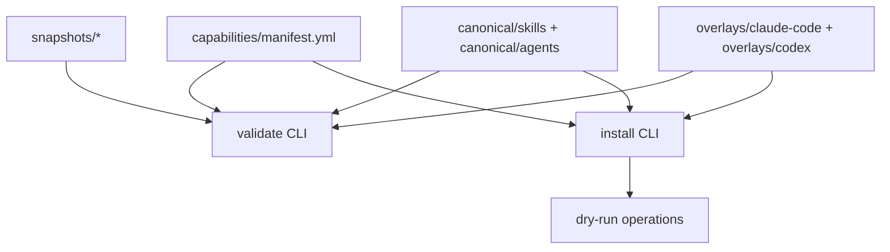
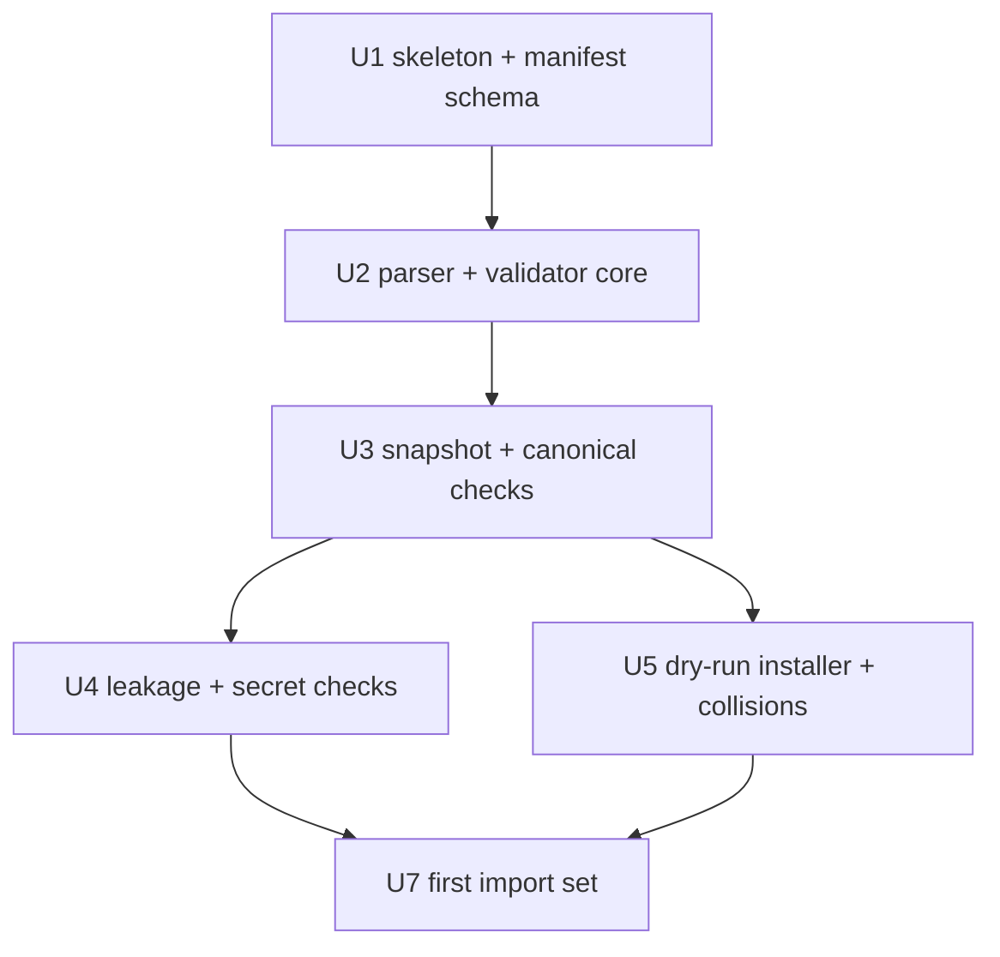

# feat: Build Agent Capability Registry v1

## Summary

Build the first version of the Agent Capability Registry as a capability-first subsystem under `capabilities/`. The registry tracks selected external skills and agents as pinned snapshots, Nathan-adapted canonical capabilities, optional harness overlay slots, manifest metadata, validation, and dry-run installation.

The first implementation slice should prove the registry read-side lifecycle (`snapshot -> canonical -> validation -> dry-run install planning`) with two capabilities: Peter Steinberger's `one-password` skill as the first secret-bearing Peter capability, and Compound Engineering's `ce-plan` skill as the first local-plugin capability.

---

## Problem Frame

Nathan wants to selectively adopt useful external agent capabilities without importing a whole upstream operating system. Today, external skills can be copied manually, but that loses provenance, reviewability, harness portability, and safety validation.

The registry should make each imported capability explicit, pinned, adapted, validated, and dry-run installable before any real Claude Code or Codex target directories are touched.

This parent plan owns the registry subsystem. The existing `one-password` plan is the first child slice that exercises the registry's hardest contracts: secret-bearing content, source-specific leakage removal, canonical adaptation, validation, and dry-run installation.

---

## Requirements

- R1. Create a registry skeleton under `capabilities/` with manifest, snapshots, canonical capabilities, overlays, scripts, and fixtures.
- R2. Add `capabilities/manifest.yml` as the authoritative runtime contract for sources, capabilities, dependencies, aliases, risk flags, lifecycle status, and install targets.
- R3. Support source snapshots under `capabilities/snapshots/`, including selected capability folders only in v1.
- R4. Support canonical capabilities under `capabilities/canonical/skills/` and `capabilities/canonical/agents/`.
- R5. Reserve mirrored-folder overlay slots under `capabilities/overlays/claude-code/` and `capabilities/overlays/codex/`; do not introduce a custom patch language in v1, and do not implement overlay application until a real harness edge requires it.
- R6. Build a Bun/TypeScript registry library and executable CLI entrypoints under `capabilities/scripts/`.
- R7. Parse and validate manifest shape, lifecycle status, risk flags, manual dependencies, install targets, empty alias/replacement arrays, and capability paths.
- R8. Support `draft` and `tracked` lifecycle statuses in v1. Treat `installed` and `retired` as deferred lifecycle states for the real-install plan; manifests using them in v1 must fail with an explicit unsupported-status diagnostic.
- R9. Recognize risk flags: `secret_bearing`, `side_effecting`, `networked`, and `writes_files`. V1 validators only trigger extra checks for `secret_bearing` and `writes_files`.
- R10. Treat manual dependency declarations as authoritative; inferred dependency detection may warn but must not mutate the manifest.
- R11. Validate skill and agent frontmatter, missing referenced files, and missing capability-owned files.
- R12. Block high-confidence leakage and warn on ambiguous leakage.
- R13. Add secret-bearing validation checks strong enough for `one-password`.
- R14a. Validate collision policy shape in the manifest.
- R14b. Detect install target collisions before any write and block by default unless ownership is explicit in the manifest.
- R15. Provide dry-run install planning for Claude Code before any real harness writes. Keep Codex target schema and path validation visible, but defer Codex dry-run install behavior until the real-install follow-up unless Nathan chooses to pull it forward.
- R16. Defer the add-from-source workflow to the third-capability onboarding plan; v1 imports may be staged manually but must pass the same snapshot, canonical, manifest, and leakage gates.
- R17. Preserve executable bits for capability-owned scripts and validate when expected script files are not executable.
- R18. Explicitly defer `install.sh` integration until standalone validation and dry-run installation are proven.

## Out Of Scope For V1

- Real harness writes to Claude Code or Codex skill/agent directories.
- `install.sh` integration.
- Codex dry-run install behavior beyond manifest shape, path validation, and follow-up notes.
- Add-from-source automation; defer it to the third-capability onboarding plan.
- Overlay application code; keep overlay directories as reserved slots until a first real harness edge needs deterministic rules.
- Update and three-way diff commands for new upstream snapshots, including `ADAPTATIONS.md` and snapshot-level `source.yml` contracts.
- Raw URL, package registry, and custom fetch adapters.
- Plugin MCP installation or copying plugin internals.
- Dotfiles secret adapter migration.
- Whole-plugin, whole-repository, runbook, prompt fragment, rule, command, or MCP-tool capabilities.
- Automatic dependency inference or manifest mutation from scanned content.
- Automatic promotion of upstream changes into canonical capabilities.
- Live `op` commands, secret reads, broad 1Password enumeration, or inspection of secret-bearing env files.
- New dependencies unless Bun, Node standard library APIs, and small local parsers prove insufficient and Nathan approves.

## Pending Nathan Decisions

These are not implementation tasks until Nathan chooses a direction:

- Overlay rules before any overlay application code: add vs replace, file-vs-frontmatter merge, `SKILL.md` vs `SKILL.md.tmpl`, executable-bit precedence, directory merge behavior, and whether overlays may delete canonical files.
- `ce-plan` bootstrap collision: install under a different registry-managed name, or block install by default with an explicit plugin-shadow warning.
- V1 value shape: confirm whether this slice should remain validation plus Claude Code dry-run install planning, or shrink further to validation plus first imports only.
- First-slice coupling: keep `one-password` and `ce-plan` bundled, or sequence `one-password` first and import `ce-plan` later.
- `ce-plan` cross-harness primitive strategy: drop the primitive, overlay-replace it, or rewrite canonical content to be harness-neutral.
- Per-source leakage curation: confirm whether manifest source entries should grow a `leakage_blocklist:` field.
- Local-plugin source metadata: confirm whether the `compound-engineering` source should record `marketplace: every-marketplace`.
- Snapshot integrity semantics: choose between a future deterministic `snapshot_hash` check and treating `pinned` as provenance only.

---

## Context & Research

### Relevant Code And Docs

- `docs/specs/agent-capability-registry.md` defines the accepted product shape, vocabulary, layout, lifecycle statuses, risk flags, overlays, install targets, aliases, validation, and first implementation slice.
- `docs/plans/2026-05-24-001-feat-one-password-capability-plan.md` is the first child capability plan and should be implemented through this registry.
- `CONTEXT.md` defines the durable registry terms: `Capability`, `Source`, `Snapshot`, `Canonical capability`, `Overlay`, `Capability dependency`, `Capability risk flag`, `Install target`, and `Alias wrapper`.
- `docs/specs/prompt-system.md` explains the Claude Code and Codex runtime surfaces that installed skills/agents must respect.
- `docs/adr/0002-runbooks-and-skills-use-prose-as-orchestrator.md` sets the placement rule: prose orchestrates judgment, deterministic validation and schema contracts live in code/CLI.
- `package.json` already uses Bun and TypeScript-oriented tooling with Biome available, so registry scripts should stay in the existing ecosystem.
- `capabilities/` does not exist yet; the first unit creates the subsystem boundary.

### Source Inputs For First Slice

- Peter source: `steipete/agent-scripts`, capability `skills/one-password/`, pinned at the commit recorded in the child plan.
- Compound Engineering source: local plugin cache metadata for Compound Engineering version `3.8.4`, capability `skills/ce-plan/`.

`ce-plan` is the first Compound Engineering capability because it is high-value, already used to create registry plans, and exercises writes-file risk, references, frontmatter, and local-plugin provenance without also introducing network, side-effecting, or secret-bearing behavior.

Because `ce-plan` is self-referential for planning work, the plugin-cache copy remains the fallback if the canonical registry adaptation breaks. Agents should continue using the verified plugin-cache skill until the canonical copy validates again.

### Existing Patterns To Follow

- Plan files under `docs/plans/` use YAML frontmatter, repo-relative paths, stable requirement IDs, scoped implementation units, and explicit test scenarios.
- Script-backed deterministic checks should use JSON output for machine consumption and compact human-readable output only as a convenience.
- Capability content should remain source-native by default, with real harness differences represented as overlays.

---

## Key Technical Decisions

- Place the entire v1 subsystem under `capabilities/`.
- Use `capabilities/manifest.yml` as the runtime source of truth. Runtime validators should load allowed statuses, risk flags, source kinds, and install behavior from code constants, not only TypeScript types.
- Use `ce-plan` as the first Compound Engineering capability paired with `one-password`.
- Snapshot selected capability folders. Do not add snapshot-level `source.yml` contracts in v1; leave that schema to the update and three-way-diff follow-up.
- Keep canonical capabilities separate from snapshots. Only canonical content plus overlays can be installed.
- Use mirrored overlay folders for v1. For example, `capabilities/overlays/codex/skills/ce-plan/` mirrors the installed skill path for Codex-specific differences.
- Keep manual dependencies authoritative. Inferred dependency checks produce warnings with evidence and suggested manifest entries.
- Define a likely dependency reference as a markdown wiki link `[[name]]` where `name` matches another declared capability. If it is not present in `depends_on`, validation may warn with evidence but must not rewrite the manifest.
- Accept `aliases: []` as a no-op in v1. Non-empty aliases and alias wrapper generation are deferred until a capability actually needs them.
- Accept `collision_policy.replaces: []` as a no-op in v1. Non-empty `replaces` is unsupported until replacement semantics are implemented; when added later, every entry must be confined under the relevant install target root and expected capability subtree.
- Treat `installed` and `retired` lifecycle states as deferred to the real-install plan. V1 manifests using either state should fail explicitly instead of silently accepting unreachable states.
- Preserve executable bits when copying snapshots, canonical capability files, overlays, and install outputs. File copies that must preserve mode bits use `node:fs/promises.copyFile`; `Bun.write` is content-only and resets mode to `0644`, so do not use it for snapshot, canonical, overlay, or install file copies.
- Validate executable files as text before accepting them: an executable file must be valid UTF-8 text or have a valid text shebang. Binary files with executable bits are hard blockers.
- Use Claude Code dry-run install as the only install mode required by this plan. Real writes and Codex dry-run behavior can be added later behind the same collision and ownership checks.
- Parse manifest YAML and markdown frontmatter with `Bun.YAML.parse` from the Bun runtime. No additional YAML dependency is required for v1.
- Make CLI output JSON-first. Every command that the workflow consumes must support `--json` and return stable `ok`, `errors`, `warnings`, and command-specific payload fields.

---

## Manifest Schema

The exact v1 manifest schema should be implemented as runtime-validated YAML with this shape:

```yaml
version: 1

targets:
  defaults:
    claude-code: true
    codex: false
  roots:
    claude-code:
      skills: "~/.claude/skills"
      agents: "~/.claude/agents"
    codex:
      skills: "~/.codex/skills"
      agents: "~/.codex/agents"

sources:
  steipete-agent-scripts:
    kind: git
    repository: "https://github.com/steipete/agent-scripts.git"
    pinned: "8b8aa71ffb905eb488b97f1c0b9d1035af6d1b8d"
    snapshot: "capabilities/snapshots/steipete-agent-scripts/8b8aa71ffb905eb488b97f1c0b9d1035af6d1b8d"
  compound-engineering:
    kind: local-plugin
    plugin: "compound-engineering"
    version: "3.8.4"
    snapshot: "capabilities/snapshots/compound-engineering/3.8.4"

capabilities:
  - name: one-password
    kind: skill
    source: steipete-agent-scripts
    upstream_path: skills/one-password
    snapshot_path: capabilities/snapshots/steipete-agent-scripts/8b8aa71ffb905eb488b97f1c0b9d1035af6d1b8d/skills/one-password
    canonical_path: capabilities/canonical/skills/one-password
    status: tracked
    risk:
      secret_bearing: true
      side_effecting: false
      networked: false
      writes_files: false
    depends_on: []
    install:
      claude-code: true
      codex: false
    aliases: []
    scripts: []
    collision_policy:
      owns_existing: false
      replaces: []

  - name: ce-plan
    kind: skill
    source: compound-engineering
    upstream_path: skills/ce-plan
    snapshot_path: capabilities/snapshots/compound-engineering/3.8.4/skills/ce-plan
    canonical_path: capabilities/canonical/skills/ce-plan
    status: tracked
    risk:
      secret_bearing: false
      side_effecting: false
      networked: false
      writes_files: true
    depends_on: []
    install:
      claude-code: true
      codex: false
    aliases: []
    scripts: []
    collision_policy:
      owns_existing: false
      replaces: []
```

Per-capability `install` targets override `targets.defaults`. If a capability omits `install`, it inherits the defaults.

Codex roots remain in the manifest so path validation and future install support have a visible contract, but Codex install is disabled by default in v1.

Path validation must normalize paths before use:

- `snapshot_path` and `canonical_path` must resolve under this repo's `capabilities/` directory.
- `upstream_path` must be source-relative: no absolute paths, no `..` traversal, and no path that escapes the selected source snapshot root when joined.
- Any violation emits a hard `capability.path_traversal` diagnostic before file-system operations run.

`aliases` and `collision_policy.replaces` must be empty arrays in v1. Non-empty values fail with explicit unsupported-feature diagnostics rather than being partly implemented.

Validation should fail on any unknown top-level manifest key in v1. Do not add an `x_` extension namespace until there is a concrete extension use case.

---

## CLI Contract

The v1 CLI should use small executable `.ts` entrypoints under `capabilities/scripts/`, each with a `#!/usr/bin/env bun` shebang and executable bit:

| Command | Purpose |
|---|---|
| `capabilities/scripts/validate.ts --json` | Parse the manifest, validate registry content, and report errors/warnings. |
| `capabilities/scripts/install.ts --target claude-code --dry-run --json` | Produce Claude Code install operations without writing target directories. |

Deferred CLI entrypoints should follow the same `.ts` + shebang pattern. `add-from-source.ts` is intentionally out of scope for v1 and belongs to the third-capability onboarding plan.

All machine-consumed command output should follow this envelope:

```json
{
  "ok": true,
  "command": "validate",
  "manifest": "capabilities/manifest.yml",
  "errors": [],
  "warnings": [],
  "data": {}
}
```

Blocking diagnostics should include stable codes, repo-relative paths, and enough evidence for a user to review without opening every file:

```json
{
  "code": "capability.missing_canonical_path",
  "severity": "error",
  "capability": "one-password",
  "path": "capabilities/canonical/skills/one-password",
  "message": "Canonical path is declared but does not exist."
}
```

---

## Leakage And Secret Validation Policy

High-confidence blockers:

- Source-specific personal names, accounts, vaults, tokens, socket names, or absolute paths in canonical or overlay content.
- Harness-specific primitives in the wrong target, such as `AskUserQuestion` in Codex-only output or `request_user_input` in Claude Code-only output.
- Shared canonical content that hardcodes `~/.claude` or `~/.codex` paths unless the capability is target-specific.
- Secret-looking plaintext examples in canonical content: common real token prefixes, long high-entropy values, private key blocks, or examples that print secret values.
- Secret-bearing capabilities that normalize broad `op account list`, `op vault list`, or `op item list` discovery.
- Secret-bearing capabilities that recommend passing secret values as CLI arguments.

Snapshot admission blockers:

- Real token prefixes and private-key material in snapshots, even if canonical content is cleaned later.
- PEM block headers, SSH private-key headers, AWS access key IDs matching `AKIA[A-Z0-9]{16}`, 1Password service-account tokens beginning with `ops_`, and JWT-looking strings with three base64url segments beginning with `eyJ`.
- `op://...` references with non-placeholder vault, item, or field names when the source is expected to be generic.

Entropy checks should use a concrete minimum floor: strings at least 40 characters long with Shannon entropy at least 3.5 bits per character are suspicious unless they are UUID-formatted or otherwise classified as a known safe identifier. High-confidence matches block; ambiguous matches warn.

Warnings:

- Ambiguous upstream terms that may be generic or personal without enough evidence.
- Text mentioning harness-specific behavior in canonical content when the target is not clear.
- Likely missing dependency references, defined as markdown wiki links `[[name]]` where `name` matches another declared capability that is not listed in `depends_on`.
- Troubleshooting-only commands that could be dangerous if copied into the hot path.

The first implementation should keep pattern lists intentionally small, named, tested, and easy to review. Add broader heuristics only after false positives are understood.

---

## High-Level Technical Design

> This is directional guidance for review, not implementation code.



Validation proves the registry is internally coherent before install planning. Install dry-run reads validated canonical content, checks collisions, and emits planned operations. Overlay application and add-from-source automation are follow-up work unless Nathan chooses to pull them forward for a real first-slice edge.

---

## Implementation Units



### U1. Create Registry Skeleton And Manifest Contract

**Goal:** Establish the v1 repository boundary and manifest schema.

**Requirements:** R1, R2, R8, R9, R18

**Files:**
- Create: `capabilities/manifest.yml`
- Create: `capabilities/README.md`
- Create: `capabilities/snapshots/.gitkeep`
- Create: `capabilities/canonical/skills/.gitkeep`
- Create: `capabilities/canonical/agents/.gitkeep`
- Create: `capabilities/overlays/claude-code/.gitkeep`
- Create: `capabilities/overlays/codex/.gitkeep`
- Create: `capabilities/scripts/lib/schema.ts`
- Create: `capabilities/scripts/schema.test.ts`

**Approach:**
- Add the skeleton directories and the first manifest with the two planned sources and capabilities.
- Implement runtime constants for statuses, risk flags, source kinds, capability kinds, and target names.
- Establish the library module pattern used by later units: schema constants in `lib/schema.ts`, pure validation helpers exported from `lib/*`, CLI entrypoints kept thin, and tests importing library functions rather than shelling out when possible.
- Keep the schema strict enough to catch typos and portable enough to work across machines.
- Recognize all four risk flags in the schema, but document that `side_effecting` and `networked` are inert in v1 until concrete validators exist.
- Document that `install.sh` integration is intentionally deferred.

**Test Scenarios:**
- `fixtures/manifest/shape-valid.yml` parses successfully for schema-only validation.
- Unknown lifecycle status fails.
- Unknown risk flag fails.
- Missing required source fields fail.
- Unknown top-level manifest key fails, including keys prefixed with `x_`.

**Suggested Tests:**
- `capabilities/scripts/schema.test.ts`

### U2. Add Manifest Parser And Validator Core

**Goal:** Provide the deterministic validation front door.

**Requirements:** R6, R7, R10, R14a

**Files:**
- Create: `capabilities/scripts/validate.ts`
- Create: `capabilities/scripts/lib/manifest.ts`
- Create: `capabilities/scripts/lib/diagnostics.ts`
- Create: `capabilities/scripts/validate.test.ts`
- Create: `capabilities/scripts/fixtures/manifest/shape-valid.yml`
- Create: `capabilities/scripts/fixtures/manifest/fully-valid.yml`
- Create: `capabilities/scripts/fixtures/manifest/invalid-status.yml`
- Create: `capabilities/scripts/fixtures/manifest/duplicate-name.yml`

**Approach:**
- Parse manifest YAML with `Bun.YAML.parse`.
- Return JSON-first diagnostics with stable codes.
- Validate source references, duplicate names, manual dependency shapes, install target booleans, collision policy shape, empty alias/replacement arrays, and v1-supported lifecycle statuses.
- Normalize and confine paths before any file-system operation. `snapshot_path` and `canonical_path` must stay under repo-local `capabilities/`; `upstream_path` must be source-relative and unable to escape the selected snapshot root.
- Treat non-empty `aliases` and `collision_policy.replaces` as unsupported in v1 with explicit diagnostics.
- Warn on likely dependency references without mutating the manifest. A likely dependency reference is a markdown wiki link `[[name]]` where `name` matches another declared capability missing from `depends_on`.

**Test Scenarios:**
- `validate --json` returns the standard output envelope.
- Duplicate capability names fail.
- Non-empty aliases fail with an unsupported-feature diagnostic.
- Non-empty `collision_policy.replaces` fails with an unsupported-feature diagnostic and does not bypass collision blocking.
- Capability referencing an unknown source fails.
- `installed` or `retired` lifecycle status fails with an explicit v1 unsupported-status diagnostic.
- `snapshot_path`, `canonical_path`, or `upstream_path` traversal fails with `capability.path_traversal`.
- Likely dependency reference not declared produces a warning.

**Suggested Tests:**
- `capabilities/scripts/validate.test.ts`

### U3. Validate Capability Folders, Frontmatter, References, And Executable Bits

**Goal:** Prove snapshots and canonical copies are present, shaped correctly, and self-contained.

**Requirements:** R3, R4, R11, R17

**Files:**
- Create: `capabilities/scripts/lib/capability-files.ts`
- Create: `capabilities/scripts/lib/frontmatter.ts`
- Create: `capabilities/scripts/capability-files.test.ts`
- Create: `capabilities/scripts/fixtures/skills/valid-skill/SKILL.md`
- Create: `capabilities/scripts/fixtures/skills/missing-reference/SKILL.md`
- Create: `capabilities/scripts/fixtures/agents/valid-agent.md`

**Approach:**
- Validate declared snapshot and canonical paths exist for each status where they are required.
- Validate skill folders include `SKILL.md` with acceptable frontmatter.
- Validate agent files or folders according to the repo's Codex/Claude agent surfaces discovered during implementation.
- Scan markdown links and declared references that point inside the capability folder.
- Preserve executable bits with `node:fs/promises.copyFile` whenever copying files in tests or fixtures. Do not use `Bun.write` for mode-preserving copies.
- Validate executable bits for files declared under `scripts`.
- Assert executable files are UTF-8 text or have a valid text shebang. Binary files with executable bits are hard blockers.

**Test Scenarios:**
- Missing snapshot path fails.
- Missing canonical path fails for `tracked`.
- `draft` may have snapshot without canonical content.
- Skill missing `SKILL.md` fails.
- Skill frontmatter missing `name` or `description` fails.
- Missing referenced file fails.
- Declared script without executable bit fails.
- Copying a `0755` fixture with the registry copy helper preserves `0755` on the destination.
- Executable binary fixture fails validation.

**Suggested Tests:**
- `capabilities/scripts/capability-files.test.ts`

### U4. Add Leakage, Harness, And Secret-Bearing Validation

**Goal:** Block unsafe content before canonical capabilities can be installed.

**Requirements:** R12, R13

**Files:**
- Create: `capabilities/scripts/lib/leakage.ts`
- Create: `capabilities/scripts/lib/secret-policy.ts`
- Create: `capabilities/scripts/leakage.test.ts`
- Create: `capabilities/scripts/secret-policy.test.ts`
- Create: `capabilities/scripts/fixtures/skills/unsafe-one-password/SKILL.unsafe-fixture.md`
- Create: `capabilities/scripts/fixtures/README.md`
- Create: `capabilities/scripts/fixtures/skills/valid-one-password/SKILL.md`
- Create: `capabilities/scripts/fixtures/skills/harness-leakage/SKILL.md`

**Approach:**
- Implement named pattern groups for high-confidence blockers and warnings.
- Keep secret-bearing checks conditional on `risk.secret_bearing`.
- Enforce the `one-password` safety contract without running `op`.
- Run snapshot admission checks before accepting committed snapshots. Block real token prefixes, private-key material, non-placeholder `op://...` references, and the minimum pattern floor named in the leakage policy; warn on ambiguous source text.
- Check canonical plus overlay output for install-blocking leakage before any dry-run install plan.
- Keep unsafe fixtures non-discoverable by naming them `SKILL.unsafe-fixture.md` and documenting that fixtures must remain under `capabilities/scripts/fixtures/`.

**Test Scenarios:**
- Peter-specific personal defaults in canonical content fail.
- `op item list` as a normal workflow fails for `one-password`.
- `op://...` reference examples pass.
- Secret-looking plaintext examples fail.
- Snapshot fixture with PEM, AWS `AKIA...`, 1Password `ops_`, JWT-looking token, SSH private-key header, or high-entropy plaintext fails admission.
- Harness-specific prompt primitives in the wrong target fail.
- Ambiguous dependency-like references warn.
- Validator self-test confirms unsafe fixtures live only under `capabilities/scripts/fixtures/`.

**Suggested Tests:**
- `capabilities/scripts/leakage.test.ts`
- `capabilities/scripts/secret-policy.test.ts`

### U5. Add Dry-Run Installer And Collision Checks

**Goal:** Emit planned Claude Code install operations without touching real harness directories.

**Requirements:** R5, R6, R14b, R15

**Files:**
- Create: `capabilities/scripts/install.ts`
- Create: `capabilities/scripts/lib/install-plan.ts`
- Create: `capabilities/scripts/install.test.ts`
- Create: `capabilities/scripts/fixtures/install/collisions/`

**Approach:**
- Require `--target claude-code` in v1.
- Require `--dry-run` for v1.
- Plan install operations from canonical content only.
- Keep overlay directories as reserved slots. Do not implement overlay application until Nathan decides deterministic overlay rules and a real harness edge requires them.
- Detect target collisions against a fake root in tests and against real Claude Code target paths in dry-run mode.
- Block target collisions unless `collision_policy.owns_existing` is true for the installing capability.
- Do not support non-empty aliases or `collision_policy.replaces` in v1.
- Capture a follow-up note that Codex collision detection must run against real `~/.codex/skills/` and `~/.codex/agents/`, including plugin-installed content, before Codex install behavior is enabled.

**Test Scenarios:**
- Dry-run for Claude Code emits planned skill copies without writes.
- Snapshot paths are never selected as install sources.
- Overlay directories are ignored in v1 unless overlay application is explicitly pulled forward.
- Existing target collision blocks unless explicitly owned by the installing capability.
- `installed` and `retired` capability statuses are rejected before install planning.

**Suggested Tests:**
- `capabilities/scripts/install.test.ts`

### U7. Import First Capability Set

**Goal:** Exercise the registry end-to-end with `one-password` and `ce-plan`.

**Verification:** R1-R18 (end-to-end integration; primary ownership in U1-U5)

**Files:**
- Modify: `capabilities/manifest.yml`
- Create: `capabilities/snapshots/steipete-agent-scripts/8b8aa71ffb905eb488b97f1c0b9d1035af6d1b8d/skills/one-password/`
- Create: `capabilities/snapshots/compound-engineering/3.8.4/skills/ce-plan/`
- Create: `capabilities/canonical/skills/one-password/`
- Create: `capabilities/canonical/skills/ce-plan/`
- Modify: `capabilities/README.md`
- Optional create: `capabilities/overlays/claude-code/skills/ce-plan/`
- Optional create: `capabilities/overlays/codex/skills/ce-plan/`

**Approach:**
- Implement the child `one-password` plan as the first secret-bearing capability.
- Snapshot and canonicalize `ce-plan` with the smallest necessary adaptations.
- If canonical `ce-plan` adaptation breaks, keep using the plugin-cache `ce-plan` skill as the operational fallback until the registry copy validates again.
- Add overlays only if Nathan resolves the overlay-rule decision and a real harness difference is found while adapting `ce-plan`; otherwise keep canonical content unchanged and leave overlay directories empty.
- Set both capabilities to `tracked`. Do not use `installed` until real install support lands later.
- Update `capabilities/README.md` with manifest fields, validation commands, Claude Code dry-run install commands, deferred follow-up boundaries, fixture safety notes, and a one-line positioning note explaining why `capabilities/` exists as a top-level subsystem.

**Test Scenarios:**
- Full registry validation passes with both first-slice capabilities.
- `one-password` secret-bearing checks pass for canonical content.
- `ce-plan` validates as a writes-file capability.
- Dry-run install includes both capabilities for Claude Code.
- Codex paths and target declarations validate, but Codex dry-run install behavior remains deferred.
- No real harness directories are written.
- README command examples match implemented CLI names.
- Follow-up work is explicit and not accidentally implemented in v1.

**Suggested Tests:**
- `capabilities/scripts/validate.test.ts`
- `capabilities/scripts/install.test.ts`

---

## Verification Plan

- Run focused Bun tests for registry scripts as they are added.
- Run the full registry validation command with `--json`.
- Run Claude Code dry-run install with `--json`.
- Run Biome lint/format checks after TypeScript/script edits.
- Run TypeScript checks if the registry scripts introduce or reuse a tsconfig-compatible surface.
- Run `./scripts/render-user-prompts.sh --check` only if prompt fragments or generated prompt outputs change; this plan should not require prompt rendering changes.
- Do not run live `op` commands or inspect local secret-bearing env files.

---

## Readiness Checklist

- [ ] `capabilities/` skeleton exists.
- [ ] `capabilities/manifest.yml` validates through runtime code.
- [ ] Snapshot, canonical, overlay, dependency, alias, lifecycle, risk, and install-target validation exists.
- [ ] Snapshot admission blocks high-confidence token/key leakage before snapshots are committed.
- [ ] High-confidence leakage and secret-bearing validation blocks unsafe canonical content.
- [ ] Claude Code dry-run install emits operations without real writes.
- [ ] Install collision checks block by default.
- [ ] `one-password` is imported through the registry and passes secret-bearing validation.
- [ ] `ce-plan` is imported through the registry and passes writes-file validation.
- [ ] `capabilities/README.md` documents v1 commands and deferred boundaries.
- [ ] `install.sh` integration remains deferred.
