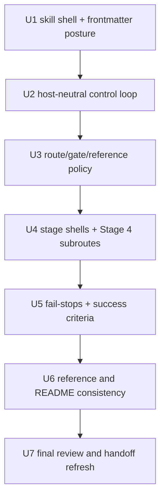

# refactor: Promote Issue-to-PR skill to control plane

## Summary

Convert `skills/issue-to-pr/SKILL.md` from a thin Claude Code `/goal` launcher into a host-neutral control plane for the existing Issue-to-PR v2 workflow. The skill should make the durable orchestration loop, host adapters, route/gate policy, reference loading, and success criteria visible at the skill entrypoint while leaving deterministic mechanics, repeated handoff packets, and deep stage detail in the existing v2 runbook assets.

This is a surgical documentation/skill-architecture refactor. It should be implemented as small DAG-ordered batches, with a review-agent loop after each batch before the next dependent batch starts.

---

## Problem Frame

The current `issue-to-pr` skill is discoverable and user-invocable, but its body only constructs a Claude Code `/goal` invocation. That keeps the actual workflow hidden in `runbooks/issue-to-pr-v2/issue-to-pr.md` and makes Codex support implicit rather than first-class.

The v2 runbook already has the right orchestration ideas: durable ledger state beats transcript memory, CLI facts drive routing, pre-stage gates stop unsafe work, Builder/Validator role boundaries are explicit, and references/templates provide progressive disclosure. The plan is to promote that control-plane shape into the skill body without duplicating the full runbook.

---

## Requirements

- R1. Make `skills/issue-to-pr/SKILL.md` the host-neutral control plane for the Issue-to-PR v2 workflow.
- R2. Preserve manual invocation and side-effect safety; do not make the skill auto-triggerable.
- R3. Treat Codex support as first-class. `/goal` and `/loop` are Claude Code host-adapter details, not the core workflow.
- R4. Preserve the v2 workflow invariants from `runbooks/issue-to-pr-v2/issue-to-pr.md`.
- R5. Use XML-framed sections where they reduce orchestration ambiguity.
- R6. Do not wrap helper-validated YAML or JSON payloads in XML.
- R7. Keep deterministic mechanics behind existing CLI/scripts, especially `runbooks/issue-to-pr-v2/cli.ts` and `runbooks/issue-to-pr-v2/decompose.ts`.
- R8. Keep repeated cross-agent handoff payloads in `runbooks/issue-to-pr-v2/templates/`.
- R9. Keep deep stage mechanics and rare explanation in one-level references under `runbooks/issue-to-pr-v2/references/`.
- R10. Avoid duplicating the whole v2 hot router inside the skill body.
- R11. Clarify Stage 4's one-visible-action-per-turn behavior so selection, lifecycle checkpointing, Builder attempts, Validator waves, convergence, and fail-stops are not blurred together.
- R12. Preserve Orchestrator, Builder, Validator, and Proposer role boundaries from ADR 0001.
- R13. Preserve the prose/CLI/template/reference placement rule from ADR 0002.
- R14. Identify any glossary or ADR follow-up only if this refactor introduces durable new terminology or a hard-to-reverse architectural decision.

---

## Scope Boundaries

- Do not rewrite the v2 CLI, helper scripts, packet renderers, or tests as part of this plan.
- Do not move the full `runbooks/issue-to-pr-v2` tree into `skills/issue-to-pr/`.
- Do not create a second canonical Issue-to-PR skill or alias wrapper.
- Do not change the per-issue ledger schema.
- Do not change Builder, Validator, Proposer, or patch-proposal packet schemas.
- Do not create a new dependency.
- Do not run a live issue-to-PR workflow as part of this refactor.
- Do not touch unrelated untracked work.

### Deferred To Follow-Up Work

- Running the refactored skill on a real GitHub issue.
- Adding automated lint for skill XML shape, if the repo later wants one.
- Promoting any new durable language to `CONTEXT.md`, if the implementation review decides terms such as "skill control plane" or "host adapter" should become canonical.

---

## Context And Research

### Relevant Code And Docs

- `skills/issue-to-pr/SKILL.md` is the current thin launcher. It has the right discovery metadata and manual invocation posture, but it delegates all workflow behavior to `/goal`.
- `runbooks/issue-to-pr-v2/issue-to-pr.md` is the current v2 hot router. Its strongest sections are the core invariants, reference-loading table, start-every-turn loop, pre-stage gates, route catalog, stage shells, and stop-and-ask checklist.
- `runbooks/issue-to-pr-v2/references/` contains the detailed stage and role mechanics. These should remain the primary deep-reference layer.
- `runbooks/issue-to-pr-v2/templates/` contains repeated prompt payloads for ce-plan addenda, Builder work packets, Validator envelopes, Proposer envelopes, and patch proposals.
- `docs/adr/0001-stage-4-context-isolation.md` defines the Stage 4 context-isolation boundary: Orchestrator owns lifecycle and dispatch, Builder owns one scoped attempt, Validators own correctness findings.
- `docs/adr/0002-runbooks-and-skills-use-prose-as-orchestrator.md` defines the placement rule: judgment in prose, determinism behind CLI/scripts, runtime contracts in code, repeated handoffs in templates, rare explanation in references.
- `CONTEXT.md` defines current durable language around capabilities, sources, canonical capabilities, overlays, and install targets. This plan should not casually add new glossary terms.

### Existing Patterns To Preserve

- Keep `disable-model-invocation: true` for side-effecting manual workflows.
- Keep skill frontmatter concise and discovery-oriented.
- Keep references one level deep from the skill entrypoint.
- Use XML tags for semantic instruction boundaries when the section is meant to be parsed by an agent's attention, not for data that tools validate mechanically.
- Use repo-relative paths in durable docs and plans.

---

## Key Technical Decisions

- The canonical capability remains `skills/issue-to-pr/SKILL.md`; the v2 runbook tree becomes supporting orchestration assets, not a separate capability.
- The skill body becomes the control plane and navigation layer. It should contain only enough route, gate, and stage-shell detail for an agent to drive the workflow safely.
- The existing v2 hot router remains a source artifact during the refactor. Its content can be referenced or thinned later, but this plan does not require deleting or moving it.
- XML sections should be used for the highest-risk attention boundaries:
  - `<objective>`
  - `<quick_start>`
  - `<host_adapters>`
  - `<durable_state_contract>`
  - `<orchestration_loop>`
  - `<pre_route_gates>`
  - `<reference_loading_policy>`
  - `<route_catalog>`
  - `<stage_shells>`
  - `<fail_stops>`
  - `<review_loop>`
  - `<success_criteria>`
- Host-specific invocation behavior belongs under `<host_adapters>`. Claude Code can still mention `/goal` and `/loop`; Codex should drive the loop directly.
- Stage 4 should be represented as a resumable subroute sequence rather than a single compressed action summary.
- No new ADR is required at plan time because ADR 0002 already covers the prose/CLI/template/reference boundary. Reconsider only if implementation changes the repository-wide placement rule.

---

## Batch Review Loop

Every implementation unit below is a batch. Each batch should be implemented and reviewed before dependent batches start.

For each batch:

1. Implement only the listed file surface.
2. Run the batch's local verification checks.
3. Spawn or invoke review agents/personas focused on the batch concerns.
4. Collect findings and classify them as blocking or non-blocking.
5. Fix blocking findings.
6. Repeat review until no blocking findings remain.
7. Mark the batch converged and move to the next eligible DAG node.

Recommended reviewer perspectives:

- **Skill-shape reviewer:** checks frontmatter, trigger clarity, manual invocation posture, and skill body length.
- **Orchestration reviewer:** checks durable-state routing, gates, one-visible-action semantics, and fail-stop behavior.
- **Host-adapter reviewer:** checks Claude Code and Codex support without one host leaking into the other's core loop.
- **Progressive-disclosure reviewer:** checks that deep detail stays in references/templates and the skill does not duplicate the full runbook.
- **ADR-boundary reviewer:** checks consistency with ADR 0001 and ADR 0002.

---

## Implementation Units

### U1. Preserve Manual Skill Shell And Tighten Discovery Language

**Goal:** Keep the existing skill discoverable and safe while preparing it to own orchestration rather than only emitting `/goal`.

**Requirements:** R1, R2, R3, R10

**Files:**
- Modify: `skills/issue-to-pr/SKILL.md`

**Approach:**
- Keep `name: issue-to-pr`, `argument-hint`, `user-invocable: true`, and `disable-model-invocation: true`.
- Update the description so it says the skill drives a host-neutral ledger workflow, not just a v2 hot-router launcher.
- Add compact `<objective>` and `<quick_start>` sections.
- Keep quick start focused on inputs: issue number, optional target repo, ledger path, and first durable-state command.

**Test Scenarios:**
- Skill metadata still supports manual `/issue-to-pr <issue-number> [target-repo]` invocation.
- Description includes both what the skill does and when to use it.
- The first screen tells an agent how to start without reading the full v2 runbook.
- No deep stage mechanics are duplicated in U1.

**Review Loop:**
- Skill-shape reviewer checks frontmatter, invocation wording, and quick-start clarity.
- Progressive-disclosure reviewer checks that U1 did not pull in runbook detail too early.

### U2. Add Host Adapters And Durable Orchestration Loop

**Goal:** Make Codex and Claude Code both first-class without making `/goal` the core workflow.

**Requirements:** R1, R3, R4, R5, R7, R13

**Files:**
- Modify: `skills/issue-to-pr/SKILL.md`

**Approach:**
- Add `<host_adapters>` with Claude Code and Codex behavior.
- Add `<durable_state_contract>` declaring that `cli.ts state <ledger-path> --json` facts beat conversation memory.
- Add `<orchestration_loop>` adapted from the runbook's start-every-turn protocol:
  - re-read skill/control plane
  - re-read ledger or establish canonical ledger path
  - run `cli.ts state <ledger-path> --json`
  - apply pre-route gates
  - route from `data.route_id`
  - load required references
  - execute one visible action
  - commit required checkpoint when the stage requires it
  - echo required ledger sections at end of turn when the host evaluator needs transcript evidence
- Keep `/goal` and `/loop` wording inside Claude Code host-adapter notes only.

**Test Scenarios:**
- A Codex agent can follow the loop without relying on `/goal`.
- A Claude Code agent still has clear `/goal` or `/loop` launch guidance.
- The orchestration loop preserves the v2 invariant that CLI state is the first non-read operation on resumed turns.
- The loop does not ask agents to infer durable state from transcript memory.

**Review Loop:**
- Host-adapter reviewer checks Claude Code and Codex separation.
- Orchestration reviewer checks the loop against the v2 hot router's start-every-turn protocol.

### U3. Add Pre-Route Gates, Reference Loading, And Route Catalog

**Goal:** Give the skill enough routing structure to be safe without duplicating runtime contracts that belong to code.

**Requirements:** R4, R5, R7, R9, R10, R13

**Files:**
- Modify: `skills/issue-to-pr/SKILL.md`

**Approach:**
- Add `<pre_route_gates>` for version skew and installed-artifact presence.
- Call out that install presence is a sibling field, not necessarily a `blocking_gates` entry.
- Add `<reference_loading_policy>` mapping route or action needs to one-level references/templates.
- Add a compact `<route_catalog>` with happy-path and blocked route IDs, explicitly stating that `lib/route.ts` remains the runtime source of truth.
- Avoid copying field tuples or schema minutiae that the CLI emits or validates.

**Test Scenarios:**
- Version-skew and partial-install states stop before Builder, Validator, Proposer, or ship work.
- Route IDs are present enough for an agent to select the correct stage shell.
- Drift between the skill route table and CLI route IDs is described as a finding against the CLI/runtime contract.
- Reference links remain one level deep from the skill body.

**Review Loop:**
- Orchestration reviewer checks gate precedence and route behavior.
- ADR-boundary reviewer checks that deterministic contracts are not moved from CLI/runtime code into prose.

### U4. Add Stage Shells And Clarify Stage 4 Subroutes

**Goal:** Preserve the v2 stage model while making the high-risk Stage 4 loop unambiguous and resumable.

**Requirements:** R4, R5, R9, R10, R11, R12

**Files:**
- Modify: `skills/issue-to-pr/SKILL.md`

**Approach:**
- Add `<stage_shells>` with concise entries for Stage 1 through Stage 6.
- Each stage shell should name inputs, required references, one visible action, exit condition, and stop conditions.
- Represent Stage 4 as subroutes:
  - `select-eligible-batch`
  - `start-batch-checkpoint`
  - `builder-attempt`
  - `validator-wave`
  - `finding-repair`
  - `converge-batch`
  - `accepted-risk-or-reframe`
- Make clear that only one of those subroutes is the visible action for a turn.
- Preserve the ADR 0001 role boundary: Orchestrator routes and records, Builder writes only confirmed batch files, Validators own correctness findings.

**Test Scenarios:**
- Stage shells are short enough that the skill remains an entrypoint, not a copy of the full runbook.
- Stage 4 no longer reads as "select, checkpoint, build, review, and normalize all in one turn."
- Builder and Validator responsibilities are not assigned to the Orchestrator.
- Patch-batch routing from Stage 5 back to Stage 4 remains visible but deep mechanics stay in references.

**Review Loop:**
- Orchestration reviewer checks one-visible-action-per-turn semantics.
- ADR-boundary reviewer checks Builder/Validator/Orchestrator boundaries.
- Progressive-disclosure reviewer checks that stage detail remains appropriately thin.

### U5. Add Fail-Stops, Review Loop Contract, And Success Criteria

**Goal:** Make stopping, reviewing, and finishing explicit at the skill level.

**Requirements:** R4, R5, R10, R12

**Files:**
- Modify: `skills/issue-to-pr/SKILL.md`

**Approach:**
- Add `<fail_stops>` with compact stop records: condition, record/surface behavior, and resume condition.
- Add `<review_loop>` summarizing the batch-level Builder/Validator loop and P0/P1 convergence rule.
- Add `<success_criteria>` for the whole workflow:
  - ledger has `status: shipped`
  - `pr_url` is set
  - all batches terminal
  - no open P0/P1 findings
  - tree clean
  - final ledger echo or equivalent host-visible summary produced
- Keep detailed hatch semantics in `runbooks/issue-to-pr-v2/references/findings-and-validators.md`.

**Test Scenarios:**
- An agent can tell when to stop and ask rather than improvising.
- Open P0/P1 findings block convergence and ship.
- Fail-stop names point back to owning references where deep mechanics are needed.
- Success criteria are workflow-level, not implementation-detail-heavy.

**Review Loop:**
- Orchestration reviewer checks fail-stop completeness.
- Progressive-disclosure reviewer checks that hatch mechanics are linked rather than duplicated.

### U6. Align Supporting References And README Pointers

**Goal:** Keep the support docs coherent after the skill becomes the control plane.

**Requirements:** R3, R8, R9, R10, R13, R14

**Files:**
- Modify if needed: `runbooks/issue-to-pr-v2/README.md`
- Modify if needed: `runbooks/issue-to-pr-v2/issue-to-pr.md`
- Modify if needed: `CONTEXT.md`
- Optional create only if warranted: `docs/adr/0003-issue-to-pr-skill-control-plane.md`

**Approach:**
- Update README wording only if it falsely claims agents always enter through the hot router instead of the skill.
- Leave `runbooks/issue-to-pr-v2/issue-to-pr.md` intact unless the new skill makes a specific pointer stale.
- Do not edit `CONTEXT.md` unless the implementation settles durable terminology that future agents should reuse.
- Do not create an ADR unless the refactor makes a hard-to-reverse, surprising decision not already covered by ADR 0002.

**Test Scenarios:**
- README points maintainers to the correct entrypoint without becoming a second policy manual.
- The old hot router remains usable as a reference during transition.
- No glossary term is added for an implementation detail.
- No ADR is created just to narrate the work.

**Review Loop:**
- ADR-boundary reviewer decides whether a glossary or ADR update is genuinely warranted.
- Progressive-disclosure reviewer checks that README remains a map, not a policy manual.

### U7. Final Verification And Handoff Refresh

**Goal:** Verify the refactor as a complete skill package and update the next-agent handoff.

**Requirements:** R1-R14

**Files:**
- Modify: `/tmp/issue-to-pr-skill-control-plane-handoff.md`

**Approach:**
- Run markdown/link sanity checks available in the repo, or focused `rg` checks if there is no markdown checker.
- Run git diff review for the touched files.
- Perform a final review-agent loop across the full change.
- Update the handoff prompt so a future agent starts from this plan path and the current implementation state.

**Test Scenarios:**
- `skills/issue-to-pr/SKILL.md` has valid frontmatter and a coherent first screen.
- XML tags are balanced enough for human/agent reading.
- References named from the skill exist.
- No helper-validated YAML or JSON is wrapped in XML tags.
- The handoff points at this plan path.

**Review Loop:**
- Run the full reviewer set: skill-shape, orchestration, host-adapter, progressive-disclosure, and ADR-boundary.
- Treat any issue that could cause unsafe workflow execution, host confusion, role-boundary drift, or runbook duplication as blocking.

---

## Verification Plan

- Read `skills/issue-to-pr/SKILL.md` end to end after each batch.
- Use `rg` to verify every linked `runbooks/issue-to-pr-v2/references/*` and `runbooks/issue-to-pr-v2/templates/*` path exists.
- Use `rg` to scan for accidental duplication of long runbook-only sections such as full hatch semantics, full ledger schema, or packet schemas in the skill body.
- Use `rg` to scan for XML tags and confirm the intended high-level tags are present.
- Use `rg` or manual review to confirm fenced YAML/JSON payloads are not wrapped by XML tags.
- Run Biome or markdown formatting checks only if the repo has an applicable check for Markdown changes.
- Review `git diff -- skills/issue-to-pr/SKILL.md runbooks/issue-to-pr-v2/README.md runbooks/issue-to-pr-v2/issue-to-pr.md CONTEXT.md docs/adr` before final handoff.

---

## Readiness Checklist

- [ ] `skills/issue-to-pr/SKILL.md` is a host-neutral control plane.
- [ ] The skill still uses manual invocation and remains side-effect safe.
- [ ] Codex can follow the core loop without `/goal`.
- [ ] Claude Code launch guidance remains available as a host adapter.
- [ ] Durable-state routing is explicit.
- [ ] Pre-route gates are explicit.
- [ ] Reference loading is one level deep.
- [ ] Stage 4 one-visible-action behavior is unambiguous.
- [ ] Builder, Validator, Proposer, and Orchestrator role boundaries still match ADR 0001.
- [ ] Prose/CLI/template/reference placement still matches ADR 0002.
- [ ] No full runbook, ledger schema, or packet schema was duplicated into the skill.
- [ ] Review-agent loops have cleared blocking findings for every batch.
- [ ] Handoff prompt references this plan path.
