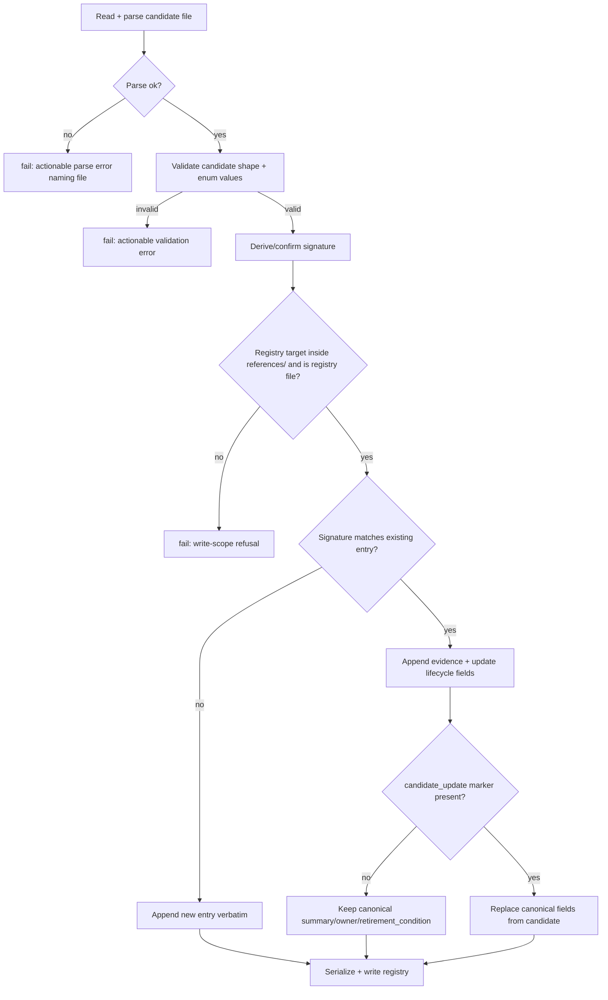

# feat: Add the workflow learnings registry helper

**Target repo:** `nathanvale/claude-code-config` (this repo)

Origin issue: [#90](https://github.com/nathanvale/claude-code-config/issues/90)
Parent PRD: [#88](https://github.com/nathanvale/claude-code-config/issues/88)

---

## Problem Frame

The Issue-to-PR Workflow Learnings feature (PRD #88) separates four surfaces:
per-issue ledger (what one run observed), the **workflow learnings registry**
(canonical cross-run lifecycle and dedupe), the final response (attention
moment), and follow-up issues. This issue (#90) builds **only the registry
surface and its deterministic helper** — the registry file plus a focused
helper that validates registry metadata and upserts candidate learnings by
stable signature so repeated run evidence compounds without duplicating
canonical entries.

The helper must follow the codebase's established read-only-CLI /
named-mutation split (ADR 0002): deterministic parsing, validation, dedupe,
and upsert live behind a script; orchestration and user gates stay in prose.
Critically, the helper owns exactly one file (the registry) and must refuse to
write anything else — skills, runbook references, source code, or per-issue
ledgers.

This plan does **not** build the ship-time/fail-stop Workflow Learning Scan,
the ledger Workflow Learnings section, final-checkpoint commit-scope changes,
or `to-issues` integration. Those are sibling slices of PRD #88 tracked
separately.

---

## Requirements Traceability

The 6 confirmed acceptance criteria (issue #90), with the implementation unit
that advances each:

| AC | Summary | Unit |
| --- | --- | --- |
| AC1 | Registry exists as human-readable Markdown with a structured YAML block | U1 |
| AC2 | Helper validates required fields, dispositions, lifecycle statuses, owner classifications, confidence, candidate-file shape, dedupe/upsert | U2, U3 |
| AC3 | Upsert appends evidence + updates lifecycle without silently overwriting canonical fields unless candidate explicitly marks a canonical update | U4 |
| AC4 | Helper accepts JSON and YAML candidate files; malformed files fail with actionable errors | U3 |
| AC5 | Helper cannot write skills, runbook references, source code, per-issue ledgers, or any surface outside the registry it owns | U5 |
| AC6 | Tests cover accepted inputs, rejected malformed entries, dedupe/upsert, evidence append, lifecycle updates, canonical-overwrite protection, write-scope limits | U2-U5 co-located tests; anchored on U5 in `ac_mapping` |

Schema vocabulary is fixed by PRD #88's Implementation Decisions (not invented
here):

- **Dispositions:** `small-fix`, `file-follow-up`, `ignore`, `already-covered`,
  `needs-evidence`
- **Lifecycle statuses:** `open`, `filed`, `resolved`, `retired`
- **Confidence values:** `low`, `medium`, `high`
- **Owner classifications:** `skill-link`, `runbook-reference`,
  `cli-observability`, `workflow-contract`, `gotchas-guide` (the five
  gotchas-aligned repair surfaces named in PRD #88 decision "owner
  classifications should align with the existing gotchas ownership model")
- **Dedupe key:** stable `signature`
- **Canonical fields** (overwrite-protected): `summary`, `owner`,
  `retirement_condition` (PRD #88: "summary, owner, and retirement condition
  should not be overwritten by a routine evidence append unless the candidate
  explicitly marks the canonical record update")

---

## Key Technical Decisions

**KTD1 — Registry location and format.** The registry lives at
`runbooks/issue-to-pr-v2/references/workflow-learnings-registry.md`. This is
the "Issue-to-PR runbook documentation area" the PRD names, and it follows the
existing `references/` naming convention. The file is human-readable Markdown
with a single fenced YAML code block holding the structured registry data
(mirrors the ledger's `## Batches` / `## Findings data` YAML-in-Markdown
pattern in `runbooks/issue-to-pr-v2/issue-N-ledger.template.md`). The YAML
block is the machine source of truth; surrounding prose documents the schema
for human reviewers.

**KTD2 — Helper placement and entry shape.** The helper is a new script,
`runbooks/issue-to-pr-v2/learnings-registry.ts`, with its core logic factored
into `runbooks/issue-to-pr-v2/lib/learnings.ts` (parse / validate / upsert /
serialize) so it is unit-testable without spawning. The script is a thin flag
dispatcher mirroring `decompose.ts` (`args[0] === "--flag"` checks, `fail()`
for usage errors). Two operations, matching PRD #88 ("expose at least
validation and upsert operations"):

- `learnings-registry.ts --validate <registry-path>` — validate the registry
  file's shape; exit non-zero with an actionable message on any violation.
- `learnings-registry.ts --upsert <registry-path> <candidate-path>` —
  validate the candidate, then dedupe-by-signature and upsert into the
  registry, writing the updated registry file.

**KTD3 — Reuse `Bun.YAML.parse`; no new dependency.** AC4 needs JSON + YAML
candidate parsing. Bun 1.3.11 ships `Bun.YAML.parse` natively, and `JSON.parse`
is built in. The repo's only runtime dependency stays `@logtape/logtape`; this
plan adds none. Candidate file type is selected by extension (`.json` →
`JSON.parse`; `.yaml`/`.yml` → `Bun.YAML.parse`); on a parse throw, the helper
re-throws an actionable error naming the file and the underlying parser
message.

**KTD4 — Stable signature dedupe.** Each registry entry carries a `signature`
string that is the dedupe key. Upsert matches an incoming candidate to an
existing entry by exact `signature` equality. If no `signature` is supplied on
the candidate, derive a deterministic one via the existing
`sha256Digest(payload)` primitive in `lib/digest.ts` over the candidate's
identifying fields (affected surface + what-was-wrong + owner), so the same
observation across runs collides on one entry. Reusing `sha256Digest` keeps
the digest format consistent with the rest of the runtime and avoids a second
hashing convention.

**KTD5 — Write-scope enforcement (AC5).** The helper only ever opens the
single registry path passed to `--validate` / `--upsert` for writing, and that
path must resolve (after normalization) inside
`runbooks/issue-to-pr-v2/references/` AND match the registry filename. Any
other resolved write target — a skill, another reference, a `lib/*.ts` source
file, or a `docs/runbooks/issue-to-pr/issue-*-ledger.md` path — is refused
before any write with an actionable error. Path comparison normalizes
separators and strips `./`, and rejects `..` traversal (mirrors the
`normalizePath` helper already in `decompose.ts`). The candidate file is only
ever **read**, never written, so a candidate path pointing at a forbidden
surface is harmless but the registry-target check is the load-bearing guard.

**KTD6 — Canonical-field overwrite protection (AC3).** On upsert into an
existing entry, the helper **always** appends the candidate's run evidence to
the entry's `evidence` list and **may** update lifecycle fields
(`status`, `disposition`, `confidence`, follow-up link). It does **not**
overwrite the canonical fields (`summary`, `owner`, `retirement_condition`)
unless the candidate sets an explicit marker — `canonical_update: true`. When
that marker is absent and a candidate supplies a differing canonical value, the
existing canonical value wins silently-but-recorded (the divergence is not
applied; no error). When the marker is present, the candidate's canonical
fields replace the stored ones. New entries (no signature match) take all
fields from the candidate as-is.

---

## High-Level Technical Design

This illustrates the intended approach and is directional guidance for review,
not implementation specification. The implementing agent should treat it as
context, not code to reproduce.

Registry entry shape (the YAML block holds `learnings: [ ... ]`):

```yaml
learnings:
  - signature: "sha256:..."        # dedupe key (KTD4)
    summary: "..."                 # canonical (overwrite-protected)
    owner: "runbook-reference"     # canonical; one of 5 classifications
    retirement_condition: "..."    # canonical (overwrite-protected)
    disposition: "file-follow-up"  # lifecycle; one of 5 dispositions
    status: "open"                 # lifecycle; one of 4 statuses
    confidence: "high"             # lifecycle; one of 3 values
    follow_up: null                # lifecycle; tracker link when filed
    evidence:                      # append-only run evidence
      - run: "issue-90"
        affected_surface: "..."
        what_was_wrong: "..."
        discovery_method: "..."
        root_cause: "..."
        scope: "..."
        proposed_fix: "..."
        verification_idea: "..."
```

Upsert decision flow:



---

## Output Structure

New files this plan creates (under the existing runbook tree):

```text
runbooks/issue-to-pr-v2/
├── references/
│   └── workflow-learnings-registry.md      # U1: registry file (Markdown + YAML block)
├── lib/
│   ├── learnings.ts                        # U2-U4: parse/validate/upsert/serialize core
│   └── learnings.test.ts                   # U2-U4: co-located unit tests
├── learnings-registry.ts                   # U2,U5: thin flag dispatcher (helper entry)
└── learnings-registry.test.ts              # U3,U5: helper-entry + write-scope tests
```

---

## Implementation Units

### U1. Create the workflow learnings registry file

**Goal:** A repo-level Workflow Learnings registry exists in the Issue-to-PR
runbook documentation area as human-readable Markdown with a structured YAML
block. (AC1)

**Requirements:** AC1. Honors PRD #88 decisions "registry in the Issue-to-PR
runbook documentation area", "format is a YAML block inside Markdown".

**Dependencies:** none.

**Files:**
- `runbooks/issue-to-pr-v2/references/workflow-learnings-registry.md` (create)

**Approach:** Author a Markdown reference that opens with prose documenting the
registry's purpose, the entry schema (canonical vs lifecycle fields, the five
owner classifications, five dispositions, four statuses, three confidence
values, the signature dedupe key), and the canonical-overwrite rule. Follow it
with a single fenced YAML code block seeded with `learnings: []` (empty
registry). Mirror the documentation tone of the sibling files in
`references/` and the YAML-in-Markdown layout of
`runbooks/issue-to-pr-v2/issue-N-ledger.template.md`.

**Patterns to follow:** `runbooks/issue-to-pr-v2/issue-N-ledger.template.md`
(YAML block embedded in documented Markdown); existing `references/*.md` prose
style.

**Test scenarios:** `Test expectation: none -- pure documentation/scaffolding
file with no behavior. Its parseability is exercised by U2's validation tests,
which load this file as the empty-registry fixture baseline.`

**Verification:** The file exists, renders as readable Markdown, and its YAML
block parses via `Bun.YAML.parse` to `{ learnings: [] }`.

```yaml
id: registry-file
name: Create the workflow learnings registry file
goal: A repo-level Workflow Learnings registry exists in the Issue-to-PR runbook documentation area as human-readable Markdown with a structured YAML block.
files:
  - runbooks/issue-to-pr-v2/references/workflow-learnings-registry.md
depends_on: []
execution_mode: proof_first
acceptance_tests:
  - "AC 1 holds: the registry file exists at runbooks/issue-to-pr-v2/references/workflow-learnings-registry.md as Markdown, and its single fenced yaml block parses to { learnings: [] }."
ac_mapping:
  - 1
rationale: "proof_first: greenfield scaffold file; the right first move is a target-state parse check (Bun.YAML.parse yields { learnings: [] }) before/with creating it, as a red test would be artificial for a static doc."
```

### U2. Registry parse, schema validation, and the `--validate` operation

**Goal:** A focused helper validates required fields, allowed dispositions,
allowed lifecycle statuses, owner classifications, confidence values, and
candidate-file shape. (AC2, in part)

**Requirements:** AC2, AC6. Honors PRD #88 "a helper to validate the registry
shape" and the enumerated vocabularies.

**Dependencies:** U1.

**Files:**
- `runbooks/issue-to-pr-v2/lib/learnings.ts` (create — registry/candidate
  parse + validation core)
- `runbooks/issue-to-pr-v2/lib/learnings.test.ts` (create)
- `runbooks/issue-to-pr-v2/learnings-registry.ts` (create — flag dispatcher,
  wires `--validate`)

**Approach:** In `lib/learnings.ts`, define the entry schema constants (the
five owner classifications, five dispositions, four statuses, three confidence
values) and a `parseRegistry(path)` that extracts the fenced YAML block from
the Markdown (regex matching the existing ledger approach in `lib/ledger.ts`)
and `Bun.YAML.parse`s it. Add `validateRegistry(registry)` that checks every
entry for required fields and enum membership, accumulating actionable errors.
In `learnings-registry.ts`, wire `--validate <registry-path>` to parse +
validate and `fail()` with the first/aggregated violation. Reuse the
`fail()`/exit-code conventions from `decompose.ts`.

**Patterns to follow:** `runbooks/issue-to-pr-v2/decompose.ts` (flag
dispatcher, `fail()` usage); `lib/ledger.ts` (fenced-YAML extraction regex,
field validation accumulation); `lib/contract.ts` (enum constant arrays as
`as const` with derived union types).

**Test scenarios** (in `lib/learnings.test.ts` unless noted):
- Happy path: a registry with one fully-valid entry passes `validateRegistry`
  with zero errors.
- Happy path: the seeded empty registry from U1 (`learnings: []`) validates
  clean.
- Edge: entry missing a required field (e.g. `summary`) → validation error
  naming the field and the entry signature/index.
- Error: `disposition` outside the five allowed values → actionable error
  listing the allowed set.
- Error: `status` outside the four allowed values → actionable error.
- Error: `owner` outside the five classifications → actionable error.
- Error: `confidence` outside `low|medium|high` → actionable error.
- Integration: `learnings-registry.ts --validate <valid-registry>` exits 0;
  `--validate <invalid-registry>` exits non-zero with the violation on stderr
  (exercise via the helper entry, not just the lib function).

**Verification:** `--validate` passes for a well-formed registry and fails with
a specific, actionable message for each kind of violation above.

```yaml
id: validate-op
name: Registry parse, schema validation, and the --validate operation
goal: A focused helper validates required fields, allowed dispositions, allowed lifecycle statuses, owner classifications, and confidence values.
files:
  - runbooks/issue-to-pr-v2/lib/learnings.ts
  - runbooks/issue-to-pr-v2/lib/learnings.test.ts
  - runbooks/issue-to-pr-v2/learnings-registry.ts
depends_on:
  - registry-file
execution_mode: tdd
acceptance_tests:
  - "AC 2 holds: validateRegistry accepts a well-formed entry and rejects each of missing-required-field, bad disposition, bad status, bad owner, and bad confidence with an actionable error; --validate surfaces the same via exit code."
ac_mapping:
  - 2
rationale: null
```

### U3. Candidate-file ingestion (JSON + YAML) and candidate-shape validation

**Goal:** The helper accepts both JSON and YAML candidate files, and malformed
candidate files fail with actionable errors; candidate shape is validated.
(AC4, and AC2's candidate-file-shape clause)

**Requirements:** AC4, AC2 (candidate shape), AC6. Honors PRD #88 "helper input
to come from JSON or YAML files".

**Dependencies:** U2.

**Files:**
- `runbooks/issue-to-pr-v2/lib/learnings.ts` (modify — add
  `loadCandidate(path)` + `validateCandidate(candidate)`)
- `runbooks/issue-to-pr-v2/lib/learnings.test.ts` (modify)

**Approach:** Add `loadCandidate(path)` that selects parser by extension
(`.json` → `JSON.parse`; `.yaml`/`.yml` → `Bun.YAML.parse`), wrapping parse
failures in an error that names the file and includes the underlying parser
message (KTD3). An unrecognized extension is itself an actionable error. Add
`validateCandidate(candidate)` reusing the enum checks from U2 plus
candidate-only fields (the `evidence` run record, optional `signature`,
optional `canonical_update` marker). No new dependency.

**Patterns to follow:** U2's validation accumulation; `decompose.ts` actionable
`fail()` messages.

**Test scenarios:**
- Happy path: a valid `.json` candidate loads and validates.
- Happy path: an equivalent valid `.yaml` candidate loads and validates to the
  same structure (parser-parity assertion).
- Happy path: `.yml` extension is accepted.
- Error: malformed JSON (truncated / trailing comma) → actionable error naming
  the file and the JSON parser message.
- Error: malformed YAML (bad indentation) → actionable error naming the file
  and the YAML parser message.
- Error: unrecognized extension (e.g. `.txt`) → actionable error.
- Error: candidate with an invalid enum value (bad disposition) → rejected by
  `validateCandidate` with the same actionable error shape as U2.
- Edge: candidate missing the `evidence` run record → validation error.

**Verification:** Both JSON and YAML valid candidates parse to equivalent
structures and validate; each malformed-input class fails with a message that
names the file and the cause.

```yaml
id: candidate-ingest
name: Candidate-file ingestion (JSON + YAML) and candidate-shape validation
goal: The helper accepts both JSON and YAML candidate files, and malformed candidate files fail with actionable errors.
files:
  - runbooks/issue-to-pr-v2/lib/learnings.ts
  - runbooks/issue-to-pr-v2/lib/learnings.test.ts
depends_on:
  - validate-op
execution_mode: tdd
acceptance_tests:
  - "AC 4 holds: a valid JSON candidate and an equivalent valid YAML candidate both load to the same validated structure; malformed JSON, malformed YAML, and unrecognized-extension inputs each fail with an actionable error naming the file."
ac_mapping:
  - 4
rationale: null
```

### U4. Signature dedupe, evidence append, lifecycle update, and canonical-overwrite protection

**Goal:** Upsert appends run evidence and updates lifecycle fields without
silently overwriting canonical fields such as summary, owner, or retirement
condition unless the candidate explicitly marks a canonical update. (AC3, plus
AC2's dedupe/upsert clause) Wires the `--upsert` operation.

**Requirements:** AC3, AC2 (dedupe/upsert), AC6. Honors PRD #88 decisions on
signature dedupe, evidence append, and canonical-field protection.

**Dependencies:** U3.

**Files:**
- `runbooks/issue-to-pr-v2/lib/learnings.ts` (modify — add `signatureFor`,
  `upsert`, `serializeRegistry`)
- `runbooks/issue-to-pr-v2/lib/learnings.test.ts` (modify)
- `runbooks/issue-to-pr-v2/learnings-registry.ts` (modify — wire
  `--upsert <registry-path> <candidate-path>`)

**Approach:** Add `signatureFor(candidate)` that returns an explicit candidate
`signature` when present, else derives one via `sha256Digest` over the
identifying fields (KTD4). Add `upsert(registry, candidate)` implementing the
KTD6 decision flow: signature match → append `evidence` + update lifecycle
fields (`status`, `disposition`, `confidence`, `follow_up`); canonical fields
(`summary`, `owner`, `retirement_condition`) replaced only when
`canonical_update: true`, otherwise preserved. No match → append the new entry.
Add `serializeRegistry(registry)` that re-emits the Markdown with the updated
YAML block (preserve the documentation prose; replace only the fenced block).
Wire `--upsert` to load+validate candidate, enforce write-scope (U5), upsert,
and write the file.

**Patterns to follow:** `lib/digest.ts` `sha256Digest`; `lib/ledger.ts` fenced
YAML block replacement / serialization.

**Test scenarios:**
- Happy path (new entry): upserting a candidate whose signature matches nothing
  appends a new entry with all candidate fields.
- Happy path (dedupe): upserting a candidate whose signature matches an
  existing entry does **not** add a second entry — count stays the same.
- Evidence append: the matched entry's `evidence` list grows by exactly one
  run record; prior evidence is retained in order.
- Lifecycle update: `status`/`disposition`/`confidence`/`follow_up` from the
  candidate overwrite the matched entry's lifecycle fields.
- Canonical protection (default): candidate with a differing `summary`/`owner`/
  `retirement_condition` and **no** `canonical_update` marker leaves the stored
  canonical fields unchanged while still appending evidence.
- Canonical update (explicit): candidate with `canonical_update: true` replaces
  the stored canonical fields.
- Derived signature: two candidates with identical identifying fields and no
  explicit signature derive the same signature and collide on one entry.
- Round-trip: after `--upsert`, re-reading the registry and validating it
  (U2) passes, and the documentation prose around the YAML block is preserved.

**Verification:** Repeated upserts of the same observation compound evidence on
one entry; lifecycle fields move; canonical fields hold unless explicitly
updated; the serialized registry round-trips through `--validate`.

```yaml
id: upsert-op
name: Signature dedupe, evidence append, lifecycle update, and canonical-overwrite protection
goal: Upsert appends run evidence and updates lifecycle fields without silently overwriting canonical fields such as summary, owner, or retirement condition unless the candidate explicitly marks a canonical update.
files:
  - runbooks/issue-to-pr-v2/lib/learnings.ts
  - runbooks/issue-to-pr-v2/lib/learnings.test.ts
  - runbooks/issue-to-pr-v2/learnings-registry.ts
depends_on:
  - candidate-ingest
execution_mode: tdd
acceptance_tests:
  - "AC 3 holds: upsert by matching signature appends evidence and updates lifecycle fields, preserves canonical summary/owner/retirement_condition by default, and replaces them only when the candidate sets canonical_update: true; a non-matching signature appends a new entry."
ac_mapping:
  - 3
  - 2
rationale: "ac_mapping includes 2 because this unit also satisfies AC2's dedupe/upsert-behavior clause; AC2's enum-validation clause is covered by U2."
```

### U5. Write-scope enforcement: registry-only writes

**Goal:** The helper cannot write skills, runbook references, source code,
per-issue ledgers, or any surface outside the registry metadata it owns. (AC5)

**Requirements:** AC5, AC6. Honors PRD #88 "the helper may write registry
metadata only. It must not edit skills, runbook references, source code, or
per-issue ledgers."

**Dependencies:** U4 (the write path being guarded must exist).

**Files:**
- `runbooks/issue-to-pr-v2/lib/learnings.ts` (modify — add
  `assertRegistryWriteTarget(path)`)
- `runbooks/issue-to-pr-v2/learnings-registry.ts` (modify — call the guard
  before any write in `--upsert`)
- `runbooks/issue-to-pr-v2/learnings-registry.test.ts` (create — write-scope
  + helper-entry integration tests)

**Approach:** Add `assertRegistryWriteTarget(path)` that normalizes the target
(separators, strip `./`, reject `..` traversal — mirror `normalizePath` in
`decompose.ts`) and refuses unless the resolved path is inside
`runbooks/issue-to-pr-v2/references/` AND matches the registry filename
(`workflow-learnings-registry.md`). Any other target — a skill under
`skills/`, another `references/*.md`, a `lib/*.ts` source file, or a
`docs/runbooks/issue-to-pr/issue-*-ledger.md` ledger — fails before the write
with an actionable refusal naming the rejected path. Call it as the first step
of the `--upsert` write, after candidate validation. This is the load-bearing
AC5 guard (KTD5).

**Patterns to follow:** `decompose.ts` `normalizePath` and the Stage 5
read-only gate's "fail naming the first offending non-allowed path" style.

**Test scenarios** (in `learnings-registry.test.ts`):
- Happy path: `--upsert` with the canonical registry path writes successfully.
- Write-scope refusal: `--upsert` targeting a `skills/...md` path → refused, no
  write, actionable error.
- Write-scope refusal: targeting a different `references/*.md` (not the
  registry filename) → refused.
- Write-scope refusal: targeting a `lib/learnings.ts` source path → refused.
- Write-scope refusal: targeting a
  `docs/runbooks/issue-to-pr/issue-90-ledger.md` per-issue ledger → refused.
- Traversal refusal: a path containing `..` that escapes `references/` →
  refused.
- No-side-effect assertion: after each refusal, the forbidden target file is
  unmodified on disk (read before/after, assert unchanged).
- Candidate path is read-only: pointing the candidate (not the registry) at a
  forbidden surface still only reads it; the registry write target governs.

**Verification:** Every non-registry write target is refused before any write,
with the forbidden file proven unmodified; only the owned registry path is
writable.

```yaml
id: write-scope
name: Write-scope enforcement - registry-only writes
goal: The helper cannot write skills, runbook references, source code, per-issue ledgers, or any surface outside the registry metadata it owns.
files:
  - runbooks/issue-to-pr-v2/lib/learnings.ts
  - runbooks/issue-to-pr-v2/learnings-registry.ts
  - runbooks/issue-to-pr-v2/learnings-registry.test.ts
depends_on:
  - upsert-op
execution_mode: tdd
acceptance_tests:
  - "AC 5 holds: --upsert writes only the owned registry path; targeting a skill, another reference, a lib source file, a per-issue ledger, or a traversal path is refused before any write, and the forbidden file is proven unmodified."
  - "AC 6 holds: the co-located test suites across U2-U5 cover accepted inputs, rejected malformed entries, dedupe/upsert behavior, evidence append, lifecycle updates, canonical-field overwrite protection, and write-scope limits."
ac_mapping:
  - 5
  - 6
rationale: "ac_mapping includes 6 because AC6 is a cross-cutting test-coverage requirement satisfied by the co-located test suites across U2-U5, not by a standalone unit; it is anchored here on the final test-bearing unit (which also delivers AC6's explicitly-named write-scope-limits tests)."
```

---

## System-Wide Impact

- **New helper surface** in `runbooks/issue-to-pr-v2/`. It is additive: no
  existing helper, CLI command, or reference changes behavior. The new script
  is not yet wired into any stage (PRD #88's ship-time scan is a separate
  slice), so there is no orchestration-loop impact in this issue.
- **New owned file** at `references/workflow-learnings-registry.md`. Because it
  lives under `references/`, confirm it does not get mistaken for a stage
  reference by the runbook's reference-loading policy (it is not in any route's
  `required_reference_ids`, so it will not be auto-loaded — acceptable).
- **Test surface** grows with co-located `*.test.ts` files run by the existing
  Bun suite; no test-runner config changes needed.
- **No new dependency** (KTD3). The `@logtape/logtape`-only dependency profile
  is preserved.

---

## Scope Boundaries

In scope: the registry file, the validate + upsert helper, the schema
vocabulary validation, JSON/YAML candidate ingestion, signature dedupe,
evidence append, lifecycle update, canonical-overwrite protection, write-scope
enforcement, and the tests covering all of these.

### Deferred to Follow-Up Work

These are sibling slices of PRD #88, not part of issue #90:

- The ship-time / fail-stop Workflow Learning Scan (read-only reflection pass).
- The required per-issue ledger `## Workflow Learnings` section and its
  validation.
- Final-checkpoint commit-scope changes to accept a registry-only metadata
  write alongside the ledger.
- `to-issues` integration for confirmed `file-follow-up` learnings.
- Final-response count/attention-item formatting.
- Wiring the helper into any Issue-to-PR stage or `cli.ts` route.

### Non-Goals (PRD #88 "Out of Scope")

- Auto-editing skills, runbook references, CLI code, or docs during a ship
  tail.
- Auto-creating GitHub issues without approval.
- A dashboard/UI for workflow learnings.
- Replacing the first-run gotchas guide.

---

## Deferred Implementation Notes

- Exact internal function names (`parseRegistry`, `loadCandidate`, `upsert`,
  `assertRegistryWriteTarget`, etc.) are directional; the implementer may
  rename for clarity as long as the helper flags (`--validate`, `--upsert`) and
  the external behavior hold.
- The precise required-vs-optional split for candidate fields (e.g. whether
  `retirement_condition` is required on a new entry or may be null until known)
  should be settled against the U1 schema prose during implementation; the
  test scenarios fix the behaviors that matter, not the field-optionality
  table.
- Whether `serializeRegistry` re-emits via `Bun.YAML`'s stringifier or a
  hand-rolled emitter (to match the constrained YAML style the rest of the
  runbook uses) is an implementation choice; the round-trip-through-`--validate`
  test (U4) is the guardrail.
