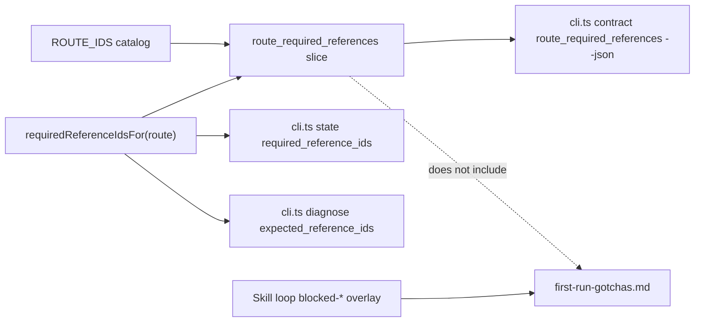

# feat: Emit Issue-to-PR route/reference contract

## Summary

Expose the Issue-to-PR v2 route-to-required-reference mapping through a runtime-owned CLI contract slice, then prune operator prose that currently mirrors the same mapping by hand. Keep blocked-route gotchas loading as a skill-loop overlay, not as a required reference.

---

## Problem Frame

Issue-to-PR v2 already routes from `cli.ts state --json`, but operator docs still carry hand-maintained route/reference tables. That duplicates runtime-owned facts, raises operator cognitive load, and creates drift risk when `lib/route.ts` changes.

Parent issue #105 names this as the first migration slice because route IDs and required references already have runtime ownership. This plan makes that ownership consumable through the CLI before removing prose duplication.

---

## Requirements

- R1. Emit a complete route-to-required-reference mapping from runtime-owned route logic.
- R2. Surface the new slice in the CLI help contract catalog.
- R3. Preserve catalog ordering semantics for route progression and blocked-route precedence.
- R4. Keep `state --json` and `diagnose --json` symmetric with the mapping used by the new slice.
- R5. Prune operator prose that manually duplicates route/reference tables once the emitted contract is available.
- R6. Keep `first-run-gotchas.md` outside `required_reference_ids`; preserve deterministic skill-loop loading on `blocked-*` routes.
- R7. Keep runtime contract drift, route, and CLI tests passing.

---

## Scope Boundaries

### In scope

- Add a CLI contract slice named `route_required_references`.
- Build the slice from the same route catalog and required-reference helper used by `state` and `diagnose`.
- Keep the generic `contract <slice> --json` response shape: `slice`, `values`, `ordering`.
- Use `ordering: "catalog"` for the slice.
- Represent each slice value as `{ route_id, required_reference_ids }`.
- Update tests for slice catalog presence, ordering, mapping completeness, state/diagnose parity, and gotchas exclusion.
- Replace hand-maintained route/reference tables in operator-facing docs with short pointers to the emitted contract and runtime source.
- Keep human stop wording, stage intent, and judgment-heavy orchestration prose.

### Deferred to Follow-Up Work

- Ledger schema contract slices and ledger prose pruning: child issue #107.
- Packet command/schema pruning: child issue #108.
- Findings lifecycle runtime ownership: child issue #109.
- Stage 4 hard dispatch eligibility extraction: child issue #110.
- Persona selector extraction: child issue #111.
- Diagnostic recovery facts and gotchas guide shrinkage: child issue #112.
- Generated markdown contract views or `cli.ts explain` output. This slice only emits JSON.

### Out of scope

- Changing route classification, route IDs, or required-reference values.
- Adding `first-run-gotchas.md` to `requiredReferenceIdsFor`.
- Changing the six-stage workflow.
- Moving judgment-heavy route actions into the CLI.
- Creating a broad docs auditor.
- Adding dependencies.

---

## Context & Research

### Relevant Code and Patterns

- `runbooks/issue-to-pr-v2/lib/route.ts` owns `ROUTE_IDS`, `classifyRoute`, and `requiredReferenceIdsFor`.
- `runbooks/issue-to-pr-v2/cli.ts` owns `CONTRACT_SLICES`, `CONTRACT_SLICE_VALUES`, `HELP_DATA`, `state`, `diagnose`, and `contract` command output.
- `runbooks/issue-to-pr-v2/lib/route.test.ts` already pins every route's `requiredReferenceIdsFor` value.
- `runbooks/issue-to-pr-v2/cli.test.ts` already tests contract slices, help data, state, and diagnose envelope shapes.
- `runbooks/issue-to-pr-v2/cli-smoke.test.ts` already iterates every help-documented slice and verifies process-boundary output.
- `runbooks/issue-to-pr-v2/contract-drift.ts` already validates scoped docs against live CLI facts and protects the gotchas relationship.
- `skills/issue-to-pr/SKILL.md` already has the deterministic blocked-route load step for `first-run-gotchas.md`.
- `runbooks/issue-to-pr-v2/references/ledger-and-helper.md` still mirrors route catalog details in prose.
- `runbooks/issue-to-pr-v2/issue-to-pr.md` still mirrors route/reference tables in the hot-router support artifact.

### Institutional Learnings

- No `docs/solutions/` entries exist in this worktree.
- `CONTEXT.md` defines "runtime contract drift check" as focused CLI-owned fact alignment, not broad docs auditing.
- ADR 0002: prose orchestrates judgment; deterministic mechanics belong behind CLI/script/runtime code.
- ADR 0004: hand-maintained prose must not duplicate deterministic workflow contracts; route tables and required-reference maps are code-owned surfaces.

### External References

- None. Local runtime patterns and accepted ADRs are sufficient.

---

## Key Technical Decisions

- D1. Add one structured contract slice, not a generated markdown view. #106 asks for a CLI contract slice; JSON keeps the agent-facing contract machine-readable and matches existing `contract <slice> --json` behavior.
- D2. Keep `route_required_references` values as records under the existing generic slice shape. Existing slices already use `values` plus `ordering`; `exit_codes` proves structured records are allowed.
- D3. Use `ordering: "catalog"`. `ROUTE_IDS` order carries stage progression and blocked-route precedence; consumers should not sort the mapping.
- D4. Derive the slice from `ROUTE_IDS` plus `requiredReferenceIdsFor`. Those runtime surfaces already own the catalog and per-route values. The new slice must be an emitted view, not a duplicate constant.
- D5. Keep `first-run-gotchas.md` out of the slice and out of `required_reference_ids`. Issue #106 explicitly preserves the blocked-route gotchas overlay as a skill-loop decision. The CLI emits required references; the skill adds the recovery overlay on `blocked-*`.
- D6. Prune only duplicated deterministic prose in this slice. Route actions, stop-and-ask wording, and human recovery decisions remain prose-owned under ADR 0002/0004.

---

## Open Questions

### Resolved During Planning

- Should the new surface be JSON or generated markdown? Resolution: JSON contract slice only. Generated human views stay deferred.
- Should `first-run-gotchas.md` appear in the new mapping? Resolution: no. Required references remain the runtime mapping; gotchas loading remains a skill-loop overlay.

### Deferred to Implementation

- Exact internal helper name for building slice values. Implementation may either add a small route helper or map directly in `cli.ts`; tests should lock behavior, not private helper shape.
- Exact prose deletion footprint. Implementation should prune the smallest duplicated tables while preserving route-action and stop wording that readers still need.

---

## High-Level Technical Design

*This illustrates the intended approach and is directional guidance for review, not implementation specification. The implementing agent should treat it as context, not code to reproduce.*

The core invariant: slice entries, `state.required_reference_ids`, and `diagnose.expected_reference_ids` all agree for the same route because they derive from the same runtime helper. The gotchas guide remains outside that helper and is loaded by the skill loop when `route_id` starts with `blocked-`.

---

## Implementation Units

### U1. Add route/reference contract values at the runtime seam

**Goal:** Provide a runtime-owned mapping from every route id to its required reference filenames.

**Requirements:** R1, R3, R6.

**Dependencies:** None.

**Files:**

- Modify: `runbooks/issue-to-pr-v2/lib/route.ts`
- Modify: `runbooks/issue-to-pr-v2/lib/route.test.ts`

**Approach:**

- Build the mapping from the existing route catalog and `requiredReferenceIdsFor`.
- Preserve `ROUTE_IDS` order exactly.
- Ensure every route appears exactly once.
- Keep `first-run-gotchas.md` absent from every required-reference list.
- Avoid a second hardcoded expected map in production code.

**Patterns to follow:**

- `requiredReferenceIdsFor` exhaustiveness guard in `lib/route.ts`.
- Existing per-route value mapping pin in `lib/route.test.ts`.

**Test scenarios:**

- Happy path: iterating the runtime mapping yields one entry per `ROUTE_IDS` member, in the same order.
- Happy path: each entry's `required_reference_ids` equals `requiredReferenceIdsFor(entry.route_id)`.
- Edge case: `shipped` appears with an empty required-reference list.
- Edge case: blocked routes appear in catalog precedence order.
- Error guard: no entry includes `first-run-gotchas.md`.
- Exhaustiveness: adding a future route without mapping support fails an existing route test or type check.

**Verification:**

- Route unit tests prove the mapping is complete, ordered, and derived from the existing required-reference helper.

---

### U2. Expose `route_required_references` through the CLI contract command

**Goal:** Make the route/reference mapping agent-discoverable through `cli.ts contract route_required_references --json`.

**Requirements:** R1, R2, R3, R6, R7.

**Dependencies:** U1.

**Files:**

- Modify: `runbooks/issue-to-pr-v2/cli.ts`
- Modify: `runbooks/issue-to-pr-v2/cli.test.ts`
- Modify: `runbooks/issue-to-pr-v2/cli-smoke.test.ts`

**Approach:**

- Add `route_required_references` to the contract slice catalog.
- Emit values as records with `route_id` and `required_reference_ids`.
- Set `ordering: "catalog"`.
- Update help data so agents can discover the slice from `--help --json`.
- Keep the existing `contract` envelope shape unchanged.

**Patterns to follow:**

- `route_ids` slice for catalog-order behavior.
- `exit_codes` slice for structured record values.
- Existing `contract_slices` help catalog tests.
- `cli-smoke.test.ts` process-boundary slice iteration.

**Test scenarios:**

- Happy path: `contract route_required_references --json` returns `status: ok`, `data.slice: "route_required_references"`, `ordering: "catalog"`, and non-empty `values`.
- Happy path: returned `values.map(route_id)` equals live `ROUTE_IDS`.
- Happy path: each returned record's `required_reference_ids` equals the runtime helper for that route.
- Edge case: the `shipped` record has `required_reference_ids: []` while the slice still passes smoke tests.
- Error guard: no returned record includes `first-run-gotchas.md`.
- Integration: `--help --json` includes `route_required_references` in `contract_slices`.
- Integration: the smoke test that invokes every documented contract slice passes without special-casing structured values.

**Verification:**

- CLI tests prove the new slice appears in help, emits the expected structure, preserves catalog order, and keeps gotchas outside required references.

---

### U3. Pin state/diagnose symmetry against the new slice

**Goal:** Prove `state`, `diagnose`, and the new contract slice agree on required references for each route they report.

**Requirements:** R4, R6, R7.

**Dependencies:** U2.

**Files:**

- Modify: `runbooks/issue-to-pr-v2/cli.test.ts`
- Modify: `runbooks/issue-to-pr-v2/cli-smoke.test.ts`

**Approach:**

- Add tests that resolve a route's expected references from the new contract slice.
- Compare `state --json` `data.required_reference_ids` to the matching slice record.
- Compare `diagnose --json` `data.expected_reference_ids` to the matching slice record.
- Cover representative happy, blocked, and terminal/no-ledger states with existing ledger fixtures.

**Patterns to follow:**

- Existing `state` and `diagnose` envelope tests in `cli.test.ts`.
- Existing process-boundary route-state fixtures in `cli-smoke.test.ts`.

**Test scenarios:**

- Happy path: a stage route's `state.required_reference_ids` equals the slice record for `state.route_id`.
- Happy path: a stage route's `diagnose.expected_reference_ids` equals the slice record for `diagnose.inferred_route_id`.
- Edge case: no-ledger state matches the `no-ledger` slice record.
- Edge case: shipped or terminal fixture matches the empty required-reference list when that state is represented by an existing fixture.
- Blocked path: stale AC, stale batch contract, stale digests, or version-skew fixture matches the relevant blocked-route slice record.
- Error guard: blocked-route state/diagnose outputs still omit `first-run-gotchas.md`; the skill loop owns that overlay.

**Verification:**

- CLI tests fail if `state`, `diagnose`, or the contract slice drift apart.

---

### U4. Prune duplicated operator route/reference prose

**Goal:** Replace hand-maintained route/reference tables with pointers to the emitted contract while preserving prose-owned orchestration.

**Requirements:** R5, R6.

**Dependencies:** U2.

**Files:**

- Modify: `skills/issue-to-pr/SKILL.md`
- Modify: `runbooks/issue-to-pr-v2/issue-to-pr.md`
- Modify: `runbooks/issue-to-pr-v2/references/ledger-and-helper.md`

**Approach:**

- Replace reference-loading tables that mirror `required_reference_ids` with a short rule: load `data.required_reference_ids`; inspect `contract route_required_references --json` when the full mapping is needed.
- Keep action-specific template loading prose because templates are not emitted in `required_reference_ids`.
- Keep stage shells, one-visible-action discipline, mandatory gates, and stop wording.
- Keep a short blocked-route recovery pointer to `first-run-gotchas.md` without making the guide a required reference.
- In `ledger-and-helper.md`, convert route catalog sections from mirrored route tables to source-of-truth pointers plus compact semantics needed for ledger interpretation.
- Leave `README.md` alone unless implementation discovers it mirrors route/reference members rather than acting as a finder.
- Avoid introducing new parallel policy while pruning.

**Patterns to follow:**

- ADR 0002 placement rule.
- ADR 0004 code-owned vs prose-owned surface split.
- Existing `SKILL.md` durable-state contract language: "Do not restate or hand-validate deterministic contracts."
- Existing `README.md` finder style: artifact pointers, not policy manuals.

**Test scenarios:**

- Test expectation: none for prose itself beyond drift tests in U5. This unit changes operator documentation and is verified by scoped drift checks plus human review.

**Verification:**

- Operator docs point to the emitted contract instead of restating the route/reference mapping.
- The blocked-route gotchas split remains explicit: deterministic skill-loop load on `blocked-*`, absent from `required_reference_ids` by design.

---

### U5. Update drift and regression checks for the new ownership boundary

**Goal:** Keep automated safeguards aligned with the new source of truth after prose pruning.

**Requirements:** R5, R6, R7.

**Dependencies:** U4.

**Files:**

- Modify: `runbooks/issue-to-pr-v2/contract-drift.ts`
- Modify: `runbooks/issue-to-pr-v2/contract-drift.test.ts`
- Modify: `runbooks/issue-to-pr-v2/stage-4-policy-drift.test.ts`

**Approach:**

- Ensure contract-drift extraction recognizes mentions of `cli.ts contract route_required_references --json` as a valid contract-slice claim.
- Preserve or update the gotchas relationship check so it verifies the current prose shape, not a deleted table shape.
- Keep the check focused: validate emitted contract claims and recovery links, not broad markdown quality.
- Review snippet-based regression tests that mention route/reference mapping, replacing old prose expectations with assertions against the emitted contract pointer or runtime source.

**Patterns to follow:**

- Existing `contract-drift.ts` distinction between scoped docs and contract values.
- Existing gotchas relationship check that avoids requiring `first-run-gotchas.md` in `required_reference_ids`.
- Existing fake stale-doc tests that prove a bogus route, command, slice, field, or link fails loudly.

**Test scenarios:**

- Happy path: real scoped docs pass contract drift after route/reference prose is pruned.
- Happy path: docs that mention `route_required_references` pass only when the slice exists in live help.
- Error path: a fixture doc that names a bogus route/reference slice fails with a finding naming the stale token.
- Error path: removing the deterministic blocked-route gotchas load from `SKILL.md` still fails the gotchas relationship check.
- Error path: adding `first-run-gotchas.md` to a required-reference mapping fails a route or CLI test.
- Integration: snippet-based drift tests no longer depend on removed tables.

**Verification:**

- Runtime contract drift check passes over the scoped docs.
- Regression tests prove the new contract owner is the CLI slice, while gotchas remains a skill-loop decision.

---

## System-Wide Impact

- **CLI contract consumers:** Agents can discover the full route/reference mapping through `--help --json` and `contract route_required_references --json`.
- **Issue-to-PR operators:** Hot prose gets shorter; operators route from state/diagnose facts and inspect the emitted mapping when needed.
- **Maintainers:** Route/reference changes become reviewable at `lib/route.ts` plus CLI tests instead of prose tables across multiple docs.
- **Runtime drift check:** Its scope stays focused on CLI-owned facts and recovery links, but its anchors may need to move away from deleted table sections.
- **Unchanged invariant:** The CLI emits facts only. The skill and hot-router prose still decide when those facts matter and when to stop for a user.

---

## Risks & Dependencies

- Structured record values in a contract slice expose assumptions in generic slice consumers. Mitigation: `exit_codes` already uses structured records; smoke tests iterate every documented slice at the process boundary.
- Prose pruning removes useful operator judgment along with duplicated mapping facts. Mitigation: prune only deterministic route/reference tables; preserve stage shells, gates, stop wording, and gotchas overlay explanation.
- Gotchas guide accidentally becomes part of required references during implementation. Mitigation: add explicit absent-from-required-reference tests at route and CLI layers.
- Drift checker still expects old table headings after prose changes. Mitigation: update drift anchors to the new pointer-based prose and keep fake stale-doc coverage.
- Dependency: Existing route, CLI, smoke, and drift tests are the safety net for this slice.

---

## Documentation / Operational Notes

- No install step is planned; the repo's installed skill/runbook paths are symlinked through `install.sh`.
- PR description should call out that `first-run-gotchas.md` remains outside `required_reference_ids` by design.
- Mention child issues #107-#112 as follow-up slices, not as work completed here.

---

## Sources & References

- GitHub issue: #106, "Emit route/reference contract and prune route prose"
- Parent PRD: #105, "PRD: Dedupe Issue-to-PR deterministic workflow contracts"
- ADR: `docs/adr/0002-runbooks-and-skills-use-prose-as-orchestrator.md`
- ADR: `docs/adr/0004-deterministic-workflow-contracts-live-in-code.md`
- Domain language: `CONTEXT.md`
- Runtime route logic: `runbooks/issue-to-pr-v2/lib/route.ts`
- CLI contract surface: `runbooks/issue-to-pr-v2/cli.ts`
- Drift check: `runbooks/issue-to-pr-v2/contract-drift.ts`
- Skill control plane: `skills/issue-to-pr/SKILL.md`
