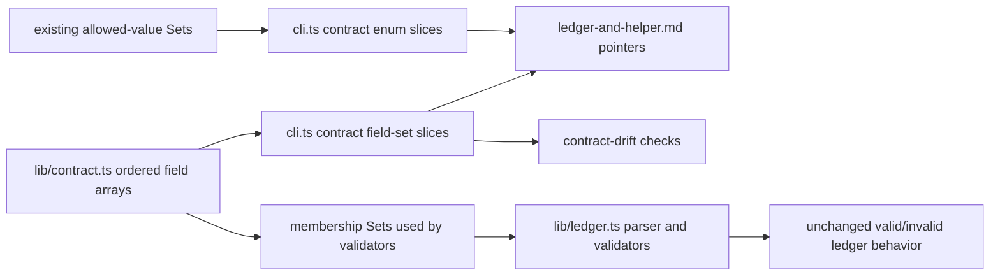

# feat: Emit Issue-to-PR ledger schema contracts

## Summary

Expose Issue-to-PR v2 ledger schema field sets and missing allowed-value enums through runtime-owned CLI contract slices, then prune ledger docs that manually list those members. Keep the ledger parser and validators behavior-preserving: this slice changes contract discovery and prose ownership, not ledger semantics.

---

## Problem Frame

Issue #105 identifies ledger schema prose as the next duplication hotspot after route/reference facts. `lib/contract.ts` and `lib/ledger.ts` already own the key sets and validators, but `ledger-and-helper.md` and `issue-N-ledger.template.md` still carry hand-maintained field/member lists that can drift while looking authoritative.

Issue #107 narrows this slice to ledger schema contracts: candidate batch fields, ledger batch lifecycle fields, Builder attempt fields, Orchestrator-inline attempt fields, finding fields, and related allowed values.

---

## Requirements

- R1. Runtime-owned contract facts expose candidate batch fields.
- R2. Runtime-owned contract facts expose ledger batch lifecycle fields.
- R3. Runtime-owned contract facts expose Builder attempt fields.
- R4. Runtime-owned contract facts expose Orchestrator-inline attempt fields.
- R5. Runtime-owned contract facts expose finding fields.
- R6. Runtime-owned contract facts expose related allowed values not already available through CLI contract slices.
- R7. Emitted facts are discoverable through `cli.ts contract <slice> --json` and `--help --json`.
- R8. Ledger docs keep section purpose, authorship, and confirmation guidance while removing duplicated field/member lists where runtime facts now own them.
- R9. Ledger template and ledger documentation drift checks still protect lifecycle field presence or the emitted contract pointer that replaced a prose list.
- R10. Ledger parser and validator behavior remains unchanged for valid and invalid ledgers.
- R11. Runtime contract drift and relevant ledger/CLI tests pass.

---

## Scope Boundaries

- Do not change the six-stage Issue-to-PR workflow.
- Do not change ledger parsing, validation, digest computation, route classification, or emitted ledger YAML.
- Do not add `cli.ts` mutation behavior.
- Do not create a generated markdown contract view in this slice.
- Do not migrate frontmatter schema, blocked-reason values, Workflow Learnings schema, packet schemas, findings lifecycle closure rules, or diagnostic recovery recipes.
- Do not bump `RUNBOOK_VERSION`; this is a discovery/prose ownership change, not a ledger interpretation change.
- Do not add dependencies.

### Deferred to Follow-Up Work

- Findings lifecycle runtime ownership: issue #109.
- Packet command/schema pruning: issue #108.
- Diagnostic recovery facts and gotchas guide shrinkage: issue #112.
- Frontmatter and Workflow Learnings schema extraction, if later required; issue #107 scope names batch/attempt/finding schema surfaces only.
- TS-owned template contracts/renderers for packet and ledger YAML scaffolds: issue #113. Implement after this #107 slice lands. Future work should extract pure renderers from existing helper code so CLI scaffold/packet commands and/or generated templates reuse the same field tuples, lifecycle defaults, packet contracts, `RUNBOOK_VERSION`, and YAML rendering instead of maintaining hand-authored YAML fragments across packet templates and the ledger scaffold.

---

## Context & Research

### Relevant Code and Patterns

- `runbooks/issue-to-pr-v2/lib/contract.ts` owns `BATCH_KEYS`, `LEDGER_BATCH_KEYS`, `BUILDER_ATTEMPT_KEYS`, `ORCHESTRATOR_INLINE_ATTEMPT_KEYS`, `FINDING_KEYS`, status/value sets, and `RUNBOOK_VERSION`.
- `runbooks/issue-to-pr-v2/lib/contract.test.ts` already pins those sets and subset relationships.
- `runbooks/issue-to-pr-v2/lib/ledger.ts` consumes those sets for parse/validate behavior and emits lifecycle defaults in `emit`.
- `runbooks/issue-to-pr-v2/cli.ts` owns `CONTRACT_SLICES`, `CONTRACT_SLICE_VALUES`, `HELP_DATA`, and the generic `contract <slice> --json` envelope.
- `runbooks/issue-to-pr-v2/cli.test.ts` and `cli-smoke.test.ts` already test contract slices, help discoverability, ordering, and process-boundary output.
- `runbooks/issue-to-pr-v2/contract-drift.ts` already imports `BATCH_KEYS` and `LEDGER_BATCH_KEYS` for a narrow lifecycle-field check. This needs to move toward the emitted contract facts for issue #107.
- `runbooks/issue-to-pr-v2/references/ledger-and-helper.md` contains the duplicated schema prose to shrink.
- `runbooks/issue-to-pr-v2/issue-N-ledger.template.md` is an authoring template, not just prose; it still needs enough concrete field names to show the actual ledger skeleton.

### Institutional Learnings

- No `docs/solutions/` entries exist in this worktree.
- ADR 0002 says prose orchestrates judgment while deterministic mechanics live behind a CLI or script.
- ADR 0004 says hand-maintained prose may name a runtime contract or emitting command, but must not restate deterministic contract members.
- ADR 0005 says hand-authored templates may frame handoffs, but repeatable packet, ledger, evidence, and YAML scaffold contracts must be runtime-owned or generated/emitted from runtime sources.
- Parent issue #105 orders this as slice 2 after route/reference extraction.

### External References

- None. Local runtime contracts and accepted ADRs are sufficient.

---

## Key Technical Decisions

- Add CLI contract slices rather than generated markdown. Issue #107 allows either; CLI slices match issue #106, keep facts machine-readable, and avoid a new generated-doc workflow.
- Add field-set slices for each named schema surface: `candidate_batch_fields`, `ledger_batch_lifecycle_fields`, `builder_attempt_fields`, `orchestrator_inline_attempt_fields`, and `finding_fields`.
- Keep `*_fields` names for ledger schema slices. Existing `blocking_gate_field_names` names a non-schema identifier set, not a naming rule for schema surfaces.
- Add `builder_attempt_types` as the missing related allowed-value slice. Existing slices already expose `execution_modes`, `batch_statuses`, `builder_attempt_statuses`, `finding_severities`, `finding_statuses`, `final_verdicts`, `terminal_batch_statuses`, and `confirmation_states`.
- Expose only exact finite runtime sets in this slice. Parameterized values and lifecycle rules such as `ADR-contradicts-<id>`, blocked reasons, and finding resolution pairs stay out of issue #107.
- Emit ledger schema field slices as plain `string[]` values in the existing contract-slice envelope. Richer field records or generated schema views are out of scope for issue #107 unless a later issue asks for them.
- Preserve catalog ordering for field-set slices. Field order is not alphabetical prose style; it reflects authoring/rendering order in the runtime constants and ledger template.
- Prefer exported readonly arrays as the CLI-facing source, with existing `Set` exports preserved for validator membership checks. This keeps runtime validation behavior stable while giving contract slices a deterministic order.
- Keep `ledger-and-helper.md` as the judgment and authoring guide. It should explain purpose, authorship, confirmation points, and command pointers, not manually enumerate every key.
- Keep lifecycle field presence checks against `issue-N-ledger.template.md`, because the template remains a concrete authoring scaffold. For `ledger-and-helper.md`, drift should protect the replacement contract pointer rather than the deleted field list.

---

## Open Questions

### Resolved During Planning

- Should this slice change ledger validation? No. Issue #107 requires parser and validator behavior to remain unchanged.
- Should the emitted view be generated markdown? No. CLI contract slices are enough for this slice and match the route/reference migration.
- Should `RUNBOOK_VERSION` bump? No. Contract discovery changes do not reinterpret existing ledgers.

### Deferred to Implementation

- Exact helper names for ordered field arrays. Implementation may choose names that fit `lib/contract.ts`, as long as existing `Set` exports stay source-compatible.
- Exact prose deletion footprint. Implementation should prune only duplicated member lists now backed by emitted contract facts.

---

## High-Level Technical Design

> *This illustrates the intended approach and is directional guidance for review, not implementation specification. The implementing agent should treat it as context, not code to reproduce.*

Core invariant: the CLI emits schema facts from the same runtime constants the validator uses. Docs may point to those facts; they must not become a second schema owner.

---

## Implementation Units

### U1. Add ordered ledger schema contract surfaces

**Goal:** Make the named ledger schema field sets available as deterministic runtime values without changing validator membership behavior.

**Requirements:** R1, R2, R3, R4, R5, R6, R10.

**Dependencies:** None.

**Files:**
- Modify: `runbooks/issue-to-pr-v2/lib/contract.ts`
- Modify: `runbooks/issue-to-pr-v2/lib/contract.test.ts`

**Approach:**
- Introduce ordered readonly arrays for the field sets named by issue #107.
- Preserve existing `Set` exports by deriving them from the ordered arrays, so `lib/ledger.ts` validators keep the same membership API.
- Define a `LEDGER_BATCH_LIFECYCLE_FIELDS`-style explicit ordered runtime tuple, derive `LEDGER_BATCH_KEYS` from candidate + lifecycle field tuples, and test lifecycle tuple parity against `LEDGER_BATCH_KEYS - BATCH_KEYS`.
- Add an ordered runtime value for `builder_attempt_types` if needed, preserving the existing `BUILDER_ATTEMPT_TYPES` Set export.
- Avoid duplicating field lists in multiple runtime constants; one ordered value should own each list and membership sets should derive from it.

**Patterns to follow:**
- Existing `RUNBOOK_VERSION_SKEW_STATES` tuple plus contract slice exposure.
- Existing `BLOCKING_GATE_FIELD_NAMES` tuple plus contract slice exposure in `lib/route.ts` / `cli.ts`.
- Existing `lib/contract.test.ts` set membership and subset tests.

**Test scenarios:**
- Happy path: candidate batch field array contains the same 10 members as `BATCH_KEYS` in authoring order.
- Happy path: ledger batch lifecycle field array contains exactly `status`, `builder_commits`, `builder_attempts`, `orchestrator_inline_attempts`, `iterations`, and `final_verdict` in runtime order.
- Happy path: Builder attempt field array matches `BUILDER_ATTEMPT_KEYS`.
- Happy path: Orchestrator-inline attempt field array matches `ORCHESTRATOR_INLINE_ATTEMPT_KEYS` and remains the compact subset of Builder attempt fields.
- Happy path: finding field array matches `FINDING_KEYS`.
- Happy path: `builder_attempt_types` exposes `implementation` and `repair`.
- Regression: existing Set exports remain Sets and existing tests still pass.

**Verification:**
- Contract unit tests prove ordered arrays and membership sets stay symmetric.
- No `lib/ledger.ts` behavior changes are required for this unit.

---

### U2. Expose ledger schema facts through CLI contract slices

**Goal:** Make the runtime-owned ledger schema facts agent-discoverable through `cli.ts contract <slice> --json` and `--help --json`.

**Requirements:** R1, R2, R3, R4, R5, R6, R7, R11.

**Dependencies:** U1.

**Files:**
- Modify: `runbooks/issue-to-pr-v2/cli.ts`
- Modify: `runbooks/issue-to-pr-v2/cli.test.ts`
- Modify: `runbooks/issue-to-pr-v2/cli-smoke.test.ts`

**Approach:**
- Add contract slices for `candidate_batch_fields`, `ledger_batch_lifecycle_fields`, `builder_attempt_fields`, `orchestrator_inline_attempt_fields`, `finding_fields`, and `builder_attempt_types`.
- Use `ordering: "catalog"` for schema field slices and `builder_attempt_types`.
- Keep the generic contract envelope shape unchanged: `slice`, `values`, `ordering`.
- Update `HELP_DATA.contract_slices` through the existing catalog and update `contract_slice_response_shape.values` so structured/field-set slices are documented without enumerating members in prose.
- Avoid embedding a second schema relationship map in `cli.ts`; import ordered runtime values from `lib/contract.ts`.

**Patterns to follow:**
- `route_ids` and `blocking_gate_field_names` catalog-ordered slices.
- `route_required_references` structured slice tests for help discoverability and process-boundary coverage.
- `cli-smoke.test.ts` loop over every documented contract slice.

**Test scenarios:**
- Happy path: each new field-set slice returns `status: ok`, correct `data.slice`, `ordering: "catalog"`, and non-empty `values`.
- Happy path: each field-set slice equals the ordered runtime value from `lib/contract.ts`.
- Happy path: `builder_attempt_types` returns `implementation`, `repair` in catalog order.
- Integration: `--help --json` includes every new slice in `contract_slices`.
- Integration: smoke test invoking every documented slice passes without special-casing the new slices.
- Error guard: unknown slice behavior remains `unknown-contract-slice` with exit 64.

**Verification:**
- CLI tests prove discoverability, ordering, and value parity with runtime constants.
- Process-boundary smoke tests prove the slices work from a real CLI invocation.

---

### U3. Pin parser and validator behavior as unchanged

**Goal:** Prove schema-contract extraction did not alter valid or invalid ledger behavior.

**Requirements:** R10, R11.

**Dependencies:** U1, U2.

**Files:**
- Modify: `runbooks/issue-to-pr-v2/lib/ledger.test.ts`
- Modify: `runbooks/issue-to-pr-v2/decompose.test.ts` only if existing coverage needs a targeted regression.

**Approach:**
- Prefer characterization tests around existing exported validators rather than changing parser code.
- Add focused tests only for behavior at risk from refactoring constants into ordered arrays.
- Do not duplicate the full existing ledger validation matrix. Target the Set-to-array refactor seam and `builder_attempt_types` exposure, then rely on the existing ledger/decompose suites for broad behavior coverage.
- Keep validation messages stable unless implementation discovers a pre-existing inconsistency that must be fixed separately.

**Patterns to follow:**
- Existing `withFailMode("throw", ...)` tests in `lib/ledger.test.ts`.
- Existing process-boundary invalid-ledger fixtures in `decompose.test.ts`.
- Existing contract tests that compare Sets rather than private implementation internals.

**Test scenarios:**
- Error path: candidate batch with an unknown field still fails with the existing unknown-field behavior.
- Error path: Builder attempt with an unknown field still fails.
- Error path: Orchestrator-inline attempt carrying a Builder-only field still fails.
- Error path: finding row with an unknown field still fails.
- Error path: invalid `builder_attempts.attempt_type` still fails.

**Verification:**
- Ledger unit tests and existing decompose characterization tests pass without needing semantic updates.

---

### U4. Prune duplicated ledger schema prose

**Goal:** Shrink ledger docs so runtime-owned schema member lists are referenced, not restated, while preserving operator judgment and authoring guidance.

**Requirements:** R8, R9.

**Dependencies:** U2.

**Files:**
- Modify: `runbooks/issue-to-pr-v2/references/ledger-and-helper.md`
- Modify: `runbooks/issue-to-pr-v2/issue-N-ledger.template.md` only where wording can point to emitted facts without weakening the concrete template scaffold.
- Modify: `skills/issue-to-pr/SKILL.md` only if it still names ledger schema members after this slice.
- Modify: `runbooks/issue-to-pr-v2/issue-to-pr.md` only if it still names ledger schema members after this slice.

**Approach:**
- Replace hand-maintained lists of candidate batch fields, lifecycle fields, attempt fields, finding fields, and allowed value members with short pointers to the new contract slices and runtime source.
- Update the top `ledger-and-helper.md` ownership line from schema ownership to ledger authoring guidance ownership, matching `CONTEXT.md`'s `Ledger schema contract` / `Ledger authoring guidance` boundary.
- Keep authoring intent: what each ledger section is for, who writes it, when it is confirmed, and which helper validates it.
- Keep concrete template YAML scaffolding where an operator needs to instantiate a ledger row, plus short pointers to emitted contract slices. Remove explanatory member-list prose from the template when the runtime contract now owns those members.
- Avoid pruning finding lifecycle closure rules in this issue; those belong to issue #109.
- Preserve links to `findings-and-validators.md`, first-run gotchas, and helper command entrypoints.

**Patterns to follow:**
- Issue #106 route/reference prose pruning in `skills/issue-to-pr/SKILL.md`, `issue-to-pr.md`, and `ledger-and-helper.md`.
- ADR 0004 generated/emitted view rule: prose may name the command, not restate members.
- Existing README finder style: map to commands and files, avoid parallel policy.

**Test scenarios:**
- Test expectation: no direct behavior test for prose deletion; U5 drift checks cover the deterministic claims that remain.
- Review check: docs point to `cli.ts contract candidate_batch_fields --json` and sibling slices instead of listing every member.
- Review check: docs still explain confirmation state, digest recheck, stage-transition gates, Notes evidence purpose, and authoring responsibilities.
- Review check: `issue-N-ledger.template.md` still contains enough concrete scaffold for a newly created ledger.

**Verification:**
- Operator docs no longer duplicate runtime-owned schema lists.
- Human gate and section-purpose prose remains intact.

---

### U5. Update contract drift checks for emitted ledger schema ownership

**Goal:** Align drift protection with the new source of truth after prose pruning.

**Requirements:** R7, R8, R9, R11.

**Dependencies:** U2, U4.

**Files:**
- Modify: `runbooks/issue-to-pr-v2/contract-drift.ts`
- Modify: `runbooks/issue-to-pr-v2/contract-drift.test.ts`

**Approach:**
- Load ledger schema field-set and finite allowed-value facts from the live CLI contract slices where possible, not by importing duplicated expected values.
- Keep `issue-N-ledger.template.md` lifecycle-field presence checking against the emitted `ledger_batch_lifecycle_fields` facts.
- Replace the current `ledger-and-helper.md` lifecycle bullet-list check with pointer checks that require every new ledger schema slice command in the ledger docs: `candidate_batch_fields`, `ledger_batch_lifecycle_fields`, `builder_attempt_fields`, `orchestrator_inline_attempt_fields`, `finding_fields`, and `builder_attempt_types`.
- Preserve the narrow contract-drift scope. Do not turn the checker into a broad markdown auditor.
- Keep hard-error behavior for missing scoped docs and empty fact sets.

**Patterns to follow:**
- `loadContractFacts()` subprocess loader for live CLI facts.
- Existing route/slice/field-path claim extraction and comparison.
- Existing U7 lifecycle-field fixture tests, but updated around emitted slices and pointer-based ledger docs.

**Test scenarios:**
- Happy path: real scoped docs and template pass after prose pruning.
- Happy path: lifecycle field presence in `issue-N-ledger.template.md` is checked against live `contract ledger_batch_lifecycle_fields --json` values.
- Happy path: `ledger-and-helper.md` passes when it points to every emitted ledger schema field and finite allowed-value slice added by issue #107.
- Error path: removing a lifecycle field mention from the template produces a `ledger-lifecycle-field` finding naming the field.
- Error path: removing any ledger docs pointer to a new emitted slice produces a finding naming the missing slice or pointer.
- Error path: a fake CLI that omits a new ledger schema slice fails loudly through the fact loader or claim comparison.
- Regression: gotchas relationship checks still pass and stay unrelated to ledger schema field extraction.

**Verification:**
- Runtime contract drift check passes over the scoped docs.
- Fixture tests prove stale template fields and missing docs pointers fail loudly.

---

### U6. Run focused regression checks

**Goal:** Verify the whole slice through the code paths that consume runtime contracts.

**Requirements:** R10, R11.

**Dependencies:** U1, U2, U3, U4, U5.

**Files:**
- Test: `runbooks/issue-to-pr-v2/lib/contract.test.ts`
- Test: `runbooks/issue-to-pr-v2/lib/ledger.test.ts`
- Test: `runbooks/issue-to-pr-v2/cli.test.ts`
- Test: `runbooks/issue-to-pr-v2/cli-smoke.test.ts`
- Test: `runbooks/issue-to-pr-v2/contract-drift.test.ts`
- Test: `runbooks/issue-to-pr-v2/decompose.test.ts` when U3 adds or relies on process-boundary coverage.

**Approach:**
- Use focused tests first around changed files, then run the Issue-to-PR v2 suite.
- Run the contract drift executable or its test coverage after docs pruning.
- Use Biome/TypeScript checks through available MCP runners when they can target the active checkout; otherwise use repo-local CLI checks from the worktree.

**Patterns to follow:**
- Issue #106 verification path: route/CLI/smoke/drift tests around the extracted contract slice.
- Repo preference for structured runners, with worktree-aware CLI fallback when runner scope rejects the worktree path.

**Test scenarios:**
- Integration: all new contract slices appear in help and emit values at the process boundary.
- Integration: ledger parser/validator tests pass unchanged.
- Integration: contract drift passes after docs point at emitted schema facts.
- Regression: existing route/reference contract slice still passes.
- Regression: no generated or hand-authored docs claim an unknown contract slice.

**Verification:**
- Relevant Bun tests pass.
- Biome check passes or reports only pre-existing unrelated issues.

---

## System-Wide Impact

- **CLI contract consumers:** Agents can enumerate ledger schema facts through the same `contract <slice> --json` surface used for routes, packet roles, and existing enums.
- **Issue-to-PR operators:** Ledger docs get shorter; operators fetch current schema facts from the CLI when needed.
- **Maintainers:** Field-set changes become reviewable in `lib/contract.ts`, CLI slice tests, and drift fixtures instead of prose lists.
- **Runtime drift check:** Ledger schema drift checks become more aligned with ADR 0004 and ADR 0005: live CLI facts plus template/pointer checks, not duplicated expected lists.
- **Unchanged invariants:** The CLI remains read-only; `decompose.ts` remains the validator/renderer; ledger validation semantics remain stable.

---

## Risks & Dependencies

- Risk: Refactoring Sets into ordered arrays accidentally changes validator membership.
  - Mitigation: Preserve existing Set exports and add symmetry tests between arrays and Sets.
- Risk: Too many small contract slices make discovery noisier.
  - Mitigation: Keep names literal, issue-scoped, and surfaced through `contract_slices`; do not add a second relationship map unless implementation proves it is needed.
- Risk: Docs pruning removes practical authoring guidance.
  - Mitigation: Remove member enumeration only; keep section intent, authorship, confirmation, and helper validation guidance.
- Risk: Drift checker keeps expecting deleted field-list bullets.
  - Mitigation: Update drift tests in the same slice, with fixtures proving the new pointer and template checks.
- Risk: Runtime behavior changes unintentionally.
  - Mitigation: Add characterization around parser/validator paths touched by constant refactoring and run existing ledger/decompose tests.

---

## Documentation / Operational Notes

- PR notes should call out that `RUNBOOK_VERSION` intentionally stays unchanged.
- PR notes should list the new contract slices and say which prose lists they replace.
- Follow-up issue #109 owns finding lifecycle/status-resolution rule extraction; avoid solving it here.

---

## Sources & References

- GitHub issue: #107, "Expose ledger schema contracts and shrink ledger docs"
- Parent PRD: #105, "PRD: Dedupe Issue-to-PR deterministic workflow contracts"
- Prior slice plan: `docs/plans/2026-05-26-001-feat-route-reference-contract-plan.md`
- ADR: `docs/adr/0002-runbooks-and-skills-use-prose-as-orchestrator.md`
- ADR: `docs/adr/0004-deterministic-workflow-contracts-live-in-code.md`
- ADR: `docs/adr/0005-template-scaffold-contracts-are-runtime-owned.md`
- Domain language: `CONTEXT.md`
- Runtime contracts: `runbooks/issue-to-pr-v2/lib/contract.ts`
- Ledger parser/validator: `runbooks/issue-to-pr-v2/lib/ledger.ts`
- CLI contract surface: `runbooks/issue-to-pr-v2/cli.ts`
- Drift check: `runbooks/issue-to-pr-v2/contract-drift.ts`
- Ledger reference: `runbooks/issue-to-pr-v2/references/ledger-and-helper.md`
- Ledger template: `runbooks/issue-to-pr-v2/issue-N-ledger.template.md`
