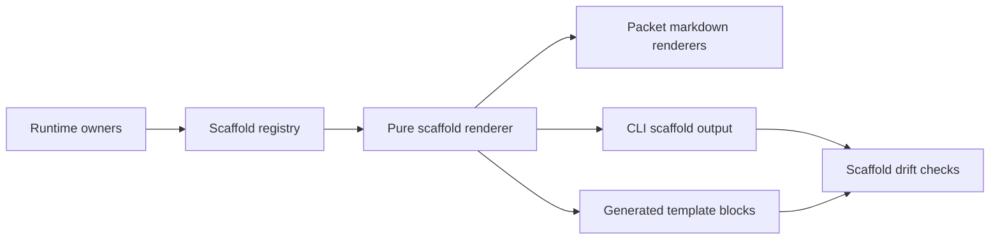

# feat: Add TS-owned scaffold renderers

## Summary

Move Issue-to-PR v2 packet, envelope, ledger, evidence-row, patch-proposal, and ce-plan YAML scaffolds behind TypeScript-owned contract definitions and pure renderers. Keep Markdown templates for role framing and judgment. Expose scaffold facts through the existing read-only CLI envelope style. Add drift checks so committed generated scaffold blocks and checked pointers cannot silently diverge.

---

## Problem Frame

Issue-to-PR v2 already moved many deterministic contracts into runtime code, but packet templates and the per-issue ledger template still contain hand-authored YAML scaffold shapes. Maintainers must keep validators, packet renderers, CLI output, template examples, and ledger scaffold prose aligned by memory.

This work removes that parallel policy. Runtime TypeScript owns repeatable scaffold shape and YAML rendering. Markdown keeps the human and agent judgment around those shapes.

---

## Requirements

- R1. TypeScript owns packet input scaffolds, packet output envelopes, ledger section scaffolds, evidence-row scaffolds, finite allowed values, lifecycle defaults, and YAML rendering.
- R2. Markdown templates keep role framing, purpose, authority boundaries, read triggers, stop conditions, and judgment-heavy guidance.
- R3. Hand-maintained prose no longer carries YAML member lists for scaffolds agents are expected to fill.
- R4. Scaffold registry entries cite canonical runtime owners instead of becoming a parallel schema.
- R5. CLI remains read-only and emits scaffold facts through the existing JSON envelope style.
- R6. Agent-facing scaffold output is machine-readable where useful and Markdown/YAML where dispatch needs a concrete body.
- R7. Packet markdown renderers and CLI scaffold discovery consume the same runtime definitions.
- R8. Duplicate Builder return envelope shapes collapse to one TS-owned renderer with explicit projections.
- R9. Builder-evidence and Orchestrator-inline evidence lanes remain separate in Validator packet scaffolds.
- R10. Candidate batch scaffolds come from one base candidate-batch contract plus explicit projections for ce-plan, replacement batches, and patch proposals.
- R11. Ledger scaffold sections, lifecycle defaults, workflow version, finding rows, and Notes evidence rows render from runtime values.
- R12. Committed generated scaffold blocks, if retained, name their runtime source.
- R13. Drift checks fail when generated scaffold blocks or checked scaffold pointers diverge from runtime output.
- R14. Renderer tests pin external scaffold behavior without prose audits.
- R15. Workflow semantics do not change: no new stage, route, validator, ledger interpretation, mutation behavior, or human gate.
- R16. No new dependency unless renderer tests prove existing Bun and TypeScript utilities cannot safely render deterministic YAML.
- R17. ADR 0005 is present in this checkout before implementation treats it as accepted local repo state.

---

## Scope Boundaries

### In Scope

- Add a runtime scaffold registry and pure renderer seam.
- Render packet, return-envelope, candidate-batch, ledger, finding-row, and Notes evidence scaffolds from runtime facts.
- Add read-only scaffold discovery/output to `runbooks/issue-to-pr-v2/cli.ts`.
- Replace embedded hand-authored YAML member lists with generated blocks or checked CLI pointers.
- Extend `contract-drift.ts` only enough to validate generated scaffold blocks and checked scaffold pointers.
- Import the accepted ADR 0005 text from the existing local worktree source.

### Out of Scope

- Changing Issue-to-PR stage ordering, role authority, route classification, or confirmation gates.
- Adding CLI mutation behavior for ledgers, templates, target repos, or generated docs.
- Completing the broader ledger schema slice from issue #107.
- Completing packet command/schema prose pruning from issue #108 beyond scaffold member-list removal.
- Extracting finding lifecycle closure rules unless a scaffold surface needs the row shape only.
- Replacing all Markdown templates with code-only prompts.
- Broadening `contract-drift.ts` into a general Markdown auditor or YAML semantics linter.

### Deferred Follow-Up

- Full ledger schema contract slices, if #107 remains open.
- Broader packet command/schema prose pruning, if #108 remains open.
- Finding lifecycle closure-rule extraction.
- Generated human `explain` docs beyond scaffold surfaces needed for #113.

---

## Context & Research

### Source Inputs

- GitHub issue #113 is open and labeled `ready-for-agent`.
- Issue #113 asks for TS-owned template contracts and scaffold renderers, read-only CLI discovery, generated block markers, drift checks, and no workflow semantic changes.
- Issue #113 comment names ADR 0005 as the architecture anchor.
- ADR 0005 exists in another local worktree and says: templates frame handoffs; runtime owns scaffold contracts; generated or emitted views show scaffold shape.

### Existing Runtime Seams

- `runbooks/issue-to-pr-v2/lib/contract.ts` owns runtime key sets, allowed values, prefixes, `RUNBOOK_VERSION`, and candidate batch field sets.
- `runbooks/issue-to-pr-v2/lib/packets.ts` owns typed packet data, packet renderers, dispatch evidence, YAML helpers, and packet deny-list behavior.
- `runbooks/issue-to-pr-v2/lib/ledger.ts` owns ledger parsing, validation, lifecycle defaults, findings validation, Notes evidence parsing, and workflow learning validation.
- `runbooks/issue-to-pr-v2/cli.ts` owns the JSON envelope style, help catalog, contract slices, packet command, error catalog, and read-only command dispatch.
- `runbooks/issue-to-pr-v2/contract-drift.ts` already protects scoped runtime-contract claims against live CLI facts.
- `runbooks/issue-to-pr-v2/templates/*.md` and `runbooks/issue-to-pr-v2/issue-N-ledger.template.md` contain the hand-authored scaffold YAML drift surface.

### Architecture Constraints

- ADR 0002: prose orchestrates judgment; code owns deterministic mechanics; templates own repeated handoffs.
- ADR 0004: hand prose must not duplicate deterministic workflow contracts.
- ADR 0005: hand prose must not maintain repeatable scaffold member lists.
- `CONTEXT.md` defines runtime contract drift checks as focused comparisons against CLI-owned facts, not broad docs audits.
- Prior ledgers recorded YAML failure modes around control bytes, unescaped mapping keys, duplicate keys, scalar coercion, and parse/validate round trips. Treat YAML rendering as correctness, not formatting.

### External Research

- None needed. Local ADRs, runtime seams, and issue #113 are sufficient.

---

## Key Decisions

- D1. Add `runbooks/issue-to-pr-v2/lib/scaffolds.ts` as a renderer/view seam, not a schema mirror. Canonical semantics remain in `lib/contract.ts`, `lib/packets.ts`, `lib/ledger.ts`, and any narrow owner module they already belong to.
- D2. Make scaffold registry entries metadata over owners: stable id, output kind, owner/source, ordering, projection, and renderer. Registry entries must not duplicate validation semantics.
- D3. Start with local deterministic YAML rendering. Add a dependency only if hostile-value tests prove the local renderer cannot safely handle required values.
- D4. Keep complete dispatch packets under `packet <role> --json`. Add `scaffold <id> --json` for static scaffold contracts/placeholders and `contract scaffold_ids --json` for discovery.
- D5. Use one Builder return-envelope contract with explicit projections for transient Builder output, persisted compact attempt rows, and Validator Builder-evidence input.
- D6. Keep Validator Builder-evidence and Orchestrator-inline evidence as separate scaffold surfaces. Lane separation is behavioral safety, not display polish.
- D7. Model candidate batches as one base ordered tuple plus projections for ce-plan candidates, replacement candidates, and patch proposal candidates.
- D8. Treat committed template blocks as generated views. If a concrete block stays in Markdown, mark it with source id or CLI command and compare it against live renderer output.
- D9. Treat reference-file scaffold mentions as checked pointers by default. Embed generated YAML in templates and the ledger template only where agents need concrete fillable shapes.
- D10. Import exact ADR 0005 text from the local worktree source. If unavailable, stop for Nathan confirmation before recreating it and record provenance.

---

## Scaffold Model

Expose a small `lib/scaffolds.ts` contract surface:

- `SCAFFOLD_IDS`: stable catalog order.
- `renderScaffold(id, options?)`: pure render function.
- `getScaffoldCatalog()`: metadata for CLI discovery and drift checks.
- `ScaffoldRenderError`: typed unsupported-id or invalid-definition error.

Each scaffold definition carries:

- `id`: stable CLI-visible identifier.
- `output_kind`: `yaml`, `markdown`, or `text`.
- `owner`: canonical runtime owner module or export.
- `source`: renderer or CLI source string shown in generated blocks.
- `ordering`: explicit field order or source catalog order.
- `body`: rendered scaffold body.

Initial surface groups:

- Packet input views: Builder, Proposer, Validator with Builder evidence, Validator with inline evidence, patch proposal, ce-plan addendum.
- Return envelopes: Builder return, Proposer candidate/fail-stop return, Validator finding return.
- Candidate batches: base candidate, ce-plan projection, replacement projection, patch projection.
- Ledger scaffolds: empty batches, empty findings data, ledger batch row defaults, compact Builder attempt row, Orchestrator-inline attempt row.
- Notes evidence: implementation attempt checkpoint, Validator wave completed, runbook-version skew continuation.
- Workflow learning: valid empty `workflow_learnings: []` scaffold, with deeper evidence-key ownership left to the existing learning registry unless implementation needs it.

Exact id strings may be chosen during implementation, but must be stable, cataloged, tested, and discoverable through `contract scaffold_ids --json`.

---

## High-Level Design

Core invariant: every scaffold an agent fills has one runtime-owned definition. Packet markdown, CLI discovery, and committed generated views all render from that definition.

---

## Implementation Units

### U1. Land ADR 0005 and create the scaffold renderer seam

**Goal:** Add the accepted scaffold ownership rule locally and introduce the pure runtime seam that all scaffold views will use.

**Requirements:** R1, R3, R4, R14, R16, R17.

**Dependencies:** None.

**Files:**

- Create: `docs/adr/0005-template-scaffold-contracts-are-runtime-owned.md`
- Modify: `docs/adr/0004-deterministic-workflow-contracts-live-in-code.md`
- Create: `runbooks/issue-to-pr-v2/lib/scaffolds.ts`
- Create: `runbooks/issue-to-pr-v2/lib/scaffolds.test.ts`
- Modify: `runbooks/issue-to-pr-v2/lib/contract.ts`
- Modify: `runbooks/issue-to-pr-v2/lib/contract.test.ts`

**Approach:**

- Copy exact ADR 0005 text from the local worktree source.
- Add only a short ADR 0004 cross-reference if useful; do not duplicate ADR 0005 policy.
- Define scaffold metadata and renderer primitives in `lib/scaffolds.ts`.
- Reuse existing key sets, allowed values, and defaults from `lib/contract.ts` before adding new exports.
- Add narrow ordered tuples only when current `Set` exports cannot express deterministic scaffold order.
- Keep `lib/scaffolds.ts` side-effect free and read-only.
- Treat unsupported ids and invalid scaffold definitions as typed errors.

**Tests:**

- Rendering scalar, null, array, nested object, and list-of-objects scaffolds preserves registry order.
- Allowed-value placeholders derive from runtime constants, not duplicated literals.
- Empty arrays render in the compact form expected by existing templates.
- Strings with colons, hashes, quotes, pipes, brackets, newlines, control bytes, and leading/trailing spaces are safe or rejected intentionally.
- Unsupported scaffold ids return a typed error.
- Registry entries cite a runtime owner and output kind.

**Verification:** Renderer tests prove deterministic output, runtime-value reuse, and safe YAML handling without invoking the CLI.

---

### U2. Move packet and envelope scaffolds onto the registry

**Goal:** Make Builder, Proposer, Validator, patch-proposal, and ce-plan scaffold shapes consume shared runtime definitions instead of hand-maintained YAML member lists.

**Requirements:** R1, R2, R3, R7, R8, R9, R10, R14, R15.

**Dependencies:** U1.

**Files:**

- Modify: `runbooks/issue-to-pr-v2/lib/packets.ts`
- Modify: `runbooks/issue-to-pr-v2/lib/packets.test.ts`
- Modify: `runbooks/issue-to-pr-v2/templates/builder-work-packet.md`
- Modify: `runbooks/issue-to-pr-v2/templates/builder-return-envelope.md`
- Modify: `runbooks/issue-to-pr-v2/templates/proposer-envelope.md`
- Modify: `runbooks/issue-to-pr-v2/templates/validator-envelope.md`
- Modify: `runbooks/issue-to-pr-v2/templates/patch-proposal.md`
- Modify: `runbooks/issue-to-pr-v2/templates/ce-plan-addendum.md`

**Approach:**

- Replace duplicate packet scaffold member lists with renderer-backed generated blocks or checked scaffold pointers.
- Keep packet role selection, ledger scoping, evidence filtering, dispatch evidence, and deny-list behavior inside `lib/packets.ts`.
- Render Builder return, persisted compact attempt, and Validator Builder-evidence views from one owned contract with projections.
- Keep Validator Builder-evidence and inline-evidence scaffolds distinct.
- Render ce-plan, replacement, and patch candidate-batch scaffolds from one base candidate-batch tuple plus projections.
- Do not use a committed template block as a parity source for runtime rendering.
- Preserve deny-list coverage: no full ledger, unrelated batches, raw Validator envelopes, Builder fix prose, or wrong evidence lane.

**Tests:**

- Builder packet markdown still includes target batch contract, compact prior Builder attempts, relevant findings, local-law order, authority boundary, and output-contract section.
- Builder return envelope scaffold includes rich transient evidence arrays and compact persisted fields from one source.
- Validator Builder-evidence scaffold includes only Builder evidence arrays.
- Validator inline scaffold includes only inline evidence fields and rejects Builder evidence shape.
- Patch proposal scaffold renders exactly one candidate patch batch and keeps `ac_mapping: []`.
- Ce-plan addendum scaffold renders the ce-plan candidate projection from the shared base tuple.
- Empty findings, empty prior attempts, empty evidence arrays, null repair targets, and null `supersedes` retain current render semantics.
- Packet markdown and structured `data.packet` agree on scaffold lane and field names.

**Verification:** Packet tests prove generated scaffolds preserve current external behavior while removing hand-authored shape duplication.

---

### U3. Move ledger and Notes evidence scaffolds onto the registry

**Goal:** Render ledger section scaffolds, lifecycle defaults, finding rows, Notes evidence rows, and workflow-learning empty state from runtime-owned definitions.

**Requirements:** R1, R2, R3, R11, R12, R14, R15.

**Dependencies:** U1.

**Files:**

- Modify: `runbooks/issue-to-pr-v2/issue-N-ledger.template.md`
- Modify: `runbooks/issue-to-pr-v2/lib/ledger.ts`
- Modify: `runbooks/issue-to-pr-v2/lib/ledger.test.ts`
- Modify: `runbooks/issue-to-pr-v2/references/ledger-and-helper.md`
- Modify: `runbooks/issue-to-pr-v2/references/findings-and-validators.md`

**Approach:**

- Generate empty `batches: []`, `findings: []`, and `workflow_learnings: []` blocks from registry definitions.
- Generate ledger batch defaults from runtime values, including `RUNBOOK_VERSION`, batch lifecycle fields, Builder attempts, inline attempts, and final verdict defaults.
- Generate Notes evidence row scaffolds for implementation attempt checkpoints, Validator wave completion, and runbook-version skew continuation.
- Keep `lib/ledger.ts` as parser, validator, lifecycle, findings, and Notes evidence owner.
- Export or reuse only the ordered facts needed for scaffold rendering.
- Keep explanatory prose where it describes when and why a row is written.
- Remove member-list prose that only restates deterministic field shapes.
- Add parse/validate round-trip tests before pruning ledger template examples.

**Tests:**

- Generated empty sections parse and validate through existing ledger helpers.
- Generated ledger batch row includes every required candidate and lifecycle field in the expected order.
- Generated Builder attempt and inline attempt rows use runtime-owned key sets and validate when filled with representative values.
- Notes evidence rows parse through their current evidence parsers.
- `runbook_version` default follows `RUNBOOK_VERSION`.
- `runbook_version_skew_continuation.ledger_version` preserves the bare-null and quoted-string distinction.
- Minimal ledger assembled from generated scaffolds can be consumed by `state`, `diagnose`, ledger validation, and workflow learning validation.

**Verification:** Ledger tests prove scaffold output remains parseable and compatible with helper validation.

---

### U4. Expose scaffold surfaces through the read-only CLI

**Goal:** Make scaffold surfaces discoverable and renderable through `cli.ts` without adding mutation behavior.

**Requirements:** R5, R6, R7, R10, R12, R15, R16.

**Dependencies:** U1, U2, U3.

**Files:**

- Modify: `runbooks/issue-to-pr-v2/cli.ts`
- Modify: `runbooks/issue-to-pr-v2/cli.test.ts`
- Modify: `runbooks/issue-to-pr-v2/cli-smoke.test.ts`
- Modify: `runbooks/issue-to-pr-v2/README.md`

**Approach:**

- Add `scaffold <id> --json`.
- Add `scaffold_ids` to the help data and `contract scaffold_ids --json`.
- Source ids from `SCAFFOLD_IDS`; do not duplicate them across help, dispatch, errors, or smoke matrices.
- Emit one success envelope with `data.scaffold_id`, `data.output_kind`, `data.source`, `data.ordering`, and `data.body`.
- Add an `unknown-scaffold-id` usage error to the error catalog.
- Keep complete dispatch packets on the existing `packet <role> --json` command.
- Keep stdout one-envelope-only, stderr diagnostics, JSON-only agent interface, and documented exit-code behavior.
- Document the surface as read-only fact emission, not a command that mutates templates or ledgers.

**Tests:**

- Help output lists the `scaffold` command and every documented scaffold id.
- `contract scaffold_ids --json` returns catalog-ordered ids from the registry.
- `scaffold <id> --json` returns a success envelope with stable metadata and body.
- Every help-documented scaffold id succeeds through the process-boundary smoke path.
- Unknown scaffold id returns a structured usage error.
- Existing `packet` roles still emit the same dispatch evidence shape and remain read-only.

**Verification:** CLI tests prove scaffold discovery is envelope-compatible, read-only, and smoke-tested at the process boundary.

---

### U5. Add scaffold drift checks and prune scaffold prose

**Goal:** Fail loudly when committed scaffold views drift, then remove hand-maintained scaffold member lists while preserving workflow guidance.

**Requirements:** R2, R3, R12, R13, R14, R15.

**Dependencies:** U2, U3, U4.

**Files:**

- Modify: `runbooks/issue-to-pr-v2/contract-drift.ts`
- Modify: `runbooks/issue-to-pr-v2/contract-drift.test.ts`
- Modify: `runbooks/issue-to-pr-v2/templates/builder-work-packet.md`
- Modify: `runbooks/issue-to-pr-v2/templates/builder-return-envelope.md`
- Modify: `runbooks/issue-to-pr-v2/templates/proposer-envelope.md`
- Modify: `runbooks/issue-to-pr-v2/templates/validator-envelope.md`
- Modify: `runbooks/issue-to-pr-v2/templates/patch-proposal.md`
- Modify: `runbooks/issue-to-pr-v2/templates/ce-plan-addendum.md`
- Modify: `runbooks/issue-to-pr-v2/issue-N-ledger.template.md`
- Modify: `runbooks/issue-to-pr-v2/references/builder-dispatch.md`
- Modify: `runbooks/issue-to-pr-v2/references/ledger-and-helper.md`
- Modify: `runbooks/issue-to-pr-v2/references/findings-and-validators.md`

**Approach:**

- Define one generated-scaffold marker format that names scaffold id and source renderer or CLI command.
- Teach `contract-drift.ts` to locate marked generated scaffold blocks, render the named surface, and compare normalized content.
- Teach it to validate checked scaffold pointers in scoped templates and references.
- Add a scoped scaffold inventory for agent-fillable YAML blocks in templates and the ledger template.
- Classify each block as generated block, checked pointer, prose-owned, or removed.
- Fail on unknown scaffold ids, stale generated blocks, and unclassified agent-fillable YAML blocks in scoped files.
- Keep the drift checker focused: no broad Markdown crawl, no prose-quality lint, no generic YAML auditing.
- Replace member-list prose with generated blocks or checked CLI pointers only after drift coverage exists.
- Preserve role framing, read triggers, authority boundaries, stop conditions, lane separation, and judgment-heavy text.

**Tests:**

- All marked generated scaffold blocks match live renderer output.
- Checked scaffold pointers validate their scaffold ids.
- Unknown scaffold id in a marker or pointer produces a targeted finding.
- Stale generated block produces a targeted finding naming doc path and scaffold id.
- Unclassified agent-fillable YAML block in scoped templates or ledger template produces a targeted finding.
- Whitespace normalization does not hide field-order or value drift.
- Existing runtime contract drift checks still validate current CLI contract claims and gotchas relationships.

**Verification:** Drift tests prove runtime renderers are the source of truth for committed scaffold views.

---

## Test Strategy

- Run focused renderer tests after U1.
- Run packet tests after U2.
- Run ledger validation and workflow learning tests after U3.
- Run CLI in-process and smoke tests after U4.
- Run drift tests after U5.
- Run the repo's normal lint, type, and test checks before handoff.

Prefer MCP runners when available:

- `bun_testFile` for focused test files.
- `bun_runTests` for suite-level checks.
- `biome_lintCheck` for lint/format diagnostics.
- `tsc_check` for type checking.

---

## Risks

- **ADR source missing:** ADR 0005 is currently local to another worktree. Mitigation: import exact source first; stop for confirmation if unavailable.
- **YAML escaping bugs:** hand-rolled rendering can corrupt edge-case values. Mitigation: hostile-value renderer tests before CLI/template wiring.
- **Registry becomes a schema mirror:** scaffold definitions could duplicate semantics instead of citing owners. Mitigation: owner metadata plus parity tests against runtime constants and validators.
- **Scope creep into #107:** ledger schema extraction is adjacent. Mitigation: export only narrow ordered facts needed for scaffolds.
- **Scope creep into #108:** packet prose pruning is adjacent. Mitigation: prune only scaffold member-list duplication.
- **Over-broad drift checker:** scaffold parity could become a general docs audit. Mitigation: scoped inventory and explicit marker/pointer checks only.
- **Template usability regression:** removing concrete examples can weaken dispatch. Mitigation: keep generated blocks where agents need fillable shapes; use pointers where discovery is enough.
- **Behavioral regression hidden in prose edits:** pruning can weaken authority boundaries. Mitigation: preserve role framing and keep packet deny-list, lane separation, CLI read-only, and ledger validation tests green.

---

## Documentation Plan

- ADR 0005 becomes the scaffold ownership anchor.
- Templates name generated scaffold sources or checked CLI scaffold commands.
- `README.md` advertises read-only scaffold discovery.
- References keep judgment and stage framing while pointing at runtime-owned scaffold surfaces.
- No broad generated human docs are planned beyond scaffold blocks and CLI output needed for #113.

---

## Done Criteria

- ADR 0005 exists in this checkout.
- `lib/scaffolds.ts` owns the scaffold registry and renderer seam.
- Packet, ledger, and Notes scaffolds render from runtime-owned definitions.
- `scaffold <id> --json` and `contract scaffold_ids --json` are discoverable and smoke-tested.
- Generated template blocks or checked pointers are drift-checked.
- Scoped Markdown no longer hand-maintains scaffold member lists for agent-fillable YAML shapes.
- Existing Issue-to-PR workflow semantics remain unchanged.
- No new dependency is added unless tests justify it.

---

## Sources & References

- GitHub issue #113: PRD for TS-owned template contracts and scaffold renderers.
- Issue #113 comment naming ADR 0005 as the architecture anchor.
- `docs/adr/0002-runbooks-and-skills-use-prose-as-orchestrator.md`
- `docs/adr/0004-deterministic-workflow-contracts-live-in-code.md`
- `docs/adr/0005-template-scaffold-contracts-are-runtime-owned.md` after U1 lands it.
- `docs/plans/2026-05-22-002-refactor-issue-to-pr-v2-runbook-plan.md`
- `docs/plans/2026-05-24-008-feat-runtime-contract-drift-check-plan.md`
- `docs/plans/2026-05-26-001-feat-route-reference-contract-plan.md`
- `docs/review/2026-05-22-issue-to-pr-skill-v2-audit.md`
- `CONTEXT.md`
