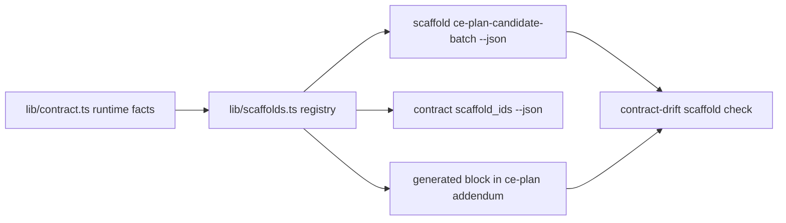

# feat: Prove scaffold tracer path

## Summary

Build the first end-to-end runtime-owned scaffold path for Issue-to-PR v2. Use one narrow tracer scaffold, expose it through read-only CLI discovery/output, replace one committed YAML scaffold view with a generated block, and prove the drift check fails when that view diverges.

---

## Problem Frame

Issue #113 moves repeated packet and ledger YAML scaffolds out of hand-authored prose and into runtime-owned renderers. Issue #114 is the first tracer slice: small enough to land safely, but complete enough to prove the ownership pattern before the full scaffold migration.

---

## Requirements

- R1. ADR 0005 exists locally and is referenced as the scaffold ownership anchor without duplicating policy.
- R2. A minimal scaffold catalog and pure renderer render one stable scaffold from runtime-owned facts.
- R3. `scaffold <id> --json` emits the tracer scaffold through the existing JSON envelope style.
- R4. `contract scaffold_ids --json` exposes scaffold ids through the existing contract discovery style.
- R5. One committed scaffold view is generated from the tracer renderer or replaced by a checked pointer.
- R6. Drift detection fails when the committed tracer view diverges from renderer output.
- R7. Tests cover renderer behavior, CLI discovery/output, and drift failure for the tracer scaffold.
- R8. CLI remains read-only and does not mutate ledgers, templates, generated docs, target repos, or git state.
- R9. Workflow semantics stay unchanged; this slice proves ownership and rendering only.
- R10. No new dependency unless existing Bun and TypeScript code cannot render the tracer deterministically.

---

## Scope Boundaries

- Implement exactly one tracer scaffold surface: `ce-plan-candidate-batch`.
- Keep the full #113 scaffold catalog, packet-envelope migration, ledger scaffold migration, evidence-row migration, and duplicate Builder envelope collapse out of this slice.
- Do not change Stage 2 planning behavior, Stage 3 decompose validation, packet role semantics, ledger interpretation, or confirmation gates.
- Do not add CLI write commands or generated-file mutation commands.
- Do not broaden `contract-drift.ts` into a general Markdown or YAML auditor.
- Do not add a YAML dependency unless tracer renderer tests prove local rendering is unsafe.

### Deferred to Follow-Up Work

- Remaining packet, return-envelope, evidence, findings, patch-proposal, and ledger scaffolds: parent issue #113.
- Rich Builder return-envelope runtime contract collapse: parent issue #113 or a follow-up child.
- Full generated-template inventory across every agent-fillable YAML block: parent issue #113.

---

## Context & Research

### Relevant Code and Patterns

- `docs/adr/0005-template-scaffold-contracts-are-runtime-owned.md` already exists and says templates frame handoffs while runtime owns scaffold contracts.
- `runbooks/issue-to-pr-v2/lib/contract.ts` owns ordered candidate batch fields, execution modes, rationale prefixes, and `INVESTIGATION_RATIONALE`.
- `runbooks/issue-to-pr-v2/templates/ce-plan-addendum.md` contains a committed ce-plan candidate YAML scaffold inside the Stage 2 addendum body.
- `runbooks/issue-to-pr-v2/cli.ts` owns `CONTRACT_SLICES`, `CONTRACT_SLICE_VALUES`, `HELP_DATA`, error catalogs, and read-only command dispatch.
- `runbooks/issue-to-pr-v2/cli.test.ts` and `cli-smoke.test.ts` already test contract discovery, help data, unknown-id usage errors, and process-boundary command behavior.
- `runbooks/issue-to-pr-v2/contract-drift.ts` already loads live CLI facts, checks scoped docs, and has a narrow ledger schema pointer check that can guide the scaffold block check.
- `docs/plans/2026-05-26-002-feat-template-scaffold-renderers-plan.md` is the broader #113 plan; this plan intentionally implements only its tracer path.

### Institutional Learnings

- `CONTEXT.md` defines runtime contract drift check as focused comparison against CLI-owned facts, not a broad docs audit.
- ADR 0004 says hand prose may point at runtime contracts or emitting commands, but must not restate deterministic members.
- The existing contract-drift tests show useful prior art: scoped fixtures, fake CLI failures, section-missing findings, and process-boundary checks.

### External References

- None. Local runtime contracts, ADRs, and issue #114 are sufficient.

---

## Key Technical Decisions

- Use `ce-plan-candidate-batch` as the tracer scaffold because it is agent-fillable YAML, already committed in a packet template, and can be generated from existing candidate-batch runtime facts with a narrow projection.
- Add `runbooks/issue-to-pr-v2/lib/scaffolds.ts` as the first scaffold registry and renderer seam. Keep it pure and side-effect free.
- Render a scaffold body, not a full packet. `packet ce-plan --json` remains the complete dispatch surface; `scaffold ce-plan-candidate-batch --json` emits only the reusable YAML scaffold.
- Model the ce-plan scaffold as a projection of `CANDIDATE_BATCH_FIELDS` that omits `supersedes`, matching the current Stage 2 addendum contract unless implementation deliberately proves Stage 3 can accept the added field without semantic change.
- Add `contract scaffold_ids --json` by importing `SCAFFOLD_IDS` into `cli.ts`, preserving the existing `slice`, `values`, `ordering` response shape.
- Add a new read-only `scaffold` command with a success envelope containing `scaffold_id`, `output_kind`, `source`, `ordering`, and `body`.
- Mark the generated block in `templates/ce-plan-addendum.md` with a source command that names the scaffold id.
- Extend drift checking only for marked generated scaffold blocks in scoped files. Unknown scaffold ids, stale bodies, and missing generated-block bounds produce targeted findings.

---

## Open Questions

### Resolved During Planning

- Which scaffold should be the tracer? Use `ce-plan-candidate-batch`, because it has existing runtime field ownership and a committed YAML view.
- Should this slice generate every scaffold? No. Issue #114 asks for one end-to-end tracer path.
- Should the CLI mutate templates or regenerate files? No. The CLI remains a read-only fact emitter.
- Should external docs research guide this work? No. The work follows repo-local ADRs and existing TypeScript/Bun patterns.

### Deferred to Implementation

- Exact marker syntax for generated scaffold blocks. It should be simple to parse, name the scaffold id, and name the source command.
- Exact renderer helper names. Tests should pin scaffold behavior and CLI envelopes, not private function names.

---

## High-Level Technical Design

> *This illustrates the intended approach and is directional guidance for review, not implementation specification. The implementing agent should treat it as context, not code to reproduce.*

The invariant: the committed ce-plan YAML scaffold and the CLI scaffold output are two views of the same runtime renderer.

---

## Implementation Units

### U1. Add tracer scaffold registry and renderer

**Goal:** Create the pure runtime seam that owns the `ce-plan-candidate-batch` scaffold.

**Requirements:** R1, R2, R8, R9, R10.

**Dependencies:** None.

**Files:**

- Create: `runbooks/issue-to-pr-v2/lib/scaffolds.ts`
- Create: `runbooks/issue-to-pr-v2/lib/scaffolds.test.ts`
- Modify: `runbooks/issue-to-pr-v2/lib/contract.ts` only if a narrow ordered projection export is needed.
- Modify: `runbooks/issue-to-pr-v2/lib/contract.test.ts` only if `contract.ts` gains a new projection export.

**Approach:**

- Define `SCAFFOLD_IDS` with exactly `ce-plan-candidate-batch` for this slice.
- Define scaffold metadata: id, output kind, source command, ordering, runtime owner, and renderer.
- Render the existing ce-plan candidate YAML shape from `CANDIDATE_BATCH_FIELDS`, `EXECUTION_MODES`, rationale prefix constants, and `INVESTIGATION_RATIONALE`.
- Treat the missing `supersedes` field as an explicit ce-plan projection, not an accidental omission.
- Keep renderer output deterministic and side-effect free.
- Raise a typed error for unknown scaffold ids.

**Patterns to follow:**

- Ordered field arrays and membership set tests in `lib/contract.ts` / `lib/contract.test.ts`.
- Packet renderer purity and typed error style in `lib/packets.ts`.
- Existing no-new-dependency posture in contract and drift modules.

**Test scenarios:**

- Happy path: rendering `ce-plan-candidate-batch` returns the current field order used by `templates/ce-plan-addendum.md`.
- Happy path: `execution_mode` placeholder enumerates the live `EXECUTION_MODES` values.
- Happy path: investigation placeholder uses `INVESTIGATION_RATIONALE`.
- Edge case: projection intentionally excludes `supersedes` while preserving the relative order of the remaining candidate fields.
- Error path: unknown scaffold id raises the typed scaffold error.
- Regression: renderer output contains no absolute paths, issue-specific data, ledger state, or mutation wording.

**Verification:**

- Renderer tests prove the tracer scaffold is generated from runtime-owned facts and is stable without invoking the CLI.

---

### U2. Expose scaffold discovery and output through the CLI

**Goal:** Make the tracer scaffold discoverable and renderable through read-only CLI envelopes.

**Requirements:** R3, R4, R7, R8.

**Dependencies:** U1.

**Files:**

- Modify: `runbooks/issue-to-pr-v2/cli.ts`
- Modify: `runbooks/issue-to-pr-v2/cli.test.ts`
- Modify: `runbooks/issue-to-pr-v2/cli-smoke.test.ts`
- Modify: `runbooks/issue-to-pr-v2/README.md`

**Approach:**

- Add `scaffold_ids` to `CONTRACT_SLICES` and emit `SCAFFOLD_IDS` through the existing contract slice envelope.
- Add a `scaffold <id> --json` command that returns `data.scaffold_id`, `data.output_kind`, `data.source`, `data.ordering`, and `data.body`.
- Add `scaffold` to `HELP_DATA.commands`.
- Add `scaffold_ids` and `scaffold_response_shape` help metadata so agents can discover the surface from help output.
- Add `unknown-scaffold-id` to the runtime error catalog.
- Keep stdout one envelope only, stderr diagnostics unchanged, and no mutation behavior.

**Patterns to follow:**

- `contract route_required_references --json` for structured catalog exposure.
- `packet <role> --json` for thin CLI dispatch into a renderer module.
- `unknown-contract-slice` and `unknown-packet-role` usage errors.
- `cli-smoke.test.ts` loops driven by `HELP_DATA`.

**Test scenarios:**

- Happy path: `contract scaffold_ids --json` returns `status: ok`, `data.slice: "scaffold_ids"`, `ordering: "catalog"`, and `values: ["ce-plan-candidate-batch"]`.
- Happy path: `scaffold ce-plan-candidate-batch --json` returns the renderer body and metadata in a success envelope.
- Integration: `--help --json` includes the `scaffold` command, the `scaffold_ids` slice, and the scaffold response shape.
- Process boundary: every help-documented scaffold id succeeds through `cli-smoke.test.ts`.
- Error path: unknown scaffold id returns `unknown-scaffold-id`, exit 64, and a `change_input` hint.
- Regression: existing `contract`, `packet`, and usage-error behavior remains unchanged.

**Verification:**

- CLI and smoke tests prove scaffold discovery/output uses the existing envelope style and remains read-only.

---

### U3. Replace ce-plan committed YAML scaffold with a generated block

**Goal:** Make one committed scaffold view consume the runtime renderer instead of hand-maintained YAML.

**Requirements:** R5, R8, R9.

**Dependencies:** U1.

**Files:**

- Modify: `runbooks/issue-to-pr-v2/templates/ce-plan-addendum.md`
- Modify: `runbooks/issue-to-pr-v2/lib/packets.test.ts`

**Approach:**

- Replace the hand-authored ce-plan candidate YAML block with a generated block produced by `renderScaffold("ce-plan-candidate-batch")`.
- Mark the block with the scaffold id and source command.
- Preserve the surrounding Stage 2 planning guidance, role framing, split/merge rules, and Stage 3 gate wording.
- Preserve the visible YAML shape unless implementation proves a change is required and still behavior-preserving.
- Keep `renderCePlanPacket()` behavior stable: the addendum body still contains exactly one candidate YAML scaffold and no issue-specific data.

**Patterns to follow:**

- Existing ce-plan packet tests that assert no issue-specific packet slots leak into the reusable addendum.
- ADR 0005 generated-block marker rule.
- Current `templates/ce-plan-addendum.md` structure with nested fenced YAML inside the addendum body.

**Test scenarios:**

- Happy path: rendered ce-plan packet includes the generated scaffold block body.
- Happy path: generated block markers name `ce-plan-candidate-batch` and the source command.
- Regression: ce-plan packet still excludes issue number, target repo, ledger state, Builder evidence, Proposer fields, and Validator fields.
- Regression: the addendum still instructs ce-plan to emit a fenced YAML code block immediately after each implementation unit.

**Verification:**

- Packet tests prove the committed generated view stays compatible with the existing ce-plan addendum behavior.

---

### U4. Add drift detection for marked scaffold blocks

**Goal:** Fail loudly when the committed tracer scaffold block diverges from runtime renderer output.

**Requirements:** R5, R6, R7, R8, R9.

**Dependencies:** U1, U3.

**Files:**

- Modify: `runbooks/issue-to-pr-v2/contract-drift.ts`
- Modify: `runbooks/issue-to-pr-v2/contract-drift.test.ts`

**Approach:**

- Add a narrow scaffold-block parser for generated block markers in scoped files.
- Compare each marked block's fenced body against `renderScaffold(id).body`.
- Add a scaffold drift finding kind for stale generated blocks, unknown ids, and missing block terminators.
- Include `templates/ce-plan-addendum.md` in the scaffold-block check scope only for this tracer.
- Keep existing contract-token drift checks, gotchas relationship checks, and ledger schema pointer checks unchanged.
- Do not classify every YAML block in the runbook tree yet; full inventory belongs to parent issue #113.

**Patterns to follow:**

- `checkLedgerLifecycleFieldDrift()` for narrow scoped drift checks.
- Existing fixture tests that mutate a scoped doc and expect a targeted finding.
- Existing hard-error behavior for missing protected docs and empty fact sets.

**Test scenarios:**

- Happy path: real `templates/ce-plan-addendum.md` generated block matches runtime renderer output.
- Error path: changing one field name or placeholder in the committed generated block produces a stale-scaffold finding naming the doc and scaffold id.
- Error path: unknown scaffold id in a marker produces an unknown-scaffold finding.
- Error path: missing generated-block terminator produces a malformed-scaffold-marker finding.
- Regression: existing real-doc contract drift check still passes when only the scaffold tracer is added.

**Verification:**

- Drift tests prove the tracer generated view cannot silently diverge from runtime output.

---

## System-Wide Impact

- **Interaction graph:** `lib/contract.ts` facts feed `lib/scaffolds.ts`; `cli.ts` exposes registry ids and rendered bodies; `templates/ce-plan-addendum.md` carries a generated view; `contract-drift.ts` compares committed view to runtime output.
- **Error propagation:** unknown scaffold ids become typed renderer errors in `lib/scaffolds.ts` and structured `unknown-scaffold-id` CLI usage errors at the CLI boundary.
- **State lifecycle risks:** none. The CLI remains read-only and no ledger state is read for the tracer scaffold.
- **API surface parity:** `contract scaffold_ids --json`, `scaffold <id> --json`, and `--help --json` must agree on ids and response metadata.
- **Integration coverage:** process-boundary CLI smoke tests and drift fixture tests are required because unit tests alone cannot prove CLI/help/template parity.
- **Unchanged invariants:** `packet ce-plan --json` remains the full addendum packet renderer; `scaffold ce-plan-candidate-batch --json` is only a reusable scaffold fact.

---

## Risks & Mitigations

- **Tracer grows into full #113:** keep `SCAFFOLD_IDS` at one id and defer all other surfaces.
- **Generated marker leaks confusing prompt text:** use minimal marker wording and preserve the existing ce-plan addendum shape.
- **Projection hides candidate contract drift:** test that the projection is explicitly candidate fields minus `supersedes`, so omissions are intentional.
- **Drift checker scope creep:** check only marked scaffold blocks and only the tracer-scoped template in this issue.
- **YAML escaping gaps:** keep tracer placeholders simple and add renderer tests for deterministic strings; defer hostile arbitrary-value rendering until a scaffold accepts arbitrary user strings.
- **CLI contract churn:** preserve existing envelope style and add only additive command/slice/error entries.

---

## Documentation / Operational Notes

- `README.md` should mention `scaffold <id> --json` as a read-only fact surface beside `contract` and `packet`.
- The generated block marker should name the source command so future edits happen in TypeScript.
- ADR 0005 remains the ownership rule; do not restate its policy in template prose.

---

## Sources & References

- GitHub issue #114: feat(issue-to-pr): prove scaffold tracer path.
- GitHub issue #113: parent PRD for TS-owned template contracts and scaffold renderers.
- `docs/adr/0004-deterministic-workflow-contracts-live-in-code.md`
- `docs/adr/0005-template-scaffold-contracts-are-runtime-owned.md`
- `docs/plans/2026-05-26-002-feat-template-scaffold-renderers-plan.md`
- `docs/plans/2026-05-26-002-feat-ledger-schema-contracts-plan.md`
- `runbooks/issue-to-pr-v2/lib/contract.ts`
- `runbooks/issue-to-pr-v2/cli.ts`
- `runbooks/issue-to-pr-v2/templates/ce-plan-addendum.md`
- `runbooks/issue-to-pr-v2/contract-drift.ts`
- `CONTEXT.md`
