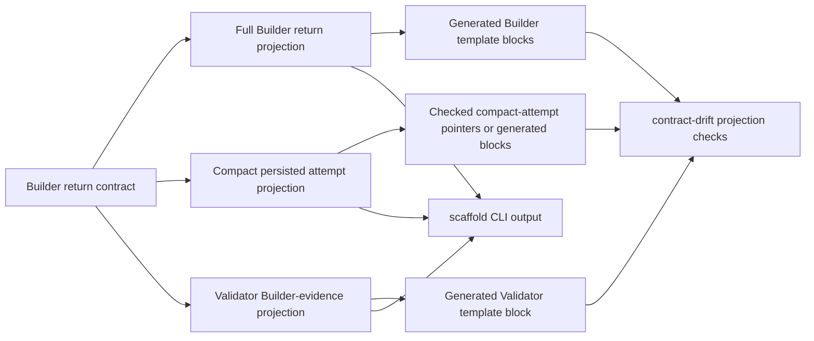

# feat: Move Builder return envelope projections

## Summary

Extend the runtime-owned scaffold path from issue #114 to the Builder return-envelope family. Add one Builder return contract with explicit projections for transient Builder output, compact persisted `builder_attempts` rows, and Validator Builder-evidence input, then expose those views through the scaffold CLI and drift-checked template blocks or pointers.

---

## Problem Frame

Issue #113 moves repeatable Issue-to-PR scaffold shapes out of hand-authored prose and into runtime-owned TypeScript renderers. Issue #115 is the next slice after the #114 tracer: duplicate Builder return-envelope shapes still live across Builder templates, compact ledger attempt prose, and Validator Builder-evidence guidance.

---

## Requirements

- R1. Builder return, compact persisted attempt, and Validator Builder-evidence views render from one runtime-owned Builder return contract with explicit projections.
- R2. Generated blocks or checked pointers replace matching hand-maintained scaffold member lists.
- R3. `scaffold <id> --json`, `contract scaffold_ids --json`, and CLI help include the Builder return-envelope projection surfaces.
- R4. Packet tests preserve dispatch evidence, deny-list behavior, evidence-lane separation, and rendered packet semantics.
- R5. Drift tests catch stale Builder return-envelope generated views.
- R6. Drift tests catch invalid or stale scaffold pointers for Builder return-envelope projection surfaces.
- R7. Existing Issue-to-PR workflow semantics remain unchanged: no new stage, route, ledger mutation behavior, Validator gate, or human confirmation gate.
- R8. Orchestrator-inline evidence remains separate from Builder evidence and must not be folded into the Builder return contract.

**Origin actors:** A1 Orchestrator, A3 Builder sub-agent, A4 Validator personas, A5 User.
**Origin flows:** F1 Builder implementation attempt, F2 Builder repair attempt, F4 Builder Work Packet shape, F5 Builder return envelope, F6 Compact implementation audit lanes.
**Origin acceptance examples:** AE2 Builder committed envelope, AE3 preflight fail-stop envelope, AE4 repair Builder evidence to Validators, AE9 malformed envelope infrastructure failure.

---

## Scope Boundaries

- Plan only the Builder return-envelope projection family from issue #115.
- Preserve the issue #114 `ce-plan-candidate-batch` scaffold and drift path.
- Do not migrate ledger section scaffolds, Notes evidence rows, candidate-batch variants, patch proposal scaffolds, Proposer envelopes, or Validator finding return envelopes in this slice.
- Do not change ledger validation semantics for `builder_attempts`; this plan may only align scaffold views and tests with existing validation.
- Do not change `renderBuilderPacket()` or `renderValidatorPacket()` output unless implementation proves a generated scaffold must be embedded there.
- Do not add CLI mutation commands or template regeneration commands.
- Do not add a YAML dependency unless focused renderer tests prove current Bun/TypeScript helpers cannot safely render required static scaffolds.

### Deferred to Follow-Up Work

- Full #113 packet, ledger, Notes, patch proposal, and finding-row scaffold migration: parent issue #113 or later child issues.
- Broad scaffold inventory for all agent-fillable YAML blocks outside the Builder return-envelope projection family.
- Finding lifecycle closure-rule extraction.

---

## Context & Research

### Relevant Code and Patterns

- `docs/adr/0005-template-scaffold-contracts-are-runtime-owned.md` is the ownership anchor: templates frame handoffs; runtime owns scaffold contracts; generated or emitted views show scaffold shape.
- `runbooks/issue-to-pr-v2/lib/scaffolds.ts` already defines the first scaffold registry, metadata, `SCAFFOLD_IDS`, `renderScaffold()`, and typed scaffold errors.
- `runbooks/issue-to-pr-v2/cli.ts` already exposes `contract scaffold_ids --json`, `scaffold <id> --json`, help metadata, and `unknown-scaffold-id` errors.
- `runbooks/issue-to-pr-v2/contract-drift.ts` already checks the `ce-plan-candidate-batch` generated block against `renderScaffold()`.
- `runbooks/issue-to-pr-v2/lib/contract.ts` owns compact persisted Builder attempt fields through `BUILDER_ATTEMPT_FIELDS`, allowed attempt types, and allowed attempt statuses.
- `runbooks/issue-to-pr-v2/lib/packets.ts` owns packet data types, Validator evidence lane separation, packet deny-list behavior, and current Builder/Validator markdown rendering.
- `runbooks/issue-to-pr-v2/templates/builder-return-envelope.md` carries the full Builder return shape, compact persistence explanation, and Validator evidence handoff.
- `runbooks/issue-to-pr-v2/templates/builder-work-packet.md` references the return envelope and repeats the full Builder output shape.
- `runbooks/issue-to-pr-v2/templates/validator-envelope.md` repeats the Builder evidence input shape and keeps Orchestrator-inline evidence separate.

### Institutional Learnings

- No `docs/solutions/` learning files exist in this checkout.
- Prior plans in `docs/plans/2026-05-26-002-feat-template-scaffold-renderers-plan.md` and `docs/plans/2026-05-26-003-feat-scaffold-tracer-path-plan.md` establish the registry, CLI, generated-block, and drift-check direction this slice should extend.

### External References

- None. Local ADRs, issues, requirements, runtime seams, and tracer implementation provide enough grounding.

---

## Key Technical Decisions

- Extend `lib/scaffolds.ts` rather than introduce a second Builder-envelope registry. Issue #114 already proved the runtime-owned scaffold seam, CLI discovery path, and generated-block drift marker.
- Model Builder return as one contract with named projections. The full Builder output, compact persisted attempt row, and Validator Builder-evidence input should share source field definitions but render different views.
- Reuse existing runtime facts where they already own semantics. `BUILDER_ATTEMPT_FIELDS` and allowed attempt enums stay in `lib/contract.ts`; packet lane behavior and Validator evidence filtering stay in `lib/packets.ts`.
- Keep Orchestrator-inline evidence outside the Builder return projection family. Validator inline evidence may remain hand-authored in this slice unless touched only to preserve lane separation around the Builder evidence block.
- Use generated blocks for concrete fillable YAML shown to Builder or Validator. Use checked pointers where a reference only needs to route readers to the CLI scaffold surface.
- Keep drift checks scoped. Extend the existing generated-block checker to configured Builder/Validator template surfaces and checked pointers, without turning `contract-drift.ts` into a broad Markdown or YAML auditor.

---

## Open Questions

### Resolved During Planning

- Should issue #115 wait for issue #114? Issue #114 is implemented locally on `codex/route-reference-contract` with commits `81c5dd5` and `a3bb03a`; this plan builds on that tracer path.
- Should this slice implement the full #113 scaffold migration? No. Issue #115 names the Builder return-envelope projection family only.
- Should external research run? No. The repo has direct local patterns for scaffold registry, CLI exposure, generated-block markers, packet renderers, and drift tests.

### Deferred to Implementation

- Exact scaffold id names for each Builder projection. They must be stable, cataloged, discoverable, and tested.
- Exact checked-pointer marker syntax. Prefer reusing the generated-block marker style where concrete YAML is embedded, and add the smallest pointer marker that `contract-drift.ts` can validate reliably.
- Whether `lib/packets.ts` needs to export existing Builder evidence field ordering or whether `lib/scaffolds.ts` can own the projection without coupling to packet implementation details.

---

## High-Level Technical Design

> *This illustrates the intended approach and is directional guidance for review, not implementation specification. The implementing agent should treat it as context, not code to reproduce.*

The invariant: the Builder return contract owns the shared field vocabulary once; projections decide which fields each consumer sees.

---

## Implementation Units

### U1. Add Builder return projection renderers

**Goal:** Define one runtime-owned Builder return contract and render the three issue #115 projection views from it.

**Requirements:** R1, R4, R8; origin F5, F6, AE2, AE3, AE4.

**Dependencies:** Issue #114 tracer scaffold path present in the checkout.

**Files:**

- Modify: `runbooks/issue-to-pr-v2/lib/scaffolds.ts`
- Modify: `runbooks/issue-to-pr-v2/lib/scaffolds.test.ts`
- Modify: `runbooks/issue-to-pr-v2/lib/contract.ts`
- Modify: `runbooks/issue-to-pr-v2/lib/contract.test.ts`
- Test: `runbooks/issue-to-pr-v2/lib/scaffolds.test.ts`
- Test: `runbooks/issue-to-pr-v2/lib/contract.test.ts`

**Approach:**

- Add projection-aware scaffold definitions for the Builder return family to the existing scaffold registry.
- Define the full Builder output field order once, including `suggested_validator_focus` as required and empty-array-valid.
- Define the compact persisted attempt projection by reusing `BUILDER_ATTEMPT_FIELDS`, not by copying those names into a second list.
- Define the Validator Builder-evidence projection from the rich Builder evidence fields only.
- Keep `suggested_scope_changes` and `notes` out of the Validator Builder-evidence projection; these are not Validator input.
- Keep Orchestrator-inline evidence out of every Builder projection.
- Keep scaffold rendering static and placeholder-based; no ledger state or packet input is required.

**Patterns to follow:**

- `runbooks/issue-to-pr-v2/lib/scaffolds.ts` for `ce-plan-candidate-batch` metadata, renderer, `source`, and typed errors.
- `runbooks/issue-to-pr-v2/lib/contract.ts` for runtime-owned ordered tuples and enum membership.
- `runbooks/issue-to-pr-v2/templates/builder-return-envelope.md` for current full, persisted, and Validator evidence shapes.

**Test scenarios:**

- Happy path: full Builder return projection includes status, attempt metadata, commit fields, blockers, probe results, scope suggestions, rich evidence arrays, `suggested_validator_focus`, and notes in deterministic order.
- Happy path: compact persisted attempt projection renders exactly the fields from `BUILDER_ATTEMPT_FIELDS` in catalog order.
- Happy path: Validator Builder-evidence projection renders only implementation steps, existing seams, tests, assumptions, risks, deferred items, and suggested Validator focus.
- Edge case: required array fields render as `[]` placeholders, including `suggested_validator_focus`.
- Edge case: nullable fields render as explicit null placeholders where the current templates require null.
- Error path: unknown Builder projection scaffold id still raises the existing typed scaffold error.
- Regression: no projection body contains Orchestrator-inline evidence fields, `orchestrator_inline_attempts`, or `builder_commits`.

**Verification:**

- Renderer tests prove all three projections are derived from one Builder return field source and remain lane-separated.

---

### U2. Expose Builder projections through scaffold CLI discovery

**Goal:** Make the Builder return-envelope projection surfaces discoverable and renderable through the read-only CLI.

**Requirements:** R3, R7.

**Dependencies:** U1.

**Files:**

- Modify: `runbooks/issue-to-pr-v2/cli.ts`
- Modify: `runbooks/issue-to-pr-v2/cli.test.ts`
- Modify: `runbooks/issue-to-pr-v2/cli-smoke.test.ts`
- Modify: `runbooks/issue-to-pr-v2/README.md`
- Test: `runbooks/issue-to-pr-v2/cli.test.ts`
- Test: `runbooks/issue-to-pr-v2/cli-smoke.test.ts`

**Approach:**

- Let `contract scaffold_ids --json` pick up the new ids from `SCAFFOLD_IDS`.
- Keep `scaffold <id> --json` response shape unchanged: scaffold id, output kind, source, ordering, and body.
- Ensure `--help --json` advertises the new scaffold ids without duplicating the catalog.
- Add README wording only if needed to mention that scaffold ids now include Builder projection views; do not restate the field lists.
- Preserve one-envelope stdout and read-only behavior.

**Patterns to follow:**

- `runbooks/issue-to-pr-v2/cli.ts` scaffold command from issue #114.
- `runbooks/issue-to-pr-v2/cli.test.ts` scaffold command tests.
- `runbooks/issue-to-pr-v2/cli-smoke.test.ts` "every documented scaffold id" process-boundary test.

**Test scenarios:**

- Happy path: `contract scaffold_ids --json` includes the Builder projection ids in catalog order.
- Happy path: `scaffold <builder full return id> --json` returns success metadata and a body equal to `renderScaffold()` output.
- Happy path: `scaffold <compact attempt id> --json` returns the compact persisted projection.
- Happy path: `scaffold <Validator Builder evidence id> --json` returns the Validator Builder-evidence projection.
- Integration: `--help --json` includes every Builder projection id in `data.scaffold_ids`.
- Process boundary: `cli-smoke.test.ts` succeeds for every help-documented scaffold id.
- Error path: unknown scaffold ids still return `unknown-scaffold-id`, exit 64, and `change_input`.

**Verification:**

- CLI and smoke tests prove the new projection views are agent-discoverable and read-only.

---

### U3. Replace Builder and Validator template member lists

**Goal:** Remove hand-maintained Builder return-envelope member lists from scoped templates and replace them with generated blocks or checked pointers.

**Requirements:** R2, R4, R7, R8; origin F4, F5, F6, AE2, AE4, AE9.

**Dependencies:** U1, U2.

**Files:**

- Modify: `runbooks/issue-to-pr-v2/templates/builder-return-envelope.md`
- Modify: `runbooks/issue-to-pr-v2/templates/builder-work-packet.md`
- Modify: `runbooks/issue-to-pr-v2/templates/validator-envelope.md`
- Modify: `runbooks/issue-to-pr-v2/references/builder-dispatch.md`
- Modify: `runbooks/issue-to-pr-v2/references/findings-and-validators.md`
- Modify: `runbooks/issue-to-pr-v2/lib/packets.test.ts`
- Test: `runbooks/issue-to-pr-v2/lib/packets.test.ts`

**Approach:**

- Replace the concrete Builder return envelope YAML in `builder-return-envelope.md` with a generated scaffold block from the full Builder return projection.
- Replace the duplicate Builder return envelope YAML in `builder-work-packet.md` with the same generated scaffold block so Builder entry guidance still shows the concrete output shape.
- Replace the `builder_evidence` YAML member list in `validator-envelope.md` with a generated scaffold block from the Validator Builder-evidence projection.
- Replace compact persisted attempt field lists in Builder references with checked pointers to the compact persisted projection; use a generated compact block only where the template needs a concrete fillable row.
- Preserve prose that explains role boundaries, read triggers, malformed output, lane separation, and how rich evidence differs from compact persistence.
- Preserve the Orchestrator-inline evidence block in `validator-envelope.md` unless implementation needs a minimal edit to emphasize it is separate and not part of the Builder return contract.
- Add packet regression tests to prove template edits did not weaken packet render behavior.

**Patterns to follow:**

- `runbooks/issue-to-pr-v2/templates/ce-plan-addendum.md` generated scaffold markers.
- `runbooks/issue-to-pr-v2/templates/builder-return-envelope.md` current explanatory split between full envelope, compact persistence, and Validator handoff.
- Existing `runbooks/issue-to-pr-v2/lib/packets.test.ts` deny-list tests.

**Test scenarios:**

- Happy path: Builder packet rendering still returns the same `dispatch_evidence` role, route id, loaded references, and loaded templates.
- Happy path: Builder packet data still includes target batch contract, compact prior Builder attempts, scoped findings, local-law order, authority boundary, and output-contract pointer.
- Happy path: Validator packet with Builder evidence still renders `evidence_source: builder` and the seven Builder evidence arrays.
- Regression: Builder packet still excludes full plan content, unrelated batches, raw Validator envelopes, rich prior Builder evidence, and Orchestrator-inline attempts from prior Builder attempts.
- Regression: Validator packet with Builder evidence still strips `notes` and `suggested_scope_changes`.
- Regression: inline Validator packet still rejects Builder evidence and renders inline evidence without Builder fields.

**Verification:**

- Packet tests prove behavior is unchanged while template member lists move to generated or checked runtime-owned views.

---

### U4. Extend scaffold drift checks to Builder projection views

**Goal:** Fail loudly when Builder return-envelope generated blocks or checked pointers drift from runtime scaffold output.

**Requirements:** R2, R5, R6, R7.

**Dependencies:** U1, U2, U3.

**Files:**

- Modify: `runbooks/issue-to-pr-v2/contract-drift.ts`
- Modify: `runbooks/issue-to-pr-v2/contract-drift.test.ts`
- Test: `runbooks/issue-to-pr-v2/contract-drift.test.ts`

**Approach:**

- Generalize the current ce-plan-only generated scaffold check into a small configured inventory of expected generated blocks and checked pointers.
- Include only the scoped Builder projection surfaces touched by U3.
- Reuse `renderScaffold()` as the comparison source for generated block bodies.
- Validate marker source strings against the CLI scaffold command.
- Add checked-pointer validation for references that point at a scaffold id instead of embedding the YAML body.
- Keep the check narrow: expected files plus expected ids, not broad Markdown crawling or generic YAML parsing.
- Preserve existing ce-plan generated block checks.

**Patterns to follow:**

- `checkGeneratedScaffoldBlocksDrift()` in `runbooks/issue-to-pr-v2/contract-drift.ts`.
- Existing fixture mutation tests in `runbooks/issue-to-pr-v2/contract-drift.test.ts`.
- `CONTEXT.md` definition of runtime contract drift checks as focused comparisons against CLI-owned facts.

**Test scenarios:**

- Happy path: real Builder return-envelope generated blocks match `renderScaffold()`.
- Happy path: real Validator Builder-evidence generated blocks match `renderScaffold()`.
- Happy path: compact persisted attempt checked pointers resolve to known scaffold ids.
- Error path: stale Builder full-return generated block produces a targeted drift finding naming doc path and scaffold id.
- Error path: stale Validator Builder-evidence generated block produces a targeted drift finding.
- Error path: unknown scaffold id in a generated marker or checked pointer produces a targeted finding.
- Error path: missing generated-block end marker still produces a malformed marker finding.
- Regression: existing `ce-plan-candidate-batch` generated block drift tests still pass.

**Verification:**

- Drift tests prove committed Builder projection views cannot silently diverge from runtime scaffold renderers.

---

### U5. Preserve packet, ledger, and scaffold contract parity

**Goal:** Add cross-surface regression coverage so the new Builder projection scaffolds remain aligned with existing packet and ledger contract owners.

**Requirements:** R1, R4, R7, R8; origin F4, F5, F6, AE9.

**Dependencies:** U1, U2, U3, U4.

**Files:**

- Modify: `runbooks/issue-to-pr-v2/lib/scaffolds.test.ts`
- Modify: `runbooks/issue-to-pr-v2/lib/packets.test.ts`
- Modify: `runbooks/issue-to-pr-v2/lib/ledger.test.ts`
- Test: `runbooks/issue-to-pr-v2/lib/scaffolds.test.ts`
- Test: `runbooks/issue-to-pr-v2/lib/packets.test.ts`
- Test: `runbooks/issue-to-pr-v2/lib/ledger.test.ts`

**Approach:**

- Add tests that compare compact projection field order with the runtime compact attempt fields the ledger validates.
- Add tests that compare Validator Builder-evidence projection membership with the evidence fields accepted by the Validator packet renderer.
- Keep ledger tests focused on compatibility with existing validation, not new semantics.
- Do not add decompose-level coverage unless implementation discovers an existing helper-emitted view now depends on the compact projection; route that expansion to follow-up if it would widen this slice.
- Do not make tests depend on private helper names; assert observable scaffold, packet, and validator behavior.

**Patterns to follow:**

- `runbooks/issue-to-pr-v2/lib/ledger.test.ts` current validation of `builder_attempts` field shape and inline lane separation.
- Existing packet deny-list tests that assert both inclusion and exclusion.

**Test scenarios:**

- Happy path: compact persisted projection fields equal `BUILDER_ATTEMPT_FIELDS`; adding a persisted field in `contract.ts` without updating projection expectations fails.
- Happy path: a representative compact Builder attempt row shaped from the compact projection validates through existing ledger helpers.
- Happy path: Validator Builder-evidence projection fields match the Builder evidence payload rendered by `renderValidatorPacket()`.
- Error path: adding `notes` or `suggested_scope_changes` to Validator Builder-evidence projection fails the lane-safety test.
- Error path: adding `orchestrator_inline_attempts` or inline evidence fields to any Builder projection fails the lane-safety test.
- Regression: terminal Builder attempt validation still requires matching checkpoint and completed Validator-wave evidence.

**Verification:**

- Cross-surface tests prove the projection family did not create a second source of truth for existing packet or ledger contracts.

---

## System-Wide Impact

- **Interaction graph:** `lib/contract.ts` compact attempt facts and `lib/scaffolds.ts` projection renderers feed CLI scaffold output, generated template blocks, and drift checks. `lib/packets.ts` remains the packet behavior owner.
- **Error propagation:** unknown scaffold ids stay typed renderer errors and structured CLI usage errors. Drift failures produce targeted doc/id findings.
- **State lifecycle risks:** none. The CLI remains read-only and no ledger state is mutated by scaffold rendering.
- **API surface parity:** `SCAFFOLD_IDS`, `contract scaffold_ids --json`, `scaffold <id> --json`, `--help --json`, generated blocks, and checked pointers must agree on ids and sources.
- **Integration coverage:** packet regression tests prove dispatch evidence, deny-list behavior, and evidence lane separation remain intact after template changes.
- **Unchanged invariants:** `builder_attempts` remains compact persisted evidence only; rich Builder evidence stays transient into Validator packets; Orchestrator-inline evidence remains separate.

---

## Risks & Dependencies

| Risk | Mitigation |
| --- | --- |
| Projection registry becomes a second schema mirror. | Reuse `BUILDER_ATTEMPT_FIELDS` and packet evidence ownership; add parity tests against existing runtime owners. |
| Template changes weaken Builder or Validator instructions. | Replace only member lists; preserve role, read trigger, malformed-output, lane-separation, and authority prose. |
| Drift checker scope expands too far. | Use a configured expected-surface inventory for this issue's files and ids only. |
| Packet renderer behavior changes accidentally. | Add packet regression tests before or with template edits. |
| Builder and inline evidence lanes blur. | Keep inline fields out of Builder projections and add explicit negative tests. |
| Issue #114 tracer is not on the implementation branch. | Implement #115 on top of the #114 branch/commits or after the tracer merges. |

---

## Documentation / Operational Notes

- `README.md` may mention that scaffold discovery now includes Builder return-envelope projection ids.
- Builder and Validator templates should name generated scaffold sources or checked CLI scaffold commands.
- References should point to scaffold surfaces for deterministic field lists and keep prose for authority, routing, and judgment.
- No migration or rollout step is needed; this is a read-only scaffold ownership change.

---

## Sources & References

- **Origin document:** [docs/brainstorms/2026-05-21-issue-to-pr-builder-sub-agent-requirements.md](../brainstorms/2026-05-21-issue-to-pr-builder-sub-agent-requirements.md)
- GitHub issue #115: feat(issue-to-pr): move Builder return envelope projections.
- GitHub issue #113: PRD: TS-owned template contracts and scaffold renderers.
- GitHub issue #114: feat(issue-to-pr): prove scaffold tracer path.
- `docs/adr/0005-template-scaffold-contracts-are-runtime-owned.md`
- `docs/plans/2026-05-26-002-feat-template-scaffold-renderers-plan.md`
- `docs/plans/2026-05-26-003-feat-scaffold-tracer-path-plan.md`
- `CONTEXT.md`
- `runbooks/issue-to-pr-v2/lib/scaffolds.ts`
- `runbooks/issue-to-pr-v2/lib/contract.ts`
- `runbooks/issue-to-pr-v2/lib/packets.ts`
- `runbooks/issue-to-pr-v2/contract-drift.ts`
