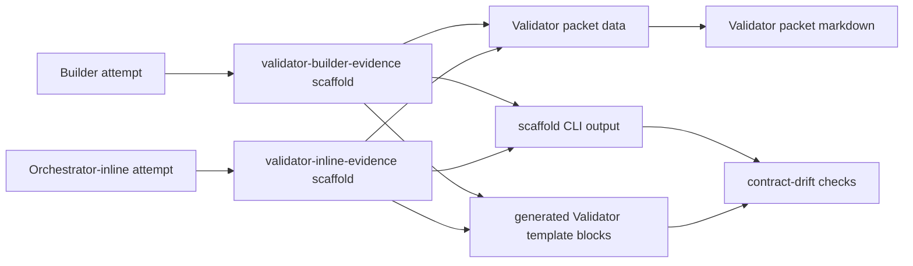

# feat: Move Validator evidence lane scaffolds

## Summary

Extend the runtime-owned scaffold path from issues #114 and #115 to both Validator evidence lanes. Keep Builder evidence and Orchestrator-inline evidence as separate scaffold surfaces, expose both through CLI discovery/output, and prove packet rendering, structured packet data, generated template blocks, and drift checks agree.

---

## Problem Frame

Issue #116 is a narrow child of the TS-owned scaffold renderer work in issue #113. The current local scaffold path already covers the Builder evidence input that Validator packets consume; the remaining drift surface is the hand-authored Orchestrator-inline evidence shape and the lack of explicit parity checks across Validator packet data, packet markdown, CLI scaffolds, and generated views.

---

## Requirements

- R1. Validator Builder-evidence scaffold includes only Builder evidence fields and arrays.
- R2. Validator inline-evidence scaffold includes only inline evidence fields.
- R3. Validator inline-evidence scaffold rejects Builder evidence shape leakage.
- R4. Packet markdown and structured packet data agree on evidence lane and field names.
- R5. CLI scaffold discovery/output exposes both Validator evidence-lane surfaces.
- R6. Generated blocks or checked pointers for Validator evidence lanes are drift-checked without changing Validator semantics.
- R7. Existing Builder evidence filtering remains intact: `notes` and `suggested_scope_changes` do not cross into Validator packets.
- R8. CLI remains read-only and does not mutate ledgers, templates, target repos, or git state.
- R9. Workflow semantics stay unchanged: no new Validator wave behavior, reviewer selection, ledger lifecycle, mutation command, or human gate.

**Origin actors:** A1 Orchestrator, A3 Builder sub-agent, A4 Validator personas, A5 User.
**Origin flows:** F1 Builder implementation attempt, F1b Orchestrator-inline `change_first` implementation attempt, F2 Builder repair attempt, F5 Builder return envelope, F6 Compact implementation audit lanes.
**Origin acceptance examples:** AE4 Builder repair evidence to Validators, AE11 Orchestrator-inline attempt with inline evidence, AE12 committed attempt requires attempt checkpoint and Validator wave, AE13 inline path routes to Builder when triggers fire, AE15 P0/P1 repair routes through Builder, AE16 attempt checkpoint before Validator packet rendering.

---

## Scope Boundaries

- Plan only the Validator evidence-lane scaffold surfaces for issue #116.
- Preserve existing issue #114 and #115 scaffold IDs and drift checks.
- Do not migrate Validator finding return envelopes, Validator wave completion evidence, ledger lifecycle scaffolds, Notes evidence rows, patch proposal scaffolds, or Proposer envelopes in this slice.
- Do not change Validator persona selection, full-wave requirements, malformed-output handling, findings normalization, or dedupe rules.
- Do not change ledger validation semantics for `builder_attempts`, `orchestrator_inline_attempts`, `builder_commits`, `iterations`, or completed Validator-wave evidence.
- Do not add CLI mutation commands or template regeneration commands.
- Do not add a YAML dependency unless focused renderer tests prove current Bun/TypeScript helpers cannot safely render the required static scaffolds.

### Deferred to Follow-Up Work

- Validator finding-row and return-envelope runtime-owned scaffolds: parent issue #113 or later child issue.
- Ledger and Notes evidence scaffold migration: parent issue #113 or later child issue.
- Completed Validator-wave evidence rendering or validation changes: separate workflow/ledger slice.

---

## Context & Research

### Relevant Code and Patterns

- `docs/adr/0005-template-scaffold-contracts-are-runtime-owned.md` is the ownership anchor: templates frame handoffs; runtime owns scaffold contracts; generated or emitted views show scaffold shape.
- `docs/adr/0004-deterministic-workflow-contracts-live-in-code.md` says deterministic workflow contracts belong in code and emitted facts, not parallel prose.
- `runbooks/issue-to-pr-v2/lib/scaffolds.ts` already defines `SCAFFOLD_IDS`, `renderScaffold()`, catalog metadata, typed scaffold errors, and the `validator-builder-evidence` scaffold.
- `runbooks/issue-to-pr-v2/lib/contract.ts` already owns `BUILDER_VALIDATOR_EVIDENCE_FIELDS`; inline evidence lacks the matching ordered runtime tuple.
- `runbooks/issue-to-pr-v2/lib/packets.ts` owns `ValidatorEvidenceSource`, `InlineAttemptEvidence`, `BuilderEvidence`, lane-specific packet data, Builder fix-prose stripping, and Validator packet markdown rendering.
- `runbooks/issue-to-pr-v2/templates/validator-envelope.md` already embeds a generated `validator-builder-evidence` block and still carries a hand-authored inline evidence block.
- `runbooks/issue-to-pr-v2/references/findings-and-validators.md` already points at `validator-builder-evidence` and describes inline evidence in prose.
- `runbooks/issue-to-pr-v2/cli.ts`, `cli.test.ts`, and `cli-smoke.test.ts` already expose scaffold discovery/output through the read-only JSON envelope style.
- `runbooks/issue-to-pr-v2/contract-drift.ts` already validates configured generated scaffold blocks and checked scaffold pointers against runtime renderer output.

### Institutional Learnings

- No `docs/solutions/` learning files exist in this checkout.
- Prior issue #114 and #115 plans establish the scaffold registry, generated block marker, checked pointer marker, CLI scaffold command, and drift-check extension pattern this plan should extend.
- `CONTEXT.md` defines runtime contract drift checks as focused comparisons against CLI-owned facts, not broad Markdown audits.

### External References

- None. Local ADRs, issues, runtime seams, and prior scaffold slices provide enough grounding.

---

## Key Technical Decisions

- Add a distinct `validator-inline-evidence` scaffold surface instead of broadening `validator-builder-evidence`. Lane separation is the safety property, not a display detail.
- Add an ordered inline evidence field tuple in `lib/contract.ts` so scaffold tests and packet parity tests do not duplicate inline field literals.
- Keep `lib/packets.ts` as the Validator packet behavior owner. The plan should test packet data and markdown against scaffold field contracts rather than moving all Validator YAML rendering in this slice.
- Keep generated YAML in `templates/validator-envelope.md` where agents need concrete fillable evidence blocks, and use checked pointers in reference prose where discovery is enough.
- Extend `contract-drift.ts` only through configured surfaces. Do not broaden it into a general Markdown/YAML scanner.
- Preserve the default Builder evidence source behavior while strengthening inline-specific tests around required flags and wrong-lane payloads.

---

## Open Questions

### Resolved During Planning

- Should issue #116 implement the whole Validator scaffold family? No. The issue names evidence-lane surfaces only.
- Should inline evidence be folded into `validator-builder-evidence`? No. Builder-evidence and Orchestrator-inline evidence are separate audit lanes from the origin requirements.
- Should packet rendering be rewritten to consume scaffold renderers directly? Not in this slice. The safer plan is parity coverage first, because packet rendering owns behavior and already has lane-specific data construction.
- Should external docs research run? No. The work follows repo-local ADRs, runtime code, and established scaffold patterns.

### Deferred to Implementation

- Exact helper shape for deriving field names from rendered scaffold bodies in tests. It should assert public fields, not private renderer helper names.
- Whether packet markdown should share a small field-order helper with scaffold rendering. Only do this if it reduces duplication without changing packet semantics.

---

## High-Level Technical Design

> *This illustrates the intended approach and is directional guidance for review, not implementation specification. The implementing agent should treat it as context, not code to reproduce.*

The invariant: each Validator packet carries exactly one evidence lane. The scaffold catalog, packet data, packet markdown, template blocks, and drift checks must all name that lane and its fields the same way.

---

## Implementation Units

### U1. Add inline evidence runtime field contract and scaffold

**Goal:** Make Orchestrator-inline Validator evidence a runtime-owned scaffold surface alongside the existing Builder evidence scaffold.

**Requirements:** R1, R2, R3, R5, R8, R9; origin F1b, F6, AE11, AE13.

**Dependencies:** Issue #114 scaffold command present; issue #115 `validator-builder-evidence` scaffold present.

**Files:**

- Modify: `runbooks/issue-to-pr-v2/lib/contract.ts`
- Modify: `runbooks/issue-to-pr-v2/lib/contract.test.ts`
- Modify: `runbooks/issue-to-pr-v2/lib/scaffolds.ts`
- Modify: `runbooks/issue-to-pr-v2/lib/scaffolds.test.ts`
- Test: `runbooks/issue-to-pr-v2/lib/contract.test.ts`
- Test: `runbooks/issue-to-pr-v2/lib/scaffolds.test.ts`

**Approach:**

- Add an ordered `VALIDATOR_INLINE_EVIDENCE_FIELDS` tuple matching the existing `InlineAttemptEvidence` packet shape.
- Add `VALIDATOR_INLINE_EVIDENCE_KEYS` only if membership tests need it; do not add unused contract surface.
- Add `validator-inline-evidence` to `SCAFFOLD_IDS` after `validator-builder-evidence` so the two Validator lane surfaces sit together in catalog order.
- Render the inline scaffold under `inline_evidence:` with `implementation_commit`, `touched_files`, `inline_validity_note`, and `user_confirmed_exception_note`.
- Preserve `validator-builder-evidence` as a separate scaffold with only `BUILDER_VALIDATOR_EVIDENCE_FIELDS`.
- Keep renderer output placeholder-based and static; no ledger state or packet input is required.

**Patterns to follow:**

- `runbooks/issue-to-pr-v2/lib/scaffolds.ts` existing `validator-builder-evidence` rendering.
- `runbooks/issue-to-pr-v2/lib/contract.ts` ordered tuples and matching `Set` exports.
- `runbooks/issue-to-pr-v2/lib/scaffolds.test.ts` lane-leakage regression checks.

**Test scenarios:**

- Happy path: catalog exposes both `validator-builder-evidence` and `validator-inline-evidence` in deterministic order.
- Happy path: inline scaffold top-level field is exactly `inline_evidence`.
- Happy path: inline scaffold nested fields exactly match `VALIDATOR_INLINE_EVIDENCE_FIELDS`.
- Happy path: `implementation_commit` and `inline_validity_note` render as scalar placeholders, `touched_files` renders as an empty array/list placeholder, and `user_confirmed_exception_note` renders as nullable.
- Edge case: Builder evidence scaffold still renders exactly `BUILDER_VALIDATOR_EVIDENCE_FIELDS`.
- Regression: inline scaffold contains no `builder_evidence`, `implementation_steps`, `existing_seams_used`, `tests_run`, `assumptions`, `risks`, `deferred`, `suggested_validator_focus`, `notes`, `suggested_scope_changes`, `attempt_type`, or `status`.
- Regression: Builder evidence scaffold contains no `inline_evidence`, `implementation_commit`, `inline_validity_note`, or `user_confirmed_exception_note`.
- Error path: unknown scaffold id still raises the existing typed scaffold error.

**Verification:**

- Contract and scaffold tests prove both Validator evidence lanes have runtime-owned field order and no cross-lane leakage.

---

### U2. Expose both Validator evidence lanes through CLI discovery and output

**Goal:** Make the inline lane discoverable and renderable through the same read-only CLI surface as the Builder evidence lane.

**Requirements:** R5, R8, R9.

**Dependencies:** U1.

**Files:**

- Modify: `runbooks/issue-to-pr-v2/cli.ts`
- Modify: `runbooks/issue-to-pr-v2/cli.test.ts`
- Modify: `runbooks/issue-to-pr-v2/cli-smoke.test.ts`
- Modify: `runbooks/issue-to-pr-v2/README.md` only if help/discovery prose must mention the two Validator evidence-lane ids without restating fields.
- Test: `runbooks/issue-to-pr-v2/cli.test.ts`
- Test: `runbooks/issue-to-pr-v2/cli-smoke.test.ts`

**Approach:**

- Let `contract scaffold_ids --json` pick up `validator-inline-evidence` through `SCAFFOLD_IDS`.
- Keep `scaffold <id> --json` response shape unchanged: scaffold id, output kind, source, ordering, and body.
- Ensure `--help --json` exposes the new scaffold id through `data.scaffold_ids`.
- Update any CLI tests that currently describe issue #114/#115 scaffold coverage so the wording reflects Validator evidence lanes.
- Preserve one-envelope stdout, diagnostics behavior, exit codes, and read-only semantics.

**Patterns to follow:**

- `runbooks/issue-to-pr-v2/cli.ts` existing scaffold command.
- `runbooks/issue-to-pr-v2/cli.test.ts` scaffold command coverage.
- `runbooks/issue-to-pr-v2/cli-smoke.test.ts` process-boundary loop over documented scaffold ids.

**Test scenarios:**

- Happy path: `contract scaffold_ids --json` includes both Validator evidence-lane ids.
- Happy path: `scaffold validator-builder-evidence --json` returns the Builder evidence renderer body and unchanged envelope shape.
- Happy path: `scaffold validator-inline-evidence --json` returns the inline evidence renderer body and unchanged envelope shape.
- Integration: `--help --json` includes `validator-inline-evidence` in `data.scaffold_ids`.
- Process boundary: every help-documented scaffold id succeeds through `cli-smoke.test.ts`.
- Error path: unknown scaffold ids still return `unknown-scaffold-id`, exit 64, and the existing recovery hint.
- Regression: existing `contract`, `packet`, and scaffold command behavior remains unchanged.

**Verification:**

- CLI and smoke tests prove both Validator evidence-lane scaffolds are agent-discoverable and read-only.

---

### U3. Prove Validator packet data, markdown, and scaffolds agree

**Goal:** Add parity coverage so the structured Validator packet and rendered packet markdown cannot silently diverge from the runtime scaffold field contracts.

**Requirements:** R1, R2, R3, R4, R7, R9; origin F1, F1b, F2, F6, AE4, AE11, AE15.

**Dependencies:** U1.

**Files:**

- Modify: `runbooks/issue-to-pr-v2/lib/packets.ts` only if a small shared field-order helper is needed.
- Modify: `runbooks/issue-to-pr-v2/lib/packets.test.ts`
- Test: `runbooks/issue-to-pr-v2/lib/packets.test.ts`

**Approach:**

- Keep `renderValidatorPacket()` lane behavior unchanged: Builder is the default evidence source; inline requires `evidenceSource: "orchestrator_inline"` plus inline evidence.
- Add test helpers that derive the field names from packet data, packet markdown, and scaffold bodies, then compare them by lane.
- For Builder evidence, assert packet data and markdown expose exactly the `validator-builder-evidence` nested fields.
- For inline evidence, assert packet data and markdown expose exactly the `validator-inline-evidence` nested fields.
- Preserve Builder fix-prose stripping: `notes` and `suggested_scope_changes` remain excluded from Builder evidence forwarded to Validator packets.
- Preserve inline wrong-lane rejection: inline packets with Builder evidence remain invalid.
- Add coverage for the default evidence-source risk: tests should make it obvious that an inline attempt must opt into the inline lane rather than relying on the default Builder lane.

**Patterns to follow:**

- Existing Validator packet deny-list tests in `runbooks/issue-to-pr-v2/lib/packets.test.ts`.
- Existing `yamlFromValidator()` output shape in `runbooks/issue-to-pr-v2/lib/packets.ts`.
- Existing Builder evidence strip-prose comment and tests.

**Test scenarios:**

- Happy path: Builder-sourced Validator packet data has `evidence_source: builder` and `builder_evidence` keys matching the Builder evidence scaffold.
- Happy path: Builder-sourced Validator packet markdown has the same Builder evidence keys as packet data and scaffold output.
- Happy path: inline-sourced Validator packet data has `evidence_source: orchestrator_inline` and `inline_evidence` keys matching the inline evidence scaffold.
- Happy path: inline-sourced Validator packet markdown has the same inline evidence keys as packet data and scaffold output.
- Edge case: empty Builder evidence arrays render as empty arrays in packet data and markdown.
- Edge case: inline `user_confirmed_exception_note` renders as `null` when omitted and as a string when supplied.
- Error path: inline Validator packet with `builderEvidence` still fails with `invalid-validator-evidence-source`.
- Error path: inline-only flags without `--evidence-source orchestrator_inline` still fail at the CLI boundary.
- Regression: Builder evidence path still strips `notes` and `suggested_scope_changes`.
- Regression: inline evidence path contains no Builder evidence arrays or Builder attempt metadata.

**Verification:**

- Packet tests prove lane, field names, and render output agree without changing Validator semantics.

---

### U4. Replace Validator inline evidence template block and add checked pointers

**Goal:** Remove the remaining hand-authored inline evidence member list from Validator template prose and make both lane surfaces drift-checkable.

**Requirements:** R1, R2, R3, R6, R9; origin F1b, F6, AE11, AE12, AE16.

**Dependencies:** U1, U2.

**Files:**

- Modify: `runbooks/issue-to-pr-v2/templates/validator-envelope.md`
- Modify: `runbooks/issue-to-pr-v2/references/findings-and-validators.md`
- Modify: `runbooks/issue-to-pr-v2/references/stage-4-batch-loop.md` only if it currently restates inline evidence members that should become a pointer.
- Test: `runbooks/issue-to-pr-v2/lib/packets.test.ts`

**Approach:**

- Replace the inline evidence YAML block in `templates/validator-envelope.md` with a generated scaffold block for `validator-inline-evidence`.
- Keep the existing generated `validator-builder-evidence` block in the same template.
- Keep prose that explains when each lane applies, who asserts the evidence, and how transient Orchestrator focus differs from persisted findings.
- Add a checked pointer for `validator-inline-evidence` in `references/findings-and-validators.md` next to the existing Builder evidence pointer.
- Replace any nearby hand-maintained inline member list with prose that names the lane and points to the CLI scaffold surface.
- Do not remove concrete generated YAML where the Validator template needs a fillable packet body.

**Patterns to follow:**

- Generated block markers in `runbooks/issue-to-pr-v2/templates/ce-plan-addendum.md`.
- Existing `validator-builder-evidence` block in `runbooks/issue-to-pr-v2/templates/validator-envelope.md`.
- Existing checked scaffold pointers in `runbooks/issue-to-pr-v2/references/findings-and-validators.md`.

**Test scenarios:**

- Happy path: Validator template contains generated blocks for both evidence lanes with correct source strings.
- Happy path: findings-and-validators reference contains checked pointers for both evidence lanes.
- Regression: Validator template still states that Builder evidence is Builder-asserted and that Orchestrator transient focus is not persisted as Orchestrator-authored findings.
- Regression: no hand-authored inline evidence member list remains outside the generated block in the scoped Validator template/reference surfaces.

**Verification:**

- Template and packet tests show the agent-facing Validator packet instructions still expose concrete evidence shapes while prose no longer owns deterministic member lists.

---

### U5. Extend scaffold drift checks for both Validator evidence lanes

**Goal:** Make stale or missing Validator evidence-lane generated views fail through the existing runtime contract drift check.

**Requirements:** R5, R6, R8, R9.

**Dependencies:** U1, U4.

**Files:**

- Modify: `runbooks/issue-to-pr-v2/contract-drift.ts`
- Modify: `runbooks/issue-to-pr-v2/contract-drift.test.ts`
- Test: `runbooks/issue-to-pr-v2/contract-drift.test.ts`

**Approach:**

- Add `validator-inline-evidence` to the configured generated scaffold surface for `templates/validator-envelope.md`.
- Add `validator-inline-evidence` to the configured checked pointer surface for `references/findings-and-validators.md`.
- Keep the checker behavior unchanged: unknown scaffold id, wrong source string, malformed marker, stale body, missing start marker, and missing pointer produce structured findings.
- Keep the drift checker scoped to the existing surface inventories.

**Patterns to follow:**

- `GENERATED_SCAFFOLD_SURFACES` and `SCAFFOLD_POINTER_SURFACES` in `runbooks/issue-to-pr-v2/contract-drift.ts`.
- Existing stale `validator-builder-evidence` generated body test in `runbooks/issue-to-pr-v2/contract-drift.test.ts`.
- Existing missing pointer and stale pointer source fixture tests.

**Test scenarios:**

- Happy path: real generated scaffold blocks and checked pointers for both Validator evidence lanes match runtime facts.
- Error path: stale inline evidence generated block body is reported as `generated-scaffold-block` drift.
- Error path: missing inline evidence generated block start marker is reported.
- Error path: missing inline evidence checked pointer is reported.
- Error path: stale inline evidence pointer source is reported.
- Error path: unknown scaffold id in an inline evidence marker is reported.
- Integration: `checkContractDrift()` surfaces inline evidence scaffold drift through the top-level drift result.
- Regression: existing Builder evidence, Builder return, and ce-plan scaffold drift tests still pass.

**Verification:**

- Drift tests prove committed Validator evidence-lane views cannot diverge silently from runtime scaffold output.

---

## System-Wide Impact

- **Interaction graph:** Runtime field tuples feed scaffold rendering; scaffold rendering feeds CLI output and generated template blocks; Validator packet rendering remains the packet behavior owner and is checked for parity against scaffold fields.
- **Error propagation:** Unknown scaffold ids continue to produce `unknown-scaffold-id`; malformed or stale generated views produce structured drift findings, not runtime packet failures.
- **State lifecycle risks:** None introduced. The plan does not change ledger parsing, batch lifecycle, attempt counters, or Validator-wave completion evidence.
- **API surface parity:** `contract scaffold_ids --json`, `scaffold <id> --json`, `--help --json`, packet data, packet markdown, and generated blocks must agree on lane names and fields.
- **Integration coverage:** CLI smoke tests and contract-drift orchestration cover process-boundary and generated-view behavior that unit tests alone would not prove.
- **Unchanged invariants:** CLI remains read-only; Builder evidence and Orchestrator-inline evidence remain separate audit lanes; every committed attempt still routes to the same full Validator wave.

---

## Risks & Dependencies

| Risk | Mitigation |
|------|------------|
| Inline evidence gets folded into Builder evidence by convenience. | Add a separate scaffold id and negative leakage tests in both directions. |
| Packet markdown and scaffold output drift because they render separately. | Add parity tests that compare lane field names across packet data, packet markdown, and scaffold bodies. |
| Drift checker scope expands into a broad docs audit. | Extend only configured scaffold surfaces and pointer surfaces. |
| Existing issue #115 local changes are not present when implementation starts. | Treat #114 and #115 scaffold path changes as prerequisites; rebase or land them before implementing this plan. |
| Default Builder evidence source hides an inline attempt caller mistake. | Preserve default behavior but keep CLI tests for inline-only flags and add explicit inline lane parity/negative tests. |

---

## Documentation / Operational Notes

- Template prose should name the CLI scaffold command or checked pointer, not restate evidence member lists.
- README updates are optional and should stay discovery-focused if needed; do not duplicate the scaffold catalog fields in prose.
- No ADR is needed unless implementation changes the packet-rendering ownership boundary rather than adding parity coverage.

---

## Sources & References

- **Origin document:** [docs/brainstorms/2026-05-21-issue-to-pr-builder-sub-agent-requirements.md](../brainstorms/2026-05-21-issue-to-pr-builder-sub-agent-requirements.md)
- GitHub issue: [#116](https://github.com/nathanvale/claude-code-config/issues/116)
- Parent issue: [#113](https://github.com/nathanvale/claude-code-config/issues/113)
- Blocking issue plans: [docs/plans/2026-05-26-003-feat-scaffold-tracer-path-plan.md](2026-05-26-003-feat-scaffold-tracer-path-plan.md), [docs/plans/2026-05-26-004-feat-builder-return-envelope-projections-plan.md](2026-05-26-004-feat-builder-return-envelope-projections-plan.md)
- Runtime scaffold owner: `runbooks/issue-to-pr-v2/lib/scaffolds.ts`
- Runtime field owner: `runbooks/issue-to-pr-v2/lib/contract.ts`
- Validator packet owner: `runbooks/issue-to-pr-v2/lib/packets.ts`
- Drift check owner: `runbooks/issue-to-pr-v2/contract-drift.ts`
- Validator template: `runbooks/issue-to-pr-v2/templates/validator-envelope.md`
- Validator policy reference: `runbooks/issue-to-pr-v2/references/findings-and-validators.md`
