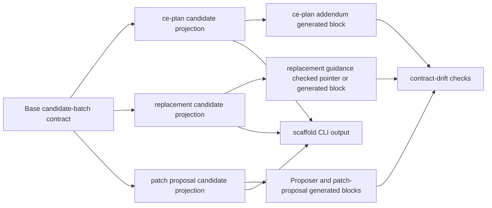

# feat: Move candidate-batch projections

## Summary

Extend the runtime-owned scaffold path to the candidate-batch family. Use one shared candidate-batch field contract with explicit projections for ce-plan output, replacement batches, and patch proposals, then expose every projection through CLI scaffold discovery and drift-checked generated views or pointers.

---

## Problem Frame

Issue #113 moves repeated Issue-to-PR v2 scaffold shapes out of hand-authored prose and into TypeScript-owned runtime contracts. Issue #117 narrows that work to candidate batches, where ce-plan addenda, replacement-batch guidance, patch-proposal templates, Proposer envelopes, helper validation, and ledger prose can still drift from each other.

---

## Requirements

- R1. A base candidate-batch scaffold contract owns shared ordered fields and finite values once.
- R2. The ce-plan projection renders only the fields valid for Stage 2 candidate batches.
- R3. The replacement projection renders only the fields valid for replacement batches, including `supersedes`.
- R4. The patch-proposal projection renders exactly one candidate patch batch and keeps `ac_mapping: []`.
- R5. `scaffold <id> --json`, `contract scaffold_ids --json`, and CLI help expose every candidate-batch projection id.
- R6. Generated blocks or checked pointers replace candidate-batch hand-authored scaffold member lists.
- R7. Drift checks protect every candidate-batch generated block, checked pointer, and visible scaffold command.
- R8. Existing workflow semantics remain unchanged: no new stage, ledger mutation command, patch authorization path, replacement dependency rule, or confirmation gate.
- R9. Tests cover projection boundaries, CLI discovery/output, drift failure, and packet/helper parity for all candidate-batch projection ids.

**Origin actors:** A1 Orchestrator, A2 Contract Reviewer, A3 Builder sub-agent, A4 Validator personas, A5 User.
**Origin flows:** F0 Stage 3 Contract Review, F4 Builder Work Packet shape, F7 Replacement batches and `supersedes`, F8 Final-review patch proposals.
**Origin acceptance examples:** AE1 Stage 3 Contract Review, AE3 replacement batch with `supersedes`, AE6 candidate patch proposal.

---

## Scope Boundaries

- Plan only the candidate-batch projection scaffold family for issue #117.
- Preserve existing scaffold ids and behavior from issues #114, #115, and #116.
- Do not migrate Builder return envelopes, Validator evidence lanes, finding rows, Notes evidence rows, ledger lifecycle scaffolds, Proposer fail-stop envelopes, or workflow-learning scaffolds in this slice.
- Do not change `decompose.ts` validation semantics for ordinary candidates, replacement batches, patch proposals, AC coverage, rationale prefixes, or supersedes graph validation.
- Do not change packet role semantics, Builder dispatch policy, Contract Review behavior, Validator wave behavior, or final-review authorization.
- Do not add CLI mutation commands or template regeneration commands.
- Do not add a YAML dependency unless focused scaffold-renderer tests prove existing Bun/TypeScript rendering cannot safely emit these static placeholders.

### Deferred to Follow-Up Work

- Remaining #113 scaffold migrations outside candidate batches.
- Full Proposer return-envelope runtime scaffold beyond the candidate patch-batch projection.
- Ledger section, Notes evidence, and finding-row runtime-owned scaffolds.
- Generated human docs beyond scaffold blocks and checked pointers.

---

## Context & Research

### Relevant Code and Patterns

- `docs/adr/0004-deterministic-workflow-contracts-live-in-code.md` says deterministic workflow contracts belong in code and emitted facts, not parallel prose.
- `docs/adr/0005-template-scaffold-contracts-are-runtime-owned.md` says templates frame handoffs while runtime owns scaffold contracts.
- `runbooks/issue-to-pr-v2/lib/contract.ts` already owns `CANDIDATE_BATCH_FIELDS`, `EXECUTION_MODES`, `INVESTIGATION_RATIONALE`, patch rationale prefixes, and candidate-batch key membership.
- `runbooks/issue-to-pr-v2/lib/scaffolds.ts` already owns the scaffold catalog, `SCAFFOLD_IDS`, typed scaffold errors, and projection renderers for earlier scaffold slices.
- `runbooks/issue-to-pr-v2/cli.ts` already exposes `contract scaffold_ids --json`, `scaffold <id> --json`, help metadata, and read-only JSON envelopes.
- `runbooks/issue-to-pr-v2/contract-drift.ts` already validates generated scaffold blocks, checked scaffold pointers, and visible scaffold commands against runtime renderer facts.
- `runbooks/issue-to-pr-v2/templates/ce-plan-addendum.md` already embeds a generated `ce-plan-candidate-batch` block.
- `runbooks/issue-to-pr-v2/templates/proposer-envelope.md` and `runbooks/issue-to-pr-v2/templates/patch-proposal.md` still show candidate patch-batch member lists by hand.
- `runbooks/issue-to-pr-v2/issue-N-ledger.template.md`, `references/stage-3-decompose.md`, and `references/stage-4-batch-loop.md` describe candidate, replacement, and patch proposal constraints that should point at runtime-owned projection facts instead of restating field lists.
- `runbooks/issue-to-pr-v2/decompose.test.ts` already covers optional `supersedes`, replacement graph validation, patch proposal mode, `ac_mapping: []`, patch id shape, terminal dependencies, file-count bounds, and duplicate patch rejection.

### Institutional Learnings

- No `docs/solutions/` learning files exist in this checkout.
- Prior plans `docs/plans/2026-05-26-003-feat-scaffold-tracer-path-plan.md`, `docs/plans/2026-05-26-004-feat-builder-return-envelope-projections-plan.md`, and `docs/plans/2026-05-26-005-feat-validator-evidence-lane-scaffolds-plan.md` establish the registry, CLI, generated-block, checked-pointer, and drift-check pattern this slice should extend.
- `CONTEXT.md` defines runtime contract drift checks as focused comparisons against CLI-owned facts, not broad Markdown audits.

### External References

- None. Local ADRs, issue context, prior scaffold slices, and runtime seams provide enough grounding.

---

## Key Technical Decisions

- Extend `lib/scaffolds.ts` with candidate-batch projection definitions instead of adding a second registry. Existing scaffold discovery, rendering, and drift checks already use this seam.
- Preserve `ce-plan-candidate-batch` as the established Stage 2 projection id. Add `replacement-candidate-batch` and `patch-proposal-candidate-batch` as sibling ids so every projection is CLI-discoverable.
- Model projections as views over the base candidate-batch field order. Projection definitions decide included fields, wrapper shape, placeholder text, and patch-specific overrides; they must not duplicate finite values or validation semantics.
- Keep `supersedes` out of the ce-plan and patch-proposal projections. The replacement projection includes it because origin F7 makes it the audit link from blocked batch to replacement contract.
- Render the patch-proposal projection as a single candidate patch-batch scaffold with `ac_mapping: []`. Helper validation remains responsible for patch ids, terminal dependencies, file-count bounds, rationale prefixes, and user confirmation.
- Use generated blocks for concrete fillable YAML in templates and checked pointers where prose only needs a discoverable scaffold surface.
- Keep drift checks configured by known surfaces. Do not broaden `contract-drift.ts` into a generic Markdown/YAML scanner.
- Strengthen parity tests around rendered scaffolds, packet markdown, and helper validation rather than changing validation behavior in this slice.

---

## Open Questions

### Resolved During Planning

- Should issue #117 wait for issue #114? Yes for merge order. This plan assumes the issue #114 scaffold tracer path is present before implementation starts, because #117 extends that seam.
- Should this slice implement the whole #113 scaffold migration? No. Issue #117 names candidate-batch projections only.
- Should replacement batches be a separate projection from ce-plan candidates? Yes. Replacement rows carry `supersedes`; initial ce-plan candidates keep the current Stage 2 shape.
- Should patch proposals include `ac_mapping` values? No. Patch proposals keep `ac_mapping: []` by design and helper validation already rejects non-empty mappings.
- Should external research run? No. The repo has direct local patterns and no external API, library, or standards dependency.

### Deferred to Implementation

- Exact placeholder wording inside each scaffold body. It should preserve current operator meaning while deriving field order and finite values from runtime constants.
- Whether `lib/packets.ts` should render patch-proposal blocks directly from `renderScaffold()` or keep packet rendering separate with parity tests. Choose the smaller change that removes hand-authored scaffold member lists without changing packet behavior.
- Whether `contract.ts` needs exported candidate projection tuples, or whether projection configuration can live entirely in `lib/scaffolds.ts` while reusing `CANDIDATE_BATCH_FIELDS`.

---

## High-Level Technical Design

> *This illustrates the intended approach and is directional guidance for review, not implementation specification. The implementing agent should treat it as context, not code to reproduce.*

The invariant: one ordered candidate-batch field vocabulary feeds all projection views; each projection owns only the surface-specific omissions, wrappers, and placeholder overrides.

---

## Implementation Units

### U1. Add candidate-batch projection model

**Goal:** Make ce-plan, replacement, and patch-proposal scaffold bodies render from one base candidate-batch field source with explicit projection definitions.

**Requirements:** R1, R2, R3, R4, R8, R9; origin F0, F7, F8, AE1, AE3, AE6.

**Dependencies:** Issue #114 scaffold tracer path present in the checkout.

**Files:**

- Modify: `runbooks/issue-to-pr-v2/lib/scaffolds.ts`
- Modify: `runbooks/issue-to-pr-v2/lib/scaffolds.test.ts`
- Modify: `runbooks/issue-to-pr-v2/lib/contract.ts` only if projection tuple exports are needed.
- Modify: `runbooks/issue-to-pr-v2/lib/contract.test.ts` only if `contract.ts` gains projection exports.
- Test: `runbooks/issue-to-pr-v2/lib/scaffolds.test.ts`
- Test: `runbooks/issue-to-pr-v2/lib/contract.test.ts`

**Approach:**

- Add `replacement-candidate-batch` and `patch-proposal-candidate-batch` to the scaffold catalog beside the existing `ce-plan-candidate-batch`.
- Replace ce-plan-only candidate rendering with a small projection model over `CANDIDATE_BATCH_FIELDS`.
- Keep field order anchored to the base candidate-batch tuple.
- Keep finite placeholders derived from runtime facts such as `EXECUTION_MODES`, `INVESTIGATION_RATIONALE`, and patch rationale prefix constants.
- Keep ce-plan fields equivalent to the current generated block and intentionally omit `supersedes`.
- Render replacement candidates with `supersedes` and rationale guidance for replacement-contract changes.
- Render patch-proposal candidates with exactly one candidate patch-batch item, patch-id placeholder, concrete path placeholders, dependency placeholders, no `supersedes`, and `ac_mapping: []`.
- Preserve typed unknown-scaffold-id behavior.

**Patterns to follow:**

- `runbooks/issue-to-pr-v2/lib/scaffolds.ts` existing scaffold metadata and typed errors.
- `runbooks/issue-to-pr-v2/lib/contract.ts` ordered runtime tuples and finite value exports.
- `runbooks/issue-to-pr-v2/templates/ce-plan-addendum.md` current ce-plan generated block.
- `runbooks/issue-to-pr-v2/templates/patch-proposal.md` current patch-batch scratch shape.

**Test scenarios:**

- Happy path: `ce-plan-candidate-batch` renders the current Stage 2 projection in base field order without `supersedes`.
- Happy path: `replacement-candidate-batch` renders the base field order including `supersedes`.
- Happy path: `patch-proposal-candidate-batch` renders exactly one candidate patch-batch and hardcodes `ac_mapping: []`.
- Happy path: all projections derive `execution_mode` placeholders from `EXECUTION_MODES`.
- Edge case: array placeholders render explicitly as `[]` or list placeholders according to each surface's current template expectations.
- Edge case: nullable fields such as `supersedes` and `rationale` render explicit null placeholders where allowed.
- Error path: unknown candidate-batch scaffold ids still raise the existing typed scaffold error.
- Regression: patch projection contains no `supersedes` field and no non-empty `ac_mapping` placeholder.
- Regression: ce-plan projection remains free of issue-specific, ledger-specific, Builder, Validator, or Proposer-only fields.

**Verification:**

- Scaffold and contract tests prove every candidate projection is rendered from one runtime-owned base field vocabulary and each projection exposes only valid surface fields.

---

### U2. Expose candidate projections through CLI discovery

**Goal:** Make every candidate-batch projection id discoverable and renderable through the read-only CLI scaffold surface.

**Requirements:** R5, R8, R9.

**Dependencies:** U1.

**Files:**

- Modify: `runbooks/issue-to-pr-v2/cli.ts`
- Modify: `runbooks/issue-to-pr-v2/cli.test.ts`
- Modify: `runbooks/issue-to-pr-v2/cli-smoke.test.ts`
- Modify: `runbooks/issue-to-pr-v2/README.md`
- Test: `runbooks/issue-to-pr-v2/cli.test.ts`
- Test: `runbooks/issue-to-pr-v2/cli-smoke.test.ts`

**Approach:**

- Let `contract scaffold_ids --json` pick up the new ids from `SCAFFOLD_IDS`.
- Keep `scaffold <id> --json` response shape unchanged: scaffold id, output kind, source, ordering, and body.
- Ensure `--help --json` advertises all candidate-batch projection ids.
- Update README discovery prose only if needed, without restating projection field lists.
- Preserve one-envelope stdout, diagnostics behavior, exit codes, and read-only semantics.

**Patterns to follow:**

- Existing scaffold CLI tests for `ce-plan-candidate-batch`.
- Existing CLI smoke loop over help-documented scaffold ids.
- Existing usage-error behavior for `unknown-scaffold-id`.

**Test scenarios:**

- Happy path: `contract scaffold_ids --json` includes `ce-plan-candidate-batch`, `replacement-candidate-batch`, and `patch-proposal-candidate-batch` in catalog order.
- Happy path: `scaffold ce-plan-candidate-batch --json` returns the established ce-plan body and unchanged envelope shape.
- Happy path: `scaffold replacement-candidate-batch --json` returns the replacement projection body and unchanged envelope shape.
- Happy path: `scaffold patch-proposal-candidate-batch --json` returns the patch projection body and unchanged envelope shape.
- Integration: `--help --json` includes all candidate-batch projection ids in `data.scaffold_ids`.
- Process boundary: `cli-smoke.test.ts` succeeds for every help-documented scaffold id.
- Error path: unknown scaffold ids still return `unknown-scaffold-id`, exit 64, and the existing recovery hint.

**Verification:**

- CLI and smoke tests prove every candidate-batch projection is agent-discoverable through the existing read-only envelope style.

---

### U3. Replace candidate-batch template lists with generated views or pointers

**Goal:** Remove hand-maintained candidate-batch member lists from scoped templates and references while preserving the surrounding orchestration prose.

**Requirements:** R2, R3, R4, R6, R8, R9; origin F0, F7, F8, AE1, AE3, AE6.

**Dependencies:** U1, U2.

**Files:**

- Modify: `runbooks/issue-to-pr-v2/templates/ce-plan-addendum.md`
- Modify: `runbooks/issue-to-pr-v2/templates/proposer-envelope.md`
- Modify: `runbooks/issue-to-pr-v2/templates/patch-proposal.md`
- Modify: `runbooks/issue-to-pr-v2/issue-N-ledger.template.md`
- Modify: `runbooks/issue-to-pr-v2/references/stage-3-decompose.md`
- Modify: `runbooks/issue-to-pr-v2/references/stage-4-batch-loop.md`
- Modify: `runbooks/issue-to-pr-v2/references/builder-dispatch.md` only if replacement or patch-proposal prose still restates candidate fields there.
- Modify: `runbooks/issue-to-pr-v2/lib/packets.test.ts`
- Test: `runbooks/issue-to-pr-v2/lib/packets.test.ts`

**Approach:**

- Keep the existing generated ce-plan block, but regenerate it through the shared projection model and verify the block still names `ce-plan-candidate-batch`.
- Replace Proposer success-envelope candidate patch-batch YAML with a generated block or a checked pointer plus a concrete generated patch projection where the agent must fill the shape.
- Replace the patch-proposal scratch candidate-batch member list with the `patch-proposal-candidate-batch` generated block while preserving `final_finding` context prose and helper validation guidance.
- Add checked pointers for replacement-batch scaffold discovery in ledger and Stage 4 references where prose currently explains `supersedes` and dependency rewrites.
- Preserve judgment-heavy prose: who owns confirmation, which helper validates, why `supersedes` is audit metadata, and why patch proposals are candidate contracts only.
- Do not replace role boundaries, stop conditions, rationale-prefix explanations, or confirmation wording with generated blocks.

**Patterns to follow:**

- Generated scaffold markers in `templates/ce-plan-addendum.md`.
- Checked scaffold pointers in `templates/builder-return-envelope.md` and `references/findings-and-validators.md`.
- Packet tests that assert reusable packet markdown excludes issue-specific data.

**Test scenarios:**

- Happy path: ce-plan packet markdown still includes one generated ce-plan candidate scaffold and no issue-specific packet slots.
- Happy path: patch-proposal packet markdown includes one generated patch proposal candidate scaffold and preserves `ac_mapping: []`.
- Happy path: Proposer guidance points to the patch proposal projection without restating candidate-batch fields by hand.
- Happy path: replacement-batch guidance points to `replacement-candidate-batch` where a concrete replacement row shape is needed or discoverable.
- Integration: generated blocks keep valid fenced YAML bodies and correct marker ids/sources.
- Regression: no template or reference in this slice hand-maintains a full candidate-batch member list outside generated blocks.
- Regression: patch proposal prose still states that the Proposer does not authorize ledger writes and the Orchestrator owns helper validation plus user confirmation.

**Verification:**

- Packet tests and template scans prove agent-facing candidate-batch shapes come from runtime-owned scaffold views, while prose keeps workflow judgment and role boundaries.

---

### U4. Extend drift checks for all candidate projection surfaces

**Goal:** Fail loudly when candidate-batch generated blocks, checked pointers, or visible scaffold commands drift from runtime renderer facts.

**Requirements:** R5, R6, R7, R9.

**Dependencies:** U1, U3.

**Files:**

- Modify: `runbooks/issue-to-pr-v2/contract-drift.ts`
- Modify: `runbooks/issue-to-pr-v2/contract-drift.test.ts`
- Test: `runbooks/issue-to-pr-v2/contract-drift.test.ts`

**Approach:**

- Add the new candidate-batch projection surfaces to the existing configured generated-block and checked-pointer inventories.
- Require all candidate-batch projection ids to appear in at least one expected generated block or checked pointer.
- Reuse existing source validation: expected source is `cli.ts scaffold <id> --json`.
- Reuse existing stale-body, missing-marker, unknown-id, bad-source, and visible-command adjacency findings.
- Keep the check scoped to configured files and markers.

**Patterns to follow:**

- Existing generated scaffold block checks for ce-plan and Validator evidence lanes.
- Existing checked pointer checks for Builder and Validator scaffold surfaces.
- Existing visible scaffold command membership and marker-adjacency checks.

**Test scenarios:**

- Happy path: real candidate-batch generated blocks and checked pointers match runtime renderer output.
- Error path: stale `patch-proposal-candidate-batch` generated body produces a generated-scaffold-block finding.
- Error path: missing `replacement-candidate-batch` checked pointer produces a scaffold-pointer finding.
- Error path: unknown candidate-batch scaffold id in a marker produces an unknown-id finding.
- Error path: visible scaffold command naming a wrong-but-valid candidate projection near another marker produces a scaffold-command finding.
- Regression: existing ce-plan, Builder, and Validator scaffold drift tests still pass.

**Verification:**

- Drift tests prove every candidate projection id is covered by a generated view or checked pointer and cannot silently diverge from runtime renderer output.

---

### U5. Add helper and packet parity guardrails

**Goal:** Prove the new scaffold projections match existing helper and packet behavior without changing workflow semantics.

**Requirements:** R4, R8, R9; origin F0, F7, F8, AE1, AE3, AE6.

**Dependencies:** U1, U3.

**Files:**

- Modify: `runbooks/issue-to-pr-v2/decompose.test.ts`
- Modify: `runbooks/issue-to-pr-v2/lib/packets.test.ts`
- Modify: `runbooks/issue-to-pr-v2/lib/scaffolds.test.ts`
- Modify: `runbooks/issue-to-pr-v2/lib/packets.ts` only if a small shared renderer/parity helper is needed.
- Test: `runbooks/issue-to-pr-v2/decompose.test.ts`
- Test: `runbooks/issue-to-pr-v2/lib/packets.test.ts`
- Test: `runbooks/issue-to-pr-v2/lib/scaffolds.test.ts`

**Approach:**

- Add tests that compare scaffold projection field names to the fields accepted or emitted by nearby packet/helper paths.
- Keep `decompose.ts` behavior unchanged unless tests reveal an existing mismatch between documented scaffold shape and helper validation.
- Prove ordinary candidate parsing still accepts the ce-plan projection.
- Prove replacement candidate parsing and ledger validation still preserve `supersedes` audit semantics.
- Prove patch proposal mode still accepts exactly one patch candidate, rejects non-patch ids, rejects non-empty `ac_mapping`, rejects duplicate or oversized proposals, and requires valid terminal dependencies.
- Prove patch-proposal packet data and markdown agree with the patch projection around `ac_mapping: []` and candidate field names.

**Patterns to follow:**

- Existing `decompose.test.ts` coverage for optional `supersedes`, replacement dependency rewrites, and patch proposal validation.
- Existing packet tests for ce-plan, Proposer, and patch-proposal role packets.
- Existing scaffold tests for field-order and lane-leakage regressions.

**Test scenarios:**

- Happy path: a YAML block matching `ce-plan-candidate-batch` parses through normal decompose mode.
- Happy path: a YAML block matching `replacement-candidate-batch` parses with `supersedes` and passes replacement ledger validation when the original is blocked.
- Happy path: a YAML block matching `patch-proposal-candidate-batch` passes patch proposal mode when it has one patch id, terminal dependency, valid files, valid mode, and `ac_mapping: []`.
- Error path: patch projection with non-empty `ac_mapping` is still rejected.
- Error path: patch projection with `supersedes` is still rejected.
- Error path: replacement projection whose dependent batches still point at the blocked original is still rejected.
- Integration: patch-proposal packet structured data and markdown expose the same candidate fields as the scaffold projection.
- Regression: no new helper mode, ledger mutation command, confirmation bypass, or packet role is introduced.

**Verification:**

- Helper and packet tests prove scaffold ownership moved without broadening what candidates, replacements, or patch proposals mean.

---

## System-Wide Impact

- **Interaction graph:** Runtime candidate projection definitions feed scaffold CLI output, generated template blocks, checked pointers, packet markdown, and contract-drift checks.
- **Error propagation:** Unknown projection ids continue through existing scaffold errors and CLI usage envelopes; stale generated views surface as contract-drift findings, not runtime mutations.
- **State lifecycle risks:** No ledger state changes in this slice. Confirmed batch rows, replacement dependency rewrites, and patch proposal appends remain Orchestrator-owned after helper validation and user confirmation.
- **API surface parity:** `SCAFFOLD_IDS`, help `data.scaffold_ids`, `contract scaffold_ids --json`, `scaffold <id> --json`, generated markers, and checked pointers must agree.
- **Integration coverage:** Unit tests prove projection body shape; CLI tests prove discovery/output; packet/helper tests prove the generated views still match execution surfaces; drift tests prove committed views cannot silently stale.
- **Unchanged invariants:** `decompose.ts` remains the validator for candidate DAGs and patch proposal mode; `contract-drift.ts` remains a focused configured check; templates keep role framing and judgment.

---

## Risks & Dependencies

- **Issue #114 merge dependency:** #117 builds on the scaffold tracer path. Mitigation: keep this plan blocked by #114 and start implementation only once the tracer seam is available in the target branch.
- **Projection registry becomes a schema mirror:** Candidate semantics could be duplicated in scaffold definitions. Mitigation: projections must reuse `CANDIDATE_BATCH_FIELDS`, finite runtime constants, and existing helper validators.
- **Patch proposal scaffold weakens helper validation:** A generated shape might imply authorization. Mitigation: keep prose clear that patch proposals are candidate contracts only, and prove helper/user confirmation remains unchanged.
- **Replacement projection confuses `supersedes` with dependency resolution:** Mitigation: preserve origin language that `supersedes` is audit metadata and downstream `depends_on` must name the replacement batch.
- **Drift check scope creep:** Adding more scaffold surfaces could tempt broad Markdown auditing. Mitigation: extend only configured generated-block and pointer inventories.
- **Existing local uncommitted changes:** This checkout already contains scaffold-related work. Mitigation: implementation should read the current diff first, build on it, and avoid reverting unrelated edits.

---

## Documentation / Operational Notes

- Update docs only where they currently show or route candidate-batch scaffold shapes.
- Keep generated blocks marked with the source command so future edits happen in runtime code.
- Mention new scaffold ids through CLI discovery surfaces rather than prose field lists.
- No runbook-version bump is expected unless implementation changes ledger interpretation or packet semantics, which this plan explicitly avoids.

---

## Sources & References

- **Origin document:** `docs/brainstorms/2026-05-21-issue-to-pr-builder-sub-agent-requirements.md`
- **GitHub issue:** #117, "feat(issue-to-pr): move candidate batch projections"
- **Parent issue:** #113, "PRD: TS-owned template contracts and scaffold renderers"
- **Blocked by:** #114, "feat(issue-to-pr): prove scaffold tracer path"
- **Related prior plans:** `docs/plans/2026-05-26-003-feat-scaffold-tracer-path-plan.md`, `docs/plans/2026-05-26-004-feat-builder-return-envelope-projections-plan.md`, `docs/plans/2026-05-26-005-feat-validator-evidence-lane-scaffolds-plan.md`
- **Architecture decisions:** `docs/adr/0004-deterministic-workflow-contracts-live-in-code.md`, `docs/adr/0005-template-scaffold-contracts-are-runtime-owned.md`
- **Runtime seams:** `runbooks/issue-to-pr-v2/lib/contract.ts`, `runbooks/issue-to-pr-v2/lib/scaffolds.ts`, `runbooks/issue-to-pr-v2/cli.ts`, `runbooks/issue-to-pr-v2/contract-drift.ts`, `runbooks/issue-to-pr-v2/decompose.ts`, `runbooks/issue-to-pr-v2/lib/packets.ts`
