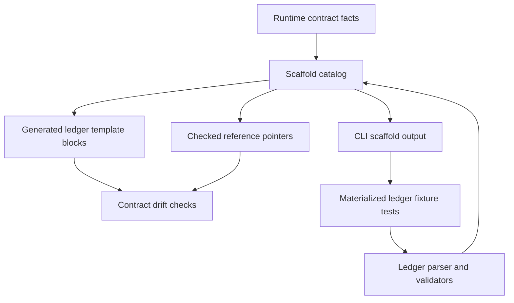

# feat: Move ledger and Notes evidence scaffolds

## Summary

Extend the existing runtime-owned scaffold catalog to the ledger and Notes evidence shapes that agents copy during Issue-to-PR runs. The plan keeps ledger parsing, validation, lifecycle, findings, and Notes semantics in their current runtime owners while making empty sections, lifecycle defaults, finding rows, Notes evidence, and workflow-learning empty state discoverable through CLI scaffold output and drift-checked docs.

---

## Problem Frame

Issue #113 moved deterministic scaffold ownership toward TypeScript runtime facts. Issue #118 is a narrow child of that work: the ledger template and ledger references still carry concrete YAML shapes that agents use as contract examples, creating another place where runtime validators, CLI discovery, and hand-maintained docs can drift.

---

## Requirements

- R1. Empty ledger section scaffolds render from runtime-owned facts: batches, findings data, and workflow learnings.
- R2. Ledger batch lifecycle defaults render from runtime-owned lifecycle fields and current default values.
- R3. Finding row scaffolds render from runtime-owned finding fields and finite value sets.
- R4. Notes evidence scaffolds cover implementation attempt checkpoints, completed Validator-wave evidence, and runbook-version skew continuation.
- R5. Notes evidence scaffold output includes the required marker fact as well as the YAML body, so agents can author parseable evidence rows.
- R6. Generated ledger scaffold bodies parse and validate through the appropriate existing ledger helper paths without changing helper semantics.
- R7. Generated blocks or checked pointers replace hand-maintained scaffold member lists in ledger templates and references.
- R8. CLI discovery/output and drift tests cover every ledger and Notes evidence scaffold id.
- R9. Existing workflow semantics remain unchanged: no new stage, ledger mutation command, lifecycle rule, finding rule, Notes parser rule, or Validator-wave behavior.
- R10. CLI remains read-only and does not mutate ledgers, templates, target repos, or git state.

**Origin actors:** A1 Orchestrator, A3 Builder sub-agent, A4 Validator personas, A5 User.
**Origin flows:** F0.5 Stage 4 implementation path selection, F1 Builder implementation attempt, F1b Orchestrator-inline attempt, F2 Builder repair attempt, F6 Compact implementation audit lanes.
**Origin acceptance examples:** AE12 committed attempt requires attempt checkpoint and Validator wave, AE12b clean wave still needs durable completed-wave evidence, AE16 attempt checkpoint before Validator packet rendering.

---

## Scope Boundaries

- Plan only ledger, Notes evidence, finding-row, lifecycle-default, and workflow-learning empty-state scaffolds for issue #118.
- Preserve existing scaffold ids and behavior from issues #114, #115, #116, and #117.
- Do not change `RUNBOOK_VERSION`, route classification, version-skew semantics, terminal-batch validation, findings dedupe, or workflow-learning validation.
- Do not change `decompose.ts` or `cli.ts` into mutation tools.
- Do not introduce generated docs beyond scaffold blocks or checked pointers.
- Do not migrate packet, Builder return, Validator evidence-lane, Proposer, or candidate-batch scaffolds in this slice.
- Do not add a YAML dependency unless focused renderer tests prove current Bun/TypeScript helpers cannot safely render these static scaffolds.

### Deferred to Follow-Up Work

- Any future ledger migration command or template regeneration command: outside parent issue #113's current read-only scaffold posture.
- Broader prose pruning after scaffold pointers land: follow-up issue if the docs still exceed the desired prose budget.
- New first-class `validator_waves` ledger field: outside this slice; completed-wave evidence remains Notes-owned.

---

## Context & Research

### Relevant Code and Patterns

- `docs/adr/0005-template-scaffold-contracts-are-runtime-owned.md` is the ownership anchor: templates frame handoffs; runtime owns scaffold contracts; generated or emitted views show scaffold shape.
- `docs/adr/0004-deterministic-workflow-contracts-live-in-code.md` says deterministic workflow contracts belong in code and emitted facts, not parallel prose.
- `runbooks/issue-to-pr-v2/lib/scaffolds.ts` already owns `SCAFFOLD_IDS`, `renderScaffold()`, catalog metadata, typed scaffold errors, and the existing scaffold renderer seam.
- `runbooks/issue-to-pr-v2/lib/contract.ts` owns `LEDGER_BATCH_LIFECYCLE_FIELDS`, `FINDING_FIELDS`, finding finite values, attempt lane field tuples, `RUNBOOK_VERSION`, and runbook-version skew states.
- `runbooks/issue-to-pr-v2/lib/ledger.ts` owns ledger parsing and validation for batches, findings, Notes evidence, runbook-version skew continuation, terminal Validator-wave evidence, and workflow learnings.
- `runbooks/issue-to-pr-v2/issue-N-ledger.template.md` still carries concrete empty sections, Notes evidence shapes, and workflow-learning empty-state YAML.
- `runbooks/issue-to-pr-v2/references/ledger-and-helper.md` owns ledger authoring guidance and should point at scaffold ids rather than repeat member lists.
- `runbooks/issue-to-pr-v2/cli.ts`, `cli.test.ts`, and `cli-smoke.test.ts` already expose scaffold discovery/output through read-only JSON envelopes.
- `runbooks/issue-to-pr-v2/contract-drift.ts` already validates generated scaffold blocks, checked scaffold pointers, and visible scaffold commands against runtime renderer output.

### Institutional Learnings

- No `docs/solutions/` learning files exist in this checkout.
- Prior plans for issues #114 through #117 establish the registry, CLI, generated-block, checked-pointer, visible-command, and drift-check pattern this slice should extend.
- `CONTEXT.md` defines runtime contract drift checks as focused comparisons against CLI-owned facts, not broad Markdown audits.

### External References

- None. Local ADRs, issue context, prior scaffold slices, and runtime seams provide enough grounding.

---

## Key Technical Decisions

- Extend `lib/scaffolds.ts` instead of adding a ledger-specific renderer. One scaffold catalog keeps CLI discovery, smoke tests, and drift checks exhaustive.
- Add ledger scaffold ids as narrow views over runtime-owned facts. Where facts are currently private parser or emitter literals, extract them into shared contracts first rather than duplicating them in `lib/scaffolds.ts`.
- Introduce a runtime-owned lifecycle default contract consumed by both ledger emission and scaffold rendering. `LEDGER_BATCH_LIFECYCLE_FIELDS` owns order only; default values need their own shared source.
- Extract Notes evidence contract facts from private parser literals: marker names, root keys, required scalar/list/nested fields, and parser-required ordering. Ledger parsing and scaffold rendering should consume the same facts.
- Represent Notes evidence scaffolds as marker-aware scaffold outputs. The YAML body alone is not enough for authoring because the parser requires the marker comment immediately before the fenced block.
- Add one narrow optional `marker` string field to scaffold output for marker-aware Notes evidence scaffolds. It is absent for YAML-only scaffolds; do not add a generic metadata bag.
- Keep `body` as the rendered YAML payload and keep `output_kind: "yaml"` for existing scaffold semantics.
- Use generated blocks for concrete fillable YAML where the ledger template needs an empty starting shape; use checked pointers where prose only needs to name the runtime-owned scaffold surface.
- Validate generated scaffold bodies by feeding materialized ledger fixtures through existing helpers rather than duplicating parser rules in scaffold tests.
- Keep drift checking configured by known surfaces. Do not turn `contract-drift.ts` into a generic Markdown/YAML scanner.

---

## Open Questions

### Resolved During Planning

- Should this slice implement all remaining parent issue #113 scaffolds? No. Issue #118 names ledger, finding, Notes evidence, and workflow-learning scaffold surfaces only.
- Should Notes evidence marker comments stay prose-owned? No. The marker is a parser-required contract fact, so the scaffold output should expose it with the YAML body.
- Should ledger parser functions move to `lib/scaffolds.ts`? No. Parsing and validation stay with `lib/ledger.ts`; scaffolds emit reusable authoring shapes.
- Should external docs research run? No. The work follows repo-local ADRs, runtime code, and established scaffold patterns.

### Deferred to Implementation

- Exact scaffold id names. They should be descriptive, stable, and grouped near existing ledger-related ids in catalog order.
- Process-boundary `decompose.test.ts` coverage. Prefer in-process `lib/ledger.test.ts`; add process-boundary coverage only if in-process validation cannot exercise the relevant parser path.
- Whether all ledger empty sections need generated blocks in `issue-N-ledger.template.md` or some should be checked pointers only. Prefer generated blocks where agents copy concrete YAML, pointers where prose only needs discoverability.

---

## High-Level Technical Design

> *This illustrates the intended approach and is directional guidance for review, not implementation specification. The implementing agent should treat it as context, not code to reproduce.*

The invariant: the ledger template, reference pointers, CLI scaffold output, and helper validation all describe the same shapes without moving ledger semantics out of their current validators.

---

## Implementation Units

### U1. Add ledger and Notes scaffold definitions

**Goal:** Add runtime-owned scaffold surfaces for empty ledger sections, lifecycle defaults, finding rows, Notes evidence, and workflow-learning empty state.

**Requirements:** R1, R2, R3, R4, R5, R9, R10; origin F1, F1b, F2, F6, AE12, AE12b, AE16.

**Dependencies:** Issue #114 scaffold tracer path present in the checkout.

**Files:**

- Modify: `runbooks/issue-to-pr-v2/lib/scaffolds.ts`
- Modify: `runbooks/issue-to-pr-v2/lib/scaffolds.test.ts`
- Modify: `runbooks/issue-to-pr-v2/lib/contract.ts`
- Modify: `runbooks/issue-to-pr-v2/lib/ledger.ts`
- Modify: `runbooks/issue-to-pr-v2/lib/contract.test.ts`
- Test: `runbooks/issue-to-pr-v2/lib/scaffolds.test.ts`
- Test: `runbooks/issue-to-pr-v2/lib/contract.test.ts`

**Approach:**

- Add scaffold ids for ledger empty sections, lifecycle defaults, finding rows, Notes implementation checkpoint evidence, Notes Validator-wave completion evidence, Notes runbook-version skew continuation evidence, and workflow-learning empty state.
- Render empty section scaffolds as complete top-level YAML snippets that can be inserted into the existing ledger sections.
- Extract lifecycle default values from the current ledger emission path into a runtime-owned contract, preserving existing emitted defaults.
- Render lifecycle defaults from the shared lifecycle default contract, preserving `LEDGER_BATCH_LIFECYCLE_FIELDS` order.
- Render finding-row scaffolds from `FINDING_FIELDS`, with placeholders that point at finite runtime slices for severity and status without restating every allowed value by hand.
- Extract Notes evidence marker names and required field shapes into runtime-owned contract facts consumed by the existing parser and scaffold renderer.
- Render Notes evidence YAML bodies from those shared field facts.
- Add optional `marker` metadata for Notes evidence scaffolds so `implementation-attempt-checkpoint`, `validator-wave-completed`, and `runbook-version-skew-continuation` are runtime-owned facts beside the body.
- Preserve existing typed `unknown-scaffold-id` behavior.

**Patterns to follow:**

- `runbooks/issue-to-pr-v2/lib/scaffolds.ts` existing catalog metadata and projection renderers.
- `runbooks/issue-to-pr-v2/lib/contract.ts` ordered tuples, finite runtime facts, and small runtime-owned contract exports.
- `runbooks/issue-to-pr-v2/lib/ledger.ts` Notes evidence parser field names and marker expectations.

**Test scenarios:**

- Happy path: scaffold catalog exposes the new ledger and Notes scaffold ids in deterministic catalog order.
- Happy path: empty batches scaffold renders `batches: []`.
- Happy path: empty findings data scaffold renders `findings: []`.
- Happy path: workflow-learning empty scaffold renders `workflow_learnings: []`.
- Happy path: lifecycle-default scaffold renders every lifecycle default key exactly once in `LEDGER_BATCH_LIFECYCLE_FIELDS` order.
- Happy path: ledger emission and lifecycle-default scaffold rendering consume the same default values.
- Happy path: finding-row scaffold renders every `FINDING_FIELDS` key exactly once in runtime order.
- Happy path: each Notes evidence scaffold exposes the parser-required `marker` value and a YAML body with the existing required fields.
- Happy path: Notes evidence parser tests prove marker names and field shapes come from the extracted contract facts.
- Edge case: Notes evidence scaffolds do not include unrelated ledger section headings or prose.
- Error path: unknown scaffold ids still throw `ScaffoldRenderError` with `unknown-scaffold-id`.
- Regression: existing candidate-batch, Builder, and Validator scaffold bodies are unchanged.

**Verification:**

- Scaffold tests prove every new surface is runtime-owned, cataloged, marker-aware when needed, and does not disturb existing scaffold outputs.

---

### U2. Expose additive marker metadata through CLI help and output

**Goal:** Make every new scaffold discoverable through the existing read-only CLI surface, with the only CLI contract change being additive marker metadata for Notes evidence scaffolds.

**Requirements:** R5, R8, R9, R10.

**Dependencies:** U1.

**Files:**

- Modify: `runbooks/issue-to-pr-v2/cli.ts`
- Modify: `runbooks/issue-to-pr-v2/cli.test.ts`
- Modify: `runbooks/issue-to-pr-v2/cli-smoke.test.ts`
- Modify: `runbooks/issue-to-pr-v2/README.md` only if the command surface documentation needs the new marker metadata field.
- Test: `runbooks/issue-to-pr-v2/cli.test.ts`
- Test: `runbooks/issue-to-pr-v2/cli-smoke.test.ts`

**Approach:**

- Let `contract scaffold_ids --json` pick up new scaffold ids from `SCAFFOLD_IDS`; do not add new dispatch branches for ids that the catalog already handles.
- Keep `scaffold <id> --json` read-only and one-envelope-only.
- Add optional `marker` passthrough for marker-aware Notes evidence scaffolds and leave YAML-only scaffold responses unchanged.
- Update help metadata so agents can discover that `marker` exists only for marker-aware scaffold ids.
- Keep exit codes, stderr diagnostics, usage errors, and unknown-id behavior unchanged.

**Patterns to follow:**

- `runbooks/issue-to-pr-v2/cli.ts` existing scaffold command dispatch.
- `runbooks/issue-to-pr-v2/cli.test.ts` scaffold id and response-shape tests.
- `runbooks/issue-to-pr-v2/cli-smoke.test.ts` process-boundary loop over help-documented scaffold ids.

**Test scenarios:**

- Happy path: `contract scaffold_ids --json` includes every new ledger and Notes evidence scaffold id.
- Happy path: `scaffold <new-id> --json` returns the renderer body and metadata for every new scaffold id.
- Happy path: marker-aware Notes scaffold responses expose `marker` without changing existing YAML-only scaffold bodies.
- Happy path: YAML-only scaffold responses do not carry a `marker` field.
- Integration: `--help --json` documents the new scaffold ids and response-shape metadata.
- Process boundary: every help-documented scaffold id succeeds through the smoke suite.
- Error path: unknown scaffold ids still return `unknown-scaffold-id`, exit 64, and the existing recovery hint.
- Regression: existing `contract`, `packet`, and scaffold command behavior remains unchanged.

**Verification:**

- CLI and smoke tests prove ledger and Notes scaffolds are agent-discoverable through the same read-only envelope style as earlier scaffold slices.

---

### U3. Replace ledger template scaffold bodies with generated blocks or pointers

**Goal:** Remove hand-maintained ledger scaffold member lists from the ledger template and references while preserving authoring guidance.

**Requirements:** R1, R2, R3, R4, R5, R7, R9.

**Dependencies:** U1, U2.

**Files:**

- Modify: `runbooks/issue-to-pr-v2/issue-N-ledger.template.md`
- Modify: `runbooks/issue-to-pr-v2/references/ledger-and-helper.md`
- Modify: `runbooks/issue-to-pr-v2/references/findings-and-validators.md` only if finding-row authoring guidance needs a checked pointer near the finding rules.
- Test: `runbooks/issue-to-pr-v2/contract-drift.test.ts`

**Approach:**

- Replace concrete empty section blocks in the ledger template with generated scaffold blocks where agents copy the exact YAML.
- Replace lifecycle-default, finding-row, and Notes evidence member lists with checked scaffold pointers when a pointer is clearer than embedding several long examples.
- Keep prose that explains section purpose, authoring timing, ownership, and stop conditions.
- Keep runtime-owned member lists out of hand prose.
- Preserve the exact workflow distinction between empty data sections, example row scaffolds, and durable Notes evidence rows.

**Patterns to follow:**

- Existing generated block markers in `templates/ce-plan-addendum.md`, `templates/builder-return-envelope.md`, `templates/builder-work-packet.md`, and `templates/validator-envelope.md`.
- Existing checked scaffold pointers in `references/builder-dispatch.md`, `references/findings-and-validators.md`, and `issue-N-ledger.template.md`.
- ADR 0005 placement rule: prose owns handoff framing; runtime owns repeatable machine-readable shapes.

**Test scenarios:**

- Happy path: ledger template contains generated blocks or checked pointers for every scaffold surface issue #118 names.
- Happy path: ledger authoring prose still explains when to write attempt checkpoint, completed Validator-wave evidence, and runbook-version skew continuation evidence.
- Happy path: finding-row guidance points at the runtime scaffold while retaining dedupe and severity ownership prose.
- Regression: no hand-maintained field/member list remains for the migrated scaffold shapes.
- Regression: prose still points at existing contract slices for schema facts instead of duplicating finite values.

**Verification:**

- Template and reference changes remove duplicated shape ownership while preserving operator guidance.

---

### U4. Prove generated ledger scaffolds parse and validate

**Goal:** Add helper-backed tests showing generated scaffold bodies materialize into valid ledger sections and evidence rows.

**Requirements:** R6, R9.

**Dependencies:** U1, U2, U3.

**Files:**

- Modify: `runbooks/issue-to-pr-v2/lib/ledger.test.ts`
- Modify: `runbooks/issue-to-pr-v2/lib/scaffolds.test.ts` if shared scaffold materialization helpers belong with renderer tests.
- Test: `runbooks/issue-to-pr-v2/lib/ledger.test.ts`

**Approach:**

- Build minimal ledger fixtures that consume scaffold output rather than duplicating expected YAML strings.
- Validate empty batches through the existing state/snapshot path that allows pre-batch ledgers; keep `validateLedgerBatches()` reserved for non-empty confirmed batch sections.
- Validate empty findings data and workflow-learning empty state through the existing helper functions.
- Validate lifecycle-default scaffold materialization against the shared default contract and existing emitted batch defaults.
- Validate finding-row scaffold materialization through `validateFindingsData` with a minimal legal row and table sync where needed.
- Validate Notes evidence materialization by combining marker metadata with scaffold body, then using existing ledger snapshot or batch validation paths that already parse those rows.
- For completed Validator-wave evidence, use reachable commits in the fixture pattern already present in ledger tests rather than weakening commit validation.

**Patterns to follow:**

- `runbooks/issue-to-pr-v2/lib/ledger.test.ts` current runbook-version skew, Validator-wave evidence, and workflow-learning validation fixtures.
- Existing `withFailMode("throw", ...)` in-process helper validation pattern.

**Test scenarios:**

- Happy path: empty batches scaffold is accepted by the existing pre-batch state/snapshot path and is not routed through `validateLedgerBatches()`.
- Happy path: empty findings data scaffold plus matching empty table validates.
- Happy path: workflow-learning empty scaffold validates through `validateWorkflowLearnings`.
- Happy path: lifecycle-default scaffold materializes to the same default values emitted for new ledger batch rows.
- Happy path: finding-row scaffold can be materialized into a legal fixed/open finding row and validates with the rendered table.
- Happy path: implementation-attempt checkpoint scaffold materializes into a parseable Notes evidence row tied to a committed attempt.
- Happy path: completed Validator-wave scaffold materializes into a valid clean-wave evidence row with `findings: []`.
- Happy path: runbook-version skew continuation scaffold materializes into evidence that clears the skew gate when ledger and runtime versions match the fixture.
- Edge case: missing marker for a Notes evidence scaffold keeps failing through the existing parser path.
- Error path: incomplete Notes scaffold materialization still fails with the existing helper error, not a scaffold-specific rule.
- Regression: helper validation semantics for batches, findings, workflow learnings, and Notes evidence remain unchanged.

**Verification:**

- Helper-backed tests prove scaffold output is not just pretty YAML; it is accepted by the existing runtime validators when inserted into a realistic ledger fixture.

---

### U5. Extend drift coverage for ledger and Notes scaffold surfaces

**Goal:** Ensure committed ledger template blocks, checked pointers, and visible scaffold commands cannot silently diverge from runtime scaffold output.

**Requirements:** R7, R8, R9, R10.

**Dependencies:** U1, U2, U3.

**Files:**

- Modify: `runbooks/issue-to-pr-v2/contract-drift.ts`
- Modify: `runbooks/issue-to-pr-v2/contract-drift.test.ts`
- Test: `runbooks/issue-to-pr-v2/contract-drift.test.ts`

**Approach:**

- Add the new ledger and Notes scaffold ids to generated-block or checked-pointer drift surfaces, matching the docs strategy chosen in U3.
- Extend marker-aware scaffold drift only if docs embed marker-bearing generated blocks. If docs use pointers for marker-bearing Notes scaffolds, pointer drift is enough for those surfaces.
- Keep the existing checks for unknown scaffold ids, wrong source strings, malformed markers, stale bodies, missing start markers, missing end markers, missing pointers, and visible-command mismatches.
- Keep `scaffoldIdsCoveredBySurfaces()` exhaustive so each `SCAFFOLD_IDS` member has at least one configured drift surface.

**Patterns to follow:**

- `runbooks/issue-to-pr-v2/contract-drift.ts` `GENERATED_SCAFFOLD_SURFACES`, `SCAFFOLD_POINTER_SURFACES`, and visible scaffold command checks.
- `runbooks/issue-to-pr-v2/contract-drift.test.ts` stale body, missing marker, unknown id, wrong source, and pointer mismatch fixtures.

**Test scenarios:**

- Happy path: real generated scaffold blocks and checked pointers for ledger and Notes scaffolds match runtime facts.
- Happy path: every new scaffold id is covered by at least one drift surface.
- Error path: stale generated empty-section body is reported as `generated-scaffold-block` drift.
- Error path: stale or missing checked pointer for a Notes evidence scaffold is reported as `scaffold-pointer` drift.
- Error path: visible scaffold command text that names one scaffold id beside a different marker is reported.
- Regression: existing candidate-batch, Builder, Validator, and replacement scaffold drift tests still pass.

**Verification:**

- Drift tests prove committed scaffold views and discoverability pointers cannot diverge silently from the runtime renderer.

---

## System-Wide Impact

- **Interaction graph:** Runtime contract constants and ledger validators feed scaffold renderers; scaffold renderers feed CLI output, generated ledger template blocks, checked pointers, helper-backed fixtures, and drift checks.
- **Error propagation:** Unknown scaffold ids continue to surface as scaffold CLI usage errors; malformed generated views surface as drift findings; invalid materialized ledger rows surface through existing helper validation errors.
- **State lifecycle risks:** No runtime ledger state is mutated. The risk is authoring stale or incomplete template examples, mitigated by generated blocks, pointers, and helper-backed tests.
- **API surface parity:** `--help --json`, `contract scaffold_ids --json`, and `scaffold <id> --json` must all agree on scaffold ids and marker-aware metadata.
- **Integration coverage:** Unit tests pin renderer output; CLI tests pin envelope discovery; helper validation tests prove generated snippets parse; drift tests prove committed docs stay aligned.
- **Unchanged invariants:** Ledger semantics stay owned by `lib/ledger.ts`; schema facts stay owned by `lib/contract.ts`; `cli.ts` remains a read-only fact emitter.

---

## Risks & Dependencies

- **Risk:** Marker-aware Notes evidence output changes the scaffold response surface. **Mitigation:** Make metadata additive, document it in help output, and prove existing YAML-only scaffolds remain unchanged.
- **Risk:** Tests duplicate parser logic instead of proving compatibility. **Mitigation:** Materialize generated scaffold output into ledger fixtures and run existing helpers.
- **Risk:** Generated blocks make the ledger template bulky. **Mitigation:** Use generated blocks only where agents need copyable YAML and checked pointers where discovery is enough.
- **Risk:** Drift coverage misses a new scaffold id. **Mitigation:** Keep the surface-exhaustiveness test over `SCAFFOLD_IDS`.
- **Dependency:** Issue #114 scaffold tracer path must be present before implementation, because this plan extends its catalog, CLI command, and drift-check seams.

---

## Documentation / Operational Notes

- Update ledger template and references to point at scaffold commands rather than restating migrated member lists.
- Preserve prose that explains when evidence rows are written and who owns the decision.
- No rollout or migration is needed for existing ledgers; the change affects scaffold output and committed authoring docs, not ledger interpretation.

---

## Sources & References

- **Origin document:** `docs/brainstorms/2026-05-21-issue-to-pr-builder-sub-agent-requirements.md`
- **Issue:** #118, child of #113 and blocked by #114
- **Architecture anchor:** `docs/adr/0005-template-scaffold-contracts-are-runtime-owned.md`
- **Contract ownership anchor:** `docs/adr/0004-deterministic-workflow-contracts-live-in-code.md`
- **Runtime scaffold seam:** `runbooks/issue-to-pr-v2/lib/scaffolds.ts`
- **Runtime contract facts:** `runbooks/issue-to-pr-v2/lib/contract.ts`
- **Ledger parser and validators:** `runbooks/issue-to-pr-v2/lib/ledger.ts`
- **Ledger template:** `runbooks/issue-to-pr-v2/issue-N-ledger.template.md`
- **Ledger reference:** `runbooks/issue-to-pr-v2/references/ledger-and-helper.md`
- **Drift check:** `runbooks/issue-to-pr-v2/contract-drift.ts`
