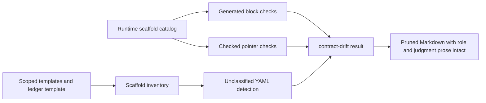

# feat: Seal scaffold inventory and prose pruning

## Summary

Seal the Issue-to-PR v2 scaffold migration after the predecessor scaffold slices land. Add a checked inventory for every remaining agent-fillable YAML shape in scoped templates and the ledger template, extend drift coverage over generated blocks and checked pointers, then prune hand-maintained scaffold member lists while preserving role framing and workflow judgment.

---

## Problem Frame

Issue #113 moved Issue-to-PR v2 toward runtime-owned scaffold contracts. Issue #119 is the closure slice: without an explicit inventory and drift-backed pruning pass, migrated scaffold surfaces can still leak back into hand-maintained Markdown lists and silently rebuild the same maintenance burden.

---

## Requirements

**Inventory and pruning**

- R1. Every agent-fillable YAML block in scoped templates and the ledger template is classified as a generated block, checked pointer, prose-owned shape, or removed.
- R3. Scoped Markdown no longer hand-maintains scaffold member lists for migrated scaffold surfaces.
- R8. Full dynamic packet bodies stay owned by `lib/packets.ts`; static templates point to packet rendering or runtime scaffolds instead of duplicating packet member lists.

**Drift enforcement**

- R2. Remaining generated scaffold blocks and checked pointers are covered by drift checks.
- R7. Drift enforcement remains focused and configured: runtime facts come from `lib/scaffolds.ts`, `cli.ts`, and existing validators, not a broad Markdown/YAML auditor.

**Preservation and tests**

- R4. Role framing, read triggers, authority boundaries, stop conditions, lane separation, and judgment-heavy text remain intact.
- R5. Existing packet, ledger, CLI, and drift tests pass with no workflow semantic changes.

**Prerequisites**

- R6. Predecessor scaffold migrations for Builder return projections, Validator evidence lanes, candidate-batch projections, and ledger/Notes evidence scaffolds are treated as prerequisites, not silently absorbed into this slice.

**Origin actors:** A1 Orchestrator, A2 Contract Reviewer, A3 Builder sub-agent, A4 Validator personas, A5 User.
**Origin flows:** F0 Stage 3 Contract Review, F0.5 Stage 4 implementation path selection, F1 Builder implementation attempt, F1b Orchestrator-inline attempt, F2 Builder repair attempt, F4 Builder Work Packet shape, F5 Builder return envelope, F6 Compact implementation audit lanes, F7 Replacement batches, F8 Final-review patch proposals.
**Origin acceptance examples:** AE1 Stage 3 Contract Review, AE2 Builder work packet, AE3 replacement batch, AE4 repair evidence to Validators, AE6 patch proposal, AE11 inline attempt evidence, AE12 and AE12b durable attempt and Validator-wave evidence, AE13 inline dispatch trigger, AE15 repair routing, AE16 attempt checkpoint before Validator packet rendering.

---

## Scope Boundaries

- Plan only the final scaffold inventory, drift coverage, and prose pruning work for issue #119.
- Preserve existing workflow semantics: no new stage, route, validator wave behavior, ledger interpretation, mutation command, or human gate.
- Preserve the scaffold catalog and read-only CLI style established by issues #114 through #118.
- Do not implement missing predecessor scaffold surfaces inside this slice; if prerequisite ids or generated views are absent, implementation should stop for rebase or prerequisite completion.
- Do not broaden `contract-drift.ts` into a general docs auditor, prose-quality linter, or unconstrained YAML parser.
- Do not replace all templates with code-only prompts.
- Do not add dependencies; Bun, TypeScript, and existing helpers are sufficient for this sealing pass.

### Deferred to Follow-Up Work

- Broader packet command/schema prose pruning outside migrated scaffold member lists.
- Any generated template rewrite command or ledger mutation command.
- Full code-size refactor of `contract-drift.ts`; keep this slice to configured inventory and drift checks.
- New first-class frontmatter scaffold generation or frontmatter renderer.

---

## Context & Research

### Relevant Code and Patterns

- `docs/adr/0004-deterministic-workflow-contracts-live-in-code.md` requires deterministic workflow contracts to live in code or generated/runtime views.
- `docs/adr/0005-template-scaffold-contracts-are-runtime-owned.md` is the scaffold ownership anchor: templates frame handoffs; runtime owns repeatable scaffold shape.
- `CONTEXT.md` defines runtime contract drift checks as focused comparisons against CLI-owned facts, not broad documentation audits.
- `runbooks/issue-to-pr-v2/lib/scaffolds.ts` owns `SCAFFOLD_IDS`, `renderScaffold()`, scaffold metadata, generated YAML bodies, and typed scaffold errors.
- `runbooks/issue-to-pr-v2/cli.ts` exposes read-only scaffold discovery and output through the existing JSON envelope style.
- `runbooks/issue-to-pr-v2/contract-drift.ts` already validates generated scaffold blocks, checked scaffold pointers, and visible scaffold commands for predecessor scaffold slices.
- `runbooks/issue-to-pr-v2/lib/packets.ts` owns dynamic Builder, Proposer, Validator, patch-proposal, and ce-plan packet rendering; static templates should not duplicate full packet bodies after those renderers exist.
- `runbooks/issue-to-pr-v2/lib/ledger.ts` owns ledger parsing and validation for batches, findings, Notes evidence, runbook-version skew continuation, terminal Validator-wave evidence, and workflow learnings.

### Institutional Learnings

- No `docs/solutions/` learning files exist in this checkout.
- Prior plans `docs/plans/2026-05-26-003-feat-scaffold-tracer-path-plan.md` through `docs/plans/2026-05-26-007-feat-ledger-notes-evidence-scaffolds-plan.md` establish the generated-block, checked-pointer, scaffold CLI, and drift-check pattern to extend.
- `docs/plans/2026-05-26-008-feat-drift-coverage-hardening-plan.md` identifies adjacent drift hardening gaps; this plan should avoid duplicating that separate advisory slice unless a gap directly blocks #119 acceptance criteria.

### External References

- None. Local ADRs, issue context, existing runtime seams, and sibling scaffold plans provide sufficient grounding.

---

## Key Technical Decisions

- Treat #119 as a sealing pass over already-migrated scaffold surfaces. If #115 through #118 have not landed, do not rebuild them here.
- Add a configured scaffold inventory instead of relying on a one-time manual audit. The inventory should be the durable answer to "why is this YAML block still here?"
- Classify full dynamic packet examples as removable duplication when the corresponding `packet <role> --json` renderer owns the body.
- Classify unmarked packet or envelope YAML examples as prose-owned unless a current scaffold id owns that exact shape; remove only migrated scaffold member lists.
- Prefer checked pointers in references and explanatory prose. Keep generated blocks only in templates or ledger sections where agents need a copyable fillable shape.
- Do not count visible `cli.ts scaffold <id> --json` prose as a checked pointer. A checked pointer requires a `scaffold-pointer` marker.
- Keep general visible-command no-marker hardening in the separate drift-hardening plan. #119 only checks retained generated blocks, checked pointers, and any already-adjacent scaffold-command mismatches needed for those retained surfaces.
- Keep marker-aware Notes evidence as checked pointers unless #118 has already landed marker metadata and the existing drift parser can cover marker plus body with a narrow extension. If new marker-aware parsing or scaffold response-shape work is needed, stop and defer it.
- Keep marker and pointer checks source-driven: compare against `renderScaffold()` output and `SCAFFOLD_IDS`, not duplicated expected field lists in tests.
- Include ledger frontmatter in the inventory sweep as a special ledger-template surface under existing ledger validation. Do not create a generated frontmatter scaffold in #119.
- Preserve lane separation explicitly: Builder evidence, Orchestrator-inline evidence, compact Builder attempts, compact inline attempts, Validator findings, and Notes evidence remain distinct.

---

## Open Questions

### Resolved During Planning

- Should #119 implement missing predecessor scaffold migrations? No. Its issue dependencies make those prerequisites.
- Should drift enforcement become a broad YAML scanner? No. ADR and `CONTEXT.md` language keep runtime contract drift checks scoped and configured.
- Should static packet-slot YAML remain as examples? No, once the packet renderer owns that output, static member lists are migrated scaffold duplication and should be removed or replaced with a renderer pointer.
- Should every scaffold pointer become a generated block? No. Generated blocks remain only where agents need concrete fillable YAML; pointers are safer elsewhere.
- Should ledger frontmatter become a generated scaffold in #119? No. Classify it as a special ledger-template surface under existing validation and defer any renderer to follow-up work.
- Should marker-aware Notes evidence become generated blocks in #119? No, unless #118 already provides marker metadata and existing drift parsing can cover marker plus body without new response-shape work.
- Should external research run? No. This is a repo-local deterministic-contract and documentation-control-plane change.

### Deferred to Implementation

- Exact inventory representation. It may live in `contract-drift.ts` beside existing surfaces or in a small local helper if that keeps the checker readable without introducing a new policy owner.
- Exact prose removals. Delete deterministic member lists, but keep surrounding "when/why/who owns this" language where it carries authority or stop conditions.

---

## High-Level Technical Design

> *This illustrates the intended approach and is directional guidance for review, not implementation specification. The implementing agent should treat it as context, not code to reproduce.*

The invariant: every remaining agent-fillable YAML shape is either runtime-rendered, runtime-discoverable, intentionally prose-owned, or gone.

---

## Implementation Units

### U1. Define the scoped scaffold inventory

**Goal:** Make the classification of agent-fillable YAML in scoped templates and the ledger template explicit and mechanically checkable.

**Requirements:** R1, R3, R6, R7, R8; origin F4, F5, F6, F8, AE2, AE6, AE11, AE12, AE12b, AE16.

**Dependencies:** Issues #115, #116, #117, and #118 landed or rebased into the implementation branch.

**Files:**

- Modify: `runbooks/issue-to-pr-v2/contract-drift.ts`
- Modify: `runbooks/issue-to-pr-v2/contract-drift.test.ts`
- Modify: `runbooks/issue-to-pr-v2/lib/scaffolds.ts` only if prerequisite scaffold catalog metadata needs a small inventory-facing field.
- Test: `runbooks/issue-to-pr-v2/contract-drift.test.ts`
- Test: `runbooks/issue-to-pr-v2/lib/scaffolds.test.ts` only if `lib/scaffolds.ts` changes.

**Approach:**

- Enumerate the scoped template and ledger-template files that can contain agent-fillable YAML.
- Classify each relevant YAML or YAML-like surface as one of: generated block, checked pointer, prose-owned shape, or removed.
- Define `removed` as a durable expected-absence inventory entry. It should record the removed surface by doc, stable heading or marker coordinate, and forbidden pattern so the checker can fail if the block reappears after pruning.
- Treat existing generated-block and checked-pointer surfaces as inventory members rather than a separate parallel list.
- Add an inventory-to-drift symmetry check: every generated or pointer classification must have matching drift-surface coverage, and every configured drift surface must map back to an inventory classification.
- Store prerequisite scaffold ids as raw expected strings first, validate them against `SCAFFOLD_IDS` to emit targeted missing-prerequisite findings, then narrow to `ScaffoldId` only after membership passes for renderer-backed generated and pointer checks.
- Include ledger frontmatter in the sweep as a named special case, with its classification and existing runtime checks documented in the inventory.
- Keep prose-owned classifications narrow. They should describe role/judgment framing or contextual scratch data, not deterministic scaffold member lists.
- Make the inventory data own coordinates and classification only; runtime scaffold bodies still come from `renderScaffold()`.

**Patterns to follow:**

- `runbooks/issue-to-pr-v2/contract-drift.ts` existing `GENERATED_SCAFFOLD_SURFACES`, `SCAFFOLD_POINTER_SURFACES`, and `scaffoldIdsCoveredBySurfaces()`.
- `runbooks/issue-to-pr-v2/contract-drift.test.ts` staged drift-surface fixture tests.
- `docs/adr/0005-template-scaffold-contracts-are-runtime-owned.md` placement rule.

**Test scenarios:**

- Happy path: the real scoped templates and ledger template have every inventory item classified with no findings.
- Happy path: every generated-block or checked-pointer inventory entry names an existing scaffold id, and expected predecessor scaffold ids from #115 through #118 are present.
- Happy path: every generated-block and checked-pointer inventory entry has matching drift-surface coverage, and every drift-surface entry maps to an inventory entry.
- Happy path: ledger frontmatter is included in the inventory sweep and does not get mistaken for an unclassified fenced YAML block.
- Edge case: a prose-owned YAML surface remains clean only when it is explicitly inventoried and does not name a migrated scaffold id.
- Edge case: a removed inventory entry stays clean only while its forbidden block remains absent.
- Edge case: unmarked packet/envelope YAML examples are classified rather than missed by marker-only extraction.
- Error path: inventory names a predecessor scaffold id missing from `SCAFFOLD_IDS` and produces a targeted finding.
- Error path: adding a new agent-fillable fenced YAML block to a scoped template without classification produces a targeted finding.
- Regression: dynamic packet-renderer output examples are not treated as new runtime scaffold owners.

**Verification:**

- Drift tests show the inventory is exhaustive for the scoped files and fails on missing prerequisite scaffold ids or unclassified YAML.

---

### U2. Extend scaffold drift coverage for generated blocks, pointers, and marker-aware scaffolds

**Goal:** Ensure every retained generated scaffold block or checked pointer is enforced against runtime renderer output and catalog membership.

**Requirements:** R1, R2, R6, R7; origin F5, F6, F7, F8, AE3, AE4, AE6, AE12, AE12b, AE16.

**Dependencies:** U1; prerequisite scaffold surfaces from issues #115 through #118 are present.

**Files:**

- Modify: `runbooks/issue-to-pr-v2/contract-drift.ts`
- Modify: `runbooks/issue-to-pr-v2/contract-drift.test.ts`
- Modify: `runbooks/issue-to-pr-v2/cli.test.ts` only if #118 marker metadata changes the scaffold response shape.
- Test: `runbooks/issue-to-pr-v2/contract-drift.test.ts`
- Test: `runbooks/issue-to-pr-v2/cli.test.ts` only if response-shape assertions change.

**Approach:**

- Fold all post-#118 generated blocks and pointers into the existing configured surface checks.
- Verify generated YAML bodies against `renderScaffold(id).body`; do not copy expected fields into drift tests.
- For marker-aware Notes evidence scaffolds, prefer checked pointers. Compare marker plus body only when #118 has already landed marker metadata and the existing drift parser can do so narrowly.
- Preserve existing visible scaffold-command mismatch checks only where a retained generated block or checked pointer already creates an adjacent marker relationship. Leave general no-marker visible-command hardening to `docs/plans/2026-05-26-008-feat-drift-coverage-hardening-plan.md`.
- Keep unknown-id, stale-source, missing-start, missing-end, malformed-block, and stale-body findings targeted by doc and scaffold id.
- Avoid expanding drift checks to files outside the scoped inventory unless a visible scaffold command or checked pointer explicitly makes them part of the control plane.

**Patterns to follow:**

- `runbooks/issue-to-pr-v2/contract-drift.ts` generated scaffold block parser and scaffold pointer parser.
- `runbooks/issue-to-pr-v2/contract-drift.test.ts` stale generated body, stale pointer source, and unknown scaffold id cases.
- `docs/plans/2026-05-26-008-feat-drift-coverage-hardening-plan.md` for adjacent advisory gaps that should stay separate unless directly needed.

**Test scenarios:**

- Happy path: every real generated scaffold block and checked pointer matches runtime facts.
- Happy path: marker-aware Notes scaffolds compare marker plus YAML body when marker metadata is available.
- Error path: a stale generated block body is reported as a `generated-scaffold-block` finding naming the scaffold id.
- Error path: a checked pointer with an unknown id is reported as a `scaffold-pointer` finding.
- Error path: a visible scaffold command names one id while the adjacent marker names another and is reported as `scaffold-command`.
- Error path: a retained pointer for a post-#118 scaffold id is removed from a scoped file and produces a missing-pointer finding.
- Regression: existing route, contract-slice, packet-role, ledger-schema-pointer, and gotchas relationship drift checks still run.

**Verification:**

- Drift checks prove retained scaffold views are runtime-backed and newly added scaffold ids cannot skip surface-level enforcement.

---

### U3. Prune dynamic packet and envelope member lists from templates

**Goal:** Remove static packet or envelope member lists that are now owned by packet renderers or scaffold renderers, while preserving dispatch role guidance.

**Requirements:** R3, R4, R5, R8; origin F0, F1, F1b, F2, F4, F5, F8, AE1, AE2, AE4, AE6, AE11, AE15.

**Dependencies:** U1, U2; prerequisite scaffold surfaces from issues #115 through #118 are present.

**Files:**

- Modify: `runbooks/issue-to-pr-v2/templates/builder-work-packet.md`
- Modify: `runbooks/issue-to-pr-v2/templates/builder-return-envelope.md`
- Modify: `runbooks/issue-to-pr-v2/templates/proposer-envelope.md`
- Modify: `runbooks/issue-to-pr-v2/templates/validator-envelope.md`
- Modify: `runbooks/issue-to-pr-v2/templates/patch-proposal.md`
- Modify: `runbooks/issue-to-pr-v2/templates/ce-plan-addendum.md`
- Modify: `runbooks/issue-to-pr-v2/lib/packets.test.ts`
- Modify: `runbooks/issue-to-pr-v2/contract-drift.test.ts`
- Test: `runbooks/issue-to-pr-v2/lib/packets.test.ts`
- Test: `runbooks/issue-to-pr-v2/contract-drift.test.ts`

**Approach:**

- Replace full static packet-slot YAML examples with concise pointers to the relevant `cli.ts packet <role> --json` renderer where the packet body is dynamic.
- Retain generated scaffold blocks for concrete fillable surfaces that agents must copy, such as Builder return envelope, Validator evidence lanes, ce-plan candidate batch, and patch proposal candidate batch.
- Retain checked scaffold pointers where prose only needs to name the runtime-owned shape.
- Preserve wrapper context that scaffolds do not own, including final-finding context, candidate-patch-batch wrapping guidance, evidence-source lane toggles, and role-specific return-envelope intent.
- Preserve role labels, read triggers, authority boundaries, "must not" lists, lane separation, malformed-output handling, and required reading sections.
- Preserve Proposer versus Validator separation: Proposer proposes patch contracts read-only; Validator files findings read-only.
- Avoid changing packet renderer behavior or dispatch evidence. Template edits should not alter `lib/packets.ts` output except where output intentionally stops embedding static template member-list prose.

**Patterns to follow:**

- `runbooks/issue-to-pr-v2/lib/packets.ts` packet renderer ownership and deny-list behavior.
- `runbooks/issue-to-pr-v2/templates/builder-return-envelope.md` generated block plus checked pointer pattern.
- `runbooks/issue-to-pr-v2/templates/validator-envelope.md` lane-specific generated block pattern.

**Test scenarios:**

- Happy path: Builder packet rendering still includes target batch contract, compact prior Builder attempts, relevant findings, Local Law framing, authority framing, and return-envelope pointer.
- Happy path: Validator packet rendering still emits Builder evidence or inline evidence according to the requested lane, with no cross-lane leakage.
- Happy path: Proposer packet rendering still includes only final-finding and terminal-batch context needed for a candidate patch proposal.
- Happy path: patch proposal packet rendering still emits exactly one patch batch with `ac_mapping: []`.
- Edge case: empty prior attempts, empty findings, null repair target, and null `supersedes` retain current packet renderer semantics.
- Regression: template pruning does not remove read triggers, role names, authority boundaries, stop conditions, or "must not" sections.
- Regression: patch proposal final-finding context, Proposer candidate wrapping guidance, Validator evidence-source lane toggle, and read-only/write authority language remain present.
- Regression: packet tests still reject full ledger content, unrelated batches, raw Validator envelopes, Builder fix prose, and wrong evidence lane payloads.

**Verification:**

- Packet tests and drift inventory checks prove static template member lists were removed without changing rendered packet behavior or role boundaries.

---

### U4. Prune ledger template and reference scaffold member lists

**Goal:** Replace remaining ledger, Notes evidence, finding-row, workflow-learning, and replacement-batch member lists with generated blocks or checked pointers after the ledger scaffold slice lands.

**Requirements:** R1, R2, R3, R4, R5, R6; origin F0.5, F1, F1b, F2, F6, F7, AE3, AE12, AE12b, AE16.

**Dependencies:** U1, U2; issue #118 landed.

**Files:**

- Modify: `runbooks/issue-to-pr-v2/issue-N-ledger.template.md`
- Modify: `runbooks/issue-to-pr-v2/references/ledger-and-helper.md`
- Modify: `runbooks/issue-to-pr-v2/references/builder-dispatch.md`
- Modify: `runbooks/issue-to-pr-v2/references/stage-3-decompose.md`
- Modify: `runbooks/issue-to-pr-v2/references/stage-4-batch-loop.md`
- Modify: `runbooks/issue-to-pr-v2/references/findings-and-validators.md`
- Modify: `runbooks/issue-to-pr-v2/lib/ledger.test.ts`
- Modify: `runbooks/issue-to-pr-v2/decompose.test.ts`
- Modify: `runbooks/issue-to-pr-v2/contract-drift.test.ts`
- Test: `runbooks/issue-to-pr-v2/lib/ledger.test.ts`
- Test: `runbooks/issue-to-pr-v2/decompose.test.ts`
- Test: `runbooks/issue-to-pr-v2/contract-drift.test.ts`

**Approach:**

- Replace concrete ledger section scaffolds with generated blocks where first-turn ledger authoring needs copyable YAML.
- Replace explanatory references to replacement batches, compact attempts, findings rows, Notes evidence rows, and workflow-learning empty state with checked pointers where a pointer is sufficient.
- Preserve explanations that describe when the Orchestrator writes a checkpoint, why clean Validator waves require explicit evidence, when replacement batches are allowed, and how runbook-version skew continuation is authorized.
- Ensure marker-aware Notes evidence blocks retain parser-required markers as runtime-owned facts. Use checked pointers in #119 unless #118 already landed marker metadata and existing drift parsing can compare marker plus body without new response-shape or parser work.
- Keep `ledger-and-helper.md` as ledger authoring guidance. It may name commands and runtime slices, but must not restate migrated member lists.
- Keep finding severity/status semantics owned by existing validator/finding contracts; this slice should not change closure or dedupe behavior.

**Patterns to follow:**

- `runbooks/issue-to-pr-v2/lib/ledger.ts` Notes evidence and workflow learning parser behavior.
- `runbooks/issue-to-pr-v2/references/ledger-and-helper.md` runtime-owned schema fact pointers.
- `runbooks/issue-to-pr-v2/issue-N-ledger.template.md` current section structure and ledger authoring guidance.

**Test scenarios:**

- Happy path: ledger template generated empty sections parse through existing ledger helpers.
- Happy path: generated Notes implementation-attempt checkpoint evidence parses and validates when filled with representative values.
- Happy path: generated Validator-wave completion evidence parses and preserves explicit clean-wave `findings: []`.
- Happy path: generated runbook-version skew continuation evidence preserves the bare-null versus quoted-string `ledger_version` distinction.
- Happy path: workflow-learning empty state remains a valid no-learning ledger section.
- Edge case: marker-aware Notes evidence with marker missing or mismatched still fails through existing parser validation.
- Regression: replacement-batch guidance still preserves `supersedes` as one-way audit metadata, not implicit dependency resolution.
- Regression: no Builder evidence fields leak into Orchestrator-inline attempt rows or Validator inline evidence guidance.

**Verification:**

- Ledger, decompose, and drift tests prove ledger authoring shapes remain parseable and no migrated ledger scaffold member list remains hand-maintained.

---

### U5. Add final semantic-preservation and quality gates

**Goal:** Verify the pruning pass did not weaken workflow behavior, CLI discovery, or test coverage.

**Requirements:** R2, R4, R5, R7; origin F0, F0.5, F1, F1b, F2, F4, F5, F6, F7, F8, AE1, AE2, AE3, AE4, AE6, AE11, AE12, AE12b, AE13, AE15, AE16.

**Dependencies:** U1, U2, U3, U4.

**Files:**

- Modify: `runbooks/issue-to-pr-v2/README.md` only if scaffold discovery docs need wording updates after pruning.
- Modify: `runbooks/issue-to-pr-v2/cli.test.ts`
- Modify: `runbooks/issue-to-pr-v2/cli-smoke.test.ts`
- Modify: `runbooks/issue-to-pr-v2/contract-drift.test.ts`
- Modify: `runbooks/issue-to-pr-v2/lib/packets.test.ts`
- Modify: `runbooks/issue-to-pr-v2/lib/ledger.test.ts`
- Test: `runbooks/issue-to-pr-v2/cli.test.ts`
- Test: `runbooks/issue-to-pr-v2/cli-smoke.test.ts`
- Test: `runbooks/issue-to-pr-v2/contract-drift.test.ts`
- Test: `runbooks/issue-to-pr-v2/lib/packets.test.ts`
- Test: `runbooks/issue-to-pr-v2/lib/ledger.test.ts`

**Approach:**

- Add targeted regression assertions for critical preserved text or behavior only where existing tests do not already cover it.
- Keep CLI help and README wording focused on read-only scaffold discovery; do not restate scaffold member lists in docs.
- Re-run process-boundary smoke coverage for every help-documented scaffold id and relevant packet role.
- Use test coverage to prove semantics, not snapshots of whole Markdown files.
- Keep final verification scoped to issue-to-PR v2 so unrelated dirty worktree changes are not normalized or reverted.

**Patterns to follow:**

- `runbooks/issue-to-pr-v2/cli-smoke.test.ts` process-boundary command coverage.
- `runbooks/issue-to-pr-v2/lib/packets.test.ts` deny-list and lane-separation coverage.
- `runbooks/issue-to-pr-v2/decompose.test.ts` helper-validation coverage for ledger and patch proposal behavior.

**Test scenarios:**

- Happy path: `contract scaffold_ids --json` and help output agree on every scaffold id after pruning.
- Happy path: `scaffold <id> --json` succeeds for every help-documented scaffold id.
- Integration: packet renderers still produce dispatch evidence with loaded references/templates after template pruning.
- Integration: drift check passes on the real scoped docs after all pruning.
- Regression: CLI scaffold and packet commands remain read-only and one-envelope-only.
- Regression: no new dependency appears in `package.json`.
- Regression: role/read-trigger/authority/lane prose remains present in the templates that own those boundaries.

**Verification:**

- Focused tests plus lint/type checks pass, proving the pruning pass changed ownership and documentation shape without changing workflow semantics.

---

## System-Wide Impact

- **Interaction graph:** `lib/scaffolds.ts`, `cli.ts`, `contract-drift.ts`, packet renderers, ledger validators, templates, and references all participate in the scaffold ownership loop.
- **Error propagation:** Missing predecessor scaffold ids, stale generated blocks, bad pointers, and unclassified YAML should surface as drift findings rather than runtime packet or ledger failures later.
- **State lifecycle risks:** Ledger lifecycle and Notes evidence semantics must remain owned by existing validators; #119 should not reinterpret checkpoint ordering or Validator-wave completion.
- **API surface parity:** CLI help, `contract scaffold_ids --json`, `scaffold <id> --json`, packet rendering, and drift checks must agree on scaffold ids and response shape.
- **Integration coverage:** Unit tests alone are insufficient; process-boundary CLI smoke and real-doc drift checks prove committed Markdown and runtime output agree.
- **Unchanged invariants:** The CLI remains read-only; packet rendering remains the source for full dynamic packets; Builder/inline/Validator/Proposer lanes remain separate; human confirmation gates remain unchanged.

---

## Risks & Dependencies

- **Prerequisite branch drift:** #119 depends on #115 through #118. Mitigation: fail fast if expected scaffold ids or generated views are absent.
- **Over-pruning useful handoff context:** Removing too much YAML can make agent dispatch harder. Mitigation: generated blocks remain where agents need copyable shape; pointers replace prose-only restatements.
- **Inventory becomes parallel policy:** A hand-maintained inventory can duplicate schema meaning. Mitigation: inventory records coordinates and classification only; field bodies stay runtime-rendered.
- **Ledger frontmatter ambiguity:** Frontmatter is YAML-like and agent-filled, but not one of the migrated scaffold blocks. Mitigation: classify it explicitly, rely on existing runtime checks, and defer any generated frontmatter scaffold to follow-up work.
- **`contract-drift.ts` size pressure:** Adding inventory logic can deepen a large file. Mitigation: keep logic small and configured; extract a helper only if it avoids duplicating policy.
- **Semantic regression hidden in docs edits:** Pruning can accidentally weaken role or stop-condition language. Mitigation: preserve critical sections and use targeted packet/ledger/CLI regression tests.

---

## Documentation / Operational Notes

- `README.md` may need a small update if the final scaffold discovery wording changes, but it must not restate scaffold member lists.
- References should link to runtime scaffold or contract commands when deterministic fields are needed.
- No migration, rollout, or generated-doc command is introduced by this plan.

---

## Sources & References

- **Origin document:** `docs/brainstorms/2026-05-21-issue-to-pr-builder-sub-agent-requirements.md`
- GitHub issue: #119 `feat(issue-to-pr): seal scaffold inventory and prose pruning`
- Parent issue: #113 `PRD: TS-owned template contracts and scaffold renderers`
- Prerequisite issues: #115, #116, #117, #118
- Scaffold tracer issue: #114
- Related ADRs: `docs/adr/0004-deterministic-workflow-contracts-live-in-code.md`, `docs/adr/0005-template-scaffold-contracts-are-runtime-owned.md`
- Related prior plan: `docs/plans/2026-05-26-002-feat-template-scaffold-renderers-plan.md`
- Related drift-hardening plan: `docs/plans/2026-05-26-008-feat-drift-coverage-hardening-plan.md`
