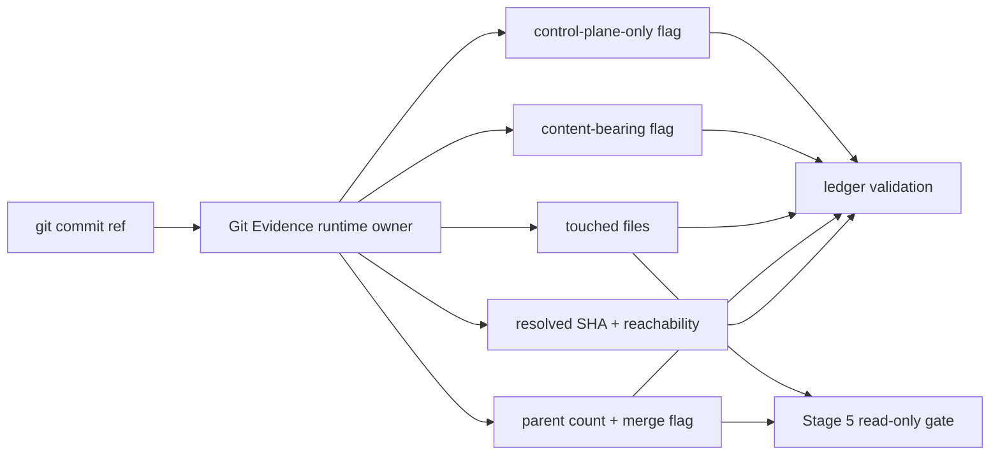

# feat: Extract Issue-to-PR Git Evidence locality seam

## Summary

Extract a runtime-owned Git Evidence seam inside Issue-to-PR v2 so ledger validation and Stage 5 read-only checks consume one normalized source for commit reachability, touched files, merge detection, content-bearing changes, and control-plane-only evidence. Keep v2 workflow behavior unchanged: this is locality hardening, not a v3 shell or orchestration rewrite.

---

## Problem Frame

Issue-to-PR v2 now has strong git-backed validation, but commit evidence rules are scattered across `runbooks/issue-to-pr-v2/lib/ledger.ts` and the Stage 5 compatibility gate in `runbooks/issue-to-pr-v2/decompose.ts`. That duplication has already produced documented drift risk around merge commits, touched-file parsing, and content-bearing proof.

Parent issue #120 names Git Evidence as the recommended first non-scaffold v3 locality spike: v2 behavior, v3 locality.

---

## Requirements

**Git Evidence Ownership**

- R1. Git Evidence owns reachable commit validation for 7-40 character hex commit refs, commit existence, ancestor reachability from `HEAD`, and resolved SHA output.
- R2. Git Evidence owns touched-file extraction from commit diffs, including rename/copy path expansion and normalized repo-relative file paths.
- R3. Git Evidence owns parent-count and merge-commit detection.
- R4. Git Evidence owns content-bearing diff detection, preserving current treatment of empty and mode-only commits as non-content-bearing.
- R5. Git Evidence owns canonical control-plane path classification and control-plane-only detection for runbook-heal commits.

**Caller Integration**

- R6. Existing ledger validation consumes Git Evidence for Builder commits, Orchestrator-inline commits, fixed finding commits, plan revisions, validator-wave evidence commits, and runbook-heal evidence.
- R7. The Stage 5 read-only gate consumes Git Evidence for merge detection and touched-file extraction while preserving its current permissive ref behavior.

**Compatibility**

- R8. Existing workflow semantics, confirmation gates, CLI mutation posture, and read-only fact emission stay unchanged.
- R9. Error handling remains at least as specific as current behavior for invalid commits, missing commits, unreachable commits, empty or non-content-bearing commits, merge commits, non-control-plane paths, and path validation failures.

**Verification**

- R10. Focused tests cover Git Evidence through its public interface.
- R11. Existing relevant Issue-to-PR v2 tests continue to pass.

**Boundaries**

- R12. The slice does not create a v3 shell, Contract Kernel, or workflow orchestration rewrite.

---

## Scope Boundaries

- Do not change the six-stage Issue-to-PR workflow.
- Do not change ledger schema fields, emitted ledger YAML, route classification, packet rendering, scaffold rendering, or runbook-version semantics.
- Do not add `cli.ts` mutation behavior or new CLI commands.
- Do not introduce new dependencies.
- Do not create a generic git utility package outside Issue-to-PR v2.
- Do not change the `runbook-heal <sha>`, `commit <sha>`, `patch-batch`, or `plan-revision <sha>` closure grammar.
- Do not make Stage 5 ref handling or no-op checkpoint behavior stricter in this slice; current symbolic-ref and no-op read-only checkpoint semantics stay as-is.
- Do not solve the residual runbook-heal binding gap from issue #71; this slice centralizes evidence facts, not finding-to-run provenance.

### Deferred to Follow-Up Work

- Broader Git Evidence CLI contract or explain output, if agents later need to inspect normalized commit facts directly.
- Binding `runbook-heal <sha>` to a specific in-run final-review finding or run.
- Reworking pinned historical SHA fixtures into a fully hermetic git fixture harness.
- A future Contract Kernel that composes Git Evidence with other v3 locality modules.

---

## Context & Research

### Relevant Code and Patterns

- `runbooks/issue-to-pr-v2/lib/ledger.ts` currently owns most git-backed validation: reachable commit checks, touched-file extraction, parent counts, raw diff parsing, implementation-attempt content proof, and runbook-heal control-plane guards.
- `runbooks/issue-to-pr-v2/decompose.ts` duplicates Stage 5 merge detection and touched-file extraction for `--assert-stage5-readonly`.
- `runbooks/issue-to-pr-v2/lib/ledger.test.ts` already pins runbook-heal commits, content-bearing raw diff parsing, terminal implementation attempt guards, finding resolution rules, and validator-wave evidence behavior.
- `runbooks/issue-to-pr-v2/lib/stage5-readonly.test.ts` pins Stage 5 read-only gate behavior at process boundary, including ledger-only pass, non-ledger reject, merge reject, and no-op pass.
- `runbooks/issue-to-pr-v2/decompose.test.ts` carries process-boundary ledger validation fixtures that depend on the same touched-file parsing semantics as `ledger.ts`.
- Existing runtime modules use `spawnSync("git", [...])` with argument arrays and no shell interpolation.
- Existing validators route failures through `fail()` / `withFailMode()` so CLI callers retain current exit and structured-error behavior.

### Institutional Learnings

- `docs/adr/0002-runbooks-and-skills-use-prose-as-orchestrator.md` says deterministic mechanics belong behind CLI/scripts while prose owns orchestration and judgment.
- `docs/adr/0004-deterministic-workflow-contracts-live-in-code.md` says hand-maintained prose must not duplicate deterministic workflow contracts.
- `docs/adr/0001-stage-4-context-isolation.md` keeps the Orchestrator responsible for validating attempt evidence before Validator handoff.
- `docs/runbooks/issue-to-pr/issue-71-ledger.md` records prior findings about duplicated git readers: `touchedFilesForCommit`, Stage 5 `touchedFilesForRef`, and `rawDiffForCommit` can drift if future fixes are not centralized.
- Related plans for ledger schema contracts and scaffold locality use the same pattern: introduce runtime ownership first, then move callers onto the owner without changing behavior.

### External References

- None. Local runtime behavior and accepted ADRs are sufficient.

---

## Key Technical Decisions

- Create `runbooks/issue-to-pr-v2/lib/git-evidence.ts` as the one runtime owner for normalized commit evidence. This keeps the seam inside Issue-to-PR v2 and avoids a broad repo-level git abstraction.
- Return facts from a public Git Evidence interface and keep caller-owned policy decisions in callers. Git Evidence should expose reachability, resolved SHA, parent count, merge status, touched files, content-bearing status, and control-plane-only status; ledger and Stage 5 callers still decide which facts fail which workflow gate.
- Expose strict ledger commit validation and raw Stage 5 ref inspection as two named public profiles, not one option-heavy inspector. Ledger callers need 7-40 hex, commit existence, and ancestor reachability; Stage 5 needs parent-count and touched-file facts for the same ref forms it accepts today, including symbolic `HEAD`.
- Keep the strict ledger profile layered. Use a strict resolver for reachability and resolved SHA where callers only need identity proof; read richer commit facts only at call sites that need touched files, parent count, content-bearing status, or control-plane verdicts.
- Keep the raw Stage 5 ref profile narrow: return only parent count or merge status plus touched files. Do not expose content-bearing or control-plane verdicts through that profile, because Stage 5 must not start applying those policies in this slice.
- Preserve Stage 5 raw-ref compatibility by mirroring its current git calls, not by routing through ledger-style strict validation. Stage 5 raw inspection should use parent-count and touched-file helpers that accept whatever `git rev-list --parents -n 1 <ref>` and `git diff-tree --no-commit-id --name-status -r --root -M <ref>` accept today, then report failures through the current Stage 5 context.
- Let Git Evidence calls accept optional `cwd`, defaulting to the current process cwd. This preserves production behavior while allowing hermetic temp-repo tests without mutating global process state.
- Add a Stage 5 ref-form characterization matrix before replacing the local helpers. At minimum it should cover short SHA, full SHA, `HEAD`, one stable non-hex commit-ish ref such as a branch or tag in a temporary repo, and current behavior for tree-ish and range-like inputs. Each row should be marked preserve-as-is or explicit follow-up.
- Preserve current touched-file ordering: expand rename/copy rows, de-duplicate paths, and return first-seen git-output order. Stage 5 still reports the first offending path from that order.
- Keep `ledger.ts` as the owner of ledger batch path validation for persisted `batch.files` and `files_touched` values. Git Evidence should apply git-output path normalization only: slash normalize, strip `./`, and reject impossible empty, repo-escape, or control-line paths. It must not import ledger concrete-file, docs/high-risk, directory, or extension policy.
- Make runbook-heal control-plane classification canonical in Git Evidence as verdict facts, not workflow assertions. Use a tiny explicit allowlist for this slice: `runbooks/issue-to-pr-v2/` and `skills/issue-to-pr/`. Keep `docs/runbooks/issue-to-pr/` explicitly non-control-plane because those files are per-issue ledger/evidence artifacts, not the Issue-to-PR control plane. Git Evidence should return the normalized control-plane-only verdict, offending paths, and empty/no-control-plane signals; callers decide when those facts fail workflow policy.
- Expose content-bearing detection as both a commit-level fact and a public raw-diff classifier. Runtime callers should consume commit facts; tests can pin raw diff semantics directly without manufacturing commits for every parser edge case.
- Use a typed Git Evidence error boundary, not a failure sink. Git Evidence should throw a `GitEvidenceError` or equivalent only when it cannot produce requested git facts, with operational reason codes such as invalid ref form, missing commit, unreachable commit, unreadable parents, unreadable touched files, unreadable raw diff, or unresolved commit. It must never import `ledger.ts`; `ledger.ts` and `decompose.ts` catch it at existing validation points, prepend the current context, and call `fail()` so `withFailMode("throw")` still yields `DecomposeError` for CLI callers.
- Preserve caller-level diagnostic wording fragments even when Git Evidence internals use cleaner typed reason codes. `ledger.ts` and `decompose.ts` remain responsible for user-facing failure context so observable CLI errors do not drift in this locality slice.
- Characterize before migrating callers. Public-interface Git Evidence tests should pin the current edge cases before `ledger.ts` and `decompose.ts` move onto the seam.
- Avoid expanding the historical SHA fixture set. Prefer pure parser tests and the existing reachable fixture commits already used by ledger and Stage 5 tests.
- Keep Stage 5 no-op read-only behavior unchanged. Git Evidence can report no content-bearing change, but the Stage 5 read-only gate must not start rejecting no-op checkpoints unless a separate issue changes that policy.

---

## Resolved Decisions

- Should this expose a new CLI contract slice? No. Issue #121 asks for a runtime-owned interface for existing callers, not an agent-facing CLI surface.
- Should the seam live outside Issue-to-PR v2? No. The parent PRD calls for v2 locality slices before any broader v3 composition.
- Should Git Evidence own control-plane prefix policy? Yes for this slice. Issue #121 explicitly names control-plane-only detection as Git Evidence-owned.
- Should Stage 5 read-only become content-bearing? No. Current no-op pass semantics stay unchanged.
- Should Stage 5 raw-ref compatibility extend beyond symbolic `HEAD`? Yes. Preserve the current raw git-call behavior for this slice, including non-hex commit-ish refs accepted by the existing helpers. If characterization exposes a weird accepted ref form, preserve it and mark hardening as follow-up; this slice must not tighten Stage 5 semantics.
- How should Git Evidence report failures? Use a typed Git Evidence error caught by callers, then route through existing `fail()` contexts.
- How should non-ancestor reachability be tested? Mandatory hermetic coverage in `git-evidence.test.ts`; do not depend on adding another historical SHA fixture.
- Should Git Evidence expose one ref inspector with modes? No. Use two named public profiles: strict ledger commit validation and raw Stage 5 ref inspection.
- Should control-plane-only be a Git Evidence assertion? No. Git Evidence returns verdict facts; ledger decides runbook-heal failure policy.
- What should `GitEvidenceError.reason` represent? Operational git-fact failures only. Merge, content-bearing, and control-plane classifications are produced facts or verdicts, not Git Evidence errors.
- How should content-bearing detection be exposed? As both a commit-level fact and a public raw-diff classifier. Callers use commit facts; tests pin parser semantics through the raw classifier.
- What if the Stage 5 ref matrix reveals a weird accepted ref form? Preserve it in this locality slice and mark explicit follow-up hardening.
- What path rules should Git Evidence apply to touched files from git output? Git-output normalization only. Ledger remains responsible for user-authored ledger path validation and workflow path policy.
- What should the raw Stage 5 ref profile return? Stage 5 facts only: parent count or merge status plus touched files. No content-bearing or control-plane verdicts.
- How eager should the strict ledger profile be? Layered. Reachability-only sites use a strict resolver; richer commit facts are read only where workflow policy needs them.
- Should U4 include a source-level ownership guard? Yes, narrowly. Guard that `decompose.ts` no longer owns local Stage 5 `rev-list` / `diff-tree` parsing helpers after U3; avoid broad git-plumbing bans.
- Should Git Evidence take an explicit `cwd` option? Yes. Optional `cwd`, default current process cwd; no repo-scoped instance in this slice.
- Should control-plane path classification use a registry or caller-supplied allowlist? No. Use the current tiny explicit allowlist in Git Evidence for this slice.
- Should `docs/runbooks/issue-to-pr/` count as control-plane? No. Keep it explicitly non-control-plane and covered by tests.
- Should caller-level diagnostics preserve current wording fragments? Yes. Internal typed reason codes must not force observable CLI wording drift.
- Where should the Stage 5 ref-form matrix live? In `git-evidence.test.ts` against the raw Stage 5 profile, with small process-boundary coverage for CLI wiring and stderr behavior.

## Deferred to Implementation

- Exact public function names and `GitEvidenceError` field names. Implementation should choose names that read naturally in `ledger.ts` and `decompose.ts` while preserving the typed error boundary and the two-profile split.
- Exact raw-diff classifier name. Tests should follow the public seam, not private helper placement.
- Exact amount of test fixture consolidation. Keep it focused unless implementation exposes easy duplication removal without weakening coverage.

---

## High-Level Technical Design

> *This illustrates the intended approach and is directional guidance for review, not implementation specification. The implementing agent should treat it as context, not code to reproduce.*

The new seam centralizes git command interaction and parsing. Callers still own workflow-specific interpretation: ledger validation rejects merge and non-content-bearing implementation attempts, runbook-heal rejects non-control-plane evidence, and Stage 5 rejects merge or non-ledger touched paths while still allowing no-op read-only checkpoints.

---

## Implementation Units

### U1. Create Git Evidence public seam and focused tests

**Goal:** Introduce a runtime-owned Git Evidence module with public behavior tests before moving existing callers onto it.

**Requirements:** R1, R2, R3, R4, R5, R9, R10.

**Dependencies:** None.

**Files:**
- Create: `runbooks/issue-to-pr-v2/lib/git-evidence.ts`
- Create: `runbooks/issue-to-pr-v2/lib/git-evidence.test.ts`
- Modify: `runbooks/issue-to-pr-v2/lib/ledger.test.ts`

**Approach:**
- Extract the current git command interactions and diff parsing into `git-evidence.ts`.
- Keep subprocess usage consistent with existing code: `spawnSync("git", [...])`, no shell strings.
- Expose one small public interface for normalized commit facts, plus narrowly useful helpers only when tests or callers need them.
- Expose a strict resolver separately from richer strict commit facts so reachability-only ledger sites avoid unnecessary diff, parent-count, or raw-diff reads.
- Model the raw Stage 5 ref profile as a narrow shape containing only parent count or merge status plus touched files.
- Export one canonical control-plane path predicate or allowlist plus a control-plane-only verdict for git-output paths, and cover both directly in Git Evidence tests.
- Do not derive control-plane paths from a registry or accept caller-supplied allowlists in this slice.
- Include JSDoc on exported functions and types because this is now a runtime-owned seam.
- Preserve current raw diff content-bearing semantics: empty raw diff and pure mode-only changes are non-content-bearing; add/delete/rename/copy/type-change and blob-changing modifications are content-bearing.
- Move or mirror the existing `rawDiffHasContentBearingChange` tests so the behavior is pinned at the new public seam.
- Use a hermetic temporary git repo for non-ancestor reachability coverage unless implementation can name an existing fixture that proves the same behavior without adding a historical SHA.
- Use optional `cwd` for hermetic temp-repo tests; avoid `process.chdir`.
- Put the Stage 5 ref-form characterization matrix in `git-evidence.test.ts` against the raw Stage 5 profile.
- Keep Git Evidence independent of `ledger.ts` to avoid a circular dependency.

**Execution note:** Start with characterization tests for existing content-bearing and git-output parsing behavior, then extract the implementation.

**Patterns to follow:**
- Existing `rawDiffHasContentBearingChange` parser tests in `runbooks/issue-to-pr-v2/lib/ledger.test.ts`.
- Existing `spawnSync("git", [...])` helpers in `runbooks/issue-to-pr-v2/lib/ledger.ts` and `runbooks/issue-to-pr-v2/decompose.ts`.
- Existing contract modules with exported runtime values and focused tests under `runbooks/issue-to-pr-v2/lib/`.

**Test scenarios:**
- Happy path: a reachable non-merge commit ref resolves to a full SHA and reports reachable status.
- Happy path: touched-file extraction expands rename and copy status rows to all named paths.
- Happy path: content-bearing detection accepts add, delete, rename, copy, type-change, binary modify, and normal modify rows.
- Edge case: empty raw diff is not content-bearing.
- Edge case: pure mode-only raw diff rows are not content-bearing.
- Edge case: mixed mode-only plus real content change is content-bearing.
- Error path: non-hex commit ref fails with the existing invalid-ref specificity.
- Error path: missing hex commit fails with the existing missing-commit specificity.
- Error path: non-ancestor commit fails with the existing unreachable specificity using a hermetic temporary git repo fixture.
- Error path: Git Evidence failures expose reason codes or equivalent typed fields that callers can adapt into existing `fail()` messages.
- Happy path: control-plane classification accepts a pure `runbooks/issue-to-pr-v2/` or `skills/issue-to-pr/` git-output path set.
- Verdict path: control-plane-only detection reports mixed control-plane/deliverable paths and the offending non-control-plane path.
- Verdict path: control-plane-only detection reports ledger/evidence artifact paths under `docs/runbooks/issue-to-pr/` as explicitly non-control-plane.
- Verdict path: control-plane-only detection reports zero-control-plane or empty touched-file sets.

**Verification:**
- Git Evidence tests prove the public seam owns the normalized facts before any caller migration.
- Existing ledger tests that still import content-bearing helpers are updated to import from the new owner or are moved without changing expected outcomes.

---

### U2. Move ledger validation onto Git Evidence

**Goal:** Make ledger validation consume Git Evidence for commit reachability, touched files, merge detection, content-bearing checks, and runbook-heal control-plane checks.

**Requirements:** R1, R2, R3, R4, R5, R6, R8, R9, R11, R12.

**Dependencies:** U1.

**Files:**
- Modify: `runbooks/issue-to-pr-v2/lib/ledger.ts`
- Modify: `runbooks/issue-to-pr-v2/lib/ledger.test.ts`
- Modify: `runbooks/issue-to-pr-v2/decompose.test.ts`

**Approach:**
- Replace private ledger git readers with imports from `git-evidence.ts`.
- Use the strict resolver for `builder_commits`, plan revisions, fixed commit binding, validator-wave evidence keys, and other reachability-only checks.
- Use richer strict commit facts only for committed implementation attempts and runbook-heal checks that need touched files, merge status, content-bearing status, or control-plane verdicts.
- Keep ledger-specific validation in `ledger.ts`: batch path authorization, builder/inline lane invariants, finding resolution grammar, terminal commit binding, and validator-wave evidence requirements.
- Preserve current failure contexts by catching typed Git Evidence failures at the same caller points where `validateReachableCommit`, `touchedFilesForCommit`, `assertContentBearingAttemptCommit`, and `validateControlPlaneOnlyCommit` currently fail.
- Preserve current user-facing wording fragments while adapting typed Git Evidence failures into `fail()` calls.
- Keep assertion order stable: grammar and null checks before git lookup where they happen today, merge checks before touched-file parity for implementation attempts, and runbook-heal path checks before content-bearing checks.
- Ensure `builder_commits`, committed Builder attempts, Orchestrator-inline attempts, fixed finding commits, plan revisions, and validator-wave implementation commits all resolve through the shared seam.
- Keep runbook-heal stricter than Stage 5: reachable, single-parent, touches at least one control-plane file, touches no non-control-plane file, and carries content-bearing change.

**Execution note:** Characterization-first around current ledger error messages and edge cases before deleting private helper bodies.

**Patterns to follow:**
- Existing `withFailMode("throw", ...)` tests in `runbooks/issue-to-pr-v2/lib/ledger.test.ts`.
- Existing terminal batch and finding-resolution fixtures in `runbooks/issue-to-pr-v2/lib/ledger.test.ts`.
- Existing process-boundary invalid-ledger fixtures in `runbooks/issue-to-pr-v2/decompose.test.ts`.

**Test scenarios:**
- Happy path: Builder committed attempt recorded in `builder_commits` with matching touched files still validates.
- Happy path: Orchestrator-inline committed attempt with matching touched files still validates and remains outside `builder_commits`.
- Happy path: final finding fixed by a terminal batch commit still validates only when the commit is recorded in the appropriate terminal batch.
- Happy path: `runbook-heal <sha>` on the existing control-plane-only fixture still validates for `batch_id: final`.
- Error path: Builder attempt merge commit still fails as a merge commit.
- Error path: Orchestrator-inline merge commit still fails as a merge commit.
- Error path: empty or mode-only implementation attempt still fails as non-content-bearing.
- Error path: `files_touched` mismatch still names the mismatch and fails.
- Error path: commit touching files outside confirmed `batch.files` still names unauthorized paths and fails.
- Error path: `runbook-heal <sha>` still rejects deliverable, mixed, ledger-path, merge, empty, and mode-only evidence.
- Error path: `runbook-heal <sha>` still rejects `docs/runbooks/issue-to-pr/` paths as ledger/evidence artifacts, not control-plane paths.
- Error path: bad `plan-revision`, `commit`, and `runbook-heal` refs keep current reachability diagnostics.

**Verification:**
- Ledger unit and process-boundary tests show behavior parity after private git helper removal.
- `ledger.ts` no longer owns git command parsing beyond caller-specific policy and failure context.

---

### U3. Move Stage 5 read-only gate onto Git Evidence

**Goal:** Remove duplicate merge detection and touched-file extraction from the compatibility entrypoint while preserving Stage 5 gate behavior.

**Requirements:** R2, R3, R7, R8, R9, R11, R12.

**Dependencies:** U1.

**Files:**
- Modify: `runbooks/issue-to-pr-v2/decompose.ts`
- Modify: `runbooks/issue-to-pr-v2/lib/stage5-readonly.test.ts`
- Modify: `runbooks/issue-to-pr-v2/decompose.test.ts`

**Approach:**
- Add a ref-form characterization matrix before migration. Cover short SHA, full SHA, symbolic `HEAD`, one non-hex commit-ish ref such as a branch or tag in a temporary repo, tree-ish input, and range-like input; mark each row preserve-as-is or explicit follow-up.
- Keep the full ref-form matrix at the Git Evidence public seam; Stage 5 process tests should prove wiring and user-facing stderr, not duplicate every matrix row.
- Preserve any currently accepted weird ref form in this slice; the matrix may create follow-up hardening work, but U3 must not convert characterization into stricter Stage 5 policy.
- Replace local `isMergeCommit` and `touchedFilesForRef` bodies in `decompose.ts` with Git Evidence calls that accept the same ref forms Stage 5 accepts today.
- Consume only the narrow Stage 5 profile; do not read content-bearing or control-plane verdicts in the Stage 5 gate.
- Keep `assertStage5ReadOnly` policy in `decompose.ts`: reject merge commits, then reject the first touched path that is not the expected ledger path.
- Preserve current Stage 5 stderr wording fragments while replacing local git readers.
- Keep the gate's current no-op behavior: a non-merge commit with zero touched files still passes the read-only check because it touched no non-ledger file.
- Keep the gate's current ref behavior: symbolic refs such as `HEAD` remain valid for this gate; do not route Stage 5 through ledger-style 7-40 hex and ancestor validation.
- Preserve the existing process-boundary CLI shape and usage errors for `--assert-stage5-readonly`.
- Update comments that currently say the helper is reimplemented because `ledger.ts` private helpers are unavailable.

**Execution note:** Use the existing Stage 5 process-boundary tests as characterization coverage before replacing the local helpers.

**Patterns to follow:**
- Existing `runbooks/issue-to-pr-v2/lib/stage5-readonly.test.ts` process-boundary coverage.
- Existing `decompose.ts` thin-dispatcher posture.
- Existing CLI compatibility promise in the `decompose.ts` header.

**Test scenarios:**
- Happy path: ledger-only checkpoint commit still exits 0 with empty stderr.
- Edge case: no-op empty checkpoint commit still exits 0 with empty stderr.
- Edge case: symbolic `HEAD` in the existing no-op fixture still exits 0 with empty stderr.
- Edge case: the ref-form matrix records and preserves accepted behavior for short SHA, full SHA, symbolic `HEAD`, and a representative non-hex commit-ish ref accepted by the current Stage 5 helpers.
- Edge case: the ref-form matrix records current behavior for tree-ish and range-like inputs before migration, with hardening deferred unless existing behavior already rejects them.
- Error path: checkpoint touching a non-ledger path still exits 1 and names the first offending path.
- Error path: merge checkpoint still exits 1 and mentions merge commit.
- Error path: missing Stage 5 arguments still exits 1 with usage text.
- Integration: `decompose.ts` no longer contains local git parent-count or diff-tree parsing helpers.

**Verification:**
- Stage 5 read-only tests pass unchanged in behavior.
- The only git evidence source left in `decompose.ts` is the imported runtime seam.

---

### U4. Prune duplicate comments and lock the locality boundary

**Goal:** Leave the codebase in a legible state where Git Evidence is the named owner and nearby tests/comments no longer point at old private helper duplication.

**Requirements:** R8, R9, R10, R11, R12.

**Dependencies:** U2, U3.

**Files:**
- Modify: `runbooks/issue-to-pr-v2/lib/ledger.ts`
- Modify: `runbooks/issue-to-pr-v2/decompose.ts`
- Modify: `runbooks/issue-to-pr-v2/decompose.test.ts`
- Modify: `runbooks/issue-to-pr-v2/lib/stage5-readonly.test.ts`
- Modify: `runbooks/issue-to-pr-v2/lib/ledger.test.ts`

**Approach:**
- Remove comments that describe duplicated helper implementations as intentional because helpers are private.
- Add concise ownership comments where useful: Git Evidence owns normalized commit facts; ledger and Stage 5 own workflow policy interpretation.
- Keep comment edits narrow. Do not rewrite runbook references unless implementation reveals a live stale statement.
- Add a narrow source-level ownership guard that proves `decompose.ts` no longer owns local Stage 5 `rev-list` / `diff-tree` parsing helpers and imports Git Evidence instead.
- Avoid broad grep bans on git plumbing outside `git-evidence.ts`; tests and unrelated helpers may legitimately spawn git.

**Patterns to follow:**
- Existing concise ownership comments in `runbooks/issue-to-pr-v2/lib/route.ts`.
- Existing drift checks only when they protect an actual deterministic contract, not general prose quality.

**Test scenarios:**
- Happy path: tests and comments identify `git-evidence.ts` as the owner of commit facts.
- Regression: no local Stage 5 helper comment still claims touched-file extraction is duplicated because ledger helpers are private.
- Regression: moved tests still assert behavior through public seams rather than private helper placement.

**Verification:**
- A reviewer can identify one runtime owner for git evidence without loading both `ledger.ts` and `decompose.ts`.
- No broad docs rewrite is included.

---

## System-Wide Impact

- **Interaction graph:** `ledger.ts` and `decompose.ts` become consumers of `git-evidence.ts`; `cli.ts` remains read-only and unchanged unless existing imports require type-only adjustments.
- **Error propagation:** Git Evidence failures must surface through existing caller contexts so `decompose.ts` stderr and `cli.ts` structured-error behavior stay stable.
- **State lifecycle risks:** Ledger confirmation, batch status, validator-wave evidence, and finding resolution state do not change; only the git fact source changes.
- **API surface parity:** The compatibility entrypoint `decompose.ts` keeps the same flags, stdout/stderr shape, and exit codes.
- **Integration coverage:** Process-boundary Stage 5 and ledger validation tests remain necessary because module tests alone cannot prove CLI compatibility.
- **Unchanged invariants:** Builder commits stay Builder-only, inline commits stay in `orchestrator_inline_attempts`, runbook-heal stays final-only and control-plane-only, and Validators still own correctness findings.

---

## Risks & Dependencies

| Risk | Mitigation |
|------|------------|
| Error messages drift while moving private helpers. | Characterize caller-level failures before migration and preserve context-specific wording fragments in ledger and Stage 5 tests. |
| Git Evidence becomes a vague utility dumping ground. | Keep it scoped to Issue-to-PR v2 commit facts named by issue #121; leave ledger policy and workflow orchestration in callers. |
| Circular dependency with `ledger.ts` path validation. | Keep Git Evidence independent of `ledger.ts`; ledger validates user-authored ledger paths, Git Evidence normalizes git-output paths. |
| Stage 5 behavior tightens accidentally by reusing ledger-style commit validation or content-bearing checks. | Explicitly preserve symbolic-ref and no-op read-only pass semantics in U3 tests. |
| Observable CLI output drifts without an explicit version decision. | Keep exit codes, stdout/stderr shape, structured error behavior, and documented message fragments stable; if any drift is necessary, require an explicit `RUNBOOK_VERSION` or compatibility note decision. |
| Historical SHA fixtures remain branch-history coupled. | Avoid adding new pinned SHAs; use existing fixtures, pure parser tests, and hermetic temporary git repos where possible. |

---

## Documentation / Operational Notes

- No user-facing runbook workflow change expected.
- No `RUNBOOK_VERSION` bump expected only if observable output stays stable: exit codes, stdout/stderr shape, structured error behavior, and documented message fragments. If implementation changes any of those, make an explicit `RUNBOOK_VERSION` or compatibility note decision before handoff.
- No new ADR expected; ADR 0002 and ADR 0004 already cover the deterministic-contract locality decision.

---

## Sources & References

- GitHub issue: #121
- Parent GitHub issue: #120
- Related requirements context: `docs/brainstorms/2026-05-21-issue-to-pr-builder-sub-agent-requirements.md`
- Related prior finding ledger: `docs/runbooks/issue-to-pr/issue-71-ledger.md`
- Related ADR: `docs/adr/0002-runbooks-and-skills-use-prose-as-orchestrator.md`
- Related ADR: `docs/adr/0004-deterministic-workflow-contracts-live-in-code.md`
- Existing git evidence code: `runbooks/issue-to-pr-v2/lib/ledger.ts`
- Existing duplicated Stage 5 gate code: `runbooks/issue-to-pr-v2/decompose.ts`
- Existing tests: `runbooks/issue-to-pr-v2/lib/ledger.test.ts`
- Existing tests: `runbooks/issue-to-pr-v2/lib/stage5-readonly.test.ts`
- Existing tests: `runbooks/issue-to-pr-v2/decompose.test.ts`
