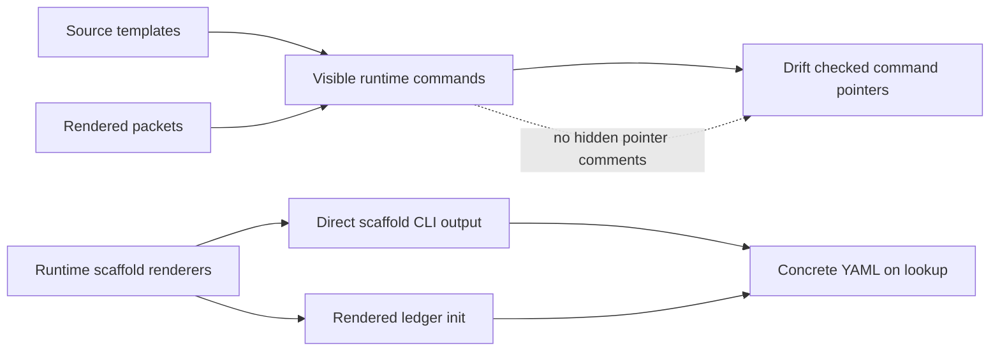

# refactor: Tighten template source scaffold boundary

## Summary

Move the scaffold migration from "runtime-owned but still embedded in source templates" to a cleaner boundary: source and rendered prose name runtime commands, direct scaffold and ledger-init CLI surfaces emit concrete YAML, and drift checks validate visible command references without hidden pointer comments.

---

## Problem Frame

Issue-to-PR v2 now has runtime-owned scaffold renderers, scaffold CLI output, generated block markers, and checked pointer markers. That solved scaffold body ownership, but committed source templates still carry two transitional artifacts: generated YAML blocks and hidden `scaffold-pointer` comments.

Those artifacts keep the maintenance model partly template-shaped. The better end state is sharper: source and rendered prose frame judgment and reference runtime facts; direct runtime scaffold and ledger-init outputs carry concrete YAML.

---

## Requirements

- R1. Source templates no longer hand-maintain or commit scaffold YAML bodies for runtime-owned scaffold surfaces.
- R2. Rendered packets stay pointer-only and require agents to resolve scaffold commands at use time.
- R3. Visible `cli.ts scaffold <id> --json` commands become first-class checked pointers.
- R4. Hidden `<!-- scaffold-pointer ... -->` comments are removed after visible-command drift coverage can enforce the same contract.
- R5. Generated scaffold block markers remain only where a committed generated YAML block intentionally survives during migration.
- R6. Ledger creation becomes runtime-rendered through a read-only CLI surface rather than copied from a YAML-bearing template.
- R7. `docs/adr/0005-template-scaffold-contracts-are-runtime-owned.md` records the storage rule: source and rendered prose default pointer-only; direct runtime outputs may contain concrete YAML.
- R8. Existing Issue-to-PR workflow semantics remain unchanged: no new stage, route, validator behavior, mutation command, or human gate.
- R9. Drift checks stay focused on configured contract surfaces, not a broad Markdown or YAML linter.
- R10. Existing packet, scaffold, CLI, ledger, and drift tests continue to prove runtime/template parity.

---

## Scope Boundaries

- In scope: scaffold pointer enforcement, source-template cleanup, packet pointer rendering, runtime scaffold lookup discipline, read-only ledger-init rendering, ADR update, and focused tests.
- In scope: scoped Issue-to-PR v2 templates, relevant references, and `issue-N-ledger.template.md`.
- Out of scope: changing scaffold body content except where source cleanup requires pointer wording.
- Out of scope: replacing all templates with code-only prompts.
- Out of scope: mutating ledger files from the CLI.
- Out of scope: broad `contract-drift.ts` size refactor.
- Out of scope: changing packet data shapes, ledger validation semantics, finding lifecycle rules, or route classification.

### Deferred to Follow-Up Work

- Deleting compatibility support for generated blocks after pointer-only source surfaces are stable.
- Moving broader deterministic ledger schema docs into generated human docs beyond ledger init.
- Refactoring `contract-drift.ts` into smaller modules after behavior is pinned.

---

## Context & Research

### Relevant Code and Patterns

- `docs/adr/0004-deterministic-workflow-contracts-live-in-code.md` says prose may name runtime contracts or emitting commands, but must not restate deterministic members.
- `docs/adr/0005-template-scaffold-contracts-are-runtime-owned.md` says templates frame handoffs and runtime owns scaffold contracts.
- `runbooks/issue-to-pr-v2/lib/scaffolds.ts` owns scaffold ids, metadata, renderer bodies, and marker-aware Notes evidence metadata.
- `runbooks/issue-to-pr-v2/cli.ts` exposes `contract scaffold_ids --json` and `scaffold <id> --json`.
- `runbooks/issue-to-pr-v2/contract-drift.ts` currently treats `scaffold-pointer` HTML comments as checked pointers and visible scaffold commands as an adjacent-marker sanity check.
- `runbooks/issue-to-pr-v2/templates/ce-plan-addendum.md` is the only current packet source template read directly by `lib/packets.ts`.
- `runbooks/issue-to-pr-v2/lib/packets.ts` renders most packet bodies from runtime data rather than from the static templates.
- `runbooks/issue-to-pr-v2/issue-N-ledger.template.md` still carries issue-specific frontmatter placeholders, section order, runtime command pointers, and generated empty-section YAML.

### Institutional Learnings

- No `docs/solutions/` learning files exist in this checkout.
- `docs/plans/2026-05-26-008-feat-drift-coverage-hardening-plan.md` already identified visible scaffold commands without adjacent markers as a drift gap.
- `docs/plans/2026-05-26-009-feat-seal-scaffold-inventory-plan.md` intentionally required hidden `scaffold-pointer` comments as the then-current checked pointer mechanism.

### External References

- None. This is repo-local architecture and runtime-contract work.

---

## Key Technical Decisions

- Treat #119 as the current implemented baseline, not as the plan to edit in place.
- Promote visible scaffold commands to the pointer contract instead of requiring hidden `scaffold-pointer` comments.
- Keep generated block start/end markers for committed generated YAML blocks only; do not use them for pointer-only source templates.
- Make source templates and rendered packet prose pointer-only by default. Agents resolve concrete scaffold YAML through direct CLI lookup.
- Add ledger init as a read-only CLI render surface. The command emits a complete document body but never writes it.
- Keep source-template frontmatter placeholders only until ledger init can render them from CLI inputs.
- Update ADR 0005 rather than writing a new ADR unless implementation discovers a materially different command/storage model.
- Prefer incremental migration: visible-command enforcement first, pointer-comment removal second, generated-block removal third, ledger-init retirement last.

---

## Open Questions

### Resolved During Planning

- Should visible commands alone be enough? Yes, after `contract-drift.ts` validates them as first-class pointer surfaces.
- Should hidden pointer comments disappear immediately? No. Remove them only after visible-command drift coverage is in place.
- Should source templates ever contain concrete generated YAML? Only as a temporary migration bridge or when a committed generated artifact is intentionally stored. The default end state is pointer-only.
- Should rendered packets still contain concrete scaffold YAML? No. Packets stay pointer-only; agents resolve scaffold commands through the CLI before returning output.
- Where should packet recipients learn runtime scaffold lookup? Each rendered packet carries one shared lookup preamble at the moment of use.
- Should scaffold pointers use top-of-file aliases? No. Use direct visible commands in the owning section; avoid alias mini-languages unless repetition proves unavoidable.
- Should the ledger template be retired? Yes, once read-only ledger init can emit the complete initial ledger.
- Should visible commands satisfy drift anywhere in a document? No. They must appear inside the inventoried heading section.
- Should `ce-plan-addendum.md` become TypeScript strings? No. Keep it as editable implementation-slice guidance with a runtime scaffold lookup pointer.
- Should ledger init be a packet role? No. Use a top-level read-only `ledger-init` CLI command.
- What should ledger init return? `ledger_markdown` plus small anchor metadata such as runbook version, AC digest, and section order; not a full frontmatter echo or parallel schema.
- Should ledger init include a path hint? No. Stage 1 owns the ledger path convention; `ledger-init` renders content only.
- Should ledger init accept placeholder acceptance criteria? No. It receives confirmed ACs as repeatable `--ac` flags and renders the digest anchor.
- Should ledger init derive `started_at` from command time? No. Require explicit `--started-at` for deterministic body rendering.
- Should ledger init expose future-stage frontmatter flags? No. Accept only Stage 1 facts and default to the post-AC-confirmation state ready for planning.
- Should `ac_source` remain prose-owned? No. Runtime owns the finite `ac_source` enum once `ledger-init` writes it.
- Should `issue-N-ledger.template.md` survive as a pointer-only compatibility file? No. Retire it in this refactor after `ledger-init` output is tested.
- Should policy tests keep reading the retired ledger template? No. Render `ledger-init` output and inspect the artifact agents use.
- Should these decisions create ADR 0006? No. Update ADR 0005 as the single owner of the scaffold storage boundary.
- Should generated-block parser compatibility be deleted now? No. Keep it as temporary compatibility and defer deletion to follow-up cleanup.

### Deferred to Implementation

- Exact implementation details for Markdown heading-section extraction.

---

## High-Level Technical Design

> *This illustrates the intended approach and is directional guidance for review, not implementation specification. The implementing agent should treat it as context, not code to reproduce.*

Source and rendered packet Markdown point at commands. Runtime scaffold lookup decides when concrete YAML appears.

---

## Implementation Units

### U1. Promote visible scaffold commands to checked pointers

**Goal:** Make visible `cli.ts scaffold <id> --json` command references the enforced pointer contract, so hidden pointer comments are no longer required.

**Requirements:** R3, R4, R8, R9, R10.

**Dependencies:** None.

**Files:**

- Modify: `runbooks/issue-to-pr-v2/contract-drift.ts`
- Modify: `runbooks/issue-to-pr-v2/contract-drift.test.ts`
- Test: `runbooks/issue-to-pr-v2/contract-drift.test.ts`

**Approach:**

- Add an inventory classification for visible scaffold-command pointers.
- Treat a visible command reference as complete when it names a runtime scaffold id and matches the expected source command.
- Fail when an inventoried visible pointer is missing, names an unknown scaffold id, or names the wrong scaffold id for its coordinate.
- Preserve adjacent marker mismatch checks while generated blocks and pointer comments still exist.
- Keep marker comments supported during migration, but stop making them the only valid checked pointer form.
- Reuse the live scaffold id catalog instead of duplicating allowed ids in tests.

**Patterns to follow:**

- Existing scaffold inventory and pointer checks in `runbooks/issue-to-pr-v2/contract-drift.ts`.
- Visible CLI claim extraction in `extractCliClaims()`.
- Drift fixture tests in `runbooks/issue-to-pr-v2/contract-drift.test.ts`.

**Test scenarios:**

- Happy path: a visible `cli.ts scaffold builder-return-envelope --json` line satisfies an inventoried visible pointer.
- Happy path: a visible pointer with no nearby hidden marker passes when classified as visible-command pointer.
- Error path: deleting the visible command produces a missing-pointer finding.
- Error path: changing the visible command to a different valid scaffold id produces a coordinate-specific finding.
- Error path: changing the visible command to an unknown scaffold id produces an unknown-id finding.
- Error path: moving the visible command outside its inventoried heading section produces a coordinate-specific missing-pointer finding.
- Regression: generated scaffold blocks still compare body text against `renderScaffold(id).body`.
- Regression: existing hidden pointer comments remain valid until their migration unit removes them.

**Verification:**

- Drift tests prove visible commands can enforce pointer contracts without hidden comments.

---

### U2. Remove hidden scaffold-pointer comments

**Goal:** Delete `<!-- scaffold-pointer ... -->` comments from scoped Markdown once visible commands carry the checkable contract.

**Requirements:** R3, R4, R8, R9, R10.

**Dependencies:** U1.

**Files:**

- Modify: `runbooks/issue-to-pr-v2/templates/builder-work-packet.md`
- Modify: `runbooks/issue-to-pr-v2/templates/builder-return-envelope.md`
- Modify: `runbooks/issue-to-pr-v2/templates/proposer-envelope.md`
- Modify: `runbooks/issue-to-pr-v2/issue-N-ledger.template.md`
- Modify: `runbooks/issue-to-pr-v2/references/builder-dispatch.md`
- Modify: `runbooks/issue-to-pr-v2/references/findings-and-validators.md`
- Modify: `runbooks/issue-to-pr-v2/references/ledger-and-helper.md`
- Modify: `runbooks/issue-to-pr-v2/references/stage-3-decompose.md`
- Modify: `runbooks/issue-to-pr-v2/references/stage-4-batch-loop.md`
- Modify: `runbooks/issue-to-pr-v2/contract-drift.ts`
- Modify: `runbooks/issue-to-pr-v2/contract-drift.test.ts`
- Test: `runbooks/issue-to-pr-v2/contract-drift.test.ts`

**Approach:**

- Replace checked-pointer inventory entries with visible-command pointer entries.
- Remove the hidden comments adjacent to visible scaffold commands.
- Keep the visible commands close to the prose that explains the scaffold's role.
- Fail drift when a source file reintroduces a hidden pointer comment after migration, unless a temporary compatibility classification explicitly allows it.
- Preserve generated-block markers in files that still commit concrete generated YAML.

**Patterns to follow:**

- `docs/adr/0005-template-scaffold-contracts-are-runtime-owned.md` placement rule.
- Current visible command wording in `runbooks/issue-to-pr-v2/templates/*.md`.

**Test scenarios:**

- Happy path: real scoped docs pass drift with visible commands and no hidden pointer comments.
- Error path: a hidden `scaffold-pointer` comment reappears where the inventory says visible-command pointer only.
- Error path: a visible command is separated from its owning coordinate and no longer satisfies the inventory.
- Regression: role framing, read triggers, stop conditions, and authority prose remain present.

**Verification:**

- Drift checks pass with pointer comments removed and fail on stale or missing visible commands.

---

### U3. Make source and rendered packet prose pointer-only

**Goal:** Remove committed generated scaffold YAML from template source files and keep rendered packets pointer-only, so agents resolve scaffold commands at use time.

**Requirements:** R1, R2, R5, R8, R10.

**Dependencies:** U1, U2.

**Files:**

- Modify: `runbooks/issue-to-pr-v2/templates/builder-work-packet.md`
- Modify: `runbooks/issue-to-pr-v2/templates/builder-return-envelope.md`
- Modify: `runbooks/issue-to-pr-v2/templates/ce-plan-addendum.md`
- Modify: `runbooks/issue-to-pr-v2/templates/patch-proposal.md`
- Modify: `runbooks/issue-to-pr-v2/templates/validator-envelope.md`
- Modify: `runbooks/issue-to-pr-v2/lib/packets.ts`
- Modify: `runbooks/issue-to-pr-v2/lib/packets.test.ts`
- Modify: `runbooks/issue-to-pr-v2/contract-drift.ts`
- Modify: `runbooks/issue-to-pr-v2/contract-drift.test.ts`
- Test: `runbooks/issue-to-pr-v2/lib/packets.test.ts`
- Test: `runbooks/issue-to-pr-v2/contract-drift.test.ts`

**Approach:**

- Convert committed generated YAML blocks in static templates to visible scaffold-command pointers.
- For packet outputs that need deterministic scaffold shape, render section-coordinate scaffold command pointers and require the receiving agent to resolve them through `cli.ts scaffold <id> --json`.
- Add one shared rendered packet preamble requiring recipients to resolve scaffold commands named in their output contract before returning output.
- Treat `ce-plan-addendum.md` carefully because the ce-plan packet renderer reads its fenced addendum body from source. Replace the source generated YAML block with a section-coordinate scaffold pointer inside the addendum body.
- Keep rendered packet assertions that required scaffold command pointers appear in `packet_markdown` where dispatch requires lookup.
- Update drift inventory so source templates forbid committed scaffold YAML after migration.
- Keep prose-owned YAML return envelopes only if no runtime scaffold owns their exact shape.

**Patterns to follow:**

- Existing packet pointer and scaffold CLI tests.
- Existing `readCePlanAddendumBody()` extraction boundary in `runbooks/issue-to-pr-v2/lib/packets.ts`.
- Existing generated-block drift parser as temporary compatibility, not source-template end state.

**Test scenarios:**

- Happy path: source templates contain visible scaffold commands but no generated YAML block for migrated scaffold ids.
- Happy path: `packet ce-plan --json` returns an addendum with the ce-plan candidate scaffold command pointer, not embedded YAML.
- Happy path: rendered packet markdown includes required Builder, Validator, ce-plan, or patch-proposal scaffold command pointers where the role dispatch needs runtime lookup.
- Happy path: rendered packet markdown includes the runtime scaffold lookup preamble.
- Error path: reintroducing a generated scaffold block in a pointer-only source template produces drift.
- Error path: removing the runtime scaffold pointer from ce-plan packet output fails packet tests.
- Regression: packet deny-list coverage still blocks full ledger content, unrelated batch state, Builder fix prose, and wrong evidence lanes.

**Verification:**

- Static templates and rendered packets become pointer-only, while direct scaffold CLI output remains the fillable source.

---

### U4. Add read-only ledger init rendering

**Goal:** Replace `issue-N-ledger.template.md` as the source of concrete ledger YAML with a runtime renderer exposed through the CLI.

**Requirements:** R1, R2, R6, R8, R10.

**Dependencies:** U1.

**Files:**

- Create: `runbooks/issue-to-pr-v2/lib/ledger-init.ts`
- Create: `runbooks/issue-to-pr-v2/lib/ledger-init.test.ts`
- Modify: `runbooks/issue-to-pr-v2/cli.ts`
- Modify: `runbooks/issue-to-pr-v2/cli.test.ts`
- Modify: `runbooks/issue-to-pr-v2/cli-smoke.test.ts`
- Modify: `runbooks/issue-to-pr-v2/issue-N-ledger.template.md`
- Modify: `runbooks/issue-to-pr-v2/contract-drift.ts`
- Modify: `runbooks/issue-to-pr-v2/contract-drift.test.ts`
- Test: `runbooks/issue-to-pr-v2/lib/ledger-init.test.ts`
- Test: `runbooks/issue-to-pr-v2/cli.test.ts`
- Test: `runbooks/issue-to-pr-v2/cli-smoke.test.ts`
- Test: `runbooks/issue-to-pr-v2/contract-drift.test.ts`

**Approach:**

- Add a pure ledger init renderer that emits a complete initial ledger document from explicit inputs.
- Pull frontmatter defaults, `RUNBOOK_VERSION`, section order, empty sections, and scaffold bodies from runtime constants and `renderScaffold()`.
- Expose the renderer through a read-only CLI command that writes one JSON envelope to stdout.
- Include the rendered ledger body and small deterministic metadata as data, not as a file write or full parsed ledger model.
- Make CLI help advertise required ledger-init inputs and response shape.
- Keep `issue-N-ledger.template.md` as a temporary pointer document or retire it after the new command is documented and tested.
- Validate rendered ledger output through existing ledger parsing and confirmation-state helpers with representative filled values.

**Patterns to follow:**

- `runbooks/issue-to-pr-v2/lib/scaffolds.ts` pure render style.
- `runbooks/issue-to-pr-v2/cli.ts` read-only command envelope style.
- Existing ledger parser and validator tests in `runbooks/issue-to-pr-v2/lib/ledger.test.ts`.

**Test scenarios:**

- Happy path: ledger init renderer emits frontmatter with runtime `RUNBOOK_VERSION`.
- Happy path: rendered initial ledger includes acceptance criteria, batches, findings data, findings table, Notes, and workflow learnings sections in expected order.
- Happy path: empty section scaffolds come from `renderScaffold()`.
- Happy path: CLI ledger-init output is a success envelope and performs no filesystem mutation.
- Edge case: nullable frontmatter defaults render as bare `null`, not quoted strings.
- Edge case: issue title and URL values are quoted safely.
- Error path: missing required CLI inputs return usage errors with machine-readable hints.
- Regression: existing ledger template references do not remain as concrete YAML ownership after retirement.

**Verification:**

- Ledger init tests prove the runtime can create a parseable initial ledger without copying a YAML-bearing template.

---

### U5. Update ADR and migration docs

**Goal:** Make the final ownership rule durable so future scaffold work does not reintroduce source-template YAML or hidden pointer comments.

**Requirements:** R7, R8, R9.

**Dependencies:** U1 through U4.

**Files:**

- Modify: `docs/adr/0005-template-scaffold-contracts-are-runtime-owned.md`
- Modify: `docs/adr/0004-deterministic-workflow-contracts-live-in-code.md` only if a short cross-reference is useful.
- Modify: `runbooks/issue-to-pr-v2/README.md`
- Modify: `runbooks/issue-to-pr-v2/references/ledger-and-helper.md`
- Test: `runbooks/issue-to-pr-v2/contract-drift.test.ts`

**Approach:**

- Add the storage boundary to ADR 0005: source and rendered prose default pointer-only; direct runtime scaffold and ledger-init outputs may contain concrete YAML.
- State that visible scaffold commands are checked pointers once drift coverage supports them.
- State that hidden pointer comments were a migration mechanism, not the desired source-authoring style.
- Update runbook docs to name packet, scaffold, and ledger-init render surfaces without restating scaffold bodies.
- Keep prose terse and policy-level; do not duplicate scaffold ids or command help payloads already emitted by the CLI.

**Patterns to follow:**

- ADR 0004 placement test and generated human view language.
- ADR 0005 rejected alternatives and placement rule style.
- Work-style rule: no hand-maintained deterministic contract lists in prose.

**Test scenarios:**

- Happy path: drift checks accept visible command references in docs updated by this unit.
- Regression: ADR prose does not restate scaffold member lists or runtime catalog members.
- Regression: README and references point to CLI discovery instead of duplicating scaffold ids.

**Verification:**

- ADR and docs encode the boundary without creating a new parallel policy.

---

### U6. Final preservation checks

**Goal:** Prove the cleanup changed ownership and source shape only, not workflow behavior.

**Requirements:** R8, R10.

**Dependencies:** U1 through U5.

**Files:**

- Modify: `runbooks/issue-to-pr-v2/lib/scaffolds.test.ts`
- Modify: `runbooks/issue-to-pr-v2/lib/packets.test.ts`
- Modify: `runbooks/issue-to-pr-v2/lib/ledger.test.ts`
- Modify: `runbooks/issue-to-pr-v2/cli.test.ts`
- Modify: `runbooks/issue-to-pr-v2/cli-smoke.test.ts`
- Modify: `runbooks/issue-to-pr-v2/contract-drift.test.ts`
- Test: same files as modified.

**Approach:**

- Add targeted assertions only where existing tests do not already cover the behavior.
- Prefer semantic tests over whole-document snapshots.
- Keep source-template checks narrow: no scaffold YAML for migrated ids, visible commands valid, role/judgment prose preserved.
- Run the full Issue-to-PR v2 test suite and drift checker after implementation.

**Patterns to follow:**

- Current packet deny-list tests.
- Current scaffold catalog and renderer tests.
- Current process-boundary CLI smoke tests.
- Current real-doc drift check.

**Test scenarios:**

- Integration: `contract scaffold_ids --json`, CLI help, `scaffold <id> --json`, packet output, and drift inventory agree on scaffold ids.
- Integration: packet outputs remain dispatch-ready through checked scaffold command pointers after source templates become pointer-only.
- Integration: ledger-init output validates through ledger helpers.
- Regression: no hidden pointer comments remain after the migration unit.
- Regression: no committed generated scaffold YAML remains in pointer-only source templates.
- Regression: generated-block parser still protects any intentionally retained committed generated artifact.
- Regression: no new dependency appears in `package.json`.

**Verification:**

- Issue-to-PR v2 tests and `contract-drift.ts` pass on the real docs after migration.

---

## System-Wide Impact

- **Interaction graph:** source templates, runtime scaffold renderers, packet rendering, ledger init, CLI help, and drift inventory all participate in the ownership loop.
- **Error propagation:** stale visible commands, missing runtime scaffold ids, reintroduced hidden comments, or source-template YAML reappearance surface as drift findings.
- **State lifecycle risks:** ledger init must preserve existing frontmatter defaults and section order without writing files.
- **API surface parity:** CLI help, `contract scaffold_ids --json`, `scaffold <id> --json`, packet output, and ledger-init output must stay discoverable and consistent.
- **Integration coverage:** static doc checks alone are insufficient; packet outputs must prove agents receive checked scaffold lookup pointers, and ledger-init output must prove concrete initial ledger shape.
- **Unchanged invariants:** CLI remains read-only; templates frame judgment; runtime owns deterministic contracts; human confirmation gates remain unchanged.

---

## Risks & Dependencies

| Risk | Mitigation |
|------|------------|
| Removing hidden comments weakens drift enforcement | Land visible-command pointer checks first and prove missing/stale commands fail. |
| Removing source YAML makes templates less useful to humans | Keep visible commands and require runtime scaffold lookup at agent use time. |
| Ce-plan addendum loses its fillable YAML | Keep the scaffold command pointer in `packet ce-plan --json` output and test runtime lookup path. |
| Ledger init accidentally becomes a mutation command | Keep renderer pure and CLI stdout-only; smoke-test no filesystem write behavior. |
| `contract-drift.ts` grows harder to maintain | Keep changes configured and narrow; defer broad file splitting. |
| ADR update duplicates runtime contracts | State storage/ownership rule only; do not list scaffold ids or field members. |

---

## Documentation / Operational Notes

- Update ADR 0005 because this is a boundary refinement, not a new architecture.
- Update runbook references to prefer visible CLI commands over hidden pointer comments.
- Do not create generated human docs unless implementation discovers a real reader need beyond CLI output.

---

## Sources & References

- Parent issue: #113 `PRD: TS-owned template contracts and scaffold renderers`
- Related issues: #114, #115, #116, #117, #118, #119
- Related plans:
  - `docs/plans/2026-05-26-002-feat-template-scaffold-renderers-plan.md`
  - `docs/plans/2026-05-26-008-feat-drift-coverage-hardening-plan.md`
  - `docs/plans/2026-05-26-009-feat-seal-scaffold-inventory-plan.md`
- ADRs:
  - `docs/adr/0004-deterministic-workflow-contracts-live-in-code.md`
  - `docs/adr/0005-template-scaffold-contracts-are-runtime-owned.md`
- Runtime files:
  - `runbooks/issue-to-pr-v2/lib/scaffolds.ts`
  - `runbooks/issue-to-pr-v2/lib/packets.ts`
  - `runbooks/issue-to-pr-v2/lib/ledger.ts`
  - `runbooks/issue-to-pr-v2/cli.ts`
  - `runbooks/issue-to-pr-v2/contract-drift.ts`
