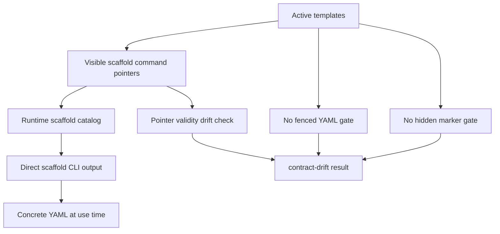

# refactor: Enforce pointer-only scaffold surfaces

## Summary

Shrink and harden the Issue-to-PR v2 scaffold migration by making active templates pointer-only. Runtime keeps concrete scaffold output; authored templates name runtime scaffold commands and must not commit fenced YAML scaffold bodies.

---

## Problem Frame

The scaffold migration satisfies most of the #114-#119 direction, but the implementation still carries migration-era machinery for committed generated blocks and hidden pointer comments. That keeps the branch large, leaves active templates with four fenced YAML shapes, and creates review findings around stale generated-block comparisons that disappear if pointer-only source templates become the enforced rule.

The cleanup should reduce code and maintenance surface. It should not use plan-doc deletion as the line-count lever.

---

## Requirements

**Pointer-only authored templates**

- R1. Active Issue-to-PR v2 templates contain zero fenced YAML blocks.
- R2. Active template scaffold references use visible runtime pointers such as `cli.ts scaffold <id> --json`.
- R3. Hidden `scaffold-pointer` comments and committed `generated-scaffold` blocks are forbidden in active templates.
- R4. Runtime scaffold output remains available for agents that need concrete fillable shapes at use time.

**Child-issue acceptance criteria**

- R5. #114 scaffold tracer path remains covered by renderer, CLI discovery/output, and drift tests.
- R6. #115 Builder return, compact attempt, and Validator Builder-evidence projections remain runtime-owned and discoverable.
- R7. #116 Validator Builder-evidence and inline-evidence lanes remain distinct with no cross-lane field leakage.
- R8. #117 ce-plan, replacement, and patch-proposal candidate-batch projections remain explicit and discoverable.
- R9. #118 ledger, Notes evidence, finding-row, lifecycle-default, and workflow-learning scaffolds remain runtime-rendered and parseable through existing helpers.
- R10. #119 prose pruning is enforced by pointer checks and no-template-YAML checks rather than generated-block body parity.

**Review hardening and shrink**

- R11. Delete or derive duplicate scaffold-id lists; no hand-maintained copy of `SCAFFOLD_IDS` may power drift checks.
- R12. Add machine-readable scaffold catalog metadata so agents do not need fan-out scaffold calls or template scraping.
- R13. Keep plan documents in this PR; shrink code and active template surfaces instead.
- R14. Preserve workflow semantics, read-only CLI posture, role boundaries, lane separation, and existing packet behavior.
- R15. Defer broad module splitting, historical prose cleanup, and generated-block CRLF hardening unless generated blocks remain active.

---

## Scope Boundaries

In scope:

- Active Issue-to-PR v2 templates and runtime scaffold references.
- Drift checks for visible scaffold pointers, hidden marker reintroduction, and fenced YAML in active templates.
- Runtime scaffold catalog discovery.
- Targeted review blockers that protect the pointer-only contract.
- Focused renderer and ledger-init hardening where it prevents contract drift.

Out of scope:

- Removing `docs/plans` artifacts to reduce branch size.
- Cleaning all 123 fenced YAML blocks across the repository.
- Rewriting historical issue ledgers, specs, memory docs, or unrelated skills.
- Broad `contract-drift.ts` module extraction.
- Fixing generated-block byte comparison line-ending behavior if generated blocks are deleted from active source surfaces.
- Replacing runtime scaffold output with prose-only instructions.

### Deferred to Follow-Up Work

- Split `contract-drift.ts` into smaller modules after this behavior is simplified and pinned.
- Consolidate pre-existing Builder policy text duplicated across templates, references, and packet constants.
- Add runbook-version literal drift coverage.
- Improve subprocess timeout cleanup and large-doc line-number performance in the drift checker.
- Tighten broad enum/projection typing beyond the scaffold surfaces touched here.
- Decide separately whether the registry data YAML block should move to a helper-owned storage model.

---

## Key Technical Decisions

- **Pointer-only source templates:** Source templates name runtime scaffold commands; they do not embed generated YAML. This is the simplest model that satisfies #114-#119 without carrying stale generated-block comparison machinery.
- **Runtime still emits concrete scaffold bodies:** The pointer-only rule applies to authored templates, not to CLI scaffold output, packet renderers, ledger sections, or tests that need YAML data.
- **Drift checks enforce absence and validity:** The drift checker should fail when active templates contain fenced YAML, hidden pointer comments, generated-block markers, or visible scaffold commands that do not resolve to the runtime catalog.
- **Delete obsolete generated-block checks instead of hardening them:** Review findings about CRLF byte comparisons and generated-block marker parity are removed by deleting the inactive model, not by making that model more complex.
- **Catalog discovery replaces template scraping:** Agents should discover scaffold ids and metadata through a machine-readable CLI surface, not by scanning prose.
- **Plan docs are retained:** Existing plan artifacts may stay as process history. Code shrink comes from deleting obsolete contract-drift machinery and tests tied only to generated-block storage.

---

## High-Level Technical Design

The authoring invariant is absence in templates and validity in pointers. Concrete YAML appears only when runtime commands render it.

---

## Implementation Units

### U1. Remove active template YAML bodies

**Goal:** Convert remaining active template YAML shapes to pointer-only guidance.

**Requirements:** R1, R2, R3, R6, R7, R8, R10, R14.

**Dependencies:** None.

**Files:**

- Modify: `runbooks/issue-to-pr-v2/templates/proposer-envelope.md`
- Modify: `runbooks/issue-to-pr-v2/templates/validator-envelope.md`
- Modify: `runbooks/issue-to-pr-v2/lib/packets.ts` only if runtime packet guidance needs a pointer added for a removed template shape.
- Test: `runbooks/issue-to-pr-v2/lib/packets.test.ts`
- Test: `runbooks/issue-to-pr-v2/contract-drift.test.ts`

**Approach:**

- Replace Proposer success and fail-stop fenced YAML examples with runtime pointer text.
- Replace Validator inline evidence and return envelope fenced YAML examples with runtime pointer text.
- Prefer existing runtime surfaces when available: packet output for full packet shape, scaffold output for reusable scaffold fragments.
- Add a new scaffold id only if a returned shape is an agent-fillable contract with no runtime-owned surface yet.
- Keep role framing, failure conditions, and lane-separation prose intact.

**Patterns to follow:**

- `runbooks/issue-to-pr-v2/templates/patch-proposal.md` pointer style.
- `runbooks/issue-to-pr-v2/templates/builder-return-envelope.md` pointer-only return-envelope guidance.
- Runtime lookup preamble in `runbooks/issue-to-pr-v2/lib/packets.ts`.

**Test scenarios:**

- Template scan finds no fenced YAML in `runbooks/issue-to-pr-v2/templates/*.md`.
- Proposer packet/rendered guidance still names the patch-proposal candidate-batch scaffold.
- Validator packet/rendered guidance still names Builder evidence, inline evidence, and finding-row scaffold pointers.
- Packet tests confirm rendered packet semantics and deny-list behavior do not change.

**Verification:** Active templates are pointer-only; packet behavior remains stable.

### U2. Simplify scaffold drift to pointer validity and YAML absence

**Goal:** Delete inactive generated-block and hidden-pointer production paths from the drift checker while keeping reintroduction protection.

**Requirements:** R1, R2, R3, R5, R10, R11, R14, R15.

**Dependencies:** U1.

**Files:**

- Modify: `runbooks/issue-to-pr-v2/contract-drift.ts`
- Modify: `runbooks/issue-to-pr-v2/contract-drift.test.ts`

**Approach:**

- Remove active `generated-block` and hidden `checked-pointer` surface loops where inventory has no entries.
- Delete `PREREQUISITE_SCAFFOLD_IDS`; validate pointer ids directly against the runtime scaffold catalog.
- Keep or add forbidden-pattern checks that report reintroduced `generated-scaffold` markers and hidden `scaffold-pointer` comments in active templates.
- Add a direct no-fenced-YAML check over active templates.
- Validate every visible `cli.ts scaffold <id> --json` pointer in active scoped surfaces against the runtime catalog.
- Keep the workflow-learning registry YAML block out of the active-template no-YAML gate unless a separate storage decision changes it.

**Patterns to follow:**

- Existing `extractCliClaims()` scaffold command extraction.
- Current visible-command pointer tests in `contract-drift.test.ts`.
- Existing scoped-doc configuration, narrowed to the active surfaces this plan cares about.

**Test scenarios:**

- Happy path: real active templates have no fenced YAML and all scaffold pointers resolve.
- Error path: adding a fenced YAML block to any active template produces a targeted drift finding.
- Error path: adding a hidden `scaffold-pointer` comment produces a targeted drift finding.
- Error path: adding a `generated-scaffold` marker produces a targeted drift finding.
- Error path: changing a visible scaffold pointer to an unknown id produces a targeted drift finding.
- Error path: changing a visible scaffold pointer to the wrong valid id fails when the section expects a specific scaffold.
- Regression: historical plan docs and old issue ledgers are not scanned by this active-template gate.

**Verification:** Drift tests prove pointer-only source enforcement without generated-block body comparison.

### U3. Add scaffold catalog discovery

**Goal:** Expose scaffold metadata through one machine-readable surface so agents can discover ids and sources without fan-out calls or prose scraping.

**Requirements:** R4, R5, R6, R7, R8, R9, R12, R14.

**Dependencies:** U2 may simplify the expected metadata, but this unit can be built in parallel if the output shape is kept small.

**Files:**

- Modify: `runbooks/issue-to-pr-v2/cli.ts`
- Modify: `runbooks/issue-to-pr-v2/cli.test.ts`
- Modify: `runbooks/issue-to-pr-v2/cli-smoke.test.ts`
- Modify: `runbooks/issue-to-pr-v2/lib/scaffolds.ts`
- Modify: `runbooks/issue-to-pr-v2/lib/scaffolds.test.ts`

**Approach:**

- Add a catalog command or contract slice that returns every scaffold id with runtime source, output kind, ordering, and any marker metadata still needed by runtime consumers.
- Keep existing `contract scaffold_ids --json` for compatibility.
- Derive each scaffold source from its id rather than hand-maintaining source strings in every scaffold definition.
- Make the help payload advertise the catalog surface.

**Patterns to follow:**

- Existing JSON envelope style in `cli.ts`.
- Existing `getScaffoldCatalog()` and `renderScaffold()` seams.
- Contract-slice tests that assert CLI discovery and help-data parity.

**Test scenarios:**

- Catalog output contains every `SCAFFOLD_IDS` entry in catalog order.
- Each catalog entry has a source derived from its scaffold id.
- `scaffold <id> --json` output agrees with the catalog entry for that id.
- CLI help advertises the catalog surface.
- Smoke test validates the process-boundary catalog envelope.

**Verification:** Agents can discover scaffold metadata with one machine-readable call.

### U4. Harden runtime YAML rendering at the shared seam

**Goal:** Keep runtime scaffold output safe while removing template-stored YAML.

**Requirements:** R4, R6, R7, R8, R9, R14.

**Dependencies:** U3 if the catalog tests loop over runtime-rendered bodies.

**Files:**

- Create or modify: `runbooks/issue-to-pr-v2/lib/yaml-scalar.ts`
- Modify: `runbooks/issue-to-pr-v2/lib/ledger.ts`
- Modify: `runbooks/issue-to-pr-v2/lib/packets.ts`
- Modify: `runbooks/issue-to-pr-v2/lib/ledger-init.ts`
- Modify: `runbooks/issue-to-pr-v2/lib/scaffolds.ts`
- Test: `runbooks/issue-to-pr-v2/lib/scaffolds.test.ts`
- Test: `runbooks/issue-to-pr-v2/lib/ledger-init.test.ts`
- Test: `runbooks/issue-to-pr-v2/lib/ledger.test.ts`
- Test: `runbooks/issue-to-pr-v2/lib/packets.test.ts`

**Approach:**

- Replace duplicate YAML scalar quoting helpers with one shared helper.
- Carry the hostile-value cases from prior ledger learnings into the shared helper tests.
- Add renderer round-trip tests for scalar, list, null, nested, placeholder, and fenced output cases.
- Keep parseability tests at the runtime seam rather than in committed template fixtures.

**Patterns to follow:**

- Existing Bun YAML parsing in ledger/scaffold tests.
- Issue-90 hostile-value learning around NUL, UTF-16 surrogate, fence-in-value, mapping-key escape, and numeric coercion.

**Test scenarios:**

- Shared scalar helper escapes backslash, quote, newline, carriage return, tab, and control characters.
- Hostile values do not break runtime-rendered YAML parseability.
- Every scaffold body parses to the expected broad shape.
- Null placeholders parse as YAML null, not the string `"null"`.
- List and nested object scaffolds parse as arrays and mappings, not strings.
- Fenced runtime scaffold output remains parseable after extracting the fence body.

**Verification:** Runtime YAML remains deterministic and parseable with one helper owner.

### U5. Patch ledger-init public contract errors

**Goal:** Keep initial ledger rendering a deterministic read-only fact surface with machine-routeable failures.

**Requirements:** R9, R12, R14.

**Dependencies:** U4 for shared YAML scalar handling.

**Files:**

- Modify: `runbooks/issue-to-pr-v2/lib/ledger-init.ts`
- Modify: `runbooks/issue-to-pr-v2/lib/ledger-init.test.ts`
- Modify: `runbooks/issue-to-pr-v2/cli.ts`
- Modify: `runbooks/issue-to-pr-v2/cli.test.ts`
- Modify: `runbooks/issue-to-pr-v2/cli-smoke.test.ts`

**Approach:**

- Preserve or map `LedgerInitRenderError` codes into public CLI error envelopes instead of collapsing all failures to one generic code.
- Reject embedded newlines and control characters in issue title, issue URL, target repo, started timestamp, and acceptance criteria.
- Validate `started_at` as an ISO-8601 timestamp unless existing callers prove they pass a narrower accepted format.
- Keep `ledger-init` read-only: render to stdout envelope, never write a ledger file.

**Patterns to follow:**

- Existing typed CLI error handling for packet render failures.
- Existing `ledger-init` happy-path envelope tests.

**Test scenarios:**

- Invalid issue number returns a routeable public error code.
- Missing or whitespace-only required values return routeable public error codes.
- Invalid `ac_source` returns a routeable public error code.
- Empty acceptance criteria and empty criterion values return routeable public error codes.
- Embedded newline in an AC is rejected before markdown structure is corrupted.
- Non-ISO `started_at` is rejected.
- Happy-path `ledger-init` output still parses through existing ledger helper expectations.

**Verification:** Orchestrators can repair bad `ledger-init` inputs without scraping freeform messages.

### U6. Tighten scaffold projection exhaustiveness

**Goal:** Remove type-level gaps that allow scaffold fields to drift silently.

**Requirements:** R6, R7, R8, R9, R14.

**Dependencies:** U3 if scaffold catalog/source derivation changes surrounding types.

**Files:**

- Modify: `runbooks/issue-to-pr-v2/lib/scaffolds.ts`
- Modify: `runbooks/issue-to-pr-v2/lib/scaffolds.test.ts`
- Modify: `runbooks/issue-to-pr-v2/lib/contract.ts` only if exported literal unions need small type aliases.

**Approach:**

- Type Notes evidence renderer field parameters from their contract field tuples instead of `string`.
- Keep `never` exhaustiveness checks consistent across all renderer branches.
- Avoid broad projection-interface refactors unless needed for the touched renderer seam.

**Patterns to follow:**

- Existing `renderCandidateBatchField()` and `renderBuilderReturnField()` exhaustiveness style.
- Existing `_ScaffoldIdsExhaustive` compile-time pattern.

**Test scenarios:**

- Type check fails if a Notes evidence field is added without a renderer branch.
- Runtime unknown-field guard still reports a typed `ScaffoldRenderError` where a guard remains reachable.
- Existing Notes evidence scaffold output remains unchanged.

**Verification:** Scaffold renderer branch coverage is enforced by TypeScript, not only runtime tests.

### U7. Scope-clean unrelated config and stale context

**Goal:** Keep the branch focused on #114-#119 scaffold migration.

**Requirements:** R13, R14, R15.

**Dependencies:** None.

**Files:**

- Modify or remove: `.codex/environments/environment.toml`
- Modify: `settings.json`
- Modify: `CONTEXT.md`

**Approach:**

- Remove unrelated Codex environment/status-line changes from this branch or move them to a separate branch.
- Eliminate hardcoded user-absolute paths from committed config if the config stays.
- Update context text that still describes retired ledger-template decisions as open questions.
- Do not remove plan docs solely to reduce the branch diff.

**Patterns to follow:**

- Repo git-safety and scope-discipline guidance.
- Current `CONTEXT.md` Q&A style where decisions are still relevant.

**Test scenarios:**

- Test expectation: none for config removal itself; verify through git diff and existing config tests if any apply.
- Context check: references to the retired compatibility ledger template read as settled, not open.

**Verification:** The PR no longer bundles unrelated local config and no longer presents settled scaffold-storage decisions as unresolved.

---

## Risks & Dependencies

- **Risk: pointer-only templates under-specify return envelopes.** Mitigation: add runtime scaffold/catalog surfaces where a returned shape has no owner, and test rendered packet guidance.
- **Risk: deleting generated-block drift checks removes real coverage.** Mitigation: replace body-parity coverage with no-template-YAML and pointer-validity checks that match the chosen storage model.
- **Risk: broad hardening sneaks back into the shrink pass.** Mitigation: keep generated-block CRLF, module splitting, subprocess cleanup, and historical YAML cleanup in deferred work unless they directly block pointer-only acceptance criteria.
- **Risk: workflow-learning registry YAML looks like a violation.** Mitigation: treat it as canonical data outside `templates/*.md` for this plan; decide separately whether it should become helper-owned.

---

## Sources & Research

- GitHub issues #114-#119 acceptance criteria: scaffold tracer path, Builder projections, Validator evidence lanes, candidate-batch projections, ledger/Notes scaffolds, and scaffold inventory/prose pruning.
- Code review run `20260527-060445-e4b05e28`: no P0 findings; P1 findings were duplicate scaffold-id prerequisite list and generated-block CRLF sensitivity.
- Current active-template scan: four fenced YAML blocks remain under `runbooks/issue-to-pr-v2/templates`.
- Repo-wide prose scan: 123 fenced YAML blocks exist, but most are historical plans, old ledgers, specs, unrelated skills, memory docs, or one registry data block.
- ADR 0005: templates frame handoffs; runtime owns scaffold contracts; pointer-only source and rendered prose is the desired boundary.

