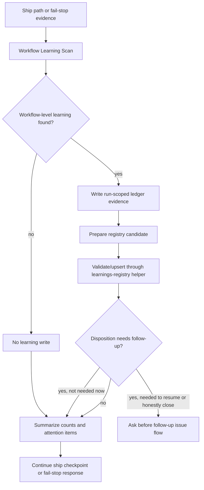

# feat: Define the read-only Workflow Learning Scan contract

Origin issue: [#92](https://github.com/nathanvale/claude-code-config/issues/92)
Parent PRD: [#88](https://github.com/nathanvale/claude-code-config/issues/88)
Implementation baseline: PR [#125](https://github.com/nathanvale/claude-code-config/pull/125)

---

## Summary

Define the Issue-to-PR Workflow Learning Scan as a read-only reflection pass
for ship-time and fail-stop moments. The plan adds one focused scan reference,
routes the hot Issue-to-PR control plane to it, and hardens drift coverage so
the scan records learning metadata through existing ledger and registry helper
surfaces without becoming a self-repair loop.

---

## Problem Frame

Issue #92 is the contract slice that sits on top of the already-built Workflow
Learnings registry and ledger scaffolds. Issue #90 created deterministic
registry validation and upsert behavior; issue #91 and PR #125 moved scaffold
and ledger shapes behind runtime-owned surfaces. The missing piece is prose
orchestration: when the Issue-to-PR workflow should run the scan, what the scan
asks, what evidence makes a learning actionable, and where the read-only
boundary stops the ship tail from mutating skills, runbooks, CLI code, docs, or
deliverables.

The core delivery principle from parent issue #88 must remain explicit: ship
the thing, capture the learning, make follow-up easy, but do not let meta-work
hijack delivery.

---

## Requirements

**Scan contract**

- R1. The Issue-to-PR skill and active references describe the Workflow
  Learning Scan inputs, outputs, diagnostic questions, and
  owner/disposition/confidence routing vocabulary.
- R2. The scan contract captures affected surface, what was wrong or
  confusing, discovery method, root cause, scope of impact, proposed fix,
  verification idea, owner, disposition, confidence, and run evidence.
- R3. The scan preserves the parent delivery principle: ship the thing, capture
  the learning, make follow-up easy, and never let meta-work hijack delivery.
- R4. The scan is read-only with respect to skills, runbook references, CLI
  code, docs, and deliverable files.

**Runtime ownership**

- R5. The scan uses `learnings-registry.ts --validate` and
  `learnings-registry.ts --upsert` for deterministic registry behavior instead
  of re-encoding registry mechanics in prose.
- R6. PR #125's runtime-owned scaffold baseline is preserved: do not edit or
  recreate `runbooks/issue-to-pr-v2/issue-N-ledger.template.md`; use
  `cli.ts scaffold workflow-learnings-empty --json` and existing ledger helper
  contracts.

**Relationship to gotchas**

- R7. `first-run-gotchas.md` remains recovery-focused; Workflow Learnings
  becomes the attention, lifecycle, and dedupe layer rather than a replacement
  gotchas guide.

**Drift coverage**

- R8. Drift checks cover that the scan reference exists, the hot router and
  `skills/issue-to-pr/SKILL.md` route to it, and deterministic behavior points
  to the registry helper instead of duplicating runtime contracts.

---

## Key Technical Decisions

- KTD1. Create a focused scan reference. Put the contract in
  `runbooks/issue-to-pr-v2/references/workflow-learning-scan.md` so the scan has
  one canonical prose owner instead of spreading policy across the skill, hot
  router, Stage 6 reference, gotchas guide, and registry reference. The
  reference owns orchestration and carries pointers to the runtime-owned
  registry/helper contracts rather than restating them.
- KTD2. Keep deterministic schema and enum mechanics in runtime/helper owners.
  The scan reference may name that learnings carry owner, disposition, and
  confidence. The scan proposes those values from evidence; the helper validates
  the allowed vocabulary. The reference should cite `lib/learnings.ts`,
  `learnings-registry.ts --validate`, and
  `references/workflow-learnings-registry.md` for allowed values and upsert
  behavior.
- KTD3. Route scan timing through prose orchestration, not a new CLI state.
  The scan is an operator reflection pass that consumes already-visible run
  evidence. It should not add a route id, imperative CLI command, or separate
  state machine in `lib/route.ts`.
- KTD4. Ship-time scan occurs after PR URL confirmation and before the final
  checkpoint commit. At that point the delivery is real, the human attention
  moment is fresh, and the final checkpoint can include only run metadata
  surfaces: the per-issue ledger and the workflow learnings registry.
- KTD5. Follow-up confirmation is narrow. At ship-time, `file-follow-up`
  learnings always appear in the final attention summary, but they block the
  final checkpoint only when follow-up is required to resume, unblock, or avoid
  closing the run with a known workflow defect still affecting this delivery.
  Fail-stop scans follow the same recovery-first rule.
- KTD6. Drift coverage should be structural, not prose snapshots. Tests should
  assert reference existence, routing/link relationships, helper citations, and
  read-only boundary markers rather than pinning the full prose body.

---

## High-Level Technical Design

The scan has exactly one mutation lane when it finds a learning: run metadata.
It may append run-scoped ledger learning entries and upsert the registry through
the helper. If it finds no learning, it writes nothing beyond normal existing
ledger or ship state. It must not patch skills, runbook references, CLI/source
code, documentation, target deliverables, or gotchas content while handling ship
or fail-stop flow. Its outputs stay lean: ledger evidence, registry
candidate/upsert, and a final counts/attention summary. Owner, disposition, and
confidence are scan proposals validated by the helper, not mechanically derived
truth. Follow-up issue shaping stays outside the scan.

---

## Implementation Units

### U1. Add the scan contract reference

**Goal:** Create the canonical prose owner for the Workflow Learning Scan.

**Requirements:** R1, R2, R3, R4, R5, R7.

**Dependencies:** none.

**Files:**

- `runbooks/issue-to-pr-v2/references/workflow-learning-scan.md`

**Approach:** Author a focused reference with terse sections for read trigger,
inputs, outputs, diagnostic questions, evidence quality, read-only stop
boundaries, ship-time behavior, fail-stop behavior, and gotchas relationship.
Put diagnostic questions in this reference as thinking prompts, not schema and
not ledger content. Define the captured fields from issue #92 as scan outputs,
but point to `references/workflow-learnings-registry.md` and `lib/learnings.ts`
for deterministic schema/enumeration ownership. Include visible contract
pointers for `learnings-registry.ts --validate`,
`learnings-registry.ts --upsert`, and
`cli.ts scaffold workflow-learnings-empty --json`. Name PR #125's pointer-only
scaffold baseline in implementation notes so future agents do not recreate the
deleted ledger template.

**Patterns to follow:**

- `runbooks/issue-to-pr-v2/references/workflow-learnings-registry.md`
- `runbooks/issue-to-pr-v2/references/ledger-and-helper.md`
- `runbooks/issue-to-pr-v2/references/first-run-gotchas.md`

**Test scenarios:**

Test expectation: none -- this unit creates the canonical reference. U5 adds
the structural drift coverage that protects the reference relationship.

**Verification:** A reviewer can read one reference and understand when the
scan runs, what it captures, what it may mutate, and when it stops.

### U2. Route the hot control plane to the scan

**Goal:** Make the scan discoverable at the two moments the parent PRD names:
ship-time and fail-stops.

**Requirements:** R1, R3, R4, R8.

**Dependencies:** U1.

**Files:**

- `skills/issue-to-pr/SKILL.md`
- `runbooks/issue-to-pr-v2/issue-to-pr.md`
- `runbooks/issue-to-pr-v2/references/workflow-learning-scan.md`
- `runbooks/issue-to-pr-v2/contract-drift.test.ts`
- `runbooks/issue-to-pr-v2/contract-drift.ts`

**Approach:** Add concise routing pointers from the skill orchestration and v2
hot router to the scan reference. Keep the skill as control-plane shell only:
it should say when to load the scan reference for ship-time and fail-stop
handling, not duplicate scan field lists or helper mechanics. This is
progressive closure: load the reference at the attention moment without adding a
new CLI `required_reference_ids` entry or route-state contract. Fail-stop
handling should point to the scan as a read-only reflection pass that records
learning metadata when useful, with explicit follow-up confirmation only when
needed to resume.

**Patterns to follow:**

- `first-run-gotchas.md` split-trigger routing in `skills/issue-to-pr/SKILL.md`
- Existing route/reference drift relationship checks in
  `contract-drift.ts` and `contract-drift.test.ts`

**Test scenarios:**

- In `contract-drift.test.ts`, removing the scan pointer from
  `skills/issue-to-pr/SKILL.md` produces a drift finding.
- In `contract-drift.test.ts`, removing the scan pointer from
  `runbooks/issue-to-pr-v2/issue-to-pr.md` produces a drift finding.
- In `contract-drift.test.ts`, adding scan field lists into the skill instead
  of pointing to the reference is either rejected by a targeted drift check or
  left out of scope with a documented manual review expectation.

**Verification:** The active Issue-to-PR control plane tells operators where to
load the scan contract without creating a second prose owner for that contract.

### U3. Thread ship-time scan behavior into Stage 6

**Goal:** Stage 6 records workflow learnings after PR URL confirmation and
before the final checkpoint commit, while preserving a tight final write scope.

**Requirements:** R2, R3, R4, R5, R6.

**Dependencies:** U1, U2.

**Files:**

- `runbooks/issue-to-pr-v2/references/stage-6-ship.md`
- `runbooks/issue-to-pr-v2/references/workflow-learning-scan.md`
- `runbooks/issue-to-pr-v2/references/ledger-and-helper.md`
- `runbooks/issue-to-pr-v2/contract-drift.test.ts`

**Approach:** Update Stage 6 so the ship path records `pr_url`, runs the
read-only Workflow Learning Scan, validates/upserts registry metadata through
the helper, then commits the final run metadata checkpoint. The final checkpoint
scope must allow only the per-issue ledger and workflow learnings registry. It
must still reject deliverable files, source changes, skill edits, runbook
reference edits, and docs edits made during the ship tail.

**Patterns to follow:**

- Stage 6 final ledger checkpoint scope in `stage-6-ship.md`
- Registry helper write-scope guard in `lib/learnings.ts`
- Ledger workflow learnings validation in `lib/ledger.ts`

**Test scenarios:**

- In `contract-drift.test.ts`, Stage 6 must link to or name the scan reference
  in the ship path.
- In `contract-drift.test.ts`, Stage 6 final checkpoint prose must allow the
  workflow learnings registry alongside the per-issue ledger.
- In `contract-drift.test.ts`, Stage 6 final checkpoint prose must continue to
  reject control-plane and deliverable changes during the final checkpoint.

**Verification:** Ship-time learning capture is explicit, but the final
checkpoint remains a metadata-only commit.

### U4. Preserve fail-stop recovery focus

**Goal:** Fail-stops capture workflow learnings when useful without forcing
meta-work into the recovery path.

**Requirements:** R3, R4, R7.

**Dependencies:** U1, U2.

**Files:**

- `skills/issue-to-pr/SKILL.md`
- `runbooks/issue-to-pr-v2/issue-to-pr.md`
- `runbooks/issue-to-pr-v2/references/workflow-learning-scan.md`
- `runbooks/issue-to-pr-v2/references/first-run-gotchas.md`
- `runbooks/issue-to-pr-v2/contract-drift.test.ts`
- `runbooks/issue-to-pr-v2/contract-drift.ts`

**Approach:** Add fail-stop guidance that distinguishes capture from repair:
the scan may record the observed workflow learning and proposed follow-up, but
the run should only ask for follow-up confirmation when that follow-up is needed
to resume, unblock, or avoid closing a run with a known workflow defect still
affecting this delivery. At ship-time, every `file-follow-up` still appears in
the final attention summary. The scan should not shape full follow-up issue
text; `to-issues` owns issue shaping after explicit approval. Clarify that
gotchas remain symptom-first recovery recipes, while workflow learnings carry
cross-run attention, dedupe, lifecycle, and follow-up metadata.

**Patterns to follow:**

- `<fail_stops>` section in `skills/issue-to-pr/SKILL.md`
- Entry governance and recovery focus in `first-run-gotchas.md`

**Test scenarios:**

- In `contract-drift.test.ts`, the skill fail-stop section must point at the
  scan reference or contain a scan load instruction.
- Manual review expectation: `first-run-gotchas.md` keeps its recovery keep
  test and does not become the Workflow Learnings lifecycle registry.
- Manual review expectation: fail-stop prose does not instruct agents to patch
  skills, runbooks, CLI code, docs, or deliverables as part of scan handling.

**Verification:** A fail-stop response can capture learning evidence without
obscuring the concrete resume condition.

### U5. Add drift coverage for the scan contract relationship

**Goal:** Seal the new scan contract from disappearing or drifting into a
parallel prose policy.

**Requirements:** R5, R6, R8.

**Dependencies:** U1, U2, U3, U4.

**Files:**

- `runbooks/issue-to-pr-v2/contract-drift.ts`
- `runbooks/issue-to-pr-v2/contract-drift.test.ts`
- `runbooks/issue-to-pr-v2/references/workflow-learning-scan.md`

**Approach:** Extend the contract-drift checker with a small structural
relationship check, similar in spirit to the first-run gotchas relationship
check but scoped to Workflow Learning Scan. The check should read the real
skill, hot router, Stage 6 reference, scan reference, registry reference, and
registry helper surfaces, then assert the important relationships:

- scan reference exists;
- skill and hot router route to it;
- Stage 6 points to it for ship-time learning capture;
- scan points to registry helper/reference for deterministic behavior;
- scan preserves read-only mutation boundaries;
- runtime-owned scaffold baseline remains pointer-only after PR #125.

**Patterns to follow:**

- `checkGotchasRelationship` in `contract-drift.ts`
- `checkLedgerLifecycleFieldDrift` and scaffold pointer checks in
  `contract-drift.ts`
- Relationship fixture style in `contract-drift.test.ts`

**Test scenarios:**

- Missing scan reference throws or reports a blocking drift finding.
- Missing skill pointer reports one finding.
- Missing hot-router pointer reports one finding.
- Missing Stage 6 ship-time pointer reports one finding.
- Scan reference that restates deterministic registry mechanics without a
  helper/reference citation reports a finding.
- Scan reference that lacks a read-only boundary reports a finding.
- Live repo relationship check returns zero findings after implementation.

**Verification:** `contract-drift` catches removal or misrouting of the scan
contract without snapshotting full prose.

---

## Scope Boundaries

- In scope: one scan contract reference, skill/hot-router routing pointers,
  Stage 6 ship-time scan placement, fail-stop capture guidance, and structural
  drift coverage.
- In scope: citation of existing registry helper and ledger/scaffold runtime
  owners.
- Out of scope: changing registry schema, helper enum values, upsert semantics,
  ledger workflow-learning field validation, scaffold bodies, or route ids.
- Out of scope: recreating `runbooks/issue-to-pr-v2/issue-N-ledger.template.md`
  after PR #125 deleted it.
- Out of scope: implementing automatic issue creation, dashboards, broad docs
  audits, or auto-repair of skills/runbooks/tooling during ship or fail-stop
  handling.

---

## Risks & Dependencies

- **Parallel policy risk:** The scan naturally wants to explain fields already
  owned by runtime/helper code. Keep prose at orchestration level and cite the
  helper/reference for deterministic details.
- **Ship-tail expansion risk:** Adding a reflection pass can tempt agents into
  fixing the workflow immediately. The read-only boundary and final checkpoint
  scope are load-bearing.
- **Drift-check brittleness:** Full prose snapshots would fight the repo's work
  style. Prefer structural checks over exact paragraph assertions.
- **PR #125 baseline risk:** Older docs may still imply committed scaffold
  bodies. The implementation must use runtime scaffold pointers and helper
  contracts only.

---

## Sources & Research

- GitHub issue #92: Defines acceptance criteria and staff pickup notes.
- GitHub issue #88: Parent PRD for Workflow Learnings.
- PR #125: Runtime-owned scaffold and ledger baseline; deleted
  `runbooks/issue-to-pr-v2/issue-N-ledger.template.md`.
- `runbooks/issue-to-pr-v2/references/workflow-learnings-registry.md`:
  Registry purpose and helper-owned schema.
- `runbooks/issue-to-pr-v2/lib/learnings.ts`: Deterministic registry schema,
  validation, signature, upsert, and write-scope behavior.
- `runbooks/issue-to-pr-v2/lib/ledger.ts`: Ledger `## Workflow Learnings`
  validation and registry-only field boundary.
- `runbooks/issue-to-pr-v2/references/ledger-and-helper.md`: Ledger workflow
  learnings section and runtime-owned scaffold pointers.
- `runbooks/issue-to-pr-v2/references/first-run-gotchas.md`: Recovery-focused
  guide boundary.
- `runbooks/issue-to-pr-v2/contract-drift.ts`: Existing structural drift-check
  patterns.
