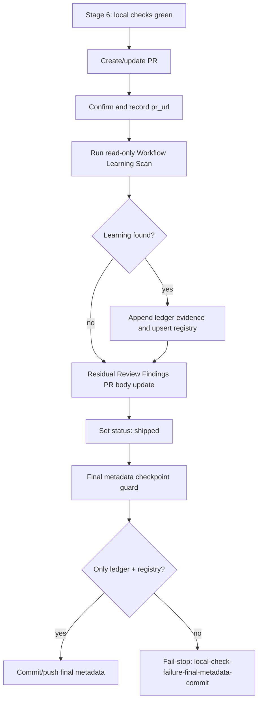

# feat: Run ship-time Workflow Learning Scan without hijacking delivery

Origin issue: [#93](https://github.com/nathanvale/claude-code-config/issues/93)
Parent PRD: [#88](https://github.com/nathanvale/claude-code-config/issues/88)
Prerequisite: issue [#92](https://github.com/nathanvale/claude-code-config/issues/92)

---

## Summary

Integrate the read-only Workflow Learning Scan into the Issue-to-PR Stage 6
ship tail after `pr_url` confirmation and before the final shipped checkpoint.
The ship path records run evidence in the ledger, upserts canonical registry
metadata through the helper, keeps Workflow Learnings out of the PR body, and
surfaces only counts plus attention items in the final response.

---

## Problem Frame

Issue #92 defines the scan contract. Issue #93 wires that contract into the
delivery path without letting meta-work take over the delivery. The dangerous
edge is Stage 6: the PR URL already exists, local checks are green, and the
workflow is about to write final metadata. That tail may now write two metadata
surfaces instead of one, but it must still reject deliverable files, source
code, control-plane repairs, random docs, untracked files, and broad staging.

The PR body remains about the shipped product/code change and residual review
findings. Workflow Learnings are internal workflow metadata; they belong in the
ledger, registry, and final operator response only.

---

## Requirements

**Ship sequencing**

- R1. Stage 6 runs the Workflow Learning Scan after `pr_url` is confirmed and
  recorded, before the final shipped checkpoint commit.
- R2. Ship-time scan results are written to the per-issue ledger and upserted
  into `runbooks/issue-to-pr-v2/references/workflow-learnings-registry.md`
  before the final shipped checkpoint commit.
- R3. Empty/no-learning scan results write nothing beyond the normal final
  ship metadata.

**Final checkpoint guard**

- R4. The final checkpoint guard allows exactly the per-issue ledger path and
  `runbooks/issue-to-pr-v2/references/workflow-learnings-registry.md`.
- R5. The same guard still rejects deliverable files, source code, skill or
  runbook control-plane repairs, random docs, untracked files, staged third
  paths, and broad staging.
- R6. Guard wording renames the final metadata checkpoint failure signature to
  `local-check-failure-final-metadata-commit`.

**Learning decisions**

- R7. `small-fix` learnings never block the final checkpoint commit.
- R8. High-confidence `file-follow-up` items require developer confirmation at
  ship-time only when they affect resume, unblock, or honest closure of this
  delivery.
- R9. Lower-confidence, `needs-evidence`, `already-covered`, and `ignore`
  outcomes can be recorded without blocking delivery.

**User-visible output**

- R10. Workflow Learnings are never appended to the PR body.
- R11. `workflow-learning-scan.md` owns the final learning-summary shape:
  counts plus attention items only, never the full registry or full ledger
  Workflow Learnings section.
- R12. Stage 6 routes final response learning content to the scan-owned summary
  shape instead of defining a parallel summary contract.

**Runtime-owned final metadata gate**

- R13. Runtime helper gates enforce final checkpoint allowed paths,
  third-path rejection, staged-path rejection, untracked-path rejection, and
  post-commit touched-file scope.
- R14. Runtime helper output emits Workflow Learning upsert result categories
  and candidate facts used by the scan-owned final learning summary.
- R15. Attention-item selection remains scan-owned judgment over runtime facts,
  disposition, confidence, and this delivery's closure context.
- R16. Executable drift checks cover Stage 6 helper routing, PR body omission,
  and final-response counts plus attention items at acceptance-criteria level.

---

## Key Technical Decisions

- KTD1. **Keep Stage 6 as the ship-tail owner.** `stage-6-ship.md` already
  owns local checks, PR URL recording, residual PR-body updates, and final
  shipped checkpointing. Wiring the scan there keeps sequencing visible at the
  exact point where the metadata write happens.
- KTD2. **Use the existing registry helper as the mutation boundary.**
  `learnings-registry.ts --validate` and `learnings-registry.ts --upsert`
  remain the only registry mutation path. The helper also emits the upsert
  outcome and candidate facts the final learning summary consumes; the scan
  keeps attention-item judgment. The plan does not add a second schema owner or
  duplicate enum mechanics in Stage 6 prose.
- KTD3. **Treat ledger plus registry as final metadata, not deliverables.** The
  final checkpoint scope widens from ledger-only to a two-path allowlist. Every
  other path is still a blocking Stage 6 failure.
- KTD4. **Keep PR body residual-review-only.** Workflow Learnings may be
  mentioned through the scan-owned final learning summary, but never in the PR
  body. This avoids turning a product/code PR into workflow-maintenance output.
- KTD5. **Runtime owns the final metadata checkpoint scope.** The allowed-path
  rule is mechanically checkable from git facts, so it belongs behind
  `decompose.ts` helper gates. Stage 6 prose decides when to call the gates;
  drift coverage checks that the prose routes to them.
- KTD6. **Batch upsert is atomic and JSON-shaped.** Ship-time scans may produce
  multiple Registry candidates, so the helper accepts one JSON/YAML batch file,
  validates every candidate before writing, writes nothing on any validation
  failure, and emits machine-readable outcomes and counts.
- KTD7. **`unchanged` means no registry byte change.** Appending evidence is an
  `updated` outcome. `unchanged` is reserved for a candidate whose application
  would leave serialized registry bytes unchanged.
- KTD8. **Final metadata checkpoint contamination is durable Stage 6 state.**
  Helper failures set `blocked_reason:
  local-check-failure-final-metadata-commit`; they do not become final-review
  product findings.

---

## High-Level Technical Design

---

## Scope Boundaries

- In scope: Stage 6 sequencing and wording in
  `runbooks/issue-to-pr-v2/references/stage-6-ship.md`.
- In scope: hot-router and skill summary alignment in
  `runbooks/issue-to-pr-v2/issue-to-pr.md` and
  `skills/issue-to-pr/SKILL.md` when needed.
- In scope: executable drift coverage in
  `runbooks/issue-to-pr-v2/contract-drift.ts` and
  `runbooks/issue-to-pr-v2/contract-drift.test.ts`.
- In scope: clarifying scan-output/final-response contract in
  `runbooks/issue-to-pr-v2/references/workflow-learning-scan.md` if issue #92
  has landed that file.
- Out of scope: changing registry schemas, enum values, or upsert mechanics in
  `runbooks/issue-to-pr-v2/lib/learnings.ts`.
- Out of scope: editing `runbooks/issue-to-pr-v2/issue-N-ledger.template.md`;
  PR #125 made ledger scaffold shape runtime-owned.
- Out of scope: adding Workflow Learnings text to PR descriptions.
- Out of scope: filing follow-up issues from the scan without explicit user
  approval.

---

## Implementation Units

### U1. Confirm issue #92 baseline and ship-tail insertion point

- **Goal:** Start from the canonical scan contract and avoid parallel policy.
- **Files:**
  - `runbooks/issue-to-pr-v2/references/workflow-learning-scan.md`
  - `runbooks/issue-to-pr-v2/references/stage-6-ship.md`
  - `runbooks/issue-to-pr-v2/issue-to-pr.md`
  - `skills/issue-to-pr/SKILL.md`
- **Work:**
  - Verify issue #92 has landed or is merged into the working branch.
  - Confirm Stage 6 already records `pr_url` before the scan.
  - Confirm the scan reference delegates deterministic behavior to
    `runbooks/issue-to-pr-v2/lib/learnings.ts` and
    `runbooks/issue-to-pr-v2/learnings-registry.ts`.
  - Confirm the hot router loads the scan for ship-time PR URL confirmation and
    fail-stop workflow learnings.
- **Test Scenarios:**
  - `contract-drift` live scan relationship returns zero findings after the
    baseline lands.
  - Removing the scan reference, skill pointer, hot-router pointer, or Stage 6
    pointer creates a relationship finding.
- **Verification:**
  - Focused test: `runbooks/issue-to-pr-v2/contract-drift.test.ts`
    `"Workflow Learning Scan relationship check"`.

### U2. Tighten Stage 6 ship-tail behavior

- **Goal:** Make Stage 6 unambiguous about scan placement, write scope,
  blocking rules, PR-body omission, and final response shape.
- **Files:**
  - `runbooks/issue-to-pr-v2/references/stage-6-ship.md`
  - `runbooks/issue-to-pr-v2/issue-to-pr.md`
  - `skills/issue-to-pr/SKILL.md`
  - `runbooks/issue-to-pr-v2/references/workflow-learning-scan.md`
- **Work:**
  - State the exact Stage 6 order: PR URL confirmation, scan, ledger/registry
    metadata write, residual-review PR body update, status flip, final metadata
    checkpoint.
  - Make the final checkpoint allowlist explicit: per-issue ledger plus
    `runbooks/issue-to-pr-v2/references/workflow-learnings-registry.md` only.
  - Clarify that `small-fix` never blocks final metadata commit.
  - Clarify that high-confidence `file-follow-up` needs developer confirmation
    only when it affects resume, unblock, or honest closure of this delivery.
  - Split Stage 6 failure handling: local check failures still route through
    Stage 5, while final metadata checkpoint contamination fail-stops in Stage 6.
  - Say Workflow Learnings never go into the PR body.
  - Define the final learning summary in `workflow-learning-scan.md` as counts
    plus attention items only.
  - Keep Stage 6 to routing: final response includes the scan-owned learning
    summary, not a second summary contract.
- **Test Scenarios:**
  - Stage 6 prose has scan after `pr_url` confirmation and before final
    checkpoint wording.
  - Stage 6 final checkpoint text names exactly the ledger and registry as
    allowed metadata paths.
  - Stage 6 rejects a third path/untracked path/broad staging in prose.
  - Stage 6 or scan reference says Workflow Learnings are omitted from PR body.
  - Stage 6 or scan reference says final response reports counts plus attention
    items, not full registry.
- **Verification:**
  - Focused drift tests added in U3.
  - Markdown audit: no duplicate schema/enum restatement beyond links to
    runtime owners.

### U3. Add executable ship-tail drift coverage

- **Goal:** Keep prose routing aligned with runtime-owned ship-tail gates and
  user-visible output rules.
- **Files:**
  - `runbooks/issue-to-pr-v2/contract-drift.ts`
  - `runbooks/issue-to-pr-v2/contract-drift.test.ts`
- **Work:**
  - Add or extend a relationship checker for Stage 6 ship-time learning
    integration.
  - Check these claims structurally:
    - Stage 6 points to the scan after PR URL confirmation.
    - Stage 6 calls the runtime final metadata scope helper before committing.
    - Stage 6 calls the runtime final metadata commit helper after committing.
    - PR body handling is residual-review-only and excludes Workflow Learnings.
    - `workflow-learning-scan.md` owns final response learning-summary shape,
      sources counts from runtime helper output, and owns attention-item
      judgment.
    - Stage 6 routes final response learning content to the scan-owned summary.
    - Final metadata checkpoint contamination fail-stops in Stage 6 rather than
      routing through final review.
    - Blocking rule is `small-fix` never blocks; high-confidence
      `file-follow-up` needs confirmation only when this delivery's honest
      closure depends on it.
  - Keep the checker narrow. It should validate the ship-tail relationship,
    not become a general prose auditor.
- **Test Scenarios:**
  - Live docs produce zero ship-tail drift findings.
  - Fixture missing the pre-commit runtime helper call produces one
    final-checkpoint finding.
  - Fixture missing the post-commit runtime helper call produces one
    final-checkpoint finding.
  - Fixture that adds Workflow Learnings to PR-body wording produces one PR-body
    finding.
  - Fixture missing counts/attention final-response wording produces one
    final-response finding.
  - Fixture where `small-fix` can block, or where every `file-follow-up` blocks
    regardless of delivery-closure impact, produces one blocking-rule finding.
- **Verification:**
  - Focused test file:
    `runbooks/issue-to-pr-v2/contract-drift.test.ts`.
  - Live clean-pass still returns zero findings.

### U4. Emit runtime Workflow Learning upsert outcomes

- **Goal:** Make final learning-summary counts deterministic.
- **Files:**
  - `runbooks/issue-to-pr-v2/learnings-registry.ts`
  - `runbooks/issue-to-pr-v2/lib/learnings.ts`
  - `runbooks/issue-to-pr-v2/lib/learnings.test.ts`
  - `runbooks/issue-to-pr-v2/learnings-registry.test.ts`
  - `runbooks/issue-to-pr-v2/references/workflow-learning-scan.md`
- **Work:**
  - Extend the pure upsert path to return an outcome category alongside the
    updated registry, without making prose infer it.
  - Add a batch upsert helper surface for ship-time scans that may produce
    multiple Registry candidates.
  - Accept one JSON/YAML batch candidate file with a top-level candidates list.
  - Validate every candidate before registry mutation; any invalid candidate
    rejects the whole batch and writes nothing.
  - Keep category ownership in runtime code. Categories are `created`,
    `updated`, and `unchanged`.
  - Define `unchanged` as no serialized registry byte change. Evidence append
    is `updated`.
  - Emit a JSON result containing one outcome per candidate plus aggregate
    counts.
  - Preserve the current human-readable single-upsert success line if useful,
    but ship-time summary consumption uses JSON output.
  - Update `workflow-learning-scan.md` to say summary counts come from helper
    output and attention items come from scan judgment over candidate facts,
    disposition, confidence, and delivery-closure context.
- **Test Scenarios:**
  - Upserting a candidate with a new signature emits `created`.
  - Upserting a candidate with an existing signature emits an updated outcome.
  - Upserting a candidate with an existing signature and no material registry
    change emits `unchanged`.
  - Batch upsert accepts multiple candidates and emits one outcome per
    candidate.
  - Batch upsert rejects the whole write when any candidate fails validation.
  - Batch upsert emits aggregate counts matching `created`, `updated`, and
    `unchanged` outcomes.
  - Batch upsert leaves registry bytes unchanged on validation failure.
  - Evidence append against an existing signature emits `updated`, not
    `unchanged`.
  - Candidate validation failure emits no success outcome.
  - Serialized registry still round-trips after outcome emission.
  - Scan reference points to helper output for counts, not prose-inferred
    categories.
- **Verification:**
  - Focused helper tests:
    `runbooks/issue-to-pr-v2/lib/learnings.test.ts` and
    `runbooks/issue-to-pr-v2/learnings-registry.test.ts`.

### U5. Add runtime final metadata scope gates

- **Goal:** Enforce final metadata checkpoint scope in code, per ADR 0004.
- **Files:**
  - `runbooks/issue-to-pr-v2/decompose.ts`
  - `runbooks/issue-to-pr-v2/lib/stage5-readonly.test.ts`
  - `runbooks/issue-to-pr-v2/references/stage-6-ship.md`
- **Work:**
  - Add `decompose.ts --assert-final-metadata-scope <ledger-path>` for the
    pre-commit guard.
  - Add `decompose.ts --assert-final-metadata-commit <ledger-path> <commit-ref>`
    for the post-commit guard.
  - Rename Stage 6 failure wording from
    `local-check-failure-final-ledger-commit` to
    `local-check-failure-final-metadata-commit`.
  - Runtime code computes allowed paths from the normalized ledger path plus
    `runbooks/issue-to-pr-v2/references/workflow-learnings-registry.md`.
  - Pre-commit guard rejects changed, staged, or untracked paths outside the
    two-path allowlist.
  - Pre-commit guard uses `git ls-files --others --exclude-standard`; any
    non-ignored untracked path fails the guard.
  - Post-commit guard rejects merge commits and any touched path outside the
    two-path allowlist.
  - Stage 6 prose calls both helpers, no longer hand-owns the path rule, and
    treats helper failure as a Stage 6 fail-stop rather than a Stage 5 review
    reroute.
  - Stage 6 records durable blocked state with
    `blocked_reason: local-check-failure-final-metadata-commit` when either
    helper fails.
- **Test Scenarios:**
  - Pre-commit guard passes when only the per-issue ledger changed.
  - Pre-commit guard passes when only the registry changed.
  - Pre-commit guard passes when both ledger and registry changed.
  - Pre-commit guard fails on any third modified path.
  - Pre-commit guard fails on any third staged path.
  - Pre-commit guard fails on any untracked path.
  - Post-commit guard passes for a non-merge commit touching only ledger and/or
    registry.
  - Post-commit guard fails for a third touched path.
  - Post-commit guard fails for a merge commit.
  - Stage 6 wording says helper failures stop in Stage 6 with
    `local-check-failure-final-metadata-commit`.
  - Stage 6 wording says helper failures persist
    `blocked_reason: local-check-failure-final-metadata-commit`.
- **Verification:**
  - Focused helper tests extend the existing git-scope pattern in
    `runbooks/issue-to-pr-v2/lib/stage5-readonly.test.ts`.
  - Stage 6 drift check from U3 confirms prose routes to the helper gates.

### U6. Validate helper and registry integration still fits the ship path

- **Goal:** Ensure the ship-tail plan relies on already-tested helper behavior
  rather than duplicating it.
- **Files:**
  - `runbooks/issue-to-pr-v2/learnings-registry.ts`
  - `runbooks/issue-to-pr-v2/lib/learnings.ts`
  - `runbooks/issue-to-pr-v2/lib/learnings.test.ts`
  - `runbooks/issue-to-pr-v2/learnings-registry.test.ts`
  - `runbooks/issue-to-pr-v2/lib/ledger.test.ts`
- **Work:**
  - Confirm `learnings-registry.ts --upsert` refuses non-canonical registry
    targets.
  - Confirm candidate validation covers owner/disposition/status/confidence and
    evidence key shape.
  - Confirm ledger Workflow Learnings validation accepts empty lists and rejects
    canonical/lifecycle fields in ledger entries.
  - Add no new helper behavior unless U2 reveals a real missing primitive.
- **Test Scenarios:**
  - Existing registry helper tests still pass.
  - New upsert outcome tests from U4 still pass.
  - Existing ledger Workflow Learnings validation tests still pass.
  - No new test duplicates enum value lists outside runtime-owned sources.
- **Verification:**
  - Focused test files:
    `runbooks/issue-to-pr-v2/lib/learnings.test.ts`,
    `runbooks/issue-to-pr-v2/learnings-registry.test.ts`, and
    `runbooks/issue-to-pr-v2/lib/ledger.test.ts`.

---

## Risks & Dependencies

- **Issue #92 dependency:** Do not start issue #93 implementation until #92's
  scan contract is canonical. Otherwise Stage 6 will point at a moving target.
- **Implementation sequencing:** Build runtime surfaces before prose wiring:
  batch upsert outcomes, final metadata helper gates, scan/Stage 6 prose, then
  drift checks.
- **Prose-as-control-plane risk:** Stage 6 behavior is operator prose. Runtime
  gates own final metadata scope; drift checks only verify prose routes to
  those gates and preserves output boundaries.
- **Naming risk:** `local-check-failure-final-metadata-commit` must replace the
  old `local-check-failure-final-ledger-commit` wording without breaking the
  `local-check-failure-*` Stage 6 routing family.
- **Routing risk:** Final metadata checkpoint contamination must not be treated
  as a product-diff review finding. Stage 6 local check failures still reroute
  through Stage 5; final metadata helper failures fail-stop in Stage 6.
- **ADR risk:** No new ADR is planned. ADR 0004 already owns the placement rule:
  deterministic workflow contracts live in code, prose routes to them.
- **PR-body leakage risk:** Residual-review updates and final response are
  adjacent in the ship tail. Tests should distinguish the PR body surface from
  the operator response surface.
- **Dirty-worktree risk:** Current branch may contain issue #92 work. Issue #93
  implementation should avoid overwriting unrelated in-flight edits.

---

## Sources / Research

- Issue #93: ship-time scan placement, checkpoint scope, PR-body omission, and
  final response acceptance criteria.
- Issue #92: read-only scan contract prerequisite and PR #125 scaffold baseline.
- `runbooks/issue-to-pr-v2/references/stage-6-ship.md`: current Stage 6 owner.
- `runbooks/issue-to-pr-v2/references/workflow-learning-scan.md`: scan contract
  owner after #92 lands.
- `runbooks/issue-to-pr-v2/references/workflow-learnings-registry.md`: canonical
  registry metadata/lifecycle surface.
- `runbooks/issue-to-pr-v2/lib/learnings.ts`: runtime owner for registry schema,
  enum values, validation, signature derivation, and upsert behavior.
- `runbooks/issue-to-pr-v2/decompose.ts`: existing helper gate pattern for
  git-based commit scope assertions.
- `runbooks/issue-to-pr-v2/contract-drift.ts`: existing relationship-check
  pattern for operator-doc routing contracts.
