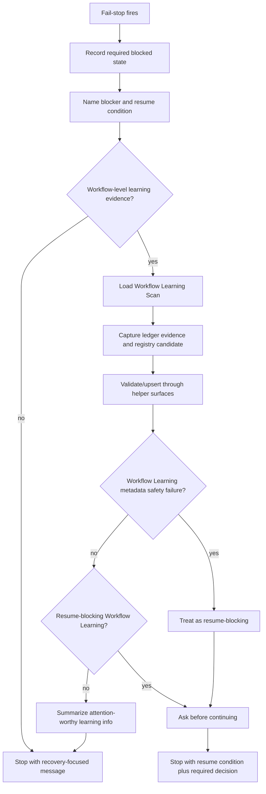

# feat: Capture workflow learnings at fail-stops with resume-aware blocking

Origin issue: [#94](https://github.com/nathanvale/claude-code-config/issues/94)
Parent PRD: [#88](https://github.com/nathanvale/claude-code-config/issues/88)
Prerequisite: issue [#92](https://github.com/nathanvale/claude-code-config/issues/92)

---

## Summary

Wire the read-only Workflow Learning Scan into Issue-to-PR fail-stops so stop
evidence can become durable ledger and registry metadata while it is fresh. The
fail-stop response stays focused on the resume condition; only
Resume-blocking Workflow Learnings block before safe resume.

---

## Problem Frame

Issue #92 defines the canonical Workflow Learning Scan contract, and issue #93
wires the scan into the ship tail. Issue #94 covers the other high-attention
moment: fail-stops. Fail-stops often expose the clearest evidence that a
workflow link, route contract, helper command, runbook reference, or gotchas
surface needs improvement. Without fail-stop capture, that evidence can vanish
into chat or be flattened into a generic blocked message.

The risk is recovery friction. A fail-stop already asks the operator to resolve
the current blocker. Workflow learning capture must preserve the parent issue's
delivery principle: ship the thing, capture the learning, make follow-up easy,
but do not let meta-work hijack delivery.

---

## Requirements

**Fail-stop scan trigger**

- R1. Every Issue-to-PR fail-stop considers whether workflow-learning evidence
  is available and loads `workflow-learning-scan.md` when the stop exposes a
  workflow-level learning.
- R2. Fail-stop scan handling records run-scoped evidence in the per-issue
  ledger and upserts registry metadata through the existing helper surfaces
  when capture is safe.
- R3. Fail-stop scan handling does not patch skills, runbook references,
  CLI/source code, docs, gotchas, or target deliverables.
- R4. Fail-stop scan capture is part of the same visible fail-stop action; it
  does not create a second stage action or allow repair work.

**Resume-aware blocking**

- R5. Follow-up confirmation blocks only for a Resume-blocking Workflow
  Learning: an unresolved workflow defect that prevents safe Issue-to-PR
  continuation or honest closure of the current delivery.
- R6. Resume-blocking is narrow: missing helper command, ambiguous route
  contract, unsafe registry write target, docs contradiction that prevents
  choosing the next route, or equivalent defects that block safe continuation.
- R7. General cleanup, unclear prose, future DX improvement, or non-blocking
  workflow debt records without a follow-up decision.
- R8. Scan/upsert failure blocks only for a Workflow Learning metadata safety
  failure.
- R9. Every Resume-blocking Workflow Learning is a Workflow Learning attention
  item in the fail-stop message.

**Learning quality**

- R10. `needs-evidence` observations can be recorded without being promoted to
  proven follow-up work.
- R11. `needs-evidence` observations are not Workflow Learning attention items
  by default.
- R12. High-confidence `file-follow-up` can record without blocking when the
  follow-up is not needed for safe resume.
- R13. `small-fix` records without blocking fail-stop recovery.

**User-facing stop shape**

- R14. The fail-stop message leads with the concrete blocker and resume
  condition.
- R15. Learning information in the fail-stop message is limited to
  Workflow Learning attention items, not full ledger entries, registry entries,
  routine counts, capture-status noise, or issue drafts.
- R16. `to-issues` is not invoked by this slice.

**Coverage**

- R17. Tests or executable checks prove the resume-aware blocking rule at the
  prose/route level:
  normal `small-fix` or `needs-evidence` fail-stops record without asking;
  high-confidence `file-follow-up` records without asking when not needed to
  resume; needed-to-resume `file-follow-up` asks before continuing.

---

## Key Technical Decisions

- KTD1. **Fail-stop scan stays prose orchestration.** The scan is loaded from
  the skill/hot-router fail-stop path and uses existing ledger/registry helper
  surfaces. This plan does not add a new route id, state-machine branch, or
  deterministic schema owner.
- KTD2. **Resume condition remains the headline.** Fail-stop UX serves recovery
  first. Workflow-learning content appears only after the blocker/resume
  condition and only when there is a Workflow Learning attention item from the
  scan-owned summary contract. Every Resume-blocking Workflow Learning is an
  attention item, because the user must see what justifies the ask.
- KTD3. **Durable blocked state comes before scan capture.** When a stage
  requires fail-stop state, record the blocker and resume condition before
  running the Workflow Learning Scan. Scan capture enriches the stop; it does
  not own the resume source of truth.
- KTD4. **Scan capture is inside the fail-stop action.** Fail-stop handling may
  include required blocked-state writes and optional Workflow Learning metadata
  capture as one visible action. This preserves evidence without allowing a
  second stage action or control-plane repair.
- KTD5. **Blocking depends on resume safety, not disposition alone.** A
  high-confidence `file-follow-up` is not automatically blocking during a
  fail-stop. It blocks only when it is a Resume-blocking Workflow Learning.
- KTD6. **Weak evidence stays weak.** `needs-evidence` is the correct home for
  suspected learnings. The fail-stop path must not inflate plausible but
  unproven observations into `file-follow-up` just to create tracker work.
  `needs-evidence` is quiet durability by default, not a user-visible attention
  item.
- KTD7. **Keep mutation through #93/#92 surfaces.** All learning writes use the
  same ledger Workflow Learnings section and registry helper/upsert path already
  owned by `workflow-learning-scan.md`, `lib/learnings.ts`, and
  `learnings-registry.ts`.
- KTD8. **Keep resume-blocking judgment out of registry state.**
  Resume-blocking Workflow Learning is a fail-stop-time judgment over evidence,
  disposition, confidence, and route context. Do not add a registry field,
  status, or disposition for it.
- KTD9. **Scan failure blocks only on metadata safety.** After the original
  fail-stop state is durable, ordinary scan absence, weak evidence, or
  non-resume-critical upsert friction must not block. A Workflow Learning
  metadata safety failure can be Resume-blocking because the metadata lane
  cannot safely preserve evidence.
- KTD10. **Structural drift coverage beats snapshots.** Coverage should assert
  fail-stop routing, narrow blocking language, read-only boundaries, and the
  three blocking scenarios without pinning full prose bodies.

---

## High-Level Technical Design

The scan extends fail-stop handling with a metadata lane. The fail-stop still
records the stage-specific blocked state first when the stage requires it, then
surfaces the blocker and resume condition. If workflow-learning evidence exists,
the scan captures metadata through the ledger and registry helper only. The user
is asked a follow-up question only when the learning is also the thing
preventing safe resume.

---

## Scope Boundaries

- In scope: fail-stop guidance in `skills/issue-to-pr/SKILL.md`.
- In scope: v2 hot-router fail-stop guidance in
  `runbooks/issue-to-pr-v2/issue-to-pr.md`.
- In scope: fail-stop section of
  `runbooks/issue-to-pr-v2/references/workflow-learning-scan.md`.
- In scope: structural drift or route-level coverage in
  `runbooks/issue-to-pr-v2/contract-drift.ts` and
  `runbooks/issue-to-pr-v2/contract-drift.test.ts`.
- In scope: focused helper/test updates only if existing runtime output lacks
  enough facts to express the three blocking scenarios.
- Out of scope: invoking `to-issues`; issue #95 owns tracker creation.
- Out of scope: editing skills, runbooks, CLI code, docs, gotchas, or target
  deliverables during fail-stop handling.
- Out of scope: changing registry schemas, owner/disposition/confidence enums,
  or helper upsert semantics.
- Out of scope: adding a registry field, status, or disposition for
  Resume-blocking Workflow Learning.
- Out of scope: replacing first-run gotchas with Workflow Learnings.

---

## Implementation Units

### U1. Tighten fail-stop scan contract

- **Goal:** Make `workflow-learning-scan.md` explicit about fail-stop capture,
  resume-aware blocking, and weak-evidence handling.
- **Requirements:** R2, R3, R4, R5, R6, R7, R8, R9, R10, R11, R12, R13, R14, R15, R16.
- **Dependencies:** issue #92 baseline.
- **Files:**
  - `runbooks/issue-to-pr-v2/references/workflow-learning-scan.md`
- **Approach:** Expand the Fail-Stop Scan section so it distinguishes capture
  from repair. Define Resume-blocking Workflow Learning with concrete example
  categories from issue #94. State that `small-fix`, `needs-evidence`, and
  non-resume-critical `file-follow-up` record without blocking. Keep runtime
  mechanics delegated to `lib/learnings.ts` and `learnings-registry.ts`; do not
  restate enum catalogs or candidate schema. Define scan failure behavior:
  Workflow Learning metadata safety failures may block; weak evidence and
  ordinary no-learning outcomes do not.
- **Patterns to follow:**
  - Existing `Ship-Time Scan` and `Final Learning Summary` sections in
    `runbooks/issue-to-pr-v2/references/workflow-learning-scan.md`
  - `runbooks/issue-to-pr-v2/references/first-run-gotchas.md` recovery-first
    framing
- **Test Scenarios:**
  - Removing narrow Resume-blocking Workflow Learning wording produces a drift
    finding.
  - Replacing `needs-evidence` with blocking follow-up wording produces a drift
    finding or manual checklist failure.
  - Adding prose that permits scan-time skill/runbook repair violates the
    read-only boundary check.
- **Verification:** A fail-stop operator can tell whether to record, summarize,
  ask, or simply stop from the scan reference alone.

### U2. Route fail-stops through scan consideration

- **Goal:** Ensure the active Issue-to-PR control plane considers workflow
  learning capture at every fail-stop without making the scan a route id.
- **Requirements:** R1, R3, R4, R14, R15, R16.
- **Dependencies:** U1.
- **Files:**
  - `skills/issue-to-pr/SKILL.md`
  - `runbooks/issue-to-pr-v2/issue-to-pr.md`
  - `runbooks/issue-to-pr-v2/references/workflow-learning-scan.md`
- **Approach:** Tighten the fail-stop sections so the common sequence is:
  record durable blocked state when required, surface blocker/resume condition,
  consider workflow-learning evidence, load the scan when evidence exists,
  record/upsert metadata when safe, then keep the user-facing stop focused on
  recovery. Keep `workflow-learning-scan.md` outside
  `data.required_reference_ids` by design; this remains an attention trigger.
- **Patterns to follow:**
  - Existing split trigger for `workflow-learning-scan.md` in
    `skills/issue-to-pr/SKILL.md`
  - Existing stop-and-ask guidance in `runbooks/issue-to-pr-v2/issue-to-pr.md`
- **Test Scenarios:**
  - The skill fail-stop section points to `workflow-learning-scan.md`.
  - The hot router fail-stop section points to `workflow-learning-scan.md`.
  - Fail-stop scan capture is described as part of the same visible fail-stop
    action, not a second stage action.
  - The fail-stop guidance keeps blocker/resume condition before learning
    summary.
  - The scan remains outside `required_reference_ids` with a documented
    attention trigger.
- **Verification:** The workflow can encounter any fail-stop and know to check
  for scan evidence without inventing a prose-only route.

### U3. Add focused fail-stop scan drift coverage

- **Goal:** Protect the blocking rule with executable prose/route-level tests.
- **Requirements:** R5, R6, R7, R8, R9, R10, R11, R12, R17.
- **Dependencies:** U1, U2.
- **Files:**
  - `runbooks/issue-to-pr-v2/contract-drift.ts`
  - `runbooks/issue-to-pr-v2/contract-drift.test.ts`
  - `runbooks/issue-to-pr-v2/references/workflow-learning-scan.md`
- **Approach:** Add a focused fail-stop scan checker beside the broader
  Workflow Learning Scan relationship check. Assert the fail-stop checker
  preserves four scenario families: non-blocking `small-fix`/`needs-evidence`,
  non-resume-critical high-confidence `file-follow-up`, needed-to-resume
  `file-follow-up`, and Workflow Learning metadata safety failure. Keep the
  existing relationship check for reference links, read-only boundary, and
  ship-time/final-summary relationships. Prefer structural phrase checks and
  small fixtures over full-document snapshots.
- **Patterns to follow:**
  - `checkWorkflowLearningScanRelationship` in
    `runbooks/issue-to-pr-v2/contract-drift.ts`
  - Workflow Learning Scan relationship fixture tests in
    `runbooks/issue-to-pr-v2/contract-drift.test.ts`
- **Test Scenarios:**
  - Fixture with normal fail-stop plus `small-fix`/`needs-evidence` language
    passes and does not require a follow-up question.
  - Fixture with high-confidence `file-follow-up` that is not needed to resume
    passes without blocking language.
  - Fixture with needed-to-resume `file-follow-up` requires an ask before
    continuing.
  - Weakening the narrow examples for Resume-blocking Workflow Learning reports
    a finding.
  - Fixture with unsafe registry write target or missing helper command requires
    an ask before continuing.
  - Live fail-stop scan check returns zero findings.
- **Verification:** Focused tests fail when fail-stop learning capture starts
  asking by default or stops asking when resume safety depends on a follow-up.

### U4. Align fail-stop summaries with scan-owned output shape

- **Goal:** Keep user-facing fail-stop messages concise and recovery-focused.
- **Requirements:** R9, R11, R14, R15, R16.
- **Dependencies:** U1, U2.
- **Files:**
  - `skills/issue-to-pr/SKILL.md`
  - `runbooks/issue-to-pr-v2/issue-to-pr.md`
  - `runbooks/issue-to-pr-v2/references/workflow-learning-scan.md`
  - `runbooks/issue-to-pr-v2/contract-drift.ts`
  - `runbooks/issue-to-pr-v2/contract-drift.test.ts`
- **Approach:** Update summary guidance so fail-stop responses include the
  concrete blocker, resume condition, and only Workflow Learning attention
  items. Suppress routine counts, no-learning capture status, and weak-evidence
  noise. Explicitly exclude full ledger entries, full registry entries, issue
  drafts, and `to-issues` invocation from fail-stop output.
- **Patterns to follow:**
  - `Final Learning Summary` in
    `runbooks/issue-to-pr-v2/references/workflow-learning-scan.md`
  - Existing fail-stop table in `skills/issue-to-pr/SKILL.md`
- **Test Scenarios:**
  - Fail-stop guidance says blocker/resume condition comes first.
  - Fail-stop guidance suppresses learning output when no Workflow Learning
    attention item exists.
  - `needs-evidence` observations record without becoming attention items by
    default.
  - Fail-stop guidance shows every Resume-blocking Workflow Learning as a
    Workflow Learning attention item.
  - Fail-stop learning summary excludes full registry and ledger entries.
  - Fail-stop guidance does not mention invoking `to-issues`.
  - Live drift check returns zero findings after prose alignment.
- **Verification:** A fail-stop response remains small enough to act on, even
  when learning metadata was captured in the background.

---

## Acceptance Examples

- AE1. Normal non-blocking observation
  - **Covers:** R2, R4, R7, R10, R11, R13, R14, R15.
  - **Given:** A fail-stop reveals a confusing but non-blocking workflow clue
    with low/medium confidence.
  - **When:** The scan classifies it as `needs-evidence` or `small-fix`.
  - **Then:** The workflow records ledger/registry metadata when safe, surfaces
    the blocker and resume condition, does not ask a follow-up question, and
    does not show routine learning capture output.

- AE2. High-confidence follow-up not needed to resume
  - **Covers:** R2, R5, R7, R12, R14, R15.
  - **Given:** A fail-stop reveals a high-confidence `file-follow-up` learning,
    but the current run can resume safely without resolving it first.
  - **When:** The scan records the learning.
  - **Then:** The workflow shows a Workflow Learning attention item and does
    not block on follow-up confirmation.

- AE3. Resume-blocking follow-up
  - **Covers:** R5, R6, R9, R14, R17.
  - **Given:** A fail-stop reveals a workflow defect such as a missing helper
    command, ambiguous route contract, unsafe registry write target, or docs
    contradiction that prevents choosing the next route.
  - **When:** The scan classifies the learning as a Resume-blocking Workflow
    Learning.
  - **Then:** The workflow asks before continuing and makes the resume condition
    explicit.

- AE4. Tracker work excluded
  - **Covers:** R16.
  - **Given:** A fail-stop records a `file-follow-up` learning.
  - **When:** The fail-stop response is prepared.
  - **Then:** The response does not invoke `to-issues` or include full issue
    draft text.

- AE5. Workflow Learning metadata safety failure
  - **Covers:** R8, R9, R17.
  - **Given:** A fail-stop has durable blocked state, but the scan cannot safely
    write metadata because the registry target is unsafe, the helper command is
    missing, or the helper contract is ambiguous.
  - **When:** The scan reaches metadata capture.
  - **Then:** The workflow treats the Workflow Learning metadata safety failure
    as resume-blocking and asks before continuing.

---

## Risks & Dependencies

- **Dependency:** Issue #92 must remain landed because it provides
  `workflow-learning-scan.md`, runtime/helper citations, and read-only scan
  boundaries.
- **Dependency:** Issue #93 may further adjust helper outputs and final summary
  facts. If #93 changes the scan-owned summary shape, align this plan's
  fail-stop summary checks with that final contract rather than creating a
  fail-stop-specific summary owner.
- **Risk:** Broad Resume-blocking Workflow Learning language could recreate
  default blocking. Mitigation: encode narrow examples and non-blocking
  counterexamples in drift coverage.
- **Risk:** Prose checks can become brittle. Mitigation: assert relationships
  and semantic anchors, not full paragraphs.
- **Risk:** Agents may treat captured `file-follow-up` as permission to file
  issues. Mitigation: keep `to-issues` explicitly out of this slice and defer
  tracker creation to issue #95.

---

## Sources / Research

- GitHub issue #94: fail-stop capture, resume-aware blocking acceptance
  criteria, and staff pickup note.
- GitHub issue #88: parent PRD and delivery principle for Workflow Learnings.
- GitHub issue #92: completed scan contract prerequisite.
- GitHub issue #93: ship-time sibling slice and shared summary/helper baseline.
- `runbooks/issue-to-pr-v2/references/workflow-learning-scan.md`: canonical scan
  orchestration and read-only boundary.
- `skills/issue-to-pr/SKILL.md`: active host-neutral Issue-to-PR control plane.
- `runbooks/issue-to-pr-v2/issue-to-pr.md`: v2 hot-router support file.
- `runbooks/issue-to-pr-v2/contract-drift.ts`: existing structural drift checks.
- `runbooks/issue-to-pr-v2/contract-drift.test.ts`: existing relationship-check
  fixtures and live zero-drift tests.
