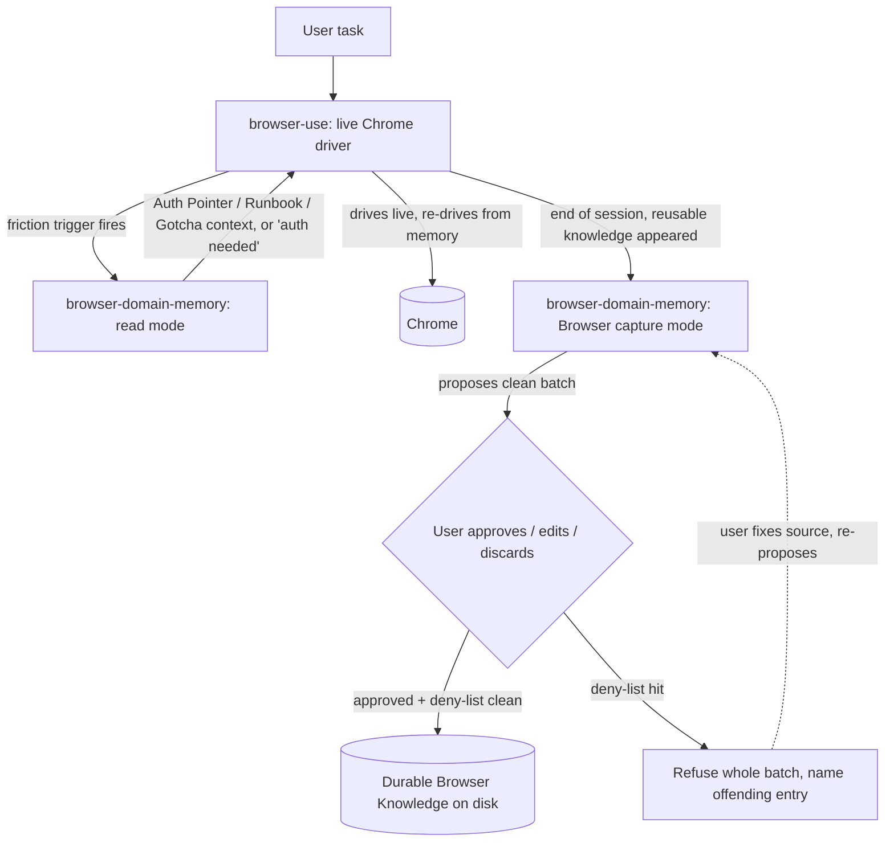

# feat: browser-domain-memory skill + browser-use consult-gate

Superseded by `docs/plans/2026-05-31-001-feat-browser-domain-memory-plan.md`.
This plan's prose-only/no-replay premise is historical context, not current direction.

## Summary

Add a net-new prose-only `browser-domain-memory` skill that owns durable per-domain browser knowledge (Auth Pointers, Browser Runbooks, Browser Gotchas, retained Scratch Evidence, Run Outcomes), and edit the existing `browser-use` skill to consult it on friction and hand back to it for Browser capture at end of session. No replay engine, tape, walker, or CLI in v1 — the LLM reads memory and re-drives live.

---

## Problem Frame

`browser-use` drives Chrome live and has been proven end-to-end against a real portal (Oncore). But every run throws away what it learned: the next run re-discovers where auth lives, which fork to take, which field order works, which submit guard to respect. For a single user driving login-heavy enterprise portals (timesheets, payroll, admin, invoicing) where the same flow and the same friction recur, that is repeated wasted effort and repeated exposure to the same traps.

This plan closes the memory loop at the leanest possible weight. The value is as much in the conscious refusals — no deterministic walker, no tape schema, no self-healing, no record→skill compiler — as in what gets built. Durable knowledge is prose the agent reads and re-drives from; it is never an executable artifact. (See origin: `docs/brainstorms/2026-05-30-browse-play-record-replay-requirements.md`.)

---

## Requirements

### Memory skill behavior

- R1. `browser-domain-memory` exposes a read-before-run mode that returns useful per-domain context (Auth Pointer presence, relevant Runbooks, Gotchas) for a named domain. A cold/empty read returns gracefully and does not suppress the end-of-session capture offer.
- R2. `browser-domain-memory` exposes a Browser capture mode that proposes clean durable entries as a batch for the user to approve, edit, or discard. Only approved entries are written. Nothing reaches durable memory without consent.
- R3. Durable knowledge is stored as prose using only the `CONTEXT.md` glossary types: Auth Pointer, Browser Runbook, Browser Gotcha, Scratch Evidence, Run Outcome. No raw transcript is ever written as memory.
- R4. Run Outcomes are tracked per flow as `<flow>.runs.jsonl` beside the runbook, recording date, success/failure, notes, and links to timestamped Scratch Evidence — providing promotion evidence for Machine Play Candidates without making the runbook executable.

### Capture discipline

- R5. SKILL.md ships the full both-sided capture-discipline list: the ask-when-to-capture triggers AND the explicit do-not-capture list. Both sides ship because the negative boundary is what stops the noise threshold drifting.
- R6. A failed run always writes a `failure` Run Outcome and never mints a new Browser Runbook; a trap learned from failure is captured as a Browser Gotcha instead.

### Secret safety (Critical)

- R7. No secret value ever reaches disk. Auth Pointers and Scratch Evidence carry shape-only placeholders, reusing `one-password` redaction vocabulary (e.g. `redacted:password-field`, `shape:6-digit-otp`).
- R8. Redaction is two-sided and fail-closed: `browser-use` redacts at compose time, and `browser-domain-memory` re-checks the deny-list at write time. A capture batch containing a deny-list hit is refused **whole** — write nothing, name the offending entry, user fixes the source and re-proposes. Never silently strip.

### Driver integration

- R9. `browser-use` consults `browser-domain-memory` only on friction (auth/SSO/MFA/account-or-tenant-picker/1Password needed; user implies repetition; agent stuck or looping; a fork risks wasting time or changing account context; submit/destructive/financial/admin action where prior Gotchas reduce risk; user asks to save/remember/reuse). It does not consult for ordinary browsing, clear pages, or no-auth one-off inspection.
- R10. The handoff from `browser-use` to `browser-domain-memory` is an explicit `Skill(browser-domain-memory)` invocation, not description auto-routing. `browser-domain-memory` hands back to `browser-use`; it does not call onward to any third skill in v1.
- R11. `browser-use` still drives ordinary browsing with zero memory ceremony.

### Sharing

- R12. The skill is shared cross-harness via a working symlink `.agents/skills/browser-domain-memory -> ../../skills/browser-domain-memory`, mirroring the proven `work-style-convert` direction.

---

## Key Technical Decisions

- **Prose-trust, no helper (D1).** v1 is folders + SKILL.md only. The agent reads Recorder-shaped Scratch Evidence and writes durable memory with its own tools. A read-only scratch-parsing helper is deferred until a flow becomes a Machine Play Candidate (proven by repeated runs + retained Scratch Evidence + successful Run Outcomes). Machinery follows proven repetition; it is not shipped speculatively.

- **Redaction refuses the whole batch (R8).** When the write-time deny-list check trips, fail-close the entire proposed capture batch rather than quarantining the offending entry or halting per-finding. Rationale: at prose-trust weight the whole-batch refuse is a true invariant, not a procedure — it needs zero entry-coupling logic and cannot orphan a Runbook→Auth-Pointer reference. Capture batches are small and single-user, so re-proposing after fixing one field is cheap. Per-entry quarantine and interactive per-finding halting were rejected as drifting toward the policy engine the brainstorm refuses.

- **Concurrent same-domain sessions consciously refused (C2).** The skill states a single-session assumption in prose ("no concurrent capture passes") rather than implementing file-locking. Run Outcomes stay append-only JSONL, which is already collision-safe. This is a refuse-in-prose default, not a gap.

- **Consult gate is friction-triggered prose (D4).** `browser-use` does not preflight ordinary browsing. The gate is a tiny SKILL.md section listing the friction triggers, not a workflow rewrite or a preflight policy.

- **Capture UX: consult on friction, capture at end, propose before write (D3).** `browser-use` drives live; reads memory before acting only on D-gate triggers; at end of session hands a short redacted summary to `browser-domain-memory` in capture mode, which proposes a batch the user approves/edits/discards. Manual "save what you learned" also works. Human always in the loop.

- **Glossary alignment.** Plan and SKILL.md prose use the canonical `CONTEXT.md` term **Browser capture** for the end-of-session distillation workflow. "Tidy" is informal shorthand from the brainstorm and is not a glossary term; it does not appear in the shipped prose.

- **Symlink direction (R12).** Use the proven `.agents/skills/<name> -> ../../skills/<name>` direction. The pre-existing broken `grill-me`/`find-skills` symlinks (which point at a non-existent `~/code/.agents/`) are left untouched and out of scope.

- **`browser-use` is an un-reconciled upstream copy.** The consult-gate edit is prose-only and has no dependency on `browser-use`'s pending de-hardcode work, so it lands now rather than blocking. Its `PROVENANCE.md` `## What this repo will change` checklist still lists a now-refused record-replay-tape line; this plan corrects that line to match the brainstorm's refusal while adding the consult-gate line.

---

## High-Level Technical Design

The two skills compose one-directionally: `browser-use` is the only user-facing front door and the only caller; `browser-domain-memory` answers and hands back. It never calls onward.



Redaction is two-sided: `browser-use` redacts at compose (left edge of the capture handoff), and `browser-domain-memory` re-checks the deny-list at write (the `APPROVE → WRITE` edge). A hit fails the whole batch closed.

---

## Output Structure

```text
skills/browser-domain-memory/
├── SKILL.md                    # frontmatter + read mode + capture mode + capture discipline + flow-gap contracts
├── PROVENANCE.md               # first-party, net-new
└── references/
    ├── memory-layout.md        # on-disk per-domain layout (Source block target)
    └── redaction.md            # allow-list / deny-list shape + one-password vocab (if SKILL.md exceeds length)

.agents/skills/browser-domain-memory -> ../../skills/browser-domain-memory   # cross-harness share
```

Per-domain on-disk layout (authored in `references/memory-layout.md`, created lazily at first capture):

```text
<memory-root>/<domain>/
├── auth-pointer.md             # Auth Pointer (shape-only, points to 1Password)
├── runbooks/<flow-slug>.md     # Browser Runbook (prose path knowledge)
├── runbooks/<flow-slug>.runs.jsonl   # Run Outcomes (append-only)
├── gotchas.md                  # Browser Gotchas
└── scratch/YYYY-MM-DD-HHMMSS-flow-slug/   # retained Scratch Evidence (redacted, Recorder-shaped)
```

The tree is a scope declaration, not a constraint — the implementer may adjust if implementation reveals a better layout. The exact `<memory-root>` location is an Open Question (see below).

---

## Implementation Units

### U1. `browser-domain-memory` SKILL.md skeleton — frontmatter, read mode, capture mode

- **Goal:** Stand up the skill with portable frontmatter and the two operating modes as prose.
- **Requirements:** R1, R2, R10, R11
- **Dependencies:** none
- **Files:** `skills/browser-domain-memory/SKILL.md` (create), `skills/browser-domain-memory/PROVENANCE.md` (create)
- **Approach:** Frontmatter is `name` + double-quoted `description` only (portable tier — no `mcp__` tools, no sub-agent references). Description is a short trigger phrase, not a summary. Read mode returns useful context for a named domain (or graceful empty on cold read); capture mode proposes a batch. State the one-directional composability contract explicitly: hands back to `browser-use`, never calls onward. PROVENANCE.md is first-party (net-new), noting the skill is original and listing the glossary terms it implements.
- **Patterns to follow:** `skills/one-password/SKILL.md` frontmatter and `## References` block; `productivity-memory` for the memory-store framing.
- **Test scenarios:**
  - Covers R1 / R11. YAML frontmatter parses; `description` is a quoted trigger phrase with no personal names or long paths.
  - Prose uses only `CONTEXT.md` glossary terms (Auth Pointer, Browser Runbook, Browser Gotcha, Scratch Evidence, Run Outcome, Browser capture) — no banned aliases (`tidy`, `tape`, `replay`, `recording`, `trace`).
  - Read mode and capture mode are both described as distinct, named modes.
  - Composability contract states hand-back-only; no onward Skill call appears.
  - `Test expectation: prose-contract verification only — no executable behavior.`
- **Verification:** Frontmatter YAML-parses; a reader can tell read mode from capture mode; no glossary drift.

### U2. `## Source` on-disk layout reference

- **Goal:** Define the per-domain memory layout the skill reads and writes, without inventing a bespoke persistence format.
- **Requirements:** R3, R4
- **Dependencies:** U1
- **Files:** `skills/browser-domain-memory/references/memory-layout.md` (create), `skills/browser-domain-memory/SKILL.md` (add `## Source` + `## References` blocks)
- **Approach:** Document the per-domain tree from Output Structure. Run Outcomes are append-only `<flow>.runs.jsonl` beside the runbook (date, success/failure, notes, Scratch Evidence link). Scratch Evidence uses timestamped names `YYYY-MM-DD-HHMMSS-flow-slug`. Files created lazily — only when first durable knowledge exists. Reference the retained-but-transient precedent at `skills/harden-implementation/ledgers/.gitignore` for how Scratch Evidence is retained without being trusted memory.
- **Patterns to follow:** `productivity-memory` (`## Source` pointing at on-disk layout); `skills/harden-implementation/ledgers/.gitignore` (retained transient evidence).
- **Test scenarios:**
  - Covers R4. Run Outcome layout names `<flow>.runs.jsonl`, append-only, beside the runbook.
  - Scratch Evidence naming convention matches the `CONTEXT.md` glossary (`YYYY-MM-DD-HHMMSS-flow-slug`).
  - `## Source` block points at the layout doc; `## References` lists the sibling files.
  - `Test expectation: prose-contract verification only — no executable behavior.`
- **Verification:** Layout matches the glossary's Run Outcome / Scratch Evidence definitions; no new persistence format invented.

### U3. Capture-discipline prose (full both-sided list) + flow-gap contracts

- **Goal:** Ship the both-sided capture discipline and the lean refuse-in-prose defaults for the remaining flow gaps.
- **Requirements:** R5, R6
- **Dependencies:** U1
- **Files:** `skills/browser-domain-memory/SKILL.md` (add capture-discipline section + flow-gap contracts)
- **Approach:** Ship D2 verbatim in shape — the ask-when triggers AND the explicit do-not-capture list. Then fold in the flow-gap defaults as prose contracts, not machinery:
  - Conflict on capture (I1): propose update explicitly (replace / keep-both / discard), not blind append.
  - Partial approval orphaning a reference (I2): if the user discards an Auth Pointer a Runbook references, warn and let the user decide; do not auto-rewrite or inline.
  - Failed run (I3, R6): always write a `failure` Run Outcome; never mint a Runbook from a failed flow; capture a Gotcha instead.
  - Mid-flow late consult (I4): allowed; pass domain + redacted stuck-point only.
  - Manual save with nothing durable (M1): graceful no-op ("nothing meets the bar").
  - Cold-run empty read (M2): must not suppress the end-of-session capture offer.
  - Concurrent same-domain sessions (C2): state the single-session assumption; no concurrent capture passes.
- **Patterns to follow:** D2 both-sided list from the origin doc; `context/skill-design-philosophy.md` refuse-in-prose weight bar.
- **Test scenarios:**
  - Covers R5. Both the ask-when list and the do-not-capture list are present and explicit.
  - Covers R6. Failure path: a `failure` Run Outcome is written; no Runbook is minted from a failed flow.
  - Each of I1, I2, I3, I4, M1, M2, C2 has a named prose contract — verified by presence, not by executable test.
  - `Test expectation: prose-contract verification only — no executable behavior.`
- **Verification:** All 7 flow gaps named as prose defaults; capture discipline is two-sided.

### U4. Redaction / secret-safety prose contract (Critical, two-sided, fail-closed)

- **Goal:** Make "no secret on disk" an enforced prose invariant on both sides of the capture handoff.
- **Requirements:** R7, R8
- **Dependencies:** U1, U3
- **Files:** `skills/browser-domain-memory/references/redaction.md` (create), `skills/browser-domain-memory/SKILL.md` (redaction contract section)
- **Approach:** State the two-sided contract: `browser-use` redacts at compose; `browser-domain-memory` re-checks the deny-list at write. On a deny-list hit, refuse the **whole** batch — write nothing, name the offending entry, user fixes source and re-proposes; never silent-strip. Auth Pointers and Scratch Evidence carry shape-only placeholders. Reuse `one-password` vocabulary (`redacted:password-field`, `shape:6-digit-otp`). Reference the shape-not-value precedent at `skills/one-password/SKILL.md` (~lines 113-114).
- **Patterns to follow:** `skills/one-password/SKILL.md` shape-not-value secret rule and redaction vocabulary.
- **Test scenarios:**
  - Covers R7. Auth Pointer prose holds no secret values — only shape placeholders and a 1Password reference.
  - Covers R8. The write-time check refuses the whole batch on a deny-list hit; the contract names the offending entry and never silent-strips.
  - Redaction vocabulary matches `one-password` (`redacted:*`, `shape:*`).
  - `Test expectation: prose-contract verification only — no executable behavior.`
- **Verification:** No-secret-on-disk discipline is stated on both sides; whole-batch refuse is unambiguous.

### U5. SKILL.md length check — extract to `references/` if over budget

- **Goal:** Keep SKILL.md at steipete prose-trust length; spill detail to references only if needed.
- **Requirements:** R3 (readability of the contract)
- **Dependencies:** U1, U2, U3, U4
- **Files:** `skills/browser-domain-memory/SKILL.md`, `skills/browser-domain-memory/references/*.md`
- **Approach:** After U1-U4, measure SKILL.md. If it exceeds the typical steipete band (~50-115 lines), move the on-disk layout detail (U2) and the redaction shape detail (U4) into `references/memory-layout.md` and `references/redaction.md`, leaving named pointers in SKILL.md via the `## References` block. If SKILL.md is already within band, the reference files stay minimal or fold back inline. This unit is conditional — it only acts if length warrants.
- **Patterns to follow:** `skills/one-password/SKILL.md` `## References` block.
- **Test scenarios:** `Test expectation: none — structural/length housekeeping, no behavioral change. SKILL.md frontmatter still parses after any extraction.`
- **Verification:** SKILL.md is within the prose-trust length band; references are named, not orphaned.

### U6. `browser-use` edit — `## Domain Memory` consult-gate + capture handoff + PROVENANCE fix

- **Goal:** Wire `browser-use` to consult and hand back, and correct its provenance checklist.
- **Requirements:** R9, R10, R11
- **Dependencies:** U1 (the handoff target must exist)
- **Files:** `skills/browser-use/SKILL.md` (add `## Domain Memory` section), `skills/browser-use/PROVENANCE.md` (checklist edit)
- **Approach:** Add a tiny `## Domain Memory` section: list the friction triggers (R9) and state that on a trigger, `browser-use` calls `Skill(browser-domain-memory)` in read mode; at end of session, if reusable knowledge appeared, it calls `Skill(browser-domain-memory)` in capture mode with a short redacted summary. Explicit Skill invocation, not auto-routing (R10). Do not preflight ordinary browsing (R11). In `PROVENANCE.md`, add a checklist line for the consult-gate addition, and correct the now-refused `(thesis) Add record-to-JSON-tape + replay; self-healing on DOM drift` line to reflect the brainstorm's conscious refusal (annotate/strike with a pointer to the origin brainstorm). Do not touch the un-reconciled de-hardcode items — they are out of scope.
- **Patterns to follow:** Existing `browser-use/SKILL.md` section style; the explicit-`Skill()`-handoff requirement from research (description auto-routing is ~0% reliable for multi-skill).
- **Test scenarios:**
  - Covers R9. The consult-gate lists the friction triggers and states the no-consult cases (ordinary browsing, clear pages, no-auth one-off).
  - Covers R10. The handoff is an explicit `Skill(browser-domain-memory)` call; no reliance on description routing.
  - Covers R11. No preflight is added to ordinary browsing.
  - PROVENANCE: the consult-gate checklist line is added; the record-replay line is corrected to reflect refusal; the de-hardcode items are untouched.
  - `Test expectation: prose-contract verification only — no executable behavior.`
- **Verification:** Consult-gate is friction-only and prose-sized; handoff is explicit; provenance is honest.

### U7. Cross-harness share symlink

- **Goal:** Make the skill discoverable cross-harness using the proven direction.
- **Requirements:** R12
- **Dependencies:** U1 (target must exist)
- **Files:** `.agents/skills/browser-domain-memory` (create symlink → `../../skills/browser-domain-memory`)
- **Approach:** Create the relative symlink mirroring `.agents/skills/work-style-convert`. Confirm it resolves. Confirm `install.sh` expectations cover it (or note if it doesn't). Do not touch the broken `grill-me`/`find-skills` symlinks.
- **Patterns to follow:** `.agents/skills/work-style-convert -> ../../skills/work-style-convert`.
- **Test scenarios:**
  - Covers R12. The symlink resolves to the real skill directory (`test -e` on the link target succeeds).
  - The broken `grill-me`/`find-skills` links are unchanged.
  - `Test expectation: link resolves — verified by filesystem check, not a unit test.`
- **Verification:** `readlink` shows the relative `../../skills/...` target; the link resolves.

---

## Scope Boundaries

### In scope (v1)

- `browser-domain-memory` skill: read mode + capture mode, prose-only.
- `browser-use` edit: tiny `## Domain Memory` consult-gate + end-of-session capture handoff + PROVENANCE correction.
- Durable knowledge as prose; Scratch Evidence retained, redacted, Recorder-shaped, non-executable.
- Run Outcomes tracked for promotion evidence.
- One cross-harness share symlink.

### Deferred to Follow-Up Work

- **Retire the symlink-share pattern repo-wide** — evaluate copy-vs-generated-install-script as a replacement for hand-maintained `.agents/` symlinks. Raised during planning; deliberately not decided inside this browser-memory plan because it affects every shared skill. Its own decision later.
- **Repair the broken `grill-me`/`find-skills` symlinks** — pre-existing, point at a non-existent `~/code/.agents/`. Out of scope here; fix when those skills' runtime folders are addressed.
- **Reconcile `browser-use`'s pending de-hardcode work** — the hardcoded Chrome path and the agent-browser backend path remain open on its PROVENANCE checklist. This plan's consult-gate edit is prose-only and does not depend on them.

### Deferred for later (from origin)

- Scratch-parsing helper CLI — only when a flow is a Machine Play Candidate.
- Any machine-play / deterministic replay runner.
- Stop-hook-triggered capture — only if manual capture proves too easy to forget.
- A `puppeteer` adjacent skill for mechanical Recorder/Puppeteer tooling.

### Outside this product's identity (conscious refusals, from origin)

- No deterministic walker, tape schema, or step contract. LLM reads history, re-drives live.
- No predicate-selection schema (pick-row-by-data is a live `browser-use` task).
- No mid-flow re-auth engineering. Auth is a prefix; mid-flow auth wall → stop.
- No recording→skill distillation compiler. Browser capture is a prose review with the agent.
- No constraint+witness self-healing. Drift → stop → recapture.
- No network-layer capture.
- No `browse` or `play` front door — both imply a replay engine that does not exist.
- No shareability/portability claim. Runbooks and Scratch Evidence are user-bound.

---

## Open Questions

- **Memory root location.** Where `<memory-root>` lives on disk (e.g. under the repo, under `~/.config/`, or a per-domain dir near `browser-use`) is not yet pinned. Resolve at U2 implementation against the Memory OS contract (`~/.config/context/AGENTS.md`) — repos own their own truth; this is browser-run operational memory, likely repo-owned. Does not block U1.

---

## Risks & Dependencies

- **`browser-use` is an un-reconciled upstream copy.** The consult-gate lands on top of pending de-hardcode work. Mitigation: the edit is prose-only and additive; U6 explicitly leaves the de-hardcode checklist items untouched and only corrects the now-false record-replay line.
- **Explicit-handoff reliability.** Description auto-routing across multiple skills is ~0% reliable. Mitigation: R10 mandates an explicit `Skill(browser-domain-memory)` call; this is load-bearing and tested in U6.
- **Dependency: `one-password`** owns safe `op` access. `browser-domain-memory` Auth Pointers reference secrets, never hold values; the skill returns "auth needed" to `browser-use`, which decides whether to invoke auth. No third-skill fan-out in v1.
- **Assumption (unverified, from origin):** the friction-triggered consult gate is sufficient in prose without a helper. If it proves unreliable in practice, a tiny helper prompt is the first escalation — not a policy engine.

---

## Sources & Research

- Origin requirements: `docs/brainstorms/2026-05-30-browse-play-record-replay-requirements.md` (Outcome, two-skill design, D1-D4, scope boundaries, success criteria).
- Resolved design / spec: `docs/ideation/2026-05-30-browse-play-record-replay-ideation.md` (consult-gate wording, capture pattern, refusal list).
- Glossary: `CONTEXT.md` (every knowledge type with `_Avoid_` banned-alias lists; SKILL.md prose must align).
- Weight bar: `context/skill-design-philosophy.md` (prose-trust, refuse-in-prose over machinery).
- Composability evidence: `docs/research/2026-05-30-skill-composability-handoff-observability.md`.
- Pattern references (repo): `skills/one-password/SKILL.md` (frontmatter, `## References`, shape-not-value redaction ~lines 113-114); `productivity-memory` (`## Source` memory-store framing); `skills/harden-implementation/ledgers/.gitignore` (retained transient evidence); `.agents/skills/work-style-convert` (proven symlink direction).
