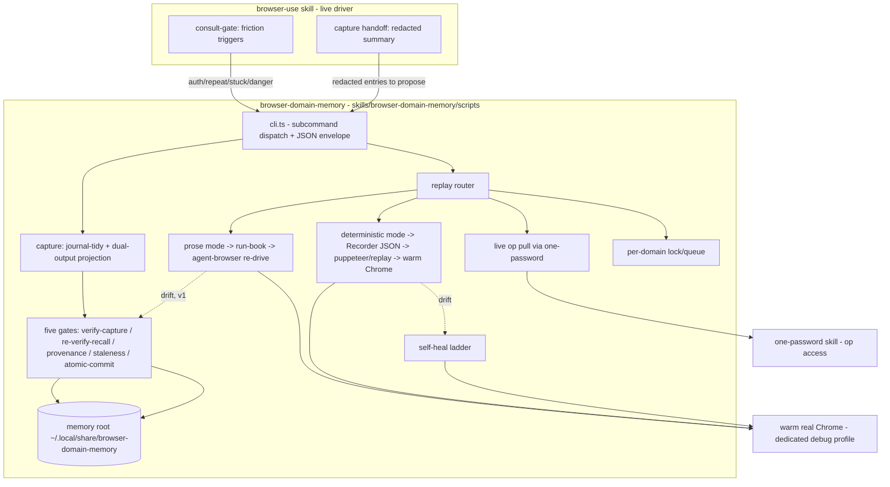
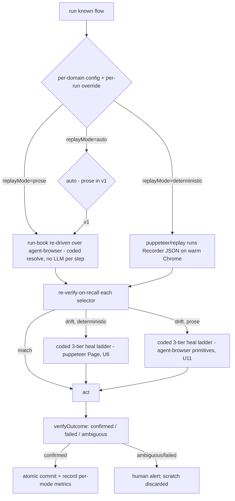

# feat: browser-domain-memory — durable per-domain browser memory with dual-mode replay

## Summary

Build `browser-domain-memory`: a net-new capability that gives the browser agent durable
per-domain memory. It captures what a real warm-Chrome flow learned (durable selectors, auth
pointers, gotchas, waits, asserts), stores it as a **dual-output contract** (Chrome Recorder JSON
+ an agent run-book), and on the next run plays it back in one of **two modes the user configures
per domain** — `prose` (the run-book is replayed step-by-step over agent-browser with a coded
selector-resolution + heal ladder; the LLM reads the page only at capture, not per replay step;
durable + tool-neutral) or `deterministic` (puppeteer replays the Recorder JSON, fast + zero
reasoning rounds) — self-healing on drift. Five memory-quality gates keep the store from rotting;
live `op` auth keeps the warm profile hands-free; runs serialise per domain. Every load-bearing
risk is proven in committed prototypes, including prose-mode re-drive (prototype
`prose-replay/`, proven 2026-05-31 — the last risk to land; it disproved the original "LLM
re-drives per step" framing and showed prose heals with a coded ladder, no LLM per step). (see
origin: `docs/brainstorms/2026-05-30-browse-play-record-replay-requirements.md`)

---

## Problem Frame

Nathan drives login-heavy enterprise portals where the same flow recurs 52×/year (Oncore /
FastTrack360 timesheets, Xero reconciliation, admin/invoicing). Today each run re-discovers the
login path, form quirks, and traps from scratch. A two-run prototype on a real portal measured the
cost: run 1 (cold) did **22 discovery operations** to locate login fields; run 2 (warm, from
memory) did **0**. The payoff isn't redoing a one-off booking — it's turning a chore you repeat
weekly into a button you press.

The honest lever (corrected by real measurement): the win is **eliminating the agent's
look-and-think loop**, not raw selector speed. A live cold run snapshots + enumerates before each
step and re-snapshots after (~5.4× browser cost), plus an LLM reasoning round per step (seconds
each). Deterministic replay does **zero** reasoning rounds. Small on a trivial page, large on a
multi-step portal flow — so the plan tracks **rounds/snapshots eliminated**, not just wall-clock
(see origin D-metrics; prototype `metrics-real`).

This plan **reverses the prior prose-only landing.** An earlier plan
(`docs/plans/2026-05-30-001-feat-browser-domain-memory-plan.md`) and the shipped skill stub refused
all machinery (no replay engine, no self-healing, no tape). Prototyping this session tested those
risks end-to-end, so v1 now ships the machinery — and, per the user's decision, ships **both replay
modes** so real Run Outcomes can prove which mode earns its keep per flow over time. The canonical
glossary (`CONTEXT.md`) still encodes the reversed worldview and is reconciled by this plan (U13).

---

## Requirements

### Capture and storage

- R1. One rich capture emits a **dual-output contract**: strict Chrome DevTools Recorder JSON
  (deterministic replay) AND an agent run-book (per step: label, ordered selector fallback chain,
  wait-for, post-step assert). Both required. (origin D5)
- R2. Capture is **hybrid-timed**: journal live (order + waits, only knowable live) → tidy at end
  (drop fumbles / superseded retries / no-effect noise, keep the corrected winning selector) →
  commit only on verified. (origin D5; prototype `journal-tidy`)
- R3. Capture records **provenance** for every selector (`by-id` … `by-heal`) and derives a
  confidence score; heals decay confidence. (origin D7; prototype `provenance`)
- R4. Durable memory stores per domain: Auth Pointers, Browser Runbooks (dual-output), Browser
  Gotchas, Scratch Evidence, and Run Outcomes — matching the `CONTEXT.md` glossary vocabulary. Never
  a raw transcript; never a secret value.

### Replay (both modes, configurable)

- R5. Each domain has a **config** selecting `driver` (`agent-browser` default | `chrome-devtools`)
  and `replayMode` (`prose` | `deterministic` | `auto`), with a global default and a per-run
  override. **`auto` in v1 falls back to `prose`** (the durable, safe default) — the
  confidence/staleness-driven heuristic is deferred, and `describe()` states this so the agent gives
  an honest answer. v1 ships only the fields a v1 code path reads (`driver`, `replayMode`,
  `authPointerRef`); speculative tuning fields are NOT added until a consumer exists (no
  `confidenceFloor`/`stalenessThresholds`/`concurrency` — those live as module constants, per U4/U5).
- R5b. Config is **agent-driven, not just a file**: the CLI front door exposes a `config`
  route (`get` / `set` / `explain`) and SKILL.md prose lets the LLM tell the user how to configure a
  domain — or do it for them through the same route — so no hand-editing of `config.json` is
  required. Agent-native parity: any setting the file holds, the agent can read, explain, and write.
- R6. **Prose mode**: the run-book is replayed step-by-step over agent-browser against the warm
  Chrome — each step's ordered selectors are resolved live, the action runs, the post-step assert is
  checked. Resolution + heal is **coded, not an LLM call per step** (the LLM reads the page only at
  capture time, building the run-book). Zero added runtime dependency. The durable, tool-neutral
  default for new captures. (prototype `prose-replay/`)
- R7. **Deterministic mode**: `@puppeteer/replay` replays the Recorder JSON against the warm Chrome.
  Fast, zero reasoning rounds. (prototypes `recorder-json`, `booking-furdo`)
- R8. On selector drift, replay **self-heals** via a three-tier ladder: fallback selector chain →
  text-disambiguation within a generic selector → re-find by the step's label/role metadata. No LLM
  call — run-book metadata is the judgment. A selector resolving the *wrong* element is drift too.
  **Both modes heal with a coded ladder, not LLM judgment** — deterministic over a puppeteer `Page`
  (prototype `self-healing`), prose over agent-browser's snapshot/`eval`/text-find primitives
  (prototype `prose-replay/`, which recovered 3 drifted steps incl. one only the label could
  identify). The ladders share the policy, not the driver. (origin D6)

### Memory-quality gates (five, all v1)

- R9. **Verify-on-capture**: a resolved selector must pass its assert (a "submit" target is actually
  a submit; a "password" field is `type=password`) before storage. (origin D7; prototype `capture-verify`)
- R10. **Re-verify-on-recall**: before trusting a recalled selector, cheaply confirm it still
  matches; on failure, re-discover + re-capture. (origin D7; prototype `capture-verify`)
- R11. **Provenance + confidence**: low-confidence selectors get re-verified harder; heals decay
  confidence so flaky selectors keep getting re-checked. `TRUST_THRESHOLD` gates the fast path.
  (origin D7; prototype `provenance`)
- R12. **Staleness / invalidation**: a tunable policy scores whole-runbook health from Run Outcome
  history → `healthy | degrading | stale`, flipping on consecutive failures, rising heal-rate, mass
  drift (redesign), or age. Stale → invalidate + force recapture. (origin D7; prototype `staleness`)
- R13. **Atomic commit boundary**: durable memory is written **only** on verified completion via
  write-temp + atomic rename; capture stages in a scratch journal; a crash or failed/ambiguous
  verification discards the scratch, leaving the previous good runbook intact. Invariant: durable
  memory holds a fully-complete verified runbook OR the previous good one — never a partial. (origin
  D7; prototype `crash-safety`)

### Safety and lifecycle

- R14. **Secret safety**: no secret value reaches disk, logs, or any persisted artifact (including
  the replayable Recorder JSON). Two-sided, fail-closed redaction — compose-side shape-only +
  write-side deny-list re-check that refuses the **whole batch** on a hit and names the offending
  entry. **Defence in depth against the deny-list's fail-open gap:** a field-name deny-list alone
  passes unlisted sensitive names (`pin`, `passcode`, `passphrase`, `access_token`, …), so pair it
  with a posture where any field whose VALUE matches a secret shape is redacted regardless of name,
  and extend the shape patterns beyond the prototype's set (add JWT `eyJ…`, base64url `-_`, 4- and
  8-digit PINs, base32 TOTP seeds). Artifacts hold only shape placeholders (`redacted:password-field`,
  `shape:6-digit-otp`). (origin Gate 1; prototypes `live-auth`, `build-scratch-handoff`)
- R15. **Live `op` auth pull**: the run resolves a secret from 1Password at run time (via the
  `one-password` skill), fills it, drops it; memory stores only the Auth Pointer. Real `op` resolved
  via `op item get --fields label=<field> --reveal` (not the `op://` URL form — spaces break it).
  (origin D8; prototypes `op-auth`, `live-auth`)
- R16. **Success verification**: after the terminal action, `verifyOutcome` returns
  `confirmed | failed | ambiguous` from a success-signal spec. **Ambiguous is not success** — it
  routes to a human alert. (origin D8; prototype `success-verify`)
- R17. **Reliable submit**: clicks escalate (native → dispatched pointer → inner target → keyboard);
  each attempt checked against an `expectedEffect`. A click that ran but produced no effect is a
  miss → escalate; total failure returns an honest failure, never a false success. (origin D8;
  prototype `reliable-submit`)
- R18. **Serialise per domain**: runs against the single shared warm Chrome serialise per domain via
  a per-domain lock/queue; the atomic commit boundary keeps the durable write safe under contention.
  True parallelism deferred. (origin D10; prototype `parallel-spike`)
- R19. **Promote-on-verified**: when a captured flow completes + verifies, the skill **offers** to
  save it as a named, one-click (manual-trigger) workflow and asks whether to set `deterministic` as
  its default mode. Human approves. (origin D3)
- R20. **Run Outcomes track per-mode value metrics** (reasoning rounds/snapshots eliminated, heal
  rate, wall-clock) so the user can assess which mode earns its keep per flow over time. (origin
  success criteria; prototypes `metrics-real`, `metrics-telemetry`, `metrics-effort`)

### Consult-gate integration (browser-use side)

- R21. `browser-use` consults `browser-domain-memory` on friction triggers (auth/SSO/MFA/account
  picker; repeat-language; stuck/looping; submit/destructive/financial/admin; explicit
  save/remember/reuse) — not for ordinary browsing. At end of session it hands a redacted summary
  back; the memory skill proposes durable entries for approval. Composability: memory hands back to
  browser-use; it does not call onward. (origin D3, D4)

### Domain-language reconciliation

- R22. `CONTEXT.md` glossary, the stale plan, and the stub skill's `PROVENANCE.md` are reconciled to
  the builder-in-v1 + dual-mode reality (the old entries say Browser Runbooks are "not an executable
  click tape" and to avoid "deterministic replay" — now false). Edit the canonical source; do not
  leave parallel contradictory truth.

---

## Key Technical Decisions

- **Skill (prose) + co-located scripts topology.** Ship the prose control plane at
  `skills/browser-domain-memory/SKILL.md` + `references/`, and the TS + CLI + tests under
  `skills/browser-domain-memory/scripts/` (`cli.ts` entry, `lib/*.ts`, co-located `*.test.ts`). This
  matches the repo's MAJORITY convention for skills that ship code: `imessage-reader`, `voice-enrich`,
  and `people-enrich` all keep TS in `skills/<name>/scripts/` — `people-enrich` ships ~166k lines of
  TS there, ~4x `issue-to-pr-v2`, so "app-shaped code" is no reason to leave the skill folder.
  (`issue-to-pr` → `runbooks/issue-to-pr-v2/` is the lone outlier, not the standard.) Wire the new
  tree into root `tsconfig.json` `include` (currently issue-to-pr-v2-only, so `tsc_check` would
  otherwise not see it) and `install.sh`'s symlink list.

- **Memory root = `~/.local/share/browser-domain-memory/`, env-overridable.** XDG durable-data dir
  (community-verified: `~/.local/share` is for irreplaceable portable user data;
  `~/.config` is for settings). NOT `~/.config/memory/` — the Memory OS contract reserves that for
  the shared markdown contract surface, not a skill's runtime data. Override via
  `BROWSER_MEMORY_ROOT` so tests point at a temp dir. The root is created `chmod 700` (owner-only) —
  it holds Auth Pointers + a map of which portals are automated (System-Wide Impact).
  (resolves origin "Open for planning"; see Sources)

- **Storage format = git-diffable plain JSON + markdown, not SQLite.** Community-verified: SQLite
  files are binary (not git-diffable) and corrupt under cloud-sync / network FS concurrent access;
  the data volume here is tiny so SQLite's speed advantage is irrelevant. Plain text makes the
  atomic write-temp+rename boundary (R13) trivially correct and keeps runbooks human/LLM-readable
  for the 12-month-longevity goal. (resolves origin "Open for planning"; see Sources)

- **Both replay modes ship in v1; per-domain config chooses.** The adversarial review proved the
  original "puppeteer is out" premise false — every prototype that replayed Recorder JSON drove the
  *warm* Chrome through `@puppeteer/replay`'s `createRunner` (via `browserURL`), and it works. So
  deterministic mode genuinely needs `@puppeteer/replay`, and the dual-output contract is what lets
  *either* mode consume the same capture. Prose mode is the durable default; deterministic is the
  fast opt-in. The user assesses value per flow via Run Outcome metrics (R20).

- **Declare BOTH `@puppeteer/replay` AND `puppeteer-core` for deterministic mode.** `@puppeteer/replay`
  is the Recorder JSON parse/validate/emit + the replay runner; its `parse()` enforces semantic rules
  a hand JSON Schema can't express (e.g. click steps require `offsetX/offsetY`; unknown-key rejection)
  and auto-tracks Chrome format drift. But `@puppeteer/replay@4.x` declares `puppeteer` as an
  **optional peer** (`peerDependenciesMeta.puppeteer.optional = true`) — so on a clean install it pulls
  in **no browser-driving code**. The runner needs `puppeteer.connect({ browserURL })` +
  `PuppeteerRunnerExtension`, which come from `puppeteer-core` — imported directly in every replay/heal
  prototype, not a transitive peer. Declaring only `@puppeteer/replay` would break replay on first run.
  So deterministic mode = two declared deps; pin both to a compatible major (`@puppeteer/replay` 4.x
  peers `puppeteer` >=25; `puppeteer-core` 25.x). Per `rules/dependency-and-file-hygiene.md` these are
  the two new deps — justified because deterministic replay is undeliverable without them. **Prose mode
  and all pure gate logic stay zero-dep** — the new deps load only on the deterministic path.

- **Replay engine is an explicit early unit with a connection spike.** The "agent-browser replays
  Recorder JSON" path was never prototyped; the proven path is `@puppeteer/replay` → warm Chrome via
  `browserURL`. U3 spikes the warm-Chrome attach for deterministic replay before the gates depend on
  it, so the architecture rests on evidence not assumption. (adversarial residual risk #1)

- **Static validation is necessary but not sufficient — the D7 live re-verify gates are the real
  silent-substitution protection.** A schema/`parse()` pass proves the JSON is well-formed; it does
  NOT prove the selectors still resolve on the live site. The documented payment-regression failure
  (a green run clicking the wrong control) is caught by R9/R10/R12 + the heal ladder's
  text/role match-verification, kept orthogonal to mode choice. Do not let format-validation effort
  absorb effort owed to the gates. (adversarial residual risk #2)

- **CLI envelope contract reused wholesale.** Match `runbooks/issue-to-pr-v2/lib/cli-envelope.ts`:
  one JSON envelope per command to stdout (`status`, `schema_version`, `run_id`, `data`/`error`),
  diagnostics to stderr, exit codes `0` success / `1` validation / `64` usage / `70` internal.
  Structured errors carry an `AgentHint.action` (`authenticate` for auth-needed, `repair_state` for
  stale runbook, `change_input` for rejected capture). Test against an in-memory `BufferWriter`, not
  spawned processes.

- **Config is an agent-native route, not a hand-edited file.** The "number router at the front door"
  (the CLI subcommand dispatch + the skill's consult surface) carries a `config` route alongside
  `read`/`capture`/`replay`. `config explain` returns the current per-domain settings + the allowed
  values + what each does as a JSON envelope, so the LLM can tell the user how to configure a domain
  in plain language; `config set` writes through the same atomic boundary as the runbooks. The user
  never has to open `config.json` — they ask the skill ("set Oncore to deterministic mode") and the
  agent drives it. This is the agent-native-parity principle: every setting reachable by a human is
  reachable by the agent through the same door, and the agent can self-describe its own
  configuration.

- **Pure gate logic is zero-dep and unit-tested in isolation; live-browser paths are integration.**
  Provenance, staleness, crash-safety/atomic-commit, journal-tidy, success-verify, reliable-submit,
  redaction, and the dual-output projection are deterministic data transforms (the prototypes model
  their stores in-memory for exactly this). Capture, deterministic replay, self-heal, and live `op`
  are the integration surfaces requiring the warm Chrome / real `op`.

---

## High-Level Technical Design

### Component topology



### Self-maintaining lifecycle (the five gates compose into one arc)

```mermaid
stateDiagram-v2
  [*] --> healthy: capture verified, committed
  healthy --> degrading: selector drifts, heal recovers, confidence decays, heal-rate ticks up
  degrading --> healthy: re-verify-on-recall re-captures clean selector
  degrading --> stale: site redesign, heal ladder exhausted, run fails
  stale --> recapturing: staleness invalidates runbook, forces cold recapture
  recapturing --> healthy: fresh selectors verified + committed; history scope reset
```



Healing is per-step and optimistic (keep the run alive); staleness is whole-runbook and skeptical
(catch rot before catastrophic failure). A run can **succeed-but-degrade** — the early-warning
signal. Recapture resets history scope so the rebuilt runbook isn't pinned stale by the dead one's
failures.

### Replay mode routing (per-domain config)



---

## Output Structure

```text
skills/browser-domain-memory/
  SKILL.md                      # prose control plane (rewritten from stub)
  PROVENANCE.md                 # rewritten: builder-in-v1, dual-mode
  references/
    capture.md                  # hybrid capture + dual-output contract
    replay-modes.md             # prose vs deterministic; per-domain config
    memory-gates.md             # the five gates + lifecycle
    auth.md                     # live op pull + Auth Pointer + leak boundary
    storage-layout.md           # memory root, on-disk shape, config schema
  scripts/
    cli.ts                      # subcommand dispatch + JSON envelope entry
    cli.test.ts
    README.md                   # finder pointing back to the skill
    lib/
      paths.ts                  # memory root resolution (env-overridable) + on-disk layout
      paths.test.ts
      rich-step.ts              # the internal capture shape both outputs project from
      dual-output.ts            # toRecorderJSON() + toAgentRunbook()
      dual-output.test.ts
      journal.ts                # journal-live -> tidy-at-end
      journal.test.ts
      commit.ts                 # atomic write-temp+rename, confirmed-only promotion
      commit.test.ts
      provenance.ts             # confidence map + heal decay + TRUST_THRESHOLD
      provenance.test.ts
      staleness.ts              # scoreRunbook(history) -> healthy/degrading/stale
      staleness.test.ts
      verify.ts                 # verify-on-capture + re-verify-on-recall predicates
      verify.test.ts
      redaction.ts              # two-sided fail-closed deny-list, whole-batch refuse
      redaction.test.ts
      success-verify.ts         # verifyOutcome confirmed/failed/ambiguous
      success-verify.test.ts
      reliable-submit.ts        # click escalation + expectedEffect
      reliable-submit.test.ts
      config.ts                 # per-domain config: driver, replayMode (auto->prose v1), authPointerRef
      config.test.ts
      outcomes.ts               # Run Outcome record + per-mode value metrics
      outcomes.test.ts
      lock.ts                   # per-domain serialise lock/queue
      lock.test.ts
      replay-deterministic.ts   # @puppeteer/replay + puppeteer-core runner vs warm Chrome (U3, integration)
      replay-prose.ts           # run-book -> agent-browser re-drive (U11 spike, integration)
      heal.ts                   # three-tier ladder, deterministic/puppeteer-Page only (U6, integration)
      auth.ts                   # live op pull via one-password (U12, integration)
```

Two new declared deps in root `package.json`: `@puppeteer/replay` + `puppeteer-core` (deterministic
path only). Root `tsconfig.json` `include` extended to cover the new `skills/browser-domain-memory/scripts/`
tree (U1).

---

## Implementation Units

### U1. Memory root, on-disk layout, and per-domain config

- Goal: Establish where durable memory lives and the config that selects driver + replay mode.
- Requirements: R4, R5
- Dependencies: none
- Files: `skills/browser-domain-memory/scripts/lib/paths.ts` (+ `.test.ts`),
  `skills/browser-domain-memory/scripts/lib/config.ts` (+ `.test.ts`),
  `skills/browser-domain-memory/references/storage-layout.md`; extend root `tsconfig.json`
  `include` to cover `skills/browser-domain-memory/scripts/**/*.ts` (do this in U1, the first code
  unit, or `tsc_check` is blind to the new tree from U1 onward).
- Approach: `paths.ts` resolves the memory root from `BROWSER_MEMORY_ROOT` env, defaulting to
  `~/.local/share/browser-domain-memory/`. Layout: `<root>/<domain>/runbook-<slug>.json` (dual
  output: Recorder JSON + run-book sections), `<root>/<domain>/runbook-<slug>.runs.jsonl` (Run
  Outcomes, per glossary), `<root>/<domain>/scratch/<YYYY-MM-DD-HHMMSS-flow-slug>/` (Scratch
  Evidence), `<root>/<domain>/config.json`. `config.ts` defines the per-domain config shape — only
  the fields a v1 path reads: `driver: agent-browser|chrome-devtools`, `replayMode:
  prose|deterministic|auto` (where `auto` resolves to `prose` in v1), and `authPointerRef`. No
  speculative `confidenceFloor`/`stalenessThresholds`/`concurrency` fields (YAGNI — provenance and
  staleness keep their thresholds as module constants per U4/U5; add config fields only when a
  consumer exists). Global default + per-run override merge, validated and defaulted. Expose a
  `describe()` that returns each field's current value, allowed values, and a one-line meaning
  (including that `auto`→`prose` in v1) — the self-description the agent surfaces via `config explain`
  (R5b) so the LLM tells the user how to configure a domain without anyone opening the file.
- Patterns to follow: hand-rolled config defaulting; no schema library.
- Test scenarios:
  - Happy path: unset env → root resolves to `~/.local/share/browser-domain-memory/`; set env →
    resolves to the override (temp dir).
  - Edge: missing `config.json` → returns the global default config; partial config → unspecified
    fields fall back to defaults without throwing.
  - Edge: per-run override merges over per-domain config which merges over global default
    (precedence order asserted).
  - Error: invalid `replayMode` value → validation error naming the field and allowed values.
  - describe(): returns every field with current value + allowed values + meaning (the agent-native
    self-description backing `config explain`).
  - Path shape: domain + slug → expected runbook / runs / scratch paths (asserts the layout
    contract).
  - Perms: a freshly created memory root is `0700` (owner-only).
- Verification: `paths` and `config` modules resolve and merge correctly under temp-dir env; layout
  paths match the documented contract; the root is owner-only.

### U2. Rich-step capture shape + dual-output projection

- Goal: Define the internal capture model and project it into both durable outputs.
- Requirements: R1
- Dependencies: U1
- Files: `skills/browser-domain-memory/scripts/lib/rich-step.ts`,
  `skills/browser-domain-memory/scripts/lib/dual-output.ts` (+ `.test.ts`),
  `skills/browser-domain-memory/references/capture.md`
- Approach: `RichStep { action, url?, label, selectors[] (ordered: id→name→aria→text), waitFor?,
  assert?, provenance, offsetXY? }` is the single source both outputs project from (lift from
  prototype `runbook-dual/build-runbook.ts`). `toRecorderJSON(flow)` emits a strict Chrome Recorder
  `UserFlow` (click steps carry `offsetX/offsetY`; values are shape-only); `toAgentRunbook(flow)`
  emits markdown (per step: label, ordered selectors-to-try, wait-for, assert-after). Validate the
  Recorder JSON via `@puppeteer/replay`'s `parse()`.
- Technical design (directional): the projection is pure; I/O is the caller's job (mirror
  `build-scratch-handoff/build-scratch.ts` purity).
- Patterns to follow: prototype `runbook-dual/build-runbook.ts`, `recorder-json/build-recorder.ts`.
- Test scenarios:
  - Covers AE-capture. Happy path: a 3-step flow (navigate → change → click) projects to a Recorder
    JSON that `parse()` accepts AND a run-book with all three steps, ordered selectors, waits,
    asserts.
  - Edge: a click step missing `offsetX/offsetY` → `parse()` rejects (asserts we surface the real
    Recorder rule, not a silent-invalid emit).
  - Edge: an order-dependent step (a "Next" that only appears after a prior selection) preserves
    order in both outputs.
  - Edge: a step value is a secret shape (`redacted:password-field`) → appears shape-only in BOTH
    the Recorder JSON and the run-book.
  - Edge: multi-selector fallback chain (id + aria + text) → all carried into the Recorder
    `Selector[]` and the run-book's selectors-to-try.
- Verification: both artifacts generate from one `RichStep[]`; Recorder JSON passes `parse()`;
  run-book contains every step with its metadata.

### U3. Deterministic replay engine + warm-Chrome attach spike

- Goal: Prove and build deterministic replay of Recorder JSON against the warm logged-in Chrome.
- Requirements: R7
- Dependencies: U2
- Files: `skills/browser-domain-memory/scripts/lib/replay-deterministic.ts`,
  `skills/browser-domain-memory/references/replay-modes.md`; declare `@puppeteer/replay` AND
  `puppeteer-core` in root `package.json` (see KTD — `puppeteer` is an optional peer of
  `@puppeteer/replay`, so the runner has no browser driver without `puppeteer-core` declared
  directly). (tsconfig `include` already extended in U1.)
- Approach: spike first — connect `@puppeteer/replay`'s `createRunner` to the warm Chrome via
  `browserURL: http://127.0.0.1:<port>` (the dedicated debug profile from ADR-0006), replay a
  captured `UserFlow`, confirm it drives the real logged-in session (lift from prototypes
  `recorder-json/replay.ts`, `booking-furdo/cold-replay-booking.ts`). Then wrap as the deterministic
  replay path returning a step-by-step result stream the heal ladder (U6) and outcome verifier (U7)
  consume.
- Execution note: start with the warm-Chrome attach spike — this is the load-bearing assumption the
  adversarial review flagged as untested; prove it before the gates depend on it.
- Patterns to follow: prototypes `recorder-json/replay.ts`, `booking-furdo/cold-replay-booking.ts`;
  ADR-0006 warm-Chrome recipe; `skills/browser-use/references/warm-chrome.md`.
- Test scenarios:
  - Integration happy path: a stored `UserFlow` replays against the warm Chrome and reaches the
    terminal step (stop before any irreversible action, per prototype safety).
  - Integration edge: warm Chrome not on the expected port → honest failure with an
    `AgentHint.action=repair_state` (or `authenticate`), never a silent Chrome-for-Testing fallback
    (ADR-0006 fail-loud requirement).
  - Edge: a `_note`/non-schema field present → stripped before `parse()` so replay doesn't reject.
  - Test expectation: live replay paths are integration-tagged; pure JSON shaping is covered in U2.
- Verification: deterministic replay drives the warm session end-to-end on a real captured flow;
  failure to attach is loud, not silent.

### U4. Provenance + confidence

- Goal: Score selector trustworthiness from how it was found; decay on heals.
- Requirements: R3, R11
- Dependencies: U1
- Files: `skills/browser-domain-memory/scripts/lib/provenance.ts` (+ `.test.ts`),
  `skills/browser-domain-memory/references/memory-gates.md` (shared with U5, U7)
- Approach: lift prototype `provenance/provenance.ts` verbatim in spirit — `Provenance` union
  (`by-id` 0.95 … `by-heal` 0.30), `confidenceFor(s) = base − priorHeals × HEAL_DECAY_PER_PRIOR`,
  `decisionFor(s)` → `TRUST | RE-VERIFY` against `TRUST_THRESHOLD = 0.7`.
- Patterns to follow: prototype `provenance/provenance.ts` (zero-dep, tunable constants at top).
- Test scenarios:
  - Happy path: `by-id` selector → confidence 0.95 → `TRUST` (skips re-verify fast path).
  - Edge: `by-text-fuzzy` (0.40) → below threshold → `RE-VERIFY`.
  - Edge: `by-id` with 3 prior heals → 0.95 − 0.30 = 0.65 → drops below threshold → `RE-VERIFY`
    (heals decay trust).
  - Edge: confidence floored at 0 (many heals never goes negative).
- Verification: confidence + decision match the prototype's proven table across the provenance
  spectrum.

### U5. Staleness / invalidation policy

- Goal: Score whole-runbook health from Run Outcome history.
- Requirements: R12
- Dependencies: U1
- Files: `skills/browser-domain-memory/scripts/lib/staleness.ts` (+ `.test.ts`),
  `skills/browser-domain-memory/scripts/lib/outcomes.ts` (+ `.test.ts`)
- Approach: lift prototype `staleness/staleness.ts` — `scoreRunbook(history)` → `healthy |
  degrading | stale` with precedence `stale > degrading > healthy` and tunable thresholds
  (`CONSECUTIVE_FAILURES_STALE`, `REDESIGN_FAIL_FRACTION`, `HEAL_RATE_DEGRADING/STALE`,
  `RECENT_WINDOW`, `STALE_AFTER_DAYS_NO_CLEAN`). **Cold-start:** a runbook with too little history to
  score returns an explicit `unscored` verdict (NOT a false `healthy`) so the gap is visible and
  `auto` correctly stays on `prose` until history accrues. `outcomes.ts` defines the `RunOutcome` record
  (`date, result, totalSteps, stepsHealed, minConfidence, driftedSelectors`) + per-mode value
  metrics (R20: reasoning-rounds/snapshots eliminated, wall-clock) and the `.runs.jsonl`
  append/read. **Metric producer:** the replay path (U3 deterministic / U9 prose) emits the per-run
  counts (rounds + snapshots actually spent); `outcomes.ts` computes "eliminated" against the
  cold-baseline cost model from prototype `metrics-real` (don't store a number nobody computed —
  honest framing per the Problem Frame).
- Patterns to follow: prototype `staleness/staleness.ts`, `lifecycle/` integration contract.
- Test scenarios:
  - Happy path: clean history → `healthy`.
  - Edge: one failed run drifting ≥80% selectors → `stale` (redesign signal).
  - Edge: 2 consecutive failures from newest end → `stale`.
  - Edge: rising heal-rate ≥ degrading threshold over recent window → `degrading`.
  - Edge: no fully-clean success in 30 days → `degrading` (age guard).
  - Cold-start: a runbook with too little history → `unscored` (not a false `healthy`); `auto` stays
    on `prose` while unscored.
  - Precedence: a history hitting both degrading and stale signals → `stale` wins.
  - Outcomes: appending a Run Outcome with per-mode metrics round-trips through `.runs.jsonl`;
    recapture resets the scored history scope.
  - Metric compute: given a replay path's spent rounds/snapshots + the cold-baseline cost model,
    `outcomes.ts` computes the eliminated count (no fabricated standalone number).
- Verification: each of the four signals fires at its threshold; precedence holds; outcomes persist.

### U6. Self-heal ladder (deterministic mode)

- Goal: Recover drifted selectors live without an LLM call, on the deterministic (puppeteer) path.
- Requirements: R8 (deterministic-mode half)
- Dependencies: U2, U3, U4
- Files: `skills/browser-domain-memory/scripts/lib/heal.ts`,
  `skills/browser-domain-memory/references/replay-modes.md` (shared)
- Approach: lift prototype `self-healing/heal-replay.ts` — `findWithHealing(page, step)` walks tier
  1 (fallback chain) → tier 2 (text-disambiguation within a generic selector using the step's text
  hint) → tier 3 (re-find by label/role metadata). A selector resolving the *wrong* element is
  drift → verify the match by text/role, not just "something resolved." On heal, tick the step's
  `priorHeals` (feeds U4 decay) and record the drifted selector (feeds U5). **Scope note:** the
  prototype operates on a puppeteer `Page`/`ElementHandle`, so this unit heals the **deterministic
  path only**. Prose-mode healing (the agent-browser path) has no `Page` object and is a distinct
  concern — its feasibility and home are decided in U11. The replay-routing diagram's "PROSE -.drift.->
  HEAL" arrow is accurate only once U11 establishes a prose-side heal contract; until then, prose-mode
  drift falls back to re-verify-on-recall + recapture (U8), not the tier ladder.
- Patterns to follow: prototype `self-healing/heal-replay.ts`.
- Test scenarios:
  - Integration happy path: primary selector valid → resolves at tier 1, no heal recorded.
  - Integration edge: primary dead, fallback alive → tier 1 chain recovers; heal recorded, provenance
    → `by-heal`.
  - Integration edge: selector matches many elements → tier 2 disambiguates by text hint.
  - Integration edge: all selectors dead → tier 3 re-finds by label/role.
  - Integration edge: selector resolves the WRONG element (right tag, wrong text) → treated as drift,
    not a match (the match-verification requirement).
  - Edge: total failure (no tier recovers) → honest failure surfaced, run does not proceed blind.
- Verification: each tier recovers its scenario on a real page with the primary selector deliberately
  broken; wrong-element matches are rejected.

### U7. Verification gates + reliable submit + success verify

- Goal: Gate capture/recall correctness, click reliability, and terminal-outcome truth.
- Requirements: R9, R10, R16, R17
- Dependencies: U2, U4
- Files: `skills/browser-domain-memory/scripts/lib/verify.ts` (+ `.test.ts`),
  `skills/browser-domain-memory/scripts/lib/reliable-submit.ts` (+ `.test.ts`),
  `skills/browser-domain-memory/scripts/lib/success-verify.ts` (+ `.test.ts`),
  `skills/browser-domain-memory/references/memory-gates.md` (shared)
- Approach: lift prototypes `capture-verify/verify.ts` (Gate 1 capture-time assert predicate per
  target shape; Gate 2 recall-time cheap re-resolve), `reliable-submit/reliable-submit.ts`
  (four-tier escalation + `expectedEffect`, effect is the unit of success), `success-verify/
  success-verify.ts` (failure-signals-first, then success signals, else `ambiguous`; ambiguous →
  human alert / `needs-human`, never recorded success).
- Patterns to follow: the three named prototypes (all zero-dep, in-memory DOM fixtures).
- Test scenarios:
  - verify Gate 1: a "submit" target resolving to a username input → rejected at capture (the proven
    confident-wrong bug).
  - verify Gate 1: a "password" target → must be `type=password` to store.
  - verify Gate 2: a stored selector that no longer matches → triggers re-discover + re-capture.
  - reliable-submit: native click produces the expected effect → tier 1, ok.
  - reliable-submit: native click no effect, dispatched pointer works → escalates to tier 2.
  - reliable-submit: all four tiers fail → `ok:false`, honest failure (never false success).
  - success-verify: explicit error text present alongside success-looking text → `failed` (failure
    outranks).
  - success-verify: no success and no failure signal → `ambiguous` → routes to human.
  - success-verify: form-cleared but spinner present → not success (negative guard).
- Verification: each gate fires on its fixture; ambiguous never records as success; all-tier click
  failure is honest.

### U8. Hybrid capture (journal → tidy) + atomic commit boundary + redaction + recall→recapture loop

- Goal: Capture live, tidy at end, redact, commit durably only on verified (never a partial), and
  own the re-verify-on-recall failure branch (re-discover + re-capture).
- Requirements: R2, R10 (recapture branch), R13, R14
- Dependencies: U1, U2, U4, U7
- Files: `skills/browser-domain-memory/scripts/lib/journal.ts` (+ `.test.ts`),
  `skills/browser-domain-memory/scripts/lib/commit.ts` (+ `.test.ts`),
  `skills/browser-domain-memory/scripts/lib/redaction.ts` (+ `.test.ts`),
  `skills/browser-domain-memory/references/capture.md` (shared)
- Approach: lift prototypes `journal-tidy/journal-tidy.ts` (append live; tidy drops
  `fumble`/`retry-superseded`/`no-effect`, last clean attempt per `action::target` wins, re-sort by
  seq), `crash-safety/crash-safety.ts` (build runbook fully in scratch; promote by swapping the
  durable reference via write-temp + atomic rename; promote ONLY on `confirmed`; invariant check:
  durable holds complete+contiguous+non-empty OR the previous good one), and
  `build-scratch-handoff/redaction.ts` (two detectors — field-name patterns + value-shape patterns;
  first hit refuses the WHOLE batch and names it; do not over-redact benign free-text). **Close the
  deny-list fail-open gap (R14):** value-shape detection redacts on shape regardless of whether the
  field name was listed, and the shape set is extended past the prototype's (bearer/long-hex/base64) to
  add JWT `eyJ…`, base64url (`-_` alphabet), 4-/8-digit PIN, base32 TOTP seed. Verify-on-capture (U7)
  runs before a step is journaled as a keeper. **Ordering invariant:** the write-side
  deny-list re-check runs BEFORE any temp file is written, so a leaked secret never touches disk even
  transiently. **Recall→recapture branch (R10):** when U7's Gate-2 re-verify fails on recall, U8 owns
  the response — invalidate the drifted selector and run a fresh capture cycle (journal → verify →
  tidy → commit) for the corrected selector, writing back self-correcting. **Scratch cleanup is
  active:** on crash/abandon the scratch directory is removed (not just left unpromoted), and capture
  start sweeps any stale scratch dirs — orphaned scratch otherwise accumulates the portal's
  URLs/selectors/field-names indefinitely (System-Wide Impact).
- Execution note: write the redaction whole-batch-reject test and the crash-mid-overwrite
  invariant test red first — these are the highest-risk units (leak prevention + no-partial
  guarantee). Mirrors the issue-to-pr runbook-heal closure discipline (guard the heal, test-first).
- Patterns to follow: prototypes `journal-tidy/`, `crash-safety/`, `build-scratch-handoff/redaction.ts`.
- Test scenarios:
  - journal: a noisy run (fumble + superseded retry + no-effect scroll) tidies to the clean winning
    path with the corrected selector.
  - journal: order-dependent run preserves step order after tidy.
  - journal: unverified run (`outcome != confirmed`) → tidied runbook discarded, not promoted.
  - commit: complete + confirmed → durable holds the full verified runbook.
  - commit: crash mid-flow → durable unchanged (no partial).
  - commit: completed-but-unverified → durable unchanged.
  - commit: `ambiguous` terminal outcome → scratch discarded, durable unchanged (the named invariant,
    meeting U7's ambiguous→human-alert half).
  - commit: crash mid-overwrite → previous known-good runbook byte-for-byte intact.
  - recall→recapture (R10): Gate-2 re-verify fails on a recalled selector → invalidate + fresh capture
    cycle writes back the corrected selector; durable holds the re-captured runbook (the full loop,
    not just the failing predicate).
  - commit: clean overwrite → atomic swap, invariant holds (complete ∧ contiguous ∧ non-empty).
  - redaction: a `password`/`token`/`otp` field name → whole batch refused, offending entry named.
  - redaction: a value matching a bearer/long-hex/base64/6-digit-otp shape → whole batch refused.
  - redaction (fail-open guard): an UNLISTED field name (`pin`, `passcode`, `access_token`) carrying a
    secret-shaped value → still redacted on shape, not passed.
  - redaction (extended shapes): a JWT `eyJ…`, a base64url token, a 4-/8-digit PIN, a base32 TOTP seed
    → each detected and the batch refused.
  - redaction: benign free-text (email shape, plain label) → survives verbatim (no over-redaction).
  - redaction: a secret shape in the Recorder JSON value slot → caught (covers the replayable-artifact
    leak surface).
  - redaction × commit ordering: a write-side deny-list hit → NO temp file containing the secret is
    ever created or left on disk (the check precedes write-temp).
  - scratch cleanup: a crashed/abandoned run → its scratch directory is removed; a stale scratch dir
    from a prior crash → swept at next capture start (no unbounded accumulation).
- Verification: no partial ever persists; no secret value reaches any artifact; tidy keeps the
  winning path; promotion only on confirmed.

### U9. Per-domain lock + CLI front door (incl. agent-native config route)

- Goal: Serialise per domain; expose the CLI front door with the agent-native config route.
- Requirements: R18, R21 (CLI surface), R5b (config route), plus wires R5/R7/R19 into commands
- Dependencies: U1–U8
- Files: `skills/browser-domain-memory/scripts/lib/lock.ts` (+ `.test.ts`),
  `skills/browser-domain-memory/scripts/cli.ts` (+ `cli.test.ts`),
  `skills/browser-domain-memory/scripts/README.md`
- Approach: `lock.ts` lifts `parallel-spike/` — a per-domain mutex/queue so same-domain runs serialise
  (different domains may proceed; true parallelism deferred). `cli.ts` follows `issue-to-pr-v2/cli.ts`:
  subcommand `switch` (`read`/`capture`/`replay`/`promote`/`status`/`config`), every command requires
  `--json` and emits one envelope; auth-needed → `AgentHint.action=authenticate`. The `config` route is
  first-class and agent-native (R5b): `config get <domain>` returns current settings, `config explain
  <domain>` returns settings + allowed values + meanings (backed by `config.describe()` from U1) so the
  LLM can walk the user through configuration, and `config set <domain> <key> <value>` writes through
  the atomic boundary. **Auth-write guard:** `config set authPointerRef` requires explicit human
  confirmation (a prompt-injected page must not silently redirect auth to another vault item); other
  fields write freely. (Auth fill itself lands in U12; the `replay` command dispatches to prose/U11 or
  deterministic/U3 by config mode.)
- Patterns to follow: prototypes `parallel-spike/`; `runbooks/issue-to-pr-v2/cli.ts` +
  `lib/cli-envelope.ts`.
- Test scenarios:
  - lock: two same-domain runs → second queues until first releases (no interleave).
  - lock: two different-domain runs → both proceed (no false serialisation).
  - lock: a run that throws → lock released (no deadlock).
  - cli: `replay` without `--json` → exit 64 usage error.
  - cli: `capture` of a rejected (deny-list) batch → exit 1 validation, `change_input` hint.
  - cli: `replay` on a stale runbook → `repair_state` hint.
  - cli: `read` returns stored context as one JSON envelope (consult-gate consumer).
  - cli config: `config explain <domain>` returns current settings + allowed values + meanings as
    one envelope (the agent-native self-description the LLM surfaces).
  - cli config: `config set <domain> replayMode deterministic` writes + a subsequent `config get`
    reflects it; an invalid value → exit 1 with allowed values named.
  - cli config: `config set <domain> authPointerRef <ref>` → requires explicit human confirmation
    before the write lands (prompt-injection guard).
- Verification: same-domain runs serialise; CLI emits the envelope contract with correct exit codes
  and hints; auth-pointer writes are human-gated.

### U11. Prose-mode re-drive (lift the proven prototype)

- Goal: Ship prose-mode replay over agent-browser. **The spike is already done** — prototype
  `prototypes/browser-use-uplift/prose-replay/` proved end-to-end re-drive on a real multi-step warm-
  Chrome flow (2026-05-31), so this unit lifts that prototype rather than spiking from scratch.
- Requirements: R6, R8 (prose-mode half)
- Dependencies: U2, U7
- Files: `skills/browser-domain-memory/scripts/lib/replay-prose.ts`,
  `skills/browser-domain-memory/references/replay-modes.md` (shared)
- Approach: lift `prose-replay/prose-replay.ts` — parse the run-book, then for each step resolve its
  ordered selectors live over agent-browser, act, check the post-step assert. The per-step return is
  the proven `ProseStepResult` shape (resolved selector + `how` + assert + drift + ops) — use it as
  the prose-mode consumer contract and the metric source feeding `outcomes.ts` (U5).
- **Prose-heal decision — RESOLVED to option (b).** agent-browser has no puppeteer `Page`, so U6's
  ladder can't run as-is, but the prototype proved a **coded** 3-tier heal adapter over agent-
  browser's snapshot/`eval`/text-find primitives works: selector chain → `:has-text()`/`text/` match
  → re-find by label/assert hint. It recovered 3 drifted steps including one (step 3) where every
  stored selector was dead and only the label identified the target — so recapture-only (option a)
  was disproven (it would have stalled there). **No LLM per step**; the LLM reads the page only at
  capture. The routing diagram's prose→heal arrow is therefore correct. Lift the prototype's
  `resolve`/`resolveHeal` logic into `replay-prose.ts` (or a shared heal module with U6).
- **Warm-session preflight is load-bearing.** The prototype's first run silently drove Chrome for
  Testing and falsely reported success; the fix (pin every agent-browser command with `--cdp <port>`
  and verify `get cdp-url`) lives in `browser-use` and MUST be a hard preflight gate before prose
  trusts the session — fail loud, never fall back to CFT. (browser-use owns this contract.)
- Patterns to follow: prototype `prose-replay/prose-replay.ts` (the proven re-drive + coded heal).
- Test scenarios:
  - Integration happy path: a stored run-book re-drives via agent-browser to the terminal step on a
    real flow (proven in the prototype).
  - Integration edge: a step's primary selector drifts → coded heal ladder recovers (chain → text →
    re-find by label), per-step `ProseStepResult.drift.healed` set.
  - Integration edge: every tier misses → honest failure, routes to re-verify/recapture (U8), never
    proceeds blind.
  - Preflight: agent-browser not pinned to the warm port → loud failure, no CFT fallback, no replay.
- Verification: prose re-drive works end-to-end on a real flow with a coded (no-LLM) heal ladder;
  the warm-session preflight refuses any non-warm session.
- Execution note: start with the re-drive spike — prose is the plan's durable default, and it has no
  end-to-end prototype (only deterministic was proven). Surface this risk here, not inside the CLI unit.
- Patterns to follow: `skills/browser-use/SKILL.md` agent-browser act-loop; prototype
  `self-healing/heal-replay.ts` (logic to port IF option (b) is chosen).
- Test scenarios:
  - Integration happy path: a stored run-book re-drives via agent-browser to the terminal step on a
    real flow (the unproven default-mode path, now proven).
  - Integration edge: a step's primary selector drifts → recovers via the chosen prose-heal path
    (recapture for option (a); tier ladder for option (b)).
  - Integration edge: agent-browser can't resolve a step after the chosen recovery → honest failure,
    routes to re-verify/recapture, never proceeds blind.
  - Decision record: the prose-heal home (a or b) is documented in `replay-modes.md` and the routing
    diagram matches.
- Verification: prose re-drive works end-to-end on a real flow; the prose-heal home is decided and the
  diagram is honest about it.

### U12. Live op auth pull + Auth Pointer + skill rewrites

- Goal: Self-login via 1Password at run time with no leak; rewrite the skill control plane.
- Requirements: R15, plus R6/R7 auth-prefix wiring
- Dependencies: U8, U9
- Files: `skills/browser-domain-memory/scripts/lib/auth.ts`,
  `skills/browser-domain-memory/references/auth.md`,
  `skills/browser-domain-memory/SKILL.md` (rewritten), `skills/browser-domain-memory/PROVENANCE.md`
  (rewritten); confirm `install.sh`'s skill symlinking covers `skills/browser-domain-memory/scripts/`
  (it symlinks skill dirs) — the code now ships inside the `skills/browser-domain-memory/` tree, so it
  rides the existing per-skill symlink; adjust if `scripts/` is excluded.
- Approach: `auth.ts` lifts prototypes `live-auth/live-auth.ts` + `op-auth/` — resolve the Auth
  Pointer's secret via the `one-password` skill (`op item get --fields label=<field> --reveal`, NOT
  the `op://` URL form), fill, drop. **Leak-check the full surface:** every artifact, console buffer,
  the agent-browser command channel (argv / command log — the secret transits a fill invocation), AND
  `op`'s own stderr (route it away from any logged error field). Memory holds only the Auth Pointer +
  shape placeholders. **Compose the two half-proofs:** `op-auth` proved the real `op` shape in
  isolation and `live-auth` mocked the fill+leak pipeline — U12 joins them, so the real `op` value
  flows through the real fill → leak-check path for the first time. SKILL.md + PROVENANCE.md rewritten
  to the dual-mode reality, including prose that tells the LLM how to explain + change config
  conversationally (R5b) and how the consult-gate handoff works.
- Execution note: real `op` was only prototyped with a mock for `live-auth`; `op-auth` proved the real
  shape standalone — they were never composed. This is the first real-`op`-in-flow integration; keep
  the leak-check a hard test and budget for surprises (multi-line output, trailing newline,
  field-not-found stderr, biometric re-prompt).
- Patterns to follow: prototypes `live-auth/`, `op-auth/`; `skills/one-password/SKILL.md` (op safety
  contract — browser-domain-memory owns the `op://` mapping, one-password owns access).
- Test scenarios:
  - auth (integration): resolve a real secret via `op`, fill, drop → leak-check finds the value in NO
    artifact, log, console buffer, agent-browser argv/log, OR `op` stderr.
  - auth: `op://` URL form with spaces in vault/item → not used; `--fields label=` form used.
  - auth: secret missing/locked → honest `authenticate` hint, no crash, no partial capture; `op`
    stderr does not reach a logged field.
  - auth (composition): the real `op` value flows through the real fill → leak-check path (not the
    mock) and leaks nowhere.
- Verification: robot self-logs-in with zero manual entry and zero leak across the joined real-op +
  fill + capture pipeline; SKILL.md/PROVENANCE.md tell the dual-mode story.

### U10. Promote-to-workflow + consult-gate handoff

- Goal: One-click workflow promotion and the browser-use handshake.
- Requirements: R19, R20, R21
- Dependencies: U1–U9, U11, U12
- Files: `skills/browser-use/SKILL.md` (add consult-gate + capture-handoff prose),
  `skills/browser-domain-memory/SKILL.md` + `references/replay-modes.md` (promotion + saved-workflow
  surface; consumes `outcomes.ts` metrics — does not modify it, that module is owned by U5).
- Approach: define the saved-workflow representation (a named entry referencing a verified runbook +
  its default `replayMode`) and the one-click manual trigger (a CLI `replay --workflow <name>` /
  skill invocation). On verified success, the skill offers promotion and asks whether to default the
  workflow to `deterministic` (R19). Author the consult-gate friction triggers + capture-handoff
  passover prose on the `browser-use` side (currently only drafted in the stub) and the propose-
  entries return on the memory side.
- Patterns to follow: origin D3/D4; `skills/browser-use/SKILL.md` Driver Mode section as the
  integration seam.
- Test scenarios:
  - Covers AE-promote. promotion: a verified flow → skill offers a named workflow + asks default
    mode; declining leaves no workflow; accepting writes the named entry with the chosen mode.
  - one-click: `replay --workflow <name>` resolves the saved runbook + its default mode and runs it.
  - value metrics: after N runs, the per-mode metrics (rounds/snapshots eliminated, heal rate,
    wall-clock) are queryable so the user can compare prose vs deterministic for that flow.
  - Test expectation (consult-gate prose): none — prose edits; verify by re-reading both SKILL.md
    files for internal consistency, and YAML-parse the frontmatter per the skill-authoring rule.
- Verification: promotion offer fires only on verified success; one-click re-runs a saved workflow;
  both skills tell one consistent dual-mode story.

### U13. Glossary + stale-artifact reconciliation

- Goal: Reconcile the canonical domain language to the builder-in-v1 + dual-mode reality.
- Requirements: R22
- Dependencies: U2 (the dual-output worldview must be stable; no code dependency on later units)
- Files: `CONTEXT.md` (rewrite browser glossary entries),
  `skills/browser-domain-memory/PROVENANCE.md` (correct the prose-only assertion); delete the stale
  stub assets superseded by the rewrites; mark
  `docs/plans/2026-05-30-001-feat-browser-domain-memory-plan.md` `status: superseded` pointing here.
- Approach: rewrite `CONTEXT.md` entries (Browser Runbook, Compound browser knowledge, Machine Play
  Candidate) so they no longer say "not an executable click tape" / "avoid deterministic replay" —
  they now describe dual-mode playback. Correct the stub `PROVENANCE.md`'s "prose-only v1" line.
  Retire the stale plan. Pure-docs unit — can land as soon as U2 fixes the worldview, independent of
  the promotion/consult-gate prose. Run `grill-with-docs` after to sharpen terms (optional follow-up).
- Patterns to follow: `CONTEXT.md` glossary format + the domain-expert Q&A style.
- Test scenarios:
  - Test expectation: none — prose/doc edits. Verify by re-reading `CONTEXT.md` for internal
    consistency with the dual-mode reality; confirm the stale plan is marked superseded and the stub
    contradictions are removed.
- Verification: glossary tells one consistent dual-mode story; stale plan marked superseded; stub
  contradictions removed.

---

## Scope Boundaries

### In scope (v1)

- The `browser-domain-memory` skill (prose control plane) + `skills/browser-domain-memory/scripts/` code:
  capture → dual-output → both replay modes → heal, the five memory-quality gates, live `op` auth,
  per-domain serialisation, promote-to-workflow, and the browser-use consult-gate handoff.
- Both replay modes (`prose` + `deterministic`) selectable via per-domain config with per-run
  override; `@puppeteer/replay` + `puppeteer-core` as the two declared dependencies (deterministic
  path only; prose + gate logic stay zero-dep).
- Glossary + stale-artifact reconciliation (U13).

### Deferred for later (proven, named — not vague)

- **Unattended auto-scheduling** (run the timesheet every Friday). The safety gates (reliable-submit,
  live-auth, success-verify) are built in v1, but unattended *trust* needs them wired live +
  hardened. Ships after manual one-click is solid. (origin Scope; live `op` itself is v1.)
- **True concurrent / parallel runs** — v1 serialises per domain; real parallelism (per-run
  BrowserContext isolation or N Chrome instances) is a future spike, blocked today by
  `vercel-labs/agent-browser#1068`. (origin D10; prototype `parallel-spike`)
- **`auto` replay-mode heuristic** — `auto` resolves to `prose` in v1 (defined, not undefined); the
  confidence/staleness-driven heuristic that would pick deterministic-when-healthy is the follow-up.
  Deferred because the heuristic needs Run Outcome history that a fresh/recaptured runbook lacks (the
  cold-start window has nothing to score), so a tuned `auto` is premature until history accrues.
- **`grill-with-docs` terminology pass** on the rewritten glossary (optional sharpening after U13).

### Deferred to Follow-Up Work (plan-local sequencing / adjacent)

- **Backup posture for the memory root.** Community research confirmed: a git remote is *sync, not
  backup* — a bad write or `rm -rf` propagates. The durable-data fear ("lose 12 months of runbooks")
  is a backup-policy concern, NOT something this skill owns. Recommended follow-up: a standalone
  `restic → Backblaze B2 (Object Lock / immutable)` policy over `~/.local/share/` scheduled via
  launchd, plus Time Machine as the local copy, plus a one-line restore runbook. Git-versioning the
  runbooks gives history + a portable offsite mirror; restic+B2+ObjectLock gives the real
  can't-lose-it guarantee. Documented here so it isn't forgotten; not an implementation unit. (see
  Sources)

### Outside this product's identity (conscious refusals — from origin)

- No raw-transcript memory. Durable knowledge is curated; Scratch Evidence is redacted.
- No network-layer capture.
- No predicate-selection schema (pick-row-by-data stays a live `browser-use` task).
- No mid-flow re-auth engineering. Auth is a prefix; a mid-flow auth wall → stop.
- No same-domain multi-identity isolation. One warm Chrome = one cookie jar; fine for different-domain
  portals.

---

## System-Wide Impact

This feature persists per-domain browser knowledge and drives logged-in financial portals, so it
crosses a few cross-cutting concerns the units must honor:

- **Filesystem permissions.** Both the memory root (`~/.local/share/browser-domain-memory/`) and the
  dedicated warm-Chrome `--user-data-dir` hold sensitive material — Auth Pointers + a map of which
  portals are automated, and live portal session cookies respectively. A pre-flight must ensure both
  are `chmod 700` (owner-only); any local process that can read them gets a vault-structure map or
  authenticated sessions. (Owned operationally; U1 sets memory-root perms, ADR-0006 path for the
  profile.)
- **Scratch cleanup is explicit, not implicit.** "Discard the scratch on crash/failure" (R13) means
  the scratch directory is actively removed, not merely left unpromoted — orphaned scratch dirs
  accumulate the portal's URLs/selectors/field-names indefinitely otherwise. U8 owns active cleanup
  (delete on abandon + sweep stale scratch at next capture start).
- **Cold-start gate window.** Staleness (R12) scores from Run Outcome history, which a brand-new or
  just-recaptured runbook lacks. During that window the skeptical whole-runbook guard cannot fire —
  only per-step healing + provenance confidence protect the run. U5 must define an explicit
  `unscored` state (not a false `healthy`) so the gap is visible, and `auto`→`prose` (R5) keeps the
  cold-start safe by defaulting to the LLM-judgment mode until history accrues.
- **Honest value axes for the two modes.** The rounds/snapshots-eliminated metric (R20) is
  deterministic mode's win by construction — prose keeps the LLM in the loop. So R20 must NOT be read
  as "which mode is better"; prose's value is durability / tool-neutrality / zero-dep survivability, a
  different axis. U10's value surfacing should label the axes, not imply deterministic always wins.

---

## Risks & Dependencies

- **Two replay paths carry untested assumptions; each gets a spike-first unit.** (a) Deterministic:
  `@puppeteer/replay` drives the warm Chrome via `browserURL` (proven in prototypes), but never via
  agent-browser — U3 spikes the attach. (b) Prose: the agent-browser run-book re-drive — the plan's
  durable default — was NEVER prototyped end-to-end; U11 spikes it before prose is trusted. If U3
  fails, prose carries v1 (single mode); if U11 fails, deterministic carries v1. The skill ships with
  at least one proven mode either way. (adversarial residual risk #1; doc-review feasibility)
- **Static JSON validation is not silent-substitution protection.** A `parse()`-valid Recorder JSON
  can still click the wrong control on a drifted page (documented payment-regression failure mode).
  The D7 gates (verify-on-capture, re-verify-on-recall, heal match-verification, staleness) are the
  real defense and must not be deprioritised in favour of format-validation polish. (adversarial
  residual risk #2)
- **First real `op` integration risk.** Only `op-auth` exercised real `op`; `live-auth` mocked it.
  The leak-check is a hard gate; the `--fields label=<field> --reveal` form (not `op://`) is
  load-bearing. Depends on the `one-password` skill owning access.
- **New dependencies (two).** `@puppeteer/replay` + `puppeteer-core` are the first non-trivial runtime
  deps (`rules/dependency-and-file-hygiene.md` → asked + approved). Both required for deterministic
  mode: `puppeteer` is an optional peer of `@puppeteer/replay`, so the runner has no browser driver
  without `puppeteer-core` declared directly (verified against the installed package). Pin both to a
  compatible major. Verify Bun's node-compat covers `@puppeteer/replay`'s `engines.node >=22.12` and
  the puppeteer-core CDP connection works under Bun. Root `tsconfig.json` `include` extended in U1.
- **Engine dependency.** Requires the warm real-Chrome recipe (ADR-0006): real Chrome binary +
  classic `--remote-debugging-port` + dedicated persistent `--user-data-dir`. Pre-flight must
  fail-loud if it only got Chrome for Testing.
- **Domain-language drift is live until U10 lands.** `CONTEXT.md`, the stale plan, and the stub
  PROVENANCE currently contradict this plan's worldview; U10 reconciles all three in one pass.

---

## Sources & Research

- Origin requirements: `docs/brainstorms/2026-05-30-browse-play-record-replay-requirements.md`
  (D1–D10, scope, success criteria).
- Engine decision: `docs/adr/0006-warm-chrome-via-dedicated-debug-profile.md`.
- Warm-Chrome findings: `docs/research/2026-05-30-browser-use-warm-chrome-findings.md`.
- Tape-format prior art (Recorder JSON limits — no variable syntax; selector fallback array; silent-
  substitution warning): `docs/research/2026-05-30-tape-format-record-replay-browser-automation.md`.
- Validated prototype logic (lift, don't re-derive), all under `prototypes/browser-use-uplift/`:
  `recorder-json/`, `booking-furdo/`, `runbook-dual/`, `self-healing/`, `consult-gate/`,
  `capture-verify/`, `staleness/`, `provenance/`, `reliable-submit/`, `live-auth/`,
  `success-verify/`, `op-auth/`, `lifecycle/`, `journal-tidy/`, `crash-safety/`, `parallel-spike/`,
  `metrics-real/`, `metrics-telemetry/`, `metrics-effort/`; plus `prototypes/build-scratch-handoff/`
  (redaction + dual-gate builder).
- Repo code-shipping precedent: `runbooks/issue-to-pr-v2/` (cli.ts subcommand dispatch +
  `lib/cli-envelope.ts` envelope + co-located `*.test.ts`); `skills/issue-to-pr/` prose control plane.
- Secret-handling contract: `skills/one-password/SKILL.md`,
  `docs/plans/2026-05-24-001-feat-one-password-capability-plan.md` (shape-only proof; `op` field-by-
  label; browser-domain-memory owns the mapping, one-password owns access).
- Self-heal discipline (guard-the-heal, test-first): `docs/plans/2026-05-24-005-feat-issue-to-pr-
  runbook-heal-closure-plan.md`.
- Storage location + format + backup (community research this session, all primary-source verified):
  XDG Base Directory Spec (`~/.local/share` for durable data) — specifications.freedesktop.org/basedir;
  "sync is not backup" + a single git remote is a mirror — backblaze.com/blog/cloud-backup-vs-cloud-sync;
  git wire format is an open standard portable across hosts — git-scm.com/docs/gitprotocol-pack;
  restic + Backblaze B2 Object Lock for immutable offsite backup —
  github.com/cansurmeli/restic-macos, backblaze.com Object Lock; SQLite corrupts under
  cloud-sync/network-FS concurrent access and is not git-diffable — sqlite.org/howtocorrupt.html.
