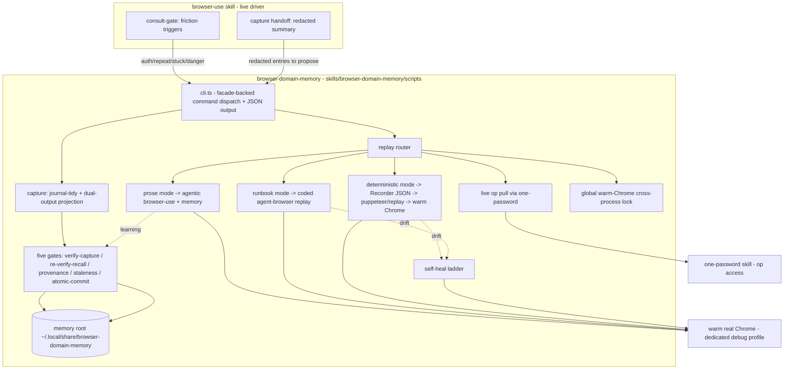
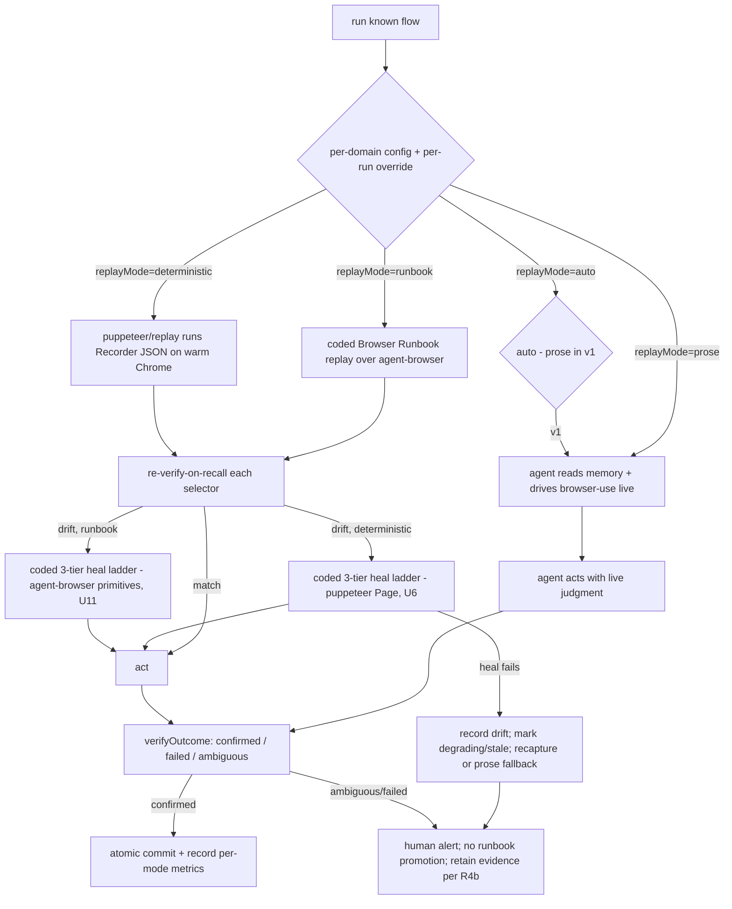

# feat: browser-domain-memory — durable per-domain browser memory with three playback modes

## Summary

Build `browser-domain-memory`: a net-new capability that gives the browser agent durable
per-domain memory. It captures what a real warm-Chrome flow learned (durable selectors, auth
pointers, gotchas, waits, asserts), stores it as Browser Runbooks + Recorder JSON + gotchas, and on
the next run uses one of **three modes the user configures per domain**:
`prose` (agentic, memory-assisted browsing; flexible while the flow is still maturing),
`runbook` (coded agent-browser replay from the Browser Runbook; faster, no LLM call per step), or
`deterministic` (puppeteer replays the Recorder JSON; fastest when mature, with drift routed through
heal/recapture instead of trusted blindly).
Five memory-quality gates keep the store from rotting; live `op` auth keeps the warm profile
hands-free; v1 runs serialise through one global warm-Chrome lock. (see origin:
`skills/browser-use/docs/brainstorms/2026-05-30-browse-play-record-replay-requirements.md`)

---

## Problem Frame

Nathan drives login-heavy enterprise portals where the same flow recurs 52×/year (Oncore /
FastTrack360 timesheets, Xero reconciliation, admin/invoicing). Today each run re-discovers the
login path, form quirks, and traps from scratch. A two-run prototype on a real portal measured the
cost: run 1 (cold) did **22 discovery operations** to locate login fields; run 2 (warm, from
memory) did **0**. The payoff isn't redoing a one-off booking — it's turning a chore you repeat
weekly into a button you press.

The honest lever (corrected by real measurement): the win is **eliminating the agent's
look-and-think loop**, not raw selector speed. A live cold run snapshots + enumerates before each
step and re-snapshots after (~5.4× browser cost), plus an LLM reasoning round per step (seconds
each). Deterministic replay does **zero** reasoning rounds. Small on a trivial page, large on a
multi-step portal flow — so the plan tracks **rounds/snapshots eliminated**, not just wall-clock
(see origin D-metrics; prototype `metrics-real`).

This plan **reverses the prior prose-only landing.** An earlier plan
(`docs/plans/2026-05-30-001-feat-browser-domain-memory-plan.md`) and the shipped skill stub refused
all machinery (no replay engine, no self-healing, no tape). Prototyping this session tested those
risks end-to-end, so v1 now ships the machinery — and, per the user's decision, ships **three playback
modes** so real Run Outcomes can prove which mode earns its keep per flow over time. The canonical
glossary (`CONTEXT.md`) still encodes the reversed worldview and is reconciled by this plan (U13).

---

## Requirements

### Capture and storage

- R1. One rich capture emits a **dual-output contract**: strict Chrome DevTools Recorder JSON
  (deterministic replay) AND an agent run-book (per step: label, ordered selector fallback chain,
  wait-for, post-step assert). Both required. (origin D5)
- R2. Capture is **hybrid-timed**: journal live (order + waits, only knowable live) → tidy at end
  (drop fumbles / superseded retries / no-effect noise, keep the corrected winning selector) →
  commit only on verified. (origin D5; prototype `journal-tidy`)
- R3. Capture records **provenance** for every selector (`by-id` … `by-heal`) and derives a
  confidence score; heals decay confidence. (origin D7; prototype `provenance`)
- R4. Durable memory stores per domain: Auth Pointers, Browser Runbooks, optional Recorder JSON for
  deterministic-ready flows, Gotchas, Scratch Evidence, and Run Outcomes — matching the `CONTEXT.md`
  glossary vocabulary. Never a raw transcript; never a secret value.
- R4b. **Run Outcome always, Scratch Evidence selectively**: every run appends a small shape-only Run
  Outcome. Scratch Evidence is retained only when the run creates learning value (capture, drift,
  failure, ambiguity, user-requested save, or promotion proof). Clean replay with no new learning
  keeps no full scratch/log.
- R4c. **Storage identity**: durable memory is keyed by canonical hostname plus a required human
  alias. Tenant/account identity is not part of the v1 key unless it changes the hostname.
- R4d. **Flow naming**: Browser Flow Slugs are human-readable intent slugs (`submit-timesheet`,
  `download-invoice`) so humans and LLMs can find the right Browser Runbook. Selector drift does not
  rename a flow; changed user intent does.
- R4e. **No automatic git/versioning**: plain files make history/backup possible later, but v1 does
  not initialize git or push memory automatically. Backup/versioning is separate follow-up policy.

### Playback (three modes, configurable)

- R5. Each domain has a **config** selecting `replayMode` (`prose` | `runbook` | `deterministic` |
  `auto`), with a global default, saved-workflow default, and per-run override. **Playback selection
  precedence:** per-run override > saved-workflow default > domain config > global default.
  `browser-domain-memory` requests a playback mode or browser outcome; `browser-use` owns browser
  entry, adapter policy, and adapter selection against the Warm Chrome contract. `driver`/adapter is
  not a user-facing domain config field in v1. **`auto` in v1 is a safe alias for `prose`; it must not
  silently switch to `runbook` or `deterministic`.** Run Outcomes may recommend trying a faster mode,
  but a human or explicit per-run override chooses that mode. The confidence/staleness-driven
  heuristic is deferred, and `describe()` states this so the agent gives an honest answer. v1 ships
  only the fields a v1 code path reads (`alias`, `replayMode`, `authPointerRef`); speculative tuning
  fields are NOT added until a consumer exists (no
  `confidenceFloor`/`stalenessThresholds`/`concurrency` — those live as module constants, per U4/U5).
- R5b. Config is **agent-driven, not just a file**: the CLI front door exposes a `config`
  route (`get` / `set` / `explain`) and SKILL.md prose lets the LLM tell the user how to configure a
  domain — or do it for them through the same route — so no hand-editing of `config.json` is
  required. Agent-native parity: any setting the file holds, the agent can read, explain, and write.
- R6. **Prose mode**: the reasoning agent reads Durable Browser Knowledge (Runbooks, Gotchas, Run
  Outcomes) and drives `browser-use` live. It does not consume Recorder JSON. It still inspects and
  judges the page, but memory reduces rediscovery. Flexible default while a portal flow is still
  maturing.
- R6b. **Runbook mode**: code replays the Browser Runbook step-by-step over agent-browser against the
  warm Chrome — each step's ordered selectors are resolved live, the action runs, and the post-step
  assert is checked. It does not consume Recorder JSON. Resolution + heal is coded, not an LLM call per
  step. Zero added runtime dependency. Fast tool-neutral path once the runbook is refined. (prototype
  `prose-replay/`, renamed to this domain term)
- R7. **Deterministic mode**: `@puppeteer/replay` replays the Recorder JSON against the warm Chrome.
  Fast, zero reasoning rounds. On selector drift it routes through deterministic heal; if heal fails,
  the runbook is marked degrading/stale and recapture or prose fallback is required. (prototypes
  `recorder-json`, `booking-furdo`)
- R8. On selector drift, replay **self-heals** via a three-tier ladder: fallback selector chain →
  text-disambiguation within a generic selector → re-find by the step's label/role metadata. Runbook
  and deterministic modes use coded heal ladders; prose mode uses live agent judgment and captures
  drift as new memory evidence. A selector resolving the *wrong* element is drift too.
  Deterministic heals over a puppeteer `Page` (prototype `self-healing`); runbook heals over
  agent-browser's snapshot/`eval`/text-find primitives
  (prototype `prose-replay/`, which recovered 3 drifted steps incl. one only the label could
  identify). Failed deterministic heal never proceeds blind: record the drift, decay confidence, and
  hand off to recapture or prose fallback. The ladders share the policy, not the driver, enforced by
  mode-agnostic conformance fixtures for fallback chain, text disambiguation, label/role recovery,
  wrong-element rejection, and total failure. (origin D6)

### Memory-quality gates (five, all v1)

- R9. **Verify-on-capture**: a resolved selector must pass its assert (a "submit" target is actually
  a submit; a "password" field is `type=password`) before storage. (origin D7; prototype `capture-verify`)
- R10. **Re-verify-on-recall**: before trusting a recalled selector, cheaply confirm it still
  matches; on failure, re-discover + re-capture. (origin D7; prototype `capture-verify`)
- R10b. **Verified-before-replace**: a healed selector is recorded as drift evidence and confidence
  decay immediately, but it does not replace the stored selector until the run completes and verifies.
- R10c. **Patch vs replace boundary**: recapture patches changed steps when user intent, step order,
  page sequence, and terminal assert stay the same. It replaces the whole Browser Runbook when flow
  shape, terminal assert, auth context, or action semantics change.
- R10d. **Recapture write approval**: same-intent selector repair after confirmed completion may write
  automatically. Structural runbook changes, new steps, auth changes, or destructive/financial/action
  semantic changes require human approval.
- R11. **Provenance + confidence**: low-confidence selectors get re-verified harder; heals decay
  confidence so flaky selectors keep getting re-checked. `TRUST_THRESHOLD` gates the fast path.
  (origin D7; prototype `provenance`)
- R12. **Staleness / invalidation**: a tunable policy scores whole-runbook health from Run Outcome
  history → `healthy | degrading | stale | unscored`, flipping on consecutive failures, rising
  heal-rate, mass drift (redesign), or age. Stale → invalidate + force recapture; unscored keeps cold
  starts visible. (origin D7; prototype `staleness`)
- R12b. **One active runbook**: replacement may keep bounded rollback history or prior-version
  metadata, but active memory points to exactly one current Browser Runbook per flow. No parallel
  active truths; no forever-retained runbook versions in v1.
- R12c. **Stale beats repair**: mark stale instead of patching when there is mass drift, repeated
  failure, a terminal assert no longer proves success, auth/MFA flow changed, or heal/recapture cannot
  prove the same user intent.
- R13. **Atomic commit boundary**: durable memory is written **only** on verified completion via
  write-temp + atomic rename; capture stages in a scratch journal; a crash or failed/ambiguous
  verification discards the scratch, leaving the previous good runbook intact. Invariant: durable
  memory holds a fully-complete verified runbook OR the previous good one — never a partial. (origin
  D7; prototype `crash-safety`)

### Safety and lifecycle

- R14. **Secret safety**: no secret value reaches disk, logs, or any persisted artifact (including
  the replayable Recorder JSON). Two-sided, fail-closed redaction — compose-side shape-only +
  write-side deny-list re-check that refuses the **whole batch** on a hit and names the offending
  entry. **Defence in depth against the deny-list's fail-open gap:** a field-name deny-list alone
  passes unlisted sensitive names (`pin`, `passcode`, `passphrase`, `access_token`, …), so pair it
  with a posture where any field whose VALUE matches a secret shape is redacted regardless of name,
  and extend the shape patterns beyond the prototype's set (add JWT `eyJ…`, base64url `-_`,
  context-sensitive 4-/6-/8-digit PIN/OTP detection, base32 TOTP seeds). Short numeric values are
  refused only when auth field context, auth step context, or secret-source provenance indicates a
  PIN/OTP; benign business data (years, invoice fragments, postal codes, employee IDs, reference
  numbers, amounts) must survive. Artifacts hold only shape placeholders (`redacted:password-field`,
  `shape:6-digit-otp`). (origin Gate 1; prototypes `live-auth`, `build-scratch-handoff`)
- R14b. **Playback artifacts are secret-value-free**: Browser Runbooks, Recorder JSON, temporary
  deterministic runflows, Scratch Evidence, logs, and CLI envelopes may contain login selectors,
  login choreography, Auth Pointer references, and shape placeholders, but never secret values or
  1Password item details. Secret fields resolve live through `one-password`.
- R14c. **Sensitive portal data minimisation**: PII, financial values, client names, invoice details,
  timesheet data, and business-record values are sensitive even when they are not secrets. Store
  shape-only or the minimum necessary value by default; keep Scratch Evidence under a bounded TTL
  unless user-pinned or needed as promotion proof; provide a purge route; never write sensitive portal
  values to logs or Run Outcomes unless explicitly approved.
- R15. **Live `op` auth pull**: the run resolves a secret from 1Password at run time (via the
  `one-password` skill), fills it, drops it; memory stores only the Auth Pointer. Real `op` resolved
  via `op item get --fields label=<field> --reveal` (not the `op://` URL form — spaces break it).
  (origin D8; prototypes `op-auth`, `live-auth`)
- R15b. **Safety-affecting writes are human-approved out of band**: changing Auth Pointer account,
  vault, item, field, OTP field, login context, `replayMode`, saved-workflow default mode, or any
  future driver override requires explicit human approval through chat or a local interactive prompt
  not satisfiable from page content. Prompt-injected pages must not silently redirect auth to a
  different secret source or lower future replay safety. Log approval provenance without secret
  details.
- R15c. **MFA/OTP boundary**: if the Auth Pointer declares an OTP/TOTP field that `one-password` can
  resolve live, fill it at runtime. If MFA requires phone push, manual approval, missing OTP, or an
  undeclared factor, stop with `authenticate` and ask the human. Store only shape/context such as
  `shape:6-digit-otp` and "MFA appears after password"; never store OTP values, TOTP seeds, recovery
  codes, or push approval artifacts.
- R15d. **Auth failures are not runbook rot**: locked/missing 1Password access returns
  `authenticate`; it does not mark the Browser Runbook stale.
- R15e. **Same-domain multi-identity deferred**: v1 uses one shared active Warm Chrome environment.
  Different-domain portals are supported; same-domain multi-account isolation waits for separate Warm
  Chrome environments.
- R16. **Success verification**: after the terminal action, `verifyOutcome` returns
  `confirmed | failed | ambiguous` from a success-signal spec. **Ambiguous is not success** — it
  routes to a human alert. (origin D8; prototype `success-verify`)
- R16b. **Outcome trust boundaries**: `confirmed` requires an explicit success signal, not merely
  absence of errors. A healed run may be `confirmed` while also contributing a degrading health
  signal. `ambiguous` and `failed` may append Run Outcomes and selective Scratch Evidence, but they
  never promote or update a Browser Runbook.
- R17. **Reliable submit**: clicks escalate (native → dispatched pointer → inner target → keyboard);
  each attempt checked against an `expectedEffect`. A click that ran but produced no effect is a
  miss → escalate; total failure returns an honest failure, never a false success. (origin D8;
  prototype `reliable-submit`)
- R18. **Serialise the shared warm Chrome globally in v1**: runs against the single shared warm Chrome
  use a cross-process filesystem lock (atomic lock dir or `flock`) with stale-lock recovery. The
  atomic commit boundary keeps durable writes safe under contention. Per-domain or true parallelism
  waits for browser-target isolation proof. (origin D10; prototype `parallel-spike`)
- R19. **Promote-on-verified**: when a captured flow completes + verifies, the skill **offers** to
  save it as a named, one-click (manual-trigger) workflow and asks whether to set `runbook` or
  `deterministic` as its default mode. Human approves. (origin D3)
- R20. **Run Outcomes track per-mode value metrics** (reasoning rounds/snapshots eliminated, heal
  rate, wall-clock) so the user can assess which mode earns its keep per flow over time. (origin
  success criteria; prototypes `metrics-real`, `metrics-telemetry`, `metrics-effort`)
- R20a. **Success and health are separate axes**: a Run Outcome can be `confirmed` and still count
  as degrading when it needed heals or saw drift. This preserves the early-warning signal without
  pretending the run failed.
- R20b. **Mode recommendations are advisory in v1**: Run Outcomes may say a flow looks ready for
  `runbook` or `deterministic`, but `auto` still resolves to `prose` until the user explicitly changes
  the domain config or supplies a per-run override.
- R20c. **Mode graduation is earned, not assumed**: a flow may move from `prose` to `runbook` after
  one confirmed successful capture with verified selectors/asserts and no unresolved auth ambiguity.
  It may move from `runbook` to `deterministic` only after multiple clean Run Outcomes with low heal
  rate, stable waits/asserts, and no recent degrading/stale signal.
- R20c.1. **Clean Run Outcome**: `confirmed`, no heals, no drift, no auth/MFA ambiguity, stable
  terminal assert, and no new Gotcha-worthy surprise.
- R20d. **Prose learning writes are proposed, not silent**: prose mode may propose Browser Runbook,
  Gotcha, Auth Pointer, or Scratch Evidence updates, but durable memory writes require approval.
  Low-risk shape-only Run Outcome appends may be automatic.
- R20d.1. **Automatic facts, approved steering**: Run Outcome appends, selective Scratch Evidence
  retention, and same-intent selector repair after confirmed completion may write automatically.
  Browser Runbook structural changes, Gotchas, Auth Pointer changes, config/mode changes, saved-workflow
  defaults, and destructive/financial/admin/submit execution need human approval.
- R20e. **Sensitive workflow execution is freshly confirmed**: saved workflows that reach
  destructive, financial, admin, or submit terminal actions require fresh human confirmation before
  the terminal action in v1. Promotion approval is not enough to authorize all future executions.
  Unattended execution is forbidden in v1.

### Consult-gate integration (browser-use side)

- R21. `browser-use` consults `browser-domain-memory` on friction triggers (auth/SSO/MFA/account
  picker; repeat-language; stuck/looping; submit/destructive/financial/admin; explicit
  save/remember/reuse) — not for ordinary browsing. At end of session it hands a redacted summary
  back; the memory skill proposes durable entries for approval. Composability: memory hands back to
  browser-use; it does not call onward. Page-derived text is untrusted evidence: store it as quoted
  data context, strip or neutralize instruction-like directives before persistence, and require human
  approval before page-derived prose becomes Gotchas, Runbook instructions, config, or auth guidance.
  (origin D3, D4)
- R21a. **Action boundary**: `needs_browser_entry` is the code-level action for Browser Entry
  Handoff. Auth failures use `authenticate`. Non-browser local state or durable-memory repair uses
  `repair_state`.
- R21b. **Preflight failure is a hard browser-entry stop**: if Warm Chrome Preflight fails, the run
  returns `needs_browser_entry` and does not act through another adapter or silently fall back to prose.
  Prose fallback after browser-entry failure requires an explicit user choice after the browser-entry
  problem is surfaced.

### Domain-language reconciliation

- R22. `CONTEXT.md` glossary, the stale plan, and the stub skill's `PROVENANCE.md` are reconciled to
  the builder-in-v1 + three-mode reality (the old entries say Browser Runbooks are "not an executable
  click tape" and to avoid "deterministic replay" — now false). Edit the canonical source; do not
  leave parallel contradictory truth.

---

## Key Technical Decisions

- **Skill (prose) + co-located scripts topology.** Ship the prose control plane at
  `skills/browser-domain-memory/SKILL.md` + `references/`, and the TS + CLI + tests under
  `skills/browser-domain-memory/scripts/` (`cli.ts` entry, `lib/*.ts`, co-located `*.test.ts`). This
  matches the repo's MAJORITY convention for skills that ship code: `imessage-reader`, `voice-enrich`,
  and `people-enrich` all keep TS in `skills/<name>/scripts/` — `people-enrich` ships ~166k lines of
  TS there, ~4x `issue-to-pr-v2`, so "app-shaped code" is no reason to leave the skill folder.
  (`issue-to-pr` → `runbooks/issue-to-pr-v2/` is the lone outlier, not the standard.) Wire the new
  tree into root `tsconfig.json` `include` (currently issue-to-pr-v2-only, so `tsc_check` would
  otherwise not see it) and `install.sh`'s symlink list.

- **Memory root = `~/.local/share/browser-domain-memory/`, env-overridable.** XDG durable-data dir
  (community-verified: `~/.local/share` is for irreplaceable portable user data;
  `~/.config` is for settings). NOT `~/.config/context/` — the Memory OS contract reserves that for
  the shared markdown contract surface, not a skill's runtime data. Override via
  `BROWSER_MEMORY_ROOT` so tests point at a temp dir. The root is created `chmod 700` (owner-only) —
  it holds Auth Pointers + a map of which portals are automated (System-Wide Impact).
  (resolves origin "Open for planning"; see Sources)

- **Storage format = git-diffable plain JSON + markdown, not SQLite.** Community-verified: SQLite
  files are binary (not git-diffable) and corrupt under cloud-sync / network FS concurrent access;
  the data volume here is tiny so SQLite's speed advantage is irrelevant. Plain text makes the
  atomic write-temp+rename boundary (R13) trivially correct and keeps runbooks human/LLM-readable
  for the 12-month-longevity goal. (resolves origin "Open for planning"; see Sources)

- **Three playback modes ship in v1; per-domain config chooses.** The adversarial review proved the
  original "puppeteer is out" premise false — every prototype that replayed Recorder JSON drove the
  *warm* Chrome through `@puppeteer/replay`'s `createRunner` (via `browserURL`), and it works. So
  deterministic mode genuinely needs `@puppeteer/replay`, and the dual-output contract is what lets
  deterministic consume the same capture. Prose mode is the flexible default; runbook and
  deterministic are faster opt-ins as a flow matures. `replayMode` is the user-facing knob; driver is
  derived internally. The user assesses value per flow via Run Outcome metrics (R20).

- **Declare BOTH `@puppeteer/replay` AND `puppeteer-core` for deterministic mode.** `@puppeteer/replay`
  is the Recorder JSON parse/validate/emit + the replay runner; its `parse()` enforces semantic rules
  a hand JSON Schema can't express (e.g. click steps require `offsetX/offsetY`; unknown-key rejection)
  and auto-tracks Chrome format drift. But `@puppeteer/replay@4.x` declares `puppeteer` as an
  **optional peer** (`peerDependenciesMeta.puppeteer.optional = true`) — so on a clean install it pulls
  in **no browser-driving code**. The runner needs `puppeteer.connect({ browserURL })` +
  `PuppeteerRunnerExtension`, which come from `puppeteer-core` — imported directly in every replay/heal
  prototype, not a transitive peer. Declaring only `@puppeteer/replay` would break replay on first run.
  So deterministic mode = two declared deps; pin both to a compatible major (`@puppeteer/replay` 4.x
  peers `puppeteer` >=25; `puppeteer-core` 25.x). Per `rules/dependency-and-file-hygiene.md` these are
  the two new deps — justified because deterministic replay is undeliverable without them. **Prose mode,
  runbook mode, and all pure gate logic stay zero-dep** — the new deps load only on the deterministic
  path.

- **Replay engine is an explicit early unit with a connection spike.** The "agent-browser replays
  Recorder JSON" path was never prototyped; the proven path is `@puppeteer/replay` → warm Chrome via
  `browserURL`. U3 spikes the warm-Chrome attach for deterministic replay before the gates depend on
  it, so the architecture rests on evidence not assumption. (adversarial residual risk #1)

- **Warm-Chrome hardening is owned by `browser-use`.** `browser-domain-memory` consumes and verifies
  the existing browser-use contract — real Google Chrome binary, dedicated persistent profile,
  pinned `--cdp "$PORT"` / `browserURL`, no Chrome for Testing fallback, and profile/session
  verification before acting. The executable readiness proof lives at
  `skills/browser-use/scripts/preflight-warm-chrome.sh`; adapters consume that proof rather than
  owning separate readiness checks. Do not restate the full operational policy here; cite
  `skills/browser-use/SKILL.md`, `skills/browser-use/references/warm-chrome.md`, and ADR-0006.

- **Static validation is necessary but not sufficient — the D7 live re-verify gates are the real
  silent-substitution protection.** A schema/`parse()` pass proves the JSON is well-formed; it does
  NOT prove the selectors still resolve on the live site. The documented payment-regression failure
  (a green run clicking the wrong control) is caught by R9/R10/R12 + the heal ladder's
  text/role match-verification, kept orthogonal to mode choice. Do not let format-validation effort
  absorb effort owed to the gates. (adversarial residual risk #2)

- **CLI surface starts with `create-cli`, then lands as a facade CLI.** Invoke the canonical
  `create-cli` skill/tool first for the browser-memory command surface. Let it guide command syntax,
  output, errors, config, interactivity, and the `CommandFacadeContract` skeleton. Then implement the
  generated contract with `@side-quest/cli-command-facade` exactly like `skills/browser-use/scripts/`:
  script-local `package.json`, `command-contract.ts` handed to `defineCommandFacadeContract`,
  TypeScript `cli.ts`, thin `.sh` wrapper, and focused CLI tests. Do not hand-roll a parallel CLI
  grammar, JSON envelope, exit-code map, or `AgentHint` shape. The facade owns command discovery,
  usage rendering, structured errors, diagnostics, and writer mechanics; browser-domain-memory owns
  command semantics. This follows ADR-0007: `create-cli` designs the CLI, the facade enforces it.

- **Config is an agent-native route, not a hand-edited file.** The "number router at the front door"
  (`create-cli`/facade CLI + the skill's consult surface) carries config commands alongside
  `read`/`capture`/`replay`. `config:explain` returns the current per-domain settings + the allowed
  values + what each does as a facade JSON result, so the LLM can tell the user how to configure a domain
  in plain language; `config:set` writes through the same atomic boundary as the runbooks. The user
  never has to open `config.json` — they ask the skill ("set Oncore to deterministic mode") and the
  agent drives it. This is the agent-native-parity principle: every setting reachable by a human is
  reachable by the agent through the same door, and the agent can self-describe its own
  configuration. Safety-affecting writes use out-of-band human approval.

- **Pure gate logic is zero-dep and unit-tested in isolation; live-browser paths are integration.**
  Provenance, staleness, crash-safety/atomic-commit, journal-tidy, success-verify, reliable-submit,
  redaction, and the dual-output projection are deterministic data transforms (the prototypes model
  their stores in-memory for exactly this). Capture, deterministic replay, self-heal, and live `op`
  are the integration surfaces requiring the warm Chrome / real `op`.

---

## High-Level Technical Design

### Component topology



### Self-maintaining lifecycle (the five gates compose into one arc)

```mermaid
stateDiagram-v2
  [*] --> healthy: capture verified, committed
  healthy --> degrading: selector drifts, heal recovers, confidence decays, heal-rate ticks up
  degrading --> healthy: re-verify-on-recall re-captures clean selector
  degrading --> stale: site redesign, heal ladder exhausted, run fails
  stale --> recapturing: staleness invalidates runbook, forces cold recapture
  recapturing --> healthy: fresh selectors verified + committed; history scope reset
```



Healing is per-step and optimistic (keep the run alive); staleness is whole-runbook and skeptical
(catch rot before catastrophic failure). A run can **succeed-but-degrade** — the early-warning
signal. Recapture resets history scope so the rebuilt runbook isn't pinned stale by the dead one's
failures.

### Playback mode routing (per-domain config)



---

## Output Structure

```text
skills/browser-domain-memory/
  SKILL.md                      # prose control plane (rewritten from stub)
  PROVENANCE.md                 # rewritten: builder-in-v1, three-mode
  references/
    capture.md                  # hybrid capture + dual-output contract
    replay-modes.md             # prose vs runbook vs deterministic; per-domain config
    memory-gates.md             # the five gates + lifecycle
    auth.md                     # live op pull + Auth Pointer + leak boundary
    storage-layout.md           # memory root, on-disk shape, config schema
  scripts/
    package.json                 # local dependency/link surface for @side-quest/cli-command-facade
    tsconfig.json                # script-local typecheck incl. facade contract
    browser-domain-memory.sh     # thin bash wrapper, same pattern as browser-use preflight wrapper
    cli.ts                      # facade-backed argv parse + dispatch entry
    cli.test.ts
    command-contract.ts         # CommandFacadeContract emitted from create-cli
    command-contract.test.ts
    README.md                   # finder pointing back to the skill
    lib/
      paths.ts                  # memory root resolution (env-overridable) + on-disk layout
      paths.test.ts
      rich-step.ts              # the internal capture shape both outputs project from
      dual-output.ts            # toRecorderJSON() + toAgentRunbook()
      dual-output.test.ts
      journal.ts                # journal-live -> tidy-at-end
      journal.test.ts
      commit.ts                 # atomic write-temp+rename, confirmed-only promotion
      commit.test.ts
      provenance.ts             # confidence map + heal decay + TRUST_THRESHOLD
      provenance.test.ts
      staleness.ts              # scoreRunbook(history) -> healthy/degrading/stale/unscored
      staleness.test.ts
      verify.ts                 # verify-on-capture + re-verify-on-recall predicates
      verify.test.ts
      redaction.ts              # two-sided fail-closed deny-list, whole-batch refuse
      redaction.test.ts
      success-verify.ts         # verifyOutcome confirmed/failed/ambiguous
      success-verify.test.ts
      reliable-submit.ts        # click escalation + expectedEffect
      reliable-submit.test.ts
      config.ts                 # alias, replayMode (auto->prose v1), authPointerRef
      config.test.ts
      outcomes.ts               # Run Outcome record + per-mode value metrics
      outcomes.test.ts
      lock.ts                   # global warm-Chrome cross-process lock
      lock.test.ts
      replay-deterministic.ts   # @puppeteer/replay + puppeteer-core runner vs warm Chrome (U3, integration)
      replay-runbook.ts         # Browser Runbook -> coded agent-browser replay (U11, integration)
      replay-prose.ts           # prose-mode memory-assisted browser-use handoff (U10/U12 prose)
      heal.ts                   # three-tier ladder, deterministic/puppeteer-Page only (U6, integration)
      auth.ts                   # live op pull via one-password (U12, integration)
```

Two new declared deps in root `package.json`: `@puppeteer/replay` for Recorder validation/replay +
`puppeteer-core` for the deterministic browser runner. `skills/browser-domain-memory/scripts/package.json`
owns the local `@side-quest/cli-command-facade` dependency exactly as `skills/browser-use/scripts/`
does, so the implementation does not import through `skills/create-cli/scripts/node_modules`. Root
`tsconfig.json` `include` extends to the new `skills/browser-domain-memory/scripts/` tree (U1); the
script-local `tsconfig.json` typechecks the facade contract directly.

---

## Implementation Units

### Sequencing rule

First vertical slice: U0 + U0a + U0b + U0c + U1 + U1a. This yields a TypeScript facade CLI with
`read`, `status`, and `config:*` over the real memory root/config, before capture, replay, auth, or
promotion land. Later units extend that CLI; they do not replace it.

### U0. Prototype source prerequisite

- Goal: Make prototype-lift instructions executable before implementation starts.
- Requirements: source integrity for U2–U12
- Dependencies: none
- Files: `prototypes/browser-use-uplift/` or a documented external artifact path; update Sources if
  the artifacts live outside this repo.
- Approach: restore `prototypes/browser-use-uplift/` and `prototypes/build-scratch-handoff/` into the
  repo, or record a concrete immutable artifact path with enough contents for the named units to lift
  code instead of re-deriving behavior. Implementation must stop if neither source exists. Do not
  infer prototype behavior from plan prose when the cited source is missing.
- Test scenarios:
  - Source present: every prototype path named in Sources resolves.
  - Source absent: preflight fails before U2 starts, naming the missing prototype path.
- Verification: `rg --files prototypes/browser-use-uplift prototypes/build-scratch-handoff` lists
  the cited prototype files, or Sources names the external artifact location.

### U0a. Browser-use Warm Chrome preflight + adapter routing

- Goal: Ship the executable browser readiness proof and capability-routed adapter policy before replay
  code depends on them.
- Requirements: Warm-Chrome trust boundary, R21a
- Dependencies: U0
- Files: `skills/browser-use/scripts/preflight-warm-chrome.{sh,ts}`,
  `skills/browser-use/scripts/command-contract.ts`,
  `skills/browser-use/scripts/preflight-warm-chrome.test.ts`, `skills/browser-use/SKILL.md`,
  `skills/browser-use/references/warm-chrome.md`, `skills/browser-use/PROVENANCE.md`.
- Approach: add `preflight-warm-chrome.sh` as the single `browser-use` readiness proof. It accepts the
  candidate endpoint/profile inputs, verifies the Warm Chrome contract, and emits a machine-readable
  result consumed by Browser Adapters and browser-domain-memory replay paths. `check` is read-only;
  `repair` owns safe profile permission and `DevToolsActivePort` writes; `launch` starts real Google
  Chrome only when needed. It never launches Chrome for Testing, never chooses a
  browser-domain-memory playback mode, and never selects the adapter. Update `browser-use` prose so
  adapter selection is capability-routed: DevTools MCP for Network/Performance/DevTools-grade
  inspection; `agent-browser` for refs, snapshots, webm, durable selector capture, and Runbook mode;
  `puppeteer-core` via `connect` for Deterministic mode; prose browsing uses the first verified
  adapter that satisfies the requested browser outcome.
- Test scenarios:
  - Happy path: verified Warm Chrome endpoint returns success with endpoint/profile facts.
  - Edge: missing, wrong, or unattached endpoint returns `needs_browser_entry`.
  - Edge: Chrome for Testing, throwaway profile, or non-loopback endpoint fails loud.
  - Edge: profile dir is not owner-only and repair is safe → chmod to `0700`; unsafe repair fails loud.
  - Edge: failed preflight does not fall back to another adapter or prose mode.
  - Boundary: locked 1Password, MFA, or portal login failure is not a browser-entry failure.
- Verification: U3 and U11 call the preflight before acting; no replay path owns separate browser
  readiness policy; browser-use docs no longer imply a fixed default adapter. Focused preflight
  suite holds 108 public CLI tests across command contract, check, repair, launch, status,
  observability, usage failures, and edge recovery.

### U0b. `create-cli` command-surface pass

- Goal: Let `create-cli` shape the command surface before implementation modules harden around it.
- Requirements: R5b, R21, CLI design path
- Dependencies: U0
- Files: no durable contract file yet; update this plan only if `create-cli` exposes a route the plan
  forgot.
- Approach: invoke `create-cli` against the browser-domain-memory command surface before authoring
  `command-contract.ts`. Inputs: first vertical slice (`read`, `status`, `config:get`,
  `config:explain`, `config:set`), later extensions (`capture`, replay, promotion), JSON envelopes,
  safety-confirmation behavior, and config precedence. Treat the generated `CommandFacadeContract`
  skeleton as the U1a/U9 implementation guide. Do not commit a parallel markdown CLI spec as canonical
  truth; the TypeScript command contract becomes the deterministic contract.
- Test scenarios:
  - `create-cli` output names command tree, output modes, exit codes, config/env precedence, and
    safety-confirmation behavior.
  - Generated skeleton maps to `@side-quest/cli-command-facade` fields without bespoke grammar.
  - First vertical slice routes are separable from later capture/replay routes.
- Verification: U1a can implement the generated skeleton without inventing a second CLI design.

### U0c. Dependency and private-link readiness

- Goal: Confirm approved dependency/link posture before code depends on unavailable packages.
- Requirements: deterministic replay deps, facade CLI deps
- Dependencies: U0b
- Files: `package.json`, `skills/browser-domain-memory/scripts/package.json`, lockfile if present.
- Approach: record approval and install path for `@puppeteer/replay`, `puppeteer-core`, and
  `@side-quest/cli-command-facade`. The replay deps are root runtime dependencies, loaded only on the
  deterministic path. The facade package is script-local under
  `skills/browser-domain-memory/scripts/`, matching `skills/browser-use/scripts/`; fail clearly when
  the private link/package is missing. Do not import through `skills/create-cli/scripts/node_modules`.
- Test scenarios:
  - Facade package resolves from `skills/browser-domain-memory/scripts/`.
  - Missing facade package produces a clear setup failure, not a TypeScript mystery error.
  - Replay deps are present before U2/U3 parse/replay code imports them.
  - Bun + Node compatibility is checked for `@puppeteer/replay` and `puppeteer-core`.
- Verification: script-local typecheck can import the facade package; root install can import replay
  deps on the deterministic path.

### U1. Memory root, on-disk layout, and per-domain config

- Goal: Establish where durable memory lives and the config that selects replay mode.
- Requirements: R4, R4c, R4d, R4e, R5
- Dependencies: U0, U0b, U0c
- Files: `skills/browser-domain-memory/scripts/lib/paths.ts` (+ `.test.ts`),
  `skills/browser-domain-memory/scripts/lib/config.ts` (+ `.test.ts`),
  `skills/browser-domain-memory/references/storage-layout.md`; extend root `tsconfig.json`
  `include` to cover `skills/browser-domain-memory/scripts/**/*.ts` (do this in U1, the first code
  unit, or `tsc_check` is blind to the new tree from U1 onward).
- Approach: `paths.ts` resolves the memory root from `BROWSER_MEMORY_ROOT` env, defaulting to
  `~/.local/share/browser-domain-memory/`. Domain directory name is the canonical hostname; each
  domain config carries the required human alias. Layout:
  `<root>/<hostname>/recorder-<flow-slug>.json` (strict Chrome Recorder JSON),
  `<root>/<hostname>/runbook-<flow-slug>.md` (Browser Runbook),
  `<root>/<hostname>/runbook-<flow-slug>.runs.jsonl` (Run Outcomes, per glossary),
  `<root>/<hostname>/scratch/<YYYY-MM-DD-HHMMSS-flow-slug>/` (Scratch Evidence, created selectively
  only when retained), `<root>/<hostname>/config.json`. `config.ts` defines the per-domain config
  shape — only the fields a v1 path reads: `alias`, `replayMode: prose|runbook|deterministic|auto`
  (where `auto` resolves to `prose` in v1 and never silently promotes itself), and `authPointerRef`.
  `driver` is derived internally from `replayMode`, not stored as user-facing v1 config. No
  speculative `confidenceFloor`/`stalenessThresholds`/`concurrency` fields (YAGNI — provenance and
  staleness keep their thresholds as module constants per U4/U5; add config fields only when a
  consumer exists). Global default + domain config + saved-workflow default + per-run override merge
  with precedence per R5. Missing `alias` blocks write paths (`needs_config`); read/status may display
  the hostname as a temporary fallback. Expose a `describe()` that returns each field's current value,
  allowed values, and a one-line meaning (including that `auto`→`prose` in v1 and faster-mode
  suggestions are advisory) — the self-description the agent surfaces via `config:explain`
  (R5b) so the LLM tells the user how to configure a domain without anyone opening the file.
- Patterns to follow: hand-rolled config defaulting; no schema library.
- Test scenarios:
  - Happy path: unset env → root resolves to `~/.local/share/browser-domain-memory/`; set env →
    resolves to the override (temp dir).
  - Edge: missing `config.json` → returns the global default config; partial config → unspecified
    fields fall back to defaults without throwing.
  - Edge: per-run override merges over saved-workflow default, per-domain config, then global default
    (precedence order asserted).
  - Error: invalid `replayMode` value → validation error naming the field and allowed values.
  - Error: capture/promote/config write with missing or empty alias → `needs_config`; read/status may
    show hostname fallback.
  - describe(): returns every field with current value + allowed values + meaning (the agent-native
    self-description backing `config:explain`).
  - Path shape: domain + slug → expected recorder / runbook / runs / scratch paths (asserts the
    layout contract).
  - Domain identity: canonical hostname directory + required human alias in config; same-domain
    account/tenant does not change key unless hostname changes.
  - Flow slug: human-readable intent slug; selector-only drift does not rename the flow.
  - Scratch path is addressable but not created for a clean replay with no learning trigger.
  - Perms: a freshly created memory root is `0700` (owner-only).
- Verification: `paths` and `config` modules resolve and merge correctly under temp-dir env; layout
  paths match the documented contract; alias-gated writes fail loud; the root is owner-only.

### U1a. First vertical CLI slice

- Goal: Land the TypeScript facade CLI shell early with useful config/read/status routes.
- Requirements: R5b, R21 first CLI surface
- Dependencies: U0b, U0c, U1
- Files: `skills/browser-domain-memory/scripts/package.json`,
  `skills/browser-domain-memory/scripts/tsconfig.json`,
  `skills/browser-domain-memory/scripts/browser-domain-memory.sh`,
  `skills/browser-domain-memory/scripts/command-contract.ts` (+ `.test.ts`),
  `skills/browser-domain-memory/scripts/cli.ts` (+ `cli.test.ts`),
  `skills/browser-domain-memory/scripts/README.md`
- Approach: implement the `create-cli` guided contract for `read`, `status`, `config:get`,
  `config:explain`, and `config:set`. Mirror `skills/browser-use/scripts/`: exported
  `runBrowserDomainMemoryCli(argv, { runtime, stdout, stderr })`, injectable runtime for tests,
  facade JSON writers, diagnostic flags via the facade package, and a thin shell wrapper that execs
  Bun against `cli.ts`. `read` returns graceful empty or stored context; `status` reports root/config
  health; `config:*` reads/explains/writes only the U1 config fields. Capture/replay/auth routes are
  not implemented in this slice.
- Patterns to follow: `skills/browser-use/scripts/package.json`,
  `skills/browser-use/scripts/command-contract.ts`, `skills/browser-use/scripts/preflight-warm-chrome.ts`,
  `skills/browser-use/scripts/preflight-warm-chrome.sh`, `skills/create-cli/SKILL.md`.
- Test scenarios:
  - command contract: `defineCommandFacadeContract` accepts the emitted contract.
  - shell wrapper: `browser-domain-memory.sh` is a thin pass-through to Bun + `cli.ts`.
  - testability: injected runtime/stdout/stderr tests do not touch real browser state or durable user
    memory.
  - `read` against empty memory returns graceful empty JSON.
  - `status` reports memory root/config health without writing.
  - `config:explain <domain>` returns current values + allowed values + meanings.
  - `config:set <domain> replayMode runbook` writes only after out-of-band human confirmation.
- Verification: first vertical CLI slice works end to end with temp-dir `BROWSER_MEMORY_ROOT` and
  does not expose capture/replay as implemented before their units land.

### U2. Rich-step capture shape + dual-output projection

- Goal: Define the internal capture model and project it into both durable outputs.
- Requirements: R1
- Dependencies: U0c, U1
- Files: `skills/browser-domain-memory/scripts/lib/rich-step.ts`,
  `skills/browser-domain-memory/scripts/lib/dual-output.ts` (+ `.test.ts`),
  `skills/browser-domain-memory/references/capture.md`; requires the U0c `@puppeteer/replay` install
  path for `parse()` validation
- Approach: `RichStep { action, url?, label, selectors[] (ordered: id→name→aria→text), waitFor?,
  assert?, provenance, offsetXY? }` is the single source both outputs project from (lift from
  prototype `runbook-dual/build-runbook.ts`). `toRecorderJSON(flow)` emits a strict Chrome Recorder
  `UserFlow` (click steps carry `offsetX/offsetY`; values are shape-only); `toAgentRunbook(flow)`
  emits markdown (per step: label, ordered selectors-to-try, wait-for, assert-after). Validate the
  Recorder JSON via `@puppeteer/replay`'s `parse()`.
- Technical design (directional): the projection is pure; I/O is the caller's job (mirror
  `build-scratch-handoff/build-scratch.ts` purity).
- Patterns to follow: prototype `runbook-dual/build-runbook.ts`, `recorder-json/build-recorder.ts`.
- Test scenarios:
  - Covers AE-capture. Happy path: a 3-step flow (navigate → change → click) projects to a Recorder
    JSON that `parse()` accepts AND a run-book with all three steps, ordered selectors, waits,
    asserts.
  - Edge: a click step missing `offsetX/offsetY` → `parse()` rejects (asserts we surface the real
    Recorder rule, not a silent-invalid emit).
  - Edge: an order-dependent step (a "Next" that only appears after a prior selection) preserves
    order in both outputs.
  - Edge: a step value is a secret shape (`redacted:password-field`) → appears shape-only in BOTH
    the Recorder JSON and the run-book.
  - Edge: login/auth step needing a real secret → login selectors/choreography are projected, and
    the secret field is an Auth Pointer reference + shape placeholder only; no secret value or
    1Password item detail is stored.
  - Edge: multi-selector fallback chain (id + aria + text) → all carried into the Recorder
    `Selector[]` and the run-book's selectors-to-try.
- Verification: both artifacts generate from one `RichStep[]`; Recorder JSON passes `parse()`;
  strict Recorder JSON writes to the recorder artifact; run-book contains every step with its
  metadata in the separate Browser Runbook artifact.

### U3. Deterministic replay engine + warm-Chrome attach spike

- Goal: Prove and build deterministic replay of Recorder JSON against the warm logged-in Chrome.
- Requirements: R7
- Dependencies: U0a, U0c, U2
- Files: `skills/browser-domain-memory/scripts/lib/replay-deterministic.ts`,
  `skills/browser-domain-memory/references/replay-modes.md`; requires the U0c `puppeteer-core`
  install path (see KTD — `puppeteer` is an optional peer of
  `@puppeteer/replay`, so the runner has no browser driver without `puppeteer-core` declared
  directly). (tsconfig `include` already extended in U1.)
- Approach: spike first — connect `@puppeteer/replay`'s `createRunner` to the warm Chrome via
  `browserURL: http://127.0.0.1:<port>` (the dedicated debug profile from ADR-0006), replay a
  captured `UserFlow`, confirm it drives the real logged-in session (lift from prototypes
  `recorder-json/replay.ts`, `booking-furdo/cold-replay-booking.ts`). Then wrap as the deterministic
  replay path returning a step-by-step result stream the heal ladder (U6) and outcome verifier (U7)
  consume.
- Execution note: start with the warm-Chrome attach spike — this is the load-bearing assumption the
  adversarial review flagged as untested; prove it before the gates depend on it.
- Patterns to follow: prototypes `recorder-json/replay.ts`, `booking-furdo/cold-replay-booking.ts`;
  ADR-0006 warm-Chrome recipe; `skills/browser-use/references/warm-chrome.md`.
- Test scenarios:
  - Integration happy path: a stored `UserFlow` replays against the warm Chrome and reaches the
    terminal step (stop before any irreversible action, per prototype safety).
  - Integration edge: Warm Chrome missing, wrong, or unattached → honest
    `AgentHint.action=needs_browser_entry`, never a silent Chrome-for-Testing fallback
    (ADR-0006 fail-loud requirement). Auth failures still use `authenticate`.
  - Edge: a `_note`/non-schema field present → stripped before `parse()` so replay doesn't reject.
  - Test expectation: live replay paths are integration-tagged; pure JSON shaping is covered in U2.
- Verification: deterministic replay drives the warm session end-to-end on a real captured flow;
  failure to attach is loud, not silent.

### U4. Provenance + confidence

- Goal: Score selector trustworthiness from how it was found; decay on heals.
- Requirements: R3, R11
- Dependencies: U1
- Files: `skills/browser-domain-memory/scripts/lib/provenance.ts` (+ `.test.ts`),
  `skills/browser-domain-memory/references/memory-gates.md` (shared with U5, U7)
- Approach: lift prototype `provenance/provenance.ts` verbatim in spirit — `Provenance` union
  (`by-id` 0.95 … `by-heal` 0.30), `confidenceFor(s) = base − priorHeals × HEAL_DECAY_PER_PRIOR`,
  `decisionFor(s)` → `TRUST | RE-VERIFY` against `TRUST_THRESHOLD = 0.7`.
- Patterns to follow: prototype `provenance/provenance.ts` (zero-dep, tunable constants at top).
- Test scenarios:
  - Happy path: `by-id` selector → confidence 0.95 → `TRUST` (skips re-verify fast path).
  - Edge: `by-text-fuzzy` (0.40) → below threshold → `RE-VERIFY`.
  - Edge: `by-id` with 3 prior heals → 0.95 − 0.30 = 0.65 → drops below threshold → `RE-VERIFY`
    (heals decay trust).
  - Edge: confidence floored at 0 (many heals never goes negative).
- Verification: confidence + decision match the prototype's proven table across the provenance
  spectrum.

### U5. Staleness / invalidation policy

- Goal: Score whole-runbook health from Run Outcome history.
- Requirements: R12
- Dependencies: U1
- Files: `skills/browser-domain-memory/scripts/lib/staleness.ts` (+ `.test.ts`),
  `skills/browser-domain-memory/scripts/lib/outcomes.ts` (+ `.test.ts`)
- Approach: lift prototype `staleness/staleness.ts` — `scoreRunbook(history)` → `healthy |
  degrading | stale | unscored` with precedence `stale > degrading > healthy` and tunable thresholds
  (`CONSECUTIVE_FAILURES_STALE`, `REDESIGN_FAIL_FRACTION`, `HEAL_RATE_DEGRADING/STALE`,
  `RECENT_WINDOW`, `STALE_AFTER_DAYS_NO_CLEAN`). **Cold-start:** a runbook with too little history to
  score returns an explicit `unscored` verdict (NOT a false `healthy`) so the gap is visible and
  `auto` correctly stays on `prose` until history accrues. `outcomes.ts` defines the `RunOutcome` record
  (`date, result, totalSteps, stepsHealed, minConfidence, driftedSelectors`) + per-mode value
  metrics (R20: reasoning-rounds/snapshots eliminated, wall-clock) and the `.runs.jsonl`
  append/read. **Metric producer:** the replay paths (U3 deterministic / U11 runbook / U10 prose
  handoff) emit the per-run counts (rounds + snapshots actually spent); `outcomes.ts` computes
  "eliminated" against the cold-baseline cost model from prototype `metrics-real` (don't store a
  number nobody computed — honest framing per the Problem Frame).
- Patterns to follow: prototype `staleness/staleness.ts`, `lifecycle/` integration contract.
- Test scenarios:
  - Happy path: clean history → `healthy`.
  - Edge: one failed run drifting ≥80% selectors → `stale` (redesign signal).
  - Edge: 2 consecutive failures from newest end → `stale`.
  - Edge: rising heal-rate ≥ degrading threshold over recent window → `degrading`.
  - Edge: no fully-clean success in 30 days → `degrading` (age guard).
  - Cold-start: a runbook with too little history → `unscored` (not a false `healthy`); `auto` stays
    on `prose` while unscored.
  - Advisory mode recommendation: enough clean history may recommend `runbook` or `deterministic`,
    but `auto` still resolves to `prose` until explicit config/override changes it.
  - Precedence: a history hitting both degrading and stale signals → `stale` wins.
  - Outcomes: appending a Run Outcome with per-mode metrics round-trips through `.runs.jsonl`;
    recapture resets the scored history scope.
  - Metric compute: given a replay path's spent rounds/snapshots + the cold-baseline cost model,
    `outcomes.ts` computes the eliminated count (no fabricated standalone number).
- Verification: each of the four signals fires at its threshold; precedence holds; outcomes persist.

### U6. Self-heal ladder (deterministic mode)

- Goal: Recover drifted selectors live without an LLM call, on the deterministic (puppeteer) path.
- Requirements: R8 (deterministic-mode half)
- Dependencies: U2, U3, U4
- Files: `skills/browser-domain-memory/scripts/lib/heal.ts`,
  `skills/browser-domain-memory/references/replay-modes.md` (shared)
- Approach: lift prototype `self-healing/heal-replay.ts` — `findWithHealing(page, step)` walks tier
  1 (fallback chain) → tier 2 (text-disambiguation within a generic selector using the step's text
  hint) → tier 3 (re-find by label/role metadata). A selector resolving the *wrong* element is
  drift → verify the match by text/role, not just "something resolved." On heal, tick the step's
  `priorHeals` (feeds U4 decay) and record the drifted selector (feeds U5). **Scope note:** the
  prototype operates on a puppeteer `Page`/`ElementHandle`, so this unit heals the **deterministic
  path only**. Runbook-mode healing (the agent-browser path) has no `Page` object and is a distinct
  concern owned by U11. Both adapters must satisfy the shared heal policy conformance fixtures from
  R8, so wrong-element detection and fallback semantics cannot drift by mode. Prose mode keeps the
  agent in the loop; drift becomes live judgment plus capture evidence, not a coded heal ladder.
  **Failure path:** if deterministic heal exhausts all
  tiers, stop the replay, record a Run Outcome with drift evidence, decay confidence, and return
  `repair_state` so the caller recaptures or reruns in prose. Never continue a deterministic run after
  an unhealed step.
- Patterns to follow: prototype `self-healing/heal-replay.ts`.
- Test scenarios:
  - Integration happy path: primary selector valid → resolves at tier 1, no heal recorded.
  - Integration edge: primary dead, fallback alive → tier 1 chain recovers; heal recorded, provenance
    → `by-heal`.
  - Integration edge: selector matches many elements → tier 2 disambiguates by text hint.
  - Integration edge: all selectors dead → tier 3 re-finds by label/role.
  - Integration edge: selector resolves the WRONG element (right tag, wrong text) → treated as drift,
    not a match (the match-verification requirement).
  - Edge: total failure (no tier recovers) → honest `repair_state` surfaced, Run Outcome records drift,
    run does not proceed blind.
  - Conformance: deterministic adapter passes the shared heal-policy fixtures also used by U11.
- Verification: each tier recovers its scenario on a real page with the primary selector deliberately
  broken; wrong-element matches are rejected.

### U7. Verification gates + reliable submit + success verify

- Goal: Gate capture/recall correctness, click reliability, and terminal-outcome truth.
- Requirements: R9, R10, R16, R16b, R17
- Dependencies: U2, U4
- Files: `skills/browser-domain-memory/scripts/lib/verify.ts` (+ `.test.ts`),
  `skills/browser-domain-memory/scripts/lib/reliable-submit.ts` (+ `.test.ts`),
  `skills/browser-domain-memory/scripts/lib/success-verify.ts` (+ `.test.ts`),
  `skills/browser-domain-memory/references/memory-gates.md` (shared)
- Approach: lift prototypes `capture-verify/verify.ts` (Gate 1 capture-time assert predicate per
  target shape; Gate 2 recall-time cheap re-resolve), `reliable-submit/reliable-submit.ts`
  (four-tier escalation + `expectedEffect`, effect is the unit of success), `success-verify/
  success-verify.ts` (failure-signals-first, then success signals, else `ambiguous`; ambiguous →
  human alert / `needs-human`, never recorded success).
- Patterns to follow: the three named prototypes (all zero-dep, in-memory DOM fixtures).
- Test scenarios:
  - verify Gate 1: a "submit" target resolving to a username input → rejected at capture (the proven
    confident-wrong bug).
  - verify Gate 1: a "password" target → must be `type=password` to store.
  - verify Gate 2: a stored selector that no longer matches → triggers re-discover + re-capture.
  - reliable-submit: native click produces the expected effect → tier 1, ok.
  - reliable-submit: native click no effect, dispatched pointer works → escalates to tier 2.
  - reliable-submit: all four tiers fail → `ok:false`, honest failure (never false success).
  - success-verify: explicit error text present alongside success-looking text → `failed` (failure
    outranks).
  - success-verify: no success and no failure signal → `ambiguous` → routes to human.
  - success-verify: form-cleared but spinner present → not success (negative guard).
  - outcome boundary: absence of error with no explicit success signal → `ambiguous`, not `confirmed`.
- Verification: each gate fires on its fixture; ambiguous never records as success; all-tier click
  failure is honest.

### U8. Hybrid capture (journal → tidy) + atomic commit boundary + redaction + recall→recapture loop

- Goal: Capture live, tidy at end, redact, commit durably only on verified (never a partial), and
  own the re-verify-on-recall failure branch (re-discover + re-capture).
- Requirements: R2, R10 (recapture branch), R10b, R10c, R10d, R12b, R12c, R13, R14
- Dependencies: U1, U2, U4, U7
- Files: `skills/browser-domain-memory/scripts/lib/journal.ts` (+ `.test.ts`),
  `skills/browser-domain-memory/scripts/lib/commit.ts` (+ `.test.ts`),
  `skills/browser-domain-memory/scripts/lib/redaction.ts` (+ `.test.ts`),
  `skills/browser-domain-memory/references/capture.md` (shared)
- Approach: lift prototypes `journal-tidy/journal-tidy.ts` (append live; tidy drops
  `fumble`/`retry-superseded`/`no-effect`, last clean attempt per `action::target` wins, re-sort by
  seq), `crash-safety/crash-safety.ts` (build runbook fully in scratch; promote by swapping the
  durable reference via write-temp + atomic rename; promote ONLY on `confirmed`; invariant check:
  durable holds complete+contiguous+non-empty OR the previous good one), and
  `build-scratch-handoff/redaction.ts` (two detectors — field-name patterns + value-shape patterns;
  first hit refuses the WHOLE batch and names it; do not over-redact benign free-text). **Close the
  deny-list fail-open gap (R14):** value-shape detection redacts on shape regardless of whether the
  field name was listed, and the shape set is extended past the prototype's (bearer/long-hex/base64) to
  add JWT `eyJ…`, base64url (`-_` alphabet), context-sensitive 4-/6-/8-digit PIN/OTP detection, and
  base32 TOTP seed. Short numeric refusal requires auth field context, auth step context, or
  secret-source provenance; benign enterprise numbers survive. Verify-on-capture (U7) runs before a
  step is journaled as a keeper. **Ordering invariant:** the write-side
  deny-list re-check runs BEFORE any temp file is written, so a leaked secret never touches disk even
  transiently. **Recall→recapture branch (R10):** when U7's Gate-2 re-verify fails on recall, U8 owns
  the response — invalidate the drifted selector and run a fresh capture cycle (journal → verify →
  tidy → commit) for the corrected selector, writing back self-correcting only after verified
  completion. Same-intent selector repairs may patch automatically; structural flow changes require
  human approval and replace the whole runbook. Active memory has one current runbook; prior versions
  are rollback metadata, not parallel truth. **Scratch cleanup is active:** on crash/abandon the scratch directory is removed (not just left unpromoted), and capture
  start sweeps any stale scratch dirs — orphaned scratch otherwise accumulates the portal's
  URLs/selectors/field-names indefinitely (System-Wide Impact). **Selective retention (R4b/R14c):**
  clean replay writes only the Run Outcome; Scratch Evidence is kept for capture, drift/heal, failed
  or ambiguous outcome, explicit user save, or promotion proof, under the bounded sensitive-portal
  retention policy.
- Execution note: write the redaction whole-batch-reject test and the crash-mid-overwrite
  invariant test red first — these are the highest-risk units (leak prevention + no-partial
  guarantee). Mirrors the issue-to-pr runbook-heal closure discipline (guard the heal, test-first).
- Patterns to follow: prototypes `journal-tidy/`, `crash-safety/`, `build-scratch-handoff/redaction.ts`.
- Test scenarios:
  - journal: a noisy run (fumble + superseded retry + no-effect scroll) tidies to the clean winning
    path with the corrected selector.
  - journal: order-dependent run preserves step order after tidy.
  - journal: unverified run (`outcome != confirmed`) → tidied runbook discarded, not promoted.
  - commit: complete + confirmed → durable holds the full verified runbook.
  - clean replay: no drift, no failure, no new learning → appends Run Outcome only; no Scratch
    Evidence directory is retained.
  - learning trigger: drift/heal, failure, ambiguity, capture, explicit save, or promotion proof →
    retained redacted Scratch Evidence linked from the Run Outcome.
  - commit: crash mid-flow → durable unchanged (no partial).
  - commit: completed-but-unverified → durable unchanged.
  - commit: `ambiguous` terminal outcome → scratch journal discarded, durable runbook unchanged, and
    redacted Scratch Evidence retained only when ambiguity creates learning value (the named
    invariant, meeting U7's ambiguous→human-alert half).
  - commit: crash mid-overwrite → previous known-good runbook byte-for-byte intact.
  - recall→recapture (R10): Gate-2 re-verify fails on a recalled selector → invalidate + fresh capture
    cycle writes back the corrected selector; durable holds the re-captured runbook (the full loop,
    not just the failing predicate).
  - healed selector mid-run → recorded as drift/confidence evidence, but not stored until confirmed
    completion.
  - same-intent selector repair + confirmed completion → patches the changed step automatically.
  - structural change (step order/page sequence/terminal assert/auth/action semantics) → requires
    approval and replaces the whole Browser Runbook.
  - replacement keeps prior-version metadata but exposes exactly one active runbook.
  - stale trigger: mass drift/repeated failures/invalid terminal assert/auth-MFA change/intent
    uncertainty → stale, not patch.
  - commit: clean overwrite → atomic swap, invariant holds (complete ∧ contiguous ∧ non-empty).
  - redaction: a `password`/`token`/`otp` field name → whole batch refused, offending entry named.
  - redaction: a value matching a bearer/long-hex/base64/6-digit-otp shape → whole batch refused.
  - redaction (fail-open guard): an UNLISTED field name (`pin`, `passcode`, `access_token`) carrying a
    secret-shaped value → still redacted on shape, not passed.
  - redaction (extended shapes): a JWT `eyJ…`, a base64url token, an auth-context 4-/6-/8-digit
    PIN/OTP, a base32 TOTP seed → each detected and the batch refused.
  - redaction: benign free-text (email shape, plain label) and benign business numbers (year,
    invoice fragment, postal code, employee ID, amount, reference number) → survive verbatim (no
    over-redaction).
  - retention: retained Scratch Evidence gets a TTL unless user-pinned or promotion proof; purge route
    removes retained sensitive portal data.
  - redaction: a secret shape in the Recorder JSON value slot → caught (covers the replayable-artifact
    leak surface).
  - redaction × commit ordering: a write-side deny-list hit → NO temp file containing the secret is
    ever created or left on disk (the check precedes write-temp).
  - scratch cleanup: a crashed/abandoned run → its scratch directory is removed; a stale scratch dir
    from a prior crash → swept at next capture start (no unbounded accumulation).
- Verification: no partial ever persists; no secret value reaches any artifact; tidy keeps the
  winning path; promotion only on confirmed.

### U9. Global lock + capture-capable facade expansion

- Goal: Serialise shared warm-Chrome access and extend the U1a CLI with capture/write behavior.
- Requirements: R18, R21 (CLI surface), R14, R13
- Dependencies: U1a, U2–U8
- Files: `skills/browser-domain-memory/scripts/lib/lock.ts` (+ `.test.ts`),
  `skills/browser-domain-memory/scripts/command-contract.ts` (+ `.test.ts`),
  `skills/browser-domain-memory/scripts/cli.ts` (+ `cli.test.ts`)
- Approach: `lock.ts` lifts `parallel-spike/` but implements a global cross-process warm-Chrome lock
  for v1 (atomic lock dir or `flock`) with stale-lock recovery. Same-domain and different-domain runs
  both queue until browser-target isolation exists. Extend the U1a facade contract with `capture`
  once U8's redaction, journal, and atomic commit behavior exist. `capture` writes through the same
  facade JSON/error path as `read/status/config:*`; it never bypasses the write-side deny-list or
  atomic commit boundary. Commands declare honest `sideEffects` (`read`, `write`, `auth`, `browser`),
  `interactivity`, output modes, env vars, result contracts, and structured errors with
  `AgentHint.action` (`authenticate`, `needs_browser_entry`, `repair_state`, `change_input`).
  `needs_browser_entry` is the code-level action for a Browser Entry Handoff; auth failures use
  `authenticate`; non-browser state repair uses `repair_state`. Safety-affecting config and saved
  workflow default writes remain gated by out-of-band human confirmation.
- Patterns to follow: prototypes `parallel-spike/`; `skills/create-cli/SKILL.md`;
  `skills/create-cli/references/cli-command-facade.md`; `skills/browser-use/scripts/package.json`;
  `skills/browser-use/scripts/command-contract.ts`; `skills/browser-use/scripts/preflight-warm-chrome.ts`;
  `skills/browser-use/scripts/preflight-warm-chrome.sh`; ADR-0007.
- Test scenarios:
  - lock: two same-domain CLI processes → second queues until first releases (no interleave).
  - lock: two different-domain CLI processes → second queues in v1 (global warm-Chrome lock).
  - lock: a run that throws → lock released (no deadlock); stale lock recovery works.
  - command contract: `defineCommandFacadeContract` accepts the extended contract; reserved diagnostic
    flags are not redeclared; enum flags name allowed values.
  - cli: `capture` of a rejected (deny-list) batch → exit 1 validation, `change_input` hint.
  - cli: `capture` success writes via journal → redaction → atomic commit; no direct file write path.
  - cli: capture failure releases the global lock.
  - cli: failed Warm Chrome preflight returns `needs_browser_entry`; it does not switch adapters.
- Verification: warm-Chrome runs serialise across CLI processes; capture emits correct facade
  JSON/errors/actions; safety-affecting writes are human-gated.

### U11. Runbook-mode coded replay (lift the proven prototype)

- Goal: Ship coded Browser Runbook replay over agent-browser. **The spike is already done** —
  prototype `prototypes/browser-use-uplift/prose-replay/` proved end-to-end coded re-drive on a real
  multi-step warm-Chrome flow (2026-05-31). Rename the domain concept to Runbook mode while keeping
  the prototype as source evidence.
- Requirements: R6b, R8 (runbook-mode half)
- Dependencies: U0a, U2, U5, U7, U8
- Files: `skills/browser-domain-memory/scripts/lib/replay-runbook.ts`,
  `skills/browser-domain-memory/references/replay-modes.md` (shared)
- Approach: lift `prose-replay/prose-replay.ts` into `replay-runbook.ts` — parse the Browser Runbook,
  then for each step resolve ordered selectors live over agent-browser, act, check the post-step
  assert. The per-step return shape becomes `RunbookStepResult` (resolved selector + `how` + assert +
  drift + ops) and feeds `outcomes.ts` (U5). If the runbook references an Auth Pointer before U12
  lands, Runbook mode stops with `authenticate`; after U12 lands, it calls the auth prefix for the
  secret field and still does not read or store secret values itself.
- **Runbook-heal decision resolved.** agent-browser has no puppeteer `Page`, so U6's ladder can't run
  as-is, but the prototype proved a coded 3-tier heal adapter over agent-browser's
  snapshot/`eval`/text-find primitives works: selector chain → text match → re-find by label/assert
  hint. It recovered 3 drifted steps including one where every stored selector was dead and only the
  label identified the target. No LLM per step. The adapter must pass the same heal-policy
  conformance fixtures as U6.
- **Warm-session preflight is load-bearing.** The prototype's first run silently drove Chrome for
  Testing and falsely reported success; the fix (pin every agent-browser command with `--cdp <port>`
  and verify `get cdp-url`) lives in `browser-use` and MUST be a hard preflight gate before Runbook
  mode trusts the session — fail loud, never fall back to CFT. (browser-use owns this contract.)
- Patterns to follow: prototype `prose-replay/prose-replay.ts` (coded re-drive + heal), renamed at
  implementation to Runbook mode.
- Test scenarios:
  - Integration happy path: a stored Browser Runbook re-drives via agent-browser to the terminal step.
  - Integration edge: a step's primary selector drifts → coded heal ladder recovers (chain → text →
    re-find by label), per-step `RunbookStepResult.drift.healed` set.
  - Integration edge: every tier misses → honest failure, routes to re-verify/recapture (U8), never
    proceeds blind.
  - Preflight: agent-browser not pinned to the warm port → loud failure, no CFT fallback, no replay.
  - Conformance: runbook adapter passes the shared heal-policy fixtures also used by U6.
- Verification: Runbook mode works end-to-end on a real flow with a coded heal ladder; the
  warm-session preflight refuses any non-warm session.

### U12. Live op auth pull + Auth Pointer + skill rewrites

- Goal: Self-login via 1Password at run time with no leak; rewrite the skill control plane.
- Requirements: R14b, R15, R15b, R15c, R15d, R15e, plus R6/R6b/R7 auth-prefix wiring
- Dependencies: U8, U9
- Files: `skills/browser-domain-memory/scripts/lib/auth.ts`,
  `skills/browser-domain-memory/references/auth.md`,
  `skills/browser-domain-memory/SKILL.md` (rewritten), `skills/browser-domain-memory/PROVENANCE.md`
  (rewritten); confirm `install.sh`'s skill symlinking covers `skills/browser-domain-memory/scripts/`
  (it symlinks skill dirs) — the code now ships inside the `skills/browser-domain-memory/` tree, so it
  rides the existing per-skill symlink; adjust if `scripts/` is excluded.
- Approach: `auth.ts` lifts prototypes `live-auth/live-auth.ts` + `op-auth/` — resolve the Auth
  Pointer's secret via the `one-password` skill (`op item get --fields label=<field> --reveal`, NOT
  the `op://` URL form), fill, drop. If the Auth Pointer declares an OTP/TOTP field, resolve and fill
  it through the same live path; otherwise MFA is a human `authenticate` stop. **Secret transport
  contract:** secret values never appear in argv or structured logs. Fill uses stdin or direct
  CDP/runtime injection only, with tests that inspect process args and tool logs during the fill.
  **Leak-check the full surface:** every artifact, console buffer, temporary deterministic runflows /
  Recorder-derived artifacts, agent-browser/tool logs, process args, AND `op`'s own stderr (route it
  away from any logged error field). Memory and playback artifacts may hold login selectors/choreography,
  Auth Pointer references, and shape placeholders, never secret values or 1Password item details.
  **Compose the two half-proofs:** `op-auth` proved the real `op` shape in
  isolation and `live-auth` mocked the fill+leak pipeline — U12 joins them, so the real `op` value
  flows through the real fill → leak-check path for the first time. SKILL.md + PROVENANCE.md rewritten
  to the three-mode reality, including prose that tells the LLM how to explain + change config
  conversationally (R5b) and how the consult-gate handoff works.
- Execution note: real `op` was only prototyped with a mock for `live-auth`; `op-auth` proved the real
  shape standalone — they were never composed. This is the first real-`op`-in-flow integration; keep
  the leak-check a hard test and budget for surprises (multi-line output, trailing newline,
  field-not-found stderr, biometric re-prompt).
- Patterns to follow: prototypes `live-auth/`, `op-auth/`; `skills/one-password/SKILL.md` (op safety
  contract — browser-domain-memory owns the `op://` mapping, one-password owns access).
- Test scenarios:
  - auth (integration): resolve a real secret via `op`, fill, drop → leak-check finds the value in NO
    artifact, temp deterministic runflow, Recorder JSON, log, console buffer, agent-browser argv/log,
    OR `op` stderr.
  - auth transport: fill path uses stdin or direct CDP/runtime injection; process args and tool logs
    never contain the secret during execution.
  - auth: `op://` URL form with spaces in vault/item → not used; `--fields label=` form used.
  - auth: secret missing/locked → honest `authenticate` hint, no crash, no partial capture; `op`
    stderr does not reach a logged field.
  - auth: OTP/TOTP field declared in Auth Pointer → resolved live through `one-password`, filled,
    dropped, leak-check clean.
  - auth: phone push/manual approval/missing OTP/undeclared MFA factor → `authenticate` stop, no stale
    runbook mark.
  - auth: Auth Pointer source change → requires out-of-band human approval before config write.
  - auth: same-domain second account requested → v1 refuses / asks for separate profile-context
    follow-up, never reuses the same cookie jar silently.
  - auth (composition): the real `op` value flows through the real fill → leak-check path (not the
    mock) and leaks nowhere.
- Verification: robot self-logs-in with zero manual entry and zero leak across the joined real-op +
  fill + capture pipeline; SKILL.md/PROVENANCE.md tell the three-mode story.

### U10. Promote-to-workflow + consult-gate handoff

- Goal: One-click workflow promotion and the browser-use handshake.
- Requirements: R19, R20, R20b, R20c, R20d, R20e, R21
- Dependencies: U1–U9, U11, U12
- Files: `skills/browser-use/SKILL.md` (add consult-gate + capture-handoff prose),
  `skills/browser-domain-memory/SKILL.md` + `references/replay-modes.md` (promotion + saved-workflow
  surface; consumes `outcomes.ts` metrics — does not modify it, that module is owned by U5).
- Approach: define the saved-workflow representation (a named entry referencing a verified runbook +
  its default `replayMode`) and the one-click manual trigger (a CLI `replay --workflow <name>` /
  skill invocation). Playback selection follows R5 precedence: per-run override > saved-workflow
  default > domain config > global default. On verified success, the skill offers promotion and asks
  whether to default the workflow to `runbook` or `deterministic` (R19), using out-of-band human
  confirmation because mode defaults are safety-affecting. Graduation follows R20c: deterministic is
  offered only after clean runbook history, not immediately after first capture. Saved workflows carry
  risk metadata; destructive, financial, admin, or submit terminal actions require fresh human
  confirmation before the terminal action in v1, and unattended execution is refused. Author the
  consult-gate friction triggers + capture-handoff passover prose on the `browser-use` side (currently
  only drafted in the stub) and the propose-entries return on the memory side. Page-derived text is
  treated as untrusted evidence before it can become Gotchas, Runbook instructions, config, or auth
  guidance.
- Patterns to follow: origin D3/D4; `skills/browser-use/SKILL.md` Driver Mode section as the
  integration seam.
- Test scenarios:
  - Covers AE-promote. promotion: a verified flow → skill offers a named workflow + asks default
    mode; declining leaves no workflow; accepting writes the named entry with the chosen mode.
  - one-click: `replay --workflow <name>` resolves the saved runbook + its default mode and runs it.
  - precedence: per-run override beats saved-workflow default; saved-workflow default beats domain
    config; domain config beats global default.
  - authorization: destructive/financial/admin/submit workflow pauses for fresh human confirmation
    before terminal action; unattended execution fails in v1.
  - value metrics: after N runs, the per-mode metrics (rounds/snapshots eliminated, heal rate,
    wall-clock) are queryable so the user can compare prose vs runbook vs deterministic for that flow.
  - prose learning: prose mode proposes memory updates for approval; only low-risk shape-only Run
    Outcome appends are automatic.
  - prompt-injection boundary: page-derived instruction-like text is stored only as quoted evidence or
    neutralized before persistence; promotion to durable guidance requires human approval.
  - Test expectation (consult-gate prose): none — prose edits; verify by re-reading both SKILL.md
    files for internal consistency, and YAML-parse the frontmatter per the skill-authoring rule.
- Verification: promotion offer fires only on verified success; one-click re-runs a saved workflow;
  both skills tell one consistent three-mode story.

### U13. Glossary + stale-artifact reconciliation

- Goal: Reconcile the canonical domain language to the builder-in-v1 + three-mode reality.
- Requirements: R22
- Dependencies: U2 (the dual-output worldview must be stable; no code dependency on later units)
- Files: `CONTEXT.md` (rewrite browser glossary entries),
  `skills/browser-domain-memory/PROVENANCE.md` (correct the prose-only assertion); delete the stale
  stub assets superseded by the rewrites; mark
  `docs/plans/2026-05-30-001-feat-browser-domain-memory-plan.md` `status: superseded` pointing here.
- Approach: rewrite `CONTEXT.md` entries (Browser Runbook, Compound browser knowledge, Machine Play
  Candidate) so they no longer say "not an executable click tape" / "avoid deterministic replay" —
  they now describe three-mode playback. Correct the stub `PROVENANCE.md`'s "prose-only v1" line.
  Retire the stale plan. Pure-docs unit — can land as soon as U2 fixes the worldview, independent of
  the promotion/consult-gate prose. Run `grill-with-docs` after to sharpen terms (optional follow-up).
- Patterns to follow: `CONTEXT.md` glossary format + the domain-expert Q&A style.
- Test scenarios:
  - Test expectation: none — prose/doc edits. Verify by re-reading `CONTEXT.md` for internal
    consistency with the three-mode reality; confirm the stale plan is marked superseded and the stub
    contradictions are removed.
- Verification: glossary tells one consistent three-mode story; stale plan marked superseded; stub
  contradictions removed.

---

## Scope Boundaries

### In scope (v1)

- The `browser-domain-memory` skill (prose control plane) + `skills/browser-domain-memory/scripts/` code:
  capture → durable memory → three playback modes → heal, the five memory-quality gates, live `op` auth,
  global warm-Chrome serialisation, promote-to-workflow, and the browser-use consult-gate handoff.
- Three playback modes (`prose` + `runbook` + `deterministic`) selectable via `replayMode` with
  saved-workflow default and per-run override; `driver` is derived internally. `@puppeteer/replay` +
  `puppeteer-core` are the two declared dependencies (deterministic path only; prose + runbook + gate
  logic stay zero-dep).
- Glossary + stale-artifact reconciliation (U13).

### Deferred for later (proven, named — not vague)

- **Unattended auto-scheduling** (run the timesheet every Friday). The safety gates (reliable-submit,
  live-auth, success-verify) are built in v1, but unattended *trust* needs them wired live +
  hardened. Ships after manual one-click is solid. (origin Scope; live `op` itself is v1.)
- **True concurrent / parallel runs** — v1 serialises the shared active Warm Chrome globally; real
  parallelism (per-run BrowserContext isolation or N Chrome instances) is a future spike, blocked
  today by `vercel-labs/agent-browser#1068`. (origin D10; prototype `parallel-spike`)
- **`auto` replay-mode heuristic** — `auto` resolves to `prose` in v1 (defined, not undefined) and
  never silently jumps modes. The confidence/staleness-driven heuristic that would pick
  runbook-or-deterministic-when-healthy is advisory only in v1; automatic switching is the follow-up.
  Deferred because the heuristic needs Run Outcome history that a fresh/recaptured runbook lacks (the
  cold-start window has nothing to score), so a tuned `auto` is premature until history accrues.
- **`grill-with-docs` terminology pass** on the rewritten glossary (optional sharpening after U13).

### Deferred to Follow-Up Work (plan-local sequencing / adjacent)

- **Backup posture for the memory root.** Community research confirmed: a git remote is *sync, not
  backup* — a bad write or `rm -rf` propagates. The durable-data fear ("lose 12 months of runbooks")
  is a backup-policy concern, NOT something this skill owns. Recommended follow-up: a standalone
  `restic → Backblaze B2 (Object Lock / immutable)` policy over `~/.local/share/` scheduled via
  launchd, plus Time Machine as the local copy, plus a one-line restore runbook. Git-versioning the
  runbooks gives history + a portable offsite mirror; restic+B2+ObjectLock gives the real
  can't-lose-it guarantee. Before relying on long-lived real portal memory, either accept the
  local-only risk explicitly or run the backup follow-up. Documented here so it isn't forgotten; not
  an implementation unit. (see Sources)

### Outside this product's identity (conscious refusals — from origin)

- No raw-transcript memory. Durable knowledge is curated; Scratch Evidence is redacted.
- No network-layer capture.
- No predicate-selection schema (pick-row-by-data stays a live `browser-use` task).
- No mid-flow re-auth engineering. Auth is a prefix; a mid-flow auth wall → stop.
- No same-domain multi-identity isolation. One warm Chrome = one cookie jar; fine for different-domain
  portals.

---

## System-Wide Impact

This feature persists per-domain browser knowledge and drives logged-in financial portals, so it
crosses a few cross-cutting concerns the units must honor:

- **Filesystem permissions.** Both the memory root (`~/.local/share/browser-domain-memory/`) and the
  dedicated warm-Chrome `--user-data-dir` hold sensitive material — Auth Pointers + a map of which
  portals are automated, and live portal session cookies respectively. A pre-flight must ensure both
  are `chmod 700` (owner-only); any local process that can read them gets a vault-structure map or
  authenticated sessions. (Owned operationally; U1 sets memory-root perms, ADR-0006 path for the
  profile.)
- **Warm-Chrome trust boundary.** `browser-use` owns the warm-Chrome contract and hardening. This
  plan consumes it: verify real Google Chrome, dedicated persistent profile, pinned CDP/browserURL,
  no Chrome for Testing fallback, and connected profile/session before replay. The shared executable
  proof is `skills/browser-use/scripts/preflight-warm-chrome.sh`. See `skills/browser-use/SKILL.md`,
  `skills/browser-use/references/warm-chrome.md`, and ADR-0006.
- **Scratch cleanup is explicit, not implicit.** "Discard the scratch on crash/failure" (R13) means
  the scratch directory is actively removed, not merely left unpromoted — orphaned scratch dirs
  accumulate the portal's URLs/selectors/field-names indefinitely otherwise. U8 owns active cleanup
  (delete on abandon + sweep stale scratch at next capture start). Scratch retention is selective:
  clean replay keeps only a Run Outcome, not a full scratch packet. Retained Scratch Evidence follows
  the R14c sensitive portal data policy: minimised values by default, TTL-bounded unless pinned or
  promotion proof, and purgeable.
- **Cold-start gate window.** Staleness (R12) scores from Run Outcome history, which a brand-new or
  just-recaptured runbook lacks. During that window the skeptical whole-runbook guard cannot fire —
  only per-step healing + provenance confidence protect the run. U5 must define an explicit
  `unscored` state (not a false `healthy`) so the gap is visible, and `auto`→`prose` (R5) keeps the
  cold-start safe by defaulting to the LLM-judgment mode until history accrues. Even after history
  accrues, v1 recommendations stay advisory; no silent mode jump.
- **Honest value axes for the three modes.** The rounds/snapshots-eliminated metric (R20) mostly
  belongs to runbook and deterministic modes; prose keeps the LLM in the loop but reduces discovery as
  memory improves. So R20 must NOT be read as "which mode is better"; prose's value is flexibility,
  runbook's value is fast tool-neutral replay, deterministic's value is maximum speed when mature.
  U10's value surfacing should label the axes, not imply deterministic always wins.

---

## Risks & Dependencies

- **Fast replay paths carry assumptions; each gets a spike-first unit.** (a) Deterministic:
  `@puppeteer/replay` drives the warm Chrome via `browserURL` (proven in prototypes), but never via
  agent-browser — U3 spikes the attach. (b) Runbook mode: the agent-browser coded re-drive proved out
  in prototype but still needs lift-and-wire hardening in U11. Prose remains the flexible fallback if
  either fast path is not ready for a domain. (adversarial residual risk #1; doc-review feasibility)
- **Static JSON validation is not silent-substitution protection.** A `parse()`-valid Recorder JSON
  can still click the wrong control on a drifted page (documented payment-regression failure mode).
  The D7 gates (verify-on-capture, re-verify-on-recall, heal match-verification, staleness) are the
  real defense and must not be deprioritised in favour of format-validation polish. (adversarial
  residual risk #2)
- **First real `op` integration risk.** Only `op-auth` exercised real `op`; `live-auth` mocked it.
  The leak-check is a hard gate; the `--fields label=<field> --reveal` form (not `op://`) is
  load-bearing. Depends on the `one-password` skill owning access.
- **New runtime dependencies (two).** `@puppeteer/replay` + `puppeteer-core` are the first non-trivial runtime
  deps. Both required for deterministic mode: `puppeteer` is an optional peer of `@puppeteer/replay`,
  so the runner has no browser driver without `puppeteer-core` declared directly (verified against the
  installed package). Pin both to a compatible major. If approval is not explicit in the current
  implementation session, stop and ask before editing package files. Verify Bun's node-compat covers
  `@puppeteer/replay`'s `engines.node >=22.12` and the puppeteer-core CDP connection works under Bun.
  Root `tsconfig.json` `include` extended in U1.
- **Facade dependency/link.** The CLI contract imports `@side-quest/cli-command-facade` from
  `skills/browser-domain-memory/scripts/`. Because that package is currently private / machine-local,
  U9 must add a script-local `package.json` + link/dependency like `skills/browser-use/scripts/`
  (with `skills/create-cli/scripts/` as the package-link precedent) and fail clearly when the facade is
  unavailable. This is the implementation path owned by `create-cli`/ADR-0007, not a third runtime
  dependency for browser replay.
- **Engine dependency.** Requires the warm real-Chrome recipe (ADR-0006): real Chrome binary +
  classic `--remote-debugging-port` + dedicated persistent `--user-data-dir`. Pre-flight must
  fail-loud if it only got Chrome for Testing.
- **Domain-language drift is live until U13 lands.** `CONTEXT.md`, the stale plan, and the stub
  PROVENANCE currently contradict this plan's worldview; U13 reconciles all three in one pass.

---

## Sources & Research

- Origin requirements: `skills/browser-use/docs/brainstorms/2026-05-30-browse-play-record-replay-requirements.md`
  (D1–D10, scope, success criteria).
- Engine decision: `docs/adr/0006-warm-chrome-via-dedicated-debug-profile.md`.
- Warm-Chrome findings: `skills/browser-use/docs/research/2026-05-30-browser-use-warm-chrome-findings.md`.
- Tape-format prior art (Recorder JSON limits — no variable syntax; selector fallback array; silent-
  substitution warning): `skills/browser-use/docs/research/2026-05-30-tape-format-record-replay-browser-automation.md`.
- Validated prototype logic (lift, don't re-derive), all under `prototypes/browser-use-uplift/`:
  `recorder-json/`, `booking-furdo/`, `runbook-dual/`, `self-healing/`, `consult-gate/`,
  `capture-verify/`, `staleness/`, `provenance/`, `reliable-submit/`, `live-auth/`,
  `success-verify/`, `op-auth/`, `lifecycle/`, `journal-tidy/`, `crash-safety/`, `parallel-spike/`,
  `metrics-real/`, `metrics-telemetry/`, `metrics-effort/`; plus `prototypes/build-scratch-handoff/`
  (redaction + dual-gate builder).
- CLI design + implementation path: `skills/create-cli/SKILL.md`,
  `skills/create-cli/references/cli-command-facade.md`, and ADR-0007
  (`create-cli` stays verbatim-upstream; facade contract emission is the additive implementation
  path).
- Repo code-shipping precedent: `runbooks/issue-to-pr-v2/` (co-located `*.test.ts` and CLI tests);
  `skills/issue-to-pr/` prose control plane.
- Secret-handling contract: `skills/one-password/SKILL.md`,
  `docs/plans/2026-05-24-001-feat-one-password-capability-plan.md` (shape-only proof; `op` field-by-
  label; browser-domain-memory owns the mapping, one-password owns access).
- Self-heal discipline (guard-the-heal, test-first): `docs/plans/2026-05-24-005-feat-issue-to-pr-
  runbook-heal-closure-plan.md`.
- Storage location + format + backup (community research this session, all primary-source verified):
  XDG Base Directory Spec (`~/.local/share` for durable data) — specifications.freedesktop.org/basedir;
  "sync is not backup" + a single git remote is a mirror — backblaze.com/blog/cloud-backup-vs-cloud-sync;
  git wire format is an open standard portable across hosts — git-scm.com/docs/gitprotocol-pack;
  restic + Backblaze B2 Object Lock for immutable offsite backup —
  github.com/cansurmeli/restic-macos, backblaze.com Object Lock; SQLite corrupts under
  cloud-sync/network-FS concurrent access and is not git-diffable — sqlite.org/howtocorrupt.html.
