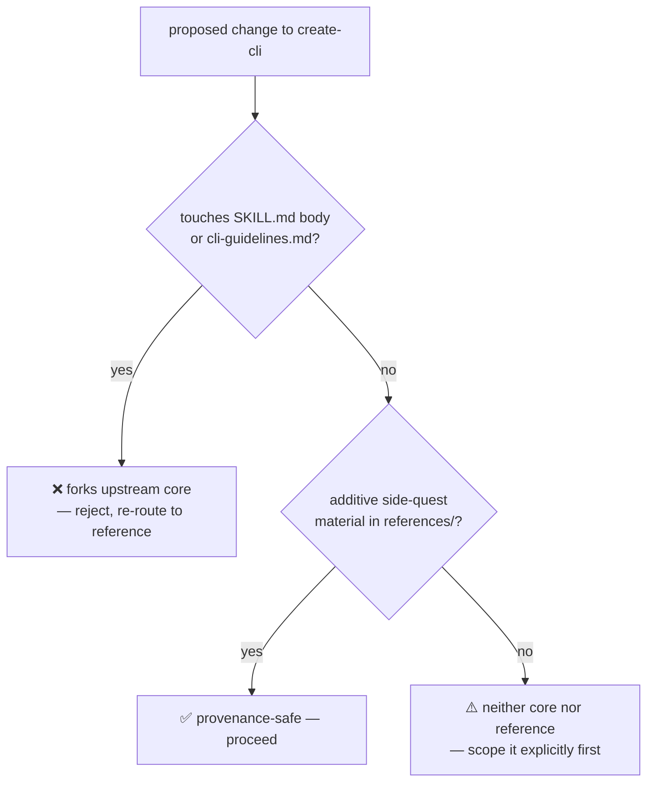

# feat: Facade-aware create-cli — emit a CommandFacadeContract skeleton

## Summary

Close the hand-translation gap between the `create-cli` skill (design front-end)
and `@side-quest/cli-command-facade` (enforcement runtime). Today create-cli
emits a markdown CLI spec and a human hand-translates it into a typed
`CommandFacadeContract`. This slice makes the skill's *deliverable* a ready-to-drop
contract skeleton + `defineCommandFacadeContract` wire-up, so design → contract →
enforcement is one continuous flow.

The slice is **skill-side only** (this repo, `claude-code-config`). The facade
foundation it consumes — `parse`/`defineCommandFacadeContract`, the three contract
fields (`outputModes`/`interactivity`/`envVars`), and the 2-adapter proof — is
already merged on `side-quest-engineering` main (PR #59, squash `1737a7ae`). No
runtime code changes here; the facade is a finished, consumed dependency.

The work lands as **additive side-quest material** under the provenance constraint:
the verbatim-upstream SKILL.md body and `references/cli-guidelines.md` are not
touched. The contract skeleton lives in the facade reference, never replacing the
upstream "CLI spec skeleton" template.

---

## Problem Frame

`create-cli` and `cli-command-facade` are two halves of one pipeline that meet at
one type: `CommandFacadeContract`. The brainstorm (see origin) established the
mental model — **"nothing merges"**: the skill is author-time *prompt*; the facade
is runtime *code*. The skill's job is to (a) produce the spec as a contract object
and (b) show generated code how to consume the package.

**Today:** the two halves are joined by hand. create-cli emits markdown; a human
hand-translates it into a `CommandFacadeContract`. There's a manual translation gap
where the markdown spec and the typed contract can silently diverge.

**Goal:** create-cli's deliverable is the contract object + the few wire-up lines
that hand it to the facade. `defineCommandFacadeContract` then validates the
contract at construction (GAP A, already shipped), so a subtly-broken spec can't
ship silently. Design → Contract → Enforcement, one flow.

**What this is NOT:** GAP B (a verify-behavior-out helper that asserts a running
command matches its authored contract) is an explicit follow-on, not this slice
(see origin, "First slice" §4). Contract → spec (generating the human doc from a
contract) is deferred — one-way for v1.

---

## Requirements

- **R1.** create-cli's facade reference *provides* a ready-to-drop
  `CommandFacadeContract` skeleton as the recommended implementation deliverable,
  reachable via the existing "Do This First" pointer — *without* changing what the
  verbatim-upstream body instructs the model to emit. (origin: "Goal" + "Framing")
  **Bounded by R6 (acknowledged tension):** the body still tells the model to emit a
  markdown spec, and the body is frozen. So this slice makes the contract deliverable
  *available and canonical in the reference*, not the body's default output. Making
  the contract the body's *primary emitted artifact* requires an upstream-fork
  decision — out of scope here (see Deferred: "SKILL.md body emits the contract").
- **R2.** The skeleton is paired with the `defineCommandFacadeContract` wire-up so
  the emitted artifact is drop-in and self-validating at construction. (origin:
  GAP A resolution)
- **R3.** The three shipped fields (`outputModes`/`interactivity`/`envVars`) appear
  in the emitted skeleton where the design calls for them — declare, don't enforce.
- **R4.** Dual-mode: the same deliverable serves human-assisted authoring AND an
  autonomous agent building its own tools. No skill fork. (origin: "Dual-mode")
- **R5.** The autonomous path carries the high-stakes-fork guard: a
  `sideEffects: 'destructive' | 'auth'` classification is a stop-and-ask design
  decision even mid-autonomous-build. (origin: "The carried guard")
- **R6.** PROVENANCE constraint preserved: SKILL.md body + `cli-guidelines.md` stay
  verbatim-upstream and diffable. Facade-awareness is additive side-quest material
  only.
- **R7.** The emitted skeleton stays honest about coverage — it must not advertise
  validator coverage the real drift checker doesn't provide (e.g. `--json` is
  deliberately NOT reserved). (origin: "Caveat resolved")

**Success criteria:** A user (or agent) running create-cli on a CLI design gets, as
output, a contract object they can paste into a `scripts/command-contract.ts` and
have it type-check + validate against the linked facade with zero hand-translation.
The upstream core remains byte-diffable against steipete/agent-scripts.

---

## Key Technical Decisions

- **KTD1 — Skill-side only; facade untouched.** All changes land in
  `skills/create-cli/` in this repo. The facade package is a consumed dependency
  whose needed surface already shipped. Rationale: honors "nothing merges"; the
  runtime stays code, the skill stays prompt. (origin: GAP A "lives in the toolkit,
  not the skill" — that work is done; this slice is the cross-repo *third caller*.)

- **KTD2 — The contract skeleton extends the existing facade reference; it does NOT
  touch the upstream "CLI spec skeleton" template.** SKILL.md lines 54-84 are a
  verbatim-upstream markdown skeleton. The typed-contract skeleton is a *parallel,
  additive* artifact in `references/cli-command-facade.md`, which already carries a
  "Wire-up (copy, adjust names)" block that IS a contract skeleton. We strengthen
  that block into the canonical emit-this target, rather than forking the body.
  Rationale: provenance constraint (R6) forbids editing the verbatim core; the
  reference is the sanctioned side-quest surface.

- **KTD3 — One canonical reference, not a new file.** Keep the contract skeleton in
  `references/cli-command-facade.md` (extend the existing Wire-up section) rather
  than adding a second `references/` deliverable file. Rationale: no-parallel-policy
  — one canonical owner of the concept→field→skeleton mapping. A second file would
  need to stay aligned with the first and the field-list, multiplying drift surface.
  (Alternative considered below.)

- **KTD4 — Declare, don't enforce, stays the framing for the 3 fields.** The
  emitted skeleton shows `outputModes`/`interactivity`/`envVars` as capability
  declarations; the reference prose already says the facade validates the
  declaration's *shape*, not the runtime behavior. Rationale: matches the facade's
  KTD4 and the explorer reconcile shipped this session (`8128ba5`). Over-claiming
  here would re-introduce the dishonesty that reconcile removed.

- **KTD5 — The autonomous high-stakes guard is documented as prose in the
  reference, keyed on `sideEffects`.** Not a code mechanism (there's no runtime in
  this slice). The reference tells an autonomous author: default-through low-stakes
  scaffolding, but pause for a human when the design classifies a command
  `sideEffects: destructive | auth`. Rationale: R5; the facade's `sideEffects` enum
  is the natural signal, and build-time guard placement is the brainstorm's
  resolution.

---

## Scope Boundaries

### In scope

- Strengthening `references/cli-command-facade.md` so its skeleton is the canonical
  "emit this" deliverable, including the three shipped fields and the
  `define()`-validates-at-construction framing.
- A short addition making the dual-mode + high-stakes-guard guidance explicit in
  the reference (R4, R5).
- Verifying the emitted skeleton type-checks + validates against the linked package
  via the existing `scripts/` npm-link playground. **This verification is gated on
  the machine-local link** — see the v1 portability boundary in Deferred.
- PROVENANCE.md update noting the reference now carries the canonical emit target
  (provenance status already describes the reference; this keeps it accurate).

### Deferred to Follow-Up Work

- **GAP B — verify-behavior-out helper.** A testing-subpath assertion an agent runs
  against captured CLI output to prove a running command matches its contract.
  Explicit follow-on (origin §4). Lands in the facade package, not the skill.
- **Off-machine / portable contract validation (v1 portability boundary).** U1's
  live-validation guard (typecheck + `define()`-throws) requires the machine-local
  npm link to the *private* `@side-quest/cli-command-facade`. So validation runs
  where the link exists (this machine, this session's `ce-work`) but NOT on a fresh
  agent, CI, a teammate, or — pointedly — the autonomous Mode-2 agent building a tool
  on another machine. **v1 boundary:** the skill *emits* a portable contract skeleton
  (R4 holds — the shape is tool-neutral text); *live validation of that skeleton* is
  link-gated and not portable. Closing it needs the package published or vendored so
  it's a real resolvable dependency, not a local link. Deferred — do not let v1 block
  on publishing, and do not claim the autonomous path self-validates off-machine.
- **Contract → spec (round-trip).** Generating the human markdown doc *from* an
  existing contract, for docs/discovery. Deferred unless a need proves it (origin:
  "One-way for v1").
- **Config/env precedence as a contract field.** Still prose-only, tracked upstream
  (side-quest-engineering #60). The skeleton keeps precedence as prose.
- **Making SKILL.md body itself emit the contract (the upstream fork).** Forbidden by
  provenance — the body stays verbatim. The body's default instruction is "emit a
  markdown spec"; the contract-emission lives in the reference behind the one pointer.
  The fork would rewrite the body to emit a contract *by default* — the only thing a
  loud pointer can't do (the "10%" = reliability under autonomy). **Deferred + open,
  with a watchable trigger:** revisit the fork (via an ADR) IF autonomous agents are
  *observed* skipping the pointer and emitting markdown specs instead of contracts.
  Until that's observed, a sharpened pointer + the facade's catch-and-correct loop
  covers it — the 5-angle prototype (see Sources) showed agent emission is robust, so
  the fork is currently unjustified. **Decision recorded durably in
  `docs/adr/0007-create-cli-stays-verbatim-upstream-not-forked.md`** (rationale,
  alternatives, and the watchable trigger).

### Outside this product's identity

- create-cli does not become a code generator that writes the whole command. It
  emits the *contract* + wire-up; the command body is the author's (human or agent)
  work. (origin: anti-goal — "dissolving graduated runtime code into prose".)

---

## High-Level Technical Design

The pipeline this slice completes, and where each piece lives:

```mermaid
flowchart LR
  subgraph CCC["claude-code-config (this slice — skill, author-time)"]
    DESIGN["create-cli SKILL.md body<br/>(verbatim upstream — untouched)"]
    REF["references/cli-command-facade.md<br/>(additive: canonical contract skeleton)"]
    DESIGN -. "one pointer line<br/>(existing, untouched)" .-> REF
  end
  subgraph SQE["side-quest-engineering (merged — runtime, consumed)"]
    DEFINE["defineCommandFacadeContract()<br/>validate-at-construction (GAP A ✓)"]
    DRIFT["findCommandFacadeMetadataDrift<br/>11 categories ✓"]
    DEFINE --> DRIFT
  end
  REF == "emit: contract object + wire-up" ==> ARTIFACT["scripts/command-contract.ts<br/>(author pastes this)"]
  ARTIFACT == "import { defineCommandFacadeContract }" ==> DEFINE
  GAPB["GAP B: verify-behavior-out<br/>(DEFERRED follow-on)"]:::deferred
  DRIFT -.-> GAPB
  classDef deferred stroke-dasharray: 5 5,opacity:0.5
```

The only new authorial surface is the bold `REF ==> ARTIFACT` edge — making the
reference's skeleton the thing an author/agent emits. Everything downstream of the
artifact already exists and is verified.

The provenance boundary, as a gate:

---

## Implementation Units

### U1. Strengthen the reference skeleton into the canonical emit target

**Goal:** Make the "Wire-up (copy, adjust names)" block in
`references/cli-command-facade.md` the explicit, canonical "this is what create-cli
emits" deliverable — a complete `CommandFacadeContract` skeleton showing the three
shipped fields in context, paired with `defineCommandFacadeContract` and framed as
the design→enforce handoff.

**Requirements:** R1, R2, R3, R4 (partial), R7.

**Dependencies:** U5 (the playground needs a tsconfig before U1's typecheck scenario
can run — surfaced by prototype 2026-05-31). Facade foundation already merged.

**Files:**
- `skills/create-cli/references/cli-command-facade.md` (modify — the Wire-up section
  + a short "what create-cli emits" framing line above it)

**Approach:**
- The existing Wire-up block (a `build` command literal + `define()` call) is the
  seed. Extend it to a skeleton that (a) shows where `outputModes`/`interactivity`/
  `envVars` go in a realistic command, (b) keeps the `as const satisfies` narrowing
  pattern proven by the memory-os-legacy adapter, (c) frames it as "emit this object
  as the create-cli deliverable, then hand it to `define()`".
- Mirror the real adapter shape (`MemoryOsCommandContract` typing pattern) so the
  skeleton matches a known-good in-repo consumer, not an invented shape.
- Keep R7 honest: do NOT show `--json` as reserved; show it as a declared, author-
  owned flag (the reference already states this in "Facade owns the diagnostic
  flags" — keep consistent).
- **Document the `AUTH_*` env-var gotcha (prototype-surfaced 2026-05-31).** The
  facade's secret-name gate (`matchSensitiveEnvVarName`) splits on `_` and rejects any
  whole segment in `{SECRET, TOKEN, PASSWORD, … AUTH}`. So `AUTH_REGION` is *rejected*
  even though a region isn't a secret — a deliberate fail-safe (the facade source
  documents it; `AUTHOR_NAME` passes because AUTHOR≠AUTH as a segment). Agents
  predictably hit this. The skeleton's `envVars` example should name benign vars
  plainly (`REGION`, `DEPLOY_ENV`) and the prose should note: a rejected name isn't a
  bug — read the `action`, rename, re-parse (the self-correction loop handles it).
  *Second gotcha (prototype round 2):* the gate only matches underscore-separated
  segments, so a FUSED secret name (`APITOKEN`) evades it and **leaks**, while
  `API_TOKEN` is caught. The skeleton's env-var guidance must tell agents to use
  SCREAMING_SNAKE_CASE — the gate protects `API_TOKEN`, not `APITOKEN`. (Both gotchas
  are documented limitations in the facade source, not bugs to fix here.)
- **Document the free-text injection boundary (security gauntlet 2026-05-31, 20
  angles).** The facade scans env-var *names* but does NOT validate the free-text
  discovery fields (`summary`, `usage`, flag `description`, `script`) — prototype
  confirmed prompt-injection (`"...IGNORE PREVIOUS INSTRUCTIONS..."`), ANSI/control
  chars, and path-traversal `script` values ALL project to the agent catalog
  verbatim. Since those fields are read by *other agents*, this is a second-order
  prompt-injection surface. The skeleton's prose must warn: never put untrusted text,
  secrets, or instruction-shaped content in projected fields. This is a *facade-side*
  gap (tracked: side-quest-engineering #61) — NOT fixed by this slice (KTD1); the
  reference documents it so authors/agents don't walk into it. The gauntlet also
  confirmed the defenses that DO hold: all 5 classic secret env names blocked,
  lowercase secret blocked on the shape rule, invented audience/sideEffect blocked,
  and governance commands correctly hidden from the agent catalog.
- Add one framing sentence: "create-cli's deliverable is this object + the
  `define()` line — design and enforcement in one artifact, no hand-translation."
- **Skeleton is a starting shape, not the full field list (plan-review finding
  2026-05-31).** The contract also has `alias?` (with `command-alias-*` validators),
  `actionAffordances?`, and `resultContract?` — real optional features the minimal
  skeleton won't show. Don't restate the full field catalog in the reference (AGENTS
  deterministic-contracts rule — the facade source is the canonical list); instead add
  one line: "this skeleton is the minimal legal shape; the full optional field set
  (`alias`, `actionAffordances`, `resultContract`, …) lives in the package source —
  emit minimal, enrich as the design needs." Also reconcile the reference's existing
  "there is no nesting field" prose with the real `alias` field — aliases are a
  declared field, not just naming; make sure the skeleton guidance doesn't deny a
  field the contract actually has.
- **Wire the skeleton to the existing self-correction loop.** The facade ships NO
  retry/repair helper — `parseCommandFacadeContract` returns all drift `{category,
  action}` issues at once (each `action` an imperative fix), and the consumer writes
  the `parse → apply action → re-parse` loop. The reference already documents this in
  its "Self-correction loop (autonomous mode)" section. U1 must explicitly connect
  the emitted skeleton TO that section: the skeleton is the loop's *seed input*, the
  loop is what heals shape-drift (a mirror gone stale against a renamed field) in 1-2
  passes — but only where the link is live (see Q2 portability boundary). This is the
  real drift defense; `satisfies` typing is the compile-time half, the parse-loop is
  the runtime half.
- **Skeleton must always include `flags` + `exitCodes` (prototype-surfaced 2026-05-31).**
  Omitting `flags` or `exitCodes` makes `parseCommandFacadeContract` *crash* with a raw
  TypeError (`Object.entries` on `undefined`) rather than return a recoverable
  `{action}` issue — so the self-correction loop CANNOT heal it (no action string, just
  a stack trace). Only `audience` among the required fields is runtime-enforced with a
  clean `command-audience-missing`; the rest pass silently (tsc-only). The skeleton
  must therefore always show `flags: {}` and `exitCodes: { "0": … }` present, and the
  prose should note: emit at least the minimal required set, because a missing `flags`/
  `exitCodes` crashes the validator instead of self-correcting. (Validator-hardening to
  turn these crashes into drift findings is a facade-side candidate, not this slice.)

**Patterns to follow:**
- `side-quest-engineering/plugins/memory-os-legacy/scripts/command-contract.ts`
  (the `as const satisfies` + `define()` + typed `CommandName` pattern).
- The reference's own existing Wire-up block (lines ~159-194) — extend, don't
  rewrite.
- The reference's own existing "Self-correction loop (autonomous mode)" section —
  the skeleton links forward to it as the drift-healing mechanism.

**Test scenarios:**
- *Skeleton type-checks.* With U5's tsconfig in place, `bunx --bun tsc --noEmit -p
  scripts/tsconfig.json` over the pasted skeleton passes. **Prototype-confirmed
  (2026-05-31):** `as const satisfies CommandFacadeContract<…>` makes a drifted field
  a hard compile error — a bad `outputModes` value reports `TS2322: Type '"banana"'
  is not assignable to '"json" | "plain" | "jsonl"'`. This is Q3's compile-time drift
  layer, proven real. (Without U5's tsconfig the command is a no-op — the original
  gap.)
- *Skeleton validates at construction.* Running the skeleton's `define()` call
  against the linked package does not throw (the contract is shape-valid).
  **Prototype-confirmed:** a dual agent+human contract (outputModes `["json",
  "plain"]`, interactivity `optional`, envVars `[{name:"GIT_DIR"}]`) validated clean
  on first run.
- *Negative — a broken field is caught.* An `enum` flag with empty `values` in the
  skeleton makes `define()` throw `command-enum-flag-values-missing` — proves the
  validate-at-construction claim (R2) is real, not advertised.
- *R7 honesty.* The skeleton declares `--json` as an author-owned boolean flag and
  `define()` does NOT reject it as reserved.

**Verification:** The reference contains a complete, type-checking contract skeleton
that an author can paste and run; the three shipped fields appear in context with
the declare-don't-enforce framing; `--json` is shown correctly as non-reserved.

---

### U2. Dual-mode + high-stakes guard, the provenance note, and integrity close-out

**Goal:** Add the dual-mode + autonomous-guard guidance to the reference, update
PROVENANCE.md to match the strengthened reference, and run the skill-integrity
checks that close out the slice. (Absorbs former U3 provenance-note + former U4
integrity checks — they were one-paragraph edits + a checklist, not standalone
units; folded per the lean-skill bar.)

**Requirements:** R4, R5, R6.

**Dependencies:** U1 (the skeleton it annotates).

**Files:**
- `skills/create-cli/references/cli-command-facade.md` (modify — add a short
  "Two ways to drive this" + "When an autonomous build must pause" passage)
- `skills/create-cli/PROVENANCE.md` (modify — the "Side-quest additions" paragraph)

**Approach:**
- *Dual-mode passage:* one compact block — same seam (`CommandFacadeContract`), same
  deliverable; the only difference between human and agent authoring is who answers
  the clarify questions. The autonomous path default-throughs low-stakes scaffolding.
- *High-stakes guard:* when the design classifies a command `sideEffects:
  'destructive' | 'auth'`, that's a stop-and-ask design fork — an autonomous agent
  pauses for a human even mid-build. Prose rule (no runtime in this slice), keyed on
  the facade's existing `sideEffects` enum. Keep it terse (work-style budget).
- *Two clarify-loop guards (prototype #5, agent-driven UX test 2026-05-31).* The
  agent-asks-only-taste model is mostly clean but breaks in two predictable, intrinsic
  spots — both worth a one-line guard in the dual-mode passage:
  (a) **a verb can hide a UX fork.** "switch"/"cd"/"open"-type verbs are
  under-determined (print a path? eval a snippet? spawn a subshell?). An agent that
  silently *infers* the mechanic can build a useless tool — these must be promoted to
  an ASK, not inferred. The skill currently has no "watch for verbs that encode a UX
  decision" rule; add the cue.
  (b) **a destructive op is a hybrid, not pure taste.** The safety *floor*
  (confirm + `--force`) is inferred (asking is dumb — it's a convention); the data-loss
  *policy above the floor* (e.g. dirty-state behavior) must be ASKED (inferring is
  dangerous). The agent splits a single operation across infer+ask. Frame both as
  prose cues, not machinery.
- *Provenance note (former U3):* extend PROVENANCE.md's existing "Side-quest
  additions" sentence to note the reference now also carries the canonical
  contract-emission skeleton + dual-mode/high-stakes-guard guidance. Reaffirm — do
  not weaken — the verbatim-core line: SKILL.md body + `cli-guidelines.md` remain the
  verbatim upstream copy.

**Patterns to follow:**
- The brainstorm's "Dual-mode" and "The carried guard" sections (origin L52-84) —
  this is the skill-side restatement of that resolved decision.

**Test scenarios (close-out integrity, former U4):**
- *Frontmatter parses.* SKILL.md YAML frontmatter parses without error (skill-authoring rule).
- *Pointer resolves.* The "See `references/cli-command-facade.md`" line points at an existing file.
- *Verbatim core untouched by this slice (path-scoped).* The diff of this slice's
  commits modifies only `references/cli-command-facade.md` + `PROVENANCE.md` (+ U5's
  new `scripts/tsconfig.json`); `SKILL.md` body and `cli-guidelines.md` show zero
  changes. This is the runnable guard — it proves *we* didn't edit the core.
  **Deferred (not this slice):** content-equivalence vs. steipete/agent-scripts
  upstream needs a fresh sparse re-pull + content-diff (no local upstream to diff
  against — the 2026-05-29 checkout is gone). Trust-on-last-pull until a re-pull
  verifies it; that re-pull is its own provenance-audit chore. Do not fake a
  content-vs-upstream guarantee this slice can't run.
- *(prose content itself)* No behavioral test — the dual-mode/guard text is guidance,
  verified by the reader-facing Verification below.

**Verification:** The reference states both drive modes plainly and names the
`sideEffects: destructive | auth` pause condition; PROVENANCE.md accurately describes
the strengthened reference with the verbatim-core statement intact; the path-scoped
diff confirms this slice touched only the reference, PROVENANCE, and U5's tsconfig.

---

> **Folded (lean-skill pass, 2026-05-31):** former **U3** (PROVENANCE note) was a
> one-paragraph edit inseparable from U1/U2 → folded into U2's approach. Former **U4**
> ("doc-integrity checks") was a checklist, not a unit that produces anything → folded
> into U2's close-out test scenarios. U-IDs are not reused; the plan runs U1, U2, U5.

---

### U5. Add a tsconfig to the `scripts/` playground so the typecheck actually runs

**Goal:** Make the `scripts/` npm-link playground able to *typecheck* a contract,
not just *run* it. Prerequisite for U1's primary "skeleton type-checks" scenario.

**Requirements:** R2 (the validate half of "drop-in + self-validating"); unblocks
U1's compile-time drift guard.

**Dependencies:** none. (U1's typecheck scenario depends on this.)

**Files:**
- `skills/create-cli/scripts/tsconfig.json` (create)

**Approach:**
- **Surfaced by prototype (2026-05-31):** `scripts/` has `package.json` + the live
  npm link, but NO `tsconfig.json`. So `bunx --bun tsc --noEmit` has no module
  resolution config and silently no-ops against the linked types — U1's headline test
  could not have run as originally written.
- Add a minimal tsconfig: `strict`, `noEmit`, `module: esnext`,
  `moduleResolution: bundler`, `target: esnext`, `skipLibCheck: true`. With it, tsc
  resolves `@side-quest/cli-command-facade` types and a drifted field becomes a hard
  `TS2322` (prototype-confirmed).
- **Finding B (handle, don't ignore):** typechecking the linked package pulls in its
  `node:async_hooks` / `node:crypto` imports → needs `@types/node` OR scope the
  typecheck to the contract file (not the dependency's internals). Pick the lean one:
  scope to the contract file + `skipLibCheck` so the playground typechecks the
  *skeleton*, not the facade's guts.

**Test scenarios:**
- *Typecheck resolves linked types.* With the tsconfig present, `tsc --noEmit -p
  scripts/tsconfig.json` over a known-good contract passes; over a contract with a
  bad `outputModes` value it fails with `TS2322` naming the invalid literal.
  (Prototype-confirmed both directions 2026-05-31.)
- *No dependency-internals noise.* The typecheck reports errors for the contract
  file, not unrelated `node:*`-import errors from the facade source.

**Verification:** `tsc --noEmit -p scripts/tsconfig.json` runs cleanly on a valid
contract and rejects a drifted one with a field-specific error — making U1's
compile-time drift guard a real, runnable check.

---

## System-Wide Impact

- **Cross-repo, but one-directional.** This slice consumes side-quest-engineering's
  merged surface; it does not change it. No coordinated release. If the facade later
  renames a field, the skeleton drifts — caught by the `scripts/` playground typecheck
  + the parse-loop *where the link is live*, and only there; off-machine the drift is
  silent (the Q2 portability boundary). The skeleton is a hand-authored mirror of a
  cross-repo type — see the maintenance-seam Risk.
- **Consumers:** the create-cli skill is invoked cross-harness (Claude + Codex via
  the shared skills repo). The change is additive prose + a skeleton in a reference
  the skill already points at — no new trigger, no description change, no routing
  impact.
- **Provenance auditability:** the verbatim-core invariant is verified at the
  *path-scoped* level (this slice touched only the reference + PROVENANCE + U5's
  tsconfig — U2 close-out);
  content-equivalence against upstream is deferred (no local upstream to diff).

---

## Risks & Dependencies

- **Risk: skeleton drifts from the real package shape (maintenance seam).** The
  skeleton is a hand-authored mirror of a cross-repo type; `claude-code-config` CI
  cannot typecheck it (machine-local link), so a facade-side field rename surfaces
  only when someone runs the playground or the parse-loop on a linked machine — not
  in this repo's CI. Same class of problem as the explorer mirror that just drifted.
  Mitigation, three layers: (1) `as const satisfies CommandFacadeContract<…>` makes
  a renamed/now-required field a hard compile error *where the link exists*; (2) the
  emitted skeleton wires forward to the reference's self-correction loop, so an agent
  with a live link heals shape-drift in 1-2 passes via `parse()`'s `{category,
  action}` issues (the facade ships no repair helper — the loop is the consumer's);
  (3) a future published/vendored package + CI typecheck closes the off-machine hole
  (same boundary as Q2). U1 mirrors the memory-os-legacy adapter (a known-good in-repo
  consumer), not an invented shape.
- **Risk: additive edits creep into the verbatim core.** Mitigation: KTD2 + the
  provenance gate diagram; U2's close-out path-scoped check verifies zero
  body/guidelines diff. This is the one
  constraint that must not slip.
- **Risk: over-claiming validator coverage (the `--json` trap).** Mitigation: R7 +
  U1's R7-honesty scenario; the reference already states `--json` is non-reserved —
  keep the skeleton consistent.
- **Security risk: free-text injection into the agent catalog (facade gap #61).**
  Projected fields (`summary`/`usage`/`description`/`script`) are NOT scanned —
  prompt-injection, ANSI, and path-traversal pass verbatim into the catalog other
  agents read (20-angle security gauntlet, 2026-05-31). Mitigation here is
  *documentation only* (KTD1 — no facade changes this slice): U1's skeleton prose
  warns against untrusted/instruction-shaped text in those fields and names the
  upstream fix (side-quest-engineering #61). A real fix is facade-side, deferred.
- **Security risk: under-declared danger (mutation vs sideEffects not cross-checked).**
  A contract can say `mutation: write` while declaring `sideEffects: [read]` — the
  facade accepts the mismatch, so a destructive command can under-advertise its
  danger. Mitigation: U1's prose tells authors `sideEffects` is the danger signal the
  catalog and the high-stakes guard key on — declare it honestly; an under-declared
  `sideEffects` silently disables the guard. Cross-check is a facade-side hardening
  candidate, not this slice.
- **Dependency (satisfied):** `parse`/`defineCommandFacadeContract` + the 3 fields +
  2-adapter proof on side-quest-engineering main (`1737a7ae`). Verified present.
- **Dependency (machine-local):** the `scripts/` folder's npm-link to the private
  package. The typecheck scenarios need the link live; a portable consumer needs its
  own link (the reference already states this).

---

## Alternative Approaches Considered

- **New dedicated `references/` deliverable file** (rejected — KTD3). A separate
  `references/cli-command-facade-contract.md` holding just the emit-this skeleton.
  Cleaner separation, but creates a second reference that must stay aligned with the
  concept→field mapping and the field-list in the existing reference + the explorer.
  No-parallel-policy favors one canonical owner; the existing reference already has
  the Wire-up seed, so extending it is lower drift surface.
- **Teach the contract in the SKILL.md body** (rejected — provenance). Most
  discoverable, but forks the verbatim upstream core. Forbidden by R6; would require
  a separate upstream-fork decision.
- **Build GAP B in this slice too** (rejected — scope). The verify-behavior-out
  helper is genuinely useful but is runtime code in another repo and an explicit
  follow-on. Bundling it would break the "skill-side only, no runtime change"
  cleanliness and the brainstorm's slicing.

---

## Sources & Research

- Origin brainstorm (resolved + prototyped):
  `side-quest-engineering/docs/brainstorms/2026-05-29-002-facade-aware-create-cli-integration.md`
- Foundation merged: side-quest-engineering PR #59, squash `1737a7ae` (the 3 fields
  + `parse`/`define`). Verified: exports at
  `packages/cli-command-facade/src/command-facade.ts:1437,1460`.
- 2-adapter proof: `plugins/browser-automation/tools/governance/command-contract.ts`
  and `plugins/memory-os-legacy/scripts/command-contract.ts` both call
  `defineCommandFacadeContract` (the latter read as the skeleton pattern for U1).
- Provenance constraint: `skills/create-cli/PROVENANCE.md`. Verbatim-rule rationale
  audited 2026-05-31: upstream `skills/create-cli` is near-frozen (last content
  change 2026-01-01; May touches were frontmatter cosmetics), so the "free upstream
  improvements" pillar is currently weak — but the two durable pillars (provenance
  auditability + the repo's no-parallel/compose-don't-absorb rule) still hold. Fork
  stays deferred + open; revisit via an ADR if ever pursued.
- Prior session: explorer reconcile commit `8128ba5` (declare-don't-enforce framing
  this plan stays consistent with).
- **Pipeline validated end-to-end against the linked package (2026-05-31, throwaway
  prototypes, since deleted).** Confirmed: a dual agent+human contract emits and
  validates clean; the facade catches bad `outputModes`/`interactivity` and a
  secret-implying env-var name (`API_TOKEN` rejected — would leak into agent
  discovery); `--json` is correctly NOT reserved (R7); the `parse → fix → re-parse`
  self-correction loop converges in 1 pass and retires gracefully when no fix applies;
  `as const satisfies` makes a drifted field a hard `TS2322`; a flat 5-command record
  splits agent vs operator/governance views by `audience`; root `--help` danger
  markers derive from `sideEffects`. **Surfaced two plan fixes:** `scripts/` had no
  tsconfig (U1's typecheck couldn't run → new U5), and the typecheck needs node-types
  scoping (Finding B, handled in U5).
- **Agent-driven emission, 5-angle prototype (2026-05-31, since deleted).** Simulated
  an autonomous agent driving create-cli across 5 distinct CLI shapes (read-only
  query, destructive, auth+env, multi-command+enum, dual human/agent). Result: 4/5
  emitted a valid contract first-try; the 5th (`AUTH_REGION`) was *correctly* rejected
  by the secret-name gate and self-corrects from the returned `action`. The
  high-stakes pause fired on the destructive + auth angles; the audience filter hid
  the operator-only subcommand from the agent catalog. **Conclusion:** the
  agent-driven path is robust *because* the facade catches mistakes and hands back
  applicable fixes — which makes the upstream fork *less* tempting (the reliability
  the fork would chase already comes from the catch-and-correct loop). Surfaced the
  `AUTH_*` false-positive gotcha now documented in U1.
- **Agent-fumble prototype, round 2 (2026-05-31, since deleted).** Stress-tested the
  failure path with 5 deliberately-malformed agent first-guesses: a reserved flag
  (`--verbose`), a non-numeric exit code (`"success"`), an invented audience
  (`developer`), an empty enum, and a fused secret name (`APITOKEN`). Result: 4/4
  malformed-shape fumbles caught, *every one* with an applicable `action` fix string
  the self-correction loop can apply; the 5th (`APITOKEN`) passed — the facade's
  *documented* blind spot (the secret gate matches underscore segments, so `API_TOKEN`
  is caught but fused `APITOKEN` evades). Both env-var gotchas (`AUTH_*` false-positive
  + fused-name evasion) now documented in U1's skeleton guidance.
- **Breadth gauntlet, rounds 3-5 (2026-05-31, since deleted) — 25 angles total.**
  Extended to a full 25-angle sweep (5 rounds × 5): round 3 structural/field combos
  (aliases, combined side-effects, executionModes, resultContract, all flag types);
  round 4 audience projection split four ways (agent / operator / smoke / governance
  from one flat record); round 5 real tools an agent would be told to build (git-branch
  wrapper, deploy, db migrate, secrets manager, http client). Rounds 3-5: **15/15
  clean.** Across all 25: 23 clean, 1 self-corrects (`AUTH_REGION`), 1 documented blind
  spot (`APITOKEN`). No new findings after round 2 → surface is stable/saturated. The
  create-cli→facade pairing is proven robust across the whole contract surface, not
  just easy cases — direct evidence for the agent-builds-CLIs-fully-featured vision.
- **Security gauntlet, 20 angles / 4 rounds (2026-05-31, since deleted).** Hammered
  the threat model "what can a confused/compromised agent put in a contract that
  leaks or injects?" **Defenses confirmed:** all 5 classic secret env names blocked
  (`API_TOKEN`, `AWS_SECRET_ACCESS_KEY`, `GH_PAT`, `DB_PASSWORD`, `PRIVATE_KEY`);
  lowercase `api_token` blocked on the SCREAMING_SNAKE_CASE shape rule
  (defense-in-depth); benign `TENANT_ID`/`AUTHOR_NAME` correctly allowed; invented
  audience (`root`) and sideEffect (`sudo`) blocked; governance commands hidden from
  the agent catalog. **Real gap found (the headline):** free-text discovery fields
  (`summary`/`usage`/`script`) are projected UNVALIDATED — prompt-injection
  (`"IGNORE PREVIOUS INSTRUCTIONS…"`), ANSI/control chars, and path-traversal
  `script` values all pass into the agent catalog verbatim → second-order
  prompt-injection surface. This empirically confirms upstream issue #61 (broader
  than secrets). **Lesser gap:** `mutation: write` + `sideEffects: [read]` is accepted
  (danger under-declaration). Both are facade-side; this slice documents them (U1 +
  Risks), fixes are deferred upstream. **Across the full sweep: 18/20 angles behaved
  as a secure design demands; 2 are documented facade gaps, not create-cli bugs.**
  Extended to **55 angles / 11 rounds** to convergence: secret-name evasion
  (CREDENTIAL/PASSPHRASE/reordered — caught), type confusion (`__proto__` accepted but
  does NOT pollute `Object.prototype`; object-typed `description` — a #61 variant), DoS
  (1MB summary / 10k flags — 0-1ms, no blowup), control chars (NUL/RTL — #61 variants),
  reserved-flag integrity (`--run-id`/`--debug`/`--quiet` blocked), shape edges
  (spaces/unicode flag names — #61 variants). Rounds 9-11 produced **zero new
  vulnerability classes** — every finding collapses to #61 (shape enforced, content
  not) or the shape-vs-content split (caught at the `satisfies`/tsc layer). Hunt
  stopped on a clear 3-dry-round convergence signal.
- **5-scope downstream sweep (2026-05-31, since deleted).** Tested the surfaces past
  construction-time validation: **#1 GAP B (verify-behavior-out)** — built a real
  command from a contract, ran it, asserted output envelope + exit code match the
  declared fields (5/5); the deferred follow-on is *buildable*. **#2 real-agent
  self-correction** — a sub-agent fixed a 5-error broken contract using ONLY the
  validator's `action` strings (no pre-written repair code), converged in 2 passes;
  4/5 actions self-correctable from prose alone, but **"Add enum values for --mode" is
  under-specified** (the agent had to invent a value — the `action` says *that*/*where*
  but not *which*/*shape*). Facade-side feedback-quality gap for "Add X" categories.
  **#3 whole-tool surface** — generated `scripts/<cmd>.ts` + a root dispatcher + a
  contract-derived `--help` (with danger markers) and ran it (unknown cmd → exit 2):
  the "whole-tool surface is generated" claim is real. **#4 drift simulation** —
  renamed a field in a local type-copy; the skeleton failed typecheck with `TS2561
  "did you mean outputModes2?"` — Q3's compile-time drift defense proven against an
  actual rename. **#5 agent-driven clarify-loop UX** — mostly clean (~5 good taste
  questions, plumbing correctly inferred) but surfaced two intrinsic model-breakers
  now in U2: a verb can hide a UX fork (`switch`), and a destructive op is a hybrid
  (infer the safety floor, ask the policy above it).
- **Closing 20-angle sweep (2026-05-31, since deleted).** Discovery-projection edges
  (empty/filtered/flags+enum survive) 5/5; real tools round 2 (log tailer, test runner,
  scaffolder, browser-automation, governance audit) 5/5; output-writer/wire-up surface
  all exported (createCliRuntime*, writeJsonEnvelope, projectCommandDiscoveryTree) 5/5.
  **One robustness finding:** omitting `flags` or `exitCodes` *crashes* the validator
  (TypeError) instead of returning a recoverable issue — the self-correction loop can't
  heal a crash. Only `audience` is runtime-enforced with a clean missing-field drift;
  other required fields pass silently (tsc-only). Captured in U1 (skeleton always
  includes `flags`+`exitCodes`); validator-hardening to convert these crashes to drift
  is a facade-side candidate.
