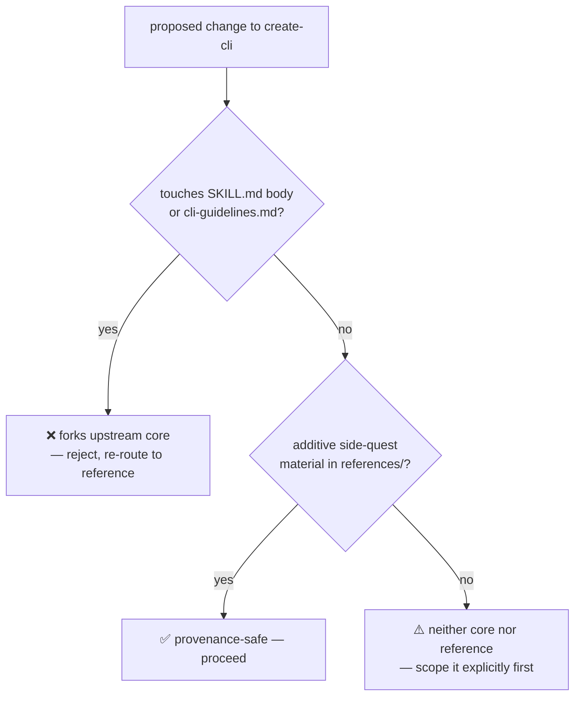

# feat: Facade-aware create-cli — emit a CommandFacadeContract skeleton

## Summary

Close the hand-translation gap between the `create-cli` skill (design front-end)
and `@side-quest/cli-command-facade` (enforcement runtime). Today create-cli
emits a markdown CLI spec and a human hand-translates it into a typed
`CommandFacadeContract`. This slice makes the skill's *deliverable* a ready-to-drop
contract skeleton + `defineCommandFacadeContract` wire-up, so design → contract →
enforcement is one continuous flow.

The slice is **skill-side only** (this repo, `claude-code-config`). The facade
foundation it consumes — `parse`/`defineCommandFacadeContract`, the three contract
fields (`outputModes`/`interactivity`/`envVars`), and the 2-adapter proof — is
already merged on `side-quest-engineering` main (PR #59, squash `1737a7ae`). No
runtime code changes here; the facade is a finished, consumed dependency.

The work lands as **additive side-quest material** under the provenance constraint:
the verbatim-upstream SKILL.md body and `references/cli-guidelines.md` are not
touched. The contract skeleton lives in the facade reference, never replacing the
upstream "CLI spec skeleton" template.

---

## Problem Frame

`create-cli` and `cli-command-facade` are two halves of one pipeline that meet at
one type: `CommandFacadeContract`. The brainstorm (see origin) established the
mental model — **"nothing merges"**: the skill is author-time *prompt*; the facade
is runtime *code*. The skill's job is to (a) produce the spec as a contract object
and (b) show generated code how to consume the package.

**Today:** the two halves are joined by hand. create-cli emits markdown; a human
hand-translates it into a `CommandFacadeContract`. There's a manual translation gap
where the markdown spec and the typed contract can silently diverge.

**Goal:** create-cli's deliverable is the contract object + the few wire-up lines
that hand it to the facade. `defineCommandFacadeContract` then validates the
contract at construction (GAP A, already shipped), so a subtly-broken spec can't
ship silently. Design → Contract → Enforcement, one flow.

**What this is NOT:** GAP B (a verify-behavior-out helper that asserts a running
command matches its authored contract) is an explicit follow-on, not this slice
(see origin, "First slice" §4). Contract → spec (generating the human doc from a
contract) is deferred — one-way for v1.

---

## Requirements

- **R1.** create-cli's deliverable includes a ready-to-drop `CommandFacadeContract`
  skeleton object, not only a markdown spec. (origin: "Goal" + "Framing")
- **R2.** The skeleton is paired with the `defineCommandFacadeContract` wire-up so
  the emitted artifact is drop-in and self-validating at construction. (origin:
  GAP A resolution)
- **R3.** The three shipped fields (`outputModes`/`interactivity`/`envVars`) appear
  in the emitted skeleton where the design calls for them — declare, don't enforce.
- **R4.** Dual-mode: the same deliverable serves human-assisted authoring AND an
  autonomous agent building its own tools. No skill fork. (origin: "Dual-mode")
- **R5.** The autonomous path carries the high-stakes-fork guard: a
  `sideEffects: 'destructive' | 'auth'` classification is a stop-and-ask design
  decision even mid-autonomous-build. (origin: "The carried guard")
- **R6.** PROVENANCE constraint preserved: SKILL.md body + `cli-guidelines.md` stay
  verbatim-upstream and diffable. Facade-awareness is additive side-quest material
  only.
- **R7.** The emitted skeleton stays honest about coverage — it must not advertise
  validator coverage the real drift checker doesn't provide (e.g. `--json` is
  deliberately NOT reserved). (origin: "Caveat resolved")

**Success criteria:** A user (or agent) running create-cli on a CLI design gets, as
output, a contract object they can paste into a `scripts/command-contract.ts` and
have it type-check + validate against the linked facade with zero hand-translation.
The upstream core remains byte-diffable against steipete/agent-scripts.

---

## Key Technical Decisions

- **KTD1 — Skill-side only; facade untouched.** All changes land in
  `skills/create-cli/` in this repo. The facade package is a consumed dependency
  whose needed surface already shipped. Rationale: honors "nothing merges"; the
  runtime stays code, the skill stays prompt. (origin: GAP A "lives in the toolkit,
  not the skill" — that work is done; this slice is the cross-repo *third caller*.)

- **KTD2 — The contract skeleton extends the existing facade reference; it does NOT
  touch the upstream "CLI spec skeleton" template.** SKILL.md lines 54-84 are a
  verbatim-upstream markdown skeleton. The typed-contract skeleton is a *parallel,
  additive* artifact in `references/cli-command-facade.md`, which already carries a
  "Wire-up (copy, adjust names)" block that IS a contract skeleton. We strengthen
  that block into the canonical emit-this target, rather than forking the body.
  Rationale: provenance constraint (R6) forbids editing the verbatim core; the
  reference is the sanctioned side-quest surface.

- **KTD3 — One canonical reference, not a new file.** Keep the contract skeleton in
  `references/cli-command-facade.md` (extend the existing Wire-up section) rather
  than adding a second `references/` deliverable file. Rationale: no-parallel-policy
  — one canonical owner of the concept→field→skeleton mapping. A second file would
  need to stay aligned with the first and the field-list, multiplying drift surface.
  (Alternative considered below.)

- **KTD4 — Declare, don't enforce, stays the framing for the 3 fields.** The
  emitted skeleton shows `outputModes`/`interactivity`/`envVars` as capability
  declarations; the reference prose already says the facade validates the
  declaration's *shape*, not the runtime behavior. Rationale: matches the facade's
  KTD4 and the explorer reconcile shipped this session (`8128ba5`). Over-claiming
  here would re-introduce the dishonesty that reconcile removed.

- **KTD5 — The autonomous high-stakes guard is documented as prose in the
  reference, keyed on `sideEffects`.** Not a code mechanism (there's no runtime in
  this slice). The reference tells an autonomous author: default-through low-stakes
  scaffolding, but pause for a human when the design classifies a command
  `sideEffects: destructive | auth`. Rationale: R5; the facade's `sideEffects` enum
  is the natural signal, and build-time guard placement is the brainstorm's
  resolution.

---

## Scope Boundaries

### In scope

- Strengthening `references/cli-command-facade.md` so its skeleton is the canonical
  "emit this" deliverable, including the three shipped fields and the
  `define()`-validates-at-construction framing.
- A short addition making the dual-mode + high-stakes-guard guidance explicit in
  the reference (R4, R5).
- Verifying the emitted skeleton type-checks + validates against the linked package
  via the existing `scripts/` npm-link playground.
- PROVENANCE.md update noting the reference now carries the canonical emit target
  (provenance status already describes the reference; this keeps it accurate).

### Deferred to Follow-Up Work

- **GAP B — verify-behavior-out helper.** A testing-subpath assertion an agent runs
  against captured CLI output to prove a running command matches its contract.
  Explicit follow-on (origin §4). Lands in the facade package, not the skill.
- **Contract → spec (round-trip).** Generating the human markdown doc *from* an
  existing contract, for docs/discovery. Deferred unless a need proves it (origin:
  "One-way for v1").
- **Config/env precedence as a contract field.** Still prose-only, tracked upstream
  (side-quest-engineering #60). The skeleton keeps precedence as prose.
- **Making SKILL.md body itself emit the contract.** Forbidden by provenance — the
  body stays verbatim. Any future "skill body teaches the contract directly" move
  would require an upstream-fork decision, out of scope here.

### Outside this product's identity

- create-cli does not become a code generator that writes the whole command. It
  emits the *contract* + wire-up; the command body is the author's (human or agent)
  work. (origin: anti-goal — "dissolving graduated runtime code into prose".)

---

## High-Level Technical Design

The pipeline this slice completes, and where each piece lives:

```mermaid
flowchart LR
  subgraph CCC["claude-code-config (this slice — skill, author-time)"]
    DESIGN["create-cli SKILL.md body<br/>(verbatim upstream — untouched)"]
    REF["references/cli-command-facade.md<br/>(additive: canonical contract skeleton)"]
    DESIGN -. "one pointer line<br/>(existing, untouched)" .-> REF
  end
  subgraph SQE["side-quest-engineering (merged — runtime, consumed)"]
    DEFINE["defineCommandFacadeContract()<br/>validate-at-construction (GAP A ✓)"]
    DRIFT["findCommandFacadeMetadataDrift<br/>11 categories ✓"]
    DEFINE --> DRIFT
  end
  REF == "emit: contract object + wire-up" ==> ARTIFACT["scripts/command-contract.ts<br/>(author pastes this)"]
  ARTIFACT == "import { defineCommandFacadeContract }" ==> DEFINE
  GAPB["GAP B: verify-behavior-out<br/>(DEFERRED follow-on)"]:::deferred
  DRIFT -.-> GAPB
  classDef deferred stroke-dasharray: 5 5,opacity:0.5
```

The only new authorial surface is the bold `REF ==> ARTIFACT` edge — making the
reference's skeleton the thing an author/agent emits. Everything downstream of the
artifact already exists and is verified.

The provenance boundary, as a gate:

---

## Implementation Units

### U1. Strengthen the reference skeleton into the canonical emit target

**Goal:** Make the "Wire-up (copy, adjust names)" block in
`references/cli-command-facade.md` the explicit, canonical "this is what create-cli
emits" deliverable — a complete `CommandFacadeContract` skeleton showing the three
shipped fields in context, paired with `defineCommandFacadeContract` and framed as
the design→enforce handoff.

**Requirements:** R1, R2, R3, R4 (partial), R7.

**Dependencies:** none (foundation merged).

**Files:**
- `skills/create-cli/references/cli-command-facade.md` (modify — the Wire-up section
  + a short "what create-cli emits" framing line above it)

**Approach:**
- The existing Wire-up block (a `build` command literal + `define()` call) is the
  seed. Extend it to a skeleton that (a) shows where `outputModes`/`interactivity`/
  `envVars` go in a realistic command, (b) keeps the `as const satisfies` narrowing
  pattern proven by the memory-os-legacy adapter, (c) frames it as "emit this object
  as the create-cli deliverable, then hand it to `define()`".
- Mirror the real adapter shape (`MemoryOsCommandContract` typing pattern) so the
  skeleton matches a known-good in-repo consumer, not an invented shape.
- Keep R7 honest: do NOT show `--json` as reserved; show it as a declared, author-
  owned flag (the reference already states this in "Facade owns the diagnostic
  flags" — keep consistent).
- Add one framing sentence: "create-cli's deliverable is this object + the
  `define()` line — design and enforcement in one artifact, no hand-translation."

**Patterns to follow:**
- `side-quest-engineering/plugins/memory-os-legacy/scripts/command-contract.ts`
  (the `as const satisfies` + `define()` + typed `CommandName` pattern).
- The reference's own existing Wire-up block (lines ~159-194) — extend, don't
  rewrite.

**Test scenarios:**
- *Skeleton type-checks.* Paste the emitted skeleton into the `scripts/` npm-link
  playground; `bunx --bun tsc --noEmit` passes. (Names the input: the skeleton
  object; action: typecheck; outcome: no errors.)
- *Skeleton validates at construction.* Running the skeleton's `define()` call
  against the linked package does not throw (the contract is shape-valid).
- *Negative — a broken field is caught.* An `enum` flag with empty `values` in the
  skeleton makes `define()` throw `command-enum-flag-values-missing` — proves the
  validate-at-construction claim (R2) is real, not advertised.
- *R7 honesty.* The skeleton declares `--json` as an author-owned boolean flag and
  `define()` does NOT reject it as reserved.

**Verification:** The reference contains a complete, type-checking contract skeleton
that an author can paste and run; the three shipped fields appear in context with
the declare-don't-enforce framing; `--json` is shown correctly as non-reserved.

---

### U2. Document dual-mode + the autonomous high-stakes guard in the reference

**Goal:** Make explicit, in the reference, that the same emitted skeleton serves
both human-assisted and autonomous-agent authoring, and that the autonomous path
pauses for a human on high-stakes design forks keyed on `sideEffects`.

**Requirements:** R4, R5.

**Dependencies:** U1 (the skeleton it annotates).

**Files:**
- `skills/create-cli/references/cli-command-facade.md` (modify — add a short
  "Two ways to drive this" + "When an autonomous build must pause" passage)

**Approach:**
- One compact passage: same seam (`CommandFacadeContract`), same deliverable; the
  only difference between human and agent authoring is who answers the clarify
  questions. The autonomous path default-throughs low-stakes scaffolding.
- The guard: when the design classifies a command `sideEffects: 'destructive'` or
  `'auth'`, that's a stop-and-ask design fork — an autonomous agent pauses for a
  human even mid-build. Frame as a prose rule (no runtime in this slice), keyed on
  the facade's existing `sideEffects` enum as the signal.
- Keep it terse (work-style budget) — this is guidance, not a spec.

**Patterns to follow:**
- The brainstorm's "Dual-mode" and "The carried guard" sections (origin L52-84) —
  this unit is the skill-side restatement of that resolved decision.

**Test scenarios:** Test expectation: none — prose guidance addition, no behavioral
change. (Covered by U4's doc-integrity checks: YAML parse + line budgets.)

**Verification:** The reference states both drive modes plainly and names the
`sideEffects: destructive | auth` pause condition. A reader (human or agent) knows
when to stop and ask during an autonomous build.

---

### U3. Keep PROVENANCE.md accurate for the strengthened reference

**Goal:** Update PROVENANCE.md so its description of the side-quest additions
reflects that the reference now carries the canonical contract-emission skeleton +
dual-mode guard — without weakening the verbatim-core statement.

**Requirements:** R6.

**Dependencies:** U1, U2.

**Files:**
- `skills/create-cli/PROVENANCE.md` (modify — the "Side-quest additions" paragraph)

**Approach:**
- The current provenance text already names `references/cli-command-facade.md` as a
  side-quest addition that "maps each clig.dev pattern to a facade field + a TS+Bun
  wire-up". Extend that sentence to note the reference now also carries the canonical
  contract-emission skeleton and the dual-mode/high-stakes-guard guidance.
- Reaffirm — do not weaken — the verbatim-core line: SKILL.md body +
  `cli-guidelines.md` remain the verbatim upstream copy, still diffable.

**Test scenarios:**
- *Verbatim core unchanged.* `git diff` against the upstream-pulled SKILL.md body +
  `cli-guidelines.md` shows zero changes from this slice. (The diffability claim is
  the actual contract — verify it.)

**Verification:** PROVENANCE.md accurately describes the strengthened reference; the
verbatim-core statement is intact; a diff confirms the body and guidelines are
untouched.

---

### U4. Doc-integrity checks (skill loads, YAML parses, budgets, link valid)

**Goal:** Confirm the skill is still well-formed after the additive edits and that
nothing breaks the rendered/loaded skill.

**Requirements:** R6 (integrity), supports all.

**Dependencies:** U1, U2, U3.

**Files:**
- `skills/create-cli/SKILL.md` (read-only verify — frontmatter still parses)
- `skills/create-cli/references/cli-command-facade.md` (read-only verify)

**Approach:**
- YAML-parse the SKILL.md frontmatter (AGENTS.md skill-authoring rule: parse before
  commit).
- Confirm the one existing pointer line in "Do This First" still resolves to the
  strengthened reference (no broken relative path).
- Sanity-check the reference against work-style line budgets; flag (don't auto-fix)
  if a section blew the hard budget.

**Test scenarios:**
- *Frontmatter parses.* SKILL.md YAML frontmatter parses without error.
- *Pointer resolves.* The "See `references/cli-command-facade.md`" line points at an
  existing file.
- *No verbatim drift.* Re-confirm U3's diff check at the whole-skill level — only
  the reference + PROVENANCE changed; body + guidelines + cli-guidelines.md clean.

**Verification:** Skill is well-formed, frontmatter parses, the facade pointer
resolves, and the only changed files are the reference and PROVENANCE.md.

---

## System-Wide Impact

- **Cross-repo, but one-directional.** This slice consumes side-quest-engineering's
  merged surface; it does not change it. No coordinated release. If the facade later
  renames a field, the skeleton drifts — caught by the `scripts/` playground
  typecheck, not silently.
- **Consumers:** the create-cli skill is invoked cross-harness (Claude + Codex via
  the shared skills repo). The change is additive prose + a skeleton in a reference
  the skill already points at — no new trigger, no description change, no routing
  impact.
- **Provenance auditability:** the verbatim-core diffability against upstream is the
  load-bearing invariant; U3 + U4 verify it explicitly rather than assuming.

---

## Risks & Dependencies

- **Risk: skeleton drifts from the real package shape.** Mitigation: U1 mirrors the
  memory-os-legacy adapter (a known-good in-repo consumer) and U1's test scenarios
  typecheck + validate against the linked package, not against memory.
- **Risk: additive edits creep into the verbatim core.** Mitigation: KTD2 + the
  provenance gate diagram; U3/U4 verify zero body/guidelines diff. This is the one
  constraint that must not slip.
- **Risk: over-claiming validator coverage (the `--json` trap).** Mitigation: R7 +
  U1's R7-honesty scenario; the reference already states `--json` is non-reserved —
  keep the skeleton consistent.
- **Dependency (satisfied):** `parse`/`defineCommandFacadeContract` + the 3 fields +
  2-adapter proof on side-quest-engineering main (`1737a7ae`). Verified present.
- **Dependency (machine-local):** the `scripts/` folder's npm-link to the private
  package. The typecheck scenarios need the link live; a portable consumer needs its
  own link (the reference already states this).

---

## Alternative Approaches Considered

- **New dedicated `references/` deliverable file** (rejected — KTD3). A separate
  `references/cli-command-facade-contract.md` holding just the emit-this skeleton.
  Cleaner separation, but creates a second reference that must stay aligned with the
  concept→field mapping and the field-list in the existing reference + the explorer.
  No-parallel-policy favors one canonical owner; the existing reference already has
  the Wire-up seed, so extending it is lower drift surface.
- **Teach the contract in the SKILL.md body** (rejected — provenance). Most
  discoverable, but forks the verbatim upstream core. Forbidden by R6; would require
  a separate upstream-fork decision.
- **Build GAP B in this slice too** (rejected — scope). The verify-behavior-out
  helper is genuinely useful but is runtime code in another repo and an explicit
  follow-on. Bundling it would break the "skill-side only, no runtime change"
  cleanliness and the brainstorm's slicing.

---

## Sources & Research

- Origin brainstorm (resolved + prototyped):
  `side-quest-engineering/docs/brainstorms/2026-05-29-002-facade-aware-create-cli-integration.md`
- Foundation merged: side-quest-engineering PR #59, squash `1737a7ae` (the 3 fields
  + `parse`/`define`). Verified: exports at
  `packages/cli-command-facade/src/command-facade.ts:1437,1460`.
- 2-adapter proof: `plugins/browser-automation/tools/governance/command-contract.ts`
  and `plugins/memory-os-legacy/scripts/command-contract.ts` both call
  `defineCommandFacadeContract` (the latter read as the skeleton pattern for U1).
- Provenance constraint: `skills/create-cli/PROVENANCE.md`.
- Prior session: explorer reconcile commit `8128ba5` (declare-don't-enforce framing
  this plan stays consistent with).
