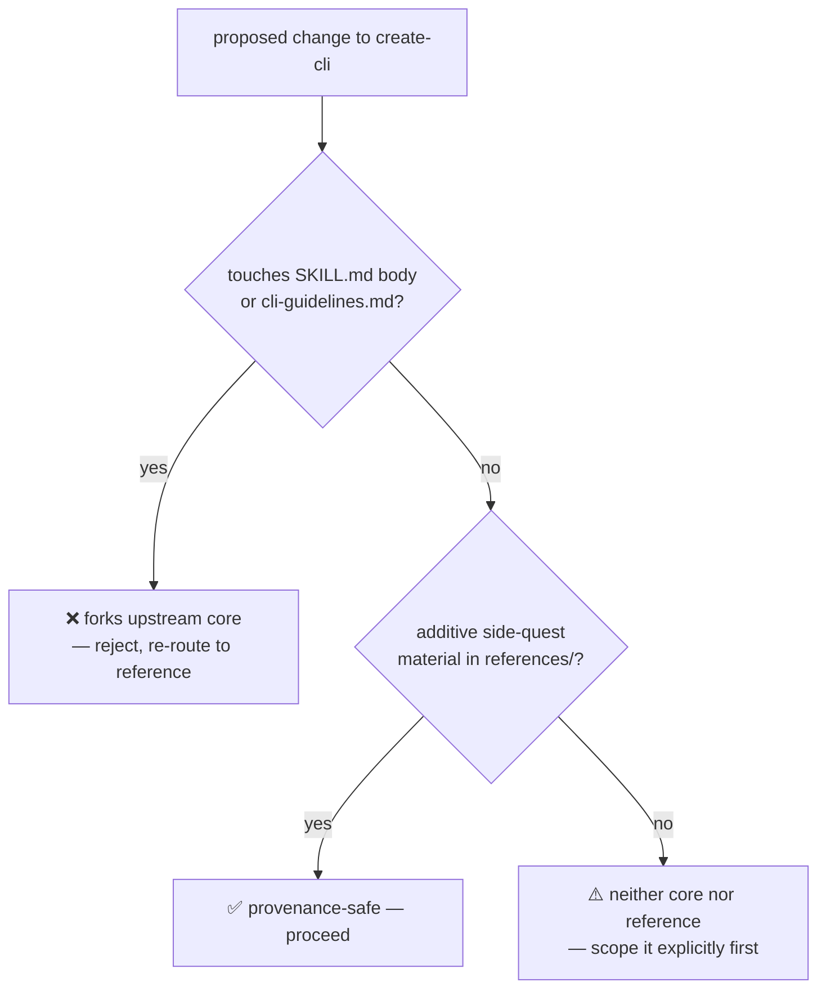

# feat: Facade-aware create-cli — emit a CommandFacadeContract skeleton

## Summary

Narrow the hand-translation gap between the `create-cli` skill (design front-end)
and `@side-quest/cli-command-facade` (enforcement runtime). Today create-cli
emits a markdown CLI spec and a human hand-translates it into a typed
`CommandFacadeContract`. This slice makes a ready-to-drop contract skeleton +
`defineCommandFacadeContract` wire-up *available and canonical in the facade
reference*, reachable via the skill's existing pointer — so an author or agent who
follows the pointer goes design → contract → enforcement in one flow.

**Honest boundary (see R1):** this slice makes the contract deliverable *reachable
and canonical in the reference*, NOT the body's default output — the verbatim
upstream body still instructs "emit a markdown spec" and is frozen. Closing the gap
*by default* (so the body itself emits a contract) is the deferred upstream fork
(ADR 0007). And live validation of the emitted skeleton is link-gated — see the v1
portability boundary in Deferred; off-machine, an autonomous agent gets a portable
skeleton it cannot self-validate until the package is published/vendored.

The slice is **skill-side only** (this repo, `claude-code-config`). The facade
foundation it consumes — `parse`/`defineCommandFacadeContract`, the three contract
fields (`outputModes`/`interactivity`/`envVars`), and the 2-adapter proof — is
already merged on `side-quest-engineering` main (PR #59, squash `1737a7ae`). No
runtime code changes here; the facade is a finished, consumed dependency.

The work lands as **additive side-quest material** under the provenance constraint:
the verbatim-upstream SKILL.md body and `references/cli-guidelines.md` are not
touched. The contract skeleton lives in the facade reference, never replacing the
upstream "CLI spec skeleton" template.

---

## Problem Frame

`create-cli` and `cli-command-facade` are two halves of one pipeline that meet at
one type: `CommandFacadeContract`. The brainstorm (see origin) established the
mental model — **"nothing merges"**: the skill is author-time *prompt*; the facade
is runtime *code*. The skill's job is to (a) produce the spec as a contract object
and (b) show generated code how to consume the package.

**Today:** the two halves are joined by hand. create-cli emits markdown; a human
hand-translates it into a `CommandFacadeContract`. There's a manual translation gap
where the markdown spec and the typed contract can silently diverge.

**Goal:** create-cli's *recommended deliverable* (canonical in the facade reference,
reachable via the pointer) is the contract object + the few wire-up lines that hand
it to the facade. Where the link is live, `defineCommandFacadeContract` validates the
contract at construction (GAP A, already shipped), so a subtly-broken spec can't ship
silently. Design → Contract → Enforcement, one flow — for an author/agent who follows
the pointer, on a machine with the link.

**What this is NOT:** GAP B (a verify-behavior-out helper that asserts a running
command matches its authored contract) is an explicit follow-on, not this slice
(see origin, "First slice" §4). Contract → spec (generating the human doc from a
contract) is deferred — one-way for v1.

---

## Requirements

- **R1.** create-cli's facade reference *provides* a ready-to-drop
  `CommandFacadeContract` skeleton as the recommended implementation deliverable,
  reachable via the existing "Do This First" pointer — *without* changing what the
  verbatim-upstream body instructs the model to emit. (origin: "Goal" + "Framing")
  **Bounded by R6 (acknowledged tension):** the body still tells the model to emit a
  markdown spec, and the body is frozen. So this slice makes the contract deliverable
  *available and canonical in the reference*, not the body's default output. Making
  the contract the body's *primary emitted artifact* requires an upstream-fork
  decision — out of scope here (see Deferred: "SKILL.md body emits the contract").
- **R2.** The skeleton is paired with the `defineCommandFacadeContract` wire-up so
  the emitted artifact is drop-in and self-validating at construction. (origin:
  GAP A resolution)
- **R3.** The three shipped fields (`outputModes`/`interactivity`/`envVars`) appear
  in the emitted skeleton where the design calls for them — declare, don't enforce.
- **R4.** Dual-mode: the same deliverable serves human-assisted authoring AND an
  autonomous agent building its own tools. No skill fork. (origin: "Dual-mode")
- **R5.** The autonomous path carries the high-stakes-fork guard: a
  `sideEffects: 'destructive' | 'auth'` classification is a stop-and-ask design
  decision even mid-autonomous-build. (origin: "The carried guard")
- **R6.** PROVENANCE constraint preserved: SKILL.md body + `cli-guidelines.md` stay
  verbatim-upstream and diffable. Facade-awareness is additive side-quest material
  only.
- **R7.** The emitted skeleton stays honest about coverage — it must not advertise
  validator coverage the real drift checker doesn't provide (e.g. `--json` is
  deliberately NOT reserved). (origin: "Caveat resolved")

**Success criteria:** A user (or agent) who follows the skill's pointer to the facade
reference finds a ready-to-drop contract skeleton they can paste into a
`scripts/command-contract.ts`; *on a machine with the link live* it type-checks +
validates against the facade with no hand-translation. The reference is canonical for
*what to emit* — the verbatim body's default output is unchanged. Off-machine (no
link), the skeleton is still emittable as portable text but is not live-validated
(v1 portability boundary). The upstream core remains byte-diffable against
steipete/agent-scripts (path-scoped verification this slice; full content-diff
deferred — no local upstream).

---

## Key Technical Decisions

- **KTD1 — Skill-side only; facade untouched.** All changes land in
  `skills/create-cli/` in this repo. The facade package is a consumed dependency
  whose needed surface already shipped. Rationale: honors "nothing merges"; the
  runtime stays code, the skill stays prompt. (origin: GAP A "lives in the toolkit,
  not the skill" — that work is done; this slice is the cross-repo *third caller*.)

- **KTD2 — The contract skeleton extends the existing facade reference; it does NOT
  touch the upstream "CLI spec skeleton" template.** SKILL.md lines 54-84 are a
  verbatim-upstream markdown skeleton. The typed-contract skeleton is a *parallel,
  additive* artifact in `references/cli-command-facade.md`, which already carries a
  "Wire-up (copy, adjust names)" block that IS a contract skeleton. We strengthen
  that block into the canonical emit-this target, rather than forking the body.
  Rationale: provenance constraint (R6) forbids editing the verbatim core; the
  reference is the sanctioned side-quest surface.

- **KTD3 — One canonical reference, not a new file.** Keep the contract skeleton in
  `references/cli-command-facade.md` (extend the existing Wire-up section) rather
  than adding a second `references/` deliverable file. Rationale: no-parallel-policy
  — one canonical owner of the concept→field→skeleton mapping. A second file would
  need to stay aligned with the first and the field-list, multiplying drift surface.
  (Alternative considered below.)

- **KTD4 — Declare, don't enforce, stays the framing for the 3 fields.** The
  emitted skeleton shows `outputModes`/`interactivity`/`envVars` as capability
  declarations; the reference prose already says the facade validates the
  declaration's *shape*, not the runtime behavior. Rationale: matches the facade's
  KTD4 and the explorer reconcile shipped this session (`8128ba5`). Over-claiming
  here would re-introduce the dishonesty that reconcile removed.

- **KTD5 — The autonomous high-stakes guard is documented as prose in the
  reference, keyed on `sideEffects`.** Not a code mechanism (there's no runtime in
  this slice). The reference tells an autonomous author: default-through low-stakes
  scaffolding, but pause for a human when the design classifies a command
  `sideEffects: destructive | auth`. Rationale: R5; the facade's `sideEffects` enum
  is the natural signal, and build-time guard placement is the brainstorm's
  resolution.

---

## Scope Boundaries

### In scope

- Strengthening `references/cli-command-facade.md` so its skeleton is the canonical
  "emit this" deliverable, including the three shipped fields and the
  `define()`-validates-at-construction framing.
- A short addition making the dual-mode + high-stakes-guard guidance explicit in
  the reference (R4, R5).
- Verifying the emitted skeleton type-checks + validates against the linked package
  via the existing `scripts/` npm-link playground. **This verification is gated on
  the machine-local link** — see the v1 portability boundary in Deferred.
- PROVENANCE.md update noting the reference now carries the canonical emit target
  (provenance status already describes the reference; this keeps it accurate).

### Deferred to Follow-Up Work

- **GAP B — verify-behavior-out helper.** A testing-subpath assertion an agent runs
  against captured CLI output to prove a running command matches its contract.
  Explicit follow-on (origin §4). Lands in the facade package, not the skill.
- **Off-machine / portable contract validation (v1 portability boundary).** U1's
  live-validation guard (typecheck + `define()`-throws) requires the machine-local
  npm link to the *private* `@side-quest/cli-command-facade`. So validation runs
  where the link exists (this machine, this session's `ce-work`) but NOT on a fresh
  agent, CI, a teammate, or — pointedly — the autonomous agent building a tool
  on another machine. **v1 boundary:** the skill *emits* a portable contract skeleton
  (R4 holds — the shape is tool-neutral text); *live validation of that skeleton* is
  link-gated and not portable. Closing it needs the package published or vendored so
  it's a real resolvable dependency, not a local link. Deferred — do not let v1 block
  on publishing, and do not claim the autonomous path self-validates off-machine.
- **Contract → spec (round-trip).** Generating the human markdown doc *from* an
  existing contract, for docs/discovery. Deferred unless a need proves it (origin:
  "One-way for v1").
- **Config/env precedence as a contract field.** Still prose-only, tracked upstream
  (side-quest-engineering #60). The skeleton keeps precedence as prose.
- **Making SKILL.md body itself emit the contract (the upstream fork).** Forbidden by
  provenance — the body stays verbatim. The body's default instruction is "emit a
  markdown spec"; the contract-emission lives in the reference behind the one pointer.
  The fork would rewrite the body to emit a contract *by default* — the only thing a
  loud pointer can't do (the "10%" = reliability under autonomy). **Deferred + open,
  with a watchable trigger:** revisit the fork (via an ADR) IF autonomous agents are
  *observed* skipping the pointer and emitting markdown specs instead of contracts.
  Until that's observed, a sharpened pointer + the facade's catch-and-correct loop
  covers it — the 5-angle prototype (see Sources) showed agent emission is robust, so
  the fork is currently unjustified. **Decision recorded durably in
  `docs/adr/0007-create-cli-stays-verbatim-upstream-not-forked.md`** (rationale,
  alternatives, and the watchable trigger).

### Outside this product's identity

- create-cli does not become a code generator that writes the whole command. It
  emits the *contract* + wire-up; the command body is the author's (human or agent)
  work. (origin: anti-goal — "dissolving graduated runtime code into prose".)

---

## High-Level Technical Design

The pipeline this slice completes, and where each piece lives:

```mermaid
flowchart LR
  subgraph CCC["claude-code-config (this slice — skill, author-time)"]
    DESIGN["create-cli SKILL.md body<br/>(verbatim upstream — untouched)"]
    REF["references/cli-command-facade.md<br/>(additive: canonical contract skeleton)"]
    DESIGN -. "one pointer line<br/>(existing, untouched)" .-> REF
  end
  subgraph SQE["side-quest-engineering (merged — runtime, consumed)"]
    DEFINE["defineCommandFacadeContract()<br/>validate-at-construction (GAP A ✓)"]
    DRIFT["findCommandFacadeMetadataDrift<br/>11 categories ✓"]
    DEFINE --> DRIFT
  end
  REF == "emit: contract object + wire-up" ==> ARTIFACT["scripts/command-contract.ts<br/>(author pastes this)"]
  ARTIFACT == "import { defineCommandFacadeContract }" ==> DEFINE
  GAPB["GAP B: verify-behavior-out<br/>(DEFERRED follow-on)"]:::deferred
  DRIFT -.-> GAPB
  classDef deferred stroke-dasharray: 5 5,opacity:0.5
```

The only new authorial surface is the bold `REF ==> ARTIFACT` edge — making the
reference's skeleton the thing an author/agent emits. Everything downstream of the
artifact already exists and is verified.

The provenance boundary, as a gate:

---

## Implementation Units

> **Execution posture — build LEAN (governs all units).** create-cli is steipete's
> lean design skill, and that is exactly what the community converges on for skills
> that "just work" cross-harness: small body, one concern, procedural prose, *only
> novel knowledge*, portable frontmatter, description-as-trigger (community research +
> Codex/Claude shared SKILL.md contract, 2026-06-01). So execute these units at the
> minimum that delivers the value: **the skill POINTS, the facade OWNS.** Strengthen the
> reference skeleton + sharpen the pointer + add the two portable frontmatter fields —
> and stop. Do NOT grow the reference into a copy of the facade's truth (field
> catalogs, validator categories, gotcha mechanisms): name them in one line and link
> the package source + the filed upstream issues (#61/#62/#63/#64). This plan is
> thorough by design (it was hardened across many review rounds); the *skill it
> produces* must stay Pete-lean. When a unit's prose starts teaching the facade rather
> than pointing at it, cut back.

### U1. Strengthen the reference skeleton into the canonical emit target

**Goal:** Make the "Wire-up (copy, adjust names)" block in
`references/cli-command-facade.md` the explicit, canonical "this is what create-cli
emits" deliverable — a complete `CommandFacadeContract` skeleton showing the three
shipped fields in context, paired with `defineCommandFacadeContract` and framed as
the design→enforce handoff.

**Requirements:** R1, R2, R3, R4 (partial), R7.

**Dependencies:** U5 (the playground needs a tsconfig before U1's typecheck scenario
can run — surfaced by prototype 2026-05-31). Facade foundation already merged.

**Files:**
- `skills/create-cli/references/cli-command-facade.md` (modify — the Wire-up section
  + a short "what create-cli emits" framing line above it)

**Approach:**
- The existing Wire-up block (a `build` command literal + `define()` call) is the
  seed. Extend it to a skeleton that (a) shows where `outputModes`/`interactivity`/
  `envVars` go in a realistic command, (b) keeps the `as const satisfies` narrowing
  pattern proven by the memory-os-legacy adapter, (c) frames it as "emit this object
  as the create-cli deliverable, then hand it to `define()`".
- Mirror the real adapter shape (`MemoryOsCommandContract` typing pattern) so the
  skeleton matches a known-good in-repo consumer, not an invented shape.
- Keep R7 honest: do NOT show `--json` as reserved; show it as a declared, author-
  owned flag (the reference already states this in "Facade owns the diagnostic flags").
- Add one framing sentence: "create-cli's recommended deliverable is this object + the
  `define()` line — design and enforcement in one artifact, no hand-translation (for an
  author/agent who follows the pointer, on a machine with the link)."
- **Wire the skeleton to the reference's existing "Self-correction loop (autonomous
  mode)" section** as its drift-healing mechanism: the skeleton is the loop's seed
  input; `parse()` returns `{category, action}` fixes the consumer applies and re-runs
  (the facade ships no repair helper). `satisfies` is the compile-time drift half, the
  parse-loop is the runtime half — both only where the link is live.
- **Show `flags: {}` + `exitCodes: { "0": … }` present in the skeleton.** Both are
  required; missing them now emits recoverable `command-flags-missing` /
  `command-exit-codes-missing` drift (side-quest-engineering #62, landed on main —
  the earlier TypeError crash is fixed). Showing them present is still the right
  minimal seed; it's no longer a crash-guard.
- **Net-new gotchas the reference PROSE must carry** (one line each; not the two —
  free-text boundary, emit-minimal — that the reference ALREADY states):
  - env-var names: use SCREAMING_SNAKE_CASE; the secret gate has an `AUTH_*`
    false-positive *and* a fused-name (`APITOKEN`) leak — name benign vars plainly
    (`REGION`); a rejected name self-corrects via the `action`.
  - declare `sideEffects` honestly — an under-declared value silently disables the
    high-stakes guard.

**Patterns to follow:**
- `side-quest-engineering/plugins/memory-os-legacy/scripts/command-contract.ts`
  (the `as const satisfies` + `define()` + typed `CommandName` pattern).
- The reference's own existing Wire-up block (lines ~159-194) — extend, don't
  rewrite.
- The reference's own existing "Self-correction loop (autonomous mode)" section —
  the skeleton links forward to it as the drift-healing mechanism.

**Test scenarios:**
- *Skeleton type-checks.* With U5's tsconfig, `bunx --bun tsc --noEmit -p
  scripts/tsconfig.json` over the pasted skeleton passes; a drifted field (`as const
  satisfies`) is a hard `TS2322` (e.g. a bad `outputModes` value). (prototype-confirmed)
- *Skeleton validates at construction.* The skeleton's `define()` call against the
  linked package does not throw — a dual agent+human contract (outputModes
  `["json","plain"]`, interactivity `optional`, envVars `[{name:"GIT_DIR"}]`) is
  shape-valid. (prototype-confirmed)
- *Negative — a broken field is caught.* An `enum` flag with empty `values` makes
  `define()` throw `command-enum-flag-values-missing` — proves R2's
  validate-at-construction is real, not advertised.
- *R7 honesty.* The skeleton declares `--json` as an author-owned boolean flag and
  `define()` does NOT reject it as reserved.

**Verification:** The reference contains a complete, type-checking contract skeleton
that an author can paste and run; the three shipped fields appear in context with
the declare-don't-enforce framing; `--json` is shown correctly as non-reserved.

---

### U2. Dual-mode + high-stakes guard, the provenance note, and integrity close-out

**Goal:** Add the dual-mode + autonomous-guard guidance to the reference, update
PROVENANCE.md to match the strengthened reference, and run the skill-integrity
checks that close out the slice. (Absorbs former U3 provenance-note + former U4
integrity checks — they were one-paragraph edits + a checklist, not standalone
units; folded per the lean-skill bar.)

**Requirements:** R4, R5, R6.

**Dependencies:** U1 (the skeleton it annotates).

**Files:**
- `skills/create-cli/references/cli-command-facade.md` (modify — add a short
  "Two ways to drive this" + "When an autonomous build must pause" passage)
- `skills/create-cli/SKILL.md` (modify — **only** the side-quest-owned pointer line in
  "Do This First" + the frontmatter additions below; the verbatim body + template are
  untouched)
- `skills/create-cli/PROVENANCE.md` (modify — the "Side-quest additions" paragraph)

**Approach:**
- *Sharpen the pointer (the load-bearing edit).* The "Do This First" pointer line is
  side-quest material (not verbatim upstream), so it is editable under R6. Today it
  reads "lean on `@side-quest/cli-command-facade` … See `references/…`" — a *tool
  preference*, not an *emit* instruction. Rewrite it to name the deliverable: e.g.
  "Implementing? Emit a `CommandFacadeContract` skeleton (see
  `references/cli-command-facade.md`) and hand it to `defineCommandFacadeContract` —
  that object is the deliverable on the facade path, not the markdown spec." This is
  what makes ADR 0007's fork-deferral premise ("a sharpened pointer covers the 90%")
  actually true; without it the premise is unbacked. Stays a pointer (one line),
  does NOT touch the body's "Deliverables"/template sections.
- *Dual-mode passage:* one compact block — same seam (`CommandFacadeContract`), same
  deliverable; the only difference between human and agent authoring is who answers
  the clarify questions. The autonomous path default-throughs low-stakes scaffolding.
- *High-stakes guard:* when the design classifies a command `sideEffects:
  'destructive' | 'auth'`, that's a stop-and-ask design fork — an autonomous agent
  pauses for a human even mid-build. Prose rule (no runtime in this slice), keyed on
  the facade's existing `sideEffects` enum. Keep it terse (work-style budget).
- *Two clarify-loop guards (prototype #5, agent-driven UX test 2026-05-31).* The
  agent-asks-only-taste model is mostly clean but breaks in two predictable, intrinsic
  spots — both worth a one-line guard in the dual-mode passage:
  (a) **a verb can hide a UX fork.** "switch"/"cd"/"open"-type verbs are
  under-determined (print a path? eval a snippet? spawn a subshell?). An agent that
  silently *infers* the mechanic can build a useless tool — these must be promoted to
  an ASK, not inferred. The skill currently has no "watch for verbs that encode a UX
  decision" rule; add the cue.
  (b) **a destructive op is a hybrid, not pure taste.** The safety *floor*
  (confirm + `--force`) is inferred (asking is dumb — it's a convention); the data-loss
  *policy above the floor* (e.g. dirty-state behavior) must be ASKED (inferring is
  dangerous). The agent splits a single operation across infer+ask. Frame both as
  prose cues, not machinery.
- *Provenance note (former U3):* extend PROVENANCE.md's existing "Side-quest
  additions" sentence to note the reference now also carries the canonical
  contract-emission skeleton + dual-mode/high-stakes-guard guidance, **and that the
  "Do This First" pointer line was sharpened to name the contract deliverable.**
  Reaffirm — do not weaken — the verbatim-core line: SKILL.md *body* + template +
  `cli-guidelines.md` remain the verbatim upstream copy (only the side-quest pointer
  line changed). **Land the PROVENANCE update in U1's commit, not a follow-on** — it
  is the verbatim-vs-side-quest gate, so a window where the reference changed but
  PROVENANCE is stale is an integrity gap.
- *Fix a live inaccuracy while here.* The reference says "There is no nesting field" —
  but the contract HAS an `alias` field (with `command-alias-*` validators). Reconcile:
  nesting-as-subcommands is `noun:verb` naming, but `alias` IS a declared field. One
  line; don't let it ride silently.
- *Frontmatter additions (provenance-safe — frontmatter is NOT the verbatim body;
  portable to Claude + Codex per the same shared frontmatter contract).* Verified
  fields only — do NOT add `sources:` (not a real field; a claude-code-guide reviewer
  hallucinated it):
  - `allowed-tools: Bash(bun *), Bash(bunx *)` — the autonomous emit→validate flow
    runs `bun run` + `bunx tsc`; without the grant every call prompts and blocks an
    agent. (Claude: unblocks it. Codex: correct declaration, but Codex's sandbox policy
    may still gate — see System-Wide Impact.)
  - `argument-hint: "[cli description]"` — signals an invocable description (e.g.
    `/create-cli "a git worktree tool"`). The frozen body has no `$ARGUMENTS`
    placeholder, but args auto-append, so the clarify loop can seed from them without a
    body edit.
  - **Invocation posture stays default** — no `disable-model-invocation`, no
    `user-invocable: false`, no `context: fork`. create-cli *designs* (no side effects
    in the skill itself), so auto-invocation is correct; `context: fork` is
    contraindicated — it would isolate the clarify loop from the human-in-the-loop ask.

**Patterns to follow:**
- The brainstorm's "Dual-mode" and "The carried guard" sections (origin L52-84) —
  this is the skill-side restatement of that resolved decision.

**Test scenarios (close-out integrity, former U4):**
- *Frontmatter parses.* SKILL.md YAML frontmatter parses without error (skill-authoring rule).
- *Pointer resolves.* The "See `references/cli-command-facade.md`" line points at an existing file.
- *Verbatim core untouched by this slice (path-scoped).* The only `SKILL.md` change
  is the single side-quest-owned pointer line in "Do This First" — the body sections
  (Clarify, Deliverables, Default Conventions, the "CLI spec skeleton" template) and
  `cli-guidelines.md` show zero changes. Runnable guard: `git diff <base>..HEAD --`
  on those body line-ranges + `cli-guidelines.md` is empty. **Deferred:**
  content-equivalence vs. steipete/agent-scripts upstream needs a fresh re-pull +
  content-diff (no local upstream — the 2026-05-29 checkout is gone); trust-on-last-pull
  until then. Don't fake a content-vs-upstream guarantee this slice can't run.
- *(prose content itself)* No behavioral test — the dual-mode/guard text is guidance,
  verified by the reader-facing Verification below.

**Verification:** The reference states both drive modes plainly and names the
`sideEffects: destructive | auth` pause condition; PROVENANCE.md accurately describes
the strengthened reference with the verbatim-core statement intact; the path-scoped
diff confirms this slice touched only the reference, PROVENANCE, and U5's tsconfig.

---

> **Folded (lean-skill pass, 2026-05-31):** former **U3** (PROVENANCE note) was a
> one-paragraph edit inseparable from U1/U2 → folded into U2's approach. Former **U4**
> ("doc-integrity checks") was a checklist, not a unit that produces anything → folded
> into U2's close-out test scenarios. U-IDs are not reused; the plan runs U1, U2, U5.

---

### U5. Add a tsconfig to the `scripts/` playground so the typecheck actually runs

**Goal:** Make the `scripts/` npm-link playground able to *typecheck* a contract,
not just *run* it. Prerequisite for U1's primary "skeleton type-checks" scenario.

**Requirements:** R2 (the validate half of "drop-in + self-validating"); unblocks
U1's compile-time drift guard.

**Dependencies:** none. (U1's typecheck scenario depends on this.)

**Files:**
- `skills/create-cli/scripts/tsconfig.json` (create)

**Approach:**
- **Surfaced by prototype (2026-05-31):** `scripts/` has `package.json` + the live
  npm link, but NO `tsconfig.json`. So `bunx --bun tsc --noEmit` has no module
  resolution config and silently no-ops against the linked types — U1's headline test
  could not have run as originally written.
- Add a minimal tsconfig: `strict`, `noEmit`, `module: esnext`,
  `moduleResolution: bundler`, `target: esnext`, `skipLibCheck: true`, **`types:
  ["node"]`**. With it, tsc resolves `@side-quest/cli-command-facade` types and a
  drifted field becomes a hard `TS2322` (prototype-confirmed).
- **Finding B — CORRECTED (doc-review reproduced 2026-06-01).** The facade exports
  raw `.ts` source (no built `dist`), so importing it pulls real `.ts` files into the
  program. `skipLibCheck` only skips `.d.ts` declaration files — it does NOT suppress
  the facade's `node:async_hooks` / `node:crypto` import errors, and scoping `include`
  to one file does not stop tsc following the import edge into the dependency source.
  The approach that actually works is **`types: ["node"]`**: it resolves the `node:*`
  specifiers so the typecheck passes clean on a good contract and still emits the
  headline `TS2322` on a drifted field. (The earlier "scope + skipLibCheck avoids the
  node:* errors" framing was wrong — verified.)
- **Declare `@types/node` explicitly.** `types: ["node"]` works today only because tsc
  resolves `@types/node` from the repo root by accident; the `scripts/` package
  declares only `@side-quest/cli-command-facade`. Add `@types/node` to
  `skills/create-cli/scripts/package.json` devDependencies so the typecheck stays a
  real, portable runnable check — otherwise a fresh install / teammate machine / pruned
  root dep silently brings the `node:*` errors back, the exact silent-gap class U5
  exists to close.

**Files (updated):**
- `skills/create-cli/scripts/tsconfig.json` (create)
- `skills/create-cli/scripts/package.json` (modify — add `@types/node` devDependency)

**Test scenarios:**
- *Typecheck resolves linked types.* With the tsconfig present (incl. `types:
  ["node"]`), `tsc --noEmit -p scripts/tsconfig.json` over a known-good contract
  passes; over a contract with a bad `outputModes` value it fails with `TS2322` naming
  the invalid literal. (Prototype-confirmed both directions 2026-05-31; node-types fix
  confirmed 2026-06-01.)
- *No spurious `node:*` errors.* With `@types/node` present, the typecheck does not
  report `node:async_hooks`/`node:crypto` errors from the facade source. Note: tsc
  still type-checks the dependency's `.ts` (it descends the import edge) — it passes
  because node types resolve, not because tsc is prevented from reading the facade.
  True dependency-internals isolation needs a published package shipping `.d.ts` (the
  deferred portability item), out of scope here.

**Verification:** `tsc --noEmit -p scripts/tsconfig.json` runs cleanly on a valid
contract and rejects a drifted one with a field-specific error — making U1's
compile-time drift guard a real, runnable check.

---

## System-Wide Impact

- **Cross-repo, but one-directional.** This slice consumes side-quest-engineering's
  merged surface; it does not change it. No coordinated release. If the facade later
  renames a field, the skeleton drifts — caught by the `scripts/` playground typecheck
  + the parse-loop *where the link is live*, and only there; off-machine the drift is
  silent (the v1 portability boundary). The skeleton is a hand-authored mirror of a
  cross-repo type — see the maintenance-seam Risk.
- **Cross-harness (Claude + Codex) — the skill is shared, so the changes must hold on
  both.** Verified against the official Codex CLI docs (`/openai/codex`, context7
  2026-06-01): Codex and Claude share the *same* `SKILL.md` frontmatter contract
  (`name`, `description`, `argument-hint`, `disable-model-invocation`,
  `user-invocable`, `allowed-tools`, `context`/`agent`/`model`) — so this slice's
  frontmatter additions (below) are portable to both. Two harness-specific nuances the
  plan must respect:
  - *Invocation differs.* Claude auto-loads a skill by `description` match; Codex
    invokes via an explicit `$create-cli …` text marker (or `/create-cli` with inline
    args). So "will the agent reach the skill" has two different mechanics — Claude
    leans on the (verbatim-frozen, weak) description; Codex leans on the `$marker`
    being emitted. The plan's pointer-sharpening helps the *post-load* hop on both; the
    *pre-load* hop is harness-specific and largely outside this slice (see the
    discovery note in Risks).
  - *Args + tools are spec-compatible but not identical at the edges.* Both harnesses
    take inline args after the command name (the description text the clarify loop
    seeds from); `allowed-tools` exists in both. But Codex layers its own
    execution-policy/sandbox over `allowed-tools`, so the `Bash(bun *)`/`Bash(bunx *)`
    permission grant unblocks the autonomous flow on Claude and is the right
    *declaration* for Codex, but Codex's sandbox policy may still gate it — don't
    assume the grant alone makes the bun/tsc validation run unprompted on Codex.
- **Provenance auditability:** the verbatim-core invariant is verified at the
  *path-scoped* level (this slice touched only the reference + PROVENANCE + U5's
  tsconfig — U2 close-out);
  content-equivalence against upstream is deferred (no local upstream to diff).

---

## Risks & Dependencies

- **Risk: skeleton drifts from the real package shape (maintenance seam).** The
  skeleton is a hand-authored mirror of a cross-repo type; `claude-code-config` CI
  cannot typecheck it (machine-local link), so a facade-side field rename surfaces
  only when someone runs the playground or the parse-loop on a linked machine — not
  in this repo's CI. Same class of problem as the explorer mirror that just drifted.
  Mitigation, three layers: (1) `as const satisfies CommandFacadeContract<…>` makes
  a renamed/now-required field a hard compile error *where the link exists*; (2) the
  emitted skeleton wires forward to the reference's self-correction loop, so an agent
  with a live link heals shape-drift in 1-2 passes via `parse()`'s `{category,
  action}` issues (the facade ships no repair helper — the loop is the consumer's);
  (3) a future published/vendored package + CI typecheck closes the off-machine hole
  (same as the v1 portability boundary). U1 mirrors the memory-os-legacy adapter (a known-good in-repo
  consumer), not an invented shape.
- **Risk: additive edits creep into the verbatim core.** Mitigation: KTD2 + the
  provenance gate diagram; U2's close-out path-scoped check verifies zero
  body/guidelines diff. This is the one
  constraint that must not slip.
- **Risk: over-claiming validator coverage (the `--json` trap).** Mitigation: R7 +
  U1's R7-honesty scenario; the reference already states `--json` is non-reserved —
  keep the skeleton consistent.
- **Security risk: free-text injection into the agent catalog (facade #61 — LANDED via
  PR #66).** The plan's gauntlet ran against main at `1737a7ae` where projected
  free-text was unscanned; **PR #66 (`21b5abe9`, closes #61) has since merged to
  main.** The facade now scans `summary`/`usage`/`description`/`exitCodes`/
  `envVars[].description` (+ result-contract fields) at construction for credentials,
  **control-chars, AND non-string type-confusion** (`command-*-unsafe-text`) — so the
  earlier gauntlet finding that "object-typed `description` projects verbatim" is now
  STALE (non-string is rejected). Mitigation is *facade-enforced*, not
  documentation-only. **Residual #66 does NOT cover** (reference "known boundary"
  note): instruction-shaped prompt-injection (`IGNORE PREVIOUS INSTRUCTIONS`-class) and
  `script` path/exec — those stay author-trusted. KTD1 holds: no facade change in this
  slice; the reference describes the now-shipped scan.
- **Security risk: under-declared danger (mutation vs sideEffects not cross-checked).**
  A contract can say `mutation: write` while declaring `sideEffects: [read]` — the
  facade accepts the mismatch, so a destructive command can under-advertise its
  danger. Mitigation: U1's prose tells authors `sideEffects` is the danger signal the
  catalog and the high-stakes guard key on — declare it honestly; an under-declared
  `sideEffects` silently disables the guard. Cross-check is a facade-side hardening
  candidate, not this slice.
- **Security posture — prose warnings are NOT a control for the hostile-agent threat
  model (doc-review, security-lens 2026-06-01).** The three risks above all mitigate
  via "U1 prose tells the emitting agent to behave." That is a *cooperative-author*
  aid, not a control: a confused or compromised agent — the threat model the plan
  itself invokes — will not honor a warning in the artifact it is generating from. The
  real controls live at the catalog-**read** boundary (a consumer that strips/refuses
  instruction-shaped or unsafe entries) and in facade fixes. **Update: PR #66 now
  guards the write-side for secrets/control-chars/non-string at construction** — so the
  blanket "write-side unguarded" no longer holds. What survives #66 (and is genuinely
  prose-warning-only, the real residual) is the three specifics below; present THOSE
  honestly, not free-text injection in general.
  Specifics: (a) **the `script` field is an execution vector, not display** —
  `../../etc/passwd`, `/bin/sh -c …` project verbatim; a consumer that builds a command
  from `script` without out-of-band verification is a code-exec path, and `script`
  warrants its own treatment (path allowlist / absolute-path restriction) distinct from
  the general #61 injection class. (b) **fused-name secret evasion — LANDED via PR #69
  (`4ca73140`).** `API_TOKEN` was caught but fused `APITOKEN` leaked; #69 added an
  *anchored* fused-segment scan (a known prefix + a token, or two adjacent tokens —
  NOT a bare substring scan, which false-rejected benign fixtures; and NOT a
  camelCase split, which fails the all-caps repro). **Now caught:** suffix-fused
  (`APITOKEN`, `SECRETKEY`). **Residual still leaks (deferred, named in the #69
  source):** prefix-fused where the noun leads (`TOKENFILE`, `KEYSTORE`), and
  suffix-fused with an *unlisted* or *compound* prefix (the single strip doesn't
  recurse). So the skill's prose residual shrinks to those narrow fused shapes, not
  the whole class. (c) **off-machine, R5's high-stakes guard is inoperative** —
  `sideEffects` is unvalidated where the link is absent, so the autonomous path should
  treat every command as potentially high-stakes until the package is resolvable.
  **Filed upstream:** #62 (validator crash → **landed**), #61/#66 (free-text scan →
  **landed**), #63 (fused-name → **landed via #69**), #64 (mutation/sideEffects
  cross-check — **open, the remaining real prerequisite**), #68 (AUTH_* false-positive
  — deferred), prefix-fused residual (untracked — file when #64 is scoped).
- **Dependency (satisfied):** `parse`/`defineCommandFacadeContract` + the 3 fields +
  2-adapter proof on side-quest-engineering main (`1737a7ae`). Verified present.
- **Dependency (machine-local):** the `scripts/` folder's npm-link to the private
  package. The typecheck scenarios need the link live; a portable consumer needs its
  own link (the reference already states this).

---

## Alternative Approaches Considered

- **New dedicated `references/` deliverable file** (rejected — KTD3). A separate
  `references/cli-command-facade-contract.md` holding just the emit-this skeleton.
  Cleaner separation, but creates a second reference that must stay aligned with the
  concept→field mapping and the field-list in the existing reference + the explorer.
  No-parallel-policy favors one canonical owner; the existing reference already has
  the Wire-up seed, so extending it is lower drift surface.
- **Teach the contract in the SKILL.md body** (rejected — provenance). Most
  discoverable, but forks the verbatim upstream core. Forbidden by R6; would require
  a separate upstream-fork decision.
- **Build GAP B in this slice too** (rejected — scope). The verify-behavior-out
  helper is genuinely useful but is runtime code in another repo and an explicit
  follow-on. Bundling it would break the "skill-side only, no runtime change"
  cleanliness and the brainstorm's slicing.

---

## Sources & Research

- Origin brainstorm (resolved + prototyped):
  `side-quest-engineering/docs/brainstorms/2026-05-29-002-facade-aware-create-cli-integration.md`
- Foundation merged: side-quest-engineering PR #59, squash `1737a7ae` (the 3 fields
  + `parse`/`define`). Verified: exports at
  `packages/cli-command-facade/src/command-facade.ts:1437,1460`.
- 2-adapter proof: `plugins/browser-automation/tools/governance/command-contract.ts`
  and `plugins/memory-os-legacy/scripts/command-contract.ts` both call
  `defineCommandFacadeContract` (the latter read as the skeleton pattern for U1).
- Provenance constraint: `skills/create-cli/PROVENANCE.md`. Verbatim-rule rationale
  audited 2026-05-31: upstream `skills/create-cli` is near-frozen (last content
  change 2026-01-01; May touches were frontmatter cosmetics), so the "free upstream
  improvements" pillar is currently weak — but the two durable pillars (provenance
  auditability + the repo's no-parallel/compose-don't-absorb rule) still hold. Fork
  stays deferred + open; revisit via an ADR if ever pursued.
- Prior session: explorer reconcile commit `8128ba5` (declare-don't-enforce framing
  this plan stays consistent with).
- **Prototype evidence (2026-05-31, throwaway prototypes against the linked package,
  since deleted; full angle-by-angle log lives in the origin brainstorm).** The
  findings that drove a plan element — each already captured where it acts:
  - Pairing + drift defense proven (`satisfies` → `TS2322`, audience split, `--help`
    danger markers) → R1-R4, U1. GAP B buildable; rename → loud `TS2561` → maintenance
    Risk.
  - Agent self-correction from `{action}` strings alone converges in ~2 passes → U1
    self-correction wiring. (The `"Add enum values"` action is under-specified — a
    facade-side feedback-quality gap.)
  - Surfaced the plan fixes: missing `scripts/` tsconfig + `@types/node` → U5; the two
    clarify-loop model-breakers → U2 guards.
  - Security: classic secret names / invented audience+sideEffect / governance leak all
    blocked; no DoS or prototype pollution. Residual facade-side gaps tracked in Risks +
    upstream issues.
- **Cross-harness frontmatter contract (Codex CLI docs `/openai/codex`, context7
  2026-06-01).** Codex and Claude share the same `SKILL.md` frontmatter fields
  (`name`/`description`/`argument-hint`/`disable-model-invocation`/`user-invocable`/
  `allowed-tools`/`context`/`agent`/`model`), so this slice's frontmatter additions are
  portable. Divergences (System-Wide Impact): Codex invokes via a `$skill-name` text
  marker, Claude auto-loads by `description`; Codex layers a sandbox/execution policy
  over `allowed-tools`. (`sources:` is NOT a real field — a reviewer hallucinated it;
  do not add it.)
