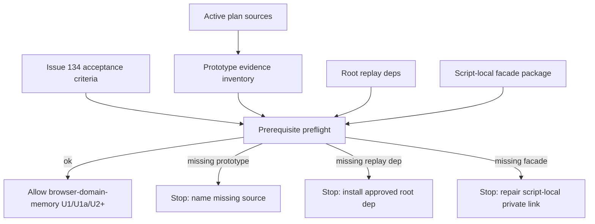

# feat: Make browser-domain-memory prerequisites executable

## Summary

Close issue #134 by turning the active browser-domain-memory plan's prerequisite work into an executable gate. The slice proves prototype evidence is available, installs the approved deterministic replay dependencies where runtime code can load them, and verifies the private facade CLI dependency from the script-local package surface before later implementation starts.

---

## Problem Frame

The active browser-domain-memory plan depends on prototype lifts and private/local package surfaces. If those sources are missing, a later agent can accidentally re-derive behavior from prose, import packages from the wrong place, or fail with low-signal TypeScript/package errors after real implementation has already begun.

Issue #134 narrows the immediate work to prerequisite readiness. Prototype recovery has already restored `prototypes/browser-use-uplift/` and `prototypes/build-scratch-handoff/` locally, with 57 files present in the working tree. The remaining work is to make that state durable and executable: missing evidence, missing replay dependencies, or missing private facade links must fail before U1/U1a/U2+ browser-domain-memory implementation begins.

---

## Requirements

### Prototype Evidence

- R1. Every prototype source named by `docs/plans/2026-05-31-001-feat-browser-domain-memory-plan.md` resolves from the repo or from a documented immutable artifact path.
- R2. A prerequisite preflight fails before later browser-domain-memory units run when required prototype evidence is missing, naming each missing source.
- R3. Restored prototype files become durable project evidence, not only untracked local state.

### Dependency Readiness

- R4. Root runtime dependencies include `@puppeteer/replay` and `puppeteer-core`, because deterministic replay needs Recorder JSON parsing/replay plus a direct browser driver.
- R5. Deterministic replay dependencies resolve from the runtime package surface that future `skills/browser-domain-memory/scripts/lib/replay-deterministic.ts` will use.
- R6. `@side-quest/cli-command-facade` resolves from `skills/browser-domain-memory/scripts/`, matching the script-local package pattern used by `skills/browser-use/scripts/`.
- R7. Missing private/facade dependencies fail with a clear setup diagnostic, not a raw module-resolution or TypeScript mystery error.

### Sequencing

- R8. The prerequisite gate is the first browser-domain-memory executable surface. Later units consume it instead of carrying ad hoc evidence/package checks.
- R9. The work does not implement capture, replay, memory storage, auth, or config behavior beyond readiness checks.

---

## Scope Boundaries

### In Scope

- Prototype evidence inventory and resolution checks for the sources cited by the active plan.
- Durable handling of the restored prototype directories or a documented immutable external artifact fallback.
- Script-local browser-domain-memory package scaffold only as needed for prerequisite checking.
- Root/package dependency readiness for deterministic replay.
- Facade link/package readiness diagnostics.

### Deferred to Follow-Up Work

- Actual browser-domain-memory CLI routes (`read`, `status`, `config:*`) from active plan U1a.
- Rich-step capture, dual-output projection, deterministic replay, runbook replay, healing, auth, storage, locks, and promotion.
- Publishing or vendoring `@side-quest/cli-command-facade` for portable off-machine validation.
- Backup posture for long-lived browser memory.

---

## Key Technical Decisions

- **Use a dedicated prerequisite preflight, not scattered setup prose.** A small executable gate gives later agents one thing to run and one failure shape to understand. This matches the active plan's "implementation must stop" boundary for U0 and U0c.
- **Keep prototype inventory in code, with prose pointing at it.** The required prototype list is a deterministic contract. Put the checkable list beside the preflight implementation, then let docs reference the gate instead of duplicating every path by hand.
- **Prefer restored local prototypes over an external artifact fallback.** The files are present locally now. Tracking them keeps later lifting simple. The immutable artifact path is only the fallback if the repo intentionally avoids carrying prototype sources.
- **Root deps for replay, script-local deps for facade.** `@puppeteer/replay` and `puppeteer-core` belong in root `package.json` because deterministic replay code imports them from the runtime tree. `@side-quest/cli-command-facade` belongs in `skills/browser-domain-memory/scripts/package.json`, matching `skills/browser-use/scripts/`.
- **Fail setup at the facade boundary.** The private package is not on the public npm registry. A missing link/package must produce an explicit setup error that names `@side-quest/cli-command-facade` and `skills/browser-domain-memory/scripts/`, not leak as an unresolved import from a later CLI module.

---

## High-Level Technical Design

The preflight owns only prerequisite truth. It proves sources and packages are available, then exits. It does not dispatch browser-domain-memory runtime commands.

---

## Implementation Units

### U1. Prototype Evidence Inventory

- **Goal:** Make the active plan's prototype dependencies explicit and checkable.
- **Requirements:** R1, R2, R3, R8
- **Dependencies:** none
- **Files:**
  - `prototypes/browser-use-uplift/` (track restored files or replace with immutable artifact reference)
  - `prototypes/build-scratch-handoff/` (track restored files or replace with immutable artifact reference)
  - `skills/browser-domain-memory/scripts/prerequisites.ts` (create)
  - `skills/browser-domain-memory/scripts/prerequisites.test.ts` (create)
  - `skills/browser-domain-memory/PROVENANCE.md` (modify if artifact fallback chosen)
- **Approach:** Define the required evidence inventory from the active plan's Sources and U0 references. Include the two restored prototype roots and the named subdirectories that later units lift from: recorder JSON, booking flow, runbook dual output, self-healing, consult gate, capture verify, staleness, provenance, reliable submit, live auth, success verify, op auth, lifecycle, journal tidy, crash safety, parallel spike, metrics, and build scratch handoff. If a prototype root is intentionally not committed, record one immutable artifact path with enough contents for code lift and make the inventory accept that fallback.
- **Patterns to Follow:** Active plan U0; `skills/browser-domain-memory/PROVENANCE.md` "Start Work"; repo rule "generated files name source" does not apply because these are restored prototype sources, not generated output.
- **Test Scenarios:**
  - Present roots: inventory check returns success when all required prototype paths exist under `prototypes/browser-use-uplift/` and `prototypes/build-scratch-handoff/`.
  - Missing root: removing or stubbing `prototypes/browser-use-uplift/` returns a failure naming that root.
  - Missing named subsource: removing one required subdirectory returns a failure naming that exact source.
  - Artifact fallback: configured immutable artifact path satisfies the inventory only when it names both required prototype roots and the contents needed for lift.
  - Local-only guard: untracked prototype evidence is not considered complete unless the implementation records how it will be preserved for later agents.
- **Verification:** A focused prerequisite test proves the restored 57-file prototype set satisfies the inventory, and a missing source failure names the missing path before any runtime implementation unit can proceed.

### U2. Prerequisite Preflight CLI Surface

- **Goal:** Provide the executable gate later units can run before touching browser-domain-memory runtime work.
- **Requirements:** R2, R7, R8, R9
- **Dependencies:** U1
- **Files:**
  - `skills/browser-domain-memory/scripts/package.json` (create)
  - `skills/browser-domain-memory/scripts/tsconfig.json` (create)
  - `skills/browser-domain-memory/scripts/preflight-prerequisites.ts` (create)
  - `skills/browser-domain-memory/scripts/preflight-prerequisites.test.ts` (create)
  - `skills/browser-domain-memory/scripts/browser-domain-memory-prerequisites.sh` (create)
  - `skills/browser-domain-memory/scripts/README.md` (create or update)
- **Approach:** Add a minimal script-local package so prerequisites can be tested and run without pretending the full browser-domain-memory CLI exists. The preflight returns a small machine-readable result with checks for prototype evidence, root replay deps, and script-local facade availability. The shell wrapper mirrors `skills/browser-use/scripts/preflight-warm-chrome.sh`: thin, predictable, and not a second CLI framework.
- **Execution Note:** Characterization-first against the failure shapes: write missing-prototype and missing-package tests before adding happy-path polish.
- **Patterns to Follow:** `skills/browser-use/scripts/preflight-warm-chrome.ts`, `skills/browser-use/scripts/preflight-warm-chrome.sh`, `skills/browser-use/scripts/package.json`, `skills/create-cli/scripts/package.json`.
- **Test Scenarios:**
  - Happy path: all prerequisites present returns success and lists checked surfaces.
  - Missing prototype: preflight exits non-zero and names the missing source.
  - Missing root replay dependency: preflight exits non-zero and names `@puppeteer/replay` or `puppeteer-core`.
  - Missing facade package: preflight exits non-zero and names `@side-quest/cli-command-facade` plus `skills/browser-domain-memory/scripts/`.
  - Wrapper pass-through: shell wrapper passes flags/args to the TypeScript entry without touching browser state.
  - Scope guard: preflight does not expose capture, replay, config, storage, auth, or promotion commands.
- **Verification:** Later browser-domain-memory units can depend on this one preflight result, and failure output gives the next repair action without reading TypeScript stack traces.

### U3. Deterministic Replay Dependency Readiness

- **Goal:** Install and verify the approved replay dependencies where deterministic runtime code will load them.
- **Requirements:** R4, R5, R8
- **Dependencies:** U2
- **Files:**
  - `package.json` (modify)
  - `bun.lock` (modify)
  - `skills/browser-domain-memory/scripts/preflight-prerequisites.ts` (modify)
  - `skills/browser-domain-memory/scripts/preflight-prerequisites.test.ts` (modify)
- **Approach:** Add `@puppeteer/replay` and `puppeteer-core` as root dependencies. Current package metadata checked on 2026-06-01 reports `@puppeteer/replay` 4.0.2 with optional peers `puppeteer >=25.0.0` and `lighthouse >=13.0.0`; `puppeteer-core` latest is 25.1.0. Keep the active plan's compatible-major posture unless implementation discovers a repo/tooling constraint. The preflight verifies both imports resolve from the future deterministic replay import surface and reports the installed versions.
- **Patterns to Follow:** Active plan KTD "Declare BOTH"; Puppeteer docs for connecting to an existing browser via `connect`; repo dependency rule requiring approval before package mutation.
- **Test Scenarios:**
  - Both deps present: preflight reports versions and success.
  - `@puppeteer/replay` missing: preflight fails with a setup diagnostic naming root `package.json`.
  - `puppeteer-core` missing: preflight fails with a setup diagnostic explaining that `puppeteer` is an optional peer and no driver exists without `puppeteer-core`.
  - Import surface: a dynamic import check resolves from repo root, not from `skills/create-cli/scripts/node_modules`.
  - Lockfile: dependency install updates `bun.lock` consistently with `package.json`.
- **Verification:** Root runtime can import both replay packages before U2/U3 deterministic code in the active plan imports them.

### U4. Script-Local Facade Package Readiness

- **Goal:** Prove the future facade CLI can import the private facade package from the browser-domain-memory script-local package.
- **Requirements:** R6, R7, R8
- **Dependencies:** U2
- **Files:**
  - `skills/browser-domain-memory/scripts/package.json` (modify)
  - `skills/browser-domain-memory/scripts/tsconfig.json` (modify)
  - `skills/browser-domain-memory/scripts/preflight-prerequisites.ts` (modify)
  - `skills/browser-domain-memory/scripts/preflight-prerequisites.test.ts` (modify)
- **Approach:** Add `@side-quest/cli-command-facade` to `skills/browser-domain-memory/scripts/package.json`, not root and not via `skills/create-cli/scripts/node_modules`. Treat it as a private machine-local package for now. The preflight checks that the package resolves from `skills/browser-domain-memory/scripts/`, reads its package metadata, and confirms public imports used by the facade contract path are available. If the package is absent, point to the script-local package surface and private-link repair, not to a generic package manager failure.
- **Patterns to Follow:** `skills/browser-use/scripts/package.json`, `skills/create-cli/scripts/package.json`, `skills/create-cli/references/cli-command-facade.md`, ADR-0007.
- **Test Scenarios:**
  - Facade present: preflight resolves `@side-quest/cli-command-facade` from `skills/browser-domain-memory/scripts/`.
  - Facade absent: preflight fails with a clear setup diagnostic and no TypeScript stack.
  - Wrong surface: a facade found only in `skills/create-cli/scripts/node_modules` does not satisfy readiness.
  - Public API: `defineCommandFacadeContract` and the public package entry resolve; no deep imports required.
  - Typecheck readiness: script-local TypeScript config includes the node/Bun types needed to follow the facade import edge.
- **Verification:** U1a can create `command-contract.ts` under `skills/browser-domain-memory/scripts/` without inventing a new dependency surface or borrowing create-cli's package link.

### U5. Readiness Wiring and Documentation

- **Goal:** Make the prerequisite gate discoverable as the start point for later browser-domain-memory work.
- **Requirements:** R2, R7, R8, R9
- **Dependencies:** U1, U2, U3, U4
- **Files:**
  - `skills/browser-domain-memory/SKILL.md` (modify)
  - `skills/browser-domain-memory/PROVENANCE.md` (modify)
  - `docs/plans/2026-05-31-001-feat-browser-domain-memory-plan.md` (modify only if the active plan needs a pointer to the new gate)
  - `docs/plans/2026-06-01-001-feat-browser-domain-memory-prerequisites-plan.md` (modify if implementation discoveries change this plan)
- **Approach:** Point the browser-domain-memory stub at the prerequisite preflight before "Start Work" enters U1/U1a/U2. Keep the prose lean: name the command/path and the stop condition, then let the executable preflight own the deterministic contract. If the active plan is updated, add only a pointer from U0/U0c to the new preflight; do not copy its check list into the master plan.
- **Patterns to Follow:** Work style rules for skill/provenance edits; no-parallel-policy; active plan U0/U0c.
- **Test Scenarios:**
  - Stub guidance: `skills/browser-domain-memory/SKILL.md` tells agents to run/read the prerequisite gate before implementation.
  - No duplication: docs do not carry a second hand-maintained copy of the prototype/dependency inventory.
  - YAML frontmatter: skill frontmatter remains YAML-parseable after edits.
  - Issue trace: #134 acceptance criteria map to the gate and package checks.
- **Verification:** A new agent starting from the browser-domain-memory stub can find the prerequisite preflight and gets an early, specific stop on missing evidence or packages.

---

## System-Wide Impact

- **Later agent reliability:** The preflight changes failure timing. Missing evidence or package posture stops before architectural units begin, reducing re-derivation and wrong-import risk.
- **Package graph:** Root `package.json` gains deterministic replay runtime deps. `skills/browser-domain-memory/scripts/package.json` gains the private facade dependency and local dev tooling.
- **Private dependency portability:** The facade package is private and machine-local today. This plan makes the local failure clear; it does not solve off-machine portability.
- **Working tree awareness:** Prototype evidence currently exists as untracked files. Implementation must preserve user work and stage only intentional files if a commit follows.

---

## Risks & Dependencies

- **Branch/source mismatch:** Issue #134 says the active `2026-05-31` master plan is on `main`, but a fresh fetch of `origin/main` did not include that path. The current branch contains the plan and the issue comment names it as source of truth. Reconcile branch policy before committing if this matters for merge destination.
- **Dependency approval boundary:** The active plan and #134 approve the need for `@puppeteer/replay`, `puppeteer-core`, and the facade package posture. If implementation happens outside that issue context, ask before mutating package manifests.
- **Private facade link:** `@side-quest/cli-command-facade` resolves locally for `skills/browser-use/scripts/` and `skills/create-cli/scripts/` through a symlink to `side-quest-engineering`. The browser-domain-memory script package needs its own surface and diagnostic.
- **Bun/Node compatibility:** `@puppeteer/replay` and `puppeteer-core` must resolve under the repo's Bun/TypeScript setup before deterministic replay code lands. This issue checks import readiness only; the warm-Chrome replay spike remains active plan U3.
- **Prototype retention choice:** Tracking the restored prototypes is simplest. Choosing an external immutable artifact path instead adds discovery friction for future agents and must include enough contents to lift behavior without re-deriving it.

---

## Sources & Research

- Issue: `https://github.com/nathanvale/claude-code-config/issues/134`.
- Active plan: `docs/plans/2026-05-31-001-feat-browser-domain-memory-plan.md`.
- Browser-domain-memory stub: `skills/browser-domain-memory/SKILL.md`, `skills/browser-domain-memory/PROVENANCE.md`.
- Facade patterns: `skills/browser-use/scripts/`, `skills/create-cli/scripts/`, `skills/create-cli/references/cli-command-facade.md`, ADR-0007.
- Warm Chrome boundary: `skills/browser-use/SKILL.md`, `skills/browser-use/references/warm-chrome.md`, ADR-0006.
- Restored local prototype evidence: `prototypes/browser-use-uplift/`, `prototypes/build-scratch-handoff/` (57 files present on 2026-06-01).
- Package metadata checked 2026-06-01 with `bun pm view`: `@puppeteer/replay` 4.0.2, `puppeteer-core` 25.1.0, `@puppeteer/replay` optional peers include `puppeteer >=25.0.0` and `lighthouse >=13.0.0`.
- Puppeteer docs via Context7: `puppeteer-core` is the no-browser-download package for driving existing DevTools-compatible browsers; `connect` attaches to a running browser via WebSocket endpoint.
