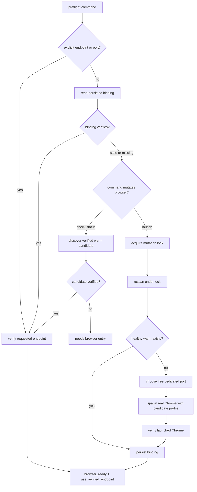

# fix: Own Warm Chrome port lifecycle

## Summary

Add an agent-owned Warm Chrome port/profile binding so `browser-use` stops guessing CDP ports. The resolver will allocate the first cold-start port under a mutation lock, persist the chosen port and profile as one unit, and make later `check`, `status`, `repair`, and `launch` runs read that binding before falling back to discovery or operator input.

This fixes issue #149 by moving the design above default values: `9444` and `9223` become bootstrap candidates, not competing sources of truth.

---

## Problem Frame

Warm Chrome already has a strong per-command safety proof: real Google Chrome, loopback CDP, dedicated persistent profile, owner-only permissions, and browser-level websocket discovery. The missing layer is ownership of the endpoint being verified.

Today the CLI chooses a hardcoded fallback port when the caller omits `--port`, while docs describe a different observed warm port. `launch` can then turn a wrong operator-supplied port into a new empty Chrome, even while the real warm instance is healthy elsewhere. The port and profile are fragmented too: `launch-agent-chrome.sh` defaults to one profile, docs describe another, and `DevToolsActivePort` is treated as a hint rather than an authority.

The fix is a lifecycle contract: choose a dedicated port on the first cold-to-warm transition, bind it to the dedicated profile, persist that binding, and make every later command resolve through that binding instead of prose defaults.

---

## Requirements

### Endpoint Ownership

- R1. Warm Chrome has exactly one active `Warm Chrome Binding` that treats CDP port and Chrome profile as one unit.
- R2. The binding survives shells and agent sessions.
- R3. Binding mutation is serialized so two launches cannot claim competing ports concurrently.
- R4. A bound port occupied by non-Warm-Chrome is treated as a stale binding, never as reusable Chrome.
- R5. Only `launch` writes or replaces the `Warm Chrome Binding`.
- R6. `launch` waits briefly on a live mutation lock, then re-resolves before deciding to spawn or fail.
- R7. The binding stores locator fields plus last-writer metadata, never proof snapshots.
- R8. Corrupt or stale binding files are replaced only by a successful `launch` after proof.

### Resolution Behavior

- R9. Explicit `--endpoint` or `--port` remains the highest-precedence operator input for the current run only.
- R10. With no explicit endpoint or port, commands resolve from the persisted binding before env vars or hardcoded bootstrap candidates.
- R11. Discovery accepts only verified Warm Chrome candidates, using the existing proof checks instead of a second verifier.
- R12. `check` and `status` never spawn Chrome or persist a `Warm Chrome Binding` while resolving a missing or stale binding.
- R13. `repair` uses an explicit endpoint or healthy resolved binding; when no healthy target exists, it fails and points to `launch`.
- R14. Stale binding read-only failures use the existing `launch_warm_chrome` recovery action.
- R15. Explicit `--profile` is a current-run expectation; if it conflicts with a healthy binding, the command fails with profile mismatch.
- R16. Explicit wrong port recovery is `launch`-only; `check`, `status`, and `repair` stay strict about their requested endpoint.
- R17. Successful wrong-port `launch` recovery returns `browser_ready` with `launch_performed=false`.

### Launch Behavior

- R18. `launch` reuses an existing healthy Warm Chrome on the bound or discovered endpoint instead of spawning.
- R19. `launch` refuses to spawn onto an occupied non-Warm-Chrome port.
- R20. `launch` refuses to spawn a redundant competitor when a healthy Warm Chrome exists elsewhere.
- R21. `launch` may replace a stale binding with a newly allocated free port after proving the old bound port is not healthy Warm Chrome.
- R22. `launch` may adopt an existing healthy Warm Chrome from narrow bootstrap discovery after proof.
- R23. First cold launch allocates a free dedicated port, starts real Google Chrome with the resolved profile, verifies the result, then persists the binding.

### Single Source of Truth

- R24. The 9223/9444 disagreement is collapsed into resolver-owned bootstrap candidates.
- R25. Docs reference the resolver and command output, not a hand-maintained current port.
- R26. `launch-agent-chrome.sh` remains as a thin compatibility wrapper and stops owning separate port/profile defaults.
- R27. Exact adoption candidates and allocation ranges are code-owned, not restated in hand-maintained docs.
- R28. `BROWSER_USE_CDP_PORT` and `BROWSER_USE_PROFILE_DIR` remain bootstrap hints only when no healthy binding exists.
- R29. `launch` holds the mutation lock through allocation, spawn, Warm Chrome proof, and binding write.
- R30. First cold `launch` may use a code-owned default dedicated profile path when no binding, explicit profile, or env profile exists.
- R31. Existing Chrome profile directories are adopted only by proving a live Warm Chrome; they are never moved or copied.
- R32. Success data includes `resolution_source` as endpoint-selection provenance when the existing facade envelope accepts it.

---

## Scope Boundaries

### In Scope

- Warm Chrome preflight CLI resolution and launch lifecycle.
- Agent-owned binding and allocation lock.
- Existing launch helper alignment.
- Warm Chrome docs and command contract wording.
- Focused test coverage for resolver, lock, discovery, and launch reuse behavior.

### Deferred to Follow-Up Work

- Multi-profile fleet support.
- User-facing `--force-new-binding` or second-instance workflow.
- Generic facade schema changes for richer endpoint-resolution metadata.
- Shell dotfile export of `BROWSER_USE_CDP_PORT`.
- Cross-platform lock behavior beyond current macOS runtime.

### Out of Scope

- Switching browser adapters.
- Browser-domain-memory capture or replay implementation.
- Attaching to the user's everyday Chrome profile.
- Killing Chrome processes as part of stale-state cleanup.
- Moving or copying existing Chrome profile directories.

---

## Key Technical Decisions

- **Use one durable binding plus a short-lived mutation lock.** The persisted `Warm Chrome Binding` is the singleton authority for the selected port/profile. A lock directory serializes `launch` ownership windows such as allocation and stale recovery through proof and binding write. Chrome's bound listener is the runtime exclusivity mechanism.
- **Wait briefly on live lock contention.** A second `launch` should wait for a bounded interval, then re-read and re-verify the binding before deciding. It must not block indefinitely.
- **Store state outside the Chrome profile.** Put the binding at `$XDG_STATE_HOME/browser-use/warm-chrome-binding.json`, falling back to `$HOME/.local/state/browser-use/warm-chrome-binding.json`. Keeping it outside `DevToolsActivePort` avoids making Chrome's own hint file the source of truth.
- **Keep binding schema as locator plus last-writer metadata.** The binding stores enough to find the candidate endpoint/profile and diagnose who last claimed it. It must not store websocket URLs, browser PID, target counts, or last-proof snapshots as authority.
- **Keep the profile and port inseparable.** The resolver returns a binding, not a naked port. A bound port with a mismatched profile is a conflict, not a partial success.
- **Treat explicit profile as expectation, not rebind request.** If the user supplies `--profile` and a healthy binding points elsewhere, fail with profile mismatch instead of rebinding or ignoring the input.
- **Treat explicit endpoint input as a per-run override.** A successful explicit `--endpoint` or `--port` proves that run only. It does not rewrite the `Warm Chrome Binding` unless `launch` intentionally claims the verified endpoint. `launch` may recover from a wrong explicit port by reusing a healthy binding; read-only and repair commands stay strict.
- **Keep env vars as bootstrap hints.** `BROWSER_USE_CDP_PORT` and `BROWSER_USE_PROFILE_DIR` help before a healthy binding exists. They do not override a verified binding.
- **Keep the default profile path code-owned and durable-data shaped.** First cold launch may create or reuse a resolver-owned dedicated profile path with application-support semantics, not cache semantics. Docs must not promote the exact path into a second source of truth.
- **Adopt live profiles, never migrate profile files.** Existing Chrome profile directories may be claimed only when an already-running Warm Chrome proves healthy. The implementation must not move or copy Chrome profile directories.
- **Recover hijacked ports by replacing the binding, not by trusting the port.** If the bound port is now occupied by a non-Warm-Chrome listener, `check` and `status` fail read-only, while `launch` can allocate a different free port and replace the stale `Warm Chrome Binding`.
- **Use Warm Chrome Preflight as the binding verifier.** The binding is a pointer, not proof. Resolution checks must call through the same Warm Chrome proof path adapters already trust, rather than adding a weaker port/listener-only verifier.
- **Expose resolution provenance without making it proof.** Add `resolution_source` to success `data` if local facade validation accepts it. It explains how the endpoint was selected; readiness still comes from Warm Chrome proof fields.
- **Keep repair target-bound.** `repair` may fix profile proof for an explicit endpoint or healthy binding, but it does not discover, adopt, allocate, or replace the `Warm Chrome Binding`. Missing or stale ownership state routes to `launch`.
- **Use existing recovery actions.** Stale binding failures in `check`, `status`, or targetless `repair` should point at `launch_warm_chrome`; diagnostics can explain stale binding or listener conflict without adding a new action vocabulary.
- **Persist bindings only after proof.** Cold launch keeps allocation under the mutation lock until Chrome starts and Warm Chrome proof passes. Failed spawn or failed proof leaves no new durable binding.
- **Overwrite bad binding only after successful launch proof.** Corrupt or stale binding files stay in place for read-only commands. `launch` atomically replaces them only after it proves a reusable or newly started Warm Chrome.
- **Separate adoption candidates from allocation range.** `launch` may adopt an existing healthy Warm Chrome only from the fixed bootstrap candidate list. Cold allocation may use a small reserved range, but range ports are not adoption candidates unless explicitly configured. The exact list and range are code-owned.
- **Make `9444` a preferred bootstrap candidate, not a constant default.** The resolver should try the observed warm path first for compatibility, then legacy candidates. Once a binding exists, candidates are irrelevant.
- **Reuse current proof code for discovery.** Discovery may probe candidate ports, but a candidate becomes authoritative only after the existing verify path proves real Chrome, loopback CDP, browser-level websocket, and a safe dedicated profile.
- **Do not add multi-instance force in this fix.** Issue #149 is about preventing accidental competitors. A deliberate second Warm Chrome needs a separate product decision around profile identity and adapter routing.
- **Keep facade compatibility.** Continue emitting the existing success envelope and `use_verified_endpoint` runtime action. Add resolver metadata only if the local facade contract accepts it without inventing a parallel envelope.

---

## High-Level Technical Design

The read path may discover and return a verified candidate, but it does not persist the `Warm Chrome Binding`. Binding writes stay with `launch`.

---

## Implementation Units

### U1. Warm Chrome Binding Resolver

- **Goal:** Introduce a central resolver that returns the effective endpoint, port, profile, and resolution source for every command.
- **Requirements:** R1, R2, R9, R10, R11, R14, R15, R16, R24, R28, R32
- **Files:**
  - `skills/browser-use/scripts/preflight-warm-chrome.ts`
  - `skills/browser-use/scripts/preflight-warm-chrome.test.ts`
- **Approach:** Replace inline `BROWSER_USE_CDP_PORT || DEFAULT_PORT` resolution with a resolver. Preserve explicit `--endpoint` and `--port` precedence. When no explicit endpoint exists, read the binding, then env hints, then fixed discovery/bootstrap candidates. Validate bound and discovered candidates by calling through the same Warm Chrome proof path used before Browser Adapter work. Keep bootstrap constants in runtime code, not docs.
- **Patterns to follow:** Existing `normalizeEndpoint`, `validateProfilePath`, `verifyWarmChrome`, and `PreflightRuntime` injection style.
- **Test Scenarios:**
  - Bare `check --json` uses a valid persisted binding and returns its port/profile.
  - Success data reports `resolution_source` when the envelope accepts that command-specific field.
  - Explicit `--port` overrides a persisted binding for the current run without rewriting it.
  - Explicit `--endpoint` overrides binding and env input for the current run without rewriting it.
  - Explicit `--profile` conflicting with a healthy binding fails with profile mismatch.
  - `check`, `status`, and `repair` with an explicit wrong port fail against that requested endpoint instead of silently switching to the binding.
  - Binding beats stale `BROWSER_USE_CDP_PORT` when no explicit input exists.
  - With no binding, env port/profile still work for backward compatibility.
  - With no binding or env, the resolver can discover and return a verified warm candidate on the preferred bootstrap port without writing state.
  - Discovery rejects a candidate whose listener fails existing Warm Chrome proof.
  - `repair` without explicit endpoint and without a healthy binding fails with a launch recovery action.
  - Stale binding read-only failure includes `launch_warm_chrome` and does not include a new reclaim action.
- **Verification:** Focused tests prove no command path still falls directly to a hardcoded naked port.

### U2. Durable Binding and Mutation Lock

- **Goal:** Add the persistent state and lock mechanics that make port/profile ownership explicit and race-safe.
- **Requirements:** R1, R2, R3, R4, R5, R6, R7, R8, R23, R29
- **Files:**
  - `skills/browser-use/scripts/preflight-warm-chrome.ts`
  - `skills/browser-use/scripts/preflight-warm-chrome.test.ts`
- **Approach:** Extend `PreflightRuntime` with small filesystem primitives for reading, writing, atomic rename, directory lock acquire/release, and stale-lock inspection. Store the binding as JSON at `$XDG_STATE_HOME/browser-use/warm-chrome-binding.json`, falling back to `$HOME/.local/state/browser-use/warm-chrome-binding.json`. Use an atomic lock directory for `launch` ownership windows and atomic write/rename for the binding file. Treat stale locks as recoverable only when the recorded owner is gone and the bound endpoint is not healthy.
- **Patterns to follow:** Existing runtime dependency injection and test doubles. Existing redaction posture: diagnostics may name resolution source and port, but not full profile paths.
- **Test Scenarios:**
  - First writer creates a binding atomically.
  - Concurrent launch sees a live mutation lock and does not allocate a second port.
  - Concurrent launch waits briefly for the live lock, then re-resolves and reuses the newly written binding when it verifies.
  - Concurrent launch fails with diagnostics rather than blocking indefinitely when the lock remains live past the bounded wait.
  - Stale lock with no healthy bound Chrome can be recovered.
  - Stale lock with healthy bound Chrome resolves to reuse, not relaunch.
  - Corrupt binding file fails loud with an inspect/repair-style action instead of silently falling back.
  - Corrupt binding file remains untouched until a successful `launch` replaces it atomically.
  - Binding writes do not leak profile paths into diagnostics.
  - Binding data contains locator and last-writer categories, not proof snapshots.
- **Verification:** Unit tests cover lock acquisition, stale recovery, corrupt state, and atomic binding writes through injected runtime methods.

### U3. Cold Allocation and Discovery Policy

- **Goal:** Choose, claim, and persist a dedicated port on first cold launch without assuming preferred ports are free.
- **Requirements:** R3, R5, R11, R19, R23, R24, R29, R30, R31
- **Files:**
  - `skills/browser-use/scripts/preflight-warm-chrome.ts`
  - `skills/browser-use/scripts/preflight-warm-chrome.test.ts`
- **Approach:** Under the mutation lock, rescan the fixed adoption candidates first. If no healthy Warm Chrome exists, allocate the preferred port when free, otherwise scan a small reserved range for a free port. A free port means no listener. An occupied candidate that does not verify is skipped for allocation unless it is the explicit requested port, where it remains a conflict.
- **Patterns to follow:** Existing `findListener` conflict handling and `endpointAnswers` probe behavior.
- **Test Scenarios:**
  - First cold `launch` picks preferred bootstrap port when free.
  - First cold `launch` uses the code-owned default dedicated profile path when no profile is supplied.
  - The code-owned default dedicated profile path is not under a cache-semantics root.
  - Explicit or env profile still wins before a binding exists and is recorded in the binding after proof.
  - If preferred port is occupied by a non-CDP process, `launch` picks another free candidate.
  - If a narrow bootstrap candidate has healthy Warm Chrome, `launch` persists the binding and reuses it instead of allocating.
  - A healthy Chrome on an arbitrary non-bootstrap port is not adopted by discovery.
  - Existing profile directories are not moved or copied into the code-owned default profile path.
  - If explicit `--port` is occupied by a non-Warm-Chrome listener, `launch` fails and spawns nothing.
  - Range ports are used for free-port allocation, not adoption discovery.
  - If the allocation range is exhausted, `launch` fails with a browser-entry error and no spawn.
  - Allocation persists the chosen port/profile only after successful Warm Chrome proof.
  - Spawn failure or failed proof leaves no new durable binding.
- **Verification:** Tests assert spawn input, binding contents, and no-spawn paths for occupied ports.

### U4. Launch Reuse and Competitor Refusal

- **Goal:** Make `launch` idempotently reuse the bound or discovered Warm Chrome and reject accidental second instances.
- **Requirements:** R5, R12, R15, R16, R17, R18, R19, R20, R21, R22, R23, R29, R32
- **Files:**
  - `skills/browser-use/scripts/preflight-warm-chrome.ts`
  - `skills/browser-use/scripts/preflight-warm-chrome.test.ts`
- **Approach:** Before spawning, `launch` validates requested Chrome binary/profile safety, resolves the binding, and scans for healthy Warm Chrome candidates using Warm Chrome Preflight proof. If a healthy candidate exists on another port, return the existing `browser_ready` success shape with `launch_performed=false`. If the requested profile conflicts with the healthy binding, fail or point at the verified binding rather than spawning. Do not implement a second-instance escape hatch in this issue.
- **Patterns to follow:** Existing `launchIfNeeded` reuse branch and `use_verified_endpoint` success action.
- **Test Scenarios:**
  - `launch --port {wrong-port}` returns the existing verified warm endpoint when one is already healthy elsewhere and no profile conflict is supplied.
  - Wrong-port recovery success reports `launch_performed=false`, not an error.
  - `launch` with no explicit port reads the binding and spawns nothing when it verifies.
  - `launch` with a stale binding and no healthy candidate allocates once under lock.
  - `launch` with a bound port now occupied by non-Warm-Chrome allocates a different free port and replaces the binding.
  - `launch` with missing binding adopts a healthy narrow bootstrap candidate and reports `launch_performed=false`.
  - Unsafe `--chrome` remains rejected before any reuse success.
  - Profile mismatch with a healthy binding does not spawn a competitor.
  - Explicit `--profile` mismatch reports input conflict and leaves the binding untouched.
  - JSON success still validates against the facade envelope.
  - `resolution_source` describes endpoint selection and is not used as readiness proof.
- **Verification:** Focused launch tests prove the live #149 incident cannot create an empty competing Chrome.

### U5. Shell Helper and Contract Surface Alignment

- **Goal:** Remove the shell helper as a second owner of Warm Chrome defaults while preserving its operator affordance.
- **Requirements:** R24, R25, R26, R27, R28, R30
- **Files:**
  - `skills/browser-use/scripts/launch-agent-chrome.sh`
  - `skills/browser-use/scripts/preflight-warm-chrome.sh`
  - `skills/browser-use/scripts/command-contract.ts`
  - `skills/browser-use/scripts/preflight-warm-chrome.test.ts`
- **Approach:** Keep `launch-agent-chrome.sh` as a thin compatibility wrapper that delegates to the preflight launch command or reads the resolver-owned binding instead of carrying its own `PORT=9223` and profile default. Preserve positional `PORT` / `PROFILE_DIR` as explicit per-run inputs mapped to preflight flags, not as wrapper defaults. Update command usage text only where the CLI actually changed. If resolver metadata needs new public fields, keep it inside `data` only when facade validation accepts it.
- **Patterns to follow:** Existing shell wrapper pass-through tests for version/help and existing command contract tests.
- **Test Scenarios:**
  - `launch-agent-chrome.sh` no longer contains a hardcoded default port/profile pair that can drift from preflight.
  - Positional `PORT` / `PROFILE_DIR` still work and map to explicit preflight flags for that run.
  - Shell invocation still launches or reuses Warm Chrome through the preflight command.
  - Command contract env var descriptions remain truthful but do not claim env vars are the authority.
  - Help text does not hardcode the default profile path.
  - Help text points operators at resolver behavior rather than a literal current port.
- **Verification:** Shell wrapper tests pass and a source scan finds no remaining independent `9223`/`9444` default owner outside resolver tests/docs examples.

### U6. Warm Chrome Documentation Update

- **Goal:** Document the lifecycle contract without duplicating runtime state or candidate lists in prose.
- **Requirements:** R24, R25, R26, R27, R30
- **Files:**
  - `skills/browser-use/references/warm-chrome.md`
  - `skills/browser-use/SKILL.md`
  - `docs/adr/0006-warm-chrome-via-dedicated-debug-profile.md`
- **Approach:** Replace "Current Known Endpoints" as an authority with "resolver-owned binding" guidance. Keep ADR-0006 focused on why the profile must be dedicated, adding only a short pointer that port ownership is handled by the preflight resolver. Avoid restating the candidate list, allocation range, or binding schema in prose.
- **Patterns to follow:** No-parallel-policy guidance in `AGENTS.md`: deterministic state and action membership live in code, docs describe intent and stop conditions.
- **Test Scenarios:**
  - Docs no longer state a hand-maintained active port as the current truth.
  - Docs explain bare `check`/`status` resolve through the binding.
  - Docs state `DevToolsActivePort` remains adapter hint material, not lifecycle authority.
  - Docs do not hand-maintain adoption candidate lists, allocation ranges, or default profile paths.
  - Skill frontmatter remains YAML-parseable.
- **Verification:** Markdown scan confirms no prose-owned active port table remains.

### U7. Regression Verification

- **Goal:** Prove the lifecycle change preserves existing Warm Chrome safety while closing #149.
- **Requirements:** R1 through R32
- **Files:**
  - `skills/browser-use/scripts/preflight-warm-chrome.test.ts`
  - `skills/browser-use/scripts/preflight-warm-chrome.ts`
  - `skills/browser-use/scripts/command-contract.ts`
  - `skills/browser-use/references/warm-chrome.md`
- **Approach:** Run the focused browser-use script tests, script-local type check, and Biome lint/format checks after implementation. Add a source scan for drift-prone constants. Keep any facade schema limitations as deferred notes rather than custom envelope fields.
- **Test Scenarios:**
  - Bare `check` finds the healthy warm instance when the binding exists.
  - Bare `check` can discover and return a verified existing warm instance when binding is absent, without writing state.
  - Wrong-port `launch` cannot spawn a redundant empty Chrome while a healthy warm instance exists elsewhere.
  - Stale binding detection uses the same Warm Chrome proof checks as adapter readiness, not a listener-only shortcut.
  - Existing safety cases remain green: default profile rejection, Chrome for Testing rejection, loopback enforcement, browser-level websocket enforcement, and owner-only profile repair.
  - No independent hardcoded default port/profile owner remains outside resolver-owned code.
- **Verification:** Focused tests, type check, and lint/format checks pass.

---

## Acceptance Examples

- AE1. Given a persisted binding for a healthy Warm Chrome, when an agent runs bare `preflight check --json`, then the result points at the bound endpoint and emits `use_verified_endpoint`.
- AE2. Given no binding but a healthy Warm Chrome on the preferred bootstrap port, when an agent runs bare `preflight check --json`, then the resolver verifies and returns that endpoint without spawning or writing state.
- AE3. Given no binding and the preferred port is occupied by a non-Warm-Chrome listener, when an operator runs `launch`, then the resolver chooses another free dedicated port and spawns once.
- AE4. Given a healthy binding, when an operator runs `launch --port {wrong-port} --profile {wrong-profile}`, then the command fails with profile mismatch, leaves the binding untouched, and does not spawn a second Chrome.
- AE5. Given a stale binding whose old port is now occupied by another process, when `launch` runs, then it does not attach to that listener and does not spawn onto the occupied port.
- AE6. Given no binding and a healthy Warm Chrome on a narrow bootstrap candidate, when an operator runs `launch`, then it persists the binding and reports `launch_performed=false`.
- AE7. Given a healthy Warm Chrome on one port, when an operator runs `launch --port {wrong-port}` with no conflicting profile, then the command returns or points at the verified warm endpoint and does not spawn a second Chrome.
- AE8. Given two agents start `launch` at the same time on a cold machine, when the mutation lock is acquired by one run, then the other run waits, reuses, or fails without claiming a second port.

---

## System-Wide Impact

- **Agent reliability:** Fresh agents stop depending on operator memory for the active port.
- **Browser safety:** The hard invariant remains dedicated real Chrome, dedicated profile, loopback CDP, and no everyday profile attachment.
- **Operator UX:** Bare `check` becomes the normal path. `launch` becomes safe to run without accidentally minting an empty competitor.
- **Docs maintenance:** Port/profile facts move from prose to resolver-owned runtime state.
- **Adapter compatibility:** Adapters still consume the verified endpoint and do not own launch policy.

---

## Risks & Dependencies

- **Lock semantics overfit:** A held lock for the whole Chrome lifetime would block benign checks. Use a mutation lock plus durable binding, not a long-running process lock.
- **False stale recovery:** Removing state while Chrome is healthy would break the warm session. Always verify the endpoint before replacing a binding.
- **Discovery too broad:** Auto-claiming any real Chrome with a non-default profile could attach to an unintended debug Chrome. Keep discovery limited to resolver-owned bootstrap inputs and existing proof.
- **Facade schema limits:** If richer resolver fields are rejected by `@side-quest/cli-command-facade`, defer schema work rather than adding a custom result shape.
- **Shell helper drift:** Leaving `launch-agent-chrome.sh` with separate defaults recreates the same bug. It must delegate or become a thin compatibility wrapper.

---

## Sources

- Issue: `https://github.com/nathanvale/claude-code-config/issues/149`
- `skills/browser-use/scripts/preflight-warm-chrome.ts`
- `skills/browser-use/scripts/preflight-warm-chrome.test.ts`
- `skills/browser-use/scripts/launch-agent-chrome.sh`
- `skills/browser-use/scripts/command-contract.ts`
- `skills/browser-use/references/warm-chrome.md`
- `docs/adr/0006-warm-chrome-via-dedicated-debug-profile.md`
- `docs/adr/0008-browser-use-owns-warm-chrome-binding-lifecycle.md`
- `docs/research/2026-05-30-browser-use-warm-chrome-findings.md`
