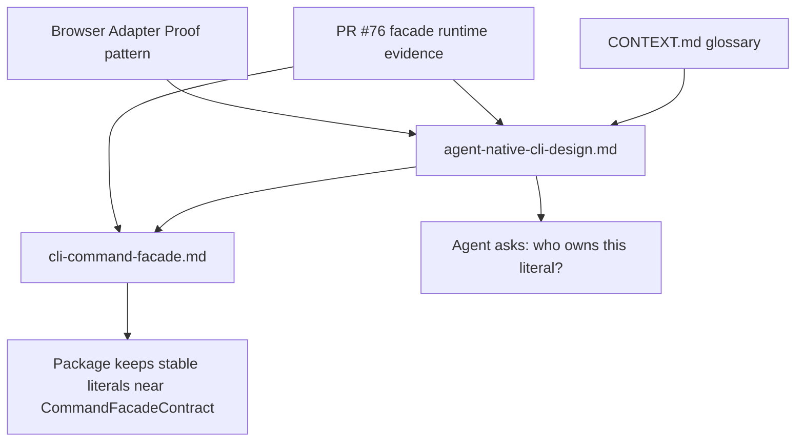

# docs: Sync cli-author result vocabulary guidance

## Summary

Update the local cli-author extension docs so they reflect the shipped PR #76 facade runtime contract and teach agents where package-owned result vocabulary belongs. Keep the change small: glossary sync, design-layer guidance, facade implementation pointer, and no new schema or example surface.

---

## Problem Frame

PR #76 hoisted several cli-author design-layer candidates into `@side-quest/cli-command-facade`: baseline exit semantics, diagnostic capability role, diagnostic trail reference, and write preview capability. The current cli-author references still contain pre-PR wording such as `contract candidate` and "declare, don't enforce" in places where the facade now validates runtime contract shape.

Browser Adapter Proof exposed a second gap. Stable package literals can drift into generic cli-author prose unless the docs name their owner. The plan updates cli-author so agents ask "who owns this literal?" before writing docs, tests, schemas, or adapters.

---

## Requirements

**Runtime Sync**

- R1. Update cli-author reference wording for the now-runtime-backed baseline exits, diagnostic capability, diagnostic trail pointer, and write preview capability.
- R2. Preserve "declare, don't enforce" only where it remains true: output modes, interactivity stance, environment variables, and package-owned runtime behavior.
- R3. Describe baseline exit codes `"0"`, `"1"`, and `"2"` as facade-owned required meanings: success, generic or runtime failure, and invalid usage.
- R4. Keep extra numeric exit codes package-owned and justified by distinct routing value.

**Package-Owned Result Vocabulary**

- R5. Define or preserve `Package-owned result vocabulary` as durable glossary language in `CONTEXT.md`.
- R6. Teach the design-layer boundary between facade-owned contract shape, package-owned result vocabulary, and private implementation detail.
- R7. Tell agents to keep stable package literals near the package `CommandFacadeContract`: same module for small packages, adjacent contract-owned module when the vocabulary grows.
- R8. Avoid package-specific literal values, full schemas, allowed-value lists, and runtime envelope examples in cli-author prose.

**Diagnostic and Mutation Boundaries**

- R9. Describe runtime-backed `diagnostic_trail` as a same-run pointer to a diagnostic capability only.
- R10. Exclude raw logs, trace URLs, retention, access, deletion, and platform policy from diagnostic trail guidance.
- R11. Describe write preview enforcement from honestly declared `sideEffects`: `write` and `destructive` require `check`, `dry_run`, or safe-text `previewExemption`.
- R12. Warn that cli-author guidance must not replace honest side-effect metadata with route-name inference or generic mutation vocabulary.

**No Parallel Policy**

- R13. Leave `skills/cli-author/SKILL.md` unchanged; it already routes to the local references.
- R14. Do not add a new reference file, ADR, schema extension, global vocabulary registry, or playground refresh.
- R15. Cite Browser Adapter Proof only as a pattern sentence, with no path, values, or excerpt.
- R16. Mention `capabilityRoles: ["diagnostic"]` only in the facade reference, not the design-layer doc.

---

## Key Technical Decisions

- **Design-layer owns judgment; facade reference owns field mapping.** `agent-native-cli-design.md` should carry the primary "who owns this literal?" guidance. `cli-command-facade.md` should map the settled runtime fields and implementation placement near `resultContract` without reteaching the full ownership model.
- **Runtime-backed wording follows PR #76 exactly.** Baseline exits, diagnostic capability role, diagnostic trail reference, and write preview capability are not candidates in cli-author guidance anymore. The docs point to facade runtime ownership for exact shape and validation.
- **Package-owned result vocabulary is named, not enumerated.** The docs can name categories such as `data.*` statuses, source labels, diagnostic codes, failure domains, runtime action ids, and extra exit codes, but they must not list package-specific values.
- **Browser Adapter Proof is precedent, not teaching material.** Cite it as a same-module pattern that kept stable package result literals beside its command contract. Do not copy its statuses, source labels, diagnostic codes, result members, or file path.
- **No new ADR.** Existing ADR 0009 covers bounded local extension, ADR 0010 covers examples-not-contracts, and PR #76 plus facade ADR-0017 own the runtime rationale.
- **No `SKILL.md` or playground changes.** The skill body already routes readers to both references. Playground drift is outside this tiny docs sync.

---

## High-Level Technical Design

The glossary supplies durable language. The design-layer reference teaches the ownership question. The facade reference gives the implementation mapping and runtime-field anchors.

---

## Scope Boundaries

**In Scope**

- Update `CONTEXT.md`.
- Update `skills/cli-author/references/agent-native-cli-design.md`.
- Update `skills/cli-author/references/cli-command-facade.md`.
- Verify docs against the origin success criteria and shipped PR #76 evidence.

**Out of Scope**

- Changes to facade API, schema, validators, runtime code, or generated contract shape.
- New global result vocabulary registry or `resultVocabulary` field.
- Browser Adapter Proof refactor.
- Browser Adapter Proof value lists, excerpts, or file-path citations in cli-author prose.
- `skills/cli-author/SKILL.md` edits.
- `skills/cli-author/playgrounds/` refresh.
- New ADR or new cli-author reference file.

---

## Implementation Units

### U1. Glossary Ownership Sync

- **Goal:** Verify `CONTEXT.md` already names package-owned result vocabulary and reflects current runtime-backed cli-author terms.
- **Requirements:** R1, R3, R5, R9, R10, R11
- **Dependencies:** none
- **Files:**
  - `CONTEXT.md`
- **Approach:** Preserve the existing glossary style. Treat `CONTEXT.md` as a verification target first. Edit only if stale candidate definitions remain for baseline exits, diagnostic capability, diagnostic trail pointer, or write preview capability. Keep definitions tight and implementation-detail-free.
- **Patterns to Follow:** Existing `CONTEXT.md` language entries; `docs/agents/domain.md`; `skills/cli-author/scripts/node_modules/@side-quest/cli-command-facade/CONTEXT.md`.
- **Test Scenarios:**
  - Covers R1/R5. Search for runtime-backed terms in `CONTEXT.md`; definitions no longer describe them as contract candidates.
  - Covers R3. Baseline exit semantics names the facade-owned minimum without broad exit taxonomy.
  - Covers R9/R10. Diagnostic trail pointer excludes raw logs, trace URLs, retention, access, deletion, and platform policy.
  - Covers R11. Write preview capability names check, dry-run, and package-owned exception without owning rollback or idempotency policy.
- **Verification:** Search `CONTEXT.md` for stale `contract candidate` uses tied to the four runtime-backed affordances; only still-future concepts may retain that phrase.

### U2. Design-Layer Ownership Guidance

- **Goal:** Teach agents to distinguish facade-owned shape, package-owned result vocabulary, and private implementation detail in `agent-native-cli-design.md`.
- **Requirements:** R1, R2, R4, R6, R7, R8, R9, R10, R11, R12, R15
- **Dependencies:** U1
- **Files:**
  - `skills/cli-author/references/agent-native-cli-design.md`
- **Approach:** Replace stale candidate wording with runtime-backed wording where PR #76 shipped enforcement. Add compact ownership guidance in the Output or Review Checklist area so the question lands before agents emit contracts or docs. Mention Browser Adapter Proof once as a pattern citation only. Keep examples categorical, not value-bearing.
- **Patterns to Follow:** Existing terse bullets in `agent-native-cli-design.md`; ADR 0010 examples-not-contracts rule; `CONTEXT.md` glossary terms.
- **Test Scenarios:**
  - Covers R1/R2. Runtime-backed affordances are no longer called contract candidates except for genuinely future candidates such as idempotency/checkpoint posture.
  - Covers R6/R7. Guidance directs stable package result literals near the package command contract without requiring a specific file topology.
  - Covers R8/R15. Browser Adapter Proof appears once as pattern language and no package-specific literal values appear.
  - Covers R9/R10. Diagnostic trail wording says same-run pointer to diagnostic capability only; exact `diagnostic_trail` field mapping stays in `cli-command-facade.md`.
  - Covers R11/R12. Write preview wording keys on honest `sideEffects` once, rejects route-name inference, and leaves exact write-preview fields to `cli-command-facade.md`.
- **Verification:** `rg "contract candidate|Browser Adapter Proof|diagnostic_trail|route-name|sideEffects|previewExemption|dry_run|package-owned result vocabulary" skills/cli-author/references/agent-native-cli-design.md` shows no stale candidate wording, one pattern citation, no `diagnostic_trail` field-name leak, at most one `sideEffects` warning, no preview-field mapping, and intended ownership guidance.

### U3. Facade Reference Runtime Mapping

- **Goal:** Sync `cli-command-facade.md` with the shipped PR #76 runtime fields and add a compact implementation pointer for package-owned result vocabulary.
- **Requirements:** R1, R2, R3, R5, R7, R8, R9, R10, R11, R12, R16
- **Dependencies:** U1, U2
- **Files:**
  - `skills/cli-author/references/cli-command-facade.md`
- **Approach:** Update the pattern-to-facade mapping and coverage sections so baseline exits, diagnostic capability role, diagnostic trail reference, and write preview capability reflect runtime enforcement. Mention `capabilityRoles: ["diagnostic"]` here only. Add the result-vocabulary note near `resultContract`: stable literals stay in the same contract module for small packages or an adjacent contract-owned module when they grow. Remove the old "does not judge sensible exit codes" claim.
- **Patterns to Follow:** Existing facade field-map style; `skills/cli-author/scripts/node_modules/@side-quest/cli-command-facade/src/command-facade.ts`; PR #76 summary; ADR 0009 bounded extension.
- **Test Scenarios:**
  - Covers R3. The facade reference states `"0"`, `"1"`, and `"2"` as required baseline meanings and keeps extra numeric codes package-owned.
  - Covers R9/R10. `diagnostic_trail` is described as same-run diagnostic capability shape; no raw log, trace URL, retention, or access policy is introduced.
  - Covers R11/R12. Write preview guidance mentions `check`, `dry_run`, `previewExemption`, honest `sideEffects`, and no route-name inference.
  - Covers R16. `capabilityRoles: ["diagnostic"]` appears in this reference, not in `agent-native-cli-design.md`.
  - Covers R8. No full runtime envelope, allowed-value list, or package-specific literal values are added.
- **Verification:** `rg "does NOT judge sensible exit codes|contract candidate|capabilityRoles|diagnostic_trail|previewExemption" skills/cli-author/references/cli-command-facade.md` reflects the shipped runtime contract.

### U4. Scope and Drift Verification

- **Goal:** Verify the docs sync stayed tiny and did not create parallel policy.
- **Requirements:** R2, R8, R13, R14, R15, R16
- **Dependencies:** U1, U2, U3
- **Files:**
  - `skills/cli-author/SKILL.md`
  - `skills/cli-author/references/agent-native-cli-design.md`
  - `skills/cli-author/references/cli-command-facade.md`
  - `skills/cli-author/playgrounds/cli-author-skill.html`
  - `skills/cli-author/playgrounds/cli-author-explorer.html`
  - `CONTEXT.md`
- **Approach:** Use read-only scans to prove non-goals stayed untouched. Check the skill body and playground files for absence from the implementation diff. Search the references and glossary for stale phrases, package-specific Browser Adapter Proof values, absolute filesystem paths, and duplicated runtime field lists.
- **Patterns to Follow:** Origin success criteria; ADR 0004 deterministic-contract placement rule; ADR 0010 examples-not-contracts rule.
- **Test Scenarios:**
  - Covers R13/R14. `SKILL.md` and playground files are unchanged by the implementation diff.
  - Covers R15. Browser Adapter Proof appears only as a pattern citation and no statuses, source labels, diagnostic codes, or result members are listed.
  - Covers R2. "declare, don't enforce" appears only for still-declarative fields.
  - Covers R8. No new full schemas, runtime envelopes, or allowed-value lists appear in cli-author prose.
  - Covers R16. `capabilityRoles` appears only in `cli-command-facade.md` among cli-author references.
- **Verification:** Run targeted markdown/search scans and inspect the final diff. No broad test suite is required for docs-only changes.

---

## Acceptance Examples

- AE1. Given an agent reads cli-author guidance for exit codes, when it checks the current docs, then `"0"`, `"1"`, and `"2"` are described as facade-owned baseline meanings and extra numeric codes are package-owned.
- AE2. Given a package has stable `data.*` statuses, source labels, diagnostic labels, failure domains, runtime action ids, or extra exit codes, when cli-author guidance discusses result contracts, then it directs those literals to the package contract area rather than generic facade prose.
- AE3. Given a mutating command has diagnostics, when the docs describe runtime-backed affordances, then write preview and diagnostic trail follow PR #76 boundaries while diagnostic storage, access, and event meaning stay package-owned.
- AE4. Given a reviewer checks the docs, then no new hand-maintained list restates facade field shapes, validator categories, result envelope members, Browser Adapter Proof values, or package-specific result values.

---

## Risks & Dependencies

- **Stale linked package evidence:** `skills/cli-author/scripts/node_modules/@side-quest/cli-command-facade` is a local link. Mitigation: also cite PR #76 metadata and avoid relying on local line numbers in the plan.
- **Over-teaching with examples:** Even fake constants can become cargo-cult scaffolding. Mitigation: use category names and a pattern citation, not example values.
- **Route-name drift:** Diagnostic capability could accidentally become `doctor`-only guidance. Mitigation: keep role wording in the design doc and `capabilityRoles` mapping in the facade ref.
- **Scope creep into playgrounds:** Playground examples may still look stale, but this plan intentionally avoids that larger maintenance surface. If playground drift matters later, create a separate plan.

---

## Documentation Notes

- This is documentation-only work. No package runtime code changes are planned.
- Keep prose terse and token-efficient per repo work-style rules.
- Do not add a new ADR; existing ADRs cover the placement rule and example policy.
- Keep file references repo-relative inside docs and plan content.

---

## Sources / Research

- Origin: `docs/brainstorms/2026-06-02-cli-author-result-vocabulary-guidance-requirements.md`
- Glossary: `CONTEXT.md`
- Design reference: `skills/cli-author/references/agent-native-cli-design.md`
- Facade reference: `skills/cli-author/references/cli-command-facade.md`
- Skill routing: `skills/cli-author/SKILL.md`
- Bounded extension decision: `docs/adr/0009-cli-author-uses-bounded-local-extension.md`
- Examples policy: `docs/adr/0010-skill-examples-teach-judgment-not-contracts.md`
- Deterministic contract policy: `docs/adr/0004-deterministic-workflow-contracts-live-in-code.md`
- Shipped upstream evidence: PR #76, `nathanvale/side-quest-engineering`, merged 2026-06-02.
- Local facade source anchors: `skills/cli-author/scripts/node_modules/@side-quest/cli-command-facade/src/command-facade.ts`, `skills/cli-author/scripts/node_modules/@side-quest/cli-command-facade/tests/command-facade.test.ts`, `skills/cli-author/scripts/node_modules/@side-quest/cli-command-facade/CONTEXT.md`
