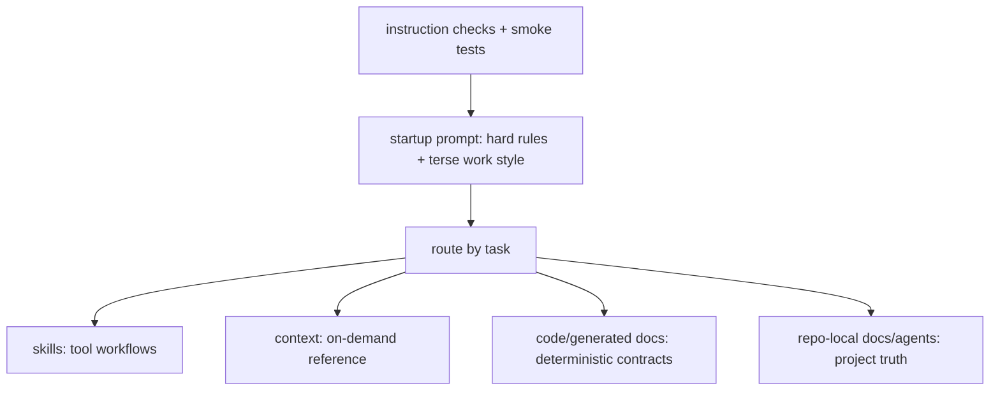

# refactor: Startup instruction and context engineering

## Summary

Refactor startup instructions into a compact rules-forward map with reliable context paths and mechanically checked delivery. Keep work style hot. Move episodic workflows, deterministic contracts, personal lookup facts, and repo-specific details to the owning skill, context doc, generated doc, runtime check, or repo-local agent doc.

---

## Problem Frame

`AGENTS.md` is currently 245 lines and `generated/codex-user-agents.md` is 276 lines. That puts broad workflow detail, personal lookup data, tool catalogs, and repo-specific guidance into every session. The result fights Nathan's goal: less verbosity, lower token cost, and less AI-generated sprawl in docs and skills.

The recent doc review, newsroom research, and Harness Engineering reference converge on the same direction: `AGENTS.md` should be a compact map and rules-forward control surface, not a handbook. Skills carry tool workflows. Context docs and repo docs carry on-demand reference. Deterministic contracts live in code, CLI help, generated docs, or runtime checks. Pete's `AGENTS.MD` is the comparison target: hard rules and routing, not exhaustive policy.

---

## Requirements

**Startup Shape**

- R1. Generated outputs remain generated artifacts. Implementation edits owning source files, skills, docs, or checks, never rendered files directly.
- R2. Work style remains always loaded and near the top of startup instructions.
- R3. Work style compresses to Pete-style hot rules, preserving token pressure, bullets-over-prose, skill description terseness, and generated-file ownership.
- R4. Shared `AGENTS.md` targets Pete-sized startup instructions: soft 90 lines, hard 120 lines.
- R5. Codex user-scope output targets root `AGENTS.md` directly unless U0 proves Codex-specific startup notes are needed: soft 120 lines, hard 150 lines.
- R6. `CLAUDE.md` exists only if U0 proves Claude needs an import/wrapper; wrapper hard 50 lines.
- R6a. `AGENTS.md` is rules-forward and map-shaped: hot rules first, owner routes second, no handbook prose.

**Ownership Moves**

- R7. Long workflow mechanics move to the owning skill or context doc.
- R8. Deterministic tool lists, route tables, schemas, allowed values, and exit codes move to code, generated docs, emitted CLI help, or existing context docs.
- R9. Productivity connector mechanics live in the productivity connector skill, not startup prompt prose.
- R10. Email body-reading behavior lives with productivity/email workflow guidance; startup keeps only a short safety invariant if needed.
- R11. Personal lookup facts move to `context/personal.md` or memory docs. Behavioral preferences stay hot.
- R12. Repo-specific issue tracker, triage, and domain guidance stays in `docs/agents/` or repo-local docs, not the global shared fragment.
- R13. Git safety keeps hard rails hot; procedure detail stays in `docs/git/`.

**Reachability And Routing**

- R14. Any "move to skill" decision must preserve agent-runtime reachability. A skill that Codex should load must be visible through `.agents/skills/` or the documented install/symlink path.
- R15. Canonical skills remain under `skills/`; agent-runtime discovery roots receive Discovery projections.
- R16. Custom agents stay out of this refactor unless a separate agent-generation track is opened. Claude subagents and Codex custom agents use different native formats.
- R17. Existing prompt-system routing is audited against `docs/specs/prompt-system.md` and `skills/prompt-system-router/SKILL.md`; final routing lives in `AGENTS.md`, replacement ADR, and the U0-selected runtime check owner.
- R18. Shared fragments describe cross-runtime behavior. Runtime-specific fragments describe agent-runtime mechanics only.

**Verification**

- R19. Instruction checks fail, not only warn, when startup outputs exceed hard line budgets.
- R20. Checks catch hardcoded user repo paths and repo-specific issue tracker claims in shared/global startup output.
- R21. Checks catch stale generated outputs, missing owner routes, appendix bloat, projection drift, and leftover fragment drift during migration.
- R22. Shared behavior changes run prompt smoke tests or an agreed focused subset.
- R23. Smoke tests verify owner discovery/context paths, not only startup-text propagation.

---

## Key Technical Decisions

- **Keep work style hot, shrink the explanation.** Nathan wants verbosity pressure everywhere agents write docs and skills. Moving work style out would save lines but lose the always-on effect. Compress the rule, do not bury it.
- **Philosophy stack is agent-native + Harness Engineering + Context Engineering.** Agent-native means tools/docs/checks are legible to agents. Harness Engineering means the environment carries feedback loops and drift controls. Context Engineering means startup routes agents to the smallest sufficient owner at the right moment.
- **Harness Engineering is the philosophical anchor.** Follow OpenAI's Harness Engineering posture: short `AGENTS.md` as map, repository docs as system of record, mechanical checks for drift, and agent legibility as the goal.
- **Lean startup order is behavior-first and map-shaped.** The canonical root `AGENTS.md` should lead with Work Style, then Operating Rules, Safety, Tools, Git, Routing, and Nathan collaboration cues. It is not a pure table of contents; it is hot rules plus owner routes.
- **Owners, not deletion.** Removing startup prose is only safe when the same guidance has a canonical owner. The work moves details to skills, context docs, generated docs, or code-owned checks.
- **Line budgets become enforcement.** The existing renderer warns above 150 shared lines. That allowed drift to 245 lines. The U0-selected runtime check owner should fail hard so startup instructions cannot quietly bloat again.
- **U0 selects Lean authoring with runtime checks.** The canonical instruction source becomes one compact root `AGENTS.md`. The cut matrix decides whether projection is needed; runtime checks preserve agent-runtime delivery, line budgets, and drift checks without keeping fragment authoring as the control plane.
- **Cut matrix before control-plane edits.** Compare current fragment authoring with Pete-simple direct `AGENTS.md` authoring. Treat hybrid authoring as a short rejected anti-option, not a peer. Then classify each prompt-system surface as keep, drop, or change: fragments, render script, `install.sh`, checks, smoke tests, generated files, Codex copy, and Claude wrapper. Use the matrix to prove which guarantees survive the chosen topology.
- **Direct root `AGENTS.md` is the canonical shared source.** Projection tooling may sync it to user-scope agent-runtime targets and append tiny runtime mechanics where codebase evidence proves the need. This supersedes the fragment-first authoring assumption in ADR `2026-03-22-fragment-rendering-over-manual-sync.md`; write a replacement ADR once the cut matrix is complete.
- **Prompt fragments retire.** Move surviving content into direct `AGENTS.md`, owner docs, or agent runtime appendices, then delete `prompt-fragments/` so there is no deprecated second source of truth.
- **Committed Codex generated output retires.** Delete `generated/codex-user-agents.md` after migration. U0 must decide Codex delivery from evidence: symlink to root `AGENTS.md` if no composition need exists; managed instruction copy only if Codex needs composition, compatibility protection, or drift-checked projection.
- **Delivery defaults Pete-simple.** User-scope Claude and Codex instruction files should use root `AGENTS.md` directly where possible. Create an agent runtime appendix only when U0 proves a runtime-specific startup mechanic cannot live in root `AGENTS.md`, config, or runtime docs.
- **Claude delivery is evidence-gated.** U0 must decide Claude wrapper-vs-symlink from current Claude import and symlink behavior. Target Pete-simple direct use of root `AGENTS.md`; keep `CLAUDE.md` only when evidence proves Claude needs the wrapper.
- **Instruction topology helper must earn its keep.** U0 decides whether `scripts/agent-instructions.sh` is needed. Create it only if instruction-specific checks, status, or projection are broad enough to deserve a separate create-cli/facade surface; otherwise fold checks into `install.sh`.
- **Install helper stays topology installer unless U0 promotes it.** After the cut, `install.sh` should create/remove/status links and surface instruction health. It should not generate prompt content or own broad Codex runtime setup unless U0 proves the need.
- **Install status shows instruction health plus runtime links.** `install.sh --status` should report Claude/Codex instruction links, instruction health from the selected check owner, and existing runtime links such as context, rules, skills, commands, agents, runbooks, hooks, MCP/settings, and memory.
- **Install contract is runtime-owned.** `install.sh help`, `install.sh doctor`, structured output, and tests own exact subcommands, flags, records, and exit codes. The plan names intent and scenarios only.
- **Agent setup CLI is a follow-up track.** The broad user-scope/repo-scope setup CLI is useful, but it is not required to prove Lean authoring. This migration keeps `install.sh` as the compatibility topology helper and lets the selected runtime check owner report instruction health.
- **Repo setup stays out of this migration.** Repo-scope install, pointer packets, and agent setup CLI design deserve their own plan once user-scope startup delivery is stable.
- **Instruction topology contract is runtime-owned if it exists.** The selected check owner's help, structured output, facade contract, and tests own exact subcommands, flags, records, output values, and exit codes. The plan names intent and scenarios only.
- **No second handbook after migration.** `docs/specs/prompt-system.md` is a migration surface, not the final owner. Final topology: `CONTEXT.md` owns vocabulary, the replacement ADR records the decision and points to live sources, and the selected runtime owner owns checkable mechanics.
- **Prompt-system spec exits after replacement.** Delete `docs/specs/prompt-system.md` once the replacement ADR exists and runtime checks own checkable mechanics. Do not archive a stale handbook.
- **Durable Landing Map expires after migration.** This plan's map is migration scaffolding only. After migration, the decision-only ADR keeps live-source pointers, and runtime status emits the current owner map/status from live sources.
- **Install topology gets audited with the prompt cut.** U0 must inspect Claude symlinks, Codex user/project surfaces, skills, context, rules, commands, agents, runbooks, hooks, MCP/settings, and stale generated-output links before changing delivery. The goal is a tidy instruction topology, not only a smaller startup file.
- **Autonomy uses Scoped ask-first gates.** Concrete implementation requests imply permission to execute. Low-risk ambiguity gets reasonable assumptions surfaced after action; high-risk ambiguity gets one question. Startup keeps gates for commits, branch changes, destructive operations, dependencies, broad refactors, ambiguous ownership, and analysis-only requests.
- **Tool routing keeps a minimal spine, not catalogs.** Startup may name `rg`, `apply_patch`, `multi_tool_use.parallel`, Context7, `productivity-connectors`, and the policy "prefer MCP runners for checks." Exact runner names, exit codes, connector protocols, and compatibility tables move to owning context, skills, or runtime docs.
- **Tool spine splits intent from mechanics.** Shared startup owns cross-runtime tool intent. Runtime-specific fragments own native tool names and mechanics such as Codex `apply_patch`, `multi_tool_use.parallel`, and tool-discovery details.
- **Commands early applies after routing.** Global startup keeps early tool defaults, not exact project commands. Repo-local `AGENTS.md`, skills, package docs, and context docs own exact executable commands because command truth is usually repo- or workflow-specific.
- **Agent-native work stays hot as principle.** Startup tells agents to act as capable collaborators with maps, invariants, owners, next safe actions, legible tools, runtime checks, and inspectable hidden state. CLI-specific mechanics route to `create-cli`, especially `references/agent-native-cli-design.md` and `references/cli-command-facade.md`.
- **Diagnosis and domain design fold into Agent-native work.** Startup keeps the reflex: reproduce before theorising, fix causes not symptoms, use domain terms precisely, and route depth to `diagnose`, `improve-codebase-architecture`, and `grill-with-docs`.
- **Examples live with owners.** Research says examples beat explanation, but global startup instructions stay example-light. Repo-local `AGENTS.md`, skills, context docs, and generated docs own examples after routing earns the extra context.
- **Budget exceptions require contract change first.** The selected runtime check owner should fail hard when startup instruction outputs exceed hard budgets: shared hard 120, Codex hard 150, Claude wrapper hard 50. No runtime override flag; changing a hard budget is an instruction-topology contract change owned by the runtime check contract and an ADR only when the trade-off changes.
- **Context paths become verifiable.** Startup routes to owner docs/skills. Runtime checks should catch missing owners, stale projected files, path leakage, appendix bloat, and broken links that would strand a fresh agent.
- **Behavioral preferences and relationship labels stay hot; lookup facts do not.** ADHD, visual learning, "explain why," Melbourne timezone, and key relationship roles affect collaboration. Birthdays, ages, hobbies, food, pets, and detailed personal facts load only when the task needs them.
- **Skill reachability uses Discovery projections.** Canonical skills stay under `skills/`, Pete-style. Agent-runtime discovery roots such as `.agents/skills/` get symlinks or another documented projection, not copied workflow prose.
- **Agent portability is a separate track.** Claude subagents are Markdown/YAML; Codex custom agents are TOML. Direct symlinks do not preserve semantics, so this refactor records the boundary and avoids agent-generation work.
- **Project docs beat global paths.** Global startup guidance must not hardcode one repo path or GitHub issue tracker. The global rule can say "prefer repo-local `docs/agents/` when present."

---

## High-Level Technical Design



Startup instructions become a router and behavior shaper. Depth remains available, but it loads only when the task earns it.

## Startup And Context Commitments

- Rename north star from shrinking prompts to startup instruction and context engineering.
- Treat root `AGENTS.md` as rules-forward map: hot rules plus routes to owners.
- Keep `instruction-appendices/` only if U0 proves an agent-runtime startup mechanic needs it.
- Let U0 decide whether `agent-instructions.sh` earns a separate create-cli/facade surface.
- Make the selected runtime check owner context-aware: check owner routes, missing docs, appendix bloat, stale projections, path leakage, and line budgets.
- Promote docs, skills, runtime checks, and generated docs as systems of record.
- Preserve Harness Engineering link in plan, glossary, and replacement ADR.
- Keep Durable Landing Map in this plan as migration scaffolding; do not promote it into a long-lived handbook.
- Delete `docs/specs/prompt-system.md` after its surviving truth lands in `CONTEXT.md`, replacement ADR, and runtime checks.
- Generate current owner map/status from runtime checks; do not maintain the landing map by hand after migration.

## Durable Landing Map

Every removed startup detail must land in one durable owner or be deleted with justification. This plan drafts the map as migration scaffolding; after migration, live sources own truth and runtime status reports the current owner map/status.

- `AGENTS.md`: hot rules, safety rails, owner routes, Nathan collaboration cues.
- `instruction-appendices/`: optional agent-runtime startup mechanics only.
- `skills/*/SKILL.md`: tool workflow front doors and invocation triggers.
- `skills/*/references/`: deeper workflow judgment, examples, and edge cases.
- `context/*.md`: on-demand user, repo, system, and workflow reference.
- `docs/agents/`: repo-local operational truth for agents.
- `docs/git/`: git procedure and conventions.
- `docs/specs/`: prompt system and instruction topology contracts.
- `docs/adr/` or `docs/decisions/`: durable trade-offs and superseded decisions.
- `generated/`: generated artifacts only, never source.
- CLI help and facade contracts: exact flags, output records, exit codes, statuses, and runtime actions.
- Tests and checks: deterministic enforcement.
- Memory docs: durable personal recall and synthesis.
- `CONTEXT.md`: vocabulary only.

Target shared shape:

```md
## Work Style

- Artifacts: telegraph; bullets; no filler; edit source.
- Chat: warm, concise, visually structured.
- Explain why when decisions, trade-offs, or learning matter.
- Keep collaboration humane; keep artifacts dense.

## Core

- Concrete task: act.
- Low-risk ambiguity: assume; state it.
- High-risk ambiguity: ask one question.
- Skills own workflows; startup instructions stay hard rules only.
- Generated outputs: name source; edit source, not rendered file.
- Deterministic contracts: code/generated docs own exact shapes.
- Tool routing: use `rg`, `apply_patch`, `multi_tool_use.parallel`, Context7, `productivity-connectors`.
- Memory work: read `~/.config/memory/AGENTS.md` first.
- Repos own operational truth; memory owns durable recall/synthesis.
- Startup instructions are hot memory only, not durable storage.

## Safety

- Ask first: commits, branch changes, destructive ops, new deps, broad refactors, unclear ownership.
- Never hardcode secrets, tokens, or API keys.
- Never delete untracked work.
- Preserve unrelated user/agent changes.

## Agent-Native Work

- Treat agents as capable collaborators, not brittle scripts.
- Give maps, invariants, owners, next safe actions, and inspectable state.
- Prefer legible tools and runtime checks over prose policy.
- For CLI/tool design, use `create-cli`; runtime contracts own mechanics.
- For hard bugs, use `diagnose`: reproduce, hypothesise, instrument, fix, prove.
- Fix root causes, not symptoms; ask what would have prevented the bug.
- For architecture candidates, use `improve-codebase-architecture`.
- For plans and terminology, use `grill-with-docs`: sharpen language, test scenarios, update `CONTEXT.md`/ADRs.
- Use domain terms precisely; prefer explicit context/owner boundaries over one global model.

## Git

- Check status before git changes.
- Protected branches: no direct commits.
- Push only when asked.
- Destructive git forbidden unless explicit.
- Conventional commits.

## Nathan

- Melbourne timezone.
- ADHD/DX: reduce cognitive load.
- Visual learner: whitespace, structure, Mermaid when useful.
- Melanie: partner. Levi: son. Mum: Sydney.
```

---

## U0 Cut Matrix

Evidence captured 2026-06-02 from current working tree.

- Branch: `main`; dirty tree already present. U0 edits only docs/evidence; no branch, stage, commit, or link mutation.
- Render check: `./scripts/render-user-prompts.sh --check` passes.
- Current budgets: `AGENTS.md` 257 lines; `CLAUDE.md` 29 lines; `generated/codex-user-agents.md` 288 lines.
- Current check weakness: line budget is warning only; no hard startup budget, owner-route check, appendix-bloat check, or path-leakage gate.
- Claude delivery: `~/.claude/CLAUDE.md` and `~/.claude/AGENTS.md` are symlinks, but currently point at sibling repo `~/code/claude-code-config`, not this checkout.
- Claude wrapper: `CLAUDE.md` is a generated 29-line wrapper with `@AGENTS.md` plus Claude runtime notes.
- Codex delivery: `~/.codex/AGENTS.md` is a real copied file; hash matches `generated/codex-user-agents.md`.
- Codex appendix content today: skills/custom-agents/rules/config notes, context-loading note, Claude-to-Codex tool map.
- Install topology: `install.sh --status` reports Claude/context/rules/skills/hooks/settings/memory links; wrong links are visible but create path currently overwrites wrong symlinks with `ln -sf`.
- Discovery projection: repo `.agents/skills/` contains only `work-style-convert`; user `$HOME/.agents/skills/` carries many skill symlinks, including prompt and productivity skills.
- Codex config: project `.codex/config.toml` declares MCP runners; user `~/.codex/config.toml` owns broader runtime/plugin configuration.
- `instruction-appendices/`: absent.

Hybrid authoring rejection:

- Reject fragment-plus-direct hybrid as active control plane.
- Reason: preserves two authoring paths, keeps generated-output drift alive, and makes checks guess source authority.
- Accept only temporary shims during migration, with deletion criteria.

Surface decisions:

- `prompt-fragments/`
  - Guarantee: shared/Claude/Codex composition.
  - Evidence: render arrays are source of truth; shared fragments already 257 rendered lines.
  - Fragment option: keeps composition but keeps handbook drift and generated-file ownership.
  - Direct option: root `AGENTS.md` becomes source; runtime mechanics move to appendices/config/docs.
  - Cost/risk: migration must move or delete every surviving fragment detail.
  - Decision: change, then drop after migration; no supported second authoring path.

- Root `AGENTS.md`
  - Guarantee: user-scope instruction source and repo-local startup source.
  - Evidence: currently generated from fragments; contains repo-specific leakage and absolute paths.
  - Fragment option: remains rendered output, not editable source.
  - Direct option: edit as canonical compact map.
  - Cost/risk: direct edits need hard checks to replace render drift checks.
  - Decision: change to canonical direct source.

- `CLAUDE.md`
  - Guarantee: Claude user-scope runtime mechanics.
  - Evidence: 29-line generated `@AGENTS.md` wrapper; import resolves in current check, but actual user symlink points to sibling repo.
  - Fragment option: keep generated wrapper.
  - Direct option: use root `AGENTS.md` directly if Claude can load it; otherwise keep tiny wrapper.
  - Cost/risk: Claude import behavior is underdocumented; runtime proof needed before deletion.
  - Decision: change; keep wrapper only if U5 proof shows Claude cannot consume root directly.

- `generated/codex-user-agents.md`
  - Guarantee: committed Codex-specific generated output.
  - Evidence: matches `~/.codex/AGENTS.md`; Codex-specific delta is small and appendix-shaped.
  - Fragment option: keep committed generated file and copy step.
  - Direct option: symlink or managed copy root `AGENTS.md`; compose optional Codex appendix only if proven.
  - Cost/risk: deleting generated file requires parity/projection check during migration.
  - Decision: drop after migration; not a source or committed artifact.

- Codex `~/.codex/AGENTS.md`
  - Guarantee: user-scope Codex startup layer.
  - Evidence: real copy today; no evidence that content must differ beyond tiny runtime mechanics.
  - Fragment option: copied generated output.
  - Direct option: prefer symlink to root `AGENTS.md`; use managed copy only if appendix composition or compatibility proves necessary.
  - Cost/risk: symlink behavior needs live install/check proof before link mutation.
  - Decision: change; default symlink, managed copy only with evidence.

- Codex runtime surfaces
  - Guarantee: runtime config, Starlark rules, skill discovery, custom agents.
  - Evidence: project `.codex/config.toml` owns MCP runners; user config owns plugins; `~/.codex/rules/default.rules` exists; custom agents live under `~/.codex/agents`.
  - Fragment option: startup lists mechanics.
  - Direct option: root routes to runtime docs/config; checks inspect link/discovery health.
  - Cost/risk: startup must not become a Codex catalog.
  - Decision: keep as checked topology surfaces, not startup prose.

- `instruction-appendices/`
  - Guarantee: optional runtime-specific startup mechanics.
  - Evidence: directory absent; Codex/Claude deltas are short.
  - Fragment option: fragments remain hidden appendices.
  - Direct option: create only for proven runtime mechanics.
  - Cost/risk: appendices can become second handbook.
  - Decision: keep absent for U0; create later only with hard budget and bloat check.

- `scripts/render-user-prompts.sh`
  - Guarantee: render, drift check, Codex copy.
  - Evidence: check passes; warning-only budget; writes prompt content and copies to Codex.
  - Fragment option: remains primary prompt generator.
  - Direct option: retire generation; keep temporary check/projection shim if needed.
  - Cost/risk: must replace drift checks before deletion.
  - Decision: change to temporary shim, then delete or delegate once runtime check owner lands.

- `scripts/agent-instructions.sh`
  - Guarantee: none today; candidate runtime check owner.
  - Evidence: required checks span startup budgets, owner routes, projections, appendices, stale generated outputs, and runtime delivery health.
  - Fragment option: no separate owner; render script keeps partial checks.
  - Direct option: create read-only check/status surface with create-cli/facade contract; write/projection commands explicit.
  - Cost/risk: new CLI surface must stay check/status, not prompt authoring.
  - Decision: create in U5 as selected runtime check owner.

- `install.sh`
  - Guarantee: user-scope link topology and status.
  - Evidence: status exposes wrong links; create path renders prompts and force-updates wrong symlinks.
  - Fragment option: installer remains prompt renderer plus link helper.
  - Direct option: compatibility topology helper; surface instruction health from `agent-instructions.sh`.
  - Cost/risk: must fail closed on real files and wrong symlinks unless explicit force semantics exist.
  - Decision: change; no prompt rendering after Lean authoring lands.

- Checks
  - Guarantee: render drift, import resolution, Codex copy parity, orphan fragments, shared hygiene.
  - Evidence: current hard failures miss new U0 guarantees; line budget only warns at 257 lines.
  - Fragment option: keep render-script checks.
  - Direct option: runtime check owner validates budgets, routes, projections, appendices, stale artifacts, path leakage.
  - Cost/risk: direct authoring without checks would regress to manual drift.
  - Decision: change; `agent-instructions.sh` owns check/status.

- Smoke tests
  - Guarantee: behavioral propagation probes.
  - Evidence: existing smoke runner exists; not needed for U0 doc-only evidence edit.
  - Fragment option: propagation probes assume fragment render path.
  - Direct option: retarget smoke to owner discovery and startup routing.
  - Cost/risk: stale smoke tests can bless retired topology.
  - Decision: change in U6 after startup behavior changes.

- `docs/specs/prompt-system.md`
  - Guarantee: current fragment-first contract.
  - Evidence: duplicates route tables, output tables, runtime surface lists, and review cadence.
  - Fragment option: keep as handbook/spec.
  - Direct option: use as migration input; surviving truth moves to `CONTEXT.md`, replacement ADR, runtime checks, owner docs.
  - Cost/risk: deleting too early strands migration facts.
  - Decision: change, then delete after replacement ADR and checks exist.

- Replacement ADR
  - Guarantee: durable decision record.
  - Evidence: existing decisions justify fragment rendering and Codex copy; U0 supersedes both.
  - Fragment option: keep old ADRs active.
  - Direct option: write decision-only ADR with pointers to live sources.
  - Cost/risk: ADR must not become new prompt-system handbook.
  - Decision: create after runtime check owner and delivery stance are proven.

- Agent setup CLI
  - Guarantee: broad user/repo setup, if built.
  - Evidence: useful but not needed to prove direct startup authoring; current work already has enough scope.
  - Fragment option: unrelated.
  - Direct option: separate plan after user-scope instruction topology is stable.
  - Cost/risk: scope creep delays startup migration.
  - Decision: defer as follow-up track.

## Implementation Units

### U0. Lean Authoring Cut Matrix

- **Goal:** Prove the Lean authoring with projection control plane before editing startup content.
- **Requirements:** R1, R4, R5, R14, R15, R17, R18, R19, R20, R21
- **Files:**
  - `docs/plans/2026-06-02-002-refactor-agent-instruction-startup-surface-plan.md`
  - `scripts/agent-instructions.sh`
  - `scripts/render-user-prompts.sh`
  - `instruction-appendices/`
  - `install.sh`
  - `.codex/config.toml`
  - `docs/specs/prompt-system.md`
  - `AGENTS.md`
  - `CLAUDE.md`
  - `generated/codex-user-agents.md`
- **Approach:** Add a cut matrix to this plan that compares current fragment authoring with Pete-simple direct `AGENTS.md` authoring, with hybrid authoring recorded as a rejected anti-option. Include: surface, guarantee, evidence today, fragment option, direct option, hybrid rejection note, cost, removal risk, and decision. Classify fragments, render script, instruction topology helper candidate, install script, checks, smoke tests, generated files, Codex copy, Claude wrapper, `instruction-appendices/`, Claude runtime symlinks, and Codex runtime surfaces. For Codex, cover instruction topology, project/user config, Starlark rules, `.agents/skills`, and `.codex/agents`; exclude broader MCP/plugin/app audit unless a finding proves it belongs. Decide whether `agent-instructions.sh` earns a separate create-cli/facade surface before implementation. Prepare a replacement ADR after the cut matrix and runtime-check owner are stable.
- **Runtime check owner contract:**
  - The selected owner checks lean startup instructions across agent runtimes.
  - Runtime stance: context-aware check/status surface, not prompt authoring tool.
  - If separate from `install.sh`, build with `create-cli` and the facade contract path.
  - Exact subcommands, flags, output records, output values, and exit codes belong to CLI help, structured output, contract runtime, and tests.
  - Safety invariants: default read-only check/doctor; writes require explicit projection command if projection exists; no overwrite of real files or directories; no prompt content generation from fragments.
- **Install helper runtime contract:**
  - `install.sh` wires this repo's user-scope Claude/Codex instruction topology and reports link health.
  - Runtime stance: compatibility topology helper, not prompt generator and not broad agent setup CLI.
  - `install.sh --status` surfaces selected runtime-check summary without duplicating checks.
  - Instruction health comes from the selected runtime check owner; install status/doctor may surface its summary but must not duplicate its checks.
  - Exact subcommands, flags, output records, and exit codes belong to runtime help, structured output, contract runtime, and tests.
  - Safety invariants: never overwrite real files or directories; never delete real files or directories; remove only managed symlinks; no prompt rendering.
  - Scope invariant: repo-scope setup and broad Codex runtime setup are follow-up tracks unless U0 proves they block Lean authoring.
- **Test Scenarios:**
  - Every prompt-system surface has a keep/drop/change decision across fragment and direct-authoring options, plus a hybrid rejection note where relevant.
  - Every kept surface names the guarantee it preserves.
  - Every dropped or changed surface names the lean replacement or accepted loss.
  - U0 decides whether `agent-instructions.sh` earns a separate create-cli/facade surface.
  - The selected runtime check owner reports line budgets, stale generated outputs, projection drift when projection exists, agent-runtime delivery health, broken context paths, missing owner docs, and appendix bloat.
  - Projection dry-run previews writes without changing files when projection exists.
  - Runtime status emits health plus compact owner map from live sources.
  - Status covers startup, appendices, skills/discovery projections, repo truth, git docs, vocabulary, mechanics, projections, stale artifacts, and broken routes.
  - Agent-runtime startup mechanics live in `instruction-appendices/`, not root `AGENTS.md` or `prompt-fragments/`.
  - Codex copy-vs-symlink decision is based on U0 evidence, not assumed projection.
  - Claude wrapper-vs-symlink decision is based on U0 evidence, not assumed wrapper retention.
  - Claude and Codex install topology are inventoried before links are changed.
  - `install.sh --status` reports Claude/Codex instruction links plus runtime links.
  - `install.sh` does not own prompt content generation after Lean authoring lands.
  - Repo-scope install and agent setup CLI scenarios are recorded as follow-up, not U0 acceptance criteria.
  - Wrong symlinks require explicit force semantics; real files or directories fail closed.
  - ADR need is evaluated after the matrix, not assumed before evidence.
- **Verification:** Review the matrix against existing ADRs, current prompt-system spec, render script behavior, install topology, create-cli/facade guidance, Pete comparator, and AGENTS.md research findings.

### U1. Startup Instruction Classification

- **Goal:** Classify startup content into hot, owner-move, or delete/merge after the lean-authoring control-plane direction is known.
- **Requirements:** R1, R2, R7, R8, R11, R12, R13, R17, R18
- **Files:**
  - `prompt-fragments/shared/work-style.md`
  - `prompt-fragments/shared/boundaries.md`
  - `prompt-fragments/shared/workflow.md`
  - `prompt-fragments/shared/skill-authoring.md`
  - `prompt-fragments/shared/code-quality-runners.md`
  - `prompt-fragments/shared/connector-dispatch.md`
  - `prompt-fragments/shared/email-read-fully.md`
  - `prompt-fragments/shared/governance.md`
  - `prompt-fragments/shared/communication-style.md`
  - `prompt-fragments/shared/key-people.md`
  - `prompt-fragments/shared/agent-skills.md`
  - `prompt-fragments/codex/tool-map.md`
  - `prompt-fragments/codex/codex-runtime-notes.md`
  - `prompt-fragments/codex/context-loading.md`
- **Approach:** Produce a small classification note or inline checklist during implementation. Hot items include work style, hard safety rails, scoped ask-first gates, collaboration preferences, and short routing rules. Owner-move items include connector tables, runner catalogs, memory structure, git procedure docs, repo-specific tracker facts, and personal lookup data.
- **Test Scenarios:**
  - Every current shared fragment has an explicit disposition.
  - No rendered file is edited before source fragments.
  - No owner-move item lacks a named destination.
- **Verification:** Review diff before edits and after render to confirm the source-of-truth move is visible.

### U2. Compress Shared Hot Rules

- **Goal:** Rewrite shared startup fragments into a Pete-style compact rule set.
- **Requirements:** R2, R3, R4, R6, R11, R13
- **Files:**
  - `prompt-fragments/shared/work-style.md`
  - `prompt-fragments/shared/boundaries.md`
  - `prompt-fragments/shared/workflow.md`
  - `prompt-fragments/shared/skill-authoring.md`
  - `prompt-fragments/shared/communication-style.md`
  - `prompt-fragments/shared/governance.md`
- **Approach:** Merge duplicated workflow and boundaries into one compact section. Remove the unconditional "Implement without confirmation" prohibition and keep scoped ask-first gates. Keep work style as a tiny top block. Reduce skill-authoring to trigger-description/frontmatter/workflow-owner rules and point deeper philosophy to `context/skill-design-philosophy.md`.
- **Test Scenarios:**
  - Work style remains first visible guidance in `AGENTS.md`.
  - Agent-native work stays as hot principle without duplicating `create-cli` mechanics.
  - `AGENTS.md` contains no contradiction between autonomous execution and Scoped ask-first gates.
  - Skill authoring still tells agents to keep descriptions short and YAML-parse frontmatter.
  - Communication style keeps ADHD/DX, explain-why cues, timezone, and relationship labels without long personal detail.
  - Startup keeps critical tool names where they change model behavior, without runner catalogs or connector protocols.
- **Verification:** Project/check and inspect `AGENTS.md`, `CLAUDE.md`, and any Codex appendix/projection line counts.

### U3. Move Workflow Depth To Owners

- **Goal:** Move episodic workflow mechanics out of startup prompt and into the surfaces agents load when needed.
- **Requirements:** R7, R8, R9, R10, R13, R14, R15, R16
- **Files:**
  - `skills/productivity-connectors/SKILL.md`
  - `context/bun-runner.md`
  - `context/git-workflow.md`
  - `docs/git/conventions.md`
  - `docs/git/workflows.md`
  - `docs/git/worktree.md`
  - `memory/AGENTS.md`
  - `context/personal.md`
  - `.agents/skills/`
- **Approach:** Ensure each removed startup detail lands in the Durable Landing Map with one reachable system of record. Keep startup pointers terse: prefer MCP runners, use productivity connector config for external data, load memory contract for memory work, read git docs for procedure. Fix connector-skill reachability by projecting canonical `skills/` entries into harness-supported discovery roots. Do not add custom-agent projection in this unit; record any needed Claude/Codex agent conversion as follow-up work. Use the map during migration; do not promote it into the replacement ADR.
- **Test Scenarios:**
  - Startup output no longer lists every runner tool name or exit code.
  - Startup output no longer includes the connector dispatch table or gog protocol.
  - Startup output no longer lists Memory OS docs, QMD, or NotebookLM details.
  - Startup output no longer includes key-people lookup facts.
  - Startup output still routes agents to `productivity-connectors` for connector work and Context7 for library docs.
  - Productivity connector guidance remains discoverable to Codex.
  - Git hard rails stay hot, but git procedure docs stay in `docs/git/`.
  - No direct symlink attempts to treat Claude subagent Markdown as Codex custom-agent TOML.
  - Every removed startup detail has exactly one system of record or a documented delete/merge reason.
- **Verification:** Search startup/projection outputs for removed catalogs and confirm owner docs/skills contain the moved guidance.

### U4. Remove Global Repo-Specific Leakage

- **Goal:** Stop global shared prompt output from hardcoding this repo's identity, local path, issue tracker, or triage setup.
- **Requirements:** R12, R17, R18, R20
- **Files:**
  - `prompt-fragments/shared/agent-skills.md`
  - `docs/agents/issue-tracker.md`
  - `docs/agents/triage-labels.md`
  - `docs/agents/domain.md`
  - `docs/specs/prompt-system.md`
- **Approach:** Replace global repo-specific lines with a generic routing rule: prefer repo-local `docs/agents/` when present. Keep the actual `claude-code-config` tracker, triage, and domain details in `docs/agents/`. If this repo still needs project-local startup docs, model that separately instead of contaminating the user-global shared fragment.
- **Test Scenarios:**
  - Rendered global Codex output does not say issues for one named repo live in GitHub Issues.
  - Rendered global output does not contain a local absolute repo path.
  - `docs/agents/` still contains the project-specific issue tracker, triage label, and domain references.
- **Verification:** Search startup/projection outputs and source surfaces for `claude-code-config`, `nathanvale/claude-code-config`, and local absolute path patterns.

### U5. Add Context-Aware Instruction Gates

- **Goal:** Make compactness, ownership drift, and context-path health enforceable.
- **Requirements:** R4, R5, R19, R20, R21
- **Files:**
  - `scripts/agent-instructions.sh`
  - `scripts/render-user-prompts.sh`
  - `docs/specs/prompt-system.md`
  - `skills/prompt-system-workflow/SKILL.md`
- **Approach:** Move line budget, leakage, stale generated-output, projection-drift, owner-route, and appendix-bloat checks into the U0-selected runtime check owner. Convert line budget checks from warnings to hard failures at the new hard budgets. Do not add an override flag; budget changes must be made through the runtime check contract, with ADR only when the topology trade-off changes. Promote vocabulary to `CONTEXT.md`. Keep the replacement ADR decision-only, with pointers to live sources. Add checks for global/shared leakage: local absolute paths, hardcoded repo ownership claims, and long deterministic lists where practical. Add owner-map/status output to the selected check owner. Retire `render-user-prompts.sh` or leave only a temporary compatibility shim during migration. Delete `docs/specs/prompt-system.md` after its surviving truth lands in `CONTEXT.md`, the replacement ADR, and runtime checks.
- **Test Scenarios:**
  - Runtime check fails when shared startup instruction lines exceed hard budget.
  - Runtime check fails when Codex user-scope output exceeds hard budget.
  - There is no CLI flag that bypasses hard budgets.
  - Runtime check fails on hardcoded local repo paths in shared/global output.
  - Runtime check fails when startup routes to missing owner docs or skills.
  - Runtime check fails when an agent runtime appendix exceeds its line budget or contains non-runtime knowledge.
  - Existing drift and orphan-fragment checks either move to the selected runtime check owner or are removed with the retired fragment system.
  - Runtime status reports health plus compact owner categories without reading a hand-maintained landing map.
  - Status does not inventory every skill, doc, or route unless a failed check needs detail.
- **Verification:** Run the selected runtime check owner. If projection exists, run its dry-run first.

### U6. Smoke And Regression Proof

- **Goal:** Prove the refactor preserves the useful behavior while reducing startup load.
- **Requirements:** R1, R2, R14, R15, R16, R19, R20, R21, R22
- **Files:**
  - `AGENTS.md`
  - `CLAUDE.md`
  - `generated/codex-user-agents.md`
  - `scripts/multi-agent-smoke.ts`
- **Approach:** Run instruction topology checks and a focused smoke subset for shared behavior, propagation, and owner discovery. Use line counts, search checks, and context-path checks as objective proof. Add or adjust smoke cases only if current cases cannot catch the behavior most likely to regress.
- **Test Scenarios:**
  - Shared startup instructions are below the hard line budget.
  - Codex user-scope output is below the hard line budget.
  - Work-style compression survives propagation to Claude and Codex startup instructions.
  - Prompt-system routing tells agents to edit canonical `AGENTS.md` or owner docs, not generated outputs.
  - A fresh agent can route from lean startup to the relevant owner doc/skill for representative workflows.
  - Email/calendar/contact probe routes to productivity connector skill.
  - Git procedure probe routes to `docs/git/`.
  - Prompt/instruction change probe routes to instruction topology or prompt-system workflow.
  - Memory work probe routes to the memory contract.
  - Library docs probe routes to Context7.
  - Skill owner moves do not leave connector guidance unreachable.
- **Verification:** Selected runtime check plus focused `bun scripts/multi-agent-smoke.ts --tests boundary,propagation` when shared behavior changed.

### U7. Light Janitor Pass

- **Goal:** Remove obvious agent-runtime/context drift after the new topology lands.
- **Requirements:** R1, R7, R8, R14, R15, R19, R20, R21, R23
- **Files:**
  - `AGENTS.md`
  - `instruction-appendices/`
  - `docs/specs/prompt-system.md`
  - `skills/prompt-system-workflow/SKILL.md`
  - `generated/`
  - `prompt-fragments/`
  - owner docs named in the Durable Landing Map
- **Approach:** Run a bounded cleanup, not a broad documentation rewrite. Remove or fix broken owner routes, stale generated outputs, appendix bloat, duplicate policy across startup/docs/skills, routes to missing docs or skills, and old fragment leftovers. If a finding requires content judgment beyond obvious drift, record it as follow-up instead of rewriting docs inside this pass.
- **Test Scenarios:**
  - No startup route points to a missing owner.
  - No agent runtime appendix exceeds budget or contains workflow/domain knowledge.
  - No generated prompt artifact remains as an active source of truth.
  - No prompt fragment remains unless explicitly retained as a temporary compatibility shim.
  - No `docs/specs/prompt-system.md` remains after replacement ADR and CLI checks exist.
  - No hand-maintained Durable Landing Map remains outside this completed plan.
  - No duplicate policy exists across startup, owner docs, and skills for moved content.
- **Verification:** Run the selected runtime check; search for `prompt-fragments`, `generated/codex-user-agents.md`, hardcoded repo paths, and duplicated moved-policy phrases.

---

## Scope Boundaries

- This plan does not execute the broader agent-skills repo pivot.
- This plan does not port Claude-dependent sub-agent workflows to Codex.
- This plan does not build a custom-agent renderer or converter.
- This plan does not delete owner docs just because startup prose shrinks.
- This plan does not broaden instruction topology beyond projection, checks, and light janitor work.
- This plan does not change personal memory content, except moving hot lookup facts out of startup if needed.

---

## Risks And Dependencies

- **Over-shrinking could remove behavior-shaping cues.** Mitigation: keep work style, scoped safety rails, collaboration preferences, and source-of-truth rules hot.
- **Moved guidance could become unreachable.** Mitigation: treat skill reachability as an explicit requirement, especially for productivity connectors.
- **Hard budgets could block legitimate future additions.** Mitigation: allow budget changes only through the CLI contract, with a clear owner-move review; write an ADR only when the trade-off changes.
- **Generated global and repo-local needs could diverge.** Mitigation: keep project-specific truth in `docs/agents/` and make global startup route to repo-local docs.

---

## Sources And Research

- `docs/specs/prompt-system.md` currently defines fragment routing, generated outputs, render checks, and context-on-demand; this plan treats it as migration input and supersedes that control-plane shape after U0.
- `docs/adr/0004-deterministic-workflow-contracts-live-in-code.md` owns the deterministic-contract placement rule.
- `docs/adr/0010-skill-examples-teach-judgment-not-contracts.md` keeps examples and contracts separated.
- `context/skill-design-philosophy.md` records the prose-trust / steipete-weight skill philosophy.
- `skills/prompt-system-workflow/SKILL.md` and `skills/prompt-system-router/SKILL.md` define the safe prompt-change workflow.
- `skills/productivity-connectors/SKILL.md` is the current owner for productivity connector routing.
- Pete reference: `steipete/agent-scripts` `AGENTS.MD`, 89-line hard-rule/routing surface.
- Newsroom finding: recent community signal favors light `AGENTS.md`, skills for depth, and explicit verbosity tuning.
- Official references checked during investigation: OpenAI Codex `AGENTS.md` guide, Linux Foundation `agents.md`, Claude Skills docs.
- Research papers checked during investigation: context files can raise inference cost materially; scope/consent rules reduce overeager agent action.
- OpenAI Harness Engineering: short `AGENTS.md` as table of contents; repo-local knowledge as system of record; mechanical checks and doc gardening preserve agent legibility. https://openai.com/index/harness-engineering/
