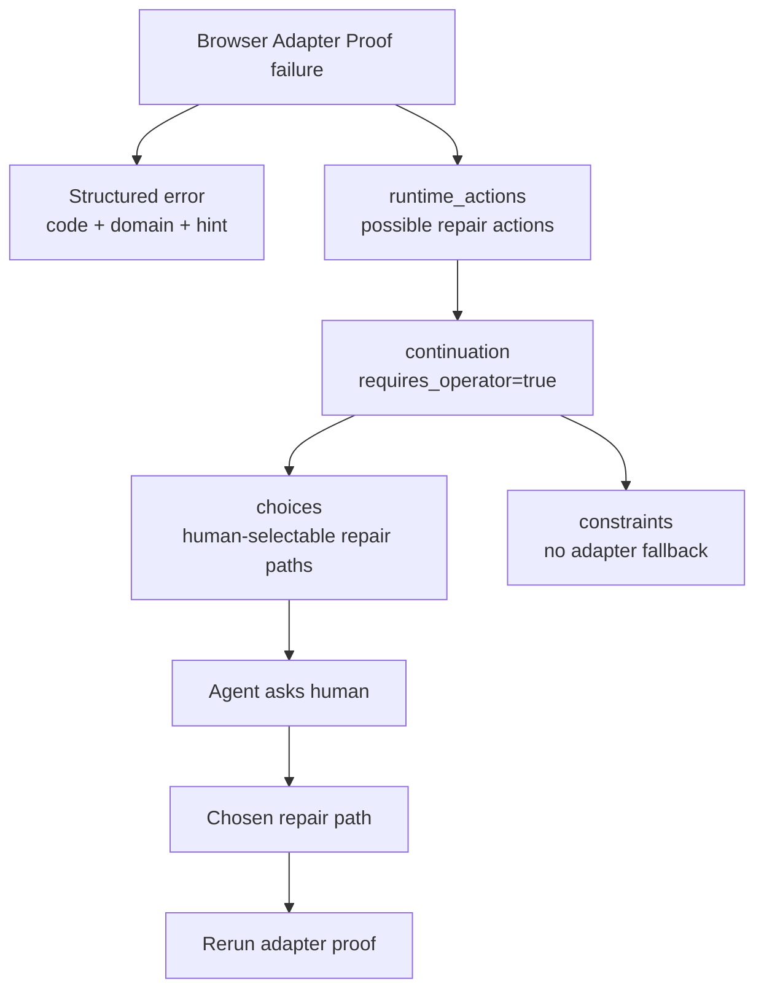

# Facade-owned operator recovery choices

## Summary

Add a first-class CLI facade recovery-choice contract so an agent-native command can stop at repair ambiguity, present concrete options, and ask the human to choose. Then update Browser Adapter Proof dependency failures to use that shared shape instead of forcing `configure_adapter_dependency` as the single autonomous next action.

---

## Problem Frame

The Browser Adapter Proof smoke failure was useful: it named `adapter_dependency_missing`, isolated `browser_adapter_proof`, and blocked adapter/cold-browser fallback. But it also pushed the continuation toward one write-capable action. For missing `mcporter`, there are several valid repair paths: install `mcporter` on PATH, use a configured command vector, install or expose Chrome DevTools MCP, or inspect existing config. The current facade can express `requires_operator`, but it cannot package a typed list of human-facing recovery choices out of the box.

This work should make “ask the human to choose among repair paths” a reusable facade capability, not a one-off `browser-use` JSON extension.

---

## Target Repositories

- **Facade contract:** `side-quest-engineering`. Paths in U1 and facade source references are relative to this repo.
- **Browser-use consumer:** `claude-code-config`. Paths in U2-U4 and Browser-use source references are relative to this repo.
- **Plan home:** `claude-code-config/docs/plans/`. Cross-repo source labels name the target repo before the repo-relative path.

---

## Requirements

**Facade contract**

- R1. Represent operator-choice recovery as a facade-owned runtime continuation shape for error envelopes.
- R2. Preserve the current invariant that a continuation sets exactly one posture: autonomous `next_action_id` or operator `requires_operator`.
- R3. Allow `requires_operator=true` continuations to carry one or more machine-readable choices.
- R4. Validate every choice for stable id, concise label, summary, recoverability, side-effect source, and optional docs URL.
- R5. Require emitted `runtime_actions` when any choice points at a runnable action, then cross-check every choice `action_id` against `runtime_actions[].id`.
- R6. Reject malformed choice envelopes at construction time through facade validation.
- R7. Keep existing envelopes without choices valid.

**Browser Adapter Proof behavior**

- R8. Emit operator-choice recovery for ambiguous dependency setup failures such as missing `mcporter`, missing configured runner, or missing Chrome DevTools MCP.
- R9. Keep deterministic failures deterministic: invalid command-vector shape still points at fixing the input; stale config still points at updating config; unparsable output still points at inspection.
- R10. Keep `no_adapter_fallback` constraints on Browser Adapter Proof failures.
- R11. Keep `error.code`, `failure_domain`, `runtime_actions`, `continuation`, and `hint` available on every failure.
- R12. Make plain output show that operator choice is required, not that a single action is already selected.

**Agent behavior**

- R13. Give agents enough structured data to ask a human “Which repair path do you want?” without inventing options from prose.
- R14. Keep exact install commands as package-owned guidance, not facade policy.
- R15. Avoid automatic package-runner fallback.

---

## Key Technical Decisions

- Durable rationale for the shared facade contract lives in `side-quest-engineering`: `docs/adr/0018-runtime-recovery-choices.md`.
- KTD1. **Put choices on `continuation`:** Extend `RuntimeContinuationGuidance` with an optional `choices` array used only when `requires_operator=true`. Continuation already owns what the caller should do next, so choices belong there rather than inside `error`.
- KTD2. **Keep runtime actions as executable vocabulary:** Choices may reference a `runtime_actions[].id`. The facade validates the reference when present. This keeps action side effects and summaries centralized.
- KTD3. **Use operator stop, not a fake next action:** Dependency setup ambiguity should emit `requires_operator=true`, not `next_action_id=configure_adapter_dependency`. The next action is the human choice itself.
- KTD4. **Keep package-specific repair options in `browser-use`:** The facade owns shape and validation. `browser-use` owns choices such as PATH install, command-vector override, Chrome DevTools MCP install, and config inspection.
- KTD5. **Keep `hint` brief and compatible:** `error.hint` remains a short summary. The full option list lives in `continuation.choices`.
- KTD6. **Do not relax fail-closed routing:** Choices do not permit adapter fallback or cold-browser fallback. They only choose how to repair the selected adapter path.
- KTD7. **Keep constraints as the operator-stop reason:** `choices` enrich a `requires_operator=true` continuation; they do not replace the existing requirement for at least one `constraints` summary. Constraints explain why autonomous continuation stopped and which behaviours remain forbidden. Choices explain which repair paths the human may select.
- KTD8. **Inherit side effects from referenced actions:** When a choice has `action_id`, the facade requires emitted `runtime_actions`, reads side effects from the referenced `runtime_actions[]` entry, and rejects duplicate `choice.side_effects`. `side_effects` is allowed only for non-action choices that still need an honest side-effect posture.
- KTD9. **Require choice-level recoverability:** Every choice carries its own `recoverability`. Agents read the selected choice for recovery posture instead of merging choice data with `error.recoverability`.
- KTD10. **Keep choices error-only:** This slice defines recovery choices for failed invocations. Success-path operator selection is a separate future contract if it earns one.
- KTD11. **Name the type `RuntimeRecoveryChoice`:** The type name should reflect error recovery, not generic continuation menus.
- KTD12. **Retire broad dependency actions from active output:** `configure_adapter_dependency` should not be emitted by Browser Adapter Proof after this slice. Dependency ambiguity uses recovery choices; invalid command-vector input uses `change_adapter_input`; stale, missing, or mismatched config uses `update_adapter_config`; unparsable output uses `inspect_adapter_config`.
- KTD13. **Treat command-vector override as check posture:** `set_mcporter_command_vector` represents a per-run override such as `BROWSER_USE_MCPORTER_COMMAND_JSON`, not persisted config mutation, so its runtime action side effects are `check`.
- KTD14. **Keep dependency install actions separate:** `install_mcporter_cli` and `install_chrome_devtools_mcp` stay distinct because missing the public `mcporter` CLI and missing the Chrome DevTools MCP server are different repairs.
- KTD15. **Omit local docs URLs from browser-use choices:** Browser-use recovery choices should not use `docs_url` for local repair docs. Exact commands and local paths stay in `skills/browser-use/references/browser-adapter-chrome-devtools.md`.
- KTD16. **Vary choices by dependency problem:** Browser Adapter Proof should emit the smallest relevant recovery choice set for the detected dependency failure, not a full generic dependency menu.
- KTD17. **Keep plain output posture-only:** Plain output should say `operator_required=true choices=<count>` for operator-choice failures. It should not list choice ids or summaries; JSON remains the machine-readable choice surface.
- KTD18. **Apply constraints to choices:** A recovery choice must not conflict with `continuation.constraints`. Reject a choice whose `action_id` is forbidden by `forbidden_action_ids` or whose effective side effects are forbidden by `forbidden_side_effects`.
- KTD19. **Do not add selected-choice dispatch:** This slice does not add `selected_choice_id` input or a facade repair dispatcher. After the human chooses, the selected repair is package-owned work outside the recovery-choice envelope.
- KTD20. **Always include inspection for dependency ambiguity:** Every Browser Adapter Proof dependency choice set includes `inspect_adapter_config` as a low-risk path before install or override changes.

---

## High-Level Technical Design



Representative target envelope:

```json
{
  "status": "error",
  "error": {
    "code": "adapter_dependency_missing",
    "recoverability": "repair_state",
    "hint": {
      "summary": "Choose how to repair Chrome DevTools adapter dependencies.",
      "action": "repair_state"
    }
  },
  "runtime_actions": [
    {
      "id": "install_mcporter_cli",
      "summary": "Install mcporter and expose it on PATH.",
      "side_effects": ["write", "network"]
    },
    {
      "id": "set_mcporter_command_vector",
      "summary": "Set an explicit mcporter command vector for this run.",
      "side_effects": ["check"]
    }
  ],
  "continuation": {
    "requires_operator": true,
    "constraints": [
      {
        "id": "no_adapter_fallback",
        "summary": "Do not switch adapters or use a cold browser after Browser Adapter Proof failure.",
        "forbidden_action_ids": ["adapter_fallback", "cold_browser_fallback"]
      }
    ],
    "choices": [
      {
        "id": "install_mcporter_cli",
        "label": "Install mcporter",
        "summary": "Best when this machine should have a stable mcporter CLI on PATH.",
        "action_id": "install_mcporter_cli",
        "recoverability": "repair_state"
      },
      {
        "id": "set_mcporter_command_vector",
        "label": "Use command vector",
        "summary": "Best for a local runner such as npx, bunx, or pnpm dlx.",
        "action_id": "set_mcporter_command_vector",
        "recoverability": "repair_state"
      }
    ]
  }
}
```

---

## Implementation Units

### U1. Add recovery-choice shape to CLI command facade

- **Goal:** Make operator-choice recovery a validated facade primitive.
- **Requirements:** R1-R7, R13-R14, AE1-AE2.
- **Dependencies:** Accepted ADR-0018 in `side-quest-engineering`: `docs/adr/0018-runtime-recovery-choices.md`.
- **Target repo:** `side-quest-engineering`
- **Files:** `packages/cli-command-facade/src/command-facade.ts`, `packages/cli-command-facade/tests/command-facade.test.ts`
- **Approach:**
  - Add `RuntimeRecoveryChoice`.
  - Add optional `choices` to `RuntimeContinuationGuidance`.
  - Accept `choices` only through error-envelope validation.
  - Validate `choices` only when present.
  - Require `requires_operator=true` when `choices` is present.
  - Keep the existing operator-stop constraint-summary requirement when `choices` is present.
  - Reject `choices` with `next_action_id`.
  - Validate each choice has `id`, `label`, `summary`, and `recoverability`.
  - Allow optional `action_id`, `side_effects`, and `docs_url`.
  - Reject `side_effects` when `action_id` is present.
  - Require `side_effects` when `action_id` is absent.
  - Require emitted `runtime_actions` when any choice has `action_id`.
  - Require every `action_id` to match a `runtime_actions[].id`.
  - Reject choices that conflict with `continuation.constraints`.
  - Clone choices in `cloneRuntimeContinuation`.
- **Patterns to follow:** Extend the existing `RuntimeContinuationGuidance`, `validateOptionalRuntimeContinuation`, and `cloneRuntimeContinuation` flow in `packages/cli-command-facade/src/command-facade.ts`. Mirror the existing continuation validation tests in `packages/cli-command-facade/tests/command-facade.test.ts`.
- **Test Scenarios:**
  - Error envelope with `requires_operator=true` and valid choices passes validation.
  - Success envelope with choices is rejected.
  - Choice without id fails.
  - Choice without label fails.
  - Choice without recoverability fails.
  - Choice with invalid recoverability fails.
  - Choice without `action_id` and without `side_effects` fails.
  - Choice with invalid side effect fails.
  - Choice with both `action_id` and `side_effects` fails.
  - Choice with `action_id` and no emitted `runtime_actions` fails.
  - Choice with unknown `action_id` fails.
  - Choice with forbidden `action_id` fails.
  - Choice with forbidden effective side effect fails.
  - Continuation with both `next_action_id` and choices fails.
  - Continuation with choices but no `requires_operator=true` fails.
  - Existing continuation tests without choices still pass.
- **Verification:** `bun test packages/cli-command-facade/tests/command-facade.test.ts`; `bunx --bun tsc --noEmit -p packages/cli-command-facade/tsconfig.json`.

### U2. Expose Browser Adapter Proof dependency repair actions

- **Goal:** Give `browser-use` concrete action vocabulary for dependency repair choices.
- **Requirements:** R8, R11, R14-R15.
- **Dependencies:** None for the static action vocabulary; U3 consumes these action ids after U1 is available.
- **Target repo:** `claude-code-config`
- **Files:** `skills/browser-use/scripts/command-contract.ts`, `skills/browser-use/scripts/preflight-browser-adapter.ts`, `skills/browser-use/scripts/preflight-browser-adapter.test.ts`
- **Approach:**
  - Add Browser Adapter Proof action ids for dependency repair choices.
  - Remove `configure_adapter_dependency` from active Browser Adapter Proof runtime actions.
  - Add candidate actions:
    - `install_mcporter_cli`
    - `set_mcporter_command_vector`
    - `install_chrome_devtools_mcp`
    - `inspect_adapter_config`
  - Make side effects honest: install paths include `write` and likely `network`; `set_mcporter_command_vector` uses `check` because it represents a per-run override.
  - Keep action summaries terse and package-owned.
- **Patterns to follow:** Keep action ids in `browserAdapterProofFailureActions` (`skills/browser-use/scripts/command-contract.ts`) and runtime lookup through `adapterProofRuntimeActionById` / `runtimeAction` (`skills/browser-use/scripts/preflight-browser-adapter.ts`).
- **Test Scenarios:**
  - Command contract exposes all dependency repair actions.
  - Command contract no longer exposes `configure_adapter_dependency`.
  - Action side effects match the actual repair posture.
  - Existing static facade contract validation still passes.
  - No action summary embeds a full shell command that facade discovery would reject.
- **Verification:** `cd skills/browser-use/scripts && bun test preflight-browser-adapter.test.ts`; `cd skills/browser-use/scripts && bunx --bun tsc --noEmit -p tsconfig.json`.

### U3. Emit operator-choice continuation for ambiguous dependency failures

- **Goal:** Change ambiguous dependency failures from forced single-action recovery to human-choice recovery.
- **Requirements:** R8-R13, R15, AE3-AE8.
- **Dependencies:** U1, U2.
- **Target repo:** `claude-code-config`
- **Files:** `skills/browser-use/scripts/preflight-browser-adapter.ts`, `skills/browser-use/scripts/preflight-browser-adapter.test.ts`
- **Approach:**
  - Add a helper such as `dependencyRecoveryChoices(problem)` that returns package-specific choices.
  - Use `requires_operator=true` and `continuation.choices` for `adapter_dependency_missing`.
  - Tailor dependency choices:
    - Missing PATH `mcporter`: `install_mcporter_cli`, `set_mcporter_command_vector`, `inspect_adapter_config`.
    - Missing configured runner: `set_mcporter_command_vector`, `inspect_adapter_config`.
    - Missing Chrome DevTools MCP during `list_pages`: `install_chrome_devtools_mcp`, `inspect_adapter_config`.
  - Keep `no_adapter_fallback` constraints.
  - Keep `runtime_actions` aligned with choice `action_id` values.
  - Keep `error.hint.summary` concise: “Choose how to repair Chrome DevTools adapter dependencies.”
  - Omit `docs_url` from browser-use recovery choices unless a public-safe HTTP(S) docs URL is genuinely useful.
  - Make plain output include `operator_required=true choices=<count>` instead of `action=<id>` for choice failures.
  - Keep invalid override shape deterministic with `next_action_id=change_adapter_input`.
- **Patterns to follow:** Build from `guidanceForError`, `primaryRuntimeActionForError`, `noAdapterFallbackConstraint`, and `emitCliError` in `skills/browser-use/scripts/preflight-browser-adapter.ts`.
- **Test Scenarios:**
  - Missing PATH `mcporter` emits `requires_operator=true`.
  - Missing PATH `mcporter` emits choices for install, command vector, and inspect.
  - Missing configured runner emits choices that include changing the command vector.
  - Missing Chrome DevTools MCP during `list_pages` emits choices that include installing or exposing Chrome DevTools MCP.
  - Every choice with `action_id` references an emitted runtime action.
  - No dependency choice conflicts with `no_adapter_fallback`.
  - JSON still includes `error.code=adapter_dependency_missing`.
  - JSON still includes `failure_domain=browser_adapter_proof`.
  - JSON still includes `no_adapter_fallback`.
  - JSON does not include `continuation.next_action_id` for dependency ambiguity.
  - Plain output says `operator_required=true choices=<count>`.
  - Invalid `BROWSER_USE_MCPORTER_COMMAND_JSON` still emits autonomous `change_adapter_input`.
  - Stale config still emits autonomous `update_adapter_config`.
  - Unparsable output still emits autonomous `inspect_adapter_config`.
- **Verification:** Focused Browser Adapter Proof tests plus one live smoke rerun against the current missing-`mcporter` setup.

### U4. Document the recovery-choice contract for agents

- **Goal:** Teach agents how to consume operator-choice continuations without turning docs into policy.
- **Requirements:** R12-R15, AE8.
- **Dependencies:** U3.
- **Target repo:** `claude-code-config`
- **Files:** `skills/browser-use/SKILL.md`, `skills/browser-use/references/browser-adapter-chrome-devtools.md`, `skills/browser-use/TEST_MATRIX.md`, `skills/browser-use/PROVENANCE.md`
- **Approach:**
  - Update Browser Adapter Proof prose: if `continuation.requires_operator=true`, present `continuation.choices` and wait for the human.
  - Keep install examples in `references/browser-adapter-chrome-devtools.md`, not in the facade.
  - Do not document a `selected_choice_id` rerun path; selected repairs use package-owned docs or commands.
  - Add a smoke case for missing dependency with operator choices.
  - Record the smoke result in `TEST_MATRIX.md`.
- **Patterns to follow:** Keep workflow rules in `skills/browser-use/SKILL.md`; keep exact repair commands and local setup details in `skills/browser-use/references/browser-adapter-chrome-devtools.md`.
- **Test Scenarios:**
  - Skill prose names `requires_operator` and `choices`.
  - Skill prose does not say to auto-install `mcporter`.
  - `TEST_MATRIX.md` includes a missing-dependency operator-choice smoke.
  - `PROVENANCE.md` records the contract change and current behavior.
- **Verification:** `rg` checks for stale `configure_adapter_dependency` claims where dependency ambiguity should now be operator choice.

---

## Scope Boundaries

- Do not auto-install `mcporter`.
- Do not auto-select Homebrew, npm, npx, bunx, or pnpm.
- Do not add package-specific repair options to the facade.
- Do not add `selected_choice_id` input or a facade repair dispatcher.
- Do not make `browser-use` bypass facade validation with ad hoc JSON keys.
- Do not weaken `no_adapter_fallback`.
- Do not change Warm Chrome Preflight behavior.
- Do not change Router route selection semantics.
- Do not require choices for every error type.

---

## Acceptance Examples

- AE1. Given a command emits a valid error envelope with `continuation.requires_operator=true` and two valid choices, when the facade validates the envelope, then validation passes.
- AE2. Given a command emits `continuation.choices` with no operator requirement, when the facade validates the envelope, then validation fails with a continuation-shape issue.
- AE3. Given Browser Adapter Proof cannot find PATH `mcporter`, when JSON output is emitted, then `error.code=adapter_dependency_missing`, `continuation.requires_operator=true`, and `continuation.choices` includes install and command-vector options.
- AE4. Given Browser Adapter Proof cannot find PATH `mcporter`, when JSON output is emitted, then no `continuation.next_action_id` is present.
- AE5. Given Browser Adapter Proof cannot find PATH `mcporter`, when JSON output is emitted, then every `continuation.choices[].action_id` references an emitted `runtime_actions[].id`.
- AE6. Given Browser Adapter Proof sees stale `mcporter` config, when JSON output is emitted, then it still emits autonomous `next_action_id=update_adapter_config`.
- AE7. Given Browser Adapter Proof dependency failure emits plain output, when the user reads stderr, then it clearly says operator choice is required.
- AE8. Given an agent receives the dependency failure envelope, when it follows the contract, then it asks the human to choose a repair path and does not install or configure anything silently.

---

## System-Wide Impact

- The shared facade contract in `side-quest-engineering` gains a new validated error-envelope continuation shape.
- `browser-use` in `claude-code-config` becomes the first consumer and exercises the contract through Browser Adapter Proof dependency failures.
- Future ADR-0010 consumers can reuse the shape for operator-choice recovery, but package-specific repair actions and commands remain consumer-owned.

---

## Risks & Dependencies

- Cross-repo sequencing matters: facade support must land before `browser-use` can emit choices through validated envelopes.
- The facade may need a minor package version bump or local package refresh before `claude-code-config` tests see the new types.
- Choice shape can become too rich. Keep it to ids, labels, summaries, recoverability, side effects, docs URL, and action reference unless implementation proves another field is needed.
- Full shell commands in facade-projected text may trip existing unsafe-text scans. Keep commands in package docs or command-specific runtime data only if the facade permits them.
- Plain output needs a stable wording update without becoming verbose.

---

## Sources

- Prior command-resolution plan: `docs/plans/2026-06-02-003-fix-browser-use-mcporter-command-resolution-plan.md`
- `claude-code-config` Browser Adapter Proof runtime: `skills/browser-use/scripts/preflight-browser-adapter.ts`
- `claude-code-config` Browser Adapter Proof contract: `skills/browser-use/scripts/command-contract.ts`
- `claude-code-config` Browser Adapter Proof tests: `skills/browser-use/scripts/preflight-browser-adapter.test.ts`
- `claude-code-config` Browser Adapter Map: `skills/browser-use/references/browser-adapter-chrome-devtools.md`
- `side-quest-engineering` facade ADR: `docs/adr/0018-runtime-recovery-choices.md`
- `side-quest-engineering` facade source: `packages/cli-command-facade/src/command-facade.ts`
- `side-quest-engineering` facade tests: `packages/cli-command-facade/tests/command-facade.test.ts`
