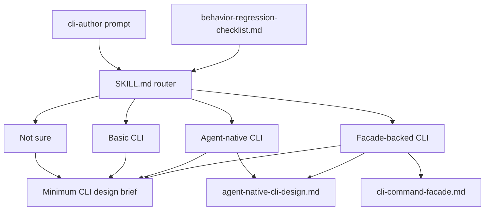

# docs: Rewrite cli-author product shape

## Summary

Rewrite `cli-author` as one compact CLI design front door with three lanes: Basic CLI, Agent-native CLI, and Facade-backed CLI. Keep `SKILL.md` short and route-oriented. Move deeper judgment into references, and keep deterministic contracts in owner paths, runtime code, generated help, and checks.

---

## Problem Frame

The current skill preserves the human-first CLI design coach, but the local agent-native and facade-backed behavior is blurred. "Agent-native" needs to mean a language-agnostic runtime-contract standard with risk-selected recipes. "Facade-backed" needs to mean the optional TypeScript runtime path, not "Bun TypeScript by default."

The rewrite restores the richer local behavior without forking the workflow, creating a parallel skill, or copying facade-owned schemas and helper APIs into prose.

---

## Requirements

**Router**

- R1. Route clear Basic CLI prompts directly to Basic mode.
- R2. Route explicit agent-native, machine-readable, repairable, recoverable, autonomous-agent-facing, runtime-contract, or agents/scripts-as-primary-users prompts to Agent-native mode.
- R3. Route explicit facade-backed, reusable facade code, facade runtime validation, or `@side-quest/cli-command-facade` prompts to Facade-backed mode.
- R4. Treat implementation language alone, including Bun TypeScript, as ambiguous rather than agent-native or facade-backed.
- R5. Offer a small numbered router only when intent is ambiguous: Basic CLI, Agent-native CLI, Facade-backed CLI, Not sure.

**Minimum CLI Design Brief**

- R6. Start every lane from the Minimum CLI design brief.
- R7. Keep the brief language-agnostic and prose-level.
- R8. Cover command name, purpose, users, invocation shape, help, output streams, exit codes, errors, side effects, config/env, non-interactive behavior, and smoke command.
- R9. Avoid copied schemas, generated envelopes, parser rules, runtime field catalogues, and helper signatures.

**Lane Behavior**

- R10. Preserve the human-first CLI design coach for Basic mode.
- R11. Make Agent-native mode apply the runtime-contract minimum in any language.
- R12. Add agent-native recipes only when risk or workflow value earns them.
- R13. Require owner naming before implementation in Agent-native and Facade-backed modes.
- R14. Require human handoff points for destructive, auth, billing, externally visible, or irreversible actions.
- R15. Make Facade-backed mode apply Agent-native mode plus the facade runtime path.

**Skill Shape**

- R16. Keep one `cli-author` skill and one workflow.
- R17. Keep `SKILL.md` compact: router, workflow order, minimum brief checklist, owner paths, and lane-neutral output skeleton.
- R18. Reframe `references/agent-native-cli-design.md` around runtime-contract minimum, recipe triggers, owners, safety, and review.
- R19. Prune `references/cli-command-facade.md` into a facade path map: trigger, owner paths, validation loop, proof expectations, and coach-filled gaps.
- R20. Add `references/behavior-regression-checklist.md` as the manual behavior-regression harness.
- R21. Do not create a new ADR. ADR 0009 already covers bounded local extension.

**Validation**

- R22. Validate YAML frontmatter after edits.
- R23. Run `skill-creator` quick validation against `skills/cli-author`.
- R24. Run manual prompt checks for Basic shell, ambiguous Bun TypeScript, Agent-native non-TypeScript, and Facade-backed Bun TypeScript.
- R25. Keep edits only when prompt checks improve routing without bloating `SKILL.md`.

---

## Key Technical Decisions

- **One skill, three lanes:** Keep Basic, Agent-native, and Facade-backed as modes inside `cli-author`, not separate skills. This preserves the shared CLI design workflow and avoids parallel policy.
- **Runtime-contract standard before runtime backend:** Agent-native is a design standard. Facade-backed is one optional backend. This prevents Bun TypeScript from becoming an accidental facade trigger.
- **Checklist before rewrite:** Add the manual behavior-regression checklist before or alongside skill edits so the implementer can compare observed routing against the intended product shape.
- **`SKILL.md` routes, references teach judgment:** `SKILL.md` should hold only the router, workflow order, brief checklist, owner pointers, and output skeleton. Reference docs can explain risk selection and facade implementation.
- **Owner paths replace copied contracts:** The plan names exact owner paths for deterministic behavior instead of restating facade field lists, output envelopes, parser rules, or helper signatures.
- **Validation is structural, not exact prose:** Manual checks should verify selected route and structural markers, not demand word-for-word output.

---

## High-Level Technical Design

---

## Scope Boundaries

**In Scope**

- Edit `skills/cli-author/SKILL.md`.
- Edit `skills/cli-author/references/agent-native-cli-design.md`.
- Edit `skills/cli-author/references/cli-command-facade.md`.
- Add `skills/cli-author/references/behavior-regression-checklist.md`.
- Run frontmatter, skill validation, and manual prompt checks.

**Out of Scope**

- Runtime code changes in `@side-quest/cli-command-facade`.
- New cli-author ADR.
- Separate agent-native CLI skill.
- Generated evaluator or deterministic scoring harness.
- Playground refresh unless manual checks expose a blocking stale artifact.

---

## Implementation Units

### U1. Manual Behavior-Regression Checklist

- **Goal:** Add the checklist that proves the rewrite preserves Basic behavior and restores advanced routing.
- **Requirements:** R20, R22, R24, R25
- **Files:**
  - `skills/cli-author/references/behavior-regression-checklist.md`
- **Approach:** Create a terse manual checklist with prompt, expected route, expected structural markers, observed route, observed markers, and before/after notes. Include at least four prompts: basic shell CLI, ambiguous Bun TypeScript CLI, agent-native Python or shell CLI, and facade-backed Bun TypeScript CLI.
- **Patterns to Follow:** `context/skill-design-philosophy.md` evidence loop; work-style bullets; origin AE1-AE6.
- **Test Scenarios:**
  - Covers R20/R24. The checklist includes all four required prompt families.
  - Covers R25. The checklist asks for structural markers, not exact prose.
  - Covers R9. The checklist includes a failure marker for copied schemas or facade field catalogues.
- **Verification:** Inspect the new file for all four prompt families and no deterministic evaluator claims.

### U2. Compact Skill Router And Brief

- **Goal:** Rewrite `SKILL.md` into a compact router plus shared Minimum CLI design brief.
- **Requirements:** R1-R10, R13-R17, R22, R23
- **Files:**
  - `skills/cli-author/SKILL.md`
- **Approach:** Keep frontmatter short with a quoted `description`. Replace the current "Agent-native or implementing?" trigger with explicit lane routing. Add the brief checklist and a smaller lane-neutral output skeleton. Keep owner pointers to `references/cli-guidelines.md`, `references/agent-native-cli-design.md`, and `references/cli-command-facade.md`.
- **Patterns to Follow:** `context/skill-design-philosophy.md`; `skills/cli-author/PROVENANCE.md`; `docs/adr/0009-cli-author-uses-bounded-local-extension.md`; current `SKILL.md` terse style.
- **Test Scenarios:**
  - Covers R1/R10. "create a shell CLI" routes to Basic mode and emits human-first CLI design without facade guidance.
  - Covers R4/R5. "create a Bun TypeScript CLI" offers the numbered router instead of choosing facade-backed.
  - Covers R6-R9. Every lane starts from the Minimum CLI design brief and avoids copied runtime contracts.
  - Covers R16/R17. The skill remains one workflow and stays short enough to scan.
- **Verification:** YAML-parse `SKILL.md`; run `skill-creator` quick validation for `skills/cli-author`; compare `SKILL.md` length and section count before/after.

### U3. Agent-Native Reference Reframe

- **Goal:** Reframe the agent-native reference around runtime-contract minimum, recipe triggers, owners, safety, and review.
- **Requirements:** R2, R7-R14, R18, R22, R24, R25
- **Files:**
  - `skills/cli-author/references/agent-native-cli-design.md`
- **Approach:** Keep the design-layer doc conceptual and language-agnostic. Name the runtime-contract minimum without copying facade shapes. Define recipe triggers for discovery, result contracts, agent hints, runtime action guidance, diagnostics, write previews, and alignment proofs. Preserve safety and human handoff guidance.
- **Patterns to Follow:** Existing terse bullets in `agent-native-cli-design.md`; `CONTEXT.md` terms; ADR 0009 bounded local extension.
- **Test Scenarios:**
  - Covers R11. Agent-native guidance works for Python, shell, Ruby, Go, or Bun.
  - Covers R12. Recipes are selected by risk or workflow value, not applied universally.
  - Covers R13/R14. Owner naming and high-stakes handoff points are explicit.
  - Covers R9. Exact facade fields, helper signatures, and runtime envelopes are absent.
- **Verification:** Search the reference for copied facade field catalogues, generated envelope examples, helper signatures, and language-specific defaults.

### U4. Facade Reference Prune

- **Goal:** Turn the facade reference into a path map for the optional runtime backend.
- **Requirements:** R3, R7-R9, R13, R15, R19, R22, R24, R25
- **Files:**
  - `skills/cli-author/references/cli-command-facade.md`
- **Approach:** Prune broad facade teaching into trigger, owner paths, validation loop, proof expectations, and coach-filled gaps. Point to package owners for exact contract shape, parser behavior, generated help, runtime envelope, diagnostics, and tests. Preserve enough guidance for a Facade-backed implementation to start confidently.
- **Patterns to Follow:** `docs/adr/0009-cli-author-uses-bounded-local-extension.md`; facade package ownership model; current facade reference headings that already separate design from runtime.
- **Test Scenarios:**
  - Covers R3/R15. Explicit facade prompts route to facade path after Agent-native design.
  - Covers R9/R19. Runtime fields and helper APIs are referenced by owner path, not restated as a mini-manual.
  - Covers R13. Contract, model, engine, discovery, CLI, and test owners are named before implementation.
  - Covers R24. Facade-backed Bun TypeScript prompt expects validation loop and alignment proof markers.
- **Verification:** Search for long facade field catalogues, output envelope examples, parser rules, and helper signature copies. Confirm owner paths replace them.

### U5. Validation Pass

- **Goal:** Prove the rewrite meets the requirements and did not bloat or drift.
- **Requirements:** R1-R25
- **Files:**
  - `skills/cli-author/SKILL.md`
  - `skills/cli-author/references/behavior-regression-checklist.md`
  - `skills/cli-author/references/agent-native-cli-design.md`
  - `skills/cli-author/references/cli-command-facade.md`
- **Approach:** Run the manual prompt checklist, YAML frontmatter parse, `skill-creator` quick validation, and targeted search scans. Inspect the final diff for unrelated changes.
- **Patterns to Follow:** `context/skill-design-philosophy.md` evidence loop; `skill-creator` validation guidance.
- **Test Scenarios:**
  - Covers AE1. Basic shell prompt produces Basic mode and human-first CLI design.
  - Covers AE2. Agent-native Python prompt applies runtime-contract minimum and risk-selected recipes without facade dependency.
  - Covers AE3. Facade-backed Bun TypeScript prompt applies Agent-native mode and follows facade path.
  - Covers AE4. Ambiguous Bun TypeScript prompt asks or offers rather than assuming facade.
  - Covers AE5. Copied schema, helper signature, runtime envelope, or parser-rule prose is rejected or moved to owner paths.
  - Covers AE6. Regression checklist catches lost advanced routing before the rewrite is accepted.
- **Verification:** Record checklist results in `behavior-regression-checklist.md`; run frontmatter parse and `skill-creator` quick validation; inspect targeted `rg` scans and final diff.

---

## Risks & Dependencies

- **Skill bloat:** Adding explicit router language can grow `SKILL.md`. Mitigate by replacing current broad sections with the minimum brief and owner pointers.
- **Facade mini-manual drift:** The facade reference can become stale if it copies runtime details. Mitigate by naming owner paths for exact shapes and keeping only path-map guidance.
- **Ambiguous Bun TypeScript prompts:** The model may still over-route to facade-backed. Mitigate with a dedicated checklist prompt and explicit router language.
- **Validation mismatch:** `skill-creator` quick validation may be stricter than this repo's existing skill metadata. Mitigate by recording the failure, preserving repo-owned metadata when needed, and still YAML-parsing frontmatter.

---

## Sources / Research

- Origin: `docs/brainstorms/2026-06-04-cli-author-product-shape-requirements.md`
- Current skill: `skills/cli-author/SKILL.md`
- Skill philosophy: `context/skill-design-philosophy.md`
- Provenance: `skills/cli-author/PROVENANCE.md`
- Agent-native reference: `skills/cli-author/references/agent-native-cli-design.md`
- Facade reference: `skills/cli-author/references/cli-command-facade.md`
- Upstream baseline: `skills/cli-author/references/cli-guidelines.md`
- Extension decision: `docs/adr/0009-cli-author-uses-bounded-local-extension.md`
- Skill validation workflow: `skill-creator`
