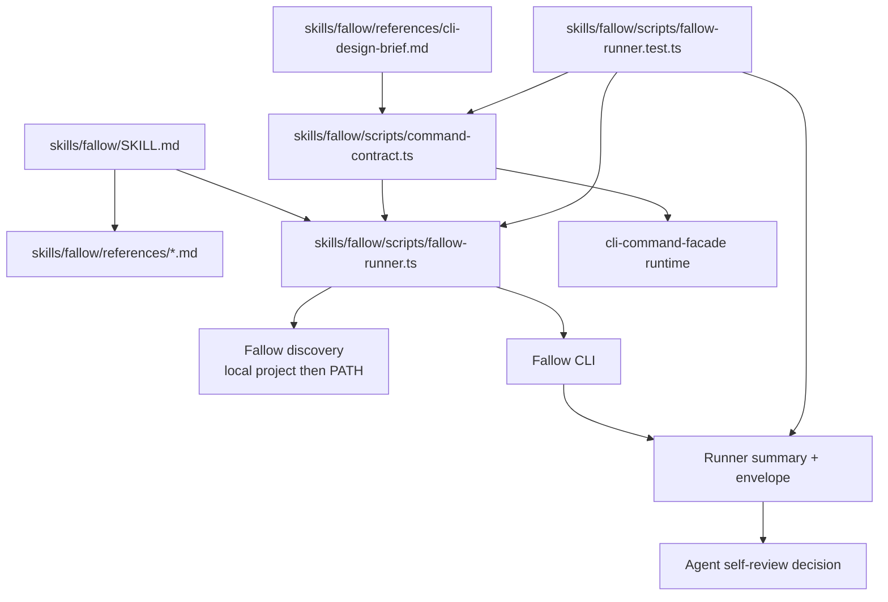

# feat: Fallow Agent-Native MVP v1

## Summary

Build `skills/fallow` as a repo-native agent self-review skill backed by a
facade-validated Fallow runner. V1 is a Runner Facade: it normalizes Fallow
execution, summarizes analyzer evidence, and makes blocked runs repairable
without owning workflow orchestration.

---

## Problem Frame

The decision queue is closed through Decision 26. The accepted product shape is
Fallow as deterministic analyzer evidence for agent self-review: dead code,
duplication, complexity, health, changed-code risk, and explicit fix preview or
apply. The skill should route agents toward the runner and references. The
runner should prove the command surface, not become a workflow policy engine.

The implementation needs to satisfy two repo rules at once:

- Keep `SKILL.md` tiny.
- Keep deterministic contracts in code, help, generated output, and tests.

---

## Success Definition

V1 succeeds when an agent can run `skills/fallow` after implementation work,
receive compact Fallow analyzer evidence through `fallow-runner`, see either
actionable issue references or a blocked-run repair hint, and choose the next
safe action without reading raw Fallow output.

Changed agent behavior is the success target. CI adoption is reference-only in
v1.

---

## CLI Design Brief

Lane: Facade-backed CLI.

- **Name:** `fallow-runner`.
- **Purpose:** Run Fallow as compact, parseable analyzer evidence for agents.
- **Users:** Agents first, humans and scripts second.
- **Invocation shape:** One executable with the accepted v1 subcommands from
  the decision log. Public targeting uses `--root`; the default target is the
  current directory. Audit accepts an optional base ref. Output controls include
  explicit raw-output inclusion and a public output-byte budget.
- **Help behavior:** Root and subcommand help advertise only accepted public
  inputs. `-h` and `--help` render help and do not run Fallow.
- **Output streams:** Primary envelope to stdout. Diagnostics, setup notes, and
  expected runtime errors to stderr.
- **Output modes:** JSON envelope only for v1. Human summaries can wait until
  real usage shows demand.
- **Exit codes:** Use the facade baseline and package-owned meanings in the
  command contract. Avoid prose-owned exit semantics.
- **Error style:** Usage errors identify invalid input. Runtime failures emit a
  blocked envelope with failure category and repair hints.
- **Side-effect stance:** Evidence modes read. Fix preview previews. Fix apply
  writes only through explicit apply mode.
- **Safety gates:** No auto-install. No telemetry setup. No watch mode. No
  baselines. No CI workflow generation. No runner-invoked skills.
- **Config/env behavior:** Trust checks inspect config presence and paths only.
  Fallow owns config semantics.
- **Non-interactive behavior:** No prompts. Agents receive branchable repair
  hints and retry safety.
- **Smoke command:** `doctor` on a JS/TS repo with Fallow available returns a
  standard ready envelope.

---

## V1 Activation Path

- Run after agent implementation, cleanup, or review-prep work.
- Start with `doctor` when Fallow availability or repo shape is unknown.
- Use `audit` for changed-code risk when git/base-ref context exists.
- Use `dead-code`, `dupes`, or `health` for an initial cleanup pass.
- Use `fix-preview` before any apply request.
- Use `fix-apply` only after the user explicitly authorizes applying Fallow
  fixes in the current task.
- Rerun the evidence command after changes and report before/after summary.

---

## Requirements

**Skill And References**

- R1. `skills/fallow/SKILL.md` routes agent self-review work to the runner and
  reference files.
- R2. `SKILL.md` points at owner paths instead of copying Fallow flags, schemas,
  facade fields, or output semantics.
- R3. `skills/fallow/references/commands.md` gives recipes and owner paths
  without becoming a copied CLI manual.
- R4. `skills/fallow/references/workflows.md` covers self-review, cleanup
  passes, preview, explicit apply, and rerun loops.
- R5. `skills/fallow/references/safety.md` covers apply policy, config trust,
  telemetry, watch mode, baselines, and mutation boundaries.
- R6. `skills/fallow/references/ci.md` explains CI adoption as reference-only
  guidance and does not generate workflow files.
- R7. `skills/fallow/PROVENANCE.md` names local decisions, research, official
  Fallow owner sources, and local adaptation status.

**Runner Contract**

- R8. The runner exposes the accepted v1 command modes as subcommands, with the
  exact literal set owned by `skills/fallow/scripts/command-contract.ts`.
- R9. The runner supports `--root` as the public target repo flag and does not
  add a public `--cwd`.
- R10. The runner supports optional audit base-ref input only on audit.
- R11. The runner resolves repo-local Fallow first, then PATH.
- R12. Missing Fallow reports setup failure and repair guidance. It does not
  auto-install.
- R13. The runner emits a stable JSON envelope with status, failure category,
  write effect, summary, actionable issue references when Fallow supplies them,
  config-scope metadata, command observability, output-budget metadata, and
  repair hints. Exact shape and literals live in contract code, help, generated
  output, and tests.
- R14. Evidence modes use mode-specific analyzer findings, verdicts, or score
  data for issue status. Setup, input, Fallow runtime, parse, budget, and safety
  failures use blocked status.
- R15. Summary is emitted by default. Raw parsed Fallow output is omitted unless
  explicitly requested.
- R16. Output budget behavior keeps summary evidence when possible and omits
  raw output instead of truncating it.
- R17. Budget failure blocks only when the runner cannot produce usable summary
  evidence.
- R18. Repair hints are structured and use the accepted tiny action vocabulary
  from the decision log. Contract code and tests own exact action literals.
- R19. `doctor` is a normal runner subcommand and returns the standard envelope.
- R20. `doctor` is read-only and bounded to mandatory readiness, optional
  readiness, binary resolution, version when cheap, repo shape, git readiness
  for audit, JSON-capable command path, and config presence/path signals.

**Safety And Scope**

- R21. Fix preview maps to Fallow dry-run behavior and records previewed write
  evidence without mutating source.
- R22. Fix apply runs only through explicit apply subcommand behavior, and the
  skill workflow calls it only after current-task user authorization.
- R23. Apply requests outside explicit apply are blocked as safety failures.
- R24. Config presence can add safety or inspection hints but does not block
  evidence modes by itself. Runner results label evidence as scoped to the
  observed config presence and config paths.
- R25. V1 does not invoke other skills, own thresholds, own baselines, own CI
  policy, generate CI workflows, enable telemetry, or run watch mode.

**Proof**

- R26. The facade contract validates at construction.
- R27. Discovery metadata, rendered help, parser acceptance/rejection, and
  runtime semantics are proven against one surface.
- R28. Tests cover every advertised subcommand.
- R29. Tests cover accepted public flags and rejected foreign or unsupported
  flags.
- R30. Tests cover blocked-run repair hints for setup, input, Fallow runtime,
  parse, budget, and safety representatives.
- R31. Tests cover local-first binary resolution, PATH fallback, and missing
  binary.
- R32. Tests cover budget-preserved summary, raw-output inclusion, raw-output
  omission, and summary-impossible budget failure.
- R33. Live compatibility proof checks current Fallow CLI help and JSON-capable
  execution against a disposable JS/TS fixture before v1 is declared complete.

---

## Scope Boundaries

In scope:

- Add `skills/fallow/`.
- Add a facade-backed runner surface.
- Add script-local package, typecheck, and tests.
- Add skill references and provenance.
- Add a CLI design brief before runner implementation.
- Use Fallow runtime output as analyzer evidence.

Out of scope:

- Workflow Facade behavior.
- Automatic fixing after scans.
- Fallow installation.
- Telemetry setup.
- Watch mode.
- Baselines.
- CI workflow generation.
- Runner-invoked skills.
- Per-finding refactor plans.
- Fallow config semantic linting.
- Public `--cwd`.
- Public `--mode`.
- Full Fallow schema documentation in skill prose.

---

## Owners

- Skill router: `skills/fallow/SKILL.md`.
- Provenance: `skills/fallow/PROVENANCE.md`.
- CLI design brief: `skills/fallow/references/cli-design-brief.md`.
- Command recipes: `skills/fallow/references/commands.md`.
- Workflow recipes: `skills/fallow/references/workflows.md`.
- Safety reference: `skills/fallow/references/safety.md`.
- CI reference: `skills/fallow/references/ci.md`.
- Script package: `skills/fallow/scripts/package.json`.
- TypeScript config: `skills/fallow/scripts/tsconfig.json`.
- Contract owner: `skills/fallow/scripts/command-contract.ts`.
- Model owner: `skills/fallow/scripts/fallow-runner.ts`.
- Engine owner: `skills/fallow/scripts/fallow-runner.ts`.
- Discovery owner: `skills/fallow/scripts/fallow-runner.ts`.
- CLI owner: `skills/fallow/scripts/fallow-runner.ts`.
- Test owner: `skills/fallow/scripts/fallow-runner.test.ts`.
- Live smoke test owner: `skills/fallow/scripts/fallow-runner.live.test.ts`.

Start with one runner file for model, engine, discovery, and CLI. Extract
separate model, engine, or discovery files only if implementation complexity
earns the split.

---

## Key Technical Decisions

- KTD1. Keep v1 as a Runner Facade: the runner normalizes one Fallow invocation
  at a time and returns repairable evidence. Workflow orchestration stays in
  skill prose and future work.
- KTD2. Use facade-backed implementation from day one: the runner is
  agent-facing, parseable, and repairable, so discovery, help, argv behavior,
  and runtime semantics need drift proof.
- KTD3. Put exact runtime vocabulary in code and tests: subcommands, flags,
  status values, failure categories, write effects, repair actions, budget
  metadata, issue references, config-scope metadata, and envelope shape should
  be contract-owned.
- KTD4. Summarize by default: raw Fallow output can be large. The default path
  should give agents aggregate evidence and budget metadata.
- KTD5. Keep `doctor` bounded: readiness diagnostics help agents repair setup
  failures, but deep config or install policy would widen v1.
- KTD6. Prefer local Fallow resolution: project-local tools match repo policy,
  while PATH fallback keeps global installs usable.
- KTD7. Treat fix apply as explicit mutation: preview is normal self-review,
  apply is a separately tested write path.
- KTD8. Keep references thin: they teach when to run the runner and how to
  inspect results, not Fallow internals or facade schemas.

---

## High-Level Technical Design

---

## Implementation Units

### U1. Create Skill Shell And CLI Design Brief

**Goal:** Establish the skill artifact shape and design front door before code.

**Requirements:** R1, R2, R3, R4, R5, R6, R7

**Files:**

- Add: `skills/fallow/SKILL.md`.
- Add: `skills/fallow/PROVENANCE.md`.
- Add: `skills/fallow/references/cli-design-brief.md`.
- Add: `skills/fallow/references/commands.md`.
- Add: `skills/fallow/references/workflows.md`.
- Add: `skills/fallow/references/safety.md`.
- Add: `skills/fallow/references/ci.md`.

**Approach:**

- Write `SKILL.md` as a tiny router: trigger, hot path, owner paths, safety
  gates, and verification pointers.
- Keep depth in references.
- Put the Minimum CLI Design Brief in `cli-design-brief.md`.
- Point `commands.md` at runner help and owner paths for exact command
  behavior.
- Put source lineage and adaptation status in `PROVENANCE.md`.
- YAML-parse `SKILL.md` frontmatter after editing.

**Test Scenarios:**

- `SKILL.md` frontmatter parses as YAML.
- `SKILL.md` description is a short trigger phrase.
- `SKILL.md` does not copy Fallow schemas, facade fields, or exact envelope
  contracts.
- References point to runner owner files and local source docs.
- `commands.md` does not become the exact runtime contract source.

**Verification:**

- Use a YAML parser for `skills/fallow/SKILL.md`.
- Inspect skill references for owner paths and copied-contract drift.

### U2. Add Script Package And Facade Contract Owner

**Goal:** Create the script-local TypeScript surface and package-owned contract
module before runtime logic.

**Requirements:** R8, R13, R18, R26, R27

**Files:**

- Add: `skills/fallow/scripts/package.json`.
- Add: `skills/fallow/scripts/tsconfig.json`.
- Add: `skills/fallow/scripts/command-contract.ts`.
- Add: `skills/fallow/scripts/fallow-runner.test.ts`.
- Add: `skills/fallow/scripts/fallow-runner.live.test.ts`.

**Approach:**

- Mirror the script-local package shape from `skills/browser-use/scripts/` and
  `skills/browser-domain-memory/scripts/`.
- Add script-local `test` and `typecheck` commands.
- Depend on `@side-quest/cli-command-facade`, `typescript`, and `bun-types`
  through the script-local package, following
  `skills/create-cli/references/cli-command-facade.md`.
- Make `bun install` from `skills/fallow/scripts` the dependency setup path.
- Add a setup check that imports `@side-quest/cli-command-facade` before runtime
  implementation begins.
- Declare package-owned command metadata and result-contract identity in
  `command-contract.ts`.
- Keep package-owned literal values close to the contract.
- Use facade validation helpers in tests.

**Test Scenarios:**

- `parseCommandFacadeContract` accepts the Fallow runner contract.
- No command declares facade-reserved diagnostic flags.
- Command discovery projects every advertised v1 subcommand.
- Result-contract identity and schema version are discoverable.
- Contract-owned literal arrays reject unknown repair action values through
  type or runtime construction checks.
- Dependency setup resolves `@side-quest/cli-command-facade` from the
  script-local package.
- Typecheck proves facade imports before Fallow runtime code is added.

**Verification:**

- `cd skills/fallow/scripts && bun install`.
- `cd skills/fallow/scripts && bun test fallow-runner.test.ts`.
- `cd skills/fallow/scripts && bun run typecheck`.

### U3. Implement Parser, Help, And Discovery Alignment

**Goal:** Make public argv behavior match command discovery and rendered help.

**Requirements:** R8, R9, R10, R26, R27, R28, R29

**Files:**

- Add: `skills/fallow/scripts/fallow-runner.ts`.
- Modify: `skills/fallow/scripts/command-contract.ts`.
- Modify: `skills/fallow/scripts/fallow-runner.test.ts`.

**Approach:**

- Implement root help, subcommand help, and version output through the facade
  path.
- Accept only the public inputs from accepted decisions.
- Reject unsupported public-looking controls such as cwd, mode, watch,
  baseline, and CI generation.
- Keep parser acceptance proven through public `runForTest` behavior.
- Use `assertCommandHelpFlagSurface` so help and contract flags stay aligned.

**Test Scenarios:**

- Root help lists the accepted subcommands and no unsupported modes.
- Each subcommand help advertises only its accepted flags.
- `-h` and `--help` return help and do not invoke Fallow.
- Every accepted subcommand is accepted by parser tests.
- Unknown subcommands return usage failure.
- Unknown flags return usage failure.
- Audit accepts base-ref input.
- Non-audit commands reject audit-only base-ref input.
- `--root` accepts valid paths and rejects invalid paths.
- Public `--cwd`, `--mode`, watch, baseline, and CI-generation controls are
  rejected.

**Verification:**

- `cd skills/fallow/scripts && bun test fallow-runner.test.ts`.

### U4. Implement Discovery And Doctor Runtime

**Goal:** Make environment readiness observable without mutation.

**Requirements:** R11, R12, R19, R20, R24, R31

**Files:**

- Modify: `skills/fallow/scripts/fallow-runner.ts`.
- Modify: `skills/fallow/scripts/fallow-runner.test.ts`.
- Modify: `skills/fallow/references/safety.md`.

**Approach:**

- Add injectable runtime seams for cwd, filesystem checks, command lookup, git
  checks, and process execution.
- Resolve Fallow from target repo local paths before PATH.
- Detect JS/TS repo shape conservatively.
- Report config presence and paths without parsing config semantics.
- Check audit git readiness separately from general repo readiness.
- Keep `doctor` read-only.

**Test Scenarios:**

- Default root uses the current directory.
- Explicit root changes the target repo.
- Invalid root returns input failure with repair hint.
- Unsupported repo shape returns setup failure.
- Local Fallow is preferred over PATH Fallow.
- PATH Fallow is used when no local binary exists.
- Missing Fallow returns setup failure and setup guidance.
- `doctor` returns ok status when mandatory readiness checks pass and optional
  readiness checks pass.
- `doctor` returns issues status when mandatory readiness passes but optional
  readiness, such as audit git readiness, is incomplete.
- `doctor` returns blocked status when mandatory readiness fails.
- `doctor` reports config presence and config paths.
- `doctor` does not parse or judge config semantics.
- Audit readiness reports missing git as optional readiness failure in `doctor`
  and setup failure in `audit`.

**Verification:**

- `cd skills/fallow/scripts && bun test fallow-runner.test.ts`.

### U5. Implement Fallow Execution And Summary Semantics

**Goal:** Execute Fallow, parse structured output, and return compact analyzer
evidence.

**Requirements:** R13, R14, R15, R18, R28, R30, R33

**Files:**

- Modify: `skills/fallow/scripts/fallow-runner.ts`.
- Modify: `skills/fallow/scripts/fallow-runner.test.ts`.
- Modify: `skills/fallow/scripts/fallow-runner.live.test.ts`.
- Modify: `skills/fallow/references/commands.md`.

**Approach:**

- Build the Fallow argv from command contract decisions.
- Echo the executed command in the envelope.
- Categorize stderr coarsely.
- Parse JSON stdout through mode-specific summary mappers.
- Preserve actionable issue references when Fallow supplies file, range, rule,
  category, action, or finding identifiers.
- Avoid inventing zero findings when a mode emits verdict or score data instead
  of a findings array.
- Treat non-JSON stdout as parse failure.
- Treat Fallow execution failure before usable evidence as Fallow failure.
- Keep per-finding plans out of the runner.
- Include raw parsed Fallow output only when requested and within budget.
- Add live compatibility smoke coverage for Fallow help and JSON-capable output
  on a disposable JS/TS fixture when Fallow is available.

**Test Scenarios:**

- Each evidence subcommand maps to the expected Fallow command path.
- Audit without base ref lets Fallow use its default.
- Audit with base ref reflects that input in the executed command.
- No findings returns clean analyzer status.
- Findings return issue status, aggregate counts, and actionable issue
  references when Fallow supplies them.
- Auto-fixable findings increment aggregate auto-fixable count when Fallow
  output supports it.
- Health or audit output without a uniform findings array still produces
  truthful mode-specific summary evidence.
- Raw Fallow output is omitted by default.
- Raw Fallow output is included only when explicitly requested and within
  budget.
- Non-JSON stdout returns parse failure with repair guidance.
- Fallow non-zero runtime failure returns Fallow failure with repair guidance.
- Stderr category is coarse and stable.
- Live smoke checks current Fallow help and one JSON-capable command path when
  `FALLOW_RUNNER_LIVE=1`.

**Verification:**

- `cd skills/fallow/scripts && bun test fallow-runner.test.ts`.
- `cd skills/fallow/scripts && FALLOW_RUNNER_LIVE=1 bun test fallow-runner.live.test.ts`.

### U6. Implement Output Budget Behavior

**Goal:** Keep runner output agent-readable without losing usable summary
evidence.

**Requirements:** R15, R16, R17, R32

**Files:**

- Modify: `skills/fallow/scripts/fallow-runner.ts`.
- Modify: `skills/fallow/scripts/fallow-runner.test.ts`.
- Modify: `skills/fallow/references/commands.md`.

**Approach:**

- Apply the public output-byte budget after parsing.
- Omit raw output when it exceeds budget.
- Preserve summary when summary fits.
- Mark budget state in the envelope through contract-owned metadata.
- Avoid partial raw-output truncation.
- Return budget failure only when usable summary cannot be produced.

**Test Scenarios:**

- Valid output budget values are accepted.
- Invalid output budget values return usage failure.
- Large raw output is omitted when over budget.
- Summary remains when raw output is over budget.
- Explicit raw-output requests still receive budget metadata when raw is
  omitted.
- Summary-impossible output returns blocked budget failure.
- Budget failure emits reduce-output repair guidance.

**Verification:**

- `cd skills/fallow/scripts && bun test fallow-runner.test.ts`.

### U7. Implement Fix Preview And Explicit Apply Safety

**Goal:** Support the write paths while keeping mutation intentional and
inspectable.

**Requirements:** R21, R22, R23, R24, R25

**Files:**

- Modify: `skills/fallow/scripts/fallow-runner.ts`.
- Modify: `skills/fallow/scripts/fallow-runner.test.ts`.
- Modify: `skills/fallow/references/safety.md`.
- Modify: `skills/fallow/references/workflows.md`.

**Approach:**

- Map fix preview to Fallow dry-run behavior.
- Map fix apply to explicit apply behavior only.
- Report previewed or applied write effect from actual command path.
- Block apply-shaped requests outside explicit apply.
- Treat the explicit apply subcommand as the runner mutation boundary.
- Make `workflows.md` and `safety.md` require current-task user authorization
  before an agent invokes fix apply.
- Surface config-present safety hints before mutation and label apply evidence
  as config-scoped.
- Do not block fix apply solely because config files are present.
- Do not add prompts; non-interactive behavior stays deterministic.

**Test Scenarios:**

- Fix preview invokes dry-run behavior and reports previewed write effect.
- Fix preview does not mutate source in the runner test harness.
- Fix apply invokes explicit apply behavior and reports applied write effect
  only after success.
- Failed apply returns blocked status and non-none failure category.
- Apply attempt outside explicit apply returns safety failure.
- Config-present apply path includes inspect-config safety hint and config-scope
  metadata.
- Config-present apply path does not block solely because config files are
  present.
- Evidence modes never auto-apply fixes.
- Workflow reference contains an explicit user-authorization gate before
  `fix-apply`.

**Verification:**

- `cd skills/fallow/scripts && bun test fallow-runner.test.ts`.

### U8. Prove Blocked-Run Repair Hints

**Goal:** Make failures branchable for agents without expanding into workflow
policy.

**Requirements:** R18, R30

**Files:**

- Modify: `skills/fallow/scripts/command-contract.ts`.
- Modify: `skills/fallow/scripts/fallow-runner.ts`.
- Modify: `skills/fallow/scripts/fallow-runner.test.ts`.
- Modify: `skills/fallow/references/workflows.md`.

**Approach:**

- Centralize failure normalization.
- Map representative blocked states to one primary repair hint.
- Include retry safety in each hint.
- Keep repair action literals in the contract module.
- Keep messages human-readable and small.
- Avoid per-finding repair plans.

**Test Scenarios:**

- Missing Fallow emits setup repair guidance.
- Invalid root emits input repair guidance.
- Invalid audit base ref emits input repair guidance.
- Non-JSON stdout emits parse repair guidance.
- Fallow runtime failure emits run recovery guidance.
- Budget failure emits output reduction guidance.
- Safety block emits safety or config inspection guidance.
- Retry action appears only when same-input retry is safe.
- Unknown repair action literals are rejected by contract-owned checks.

**Verification:**

- `cd skills/fallow/scripts && bun test fallow-runner.test.ts`.

### U9. Finish Skill References And Provenance Against Runtime Owners

**Goal:** Align docs with the implemented owner paths without copying exact
runtime contracts.

**Requirements:** R1, R2, R3, R4, R5, R6, R7, R25

**Files:**

- Modify: `skills/fallow/SKILL.md`.
- Modify: `skills/fallow/PROVENANCE.md`.
- Modify: `skills/fallow/references/commands.md`.
- Modify: `skills/fallow/references/workflows.md`.
- Modify: `skills/fallow/references/safety.md`.
- Modify: `skills/fallow/references/ci.md`.
- Modify: `skills/fallow/references/cli-design-brief.md`.

**Approach:**

- Update references after runner tests define the actual owner contracts.
- Keep `commands.md` recipe-level and point agents to `--help` for exact
  current syntax.
- Keep `workflows.md` focused on self-review and rerun loops.
- Keep `safety.md` focused on mutation, config inspection, and excluded v1
  behaviors.
- Keep `ci.md` reference-only and adoption-sequence oriented.
- Record official Fallow source docs and local decision docs in provenance.

**Test Scenarios:**

- `SKILL.md` still routes, not explains.
- References name owner paths.
- References do not copy facade field catalogues.
- References do not copy Fallow output schemas.
- CI reference does not add workflow generation steps.
- Safety reference states config trust as presence and paths only.

**Verification:**

- YAML-parse `skills/fallow/SKILL.md`.
- Re-read `context/skill-design-philosophy.md` before final skill edits.

### U10. Run Contract, Type, Lint, And Startup Delivery Checks

**Goal:** Prove the implementation is ready for agent use.

**Requirements:** R26, R27, R28, R29, R30, R31, R32, R33

**Files:**

- Test: `skills/fallow/scripts/fallow-runner.test.ts`.
- Test: `skills/fallow/scripts/fallow-runner.live.test.ts`.
- Test config: `skills/fallow/scripts/package.json`.
- Test config: `skills/fallow/scripts/tsconfig.json`.
- Project check: `package.json`.

**Approach:**

- Run focused Fallow runner tests.
- Run live compatibility smoke only when Fallow is installed or locally
  resolvable.
- Run script-local typecheck.
- Run project Biome check.
- If startup instruction delivery is touched, run
  `scripts/agent-instructions.sh`.
- Prefer MCP runner equivalents from `context/bun-runner.md` when available.

**Test Scenarios:**

- Facade contract validation passes.
- Command Surface Alignment Proof passes.
- Parser acceptance and rejection tests pass.
- Runtime semantics tests pass with stubbed Fallow.
- Live compatibility smoke passes or records an explicit skip reason before
  release.
- Budget behavior tests pass.
- Blocked-run repair hint tests pass.
- Typecheck passes from `skills/fallow/scripts/tsconfig.json`.
- Biome check passes for changed files.

**Verification:**

- `cd skills/fallow/scripts && bun test fallow-runner.test.ts`.
- `cd skills/fallow/scripts && FALLOW_RUNNER_LIVE=1 bun test fallow-runner.live.test.ts`.
- `cd skills/fallow/scripts && bun run typecheck`.
- `bun run biome:check`.

---

## Acceptance Examples

- AE1. Given a JS/TS repo with Fallow available and no analyzer findings, when
  an agent runs an evidence subcommand, then the runner returns usable summary
  evidence with clean status and no raw output by default.
- AE2. Given Fallow returns analyzer findings with file or finding references,
  when the runner parses the output, then the envelope reports issue status,
  aggregate summary counts, and actionable issue references.
- AE3. Given Fallow is unavailable, when an agent runs any non-help subcommand,
  then the runner returns blocked setup failure and setup guidance without
  installing anything.
- AE4. Given audit receives an invalid base ref, when the runner validates the
  run, then it returns blocked input failure and fix-input guidance.
- AE5. Given raw output exceeds budget but summary fits, when raw output was
  requested, then the runner omits raw output, keeps summary, and marks budget
  metadata.
- AE6. Given output budget prevents usable summary evidence, when the runner
  executes, then it returns blocked budget failure and output reduction
  guidance.
- AE7. Given fix preview is requested, when Fallow returns preview output, then
  the runner reports previewed write effect without mutation.
- AE8. Given fix apply is explicitly requested by the user and succeeds, when
  Fallow completes, then the runner reports applied write effect.
- AE9. Given apply-shaped behavior is requested outside explicit apply, when
  the runner validates safety, then it returns blocked safety failure.
- AE10. Given config files are present, when `doctor` runs, then it reports
  config paths, labels evidence as config-scoped, and does not judge config
  semantics.
- AE11. Given Fallow is available for a live smoke run, when
  `fallow-runner.live.test.ts` runs against a disposable JS/TS fixture, then
  current Fallow help and JSON-capable execution match the runner mapping or
  the test blocks release with compatibility evidence.

---

## Existing Patterns

- `skills/create-cli/SKILL.md` owns the CLI design brief shape.
- `skills/create-cli/references/agent-native-cli-design.md` owns the
  agent-native runtime-contract minimum.
- `skills/create-cli/references/cli-command-facade.md` owns the facade-backed
  implementation path.
- `skills/browser-use/scripts/command-contract.ts` shows local facade contract
  ownership and package-owned vocabulary placement.
- `skills/browser-use/scripts/browser-use.test.ts` shows discovery, help,
  parser, and runtime tests in one script-local suite.
- `skills/browser-use/scripts/package.json` shows executable script-local
  facade dependency setup.
- `skills/browser-use/scripts/preflight-browser-adapter.test.ts` shows Command
  Surface Alignment Proof with `assertCommandHelpFlagSurface`.
- `skills/browser-use/scripts/tsconfig.json` and
  `skills/browser-domain-memory/scripts/package.json` show script-local TypeScript
  and facade dependency setup.
- `skills/browser-use/PROVENANCE.md` shows adapted skill source lineage and
  local owner paths.

---

## Risks And Dependencies

- **Fallow CLI drift:** Mitigate by resolving Fallow at runtime, using `doctor`,
  avoiding copied Fallow contracts, testing runner behavior with fixtures, and
  running live compatibility smoke before release.
- **Facade package availability:** Mitigate with script-local package setup,
  typecheck, and a clear setup failure when the local facade link is missing.
- **Over-documenting contracts:** Mitigate by keeping exact literals in
  `command-contract.ts`, help, runtime output, and tests.
- **Output parser assumptions:** Mitigate with representative Fallow fixture
  tests, mode-specific summary mappers, live smoke, and parse failure recovery.
- **Write blast radius:** Mitigate with preview default, explicit apply, config
  inspection hints, current-task user authorization, and no prompts.
- **Doctor scope creep:** Mitigate by limiting checks to presence, paths,
  readiness, and cheap version signals.
- **Official skill duplication:** Mitigate by treating the official Fallow skill
  as a source, while keeping this repo-native wrapper focused on local facade,
  repair, and safety contracts.
- **Repo-shape false negatives:** Mitigate by reporting conservative setup
  failures with repair hints instead of silently running against an unsupported
  project shape.

---

## Sources

- `AGENTS.md`.
- `context/skill-design-philosophy.md`.
- `context/bun-runner.md`.
- `docs/decisions/2026-06-04-fallow-agent-native-decision-log.md`.
- `docs/research/2026-06-04-fallow-ai-code-quality-tool.md`.
- `docs/research/2026-06-04-fallow-agent-lens.md`.
- `skills/create-cli/SKILL.md`.
- `skills/create-cli/references/cli-guidelines.md`.
- `skills/create-cli/references/agent-native-cli-design.md`.
- `skills/create-cli/references/cli-command-facade.md`.
- `skills/browser-use/scripts/command-contract.ts`.
- `skills/browser-use/scripts/browser-use.test.ts`.
- `skills/browser-use/scripts/preflight-browser-adapter.test.ts`.
- `skills/browser-use/PROVENANCE.md`.
